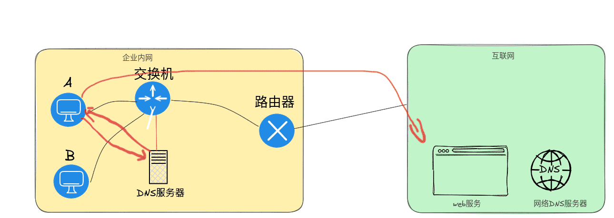

# 原理图



# 使用的好处

> 1. **提高网络访问速度**：
>    - 当用户或客户端发起域名解析请求时，如果DNS缓存服务器已经保存了该域名对应的IP地址，则可以直接从本地缓存中返回结果，无需再次向上游的DNS服务器进行递归查询。这显著减少了网络延迟和响应时间，使得网页、应用或其他互联网服务加载更快。
> 2. **降低网络负载与带宽消耗**：
>    - 缓存可以减少对上游DNS服务器的查询请求次数，减轻DNS服务器集群的压力，同时也降低了因频繁查询带来的网络带宽消耗。
> 3. **提升稳定性与可用性**：
>    - 即使在DNS服务器出现故障或网络不稳定的情况下，已缓存的DNS记录仍然可以让客户端继续访问已知的网站和服务，提高了系统的稳定性和可用性。
> 4. **优化内部网络环境**：
>    - 在企业内部网络环境中，内部DNS缓存服务器可以加速内部域名的解析，并且对于经常访问的外部站点也可以缓存其解析结果，从而改善内部用户的网络体验。
> 5. **避免循环查询与重复解析**：
>    - 对于短时间内反复访问相同域名的用户或设备，本地（如浏览器、操作系统或路由器）的DNS缓存能够避免不必要的重复查询，减少系统资源消耗。
> 6. **防范DDoS攻击**：
>    - DNS缓存服务器可以在一定程度上缓解针对DNS基础设施的大规模分布式拒绝服务（DDoS）攻击，通过分散流量和提供部分防御能力。
> 7. **数据隐私保护**：
>    - 用户的DNS查询记录被保留在本地或者公司内部的DNS缓存服务器中，而不是直接发送到第三方或公共DNS服务器，有助于增强数据隐私和安全。

## 服务搭建

### 环境准备

> 三台机器关闭防火墙，selinux以便测试

| 主机名 |              |               |
| ------ | ------------ | ------------- |
| server | 192.168.88.5 | DNS主服务器   |
| pc1    | 192.168.88.6 | DNS缓存服务器 |
| pc2    | 192.168.88.7 | 客户机        |

### 服务器搭建

> 基础的环境搭建不再赘述

```shell
# 修改缓存服务器
[root@pc1 ~]# vim /etc/named.conf 
options {
        directory       "/var/named";
        forwarders { 192.168.88.5; }; # 配置需要转发的dns服务器IP地址
};
[root@pc1 ~]# systemctl restart named
```

> pc1做为DNS缓存服务器，可以有单独的地址库文件和zong也可以没有只做一个转发

### 测试

```shell
[root@pc2 ~]# nslookup www.coke.cn 192.168.88.6
Server:         192.168.88.6
Address:        192.168.88.6#53

Non-authoritative answer:
Name:   www.coke.cn
Address: 192.168.8.100
```

