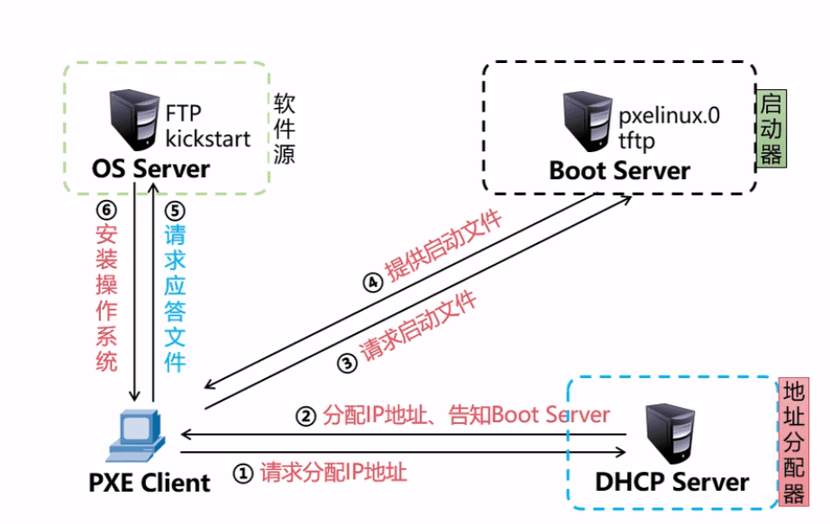
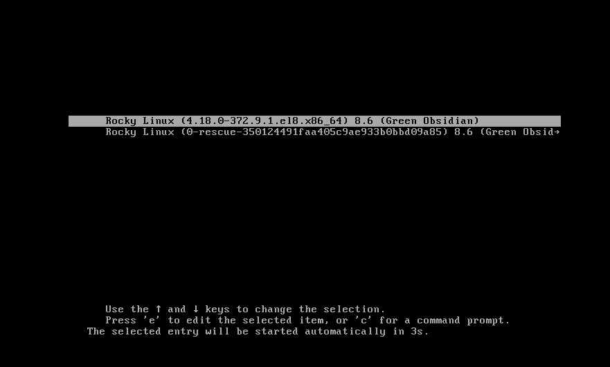

# 概述

>网络装机的优势：
>
>+ 规模化：同时装多台主机
>+ 自动化：装系统、配置各种服务
>+ 远程实现：不需要光盘、U盘等物理安装介质
>
>开机启动项的基本顺序：系统由上向下去寻找安装系统的方式(匹配即停止)
>
>1. 硬盘 
>
>2. 光驱设备
>
>3. U盘
>
>4. 网卡进行网络引导
>
>   没有装系统的裸机只需要网络与PXE服务在同一网络即可
>
>什么是PXE：
>
>+ PXE：Pre-boot eXecution Environment
>+ 预启动执行环境，在操作系统之前运行
>+ 可远程安装
>
>工作模式：
>
>+ PXE client 集成在网卡的启动芯片中
>+ 当计算机引导时，从网卡芯片中把PXE client调入内存执行，获取PX server配置、显示菜单，根据用户选择将远程文件引导程序下载到本机运行
>
>PXE需要那些服务组件：(可以安装在不同的服务器上，但是建议安装在同一台服务器上)
>
>+ DHCP服务，分配IP地址、定位引导程序
>+ TFTP服务，提供引导程序下载
>+ FTP服务(或HTTP/NFS)，提供yum安装源
>
>客户机应具备的条件：
>
>+ 网卡芯片必须支持PXE协议
>+ 主板支持从网卡启动
>
>PXE组件过程分析
>
>

# 配置PXE服务

> 前提关闭机器的防火墙与设置selinux
>
> 是一台镜像文件安装的虚拟机(后面需要用到光盘镜像内容)；mount /dev/cdrom挂载到/mydvd  (创建文件夹mydvd)
>
> 配置PXE服务需要配置三个服务才能正常装机
>
> + DHCP服务
> + TFTP服务
> + FTP服务
>
> 下面将所有服务都安装在搭建的这台PXE服务器上

## 配置DHCP

```shell
]#dnf -y install dhcp-server
]#vim /etc/dhcp/dhcpd.conf
subnet 192.168.88.0 netmask 255.255.255.0 {
  range 192.168.88.100 192.168.88.200;
  option domain-name-servers 8.8.8.8;
  option routers 192.168.88.254;
  next-server 192.168.88.12; # 指明下一个服务(tftp服务)的地址(建议所有服务都在同一台服务器上)
  filename "pxelinux.0"; # 指明去这个服务上找什么文件
} 
systemctl start dhcpd
```

## 配置TFTP服务

> TFTP服务概述
>
> + 小文件传输协议，UDP69端口
> + 用来传送小文件，不支持认证和复杂FTP操作
> + 默认资源目录：/var/lib/tftpboot
> + 就算客户端没有操作系统也能进行数据传输

```shell
# 安装服务
]#dnf -y install tftp-server

# 启动服务
]#systemctl start tftp
]#ls /var/lib/tftpboot/

# 生成二进制的引导文件 pxelinux.0
]#dnf -y install syslinux
]#cp /usr/share/syslinux/pxelinux.0 /var/lib/tftpboot/


# 部署菜单文件；前提已经将光盘文件挂载到mydvd下面
# 创建pxlinux.0指定的目录文件(必须一致);此文件为菜单文件引导用户可以装不同的操作系统，类时使用光盘安装linux是弹出界面选择安装install Centos 7
]#mkdir /var/lib/tftpboot/pxelinux.cfg
# 拷贝菜单文件进行修改
]#cp /mydvd/isolinux/isolinux.cfg /var/lib/tftpboot/pxelinux.cfg/default
# 拷贝图形菜单的程序文件
]# cp /mydvd/isolinux/vesamenu.c32 /var/lib/tftpboot/
# 拷贝图形菜单背景图(可以自定义，大小限制在256像素以内)
]# cp /mydvd/isolinux/splash.png /var/lib/tftpboot/
# 拷贝启动内核：管理系统谁先启动谁后启动
]# cp /mydvd/isolinux/vmlinuz /var/lib/tftpboot/
# 拷贝启动内核所需要的驱动程序
]# cp /mydvd/isolinux/initrd.img /var/lib/tftpboot/

# 修改菜单文件内容
]#vim /var/lib/tftpboot/pxelinux.cfg/default
11 menu title yuanhang  # 装机时的标题名字
63 menu default # 在62行下添加一行，设置默认的选择
64 append initrd=initrd.img  # 删除64行下所有内容，因为只做一个选项
# 修改完毕后:wq! 强制保存退出
```

> 图形菜单参考图：选择的内容、背景图

