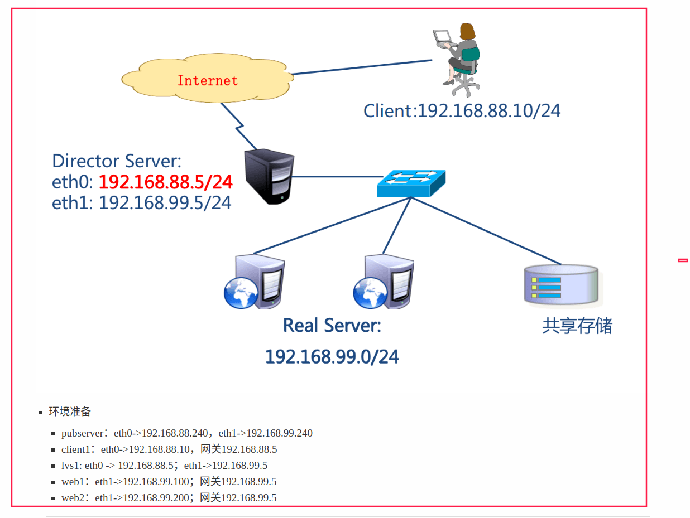
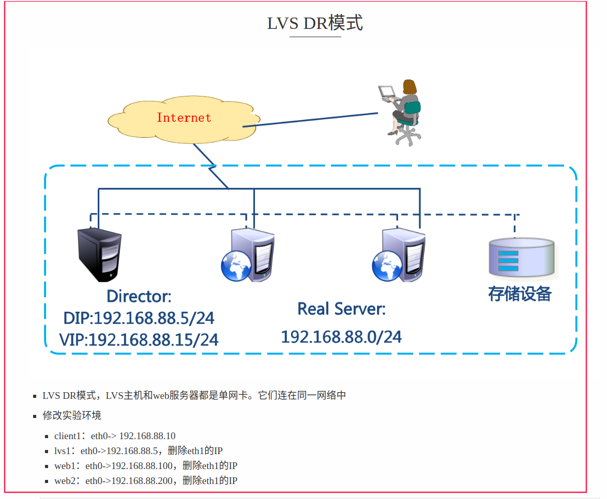

-- [学习目标](#学习目标)
- [学习目标](#学习目标)
- [课堂笔记（命令）](#课堂笔记命令)
- [课堂笔记（文本）](#课堂笔记文本)
  - [集群简介](#集群简介)
    - [什么是集群](#什么是集群)
    - [集群目的](#集群目的)
    - [集群分类](#集群分类)
  - [LVS](#lvs)
    - [简介](#简介)
    - [LVS的工作模式](#lvs的工作模式)
    - [术语](#术语)
    - [常见调度算法](#常见调度算法)
  - [LVS-模式配置-NAT](#lvs-模式配置-nat)
    - [环境准备](#环境准备)
    - [编写ansiblle配置](#编写ansiblle配置)
    - [配置网络yum](#配置网络yum)
    - [编写剧本上传](#编写剧本上传)
    - [配置web服务](#配置web服务)
    - [开启IP转发](#开启ip转发)
    - [安装LVS](#安装lvs)
    - [ipvsadm参数](#ipvsadm参数)
    - [配置LVS](#配置lvs)
  - [LVS-模式配置-DR](#lvs-模式配置-dr)
    - [环境准备](#环境准备-1)
    - [初始化环境](#初始化环境)
      - [还原LVS](#还原lvs)
      - [修改web网络](#修改web网络)
      - [修改清单文件](#修改清单文件)
      - [修改yum](#修改yum)
    - [添加VIP](#添加vip)
    - [配置回环地址](#配置回环地址)
    - [配置内核参数](#配置内核参数)
    - [配置虚拟服务器](#配置虚拟服务器)
- [快捷键](#快捷键)
- [问题](#问题)
  - [LVS NT模式需要什么样的网络拓扑](#lvs-nt模式需要什么样的网络拓扑)
  - [LVS DR模式需要什么样的网络拓扑？](#lvs-dr模式需要什么样的网络拓扑)
  - [LVS DR模式中，后端服务器需要修改哪些内核参数？](#lvs-dr模式中后端服务器需要修改哪些内核参数)
- [补充](#补充)
- [今日总结](#今日总结)
- [昨日复习](#昨日复习)


# 学习目标

集群及LVS简介

LVS-NAT集群

LVS-DR集群

# 课堂笔记（命令）


# 课堂笔记（文本）

## 集群简介

### 什么是集群

> 通过高速网络将很多服务器集中起来一起提供同一种服务，在客户端看起来就像是只有一个服务器
>
> 可以在付出较低成本的情况下获得在性能、可靠性、灵活性方面的相对较高的收益
>
> 任务调度是集群系统中的核心技术

### 集群目的

> + 提高性能
> + 降低成本
> + 提高可扩展性
> + 增强可靠性

### 集群分类

> + 高性能计算集群HPC
>
>   通过以集群开发的并行应用程序，解决复杂的科学问题
>
> + 负载均衡（LB）集群
>
>   客户端负载在计算机集群中尽可能平均分摊
>
> + 高可用(HA)集群
>
>   避免单点故障，当一个系统发生故障时，可以快速迁移

## LVS

### 简介

> LVS：Linux Virtual Server ，linux虚拟服务器
>
> 作用：实现负载均衡集群

### LVS的工作模式

> + NAT：网络地址转换
> + DR：路由模式
> + TUN：隧道模式

### 术语

> - 调度器：LVS服务器
> - 真实服务器Real Server：提供服务的服务器
> - VIP：虚拟地址，提供给用户访问的地址
> - DIP：指定地址，LVS服务器上与真实服务器通信的地址
> - RIP：真实地址，真实服务器的地址

### 常见调度算法

> - 轮询rr：Real Server轮流提供服务
> - 加权轮询wrr：根据服务器性能设置权重，权重大的得到的请求更多
> - 最少连接lc：根据Real Server的连接数分配请求
> - 加权最少连接wlc：类似于wrr，根据权重分配请求

## LVS-模式配置-NAT

### 环境准备



### 编写ansiblle配置

```shell
[root@pubserver ~]#mkdir cluster # 创建工作目录
[root@pubserver ~]#cd cluster
[root@pubserver cluster]#touch ansible.cfg inventory # 创建配置文件及主机清单
[root@pubserver cluster]#vim ansible.cfg # 编写主配置
[defaults]
inventory = inventory
host_key_checking = false

[root@pubserver cluster]#vim inventory # 编写主机清单
[clents]
client1 ansible_host=192.168.88.10  # 内置清单变量声明主机IP

[webservers]
web1 ansible_host=192.168.99.100
web2 ansible_host=192.168.99.200

[lb]
lvs1 ansible_host=192.168.88.5

[all:vars]  # [all:vars]组清单变量，代表为所有主机配置用户名密码
ansible_ssh_user=root
ansible_ssh_pass=a

[root@pubserver cluster]#ansible all  -m ping  # 验证主机；全绿即通过
```

### 配置网络yum

```shell
# 编写local88.repo和local99.repo两个yum仓库配置文件，为99与88网段主机使用
[root@pubserver cluster]#mkdir file  # 用于存储远程拷贝的文件
[root@pubserver cluster]#vim file/local88.repo
[BaseOS]
name = BaseOS
baseurl = ftp://192.168.88.240/dvd/BaseOS
enabled = 1
gpgcheck = 0

[AppStream]
name = AppStream
baseurl = ftp://192.168.88.240/dvd/AppStream
enabled = 1
gpgcheck = 0

[rpms]
name = rpms
baseurl = ftp://192.168.88.240/rpms
enabled = 1
gpgcheck = 0

[root@pubserver cluster]#vim file/local99.repo
[BaseOS]
name = BaseOS
baseurl = ftp://192.168.99.240/dvd/BaseOS
enabled = 1
gpgcheck = 0

[AppStream]
name = AppStream
baseurl = ftp://192.168.99.240/dvd/AppStream
enabled = 1
gpgcheck = 0

[rpms]
name = rpms
baseurl = ftp://192.168.99.240/rpms
enabled = 1
gpgcheck = 0
```

### 编写剧本上传

```shell
[root@pubserver cluster]#vim 01_upload_rpm.yml
---
- name: config repos.d
  hosts: all
  tasks:
    - name: remove yum.repos.d all file  
      file:
        path: /etc/yum.repos.d   # 删除yum.repos.d目录，防止运行yum报错
        state: absent

    - name: create yum.repos.d dir
      file:
        path: /etc/yum.repos.d  # 创建yum.repos.d目录
        state: directory

- name: copy file to far end local99
  hosts: webservers
  tasks:
    - name: copy  yum.repos.d 99
      copy:                      # 上传99的yum
        src: file/local99.repo
        dest: /etc/yum.repos.d/

- name: copy file to far end local88
  hosts: clents,lb
  tasks:                         # 上传88的yum
    - name: copy yum.repos.d 88
      copy:
        src: file/local88.repo
        dest: /etc/yum.repos.d/
        
[root@pubserver cluster]#ansible-playbook 01_upload_rpm.yml --syntax-check # 检测代码格式是否正确
[root@pubserver cluster]#ansible-playbook 01_upload_rpm.yml # 执行命令
```

### 配置web服务

```shell
[root@pubserver cluster]#mkdir files
[root@pubserver cluster]#vim files/index.html
Welcome from {{ansible_hostname}} to {{ansible_eth1.ipv4.address}}

[root@pubserver cluster]#vim 02.config.rpm.yml
---
- name: config webservers
  hosts: webservers
  tasks:
    - name: install nginx 
      yum:
        name: nginx
        state: present

    - name: upload index  
      template:   # 上传网页文件到web服务器
        src: files/index.html
        dest: /usr/share/nginx/html/index.html

    - name: start nginx    
      service:  # 启动服务
        name: nginx
        state: started
        enabled: yes
        
[root@pubserver cluster]# ansible-playbook 02-config-webservers.yml 

# 在lvs1上测试到web服务器的访问
[root@lvs1 ~]# curl http://192.168.99.100
Welcome from web1
[root@lvs1 ~]# curl http://192.168.99.200
Welcome from web2
```

### 开启IP转发

```shell
- 查看ip转发功能的内核参数
[root@lvs1 ~]# sysctl -a    # 查看所有的内核参数
[root@lvs1 ~]# sysctl -a | grep ip_forward  # 查看ip_foward参数
net.ipv4.ip_forward = 1   # 1表示打开转发，0表示关闭转发

# 设置打开ip_forward功能
[root@pubserver cluster]# vim 03-sysctl.yml
---
- name: config sysctl
  hosts: lb
  tasks:
    - name: set ip_forward
      sysctl:   # 用于修改内核参数的模块
        name: net.ipv4.ip_forward       # 内核模块名
        value: '1'        # 内核模块的值
        sysctl_set: yes   # 立即设置生效
        sysctl_file: /etc/sysctl.conf   # 配置写入文件
        
[root@pubserver cluster]# ansible-playbook 03-sysctl.yml

# 测试从客户端到服务器的访问
[root@client1 ~]# curl http://192.168.99.100
Welcome from web1
[root@client1 ~]# curl http://192.168.99.200
Welcome from web2
```

**代码解释**

> linux的内核参数ip_forward为0表示关闭路由转发，1表示开启；开启后通过配置就能使的不同网络之间通信
>
> 由于在配置网络时将LVS1主机配置成了一个路由器(网关)，所以承担了一个路由转发功能，client(88.10)在访问192.168.99.100时，由于不属于一个网段不能直接通信，这时候就将请求默认发给网关，此时网关上有两个接口一个88一个99的，根据路由特性将路由转发给99网段，此时88就能与99进行通信了。

### 安装LVS

```shell
[root@pubserver cluster]# vim 04-inst-lvs.yml
---
- name: install lvs
  hosts: lb
  tasks:
    - name: install lvs  # 安装lvs
      yum:
        name: ipvsadm
        state: present
        
[root@pubserver cluster]# ansible-playbook 04-inst-lvs.yml
```

### ipvsadm参数

```shell
[root@lvs1 ~]# ipvsadm
-A: 添加虚拟服务器
-E: 编辑虚拟服务器
-D: 删除虚拟服务器
-t: 添加tcp服务器
-u: 添加udp服务器
-s: 指定调度算法。如轮询rr/加权轮询wrr/最少连接lc/加权最少连接wlc

-a: 添加虚拟服务器后，向虚拟服务器中加入真实服务器
-r: 指定真实服务器
-w: 设置权重
-m: 指定工作模式为NAT
-g: 指定工作模式为DR
# 案例1 添加一个tcp-VIP
ipvsadm -A -t VIP:port -s 算法
# 案例2 配置一个LVS-nat  -w设置权重
ipvsadm -a -t VIP:port -r webIP -w 2 -m
# 案例3 配置一个LVS-dr
ipvsadm -a -t VIP:port -r webIP -w -g
```

### 配置LVS

```shell
# 为web服务器创建虚拟服务器，使用rr调度算法
[root@lvs1 ~]# ipvsadm -A -t 192.168.88.5:80 -s rr
# 查看配置
[root@lvs1 ~]# ipvsadm -Ln  # L是列出，n是使用数字，而不是名字
IP Virtual Server version 1.2.1 (size=4096)
Prot LocalAddress:Port Scheduler Flags
  -> RemoteAddress:Port           Forward Weight ActiveConn InActConn
TCP  192.168.88.5:80 rr

# 向虚拟服务器中添加RIP
[root@lvs1 ~]# ipvsadm -a -t 192.168.88.5:80 -r 192.168.99.100 -w 1 -m
[root@lvs1 ~]# ipvsadm -a -t 192.168.88.5:80 -r 192.168.99.200 -w 2 -m
# 查看配置
[root@lvs1 ~]# ipvsadm -Ln
IP Virtual Server version 1.2.1 (size=4096)
Prot LocalAddress:Port Scheduler Flags
  -> RemoteAddress:Port           Forward Weight ActiveConn InActConn
TCP  192.168.88.5:80 rr
  -> 192.168.99.100:80            Masq    1      0          0         
  -> 192.168.99.200:80            Masq    2      0          0        
  
# 验证
[root@client1 ~]# for i in {1..6}
> do
> curl http://192.168.88.5
> done
Welcome from web2
Welcome from web1
Welcome from web2
Welcome from web1
Welcome from web2
Welcome from web1

# 删除配置。（如果配置有错，用以下命令删除重配置）
[root@lvs1 ~]# ipvsadm -D -t 192.168.88.5:80


# 修改调度模式为加权轮询
[root@lvs1 ~]# ipvsadm -E -t 192.168.88.5:80 -s wrr
# 验证配置
[root@lvs1 ~]# ipvsadm -Ln
IP Virtual Server version 1.2.1 (size=4096)
Prot LocalAddress:Port Scheduler Flags
  -> RemoteAddress:Port           Forward Weight ActiveConn InActConn
TCP  192.168.88.5:80 wrr 
  -> 192.168.99.100:80            Masq    1      0          0         
  -> 192.168.99.200:80            Masq    2      0          0 
  
[root@client1 ~]# for i in {1..6}; do curl http://192.168.88.5; done
Welcome from web2
Welcome from web2
Welcome from web1
Welcome from web2
Welcome from web2
Welcome from web1
```

## LVS-模式配置-DR

### 环境准备



### 初始化环境

> 根据搭建的lvs-nat环境进行修改

#### 还原LVS

```shell
# 删除LVS-NAT虚拟服务器
[root@lvs1 ~]# ipvsadm -D -t 192.168.88.5:80
[root@lvs1 ~]# ipvsadm -Ln
IP Virtual Server version 1.2.1 (size=4096)
Prot LocalAddress:Port Scheduler Flags
  -> RemoteAddress:Port           Forward Weight ActiveConn InActConn

# 停用99.5网卡
[root@lvs1 ~]#nmcli connection modify eth1 ipv4.method disabled ipv4.address ''
[root@lvs1 ~]#nmcli connection down eth1
```

#### 修改web网络

```shell
# 修改web1的配置：停掉eth1的地址。配置eth0的地址为192.168.88.100
# 进入网卡配置文件目录
[root@web1 ~]# cd /etc/sysconfig/network-scripts/
# eth0网卡的配置文件叫ifcfg-eth0
[root@web1 network-scripts]# ls ifcfg-eth*
ifcfg-eth0  ifcfg-eth1
# 配置eth0地址
[root@web1 network-scripts]# vim ifcfg-eth0
TYPE=Ethernet             # 网络类型为以太网
BOOTPROTO=none            # IP地址是静态配置的，也可以用static
NAME=eth0                 # 为设备重命名
DEVICE=eth0               # 网卡设备名
ONBOOT=yes                # 开机激活网卡
IPADDR=192.168.88.100     # IP地址
PREFIX=24                 # 子网掩码长度
GATEWAY=192.168.88.254    # 网关

[root@web1 ~]# systemctl restart NetworkManager    # 重启网络服务

# 在web1上停掉eth1
[root@web1 ~]# vim /etc/sysconfig/network-scripts/ifcfg-eth1
TYPE=Ethernet
BOOTPROTO=none
NAME=eth1
DEVICE=eth1
ONBOOT=no
[root@web1 ~]# nmcli connection down eth1   # 终端卡住，关掉它，在新终端重新连使用88.100连接

# 修改web2的网络
[root@web2 ~]# vim /etc/sysconfig/network-scripts/ifcfg-eth0 
TYPE=Ethernet
BOOTPROTO=none
NAME=eth0
DEVICE=eth0
ONBOOT=yes
IPADDR=192.168.88.200
PREFIX=24
GATEWAY=192.168.88.254
[root@web2 ~]# systemctl restart NetworkManager
[root@web2 ~]# vim /etc/sysconfig/network-scripts/ifcfg-eth1
TYPE=Ethernet
BOOTPROTO=none
NAME=eth1
DEVICE=eth1
ONBOOT=no
[root@web2 ~]# nmcli connection down eth1
```

#### 修改清单文件

```shell
[root@pubserver cluster]# cp inventory inventory.bak # 备份
[root@pubserver cluster]# vim inventory
[clents]
client1 ansible_host=192.168.88.10

[webservers]
web1 ansible_host=192.168.88.100
web2 ansible_host=192.168.88.200

[lb]
lvs1 ansible_host=192.168.88.5

[all:vars]
ansible_ssh_user=root
ansible_ssh_pass=a
```

#### 修改yum

```shell
[root@pubserver cluster]#ansible webservers -m shell -a "sed -i 's/99/88/' /etc/yum.repos.d/local99.repo"
```

### 添加VIP

```shell
[root@pubserver cluster]# vim 05-config-lvsvip.yml
---
- name: config lvs vip
  hosts: lb
  tasks:
    - name: add vip
      lineinfile:   # 确保文件中有某一行内容
        path: /etc/sysconfig/network-scripts/ifcfg-eth0
        line: IPADDR2=192.168.88.15
      notify: restart eth0  # 通知执行handlers中的任务

  handlers:   # 被通知执行的任务写到这里
    - name: restart eth0
      shell: nmcli connection down eth0; nmcli connection up eth0
[root@pubserver cluster]# ansible-playbook 05-config-lvsvip.yml

# 在lvs1查看添加的IP地址
[root@lvs1 ~]# reboot
[root@lvs1 ~]# ip a s eth0 | grep 88
    inet 192.168.88.5/24 brd 192.168.88.255 scope global noprefixroute eth0
    inet 192.168.88.15/24 brd 192.168.88.255 scope global secondary noprefixroute eth0
```

### 配置回环地址

```shell
[root@pubserver cluster]# vim 06-config-webvip.yml
---
- name: config webservers vip
  hosts: webservers
  tasks:
    - name: install network-scripts  # 安装服务
      yum:
        name: network-scripts
        state: present

    - name: add lo:0   # 创建lo:0的配置文件
      copy:
        dest: /etc/sysconfig/network-scripts/ifcfg-lo:0
        content: |
          DEVICE=lo:0
          NAME=lo:0
          IPADDR=192.168.88.15
          NETMASK=255.255.255.255
          NETWORK=192.168.88.15
          BROADCAST=192.168.88.15
          ONBOOT=yes
      notify: activate lo:0

  handlers:
    - name: activate lo:0   # 激活网卡
      shell: ifup lo:0
[root@pubserver cluster]# ansible-playbook 06-config-webvip.yml

# 查看结果
[root@web1 ~]# cd /etc/sysconfig/network-scripts/
[root@web1 network-scripts]# cat ifcfg-lo:0
DEVICE=lo:0
NAME=lo:0
IPADDR=192.168.88.15
NETMASK=255.255.255.255
NETWORK=192.168.88.15
BROADCAST=192.168.88.15
ONBOOT=yes

[root@web1 network-scripts]# ifconfig  # 可以查看到lo:0网卡信息
lo:0: flags=73<UP,LOOPBACK,RUNNING>  mtu 65536
        inet 192.168.88.15  netmask 255.255.255.255
        loop  txqueuelen 1000  (Local Loopback)
```

### 配置内核参数

```shell
[root@web1 ~]# sysctl -a | grep arp_ignore
net.ipv4.conf.all.arp_ignore = 1
net.ipv4.conf.lo.arp_ignore = 0
[root@web1 ~]# sysctl -a | grep arp_announce
net.ipv4.conf.all.arp_announce = 2
net.ipv4.conf.lo.arp_announce = 0

[root@web1 ~]# vim /etc/sysctl.conf 
net.ipv4.conf.all.arp_ignore = 1
net.ipv4.conf.lo.arp_ignore = 1
net.ipv4.conf.all.arp_announce = 2
net.ipv4.conf.lo.arp_announce = 2
[root@web1 ~]# sysctl -p

[root@web2 ~]# vim /etc/sysctl.conf 
net.ipv4.conf.all.arp_ignore = 1
net.ipv4.conf.lo.arp_ignore = 1
net.ipv4.conf.all.arp_announce = 2
net.ipv4.conf.lo.arp_announce = 2
[root@web2 ~]# sysctl -p
```

### 配置虚拟服务器

```shell
# 创建虚拟服务器
[root@lvs1 ~]# ipvsadm -A -t 192.168.88.15:80 -s wlc
# 向虚拟服务器中加真实服务器
[root@lvs1 ~]# ipvsadm -a -t 192.168.88.15:80 -r 192.168.88.100 -w 1 -g
[root@lvs1 ~]# ipvsadm -a -t 192.168.88.15:80 -r 192.168.88.200 -w 2 -g
# 查看配置
[root@lvs1 ~]# ipvsadm -Ln
P Virtual Server version 1.2.1 (size=4096)
Prot LocalAddress:Port Scheduler Flags
  -> RemoteAddress:Port           Forward Weight ActiveConn InActConn
TCP  192.168.88.15:80 wlc
  -> 192.168.88.100:80            Route   2      0          0         
  -> 192.168.88.200:80            Route   1      0          0        
  
# 客户验证
[root@client1 ~]# for i in {1..6}; do curl http://192.168.88.15/; done
Welcome from web2
Welcome from web1
Welcome from web2
Welcome from web2
Welcome from web1
Welcome from web2
```

# 快捷键


# 问题

## LVS NT模式需要什么样的网络拓扑

> 在LVS的NAT模式下，需要一个三层网络拓扑结构。其中，客户端和LVS调度器位于同一子网中，后端服务器位于另一个子网中。客户端通过默认网关将请求发送到LVS调度器，LVS调度器将请求转发到后端服务器，后端服务器处理请求并将响应返回给LVS调度器，最后LVS调度器将响应返回给客户端。

## LVS DR模式需要什么样的网络拓扑？

> 在LVS的DR模式下，需要一个二层网络拓扑结构。其中，客户端和LVS调度器位于同一子网中，后端服务器也位于同一子网中。客户端通过默认网关将请求发送到LVS调度器，LVS调度器将请求转发到后端服务器，后端服务器处理请求并将响应返回给客户端，不需要经过LVS调度器。

## LVS DR模式中，后端服务器需要修改哪些内核参数？

> 在LVS DR模式中，后端服务器需要修改以下内核参数：
>
> 1. net.ipv4.conf.all.arp_ignore和net.ipv4.conf.lo.arp_ignore：设置为1，表示忽略所有ARP请求。
>
> 2. net.ipv4.conf.all.arp_announce和net.ipv4.conf.lo.arp_announce：设置为2，表示使用自己的MAC地址响应ARP请求。

# 补充


# 今日总结


# 昨日复习