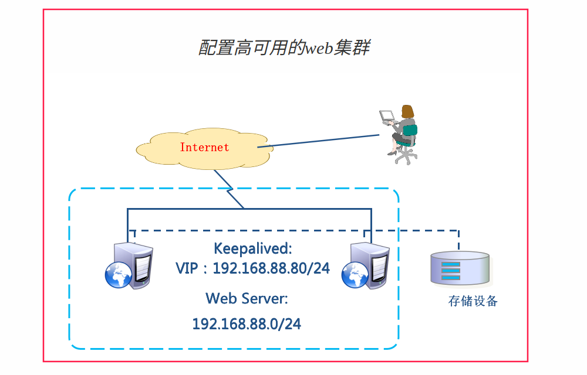
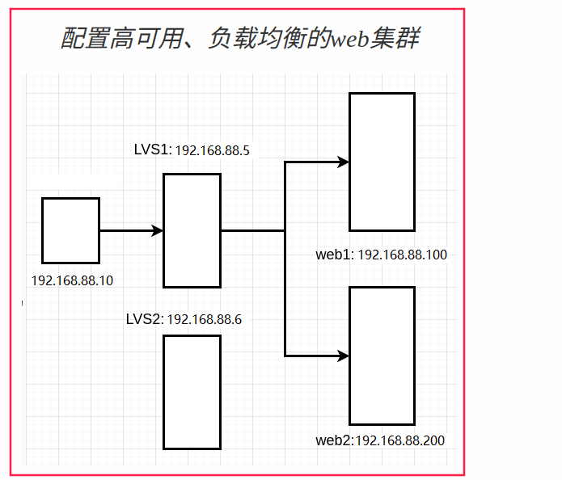

- [学习目标](#学习目标)
- [课堂笔记（命令）](#课堂笔记命令)
- [课堂笔记（文本）](#课堂笔记文本)
  - [Keepalived使用](#keepalived使用)
    - [网络拓扑图](#网络拓扑图)
    - [介绍](#介绍)
    - [装包](#装包)
    - [配置-web1-主](#配置-web1-主)
    - [启动](#启动)
    - [配置-web2-备](#配置-web2-备)
    - [启动](#启动-1)
    - [测试1](#测试1)
    - [测试2](#测试2)
  - [keepalived主备切换](#keepalived主备切换)
    - [实施原理](#实施原理)
    - [实施](#实施)
    - [修改配置文件](#修改配置文件)
    - [验证测试](#验证测试)
  - [高可用负载均衡配置](#高可用负载均衡配置)
    - [配置步骤](#配置步骤)
    - [前提](#前提)
    - [准备](#准备)
    - [修改配置LVS1](#修改配置lvs1)
    - [验证](#验证)
    - [测试](#测试)
    - [测试-解释](#测试-解释)
    - [测试-规则](#测试-规则)
    - [修改配置LVS2](#修改配置lvs2)
    - [测试](#测试-1)
  - [Haproxy](#haproxy)
    - [装包](#装包-1)
    - [修改配置](#修改配置)
    - [启用测试](#启用测试)
    - [启用健康检测页面](#启用健康检测页面)
  - [负载均衡调度期比较](#负载均衡调度期比较)
    - [LVS](#lvs)
    - [Nginx](#nginx)
    - [HAProxy](#haproxy-1)
- [流程图](#流程图)
- [快捷键](#快捷键)
- [问题](#问题)
- [补充](#补充)
- [今日总结](#今日总结)
- [昨日复习](#昨日复习)


# 学习目标

Keeplived热备

Keeplived+LVS

HAProxy服务器

# 课堂笔记（命令）


# 课堂笔记（文本）

## Keepalived使用

### 网络拓扑图



> - web1：eth0->192.168.88.100/24
> - web2：eth0->192.168.88.200/24

### 介绍

> Keepalived 是一款开源的软件，用于实现基于 VRRP 协议的高可用性解决方案。它可以在多台服务器上运行，并将它们组织成一个虚拟路由器，提供冗余和故障转移。
>
> Keepalived 主要用于以下两个方面：
>
> 1. **虚拟 IP 地址管理**：Keepalived 使用 **VRRP** 协议来管理一个虚拟 IP 地址（VIP），该 VIP 将绑定到主服务器。当主服务器发生故障时，备用服务器中的 Keepalived 实例将接管 VIP，并确保网络流量正常传输到备用服务器。
> 2. **健康检查和故障检测**：Keepalived 可以通过周期性地发送心跳消息并监听其他服务器的响应来检测主服务器的可用性。如果主服务器无法正常响应，备用服务器将检测到该情况并采取相应措施，例如接管 VIP。
>
> 通过使用 Keepalived，可以实现高可用性的网络架构，提供持续的服务可用性和故障转移能力。它广泛应用于负载均衡、高可用数据库、Web 服务等场景，确保关键服务的连续性和稳定性。

### 装包

```shell
# 在两台web服务器上安装keepalived
[root@pubserver cluster]# vim 07-install-keepalived.yml
---
- name: install keepalived
  hosts: webservers
  tasks:
    - name: install keepalived   
      yum:
        name: keepalived
        state: present
        
[root@pubserver cluster]# ansible-playbook 07-install-keepalived.yml        
```

### 配置-web1-主

```shell
# 修改配置文件
[root@web1 ~]# vim /etc/keepalived/keepalived.conf 
 12    router_id web1    # 设置本机在集群中的唯一识别符
 13    vrrp_iptables     # 自动配置iptables放行规则
 ... ...
 20 vrrp_instance VI_1 {
 21     state MASTER           # 状态，主为MASTER，备为BACKUP
 22     interface eth0         # 网卡，服务使用的网络
 23     virtual_router_id 51   # 虚拟路由器地址
 24     priority 100           # 优先级，越高代表主
 25     advert_int 1           # 发送心跳消息的间隔，检查备机是否存活
 26     authentication {
 27         auth_type PASS     # 认证类型为共享密码
 28         auth_pass 1111     # 集群中的机器密码相同，才能成为集群
 29     }   
 30     virtual_ipaddress {
 31         192.168.88.80/24    # VIP地址
 32     }   
 33 }
# 删除下面所有行
```

### 启动

```shell
[root@web1 ~]#systemctl enable keepalived.service --now  # 添加自启动并启动服务
[root@web1 ~]#ip a s | grep 88 # 查询VIP是否添加成功
```

### 配置-web2-备

```shell
[root@web1 ~]#scp /etc/keepalived/keepalived.conf 192.168.88.200:/etc/keepalived/keepalived.conf  # 将配置为文件拷贝过去

[root@web2 ~]#vim /etc/keepalived/keepalived.conf 
 12    router_id web2    # 设置本机在集群中的唯一识别符
 13    vrrp_iptables     # 自动配置iptables放行规则
 ... ...
 20 vrrp_instance VI_1 {
 21     state BACKUP           # 状态，主为MASTER，备为BACKUP
 22     interface eth0         # 网卡，服务使用的网络
 23     virtual_router_id 51   # 虚拟路由器地址
 24     priority 80           # 优先级，越高代表主
 25     advert_int 1           # 发送心跳消息的间隔，检查备机是否存活
 26     authentication {
 27         auth_type PASS     # 认证类型为共享密码
 28         auth_pass 1111     # 集群中的机器密码相同，才能成为集群
 29     }   
 30     virtual_ipaddress {
 31         192.168.88.80/24    # VIP地址
 32     }   
 33 }
```

### 启动

```shell
[root@web2 ~]# systemctl enable keepalived.service --now
Created symlink /etc/systemd/system/multi-user.target.wants/keepalived.service → /usr/lib/systemd/system/keepalived.service.
[root@web2 ~]# ip a s|grep 88  # 没有查询到88.80，表示keepalived高可用配置成功
    inet 192.168.88.200/24 brd 192.168.88.255 scope global noprefixroute eth0
```

### 测试1

```shell
[root@client1 ~]# curl 192.168.88.80
Welcome to web1 on 192.168.88.100
[root@client1 ~]# curl 192.168.88.80
Welcome to web1 on 192.168.88.100

# 将web1关机，查询VIP是否自动在BACKUP机器添加
[root@web1 ~]#poweroff
# web2查询
[root@web2 ~]# ip a s eth0|grep 88
    inet 192.168.88.200/24 brd 192.168.88.255 scope global noprefixroute eth0
    inet 192.168.88.80/24 scope global secondary eth0
# 客户端测试
[root@client1 ~]# curl 192.168.88.80
Welcome to web2 on 192.168.88.200
# 开启web1
[root@web1 ~]# ip a s eth0|grep 80  # VIP又转移过来了
    inet 192.168.88.80/24 scope global secondary eth0
```

### 测试2

```shell
# 存在弊端，keepalived并不知道当前web服务器有那些业务，按照上述配置，关停web1的nginx，客户区访问VIP时显示拒绝连接，因为VIP没有切换，这样不能保证业务的连续性。

[root@client1 ~]#systemctl stop nginx
[root@client1 ~]#ip a s eth0|grep 80
inet 192.168.88.80/24 scope global secondary eth0
# 客户端访问
[root@client1 ~]#curl 192.168.88.80
curl: (7) Failed to connect to 192.168.88.80 port 80: Connection refused
```

## keepalived主备切换


### 实施原理

> - 配置高可用的web集群时，Keepalived只为服务器提供了VIP
> - Keepalived不知道服务器上运行了哪些服务
> - MASTER服务器可以通过跟踪脚本监视本机的80端口，一旦本机80端口失效，则将VIP切换至BACKUP服务器
> - Keepalived对脚本的要求是，退出码为0表示访问成功；退出码为1表示失败。

### 实施

```shell
# 1. 在MASTER上创建监视脚本
[root@web1 ~]# vim /etc/keepalived/check_http.sh
#!/bin/bash

ss -tlnp | grep :80 &> /dev/null && exit 0 || exit 1

[root@web1 ~]# chmod +x /etc/keepalived/check_http.sh
```

### 修改配置文件

```shell
# 2. 修改MASTER配置文件，使用脚本
[root@web1 ~]# vim /etc/keepalived/keepalived.conf 
  1 ! Configuration File for keepalived
  2 
  3 global_defs {
...略...
 18 }
 19 
 20 vrrp_script chk_http_port {  # 定义监视脚本
 21     script "/etc/keepalived/check_http.sh"
 22     interval 2   # 脚本每隔2秒运行一次
 23 }
 24
 25 vrrp_instance VI_1 {
 26     state MASTER
 27     interface eth0
 28     virtual_router_id 51
 29     priority 100
 30     advert_int 1
 31     authentication {
 32         auth_type PASS
 33         auth_pass 1111
 34     }
 35     virtual_ipaddress {
 36         192.168.88.80/24
 37     }
 38     track_script {    # 引用脚本
 39         chk_http_port
 40     }
 41 }
 
# 3. 重起服务
[root@web1 ~]# systemctl restart keepalived.service 
```

### 验证测试

```shell
# 4. 测试，关闭web1的nginx后，VIP将会切换至web2
[root@web1 ~]# systemctl stop nginx.service 
[root@web1 ~]# ip a s | grep 88
    inet 192.168.88.100/24 brd 192.168.88.255 scope global noprefixroute eth0
[root@web2 ~]# ip a s | grep 88
    inet 192.168.88.200/24 brd 192.168.88.255 scope global noprefixroute eth0
    inet 192.168.88.80/24 scope global secondary eth0
    
# 5. 当MASTER的nginx修复后，VIP将会切换回至web1
[root@web1 ~]# systemctl start nginx.service 
[root@web1 ~]# ip a s | grep 88
    inet 192.168.88.100/24 brd 192.168.88.255 scope global noprefixroute eth0
    inet 192.168.88.80/24 scope global secondary eth0
[root@web2 ~]# ip a s | grep 88
    inet 192.168.88.200/24 brd 192.168.88.255 scope global noprefixroute eth0

```

## 高可用负载均衡配置



### 配置步骤

> 1. 配置网络参数
>
> 2. 配置yum
>
> 3. 配置web服务
>
> 4. 在webservice的lo上配置VIP
>
>    + 安装network-scripts
>
>    + 修改网卡文件，添加一个lo:0 
>
>      ```sh
>      vim /etc/sysconfig/network-scripts/ifcfg-lo:0 
>      DEVICE=lo:0
>      NAME=lo:0
>      IPADDR=192.168.88.15 # 这是虚拟接口分配的 IP 地址。
>      NETMASK=255.255.255.255
>      NETWORK=192.168.88.15 # 网络地址
>      BROADCAST=192.168.88.15 # 广播地址
>      ONBOOT=yes
>      ```
>
> 5. 修改webservice的内核参数
>
>    + 修改内核参数
>
>      ```sh
>      vim /etc/sysctl.conf
>      net.ipv4.conf.all.arp_ignore = 1
>      net.ipv4.conf.lo.arp_ignore = 1
>      net.ipv4.conf.all.arp_announce = 2
>      net.ipv4.conf.lo.arp_announce = 2
>      ```
>
> 6. 在lvs上安装ipvsadm和keepalived
>
> 7. 修改keepalived配置
>
> 8. 启动keepalived

### 前提

> 使用Keepalived做高可用负载均衡有以下好处：
>
> 1. 可靠性高：Keepalived是一个可靠的高可用软件，它可以确保即使其中一个节点或服务器出现故障，整个系统仍然可以继续运行，从而避免了单点故障带来的影响。
> 2. 简单易用：Keepalived相对于其他高可用软件来说，它的配置和使用非常简单，只需要几个简单的命令就可以完成配置和部署。
> 3. 轻量级：Keepalived是一个轻量级的软件，它不会占用很多系统资源，可以在较小的硬件资源上运行，这样可以节省硬件成本和维护成本。
> 4. 兼容性好：Keepalived可以与各种负载均衡器和应用服务器相兼容，可以与LVS、HAProxy、Nginx等多种负载均衡器相结合使用，实现高可用负载均衡。
> 5. 功能强大：Keepalived提供了多种高可用性功能，包括VRRP、SMTP、SSL等，可以满足不同的需求，保证服务的高可用性。
>
> 总之，使用Keepalived做高可用负载均衡可以提高负载均衡的可靠性和稳定性，同时也可以节省部署和维护的成本。它是一个简单易用、兼容性好、轻量级且功能强大的高可用软件，非常适合中小型企业和个人开发者使用

### 准备

> 添加一台服务器,用于配置LVS
>
> IP：192.168.88.6
>
> 配置yum安装keepalived

### 修改配置LVS1

```shell
[root@lvs1 ~]# vim /etc/keepalived/keepalived.conf 
 12    router_id lvs1       # 为本机取一个唯一的id
 13    vrrp_iptables        # 自动开启iptables放行规则
... ...
 20 vrrp_instance VI_1 {
 21     state MASTER
 22     interface eth0
 23     virtual_router_id 51
 24     priority 100
 25     advert_int 1
 26     authentication {
 27         auth_type PASS
 28         auth_pass 1111
 29     }   
 30     virtual_ipaddress {
 31         192.168.88.15       # vip地址，与web服务器的vip一致
 32     }   
 33 }
 # 以下为keepalived配置lvs的规则
 35 virtual_server 192.168.88.15 80 {   # 声明虚拟服务器地址
 36     delay_loop 6     # 健康检查延迟6秒开始
 37     lb_algo wrr      # 调度算法为wrr
 38     lb_kind DR       # 工作模式为DR
 39     persistence_timeout 50  # 50秒内相同客户端调度到相同服务器
 40     protocol TCP     # 协议是TCP
 41 
 42     real_server 192.168.88.100 80 {   # 声明真实服务器
 43         weight 1          # 权重
 44         TCP_CHECK {       # 通过TCP协议对真实服务器做健康检查
 45             connect_timeout 3 # 连接超时时间为3秒
 46             retry 3    # 3次访问失败则认为真实服务器故障
 47             delay_before_retry 3  # 两次检查时间的间隔3秒
 48         }
 49     }
 50     real_server 192.168.88.200 80 {
 51         weight 2
 52         TCP_CHECK {
 53             connect_timeout 3
 54             nb_get_retry 3
 55             delay_before_retry 3
 56         }
 57     }
 58 }
# 以下部分删除
```

### 验证

```shell
[root@lvs1 ~]# ip a s eth0 | grep 88
    inet 192.168.88.5/24 brd 192.168.88.255 scope global noprefixroute eth0
    inet 192.168.88.15/32 scope global eth0

[root@lvs1 ~]# ipvsadm -Ln    # 出现规则
IP Virtual Server version 1.2.1 (size=4096)
Prot LocalAddress:Port Scheduler Flags
  -> RemoteAddress:Port           Forward Weight ActiveConn InActConn
TCP  192.168.88.15:80 wrr persistent 50
  -> 192.168.88.100:80            Route   1      0          0         
  -> 192.168.88.200:80            Route   2      0          0 
```

### 测试

```shell
[root@lvs1 ~]#systemct enable keepalived --now 
[root@client1 ~]#for i in {1..5};do curl 192.168.88.100;done
Welcome from web2
Welcome from web2
Welcome from web2
Welcome from web2
Welcome from web2
Welcome from web2
# 配置了权重轮询，为什么还会出现上述原因
```

### 测试-解释

> 原因：为了效率，相同的客户端在50秒内发送的请求都会分发给同一台服务器，避免重新建立新的tcp连接
>
> 解决：将kee	即可
>
> persistence_timeout 50 

### 测试-规则

```shell
# 关闭web1 nginx，查看虚拟服务器中是否自动删除不正常的连接
[root@web1 ~]systemctl stop nginx
[root@lvs1 ~]ipvsadm -Ln # 查看IPVS
IP Virtual Server version 1.2.1 (size=4096)
Prot LocalAddress:Port Scheduler Flags
  -> RemoteAddress:Port           Forward Weight ActiveConn InActConn
TCP  192.168.88.15:80 wrr
  -> 192.168.88.200:80            Route   2      0          0         
  
# 开启，看是否添加成功
[root@web1 ~]systemctl start nginx
[root@lvs1 ~]ipvsadm -Ln # 查看IPVS
IP Virtual Server version 1.2.1 (size=4096)
Prot LocalAddress:Port Scheduler Flags
  -> RemoteAddress:Port           Forward Weight ActiveConn InActConn
TCP  192.168.88.15:80 wrr
  -> 192.168.88.100:80            Route   1      0          0         
  -> 192.168.88.200:80            Route   2      0          0         
```

### 修改配置LVS2

```shell
# lvs2作为高可用中的备机
[root@lvs2 ~]#vim /etc/keepalived/keepalived.conf
global_defs {
   notification_email {
     acassen@firewall.loc
     failover@firewall.loc
     sysadmin@firewall.loc
   }
   notification_email_from Alexandre.Cassen@firewall.loc
   smtp_server 192.168.88.6 # 修改为当前服务器IP
   smtp_connect_timeout 30
   router_id lvs2 # 唯一标识
   vrrp_iptables # 自动放行规则
   vrrp_skip_check_adv_addr
   vrrp_strict
   vrrp_garp_interval 0
   vrrp_gna_interval 0
}
vrrp_instance VI_1 {
    state MASTER
    interface eth0
    virtual_router_id 51
    priority 80  # 优先权，比lvs1低即可
    advert_int 1
    authentication {
        auth_type PASS
        auth_pass 1111
    }
    virtual_ipaddress {
        192.168.88.15/24
    }
}

virtual_server 192.168.88.15 80 {
    delay_loop 6
    lb_algo wrr
    lb_kind DR
   # persistence_timeout 50
    protocol TCP

    real_server 192.168.88.100 80 {
        weight 1
        TCP_CHECK {
            connect_timeout 3
            retry 3
            delay_before_retry 3
        }
    }
    real_server 192.168.88.200 80 {
        weight 2
        TCP_CHECK {
            connect_timeout 3
            retry 3
            delay_before_retry 3
        }
    }
}

[root@lvs2 ~]#systemctl enable keepalived.service --now
# 查询没有VIP，有IPVS即配置成功
```

### 测试

> 测试主备切换

```shell
[root@lvs1 ~]#poweroff
[root@lvs2 ~]#ip a s eth0|grep 15 # 查询VIP是否存在，存在即为成功

# 开启web1
[root@lvs1 ~]#ip a s eth0|grep 15 # 查询15VIP是否存在，即为成功；开机后keepalived需要加载一段时间
[root@lvs2 ~]#ip a s eth0|grep 15
```

## Haproxy

### 装包

> 卸载lvs1上的ipvsadm、keepalived

```shell
[root@pubserver cluster]# vim 12_uninstall_soft.yml
---      
- name: config haproxy
  hosts: lvs1
  tasks: 
    - name: uninstall service # 卸载
      yum:
        name: ipvsadm,keepalived
        state: absent
         
    - name: set hostname  # 设置新的主机名
      shell: hostnamectl set-hostname haproxy1
         
    - name: install haproxy  # 安装haproxy
      yum:
        name: haproxy
        state: present
```

### 修改配置

```shell
[root@haproxy1 ~]# vim /etc/haproxy/haproxy.cfg 
# 配置文件中，global是全局配置；default是缺省配置，如果后续有和default相同的配置，default配置将会被覆盖。
# 配置文件中，frontend描述haproxy怎么和用户交互；backend描述haproxy怎么和后台应用服务器交互。这两个选项，一般不单独使用，而是合并到一起，名为listen。
# 将64行之后全部删除，写入以下内容
 64 #---------------------------------------------------------------------
 65 listen myweb  # 定义虚拟服务器
 66         bind 0.0.0.0:80     # 监听在所有可用地址的80端口
 67         balance roundrobin  # 定义轮询调度算法
 # 对web服务器做健康检查，2秒检查一次，如果连续2次检查成功，认为服务器是健康的，如果连续5次检查失败，认为服务器坏了
 68         server web1 192.168.88.100:80 check inter 2000 rise 2 fall 5
 69         server web2 192.168.88.200:80 check inter 2000 rise 2 fall 5
```

### 启用测试

```shell
[root@haproxy1 ~]# systemctl enable haproxy --now
[root@client1 ~]# curl 192.168.88.5
Welcome to web1 on 192.168.88.100
[root@client1 ~]# curl 192.168.88.5
Welcome to web2 on 192.168.88.200
```

### 启用健康检测页面

```shell
[root@haproxy1 ~]# vim /etc/haproxy/haproxy.cfg 
 71 listen stats  # 定义虚拟服务器
 72         bind 0.0.0.0:1080       # 监听在所有可用地址的1080端口
 73         stats refresh 30s       # 设置监控页面自动刷新时间为30秒
 74         stats uri /stats        # 定义监控地址是/stats
 75         stats auth admin:admin  # 监控页面的用户名和密码都是admin
 
[root@haproxy1 ~]# systemctl start haproxy.service 
# 浏览器访问 http://192.168.88.5:1080/stats 查看
```

## 负载均衡调度期比较

> LVS适用于需要高并发性和稳定性的场景，Nginx适用于静态文件服务和反向代理等应用层负载均衡场景，HAProxy则具备较为丰富的功能和灵活性，适用于多种负载均衡场景。

### LVS

> 优点：
>
> - 高性能：LVS使用Linux内核中的IP负载均衡技术，能够实现非常高的并发处理能力。
> - 稳定性：LVS经过长时间的实践应用，成熟稳定，被广泛使用。
> - 可用性：支持高可用性的配置，可以实现故障自动切换，提供无中断的服务。
> - 灵活性：可根据需要采用多种负载均衡算法，如轮询、加权轮询、哈希等。
>
> 缺点：
>
> - 配置复杂：相对于其他两个技术，LVS的配置相对较为复杂，需要更深入的了解和配置。
> - 功能相对局限：LVS主要是一种传输层负载均衡技术，无法像Nginx和HAProxy那样对应用层协议进行处理

### Nginx

> 优点：
>
> - 高性能：Nginx采用了基于事件驱动的异步非阻塞架构，能够处理大量并发连接。
> - 负载均衡：Nginx具备内置的负载均衡功能，可以根据配置进行请求的转发。
> - 丰富的功能：Nginx支持反向代理、静态文件服务、缓存、SSL等，在Web服务器领域有很广泛的应用。
>
> 缺点：
>
> - 功能相对较少：相对于LVS和HAProxy，Nginx在负载均衡算法和健康检查等方面的功能相对较少。
> - 限制于应用层协议：Nginx只能对HTTP和HTTPS等应用层协议进行处理，无法处理其他协议。

### HAProxy

> 优点：
>
> - 灵活性：HAProxy支持丰富的负载均衡算法和会话保持方式，可以根据需求进行灵活配置。
> - 完整的功能：HAProxy支持高可用性配置、健康检查、故障恢复、SSL等功能，在负载均衡领域应用广泛。
> - 高性能：HAProxy性能优良，能够处理大量并发连接，并且支持异步IO模型。
>
> 缺点：
>
> - 内存占用：相对于Nginx和LVS，HAProxy在处理大量连接时消耗的内存稍高一些。
> - 高可用性：HAProxy需要借助额外的工具来实现高可用性，例如Keepalived。

# 流程图

[点击链接跳转](https://flowus.cn/share/0387357e-a0de-4f8e-8b8d-13682cf76c26)

# 快捷键


# 问题


# 补充


# 今日总结


# 昨日复习