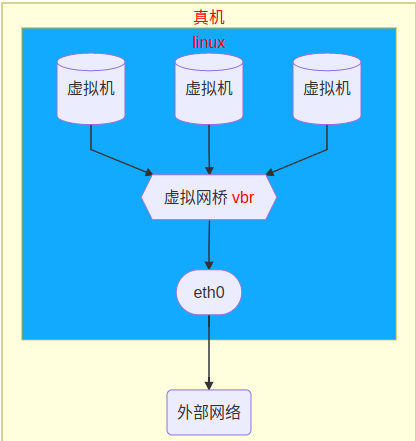
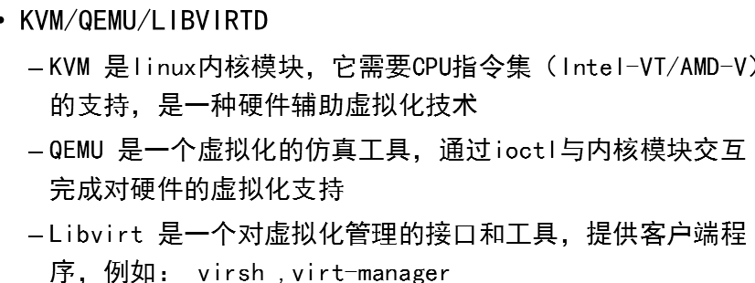
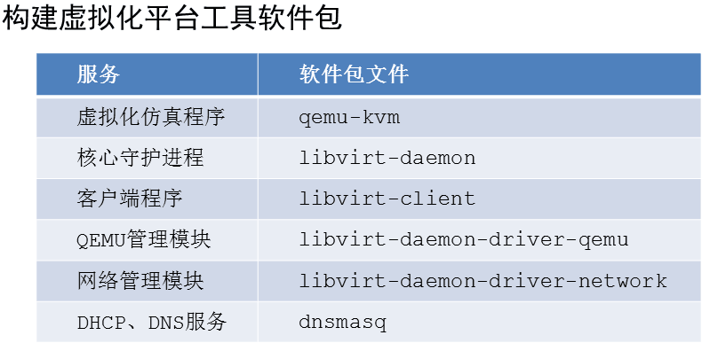
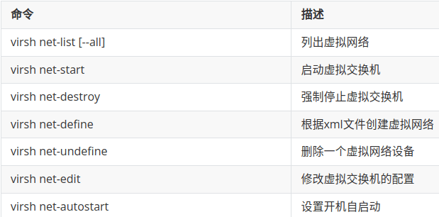
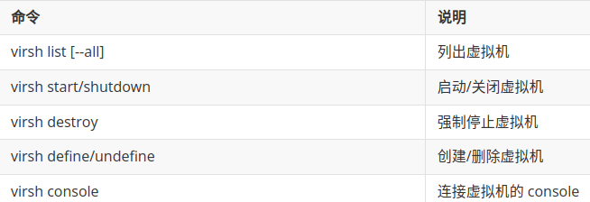
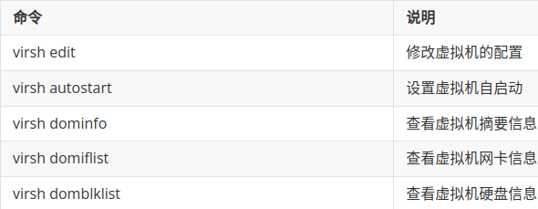

- [学习目标](#学习目标)
- [课堂笔记（命令）](#课堂笔记命令)
- [课堂笔记（文本）](#课堂笔记文本)
- [快捷键](#快捷键)
- [问题](#问题)
- [补充](#补充)
- [今日总结](#今日总结)
- [昨日复习](#昨日复习)

# 学习目标

搭建虚拟化平台

创建云主机

了解云计算

# 课堂笔记（命令）

## lsmod

> 列出已加载的内核模块

## modprobe xx

> 装载模块

## rmmod xx

> 卸载模块

# 课堂笔记（文本）

## 搭建虚拟化平台

### 环境准备

> 准备虚拟机：192.168.88.6 ，作为宿主机
>
> 机器配置：2c4G
>
> 修改注记名为：ecs

### 环境架构图



### 验证虚拟化

```sh
[root@ecs ~]# grep -Po "vmx|svm" /proc/cpuinfo 
vmx
vmx
[root@ecs ~]# lsmod | grep kvm
kvm_intel             339968  0
kvm                   905216  1 kvm_intel
irqbypass              16384  1 kvm
# 未加载使用如下命令加入
[root@ecs ~]#modprobe kvm
```

### 安装服务





```sh
# 安装所需软件包
[root@ecs ~]# dnf install -y qemu-kvm libvirt-daemon libvirt-client libvirt-daemon-driver-qemu libvirt-daemon-driver-network dnsmasq
# 启动
[root@ecs ~]#systemctl enable libvirtd --now
[root@ecs ~]# virsh version
Compiled against library: libvirt 8.0.0
Using library: libvirt 8.0.0
Using API: QEMU 8.0.0
Running hypervisor: QEMU 6.2.0
```

> yum与dnf一样

### 创建网桥

> + 查看官网手册进行配置网桥模板：https://libvirt.org/docs.html
>
> + 使用AI进行进行配置：通义千问、混元助手、讯飞星火、文心一言
> + 网桥就和交换机一样



```sh
# 编写网桥配置文件
[root@ecs ~]# vim /etc/libvirt/qemu/networks/vbr.xml
<network>
  <name>vbr</name>
  <forward mode='nat'/>
  <bridge name='vbr' stp='on' delay='0'/>
  <ip address='192.168.100.254' netmask='255.255.255.0'>
    <dhcp>
      <range start='192.168.100.128' end='192.168.100.200'/>
    </dhcp>
  </ip>
</network>
# 创建网桥，需要指定xml文件
[root@ecs ~]# virsh net-define /etc/libvirt/qemu/networks/vbr.xml
Network vbr defined from /etc/libvirt/qemu/networks/vbr.xml
# 设置开机自启动
[root@ecs ~]# virsh net-autostart vbr
Network vbr marked as autostarted
# 启动网桥
[root@ecs ~]# virsh net-start vbr
Network vbr started
# 验证状态
[root@ecs ~]# virsh net-list --all
 Name   State    Autostart   Persistent
-----------------------------------------
 vbr    active   yes         yes
# 查看网络设备vbr
[root@ecs ~]#ifconfig vbr
```

### 修改网桥

> net-edit 
>
> + 修改网桥支持语法检查
> + 修改后仅需重启修改的网桥

```sh
# 推荐使用
[root@ecs ~]#virsh net-edit vbr
# 不推荐使用
[root@ecs ~]# ls /etc/libvirt/qemu/networks/vbr.xml 
```

### 删除网桥

```sh
# 强制停止虚拟交换机
[root@ecs ~]# virsh net-destroy vbr
Network vbr destroyed
# 状态变为inactive
[root@ecs ~]# virsh net-list --all
 Name   State      Autostart   Persistent
-------------------------------------------
 vbr    inactive   yes         yes
 # 删除交换机vbr
[root@ecs ~]# virsh net-undefine vbr
Network vbr has been undefined
# 再从查看已经没有
[root@ecs ~]# virsh net-list --all
 Name   State   Autostart   Persistent
----------------------------------------
# 连同配置文件也一并删除
[root@ecs ~]# ls /etc/libvirt/qemu/networks/vbr.xml
ls: cannot access '/etc/libvirt/qemu/networks/vbr.xml': No such file or directory
```

## 虚拟机创建

### 虚拟机构成

> 虚拟机配置文件(*.xml)
>
> + 文件默认路径：/etc/libvirt/qemu/
> + 用途：定义了虚拟机的设备；例如：CPU、内存、网卡等
>
> 存储文件(*.img)
>
> + 文件默认路径：/var/lib/libvirt/images/
> + 用途：仿真虚拟机磁盘，存储所有数据信息
>
> 案例：创建虚拟机vmhost虚拟机
>
> + 创建vmhost.img
> + 创建vmhost.xml

### 虚拟磁盘概要

> + 虚拟机磁盘可以使用块设备、逻辑卷设备、文件仿真等
>
> + 其中文件仿真模式具有有易迁移、易扩展、支持多种磁盘格式、配置方便等特点，在云平台上被广泛使用
> + 在文件仿真中被广泛采用的CoW格式具有：
>   + 弹性空间
>   + 后端复盘使用
>   + 支持快照
>   + 支持压缩


### 虚拟磁盘创建格式

> 基本格式命令
>
> ```sh
> qemu-img 子命令 子命令参数 块文件名称 大小
> ```
>
> 常用子命令：
>
> + create 创建一个磁盘
> + info 查看磁盘信息

```sh
# 测试：qemu-img create
# 创建一个普通格式的磁盘容量为20G
[root@ecs ~]# qemu-img create -f raw disk1.img 20G
Formatting 'disk1.img', fmt=raw size=21474836480
# 创建一个CoW格式的磁盘容量为20G
[root@ecs ~]# qemu-img create -f qcow2 disk2.img 20G
Formatting 'disk2.img', fmt=qcow2 cluster_size=65536 extended_l2=off compression_type=zlib size=21474836480 lazy_refcounts=off refcount_bits=16
# 查询磁盘文件的类型
[root@ecs ~]# qemu-img info disk1.img 
image: disk1.img
file format: raw
virtual size: 20 GiB (21474836480 bytes)
disk size: 1 MiB
[root@ecs ~]# qemu-img info disk2.img 
image: disk2.img
file format: qcow2
virtual size: 20 GiB (21474836480 bytes)
disk size: 196 KiB
cluster_size: 65536
Format specific information:
    compat: 1.1
    compression type: zlib
    lazy refcounts: false
    refcount bits: 16
    corrupt: false
    extended l2: false
```

### 创建虚拟机磁盘

> 准备测试文件：[点击下载](https://gogetacoke.lanzv.com/iH7l41mmwroj)
>
> cirros.qcow2                                   
> node_base.xml

```sh
# 拷贝文件
[root@ecs ~]# cp cirros.qcow2 /var/lib/libvirt/images/
[root@ecs ~]# cd /var/lib/libvirt/images/
# 基于cirros.qcow2磁盘作为模板创建vmhost.img
[root@ecs images]# qemu-img create -F qcow2 -f qcow2 -b cirros.qcow2 vmhost.img 20G
Formatting 'vmhost.img', fmt=qcow2 cluster_size=65536 extended_l2=off compression_type=zlib size=21474836480 backing_file=cirros.qcow2 backing_fmt=qcow2 lazy_refcounts=off refcount_bits=16
[root@ecs ~]# qemu-img info vmhost.img #查看信息
```

### 虚拟机配置文件

> 虚拟模板下载：https://libvirt.org/docs.html
>
> 也可AI帮写

```sh
[root@ecs ~]# cp node_base.xml /etc/libvirt/qemu/vmhost.xml
# 修改配置文件，第2行与25行即可
[root@ecs ~]# vim /etc/libvirt/qemu/vmhost.xml 
02: <name>vmhost</name> # 虚拟机名称
03: <memory unit='KB'>1024000</memory>
04: <currentMemory unit='KB'>1024000</currentMemory>
05: <vcpu placement='static'>2</vcpu>
25: <source file='/var/lib/libvirt/images/vmhost.img'/>
29: <source bridge='vbr'/>
```

### 创建虚拟机



```sh
# 创建虚拟机
[root@ecs ~]#virsh define /etc/libvirt/qemu/vmhost.xml
Domain 'vmhost' defined from /etc/libvirt/qemu/vmhost.xml
[root@ecs ~]# virsh list --all
 Id    Name                           State
----------------------------------------------------
 -     vmhost                         shut off
# 启动虚拟机
[root@ecs ~]# virsh start vmhost
Domain vmhost started
[root@ecs ~]# virsh console vmhost # 两次回车
Connected to domain vmhost
Escape character is ^]

login as 'cirros' user. default password: 'gocubsgo'. use 'sudo' for root.
cirros login: 
退出使用 ctrl + ]
# undefine删除虚拟机配置文件.xml，虚拟机在运行删除也不影响
[root@ecs ~]#virsh undefine vmhost
# destroy强制停止虚拟机，类似拔掉电源
[root@ecs ~]#virsh destroy vmhost
"
virsh 执行启动关闭时是通过agent进行指令传递
删除img文件需要手动执行rm -rf xx.img
"
```

> 代码解释：
>
> virsh define xx.xml
>
> 其作用是从指定路径 `/etc/libvirt/qemu/vmhost.xml` 加载虚拟机的配置信息。这个XML文件包含了虚拟机的硬件配置（如CPU、内存、磁盘、网卡等），以及虚拟机启动时所需的其他参数。
>
> 执行该命令后，libvirt会根据xml文件中的定义创建或更新名为“vmhost”的虚拟机配置，但不会立即启动虚拟机。要启动虚拟机，还需使用 `virsh start vmhost` 命令。如果虚拟机已经存在，执行此命令则会更新虚拟机的配置信息。

### 常用管理命令



```sh
# virsh edit 修改xml文件时用于检查语法;修改配置文件后若虚拟机正在运行想要生效配置，需要手动重启：virsh shutdown \ virsh start
[root@ecs ~]#virsh edit /etc/libvirt/qemu/vmhost.xml 
# virsh dominfo 列出虚拟机CPU等信息
[root@ecs images]# virsh dominfo vmhost
Id:             -
Name:           vmhost
UUID:           7655b2af-d65e-4f6d-94eb-ead0ab4ba7e6
OS Type:        hvm
State:          shut off
CPU(s):         2
Max memory:     1024000 KiB
Used memory:    1024000 KiB
Persistent:     yes
Autostart:      disable
Managed save:   no
Security model: none
Security DOI:   0
# virsh domblklist 查看虚拟机磁盘信息；查询所属仿真文件
[root@ecs images]# virsh domblklist vmhost
 Target   Source
----------------------------------------------
 vda      /var/lib/libvirt/images/vmhost.img
# virsh domiflist 查看网卡信息
 [root@ecs images]# virsh domiflist vmhost
 Interface   Type     Source   Model    MAC
-----------------------------------------------------------
 vnet0       bridge   vbr      virtio   52:54:00:46:1c:72
```

> virsh domiflist 信息详解
>
> - **Interface**: 显示的是虚拟机内部的网络接口名称，这里是 `vnet0`。虚拟机可以有多个网络接口，每个接口都会有一个标识。
> - **Type**: 表示网络接口的类型，这里是 `bridge`。这意味着这个虚拟网络接口与宿主机上的一个网桥（bridge）相连，允许虚拟机通过该网桥与其他物理或虚拟网络进行通信。
> - **Source**: 指定虚拟网络接口连接到的具体实体，这里是 `vbr`。根据上下文，这应该是名为 "vbr" 的网桥（Virtual Bridge），这是虚拟机网络配置中定义的一个虚拟网络桥接点。
> - **Model**: 描述了虚拟网络接口卡（NIC）所使用的模型，这里是 `virtio`。 VirtIO 是一种在虚拟化环境中广泛使用的高效I/O半虚拟化技术，能为虚拟机提供接近于物理设备性能的网络和存储访问能力。

## 云计算简介

### 三大服务模式

> **IaaS**: 基础设施服务，Infrastructure-as-a-service
> **PaaS**: 平台服务，Platform-as-a-service
> **SaaS**: 软件服务，Software-as-a-service


### 三大使用场景

> **公有云**：是第三方的云供应商，通过互联网为广大用户提供的一种按需使用的服务器资源，是一种云基础设施。
> **私有云**：是一个企业或组织的专用云环境。一般在企业内部使用，不对外提供服务，因此它也被视为一种企业云。
> **混合云**：是在私有云的基础上，组合其他公有云资源，从而允许在不同云环境之间共享应用和数据的使用方式。

# 快捷键


# 问题


# 补充

## 查询linux是否支持虚拟化

```sh
[root@ecs ~]# grep -Po "vmx|svm" /proc/cpuinfo # 有输出代表支持
[root@ecs ~]# lsmod |grep kvm # 列出内核虚拟模块信息
```


# 今日总结


# 昨日复习