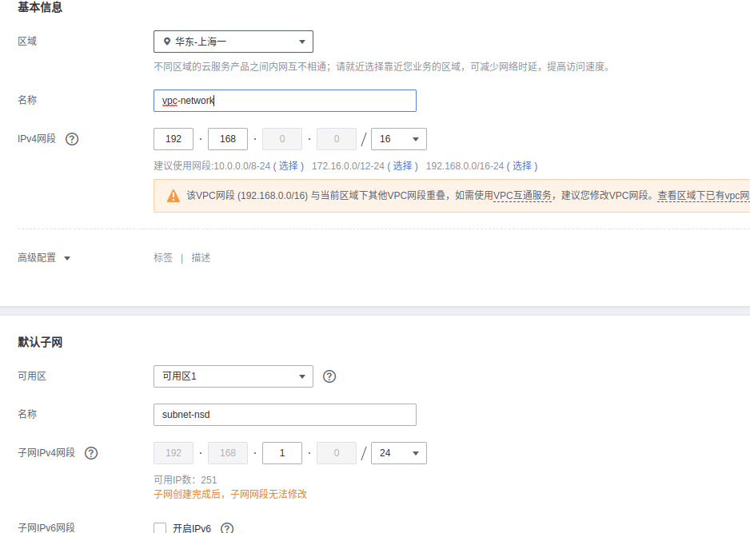
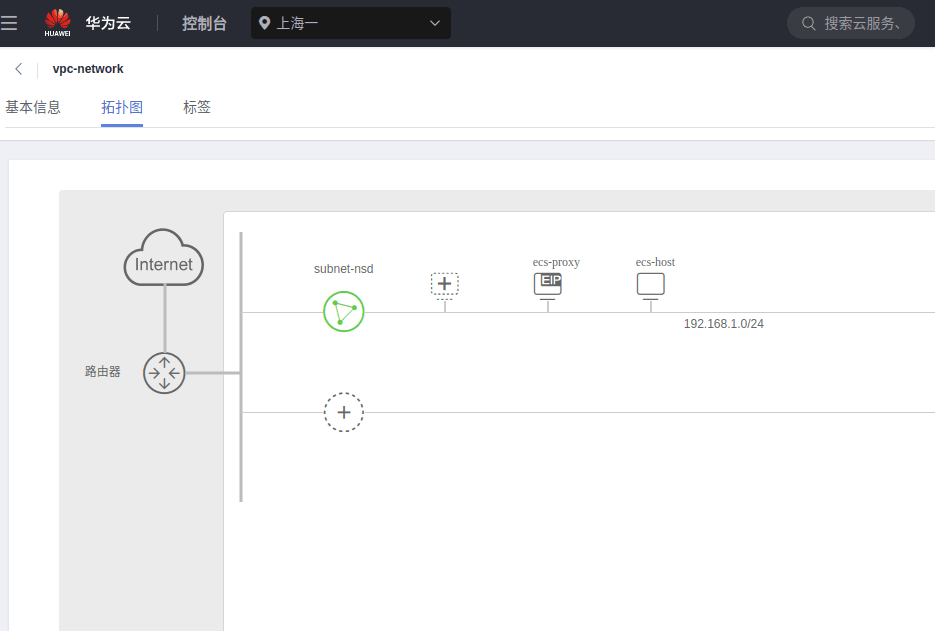
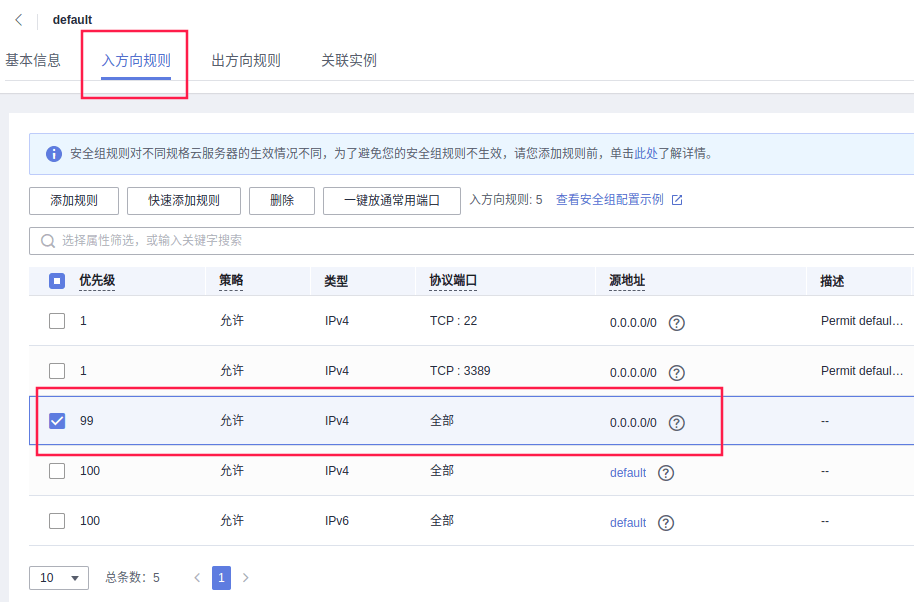
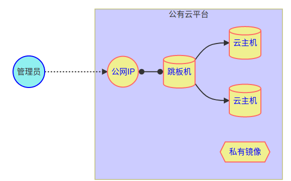
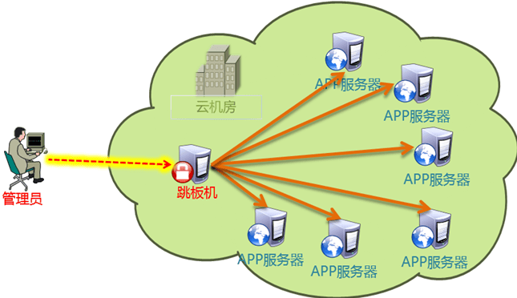
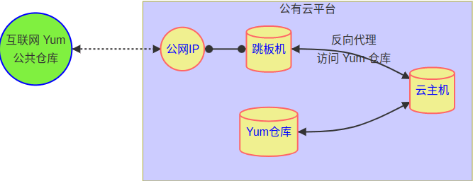

- [学习目标](#学习目标)
- [课堂笔记（命令）](#课堂笔记命令)
  - [华为云服务](#华为云服务)
    - [vpc配置](#vpc配置)
    - [拓扑结构图](#拓扑结构图)
    - [安全组配置](#安全组配置)
    - [机器准备](#机器准备)
  - [基础架构图](#基础架构图)
  - [跳板机配置](#跳板机配置)
    - [云架构图](#云架构图)
    - [ansible管理主机](#ansible管理主机)
    - [优化系统配置](#优化系统配置)
    - [代理仓库图例](#代理仓库图例)
    - [配置代理YUM仓库](#配置代理yum仓库)
    - [自定义yum仓库](#自定义yum仓库)
  - [组内主机配置](#组内主机配置)
    - [配置yum客户端](#配置yum客户端)
    - [系统优化配置](#系统优化配置)
- [课堂笔记（文本）](#课堂笔记文本)
- [快捷键](#快捷键)
- [问题](#问题)
- [补充](#补充)
- [今日总结](#今日总结)
- [昨日复习](#昨日复习)


# 学习目标

华为云服务

华为云管理

华为云案例

# 课堂笔记（命令）

## 华为云服务

> 配置私有VPC网络
>
> 1. 配置私有VPC网络，设置(类似配置了一个路由器)
> 2. 在访问控制中配置安全组(入口即出口配置)
>
> 购买ECS云主机
>
> 1. 购买ECS服务器（选择相关配置）
> 2. 购买完成后点击远程登陆
>
> 购买弹性公网IP
>
> 1. 购买弹性公网IP，按量计费
> 2. 在ECS主机管理页绑定公网IP
>
> winterm ssh 远程连接公网IP即可管理此时该机器被称为跳板机

### vpc配置



> 配置子网类似配置了一个交换机

### 拓扑结构图



### 安全组配置



> 点击默认安全组，在默认安全组中的入方向规则添加一条规则

### 机器准备

> 购买ECS云主机的配置、购买公网IP

| 主机名    | IP            | 公网IP        | 服务器型号 |
| --------- | :------------ | ------------- | ---------- |
| ecs-proxy | 192.168.1.252 | 60.204.246.72 | 2C4G       |
| ecs-host  | 192.168.1.125 | 无            | 1C1G       |

> host主机没有公网IP，由于与proxy在同一个组里，proxy可以通过ssh远程连接管理

## 基础架构图



## 跳板机配置

### 云架构图



### ansible管理主机

> + 将proxy主机配置为跳板机
> + 将跳板机的公钥发给组里的机器实现管理私有网络机器

```sh
# 安装ansible基本软件
[root@ecs-proxy ~]# dnf install -y ansible-core
# 生成公私钥
[root@ecs-proxy ~]# ssh-keygen 
[root@ecs-proxy ~]# chmod 0400 /root/.ssh/id_rsa
# 上传公钥到组机器上
[root@ecs-proxy ~]# ssh-copy-id -i /root/.ssh/id_rsa.pub 192.168.1.125
```

### 优化系统配置

> + 只有跳板机安全了，组里面的机器才是最安全的

```sh
# 停止atd计划任务，kdump内核崩溃转存服务，nis-domainname维护主机名到NIS域名的映射
[root@ecs-proxy ~]# systemctl stop atd kdump nis-domainname
# 卸载postfix邮件传输代理，at计划任务程序包，audit审计框架，kexec-tools内核替换工具，firewalld-*开头的软包
[root@ecs-proxy ~]# dnf remove -y postfix at audit kexec-tools firewalld-* *-firmware unbound-libs 
# 安装rsync文件同步工具，tree生成目录树，bash-completion提供tab补全，lrzsz网络连接上传，tar归档打包，iptables是linux内核防火墙，patch用于diff文件夹来源，ipset是IP集合管理工具，time是测量程序运行时间
[root@ecs-proxy ~]# dnf install -y rsync tree bash-completion lrzsz tar iptables patch ipset time
# ListenAddress 0.0.0.0 表示sshd应监听来自任意网络接口的所有连接请求。默认情况下，sshd可能仅监听本地回环地址（127.0.0.1），添加此行后将允许远程主机通过任何网络接口连接到该SSH服务器。
[root@ecs-proxy ~]# echo 'ListenAddress 0.0.0.0' >>/etc/ssh/sshd_config
[root@ecs-proxy ~]# sed -ri 's,^(OPTIONS).*,\1="-4u chrony",' /etc/sysconfig/chronyd
[root@ecs-proxy ~]# sed 's,^manage_etc_hosts:.*,# &,' -i /etc/cloud/cloud.cfg
[root@ecs-proxy ~]# vim /etc/hosts
::1             localhost localhost.localdomain localhost6 localhost6.localdomain6
127.0.0.1       localhost localhost.localdomain localhost4 localhost4.localdomain4
[root@ecs-proxy ~]# reboot
```

### 代理仓库图例



### 配置代理YUM仓库

> 配置代理yum为组内主机提供yum

```sh
[root@ecs-proxy ~]# dnf install -y nginx
[root@ecs-proxy ~]# vim /etc/nginx/default.d/dnf_proxy.conf
resolver 100.125.1.250 100.125.129.250 valid=5 ipv6=off;
"匹配所有以/rockylinux开头的路径，
"
location ~ ^/rockylinux/(.*)$ {
    proxy_pass https://repo.huaweicloud.com/rockylinux/$1; # 代理转发
}
https://repo.huaweicloud.com/rockylinux/$releasever/AppStream/$basearch/os/
[root@ecs-proxy ~]# systemctl enable --now nginx
```

### 自定义yum仓库

> 用于放置yum仓库中没有的软件包

```sh
[root@ecs-proxy ~]# dnf install -y createrepo
[root@ecs-proxy ~]# mkdir -p /var/localrepo
# 生成软件清单
[root@ecs-proxy ~]# createrepo --update /var/localrepo
# 通过软链接放置在nginx的html目录下
[root@ecs-proxy ~]# ln -s /var/localrepo /usr/share/nginx/html/
```

## 组内主机配置

> 配置为一个模板机器，在华为上做成镜像，购买云主机时使用

### 配置yum客户端

```sh
# 删除yum.repos.d下所有epel和Rocky-不是ABE的所有文件
[root@ecs-host ~]# rm -f /etc/yum.repos.d/{epel,Rocky-[!ABE]}*
[root@ecs-host ~]#ls /etc/yum.repos.d/
Rocky-AppStream.repo  Rocky-BaseOS.repo  Rocky-Extras.repo
# 替换所有repo文件中所有域名替换为跳板机的IP
[root@ecs-host ~]# sed -ri 's,https://repo.huaweicloud.com,http://192.168.1.252,' /etc/yum.repos.d/*.repo
# 配置跳板机的自定义yum
[root@ecs-host ~]# vim /etc/yum.repos.d/local.repo
[local_repo]
name=Rocky Linux $releasever - Localrepo
baseurl=http://192.168.1.252/localrepo
enabled=1
gpgcheck=0
# 验证
[root@ecs-proxy ~]# dnf repolist
repo id                   repo name
appstream                 Rocky Linux 8 - AppStream
baseos                    Rocky Linux 8 - BaseOS
extras                    Rocky Linux 8 - Extras
local_repo                Rocky Linux 8 - Localrepo
```

### 系统优化配置

```sh
[root@ecs-host ~]# systemctl stop atd kdump nis-domainname
[root@ecs-host ~]# dnf remove -y postfix at audit kexec-tools firewalld-* *-firmware unbound-libs 
[root@ecs-host ~]# dnf install -y rsync tree bash-completion lrzsz tar iptables patch ipset time
[root@ecs-host ~]# echo 'ListenAddress 0.0.0.0' >>/etc/ssh/sshd_config
[root@ecs-host ~]# sed -ri 's,^(OPTIONS).*,\1="-4u chrony",' /etc/sysconfig/chronyd
[root@ecs-host ~]# sed 's,^manage_etc_hosts:.*,# &,' -i /etc/cloud/cloud.cfg
[root@ecs-host ~]# vim /etc/hosts
::1             localhost localhost.localdomain localhost6 localhost6.localdomain6
127.0.0.1       localhost localhost.localdomain localhost4 localhost4.localdomain4
[root@ecs-host ~]# dnf clean all
[root@ecs-host ~]# poweroff
```


# 课堂笔记（文本）


# 快捷键


# 问题


# 补充


# 今日总结


# 昨日复习