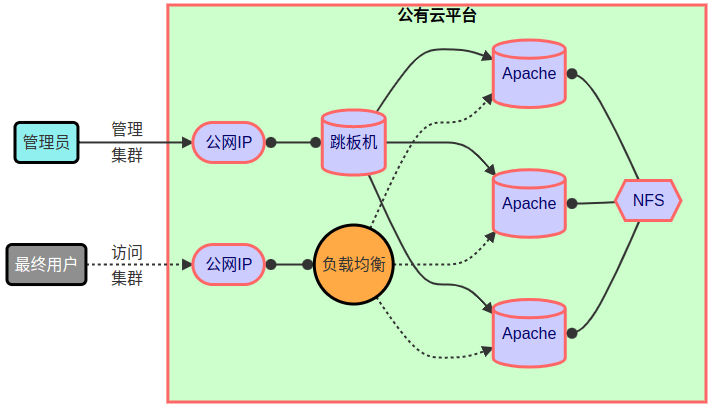
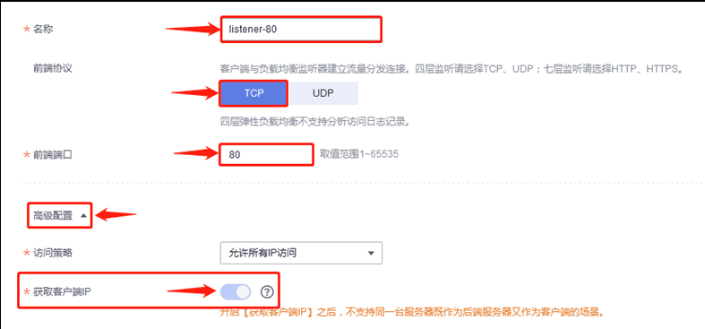
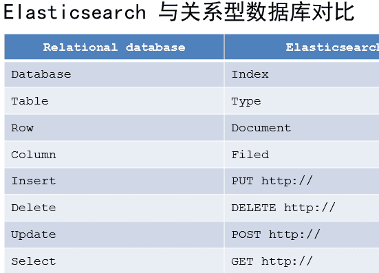
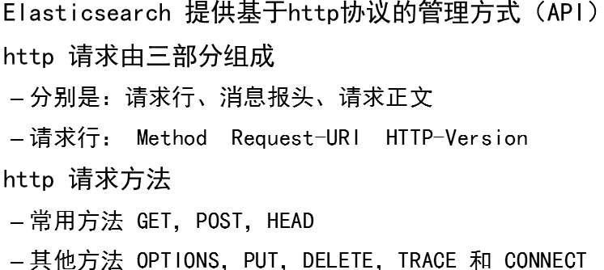

- [学习目标](#学习目标)
- [课堂笔记（命令）](#课堂笔记命令)
- [课堂笔记（文本）](#课堂笔记文本)
- [快捷键](#快捷键)
- [问题](#问题)
- [补充](#补充)
- [今日总结](#今日总结)
- [昨日复习](#昨日复习)

# 学习目标

华为云网站部署实战

华为云负载均衡ELB

Elasticsearch安装部署

# 课堂笔记（命令）


# 课堂笔记（文本）

## web集群部署实战

> 使用华为云进行负载web集群负载均衡配置

### 集群架构图



### 主机准备

> 购买云主机

|   名称   |    IP地址    |     配置     |
| :------: | :----------: | :----------: |
|   nfs    | 192.168.1.10 | 1CPU，1G内存 |
| web-0001 | 192.168.1.11 | 2CPU，4G内存 |
| web-0002 | 192.168.1.12 | 2CPU，4G内存 |
| web-0003 | 192.168.1.13 | 2CPU，4G内存 |

### nfs服务网站

> [下载页面数据](https://gogetacoke.lanzv.com/ijWfB1msmili)
> 密码:f9bp

```sh
# 拷贝网站页面到 NFS 云主机
[root@ecs-proxy]#rsync -av website.tar.gz 192.168.1.10:/root/
[root@ecs-proxy]#mkdir /var/webroot
[root@ecs-proxy]#tat -zxf website.tar.gz -C /var/webroot

# 部署 NFS 服务
[root@nfs ~]# dnf install -y nfs-utils
[root@nfs ~]# vim /etc/exports
/var/webroot    192.168.1.0/24(rw,no_root_squash)

[root@nfs ~]# systemctl enable --now nfs-server.service
```

### 部署web服务

> 在跳板机上配置ansible一键部署

```sh
[root@ecs-proxy ~]# mkdir website
[root@ecs-proxy ~]# cd website
[root@ecs-proxy website]# vim ansible.cfg
[defaults]
inventory         = hostlist
host_key_checking = False # 跳过ssh验证时输入yes
[root@ecs-proxy website]# vim hostlist
[web]
192.168.1.[11:13]
[root@ecs-proxy website]# vim web_install.yaml
---
- name: web 集群安装
  hosts: web
  tasks:
  - name: 安装 apache 服务 
    dnf:
      name: httpd,php,nfs-utils
      state: latest
      update_cache: yes # 提前更前yum缓存
  - name: 配置 httpd 服务 
    service:
      name: httpd
      state: started
      enabled: yes
  - name: 编辑 fstab 文件，添加 NFS 配置
    lineinfile:
      path: /etc/fstab
      regexp: '^192.168.1.10:/.*'
      line: '192.168.1.10:/var/webroot /var/www/html nfs defaults,_netdev,nolock 1 1'
      create: yes # 文件存在就修改，不存在就创建
  - name: 挂载 NFS
    shell:
      cmd: mount /var/www/html

# 设置语言环境
[root@ecs-proxy website]# locale
[root@ecs-proxy website]# export LANG="en_US.UTF-8" LC_ALL="en_US.UTF-8"
[root@ecs-proxy website]# echo 'export LANG="en_US.UTF-8" /etc/profile.d/lang.sh'
# 执行 playbook 完成安装
[root@ecs-proxy website]# ansible-playbook web_install.yaml
```

### 配置负载均衡

> + 配置华为云负载均衡对外发布服务

#### 购买ELB


#### 配置监听器





**点击添加后端主机**


#### 绑定公网IP


#### 浏览器访问

> 浏览器访问公网IP地址

## ELK部署安装

### ELK概述


### ELK特点


### ELK术语




### 添加软件包

> elasticsearch-7.17.8-x86_64.rpm
> filebeat-7.17.8-x86_64.rpm
> kibana-7.17.8-x86_64.rpm
> logstash-7.17.8-x86_64.rpm
> metricbeat-7.17.8-x86_64.rpm

```sh
[root@ecs-proxy]# rsync -av elk/ /var/localrepo/elk/
# 更新自定义yum仓库
[root@ecs-proxy]# createrepo --update /var/localrepo
```

### 购买云主机

| 主机    | IP地址       | 配置          |
| ------- | ------------ | ------------- |
| es-0001 | 192.168.1.21 | 最低配置2核4G |
| es-0002 | 192.168.1.22 | 最低配置2核4G |
| es-0003 | 192.168.1.23 | 最低配置2核4G |
| es-0004 | 192.168.1.24 | 最低配置2核4G |
| es-0005 | 192.168.1.25 | 最低配置2核4G |

### 集群安装

#### 部署0001

```sh
[root@es-0001 ~]# dnf install -y elasticsearch
[root@es-0001 ~]# vim /etc/elasticsearch/elasticsearch.yml
17:  cluster.name: my-es # 集群名
23:  node.name: es-0001 # 当前节点名
56:  network.host: 0.0.0.0 # 允许访问的IP
70:  discovery.seed_hosts: ["es-0001", "es-0002", "es-0003"] # 集群广播成员
74:  cluster.initial_master_nodes: ["es-0001", "es-0002", "es-0003"]# 集群创始人成员
[root@es-0001 ~]# systemctl enable --now elasticsearch
```

#### 剧本集群部署

> 拷贝es-0001主机的elasticsearch.yml 做为模板,发送至跳板机
>
> 编写剧本快速部署

```sh
# 编写基础剧本配置
[root@ecs-proxy ~]#mkdir -p els/files
[root@ecs-proxy ~]#touch els/{ansible.cfg,hostlist}
[root@ecs-proxy ~]#vim els/ansible.cfg
[defaults]
inventory = hostlist
host_key_checking = False
[root@ecs-proxy ~]#vim els/hostlist
[es]
192.168.1.[21:25]
# 拷贝文件做为模板
[root@ecs-es-0001 ~]#rsync -av /etc/elasticsearch/elasticsearch.yml 192.168.1.252:/root/els/files
[root@ecs-proxy ~]#vim els/files/elasticsearch.yml 
23:  node.name: {{ ansible_hostname }}
# 编写剧本
[root@ecs-proxy ~]#vim els/01-install-els.yml
---
- name: installs
  hosts: all
  tasks:
    - name: install pkg
      dnf:
        name: elasticsearch
        state: latest
        update_cache: yes
    - name: edit hosts
      blockinfile:
        path: /etc/hosts
        block: |
          192.168.1.21    es-0001
          192.168.1.22    es-0002
          192.168.1.23    es-0003
          192.168.1.24    es-0004
          192.168.1.25    es-0005
    - name: rm file
      file:
        path: /etc/elasticsearch/elasticsearch.yml
        state: absent
    - name: upload template
      template:
        src: /root/els/files/elasticsearch.yml
        dest: /etc/elasticsearch/elasticsearch.yml
        owner: root
        group: elasticsearch
        mode: '0644'
    - name: service
      service:
        name: elasticsearch
        state: started
        enabled: yes
        
```

### 插件管理


#### Head插件图例


#### 部署插件页

> [下载插件页](https://gogetacoke.lanzv.com/iZX4H1mtyv8b)
>
>
> 密码:ce4f

```sh
[root@ecs-proxy ~]# rsync -av head.tar.gz 192.168.1.21:./
#-------------------------------------------------
# 在 es-0001 上安装 web 服务，并部署插件
[root@es-0001 ~]# dnf install -y nginx
[root@es-0001 ~]# systemctl enable --now nginx
[root@es-0001 ~]# tar zxf head.tar.gz -C /usr/share/nginx/html/
[root@es-0001 ~]#systemctl enable --now nginx
```

**在负载均衡上开放8080端口**

> 浏览器访问公网IP获取到nginx首页即可


#### 认证和代理

```sh
[root@es-0001 ~]# vim /etc/nginx/default.d/esproxy.conf 
location ~* ^/es/(.*)$ {
    proxy_pass http://127.0.0.1:9200/$1; # 转发请求到本机的9200
    auth_basic "Elasticsearch admin"; # 设置一个认证
    auth_basic_user_file /etc/nginx/auth-user; 
}
[root@es-0001 ~]# dnf install -y httpd-tools
[root@es-0001 ~]# htpasswd -cm /etc/nginx/auth-user admin # 用户名为admin
New password: 
Re-type new password: 
Adding password for user admin
[root@es-0001 ~]# systemctl reload nginx
# 浏览器访问
http://负载均衡IP:8080/es/
http://负载均衡IP:8080/es-head
# 在head插件首页，输入http://60.204.170.134:8080/es/ 连接
```

> 通过head插件管理elasicsearch集群

### API原语管理



> 与elasticsearch交互的数据使用json
>
> HEAD：Content-Type：application/json
>
> 增 put
>
> 删 delete
>
> 改 post
>
> 查 get

#### 创建索引

```sh
# 设置默认分片副本数量
[root@es-0001 ~]# curl -XPUT -H 'Content-Type: application/json' \
    http://127.0.0.1:9200/_template/index_defaults -d '{
      "template": "*",
      "settings": {
        "number_of_shards": 5,
        "number_of_replicas": 1
      }
    }'
{"acknowledged":true}

# 创建 tedu 索引
[root@es-0001 ~]# curl -XPUT http://127.0.0.1:9200/tedu?pretty
{
  "acknowledged" : true,
  "shards_acknowledged" : true,
  "index" : "tedu"
}
```

> 也可通过es-head页面进行创建

#### 增加数据

```
[root@es-0001 ~]# curl -XPUT -H "Content-Type: application/json" \
    http://127.0.0.1:9200/tedu/teacher/1?pretty -d '{
        "职业": "诗人","名字": "李白","称号": "诗仙","年代": "唐"
    }' 
```

#### 查询数据

```
[root@es-0001 ~]# curl -XGET http://127.0.0.1:9200/tedu/teacher/_search?pretty
[root@es-0001 ~]# curl -XGET http://127.0.0.1:9200/tedu/teacher/1?pretty
```

#### 修改数据

```
[root@es-0001 ~]# curl -XPOST -H "Content-Type: application/json" \
    http://127.0.0.1:9200/tedu/teacher/1/_update -d '{ 
      "doc": {"年代":"公元701"}
    }'
```

#### 删除数据

```
# 删除一条
[root@es-0001 ~]# curl -XDELETE http://127.0.0.1:9200/tedu/teacher/1
# 删除索引
[root@es-0001 ~]# curl -XDELETE http://127.0.0.1:9200/tedu
```

#### 补充

> 以上操作都可在head插件页进行手动操作

# 快捷键


# 问题


# 补充


# 今日总结


# 昨日复习