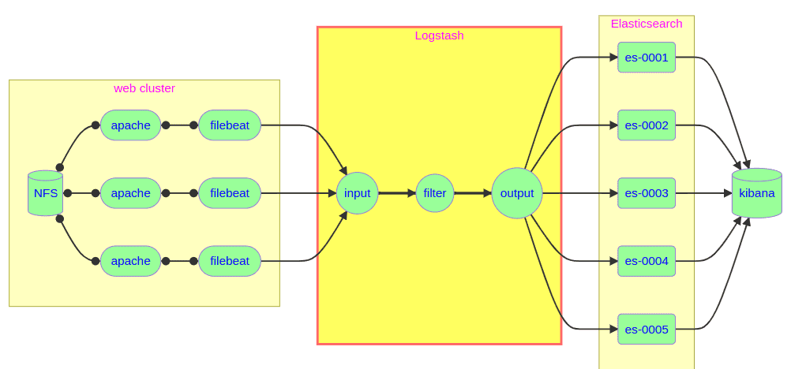
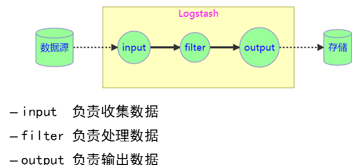
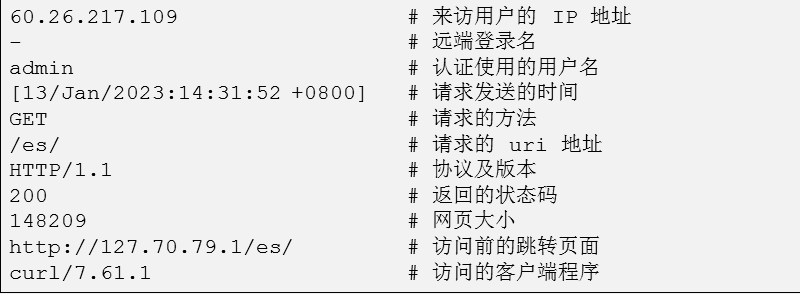

- [学习目标](#学习目标)
- [课堂笔记（命令）](#课堂笔记命令)
- [课堂笔记（文本）](#课堂笔记文本)
- [快捷键](#快捷键)
- [问题](#问题)
- [补充](#补充)
- [今日总结](#今日总结)
- [昨日复习](#昨日复习)

# 学习目标

logstash配置管理

# 课堂笔记（命令）

## 项目架构图



## Logstash配置管理

### 概述

> 一个数据采集、加工处理以及传输的工具

### 特点

> + 所有类型的数据集中处理
> + 不同模式和格式数据的正常化
> + 自定义日志格式的迅速扩展
> + 为自定义数据源轻松添加插件

### 结构原理



### 方法


### 准备主机

| 主机名称 | IP地址       | 配置          |
| -------- | ------------ | ------------- |
| logstash | 192.168.1.27 | 最低配置4核8G |

### 安装logstash

```sh
[root@logstash ~]# vim /etc/hosts
192.168.1.21    es-0001
192.168.1.22    es-0002
192.168.1.23    es-0003
192.168.1.24    es-0004
192.168.1.25    es-0005
192.168.1.27    logstash
[root@logstash ~]# dnf install -y logstash
# 做一个软链接
[root@logstash ~]# ln -s /etc/logstash /usr/share/logstash/config
```

### 配置文件编写

> 简易配置

```sh
[root@logstash ~]# vim /etc/logstash/conf.d/my.conf
input { 
  stdin {} # 键盘输入
}

filter{ 

}

output{ 
  stdout{} # 屏幕输出
}
# 启动测试，稍等30s屏幕进入停滞状态时，键盘输入进行测试
[root@logstash ~]# /usr/share/logstash/bin/logstash
hahahahah
{
    "@timestamp" => 2024-02-01T01:35:21.272Z,
          "host" => "logstash",
       "message" => "hahahahah",
      "@version" => "1"
}
i,love,you
{
    "@timestamp" => 2024-02-01T01:35:45.889Z,
          "host" => "logstash",
       "message" => "i,love,you",
      "@version" => "1"
}
```

### 插件管理

> [访问官网手册](https://www.elastic.co/guide/en/logstash/7.17/index.html)
>
> 查看插件 list
>
> 安装插件 install
>
> 删除插件 uninstall

```sh
# 列出插件logstash安装的插件
[root@logstash ~]# /usr/share/logstash/bin/logstash-plugin list
```

#### 插件与模块关系

> + logstash-input-xxx   只能用于input模块的插件
>
> + logstash-output-xxx  只能用于output模块的插件
>
> + logstash-filter-xxx 只能用于filter模块的插件
>
> + logstash-codec-xxx 编码插件不受模块的限制

### input模块

#### json插件

```sh
[root@logstash ~]# vim /etc/logstash/conf.d/my.conf
input { 
  stdin {
  	codec => "json" # 指定输入格式为json数据
  } 
}

filter{ 

}

output{ 
  stdout{
  	codec => "rubydebug"  # 输出成用户易读形式；将数据进行格式化方便查看
  } 
}
# 输入测试数据
[root@logstash ~]# /usr/share/logstash/bin/logstash
{"a":"1", "b":"2", "c":"3"}
{
             "b" => "2",
             "c" => "3",
          "host" => "logstash",
    "@timestamp" => 2024-02-01T02:23:01.014Z,
             "a" => "1",
      "@version" => "1"
}
```

#### file插件

> file插件主要从本地文件中获取数据，并实时监控文件的变化

```sh
# 编写file插件格式
[root@logstash ~]# vim /usr/share/logstash/config/conf.d/my.conf 
input {
        file{
                path => ["/opt/a.log","/opt/b.log"] # 监视opt目录下的a.log和b.log文件
        }
}

filter {

}
output {
        stdout {
                codec => "rubydebug"
        }
}
[root@logstash ~]# /usr/share/logstash/bin/logstash
# 测试;打开两个终端,一个终端运行程序，一个终端输入数据
[root@logstash ~]# touch /opt/{a,b}.log
# 写入测试数据；终端2
[root@logstash ~]# echo {"123"} >> /opt/a.log 
[root@logstash ~]# ^a.log^b.log
# 终端1查看结果
[root@logstash ~]# /usr/share/logstash/bin/logstash
{
          "host" => "logstash",
       "message" => "{123}",
          "path" => "/opt/a.log",
      "@version" => "1",
    "@timestamp" => 2024-02-01T02:50:05.571Z
}
{
          "host" => "logstash",
       "message" => "{123}",
          "path" => "/opt/b.log",
      "@version" => "1",
    "@timestamp" => 2024-02-01T02:50:20.720Z
}
```

#### file高级配置

##### **默认读取上次位置**

> 关闭logstash程序后，再往日志文件中写入日志，开启程序后将从上次关闭时的位置读取新增的数据

```sh
# 测试；关闭程序；向日志文件写入新数据
[root@logstash ~]# echo "new date" >> /opt/a.log
# 运行程序查看
[root@logstash ~]# /usr/share/logstash/bin/logstash
{
      "@version" => "1",
          "path" => "/opt/a.log",
    "@timestamp" => 2024-02-01T03:46:39.195Z,
       "message" => "new date",
          "host" => "logstash"
}

"
读取上次位置原理时，logstash会将程序关闭后将进行标记，并记录到一个标签文件中，运行程序时，将会读取该文件来展示数据
"
# 查询标签文件;默认为一个隐藏文件
[root@logstash ~]# ls -la /var/lib/logstash/plugins/inputs/file/
-rw-r--r-- 1 root root   96 Feb  1 11:49 .sincedb_21e68b091b16b2dc7ec64a35b397f73a

# 更改标签文件名
[root@logstash ~]# vim /usr/share/logstash/config/conf.d/my.conf 
input {
        file{
                path => ["/opt/a.log"]
                sincedb_path => "/var/lib/logstash/test.db"
        }
}
# 验证测试;由于该标签文件是程序关闭时才会写入的一个文件，所以启动logstash再ctrl+c结束即可
# 删除已经生成的文件；再重启
[root@logstash ~]# rm -rf /var/lib/logstash/plugins/inputs/file/.sinc*
[root@logstash ~]# /usr/share/logstash/bin/logstash
ctrl+c
[root@logstash ~]# ls /var/lib/logstash/test.db 
/var/lib/logstash/test.db
```

##### **读取日志两参数**

> 1. **beginning**:
>    - 当设置为 `"beginning"` 时，Logstash 会从指定日志文件的起始位置开始读取数据，并处理整个文件的内容。这对于初次启动 Logstash 或者需要重新处理历史日志数据的情况非常有用。
> 2. **end** (或 `tail`)：
>    - 默认情况下，如果没有明确指定 `start_position` 或设置为 `"end"`，Logstash 会采用类似于Linux命令`tail -f`的行为方式，仅从文件当前的末尾位置开始读取新产生的日志行。这意味着它将实时监控文件，捕获并处理文件追加的新内容，而不处理文件已经存在的旧内容。

```sh
"beginning读取新数据，数据已经被读取将不会再被读取"
[root@logstash ~]# vim /usr/share/logstash/config/conf.d/my.conf 
input {
        file{
                path => ["/opt/a.log"]
                start_position => "beginning" 
                sincedb_path => "/var/lib/logstash/test.db"
        }
}

"end：只读取程序运行时写入的新数据"
[root@logstash ~]# vim /usr/share/logstash/config/conf.d/my.conf 
input {
        file{
                path => ["/opt/a.log"]
                start_position => "end" 
                sincedb_path => "/var/lib/logstash/test.db"
        }
}
```

##### 小技巧

> 解决问题：
>
> + 避免logstash无法读取历史日志
> + 若要读取历史日志还需删除标签文件
>
> [注]：只用于调试日志，避免生产使用

```sh
[root@logstash ~]# vim /usr/share/logstash/config/conf.d/my.conf 
input {
        file{
                path => ["/opt/a.log"]
                start_position => "beginning" 
                sincedb_path => "/dev/null"
        }
}
```

### filter模块

> 用于处理input模块收集的日志，做格式化处理

#### 准备测试数据

```sh
# 在web服务器11上复制一条访问日志,将测试数据写入a.log中
[root@logstash ~]#vim /opt/a.log
192.168.1.252 - - [01/Feb/2024:14:33:51 +0800] "GET /info.php HTTP/1.1" 200 172 "-" "curl/7.61.1"
```

**日志各字段含义**



#### grok模块

> Grok是一个强大的文本解析器，它允许你使用模式（pattern）来提取日志中的特定信息
>
> 支持两种匹配模式：
>
> + 正则表达式分组匹配格式: (?<名字>正则表达式)
>
> + 正则表达式宏调用格式: %{宏名称:名字}
>
>   宏文件参考路径：/usr/share/logstash/vendor/bundle/jruby/2.5.0/gems/logstash-patterns-core-4.3.4/patterns

##### 基本格式

```sh
[root@logstash ~]# vim /usr/share/logstash/config/conf.d/my.conf 
filter {
        grok {
                match => {"message" => ""}
        }
}
[root@logstash ~]# /usr/share/logstash/bin/logstas
{
      "@version" => "1",
    "@timestamp" => 2024-02-01T07:32:50.691Z,
          "host" => "logstash",
          "path" => "/opt/a.log",
       "message" => "192.168.1.252 - - [01/Feb/2024:14:33:51 +0800] \"GET /info.php HTTP/1.1\" 200 172 \"-\" \"curl/7.61.1\""
}
```

##### 正则匹配

> 案例：匹配IP地址
>
> 格式：
>
> (?<名字>正则表达式)

```sh
[root@logstash ~]# vim /usr/share/logstash/config/conf.d/my.conf 
filter {
        grok {
                match => {"message" => "(?<clientIP>((25[0-5]|2[0-4]\d|1?\d?\d)\.){3}(25[0-5]|2[0-4]\d|1?\d?\d))"}
        }
}
[root@logstash ~]# /usr/share/logstash/bin/logstas
{
      "@version" => "1",
    "@timestamp" => 2024-02-01T07:32:50.691Z,
          "host" => "logstash",
          "path" => "/opt/a.log",
      "clientIP" => "192.168.1.252", # 匹配到的IP地址
       "message" => "192.168.1.252 - - [01/Feb/2024:14:33:51 +0800] \"GET /info.php HTTP/1.1\" 200 172 \"-\" \"curl/7.61.1\""
}
```

##### 宏匹配

> 案例：匹配IP地址
>
> 格式：
>
>  %{宏名称:名字}

```sh
[root@logstash ~]# vim /usr/share/logstash/config/conf.d/my.conf 
filter {
        grok {
    match => { "message" => "%{IP:userIP}" }
  }
}
[root@logstash ~]# /usr/share/logstash/bin/logstas
{
      "@version" => "1",
    "@timestamp" => 2024-02-01T07:32:50.691Z,
          "host" => "logstash",
          "path" => "/opt/a.log",
      "userIP" => "192.168.1.252", # 匹配到的IP地址
       "message" => "192.168.1.252 - - [01/Feb/2024:14:33:51 +0800] \"GET /info.php HTTP/1.1\" 200 172 \"-\" \"curl/7.61.1\""
}

# 使用宏直接格式化httpd的日志
[root@logstash ~]# vim /etc/logstash/conf.d/my.conf
filter{ 
  grok {
    match => { "message" => "%{HTTPD_COMBINEDLOG}" }
    remove_field => ["message"] # 不输出message内容
  }
}
[root@logstash ~]# /usr/share/logstash/bin/logstas
{
          "bytes" => "172",
           "host" => "logstash",
       "clientip" => "192.168.1.252",
          "ident" => "-",
    "httpversion" => "1.1",
       "referrer" => "\"-\"",
           "verb" => "GET",
     "@timestamp" => 2024-02-01T08:10:16.645Z,
       "@version" => "1",
           "path" => "/opt/a.log",
           "auth" => "-",
      "timestamp" => "01/Feb/2024:14:33:51 +0800",
       "response" => "200",
          "agent" => "\"curl/7.61.1\"",
        "request" => "/info.php"
}

# 查询常用的宏
[root@logstash ~]#ls /usr/share/logstash/vendor/bundle/jruby/2.5.0/gems/logstash-patterns-core-4.3.4/patterns
```

### output模块

#### elasticsearch 插件

```sh
# 启动es集群，再进行测试该插件
[root@logstash ~]# vim /etc/logstash/conf.d/my.conf
output{ 
  stdout{ codec => "rubydebug" }
  elasticsearch {
    hosts => ["es-0002:9200","es-0003:9200"] # 存入elasticsearch的库中
    index => "weblog-%{+YYYY.MM.dd}" # 创建索引weblog
  }
}

[root@logstash ~]# /usr/share/logstash/bin/logstash
{
          "bytes" => "172",
       "@version" => "1",
     "@timestamp" => 2024-02-01T08:53:45.876Z,
           "host" => "logstash",
    "httpversion" => "1.1",
        "request" => "/info.php",
       "clientip" => "192.168.1.252",
           "path" => "/opt/a.log",
           "verb" => "GET",
       "referrer" => "\"-\"",
          "ident" => "-",
          "agent" => "\"curl/7.61.1\"",
       "response" => "200",
           "auth" => "-",
      "timestamp" => "01/Feb/2024:14:33:51 +0800"
}
# 访问页面，查看Head插件页面，验证数据写入 Elasticsearch是否成功
```


# 课堂笔记（文本）

# 快捷键


# 问题


# 补充


# 今日总结


# 昨日复习