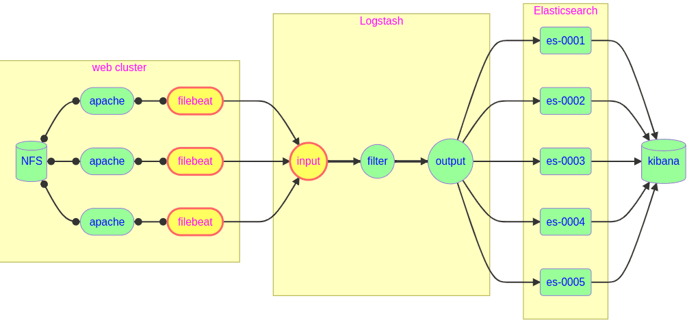
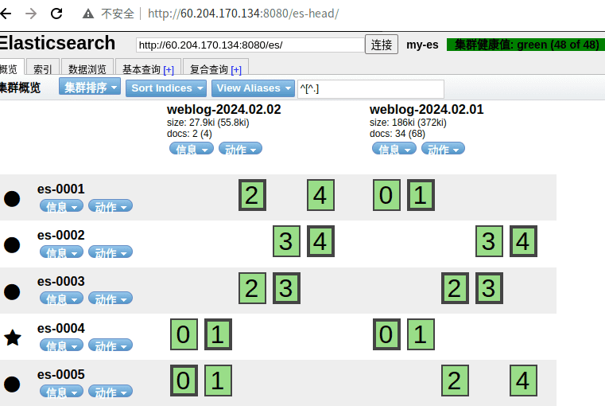
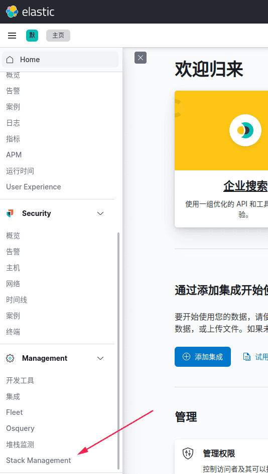
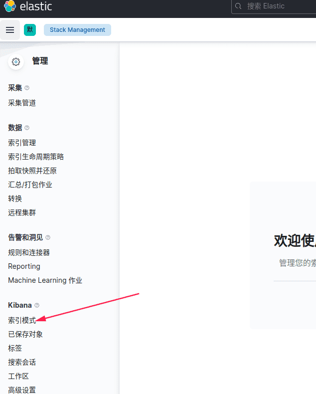
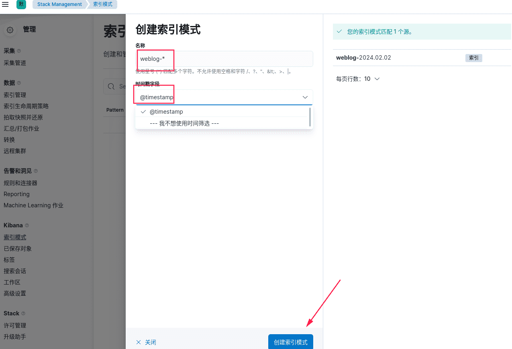
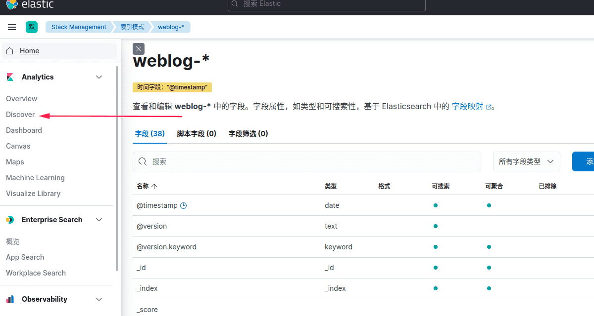
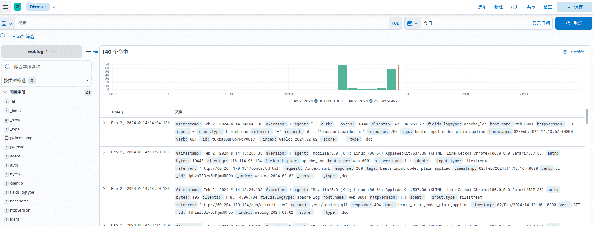
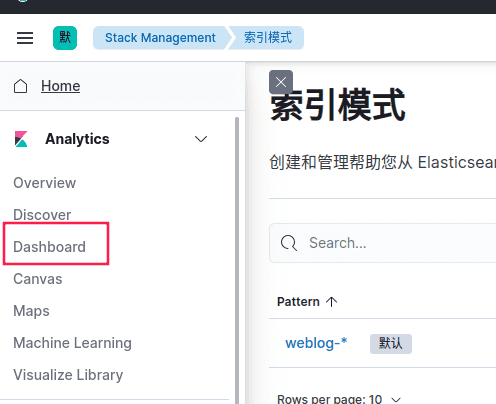
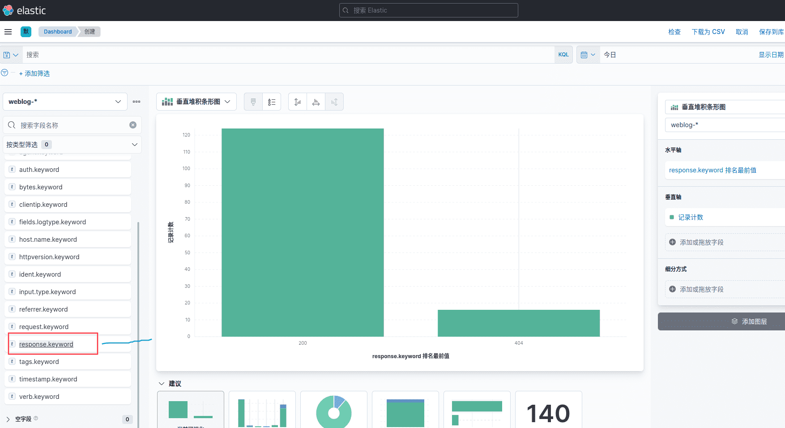

- [学习目标](#学习目标)
- [课堂笔记（命令）](#课堂笔记命令)
- [课堂笔记（文本）](#课堂笔记文本)
  - [项目架构图](#项目架构图)
  - [日志采集方式](#日志采集方式)
  - [插件介绍](#插件介绍)
    - [beats](#beats)
  - [Web日志实时分析](#web日志实时分析)
    - [配置beats插件](#配置beats插件)
    - [filebeat安装配置](#filebeat安装配置)
      - [补充](#补充)
    - [多日志标签](#多日志标签)
      - [添加标签](#添加标签)
      - [匹配标签](#匹配标签)
    - [以服务运行](#以服务运行)
    - [批量安装部署](#批量安装部署)
      - [验证日志收集](#验证日志收集)
  - [Kibana安装部署](#kibana安装部署)
    - [主机购买](#主机购买)
    - [安装kibana配置](#安装kibana配置)
    - [基础页面配置](#基础页面配置)
      - [流量数据分析](#流量数据分析)
      - [制作树状图](#制作树状图)
- [快捷键](#快捷键)
- [问题](#问题)
- [补充](#补充-1)
- [今日总结](#今日总结)
- [昨日复习](#昨日复习)


# 学习目标

获取Web日志

数据分析实战

# 课堂笔记（命令）

# 课堂笔记（文本）

## 项目架构图



## 日志采集方式

> 方法一：
>
> + 在每台Web服务器上安装logstash
>
>   弊端：由于logstash使用java开发，占用资源巨大，logstash所消耗的资源堪比Web服务本身消耗的资源还大，在每一台Web服务器上部署logstash非常不合适
>
> 方法二：
>
> + 网络采集日志
>   + 在Web服务器上部署filebeat日志采集程序
>   + filebeat是使用Golang实现的轻量型日志采集器，也是ES stack中的一员
>   + filebeat占用资源非常小，可以忽略不计
>   + filebeat本质是一个agent，可以安装在应用服务器上各个节点上，根据配置读取对应位置的日志文件，并通过网络上报到相应的服务中

## 插件介绍

### beats

> + beats是logstash input模块的插件
> + 专门用来接收fileveat发送过来的日志
> + 默认监听在5044端口上
> + 可以同时接收多台不同主机发送过来的日志信息

## Web日志实时分析

### 配置beats插件

```sh
[root@logstash ~]# vim /etc/logstash/conf.d/my.conf
input { 
  beats {
    port => 5044
  }
} 
# filter { 不做任何修改 }
# output { 不做任何修改 }
[root@logstash ~]# /usr/share/logstash/bin/logstash
```

### filebeat安装配置

```sh
# 装包
[root@web-0001 ~]# dnf install -y filebeat
# 修改主配置文件
[root@web-0001 ~]# vim /etc/filebeat/filebeat.yml
25:  id: my-filestream-id # 如果同时配置多个收集器，id不能重复
28:  enabled: true # 打开收集模块
32:  - /var/log/httpd/access_log # 指定日志文件路径
135: # 注释掉 Elasticsearch 配置,由于收集的日志并非json格式所以不能直接传给ES，所以需要进行注释，开启下方的logstash模块
137: # 注释掉 Elasticsearch 配置
148: output.logstash: # 设置输出模块
150:   hosts: ["192.168.1.27:5044"] # 输出给logstash
163: # processors: 注释（用于收集系统信息）
164: #   - add_host_metadata: 注释掉（收集主机信息）
165: #       when.not.contains.tags: forwarded 注释掉（判断是否为容器）
166: #   - add_cloud_metadata: ~  注释掉（收集 cloud 信息）
167: #   - add_docker_metadata: ~ 注释掉（收集 docker 信息）
168: #   - add_kubernetes_metadata: ~ 注释掉（收集 kubernetes 信息）

# 避免历史数据，做测试只用最新数据
[root@web-0001 ~]# rm -f /var/log/httpd/*
[root@web-0001 ~]# systemctl restart filebeat httpd

# 测试验证: 访问页面，观察 logstash 是否能够获取数据
[root@web-0001 ~]# curl http://192.168.1.11/info.php
# 开启一个新的终端观察，需要等15s消息才会收集到（日志信息过于冗余）
[root@logstash ~]# /usr/share/logstash/bin/logstash
{
       "clientip" => "192.168.1.252",
        "request" => "/info.php",
            "log" => {
        "offset" => 490,
          "file" => {
            "path" => "/var/log/httpd/access_log"
        }
    },
     "@timestamp" => 2024-02-02T03:22:58.944Z,
           "auth" => "-",
          "input" => {
        "type" => "filestream"
    },
         "fields" => {
        "logtype" => "apache_log"
    },
       "response" => "200",
           "tags" => [
        [0] "beats_input_codec_plain_applied"
    ],
            "ecs" => {
        "version" => "1.12.0"
    },
          "ident" => "-",
          "bytes" => "172",
           "host" => {
        "name" => "web-0001"
    },
       "referrer" => "\"-\"",
           "verb" => "GET",
    "httpversion" => "1.1",
       "@version" => "1",
      "timestamp" => "02/Feb/2024:11:22:54 +0800",
          "agent" => {
                  "id" => "c181d39c-7672-4ee3-9745-7e1ca222e55a",
        "ephemeral_id" => "981e402e-30eb-4e07-a169-c7d1d170c97d",
            "hostname" => "web-0001",
                "type" => "filebeat",
             "version" => "7.17.8",
                "name" => "web-0001"
    }
}
```

#### 补充

> 25行的id：如果收集同一台机器上的多个服务的日志时，id需要不一致如以下案例
>
> ```yaml
> filebeat.inputs:
> - type: filestream
>   id: httpd-id
>   enabled: true
>   paths:
>    - /var/log/httpd/access_log
> filebeat.inputs:
> - type: filestream
>   id: nginx-id
>   enabled: true
>   paths:
>    - /var/log/nginx/access_log   
> ```

### 多日志标签

> 为不同服务打上不同标签以便分开做处理

#### 添加标签

```perl
[root@web ~]# vim /etc/filebeat/filebeat.yml
# 设置识别标签
49:  fields:
50:    logtype: apache_log # 该标签可自定义，用于鉴别收集多个日志时的标签
# 清理冗余数据
164: processors:
165:   - drop_fields: # 删除日志中不需要的key
166:       fields: # 上面设置的标签apache_log中输出日志的key
167:         - log
168:         - offset
169:         - agent
170:         - ecs
[root@web ~]# systemctl restart filebeat

# 测试验证: 访问页面，观察 logstash 输出的数据变化
[root@web-0001 ~]# curl http://192.168.1.11/info.php
# 观察已去除冗余后的数据
[root@logstash ~]# /usr/share/logstash/bin/logstash
{
        "request" => "/info.php",
          "agent" => "\"curl/7.61.1\"",
     "@timestamp" => 2024-02-02T03:38:51.169Z,
           "auth" => "-",
          "input" => {
        "type" => "filestream"
    },
         "fields" => {
        "logtype" => "apache_log"
    },
       "response" => "200",
          "ident" => "-",
           "tags" => [
        [0] "beats_input_codec_plain_applied"
    ],
          "bytes" => "172",
           "host" => {
        "name" => "web-0001"
    },
       "referrer" => "\"-\"",
           "verb" => "GET",
    "httpversion" => "1.1",
       "@version" => "1",
      "timestamp" => "02/Feb/2024:11:38:44 +0800",
       "clientip" => "192.168.1.252"
}   
```

> 案例：系统存在多个服务日志，标签以及配置;例如收集apache与nginx的日志
>
> ```sh
> filebeat.inputs:
> - type: log   # Apache日志
>   enabled: true
>   paths:
>     - /var/log/apache2/*.log   # 路径根据实际Apache日志存放位置调整
>   tags: ["apache", "webserver"] # 给来自不同服务的日志事件打上标签，这有助于在Elasticsearch或其他输出目的地进行筛选和分析
>   fields: # 添加自定义字段
>     service: apache 
> 
> - type: log   # Nginx日志
>   enabled: true
>   paths:
>     - /var/log/nginx/access.log   # Nginx访问日志路径
>     - /var/log/nginx/error.log   # Nginx错误日志路径
>   tags: ["nginx", "webserver"]
>   fields:
>     service: nginx
> 
> output.elasticsearch:
>   hosts: ["localhost:9200"]   # Elasticsearch服务器地址及端口
>   index: "filebeat-%{+yyyy.MM.dd}"   # 索引模板，每天生成新的索引
> ```

#### 匹配标签

> 在logstash配置文件中编写匹配信息

```sh
[root@logstash ~]# cat /etc/logstash/conf.d/my.conf
input { 
  beats {
    port => 5044
  }
}

filter{
  if [fields][logtype] == "apache_log" { # 根据标签来匹配日志格式
  grok {
    match => { "message" => "%{HTTPD_COMBINEDLOG}" }  # 使用grok中httpd的宏
    remove_field => ["message"]
  }}
}

output{ 
  stdout{ codec => "rubydebug" } # 屏幕输出
  if [fields][logtype] == "apache_log" { # 根据标签将日志推送到es中
  elasticsearch {
    hosts => ["es-0004:9200", "es-0005:9200"]
    index => "weblog-%{+YYYY.MM.dd}"
  }}
}
# 启动后，访问192.168.1.11/info.php，观察es-head页面
[root@logstash ~]# /usr/share/logstash/bin/logstash
```

**观察ES中是否多出一条索引**



### 以服务运行

> 以上的运行logstarsh是在屏幕输出信息，用于做日志调试时使用

```sh
# 赋予属组关系
[root@logstash ~]#chown -R logstash.logstash /var/log/logstash /var/lib/logstash
# 使用服务方式运行
[root@logstash ~]#systemctl enable --now logstash
# 测试，访问页面，es页面中是否有数据
[root@logstash ~]#curl 192.168.1.11/info.php
```

### 批量安装部署

> 使用剧本为web集群安装filebeat

```sh
[root@ecs-proxy ~]# cd website
[root@ecs-proxy website]# mkdir files
[root@ecs-proxy website]# rsync -av 192.168.1.11:/etc/filebeat/filebeat.yml files/filebeat.yml
[root@ecs-proxy website]# vim filebeat.yaml
---
- name: 集群安装部署 filebeat
  hosts: web
  tasks:
  - name: 安装 filebeat
    dnf:
      name: filebeat
      state: latest
      update_cache: yes
  - name: 同步配置文件
    template:
      src: files/filebeat.yml
      dest: /etc/filebeat/filebeat.yml
      owner: root
      group: root
      mode: '0600'
  - name: 设置启动服务
    service:
      name: filebeat
      enabled: yes
  - name: 清理历史日志
    file:
      path: "{{ item }}"
      state: absent
    loop:
      - /var/log/httpd/access_log
      - /var/log/httpd/error_log
  - name: 重启服务
    service:
      name: "{{ item }}"
      state: restarted
    loop:
      - httpd
      - filebeat

[root@ecs-proxy website]# ansible-playbook filebeat.yaml
```

#### 验证日志收集

```sh
# 删除所有索引日志，做测试
[root@ecs-proxy ~]# curl -XDELETE "http://192.168.1.21:9200/weblog-*"
{"acknowledged":true}
# 通过浏览器访问 Web 集群页面(LEB代理页面)，观察 head 插件，是否有数据写入
```

## Kibana安装部署

### 主机购买

| 主机   | IP地址       | 配置          |
| ------ | ------------ | ------------- |
| kibana | 192.168.1.26 | 最低配置2核4G |

### 安装kibana配置

```sh
[root@kibana ~]# vim /etc/hosts
192.168.1.21    es-0001
192.168.1.22    es-0002
192.168.1.23    es-0003
192.168.1.24    es-0004
192.168.1.25    es-0005
192.168.1.26    kibana
# 软件安装
[root@kibana ~]# dnf install -y kibana
[root@kibana ~]# vim /etc/kibana/kibana.yml
02:  server.port: 5601 # 服务运行的端口
07:  server.host: "0.0.0.0"  # 允许任何IP地址上的客户端连接到这个端口访问kibana
23:  server.publicBaseUrl: "http://192.168.1.26:5601" # 基础URL
32:  elasticsearch.hosts: ["http://es-0004:9200", "http://es-0005:9200"] # 指定kibana用来es集群通信的主机列表及端口
115: i18n.locale: "zh-CN" # 设置语言环境为中文
[root@kibana ~]# systemctl enable --now kibana


# 通过购买的ELB发布端口5601，通过浏览器访问ELB地址:5601验证
```

> 基础URL详解：
>
> `server.publicBaseUrl` 设置了Kibana Web界面的基础URL。这意味着如果Kibana部署在一个反向代理之后，且用户通过`http://192.168.1.26:5601`来访问Kibana，那么Kibana生成的所有内部链接和API调用都会使用这个基础URL。这对于通过负载均衡器或Nginx等Web服务器进行反向代理部署非常有用，确保Kibana生成的链接是外部可访问的

### 基础页面配置

#### 流量数据分析







> weblog-* 代表匹配所有以weblog开头的，也可以设置正则准确匹配
>
> timestamp：时间戳





#### 制作树状图






# 快捷键


# 问题


# 补充


# 今日总结


# 昨日复习