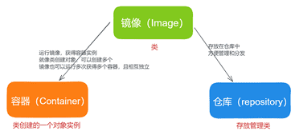

- [学习目标](#学习目标)
- [课堂笔记（命令）](#课堂笔记命令)
- [课堂笔记（文本）](#课堂笔记文本)
  - [Docker概念](#docker概念)
    - [docker诞生](#docker诞生)
    - [docker容器概念](#docker容器概念)
    - [docker三大概念](#docker三大概念)
  - [docker安装部署](#docker安装部署)
    - [主机购买](#主机购买)
    - [配置yum仓库](#配置yum仓库)
    - [安装部署](#安装部署)
    - [配置镜像加速器](#配置镜像加速器)
  - [镜像管理命令基础](#镜像管理命令基础)
    - [镜像管理案例](#镜像管理案例)
    - [导入本地镜像](#导入本地镜像)
    - [备份镜像](#备份镜像)
  - [容器管理命令进阶](#容器管理命令进阶)
    - [容器管理案例](#容器管理案例)
      - [run](#run)
      - [ps](#ps)
      - [启停容器](#启停容器)
      - [inspect](#inspect)
      - [exec](#exec)
      - [cp](#cp)
  - [容器管理命令高级](#容器管理命令高级)
    - [容器管理案例](#容器管理案例-1)
      - [rm](#rm)
      - [logs](#logs)
      - [rmi](#rmi)
      - [tag](#tag)
  - [镜像制作](#镜像制作)
  - [容器部署应用](#容器部署应用)
- [快捷键](#快捷键)
- [问题](#问题)
- [补充](#补充)
- [今日总结](#今日总结)
- [昨日复习](#昨日复习)


# 学习目标

容器技术的概念

使用docker管理镜像和容器

简单镜像制作

# 课堂笔记（命令）


# 课堂笔记（文本）

## Docker概念

### docker诞生

> 2013年3月 docker宣布开源

### docker容器概念

> 促使Docker的一问世就惊艳世间的，不是什么黑科技，而是其符合历史潮流的创意与设计理念，还有充分开放的生态环境
>
> 早期的容器技术是一种封装系统的轻量级虚拟化，Docker眼中“容器技术”是一种应用为核心，对程序文件、运行时环境、软件依赖包都可以封装打包、部署的技术手段
>
> Docker的容器中没有系统

### docker三大概念

> 容器：容器是一个运行在隔离环境中的程序
>
> 镜像：镜像是只读的模板，包含了创建容器所需的所有文件和配置信息
>
> 仓库：仓库是用来存储、分支、管理镜像的地方



## docker安装部署

### 主机购买

| 主机名      | IP地址       | 最低配置    |
| ----------- | ------------ | ----------- |
| docker-0001 | 192.168.1.31 | 2CPU,4G内存 |
| docker-0002 | 192.168.1.32 | 2CPU,4G内存 |

### 配置yum仓库

> 下载所需软件包
>
> containerd.io-1.6.12-3.1.el8.x86_64.rpm
> docker-ce-20.10.21-3.el8.x86_64.rpm
> docker-ce-cli-20.10.21-3.el8.x86_64.rpm
> docker-ce-rootless-extras-20.10.21-3.el8.x86_64.rpm
> docker-compose-plugin-2.12.2-3.el8.x86_64.rpm
> docker-distribution-2.6.2-2.git48294d9.el8.x86_64.rpm
> docker-scan-plugin-0.21.0-3.el8.x86_64.rpm

```shell
# 将软件包放置docker目录加入到自定义yum仓库中
[root@ecs-proxy s4]# rsync -av docker/ /var/localrepo/docker/
[root@ecs-proxy s4]# createrepo --update /var/localrepo
```

> 为什么开启路由转发？
>
> Docker 容器通常会使用网络桥接模式，通过 Linux 主机进行网络访问。开启路由转发可以让 Linux 主机作为网络的中转站，将容器的网络流量正确地路由到外部网络或其他容器中。
>
> 具体来说，当一个容器需要访问外部网络时，它会将数据包发送到 Linux 主机，Linux 主机收到数据包后需要知道如何正确地将数据包转发出去。开启路由转发功能可以让 Linux 主机将接收到的数据包进行正确的转发，从而实现容器与外部网络的通信。

### 安装部署

> 两台机器都安装部署

```shell
# 启动内核路由转发；由于容器是隔离
[root@docker-0001 ~]# echo 'net.ipv4.ip_forward = 1' >> /etc/sysctl.conf 
# 刷新生效配置
[root@docker-0001 ~]# sysctl -p
# 安装docker
[root@docker-0001 ~]# dnf install -y docker-ce
[root@docker-0001 ~]# systemctl enable --now docker
# 验证docker安装是否成功
[root@docker-0001 ~]# docker version
Client: Docker Engine - Community
 Version:           20.10.21
 API version:       1.41
 # 查看docker服务配置信息
[root@docker-0001 ~]# docker info
```

### 配置镜像加速器

> [注]：使用网络镜像需要联网才能进行使用，以下是华为云上创建的主机，使用的是华为云的镜像加速器

```shell
[root@docker-0001 ~]#mkdir -p /etc/docker
[root@docker-0001 ~]# vim /etc/docker/daemon.json
{
    "registry-mirrors": ["https://08fd26e38c00f5b00f5cc009d69ca3a0.mirror.swr.myhuaweicloud.com/"],
    "insecure-registries":[]
}
[root@docker-0001 ~]# systemctl restart docker
# 查看 docker 服务配置信息
[root@docker-0001 ~]# docker info
... ...
 Insecure Registries:
  127.0.0.0/8
 Registry Mirrors: https://08fd26e38c00f5b00f5cc009d69ca3a0.mirror.swr.myhuaweicloud.com/
 Live Restore Enabled: false
```

> 镜像仓库地址(以华为仓库为例)：
>
> 1. 登陆华为云
> 2. 点击产品-容器-容器镜像服务SWR-控制台-确认
> 3. 点击镜像资源-镜像中心-(右边)镜像加速器
> 4. 复制镜像加速器地址

## 镜像管理命令基础

| 镜像管理命令                        | 说明               |
| :---------------------------------- | :----------------- |
| docker images                       | 查看本机镜像       |
| docker pull 镜像名称:标签           | 下载镜像           |
| docker save 镜像名称:标签 -o 文件名 | 备份镜像为tar包    |
| docker load -i 备份文件名称         | 导入备份的镜像文件 |
| docker history 镜像名称:标签        | 查看镜像的制作历史 |

### 镜像管理案例

> 下载busybox

```shell
# latest:最新版本，也可指定版本xx:1.1.1；不指定则就是latest最新版本
[root@docker-0001 ~]# docker pull busybox:latest 比对 
latest: Pulling from library/busybox
8b3d7e226fab: Pull complete 
Digest: sha256:410a07f17151ffffb513f942a01748dfdb921de915ea6427d61d60b0357c1dcd
Status: Downloaded newer image for busybox:latest
docker.io/library/busybox:latest
# 查看下载的镜像
[root@docker-0001 ~]# docker images
REPOSITORY   TAG       IMAGE ID       CREATED       SIZE
busybox      latest    a9d583973f65   2 years ago   1.23MB
# 查看镜像分层
[root@docker-0001 ~]# docker history busybox
IMAGE          CREATED       CREATED BY                                      SIZE      COMMENT
a9d583973f65   2 years ago   /bin/sh -c #(nop)  CMD ["sh"]                   0B        
<missing>      2 years ago   /bin/sh -c #(nop) ADD file:b49bf6359240618f2…   1.23MB  
```

### 导入本地镜像

> [案例镜像下载](https://gogetacoke.lanzv.com/iLhxx1olcf6f)
>
> 将案例镜像拷贝到docker-0001主机上

```sh
[root@docker-0001 ~]#docker load -i myos.tar.xz
[root@docker-0001 ~]#docker images
REPOSITORY   TAG       IMAGE ID       CREATED         SIZE
myos         php-fpm   f70bdfd2042c   12 months ago   275MB
myos         nginx     10dc658da2fe   12 months ago   274MB
myos         latest    1de38c85c2d1   13 months ago   4.67MB
myos         httpd     9245e660f88f   13 months ago   299MB
myos         8.5       621bfd7f9b46   13 months ago   249MB
rockylinux   8.5       210996f98b85   2 years ago     205MB
busybox      latest    a9d583973f65   2 years ago     1.23MB
```

### 备份镜像

```shell
# 将rockylinux镜像备份为tar包
[root@docker-0001 ~]#docker save rockylinux:8.5 -o rocky.tar
[root@docker-0001 ~]#ls
myos.tar.xz  rocky.tar
# 将镜像拷贝到32机器
[root@docker-0001 ~]#rsync -av rocky.tar 192.168.1.32:./
```

## 容器管理命令进阶

| 容器管理命令                         | 说明                                        |
| ------------------------------------ | ------------------------------------------- |
| docker run -it(d) 镜像名称:标签      | 创建容器                                    |
| docker ps                            | 查看容器的信息                              |
| docker inspect 镜像名称\|容器名称    | 查询（容器/镜像）的详细信息                 |
| docker [start\|stop\|restart] 容器id | 启动、停止、重启容器                        |
| docker exec -it 容器ID 启动命令      | 在容器内执行命令                            |
| docker cp 路径1 路径2                | 拷贝文件：路径格式（本机路径、容器ID/路径） |

### 容器管理案例

#### run

> 创建一个容器

```shell
# 创建并进入容器myos8.5
[root@docker-0001 ~]# docker run -it myos:8.5
[root@cb3759eba8ad /]# hostname
cb3759eba8ad
[root@cb3759eba8ad /]# ifconfig  | head -3
eth0: flags=4163<UP,BROADCAST,RUNNING,MULTICAST>  mtu 1500
        inet 172.17.0.2  netmask 255.255.0.0  broadcast 172.17.255.255
        ether 02:42:ac:11:00:02  txqueuelen 0  (Ethernet)
# 退出当前容器，就直接停止了容器        
[root@cb3759eba8ad /]# exit  

# 方法一：想要退出容器且不停止容器 d放入后台运行关闭
[root@docker-0001 ~]#docker run -itd myos:httpd
b498d5a3a032bbe58556e7040e56af57dd53ff32c09cc7d15c8e974563c0b5a6
# 方法二：快捷键ctrl+p 或 ctrl+q

# 创建容器时指定容器名称;--name
[root@docker-0001 ~]#docker run -itd --name web1 myos:httpd

# 容器结束后自动删除容器;--rm
[root@docker-0001 ~]#dokcer run -it --rm myos:httpd
[root@ab3469eba8ad /]#exit
[root@docker-0001 ~]#docker ps
CONTAINER ID   IMAGE  COMMAND  CREATED  STATUS   PORTS     NAMES
```

#### ps

```sh
# 查询当前已启用的容器
[root@docker-0001 ~]#docker ps 
CONTAINER ID   IMAGE        COMMAND                CREATED         STATUS         PORTS     NAMES
92bab879964c   myos:httpd   "httpd -DFOREGROUND"   8 seconds ago   Up 7 seconds   80/tcp    web1
b498d5a3a032   myos:httpd   "httpd -DFOREGROUND"   5 minutes ago   Up 5 minutes   80/tcp    unruffled_visvesvaraya
# 查询所有容器包括关闭的容器（up：启用；exited：关闭）
[root@docker-0001 ~]#docker ps -a
CONTAINER ID   IMAGE        COMMAND                CREATED          STATUS                      PORTS     NAMES
92bab879964c   myos:httpd   "httpd -DFOREGROUND"   44 seconds ago   Up 44 seconds               80/tcp    web1
b498d5a3a032   myos:httpd   "httpd -DFOREGROUND"   5 minutes ago    Up 5 minutes                80/tcp    unruffled_visvesvaraya
cb3759eba8ad   myos:8.5     "/bin/bash"            22 minutes ago   Exited (0) 10 minutes ago             eager_hofstadter
# 只显示容器ID
[root@docker-0001 ~]#docker ps -aq
92bab879964c
b498d5a3a032
cb3759eba8ad
```

#### 启停容器

```sh
# 停止容器，docker stop 容器名称/容器ID
[root@docker-0001 ~]#docker stop web1 cb3759eba8ad
web1
cb3759eba8ad
# 启动容器
[root@docker-0001 ~]#docker start web1
web1
# 重启容器
[root@docker-0001 ~]#docker restart cb3759eba8ad

# 启停多台容器
[root@docker-0001 ~]#docker stop $(docker ps -qa)
92bab879964c
b498d5a3a032
cb3759eba8ad

[root@docker-0001 ~]#docker start $(docker ps -qa)
92bab879964c
b498d5a3a032
cb3759eba8ad
```

#### inspect

> 查询容器详细信息

```shell
# 启动容器
[root@docker-0001 ~]#docker start web1
[root@docker-0001 ~]#docker ps
CONTAINER ID   IMAGE        COMMAND                CREATED         STATUS         PORTS     NAMES
cccdd25adac7   myos:httpd   "httpd -DFOREGROUND"   2 minutes ago   Up 2 minutes   80/tcp    web1
# 查询容器详细信息（通过过滤获取该容器的IP地址）
[root@docker-0001 ~]#docker inspect  web1 | grep IPAddress
            "SecondaryIPAddresses": null,
            "IPAddress": "172.17.0.2",
                    "IPAddress": "172.17.0.2",
# 启动的是一个httpd服务，使用curl进行访问测试                    
[root@docker-0001 ~]# curl 172.17.0.2
Welcome to The Apache.                    
```

#### exec

> 在容器内执行命令

```shell
# 在容器内执行非交互式命令
[root@docker-0001 ~]# docker exec -it web1 pwd
/var/www/html # 显示容器内执行命令后的内容，非宿主机

# 在宿主机器上实现容器交互命令
[root@docker-0001 ~]# docker exec -it web1 /bin/bash
[root@92bab879964c html]# ls
index.html  info.php
[root@92bab879964c html]# cd /
[root@92bab879964c /]# ls
bin  etc   lib    lost+found  mnt  proc  run   srv  tmp  var
dev  home  lib64  media       opt  root  sbin  sys  usr
[root@92bab879964c /]# exit
exit # 此时不会关闭容器
```

#### cp

> 在容器内或向容器内拷贝内容
>
> 容器未运行也能进行拷贝

```sh
# 从容器内拷贝内容到宿主机（容器地址必须写绝对地址），拷贝容器web1/var/www的内容到宿主机的当前目录
[root@docker-0001 ~]# docker cp web1:/var/www ./
[root@docker-0001 ~]# ls
myos.tar.xz  rocky.tar  www

# 从宿主机拷贝到容器（容器地址必须写绝对地址），将rocky.tar拷贝到容器的/目录
[root@docker-0001 ~]# docker cp rocky.tar web1:/
[root@docker-0001 ~]# docker exec web1 ls /var/www
cgi-bin
html
rocky.tar
```

## 容器管理命令高级

| 管理命令                                 | 说明                                       |
| ---------------------------------------- | ------------------------------------------ |
| docker rm 容器ID                         | 删除容器                                   |
| docker logs 容器ID                       | 查看容器日志                               |
| docker tag 镜像ID:标签 镜像名称:新的标签 | 创建新的镜像名称和标签                     |
| docker rmi 镜像名称:标签                 | 删除镜像（必须先删除该镜像启动的所有容器） |

### 容器管理案例

#### rm

> 删除容器，需要指定容器名称或ID，容器在运行时不能进行删除
>
> -f 可以强制删除（运行的容器也能进行删除）

```sh
# 删除一个已关机容器
[root@docker-0001 ~]# docker rm a7ecf41c94a2
a7ecf41c94a2
[root@docker-0001 ~]# docker ps -aq | grep a7ecf41c94a2

# 强制删除一个未关机的容器
[root@docker-0001 ~]# docker rm web1
Error response from daemon: You cannot remove a running container 92bab879964cfd3df11a7818337975a6e152a75538e1c0c94631fee743dfd17a. Stop the container before attempting removal or force remove
[root@docker-0001 ~]# docker rm -f web1
web1
[root@docker-0001 ~]# docker ps -qa | grep web1

# 强制删除全部容器
[root@docker-0001 ~]# docker rm -f $(docker ps -qa)
cccdd25adac7
d11bfc688295
730f2aaf3eae
951ee0cc8f60
b498d5a3a032
cb3759eba8ad
[root@docker-0001 ~]# docker ps
CONTAINER ID   IMAGE     COMMAND   CREATED   STATUS    PORTS     NAMES
[root@docker-0001 ~]# docker ps -a
CONTAINER ID   IMAGE     COMMAND   CREATED   STATUS    PORTS     NAMES
```

#### logs

> 记录容器运行日志（记录运行时的错误日志）

```shell
# 准备容器环境
[root@docker-0001 ~]# docker run -itd --name web1 myos:nginx 
fcce75ba69a43bda96704fbe477c963a62f26348e1d650285d2f09e16d51051b
[root@docker-0001 ~]# docker inspect web1 | grep IPAdd
            "SecondaryIPAddresses": null,
            "IPAddress": "172.17.0.2",
                    "IPAddress": "172.17.0.2",
[root@docker-0001 ~]# curl 172.17.0.2
Nginx is running !
[root@docker-0001 ~]# docker logs web1

# 进入web1容器将nginx配置文件修改错误，查询logs日志，及容器是否能启动
[root@docker-0001 ~]#curl 172.17.0.2/index.php # 访问不存在的地址
[root@docker-0001 ~]#docker exec -it web1 /bin/bash # 进入容器
[root@fcce75ba69a4 html]#vim /usr/local/nginx/conf/nginx.conf
    server {
        listen 80  # 将配置文件修改错误
[root@fcce75ba69a4 html]#exit
[root@docker-0001 ~]#docker restart web1
[root@docker-0001 ~]#docker ps
CONTAINER ID   IMAGE     COMMAND   CREATED   STATUS    PORTS     NAMES
[root@docker-0001 ~]# docker logs web1
2024/02/18 07:08:29 [error] 6#0: *2 open() "/usr/local/nginx/html/info.php" failed (2: No such file or directory), client: 172.17.0.1, server: localhost, request: "GET /info.php HTTP/1.1", host: "172.17.0.2"
nginx: [emerg] invalid parameter "server_name" in /usr/local/nginx/conf/nginx.conf:33
# 修改错误进入容器，已知容器错误所在，就将配置文件拷贝出来修改正确后，再拷贝进去，再启动容器
[root@docker-0001 ~]#docker cp  web1:/usr/local/nginx/conf/nginx.conf ./nginx.conf
[root@docker-0001 ~]#vim nginx.conf
listen       80; # 加上分号
[root@docker-0001 ~]#docker cp ./nginx.conf  web1:/usr/local/nginx/conf/nginx.conf 
[root@docker-0001 ~]#docker start web1
[root@docker-0001 ~]#docker ps
CONTAINER ID   IMAGE        COMMAND                  CREATED          STATUS         PORTS     NAMES
fcce75ba69a4   myos:nginx   "nginx -g 'daemon of…"   14 minutes ago   Up 2 seconds   80/tcp    web1
```

#### rmi

> 删除镜像
>
> [注]：已经创建容器的镜像无法删除，删除的只是标签与名称未成功删除

```shell
[root@docker-0001 ~]# docker images
REPOSITORY   TAG       IMAGE ID       CREATED         SIZE
myos         php-fpm   f70bdfd2042c   12 months ago   275MB
myos         nginx     10dc658da2fe   12 months ago   274MB
myos         latest    1de38c85c2d1   13 months ago   4.67MB
myos         httpd     9245e660f88f   13 months ago   299MB
myos         8.5       621bfd7f9b46   13 months ago   249MB
rockylinux   8.5       210996f98b85   2 years ago     205MB
busybox      latest    a9d583973f65   2 years ago     1.23MB
# 删除未创建容器的镜像
[root@docker-0001 ~]# docker rmi busybox
Untagged: busybox:latest
Untagged: busybox@sha256:410a07f17151ffffb513f942a01748dfdb921de915ea6427d61d60b0357c1dcd
Deleted: sha256:a9d583973f65a19b3bbd7a4312b4e2c27712c44c0ed8b94e9a38cc73e7565b75
Deleted: sha256:2983725f2649f8847244cbb73ff9cb0b041bd319144816dfdee904adfd18bd1f
[root@docker-0001 ~]# docker images | grep busybox

# 拉取镜像测试
[root@docker-0001 ~]# docker pull busybox
Using default tag: latest
latest: Pulling from library/busybox
8b3d7e226fab: Pull complete 
Digest: sha256:410a07f17151ffffb513f942a01748dfdb921de915ea6427d61d60b0357c1dcd
Status: Downloaded newer image for busybox:latest
docker.io/library/busybox:latest
[root@docker-0001 ~]# docker run -itd busybox
5a2c122143214d91ee396a3870688c635459e9f93d14ffdc7e459855e7f95a5c
[root@docker-0001 ~]# docker ps
CONTAINER ID   IMAGE        COMMAND                  CREATED          STATUS          PORTS     NAMES
5a2c12214321   busybox      "sh"                     5 seconds ago    Up 5 seconds              crazy_goodall

# 删除已经创建容器的镜像
[root@docker-0001 ~]# docker rmi busybox:latest 
Error response from daemon: conflict: unable to remove repository reference "busybox:latest" (must force) - container 5a2c12214321 is using its referenced image a9d583973f65
[root@docker-0001 ~]# docker images | grep busybox
busybox      latest    a9d583973f65   2 years ago     1.23MB
[root@docker-0001 ~]# docker rmi -f  busybox:latest # 删除的只是标签与名称
Untagged: busybox:latest
Untagged: busybox@sha256:410a07f17151ffffb513f942a01748dfdb921de915ea6427d61d60b0357c1dcd
[root@docker-0001 ~]# docker images | grep a9d583973f65
<none>       <none>    a9d583973f65   2 years ago     1.23MB
```

#### tag

> 给镜像设置一个新的名称标签；需要指定镜像ID

```shell
[root@docker-0001 ~]# docker images | grep a9d583973f65
<none>       <none>    a9d583973f65   2 years ago     1.23MB

[root@docker-0001 ~]# docker tag a9d583973f65 haha:xixi
[root@docker-0001 ~]# docker images | grep a9d583973f65
haha         xixi      a9d583973f65   2 years ago     1.23MB

# 给镜像重新命名
[root@docker-0001 ~]# docker tag a9d583973f65  hello:world
[root@docker-0001 ~]# docker images | grep a9d583973f65
haha         xixi      a9d583973f65   2 years ago     1.23MB
hello        world     a9d583973f65   2 years ago     1.23MB
# 删除原先的镜像，就完成了别名
[root@docker-0001 ~]# docker rmi -f haha:xixi
Untagged: haha:xixi
[root@docker-0001 ~]# docker images | grep a9d583973f65
hello        world     a9d583973f65   2 years ago     1.23MB
```

## 镜像制作

> 镜像制作：
>
> 1. 基于一个官方初始镜像
> 2. 创建容器加入内容
> 3. 清除相关缓存
> 4. 关闭容器
> 5. 制作镜像 docker commit 容器名  镜像名:标签
>
> [注]：commit只能制作简单的镜像

```shell
# 使用基础镜像创建容器   
[root@docker-0002 ~]# docker run -itd --name linux rockylinux:8.5 
4a083f8d75945e8aac7814ffb6d36d0a8833c5cd89d76d67fffeb6242466b3b1
[root@docker-0002 ~]# docker ps
CONTAINER ID   IMAGE            COMMAND       CREATED         STATUS         PORTS     NAMES
4a083f8d7594   rockylinux:8.5   "/bin/bash"   5 seconds ago   Up 4 seconds             linux

# 将本机yum仓库拷贝到容器中
[root@docker-0001 ~]#docker exec -it linux rm -rf /etc/yum.repos.d
[root@docker-0001 ~]#docker cp /etc/yum.repos.d linux:/etc/yum.repos.d
# 验证容器yum
[root@docker-0001 ~]#docker exec -it linux dnf makecache
# 安装相关软件
[root@docker-0001 ~]#docker exec -it linux dnf -y install net-tools vim-enhanced tree bash-completion iproute procps-ng psmisc
# 验证
[root@docker-0001 ~]#docker exec -it linux ipconfig
# 清除缓存
[root@docker-0001 ~]#docker exec -it linux dnf clean all
# 停止容器
[root@docker-0001 ~]#docker stop linux
# 基于linux容器创建镜像
[root@docker-0001 ~]#docker commit linux mylinux:latest
sha256:8744fedcf7c88b45db499e5023e3e28dee815f400d81c9f7e4b172c25aea5052
# 查看制作的镜像
[root@docker-0002 ~]# docker images
REPOSITORY   TAG       IMAGE ID       CREATED         SIZE
mylinux      latest    8744fedcf7c8   4 seconds ago   250MB
rockylinux   8.5       210996f98b85   2 years ago     205MB
```

## 容器部署应用

> 容器启动应用只能放在前台运行

```shell
# 创建容器
[root@docker-0002 ~]#docker run -it --rm --name myweb mylinux
[root@c3664cb220bb /]#dnf -y install httpd
[root@c3664cb220bb /]#echo "Hello World" >> /var/www/html/index.html
[root@c3664cb220bb /]#export LANG=C
# 查询由systemctl命令启动的服务文件;真实主机可通过：systemctl cat 服务名称(观察 ExecStart)
[root@c3664cb220bb /]#cat /usr/lib/systemd/system/httpd.service
[root@c3664cb220bb /]# /usr/sbin/httpd $OPTIONS -DFOREGROUND
AH00558: httpd: Could not reliably determine the server's fully qualified domain name, using 172.17.0.2. Set the 'ServerName' directive globally to suppress this message

# 新开一个终端进行测试;注意不要关闭当前终端
[root@docker-0002 ~]#curl 172.17.0.2
Hello World
```

- 为 apache 添加解析 php 文件支持

```shell
# ctrl + c 终止 httpd 服务运行
[root@c3664cb220bb /]# dnf install -y php
[root@c3664cb220bb /]# vim /etc/httpd/conf.modules.d/00-mpm.conf
11: LoadModule mpm_prefork_module ... ... # 去掉注释 
23: # LoadModule mpm_event_module ... ... # 注释配置 
[root@c3664cb220bb /]# /usr/sbin/httpd -DFOREGROUND
# 服务不要关闭，在其他终端完成测试
```

- 验证配置

```shell
# 在另一个终端拷贝 public/info.php 到 docker 主机
[root@docker-0002 ~]# docker cp info.php myweb:/var/www/html/
[root@docker-0002 ~]# curl http://172.17.0.2/info.php
<pre>
Array
(
    [REMOTE_ADDR] => 172.17.0.1
    [REQUEST_METHOD] => GET
    [HTTP_USER_AGENT] => curl/7.61.1
    [REQUEST_URI] => /info.php
)
php_host:   616e75df56ae
1229
```


# 快捷键


# 问题


# 补充


# 今日总结


# 昨日复习