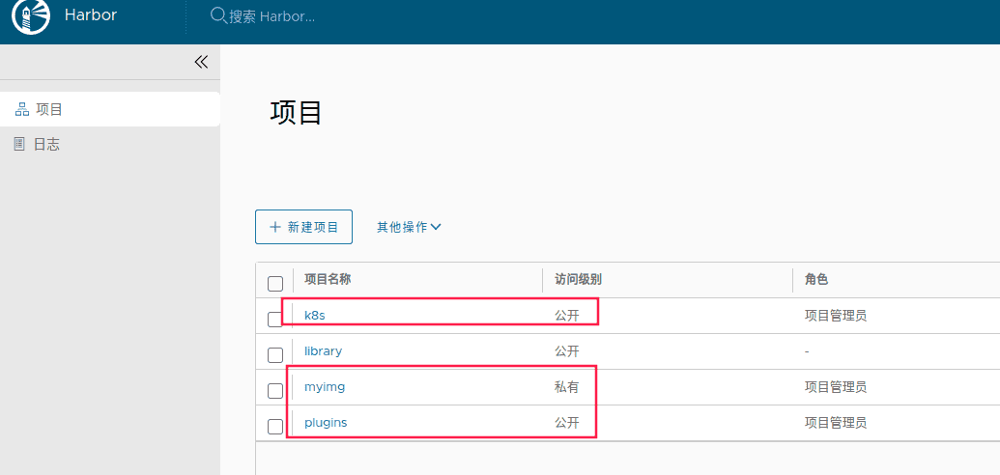

- [学习目标](#学习目标)
- [课堂笔记（命令）](#课堂笔记命令)
- [课堂笔记（文本）](#课堂笔记文本)
- [快捷键](#快捷键)
- [问题](#问题)
- [补充](#补充)
- [今日总结](#今日总结)
- [昨日复习](#昨日复习)

# 学习目标

容器服务发布

微服务编排

harbor仓库

# 课堂笔记（命令）

# 课堂笔记（文本）

## 对外提供服务

### 容器化带来的问题

> + 新创建容器的IP地址是随机的
> + 容器在重启后每次的IP地址会发生变化
> + 容器只有宿主机才能访问
>
> 解决问题：
>
> + 容器与宿主机进行端口映射绑定
> + 把宿主机变成对应的服务，不用关系容器的IP地址
> + 每个端口只能和一个容器绑定

### 端口绑定

> 使用\-p参数指定端口映射    前者为宿主机端口:后者为容器端口
>
> 可以指定多个端口，就需要写多个\-p参数

```sh
[root@docker-0001 ~]# docker run -itd -p 80:80 myos:httpd 
29a492545d40036daac97228959db555d3f1f0c7667699fcfeb65fc05d2a52c8
[root@docker-0001 ~]# curl 192.168.1.31
Welcome to The Apache.
[root@docker-0001 ~]# curl 192.168.1.31/info.php
<pre>
Array
(
    [REMOTE_ADDR] => 192.168.1.31
    [REQUEST_METHOD] => GET
    [HTTP_USER_AGENT] => curl/7.61.1
    [REQUEST_URI] => /info.php
)
php_host:       29a492545d40

```

### 容器存储卷

```sh
"命令格式"
docker run -itd -v 宿主机文件或目录:容器内文件或对象 镜像名称:标签
```

#### 共享数据目录

```sh
"
创建httpd与nginx容器
共享/var/webroot网页数据文件夹
"
[root@docker-0001 ~]# docker rm -f $(docker ps -qa)
# 准备共享内容
[root@docker-0001 ~]# mkdir /var/webroot
[root@docker-0001 ~]# echo "hello world." > /var/webroot
[root@docker-0001 ~]# echo "<?php phpinfo(); ?>"
# 创建容器指定共享目录
[root@docker-0001 ~]# docker run -itd -p 80:80 -v /var/webroot:/var/www/html myos:httpd
[root@docker-0001 ~]# docker run -itd -p 81:80 -v /var/webroot:/usr/local/nginx/html --name nginx myos:nginx

# 测试验证
[root@docker-0001 ~]# curl 192.168.1.31
hello world.
[root@docker-0001 ~]# curl 192.168.1.31:81
hello world.
[root@docker-0001 ~]# curl 192.168.1.31/info.php
<!DOCTYPE html PUBLIC "-//W3C//DTD XHTML 1.0 Transitional//EN" "DTD/xhtml1-transitional.dtd">
<html xmlns="http://www.w3.org/1999/xhtml"><head>
<style type="text/css">
....
[root@docker-0001 ~]# curl 192.168.1.31:81/info.php
<?php phpinfo(); ?>
```

#### 共享配置文件

```sh
"
创建nginx容器，将配置拷贝出来，修改配置，使其能解析php页面
通过映射将配置文件与容器进行映射
"
[root@docker-0001 ~]# mkdir /var/webconf
[root@docker-0001 ~]# docker cp nginx:/usr/local/nginx/conf/nginx.conf /var/webconf
[root@docker-0001 ~]#vim /var/webconf/nginx.conf
        location ~ \.php$ {
            root           html;
            fastcgi_pass   127.0.0.1:9000;
            fastcgi_index  index.php;
            include        fastcgi.conf;
        }
# 使用映射配置重建容器
[root@docker-0001 ~]#docker rm -f $(docker ps -qa)
[root@docker-0001 ~]#docker run -itd --name web1 -p 80:80 -v /var/webroot:/usr/local/nginx/html -v /var/webconf/nginx.conf:/usr/local/nginx/conf/nginx.conf myos:nginx
[root@docker-0001 ~]#curl 192.168.1.31/info.php
<?php phpinfo(); ?>
"
以上使用了卷映射配置文件
nginx要解析php需要配合php-fpm进行使用，php-fpm在另个容器中如何才能实现互通？
答案：通过容器网络通信实现共享网络
"
```

### 容器网络通信

> 格式：\-\-network=通信模式

#### 架构图


#### 容器间通信的模式

> + bridge模式，桥接网络(自己的网络)，默认模式
> + host模式，与宿主机共享网络
> + none模式，无网络模式
> + container模式，共享其他容器的网络命令空间
> + 自定义网络，自由创建桥接网络或者overlay网络

#### container模式

> 通过container模式来实现nginx解析php页面，与php-fpm服务互通

```sh
"
php-fpm是通过文件名进行解析
"
# 创建php-fpm容器
[root@docker-0001 ~]#docker run -itd --name php --network=container:web1 -v /var/webroot:/usr/local/nginx/html myos:php-fpm

# 验证配置
[root@docker-0001 ~]# docker exec -it php ss -lnt
State  Recv-Q Send-Q Local Address:Port Peer Address:PortProcess
LISTEN 0      128        127.0.0.1:9000      0.0.0.0:*          
LISTEN 0      128          0.0.0.0:80        0.0.0.0:*  

# 测试页面
[root@docker-0001 ~]#curl 192.168.1.31/info.php
<!DOCTYPE html PUBLIC "-//W3C//DTD XHTML 1.0 Transitional//EN" "DTD/xhtml1-transitional.dtd">
<html xmlns="http://www.w3.org/1999/xhtml"><head>
<style type="text/css">
....
```

## 服务编排与治理

### 微服务概述

> **微服务是什么？**
>
> 使用多个小型服务组合起来构建复杂应用服务架构，各个服务之间采用不同的编成语言，不同的存储技术，运行在各自的进程之中，互不干扰 ，协同工作
>
> **微服务架构：**
>
> 微服务并不是一种技术，而是架构思想、它以容器技术为载体，演进出的一种以软件运行环境、产品、研发、运营为一体全新模式。站在 Docker 的角度，软件就是容器的组合，而容器又是服务的最佳载体，一台计算机同时运行多个容器，从而就能很轻松地实现复杂的架构
>
> 微服务架构优点：
>
> 松耦合高内聚、高度可扩展、出色的弹性、易于部署、访问
>
> **容器服务编排**
>
> 在微服务架构中每个微服务一般都会包含多个容器实例。
>
>  如果每个微服务都要手动管理，那么效率之低、维护量之大可想而知。为了解决编排部署的问题，docker 公司推出了 docker Compose 工具
>
>  Compose 是一个用于定义和运行多容器的应用的工具。
>
>  使用 Compose，可以在一个文件中配置多个容器服务，然后使用一个简单的命令就可以轻松、高效地管理配置中引用的所有容器服务。

### 容器服务治理

| **指令**           | **说明**                   |
| ------------------ | -------------------------- |
| up                 | 创建项目并启动容器         |
| down               | 删除项目容器及网络         |
| ls                 | 列出可以管理的项目         |
| start/stop/restart | 启动项目/停止项目/重启项目 |
| images             | 列出项目使用的镜像         |
| ps                 | 显示项目中容器的状态       |
| logs               | 查看下项目中容器的日志     |

### 项目管理

```sh
# 安装compose组件
[root@docker-0001 ~]#dnf -y install docker-compose-plugin

# 创建项目
[root@docker-0001 ~]#vim docker-compose.yaml
name: websvc
version: "3"
services:
  websvc:
    container_name: nginx
    image: myos:nginx
```

#### 容器项目管理

> 命令格式：docker compose -f 指定compose文件 指令

```sh
# 创建并启动项目   -d 表示启动后放入后台运行
[root@docker-0001 ~]#docker compose -f docker-compose.yaml up -d
[+] Running 2/2
 ⠿ Network websvc_default  Created                              0.1s
 ⠿ Container nginx         Started                              0.3s
 
 # 查看项目
[root@docker-0001 ~]# docker compose ls
NAME                STATUS              CONFIG FILES
websvc              running(1)          /root/docker-compose.yml 

# 启停项目  -p指定需要查看的项目名称
[root@docker-0001 ~]#docker compose -p websvc stop
[+] Running 1/0
 ⠿ Container nginx  Stopped                                     0.1s
[root@docker-0001 ~]# docker compose ls
NAME                STATUS              CONFIG FILES
# ls -a 查看已经关闭的项目
[root@docker-0001 ~]# docker compose ls -a
NAME                STATUS              CONFIG FILES
websvc              exited(1)           /root/docker-compose.yml
[root@docker-0001 ~]# docker compose -p websvc start
[+] Running 1/1
 ⠿ Container nginx  Started                                     0.3s
[root@docker-0001 ~]# docker compose ls
NAME                STATUS              CONFIG FILES
websvc              running(1)          /root/docker-compose.yml

# 查看项目中容器状态
[root@docker-0001 ~]#docker compose -p websvc ps
NAME      COMMAND                 SERVICE    STATUS      PORTS
nginx     "nginx -g 'daemon of…"  websvc     running     80/tcp

# 列出项目使用的镜像
[root@docker-0001 ~]#docker compose -p websvc images
Container           Repository          Tag                 Image Id            Size
nginx               myos                nginx               10dc658da2fe        274MB

# 查看项目容器的日志（项目中所有容器的日志）
[root@docker-0001 ~]# docker compose -p websvc logs
# 制作日志
[root@docker-0001 ~]# docker inspect nginx | grep -i ipaddr
[root@docker-0001 ~]# curl 172.18.0.2/info.php
<html>
<head><title>404 Not Found</title></head>
<body>
<center><h1>404 Not Found</h1></center>
<hr><center>nginx/1.22.1</center>
</body>
</html>
[root@docker-0001 ~]# docker compose -p websvc logs
nginx  | 2024/02/20 02:52:07 [error] 7#0: *2 open() "/usr/local/nginx/html/info.php" failed (2: No such file or directory), client: 172.18.0.1, server: localhost, request: "GET /info.php HTTP/1.1", host: "172.18.0.2"

# 删除项目-将删除项目中所有容器及项目
[root@docker-0001 ~]# docker compose -p websvc down
[+] Running 2/2
 ⠿ Container nginx         Removed                              0.1s
 ⠿ Network websvc_default  Removed                              0.0s
```

### compose语法

| **指令**       | **说明**                                 |
| :------------- | ---------------------------------------- |
| networks       | 配置容器连接的网络                       |
| container_name | 指定容器名称                             |
| depends_on     | 解决容器的依赖、启动先后的问题           |
| command        | 覆盖容器启动后默认执行的命令             |
| environment    | 设置环境变量                             |
| image          | 指定为镜像名称或镜像 ID                  |
| network_mode   | 设置网络模式                             |
| restart        | 容器保护策略[always、no、on-failure]     |
| ports          | 暴露端口信息，数组                       |
| volumes        | 数据卷,支持 [volume、bind、tmpfs、npipe] |

### 容器服务编排

> 编写nginx+php-fpm项目

```shell
[root@docker-0001 ~]#vim docker-compose.yaml
name: websvc  # 指定项目名称
version: "3" # 指定docker-compose版本，3.x
services:  # 定义服务的关键字
  nginxsvc: # 服务名称
    container_name: nginx # 容器名称
    image: myos:nginx # 容器使用的镜像
  php-fpm:
    container_name: php
    image: myos:php-fpm    
# 启动验证
[root@docker-0001 ~]#docker compose -f docker-compose.yaml up -d
[+] Running 3/3
 ⠿ Network websvc_default  Created                              0.1s
 ⠿ Container php           Started                              0.6s
 ⠿ Container nginx         Started                              0.5s
[root@docker-0001 ~]# docker compose -p websvc ps
NAME                COMMAND                  SERVICE             STATUS              PORTS
nginx               "nginx -g 'daemon of…"   nginxsvc            running             80/tcp
php                 "php-fpm --nodaemoni…"   php-fpm             running             9000/tcp
[root@docker-0001 ~]# docker compose -p websvc down
[+] Running 3/2
 ⠿ Container nginx         Removed                              0.2s
 ⠿ Container php           Removed                              0.2s
 ⠿ Network websvc_default  Removed                              0.0s
```

#### ports

```shell
# 使用端口绑定
[root@docker-0001 ~]#vim docker-compose.yaml
name: websvc
version: "3"
services: 
  nginxsvc:
    container_name: nginx
    image: myos:nginx
    ports:  # 端口绑定
      - 80:80 
  php-fpm:
    container_name: php
    image: myos:php-fpm
# 测试访问
[root@docker-0001 ~]#docker compose -f docker-compose.yaml up -d
[root@docker-0001 ~]#curl 192.168.1.31
Nginx is running !

[root@docker-0001 ~]# docker compose -p websvc down
[+] Running 3/2
 ⠿ Container nginx         Removed                              0.2s
 ⠿ Container php           Removed                              0.2s
 ⠿ Network websvc_default  Removed                              0.0s
```

#### volumes

> 卷映射配置文件

```shell
[root@docker-0001 ~]#vim docker-compose.yaml
name: websvc
version: "3"
services: 
  nginxsvc:
    container_name: nginx
    image: myos:nginx
    ports:
      - 80:80 
    volumes:
      - type: bind # 使用bind类型（类似mount挂载）
        source: /var/webroot # 指定源
        target: /usr/local/nginx/html # 指定目标
      - type: bind
        source: /var/webconf/nginx.conf
        target: /usr/local/nginx/conf/nginx.conf
  php-fpm:
    container_name: php
    image: myos:php-fpm
    volumes:
      - type: bind
        source: /var/webroot
        target: /usr/local/nginx/html
[root@docker-0001 ~]# docker compose -f docker-compose.yml up -d
[root@docker-0001 ~]# curl 192.168.1.31
Hello World.       
[root@docker-0001 ~]# curl 192.168.1.31/info.php
<html>
<head><title>404 Not Found</title></head>
<body>
<center><h1>404 Not Found</h1></center>
<hr><center>nginx/1.22.1</center>
</body>
</html>

[root@docker-0001 ~]# docker compose -p websvc down
```

#### network_mode、depends_on

> network_mode 指定使用的网络模式
>
> depends_on 指定容器依赖那个服务

```shell
[root@docker-0001 ~]# vim docker-compose.yaml
name: websvc
version: "3"
services: 
  nginxsvc:
    container_name: nginx
    image: myos:nginx
    network_mode: bridge
    ports:
      - 80:80 
    volumes:
      - type: bind
        source: /var/webroot
        target: /usr/local/nginx/html
      - type: bind
        source: /var/webconf/nginx.conf
        target: /usr/local/nginx/conf/nginx.conf
  php-fpm:
    container_name: php
    image: myos:php-fpm
    network_mode: "container:nginx" 
    depends_on:  # 指定依赖nginxsvc服务
      - nginxsvc
    volumes:
      - type: bind
        source: /var/webroot
        target: /usr/local/nginx/html
[root@docker-0001 ~]# docker compose -f docker-compose.yml up -d
[root@docker-0001 ~]#curl 192.168.1.31/info.php
<!DOCTYPE html PUBLIC "-//W3C//DTD XHTML 1.0 Transitional//EN" "DTD/xhtml1-transitional.dtd">
<html xmlns="http://www.w3.org/1999/xhtml"><head>
<style type="text/css">

[root@docker-0001 ~]# docker compose -p websvc down
```

> depends_on：依赖服务，由于php-fpm的网络模式为容器网络，与nginxsvc服务共享网络，所以这里需要在php-fpm中指定依赖关系，不然服务重启后会导致容器无法启动，设置依赖后php-fpm容器始终需要等nginx启动后才会启动
>
> [注]：depends_on 指定的是**服务名称**，而指定容器网络时指定的是**容器名称**

#### restart

> 容器保护策略，容器遇到故障后自动重启
>
> 参数[always、no、on-failure]
>
> 默认使用no
>
> 推荐使用always

```shell
[root@docker-0001 ~]# vim docker-compose.yaml
name: websvc
version: "3"
services:
  nginxsvc:
    container_name: nginx
    image: myos:nginx
    network_mode: bridge
    restart: always
    ports:
      - 80:80
    volumes:
      - type: bind
        source: /var/webroot
        target: /usr/local/nginx/html
      - type: bind
        source: /var/webconf/nginx.conf
        target: /usr/local/nginx/conf/nginx.conf
  php-fpm:
    container_name: php
    image: myos:php-fpm
    network_mode: "container:nginx"
    depends_on:
      - nginxsvc
    volumes:
      - type: bind
        source: /var/webroot
# 测试验证
[root@docker-0001 ~]#docker compose -f docker-compose.yaml up -d
# 查出ngnx进程
[root@docker-0001 ~]# ps -ef|grep nginx
root        6410    6392  0 14:10 ?        00:00:00 nginx: master process nginx -g daemon off;
nobody      6438    6410  0 14:10 ?        00:00:00 nginx: worker process
nobody      6439    6410  0 14:10 ?        00:00:00 nginx: worker process
root        6498    6201  0 14:11 pts/0    00:00:00 grep --color=auto nginx
# 杀死进程
[root@docker-0001 ~]# kill 6439
[root@docker-0001 ~]# curl 192.168.1.31
Hello World.
# 再次查询
[root@docker-0001 ~]# ps -ef|grep nginx
root        6410    6392  0 14:10 ?        00:00:00 nginx: master process nginx -g daemon off;
nobody      6438    6410  0 14:10 ?        00:00:00 nginx: worker process
nobody      6503    6410  0 14:12 ?        00:00:00 nginx: worker process
root        6505    6201  0 14:12 pts/0    00:00:00 grep --color=auto nginx
```

#### environment

> 设置环境变量

```shell
[root@docker-0001 ~]# vim docker-compose.yaml
name: websvc
version: "3"
services: 
  nginxsvc:
    container_name: nginx
    image: myos:nginx
    network_mode: bridge
    restart: always
    environment:  
      - "TZ=Asia/Shanghai"  # 设置TZ时区为亚洲上海
    ports:
      - 80:80 
    volumes:
      - type: bind
        source: /var/webroot
        target: /usr/local/nginx/html
      - type: bind
        source: /var/webconf/nginx.conf
        target: /usr/local/nginx/conf/nginx.conf
  php-fpm:
    container_name: php
    image: myos:php-fpm
    network_mode: "container:nginx" 
    depends_on:
      - nginxsvc
    volumes:
      - type: bind
        source: /var/webroot
        target: /usr/local/nginx/html
# 默认未设置时区        
[root@docker-0001 ~]#docker exec -it  nginx echo $TZ
[root@docker-0001 ~]#docker exec -it  nginx date +%T
06:50:32

[root@docker-0001 ~]# docker compose -p websvc down

# 测试设置后的时区
[root@docker-0001 ~]# docker compose -f docker-compose.yaml up -d
[root@docker-0001 ~]# docker exec -it nginx date +%T
14:26:28
```

## harbor仓库

### harbor概述

> Habor 在 Registry 上进行了相应的企业级扩展，从而获得了更加广泛的应用，这些新的企业级特性包括：提供 WEB 界面，优化用户体验，支持登陆、搜索功能，区分公有、私有镜像，以及基于角色的访问控制 ，集成日志审计、支持水平扩展等功能。

### 主机准备

| 主机名 | ip地址       | 最低配置    |
| ------ | ------------ | ----------- |
| harbor | 192.168.1.30 | 2CPU,4G内存 |

### 安装部署

> 采用微服务方式对项目进行了管理，所有应用官方都以docker镜像方式发布，项目采用compose方式管理

```shell
[root@harbor ~]# vim /etc/hosts
192.168.1.30    harbor

# 安装部署 docker 及 compose 组件
[root@harbor ~]# dnf install -y docker-ce docker-compose-plugin
[root@harbor ~]# systemctl enable --now docker
```

### 创建https证书

> 网络下载harbor-v2.7.0.tgz

```shell
# 导入harbor证书
[root@harbor ~]# tar -zxf harbor-v2.7.0.tgz -C /usr/local/
[root@harbor ~]# cd /usr/local/harbor
[root@harbor harbor]# docker load -i harbor.v2.7.0.tar.gz
# 创建 https 证书
[root@harbor harbor]# mkdir tls
[root@harbor harbor]# openssl genrsa -out tls/cert.key 2048
[root@harbor harbor]# openssl req -new -x509 -days 3650 \
                         -key tls/cert.key -out tls/cert.crt \
                         -subj "/C=CN/ST=BJ/L=BJ/O=Tedu/OU=NSD/CN=harbor"
```

### 修改配置

```shell
[root@harbor harbor]# cp harbor.yml.tmpl harbor.yml
[root@harbor harbor]# vim harbor.yml
05:    hostname: harbor  # 指定主机名
08:    # http:
10:      # port: 80
17:    certificate: /usr/local/harbor/tls/cert.crt  #指定证书位置
18:    private_key: /usr/local/harbor/tls/cert.key
34:    harbor_admin_password: admin123 # 指定登陆密码

```

### 启动项目

```shell
# 预安装环境检查，生成项目文件
[root@harbor harbor]# /usr/local/harbor/prepare
# 创建并启动项目
[root@harbor harbor]# docker compose -f docker-compose.yml up -d
# 添加开机自启动
[root@harbor harbor]# chmod 0755 /etc/rc.d/rc.local
[root@harbor harbor]# echo "/usr/bin/docker compose -p harbor start" >>/etc/rc.d/rc.local
```

### 项目验证

```shell
# 查看项目
[root@harbor harbor]# docker compose ls
NAME                STATUS              CONFIG FILES
harbor              running(9)          /usr/local/harbor/docker-compose.yml
# 查看容器状态
[root@harbor harbor]# docker compose -p harbor ps
NAME                COMMAND                  SERVICE       STATUS
harbor-core         "/harbor/entrypoint.…"   core          running (healthy)
harbor-db           "/docker-entrypoint.…"   postgresql    running (healthy)
harbor-jobservice   "/harbor/entrypoint.…"   jobservice    running (healthy)
harbor-log          "/bin/sh -c /usr/loc…"   log           running (healthy)
harbor-portal       "nginx -g 'daemon of…"   portal        running (healthy)
nginx               "nginx -g 'daemon of…"   proxy         running (healthy)
redis               "redis-server /etc/r…"   redis         running (healthy)
registry            "/home/harbor/entryp…"   registry      running (healthy)
registryctl         "/home/harbor/start.…"   registryctl   running (healthy) 
```

> 使用ELB进行发布服务,通过https://公网IP 进行访问 账密：admin  admin123
>
> 并创建一个用户
>
> coke
>
> Aa123456

**使用coke用户创建三个仓库**



## harbor仓库管理

| 容器管理命令  | 说明             |
| ------------- | ---------------- |
| docker login  | 登录私有镜像仓库 |
| docker logout | 退出登录         |

### 登陆私有仓库

```shell
[root@docker-0001 ~]# echo -e "192.168.1.30\tharbor" >> /etc/hosts
# 添加harbor仓库地址
[root@docker-0001 ~]# vim /etc/docker/daemon.json 
mirrors": ["https://harbor:443","https://08fd26e38c00f5b00f5cc009d69ca3a0.mirror.swr.myhuaweicloud.com"],
    "insecure-registries":["harbor:443"]
}
# 重启服务验证
[root@docker-0001 ~]#systemctl restart docker
[root@docker-0001 ~]#docker info
Registry Mirrors:
  https://harbor:443/
  https://08fd26e38c00f5b00f5cc009d69ca3a0.mirror.swr.myhuaweicloud.com/
 Live Restore Enabled: false
# 登陆harbor仓库
[root@docker ~]# docker login harbor:443
Username: coke
Password:  #Aa123456
。。。。
Login Succeeded
# 认证信息记录文件
[root@docker-0001 ~]# cat /root/.docker/config.json 
{
        "auths": {
                "harbor:443": {
                        "auth": "Y29rZTpBYTEyMzQ1Ng=="
                }
        }
}
# 退出登陆
[root@docker-0001 ~]#docker logout harbor:443
```

### 上传镜像

```shell
[root@docker-0001 ~]#docker tag rockylinux:8.5 harbor:/img/rockylinux:8.5
# 没有登陆进行上传  上传失败
[root@docker-0001 ~]#docker push harbor:443/myimg/rockylinux:8.5
The push refers to repository [harbor:443/myimg/rockylinux]
65dbea0a4b39: Preparing 
unauthorized: unauthorized to access repository: myimg/rockylinux, action: push: unauthorized to access repository: myimg/rockylinux, action: push

# 登陆后进行上传
[root@docker-0001 ~]#docker login harbor:443
Username: coke
Password:  #Aa123456
。。。。
Login Succeeded
# 再进行上传  上传成功
[root@docker-0001 ~]#docker push harbor:443/myimg/rockylinux:8.5
The push refers to repository [harbor:443/myimg/rockylinux]
65dbea0a4b39: Pushed 
8.5: digest: sha256:8a94380717b7e6b21c56f8333e0e8242e89a020c0c861d6346f59f179f096240 size: 529
```

### 上传镜像到library

> library为管理员创建的初始仓库，未授权的用户无法对该仓库进行上传镜像

```shell
# 未授权进行上传
[root@docker-0001 ~]# docker tag myos:httpd harbor:443/library/myos:httpd
[root@docker-0001 ~]# docker push harbor:443/library/myos:httpd 
The push refers to repository [harbor:443/library/myos]
3d0a99d5e068: Preparing 
c825984bad08: Preparing 
65dbea0a4b39: Preparing 
unauthorized: unauthorized to access repository: library/myos, action: push: unauthorized to access repository: library/myos, action: push
"
使用管理员登陆网站-点击library项目-点击成员-添加用户-添加coke用户
"
#再次进行上传
[root@docker-0001 ~]# docker push harbor:443/library/myos:httpd 
The push refers to repository [harbor:443/library/myos]
3d0a99d5e068: Pushed 
c825984bad08: Pushed 
65dbea0a4b39: Pushed 
httpd: digest: sha256:c117e340b462b774c86c179c6d2a66a71d8a15294a3199f0dab4cfd3aeb03590 size: 953
```

```shell
# 上传镜像为明天准备
[root@docker-0001 ~]# docker tag myos:httpd harbor:443/myimg/httpd:latest
[root@docker-0001 ~]# docker push harbor:443/myimg/httpd:latest
[root@docker-0001 ~]# docker rmi harbor:443/myimg/httpd:latest
[root@docker-0001 ~]# for i in 8.5 httpd nginx php-fpm latest;do
    docker tag myos:${i} harbor:443/library/myos:${i}
    docker push harbor:443/library/myos:${i}
    docker rmi myos:${i} harbor:443/library/myos:${i}
done
```


# 快捷键


# 问题


# 补充


# 今日总结


# 昨日复习