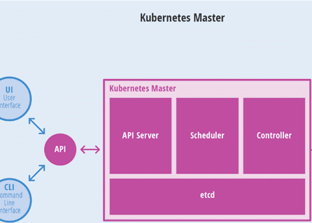

- [学习目标](#学习目标)
- [课堂笔记（命令）](#课堂笔记命令)
  - [tee](#tee)
  - [多行表达式](#多行表达式)
- [课堂笔记（文本）](#课堂笔记文本)
  - [Kubernetes概述](#kubernetes概述)
    - [k8s起源](#k8s起源)
    - [k8s的作用](#k8s的作用)
    - [核心架构](#核心架构)
    - [角色与功能](#角色与功能)
      - [Master](#master)
      - [Node](#node)
      - [Image](#image)
    - [K8s部署方式](#k8s部署方式)
      - [部署环境](#部署环境)
  - [k8s集群组件](#k8s集群组件)
    - [主机清单](#主机清单)
    - [服务端口](#服务端口)
    - [集群架构](#集群架构)
    - [安装控制节点](#安装控制节点)
      - [配置软件仓库](#配置软件仓库)
      - [配置系统环境变量](#配置系统环境变量)
      - [安装配置软件](#安装配置软件)
      - [配置内核参数](#配置内核参数)
      - [导入k8s镜像](#导入k8s镜像)
      - [设置Tab键](#设置tab键)
      - [master安装](#master安装)
    - [安装网络插件](#安装网络插件)
      - [上传镜像](#上传镜像)
      - [calico概述](#calico概述)
      - [安装calico](#安装calico)
    - [Kubeadm工具](#kubeadm工具)
      - [常用选项](#常用选项)
      - [Kubeadm使用](#kubeadm使用)
    - [安装计算节点](#安装计算节点)
      - [获取凭证](#获取凭证)
      - [node安装](#node安装)
      - [批量部署](#批量部署)
      - [查询集群状态](#查询集群状态)
- [快捷键](#快捷键)
- [问题](#问题)
- [补充](#补充)
- [今日总结](#今日总结)
- [昨日复习](#昨日复习)

# 学习目标

理解kubernetes的架构

搭建kubernetes集群

# 课堂笔记（命令）

## tee

> 既能写入文件，也在控制台输出

```shell
[root@master init]# echo "123" | tee a.txt
123
[root@master init]# cat a.txt 
123
```

## 多行表达式

```shell
# << 多行写入
]#cat <<EOF
>123 123
>123 123
EOF

123 123
123 123
# <<< 模拟用户交互
]#read a b <<< "1 2 3"
]#echo ${a}
1
```


# 课堂笔记（文本）

## Kubernetes概述

### k8s起源

> 将Dokcer应用于具体的业务实现，是存在困难的，编排、管理和调度各个方面都不容易，于是就需要一套管理系统，对Docker及容器进行高级灵活的管理，这时Kubernetes出现了
>
> kubernetes名字来自希腊语，意思是舵手或领航员
>
> k8s是将k和s之间的8个字母替换成8

### k8s的作用

> 容器集群管理系统，一个开源的平台(cncf基金会)，可以实现容器集群的自动化部署、自动扩缩容、自维护等功能

### 核心架构

> master 管理节点
>
> node 计算节点
>
> image 镜像仓库


### 角色与功能

#### Master

> Master功能
>
> - 提供集群控制
> - 对集群进行全局决策
> - 检测和响应集群事件
>
> Master节点核心组件
>
> + API Server
>
>   整个系统的对外接口，供客户端和其他组件调用
>
>   后端元数据存储在etcd中
>
> + Scheduler
>
>   负责对集群内部的资源进行分配和调度
>
> + ControllerManager
>
>   负责管理控制器
>
> + etcd
>
>   分布式键值数据库，基于Go语言实现



#### Node

> Node功能
>
> + 运行容器的实际节点
> + 提供运行环境
> + 在多个节点上运行
> + 水平扩展
>
> Node核心组件
>
> + kubelet
> + kube-proxy
> + Runtime


#### Image

> 镜像仓库
>
> + 存储镜像
> + 为节点提供镜像支持
>
> 仓库组件
>
> + registry
> + harbor


### K8s部署方式

> [访问k8s官网](https://kubernetes.io)
>
> + 源码部署：下载源码或编译好的二进制
> + 容器部署：下载镜像启动
>
> 官方工具kubeadm

#### 部署环境

> + Linux内核 >=3.10
> + 最低配置2cpu，2G内存
> + 节点中不可以有重复的主机名、mac地址或product_uuid
> + 卸载防火墙firewalld\-\*
> + 禁用swap

## k8s集群组件

### 主机清单

| 主机名    | IP地址       | 最低配置    |
| --------- | ------------ | ----------- |
| master    | 192.168.1.50 | 2CPU,4G内存 |
| node-0001 | 192.168.1.51 | 2CPU,4G内存 |
| node-0002 | 192.168.1.52 | 2CPU,4G内存 |
| node-0003 | 192.168.1.53 | 2CPU,4G内存 |
| node-0004 | 192.168.1.54 | 2CPU,4G内存 |
| node-0005 | 192.168.1.55 | 2CPU,4G内存 |
| harbor    | 192.168.1.30 | 2CPU,4G内存 |

### 服务端口


### 集群架构


### 安装控制节点

#### 配置软件仓库

> [下载所需软件包](https://gogetacoke.lanzv.com/iHhXu1ovxpid)

```shell
# 上传到跳板机器
[root@ecs-proxy ~]# rsync -av packages/ /var/localrepo/k8s/
[root@ecs-proxy ~]# createrepo --update /var/localrepo/
```

#### 配置系统环境变量

```shell
# 禁用 firewall 和 swap
[root@master ~]# sed '/swap/d' -i /etc/fstab
[root@master ~]# swapoff -a
[root@master ~]# dnf remove -y firewalld-*
```

#### 安装配置软件

> kubeadm 集群配置工具
>
> kubelet 管理pod，在集群中的每个节点上启动
>
> kubectl 与集群通信的命令行工具
>
> containerd 容器管理软件
>
> ipvsadm 集群管理工具
>
> iproute-tc 网络流量管理工具

```shell
[root@master ~]# vim /etc/hosts
192.168.1.30    harbor
192.168.1.50    master
192.168.1.51    node-0001
192.168.1.52    node-0002
192.168.1.53    node-0003
192.168.1.54    node-0004
192.168.1.55    node-0005
[root@master ~]# dnf install -y kubeadm kubelet kubectl containerd.io ipvsadm ipset iproute-tc
# 生成配置文件
[root@master ~]# containerd config default >/etc/containerd/config.toml
[root@master ~]# vim /etc/containerd/config.toml
61:     sandbox_image = "harbor:443/k8s/pause:3.9" # 配置基础镜像
125:    SystemdCgroup = true # 指定配置systemd驱动
154 行新插入:  # 配置私有镜像仓库地址
        [plugins."io.containerd.grpc.v1.cri".registry.mirrors."docker.io"]
          endpoint = ["https://harbor:443"]
        [plugins."io.containerd.grpc.v1.cri".registry.mirrors."harbor:443"]
          endpoint = ["https://harbor:443"]        [plugins."io.containerd.grpc.v1.cri".registry.configs."harbor:443".tls]
          insecure_skip_verify = true # 跳过安全验证
[root@master ~]# systemctl enable --now kubelet containerd
```

#### 配置内核参数

```shell
# 加载内核模块
[root@master ~]# cat >/etc/modules-load.d/containerd.conf<<EOF
overlay # 文件系统模块
br_netfilter # 网桥防火墙模块
xt_conntrack # 链接跟踪failed to pull and unpack image "docker.io/library/myos:nginx": failed to resolve reference "docker.io/library/myos:nginx模块
EOF
# 启动systemd-modules-load服务加载/etc/modules-load.d/ 目录下的配置文件，并按照指定模块进行加载
[root@master ~]# systemctl start systemd-modules-load.service 

# 设置内核参数
[root@master ~]# cat >/etc/sysctl.d/99-kubernetes-cri.conf<<EOF
net.ipv4.ip_forward = 1 # 开启路由转发
net.bridge.bridge-nf-call-iptables = 1 # 开启桥流量监控
net.bridge.bridge-nf-call-ip6tables = 1  # 开启桥流量监控，为了确保Kubernetes能够正确地管理和监控容器间的网络流量
net.netfilter.nf_conntrack_max = 1000000 # 设置链接跟踪表大小，提高系统处理新连接的速度和能力，对于大规模服务网格环境（如Kubernetes）非常有用，因为它可以应对更多的并发连接
EOF
# 立即加载指定配置文件的内核参数
[root@master ~]# sysctl -p /etc/sysctl.d/99-kubernetes-cri.conf
```

#### 导入k8s镜像

> 访问k8s官网 docker pull下载镜像
>
> 将该文件夹中kubernetes/init上传到master机器

```shell
[root@master ~]# dnf install -y docker-ce
[root@master ~]# mkdir -p /etc/docker
[root@master ~]# vim /etc/docker/daemon.json 
{
    "registry-mirrors":["https://harbor:443"],
    "insecure-registries":["harbor:443"]
}
[root@master ~]# systemctl enable --now docker

# 登录 harbor 仓库，上传镜像
[root@master ~]# docker login harbor:443 
Username: admin
Password: ********
Login Succeeded
[root@master ~]# docker load -i init/v1.26.0.tar.xz
# 循环打上标签并上传
[root@master ~]# docker images|while read i t _;do
    [[ "${t}" == "TAG" ]] && continue
    [[ "${i}" =~ ^"harbor:443/".+ ]] && continue
    docker tag ${i}:${t} harbor:443/k8s/${i##*/}:${t}
    docker push harbor:443/k8s/${i##*/}:${t}
    docker rmi ${i}:${t} harbor:443/k8s/${i##*/}:${t}
done
```

> read 交互式获取用户输入

#### 设置Tab键

```shell
[root@master init]# source <(kubeadm completion bash|tee /etc/bash_completion.d/kubeadm)
[root@master init]# source <(kubectl completion bash|tee /etc/bash_completion.d/kubectl)
```

> 默认kubectl进行tab时只能出来文件内容，通过上述设置后就可以tab出kubectl的所有方法

#### master安装

```shell
# 测试系统环境
[root@master ~]# kubeadm init --config=init/init.yaml --dry-run 2>error.log
# error.log没有输出则表示环境没问题
[root@master ~]# cat error.log
# 测试门问题后删除临时文件以及日志
[root@master ~]# rm -rf error.log /etc/kubernetes/tmp
# 主控节点初始化，并写入一个init.log日志
[root@master ~]# kubeadm init --config=init/init.yaml |tee init/init.log
# 管理授权(以下命令在上方初始化滚动日志中有显示)
[root@master ~]# mkdir -p $HOME/.kube
[root@master ~]# sudo cp -i /etc/kubernetes/admin.conf $HOME/.kube/config
[root@master ~]# sudo chown $(id -u):$(id -g) $HOME/.kube/config
# 验证安装结果
[root@master ~]# kubectl get nodes
NAME     STATUS     ROLES           AGE   VERSION
master   NotReady   control-plane   19s   v1.26.0
```

> \-\-dry\-run 模拟测试使用
>
> --dry-run=client  -o yaml

### 安装网络插件

#### 上传镜像

> 镜像文件：kubernetes/plugins

```shell
[root@ecs-proxy s4]# rsync -av kubernetes/plugins 192.168.1.50:./
[root@master ~]# cd plugins/calico
[root@master calico]# docker load -i calico.tar.xz
[root@master calico]# docker images|while read i t _;do
    [[ "${t}" == "TAG" ]] && continue
    [[ "${i}" =~ ^"harbor:443/".+ ]] && continue
    docker tag ${i}:${t} harbor:443/plugins/${i##*/}:${t}
    docker push harbor:443/plugins/${i##*/}:${t}
    docker rmi ${i}:${t} harbor:443/plugins/${i##*/}:${t}
done
```

#### calico概述

> **caico是什么？**
>
> + 在虚拟化平台中，比如 OpenStack、Docker 等都需要实现 workloads 之间互连，但同时也需要对容器做隔离控制，设置访问策略，calico 就可以解决以上所有问题
> +   calico 可以让不同节点上的容器实现互联互通，同时也可以设置访问策略，它是一种容器之间网络互通的解决方案。
>
> **calico优势** 
>
> + 更节约资源：Calico 使用的三层路由方法，抑制二层广播，减少了资源开销，并且具有可扩展性。 
> + 更容易管理：因为没有隧道，意味着 workloads 之间路径更短更简单，配置更少，更容易管理。 
> + 更少的依赖：Calico 仅依赖三层路由可达。 – 适配性广：较少的依赖性使它能适配所有 VM、Container、白盒或者混合环境场景。

#### 安装calico

```shell
# 修改资源对象文件 calico.yml文件中的镜像地址
[root@master calico]# sed -ri 's,^(\s*image: )(.*/)?(.+),\1harbor:443/plugins/\3,' calico.yaml
4443:  image: docker.io/calico/cni:v3.25.0
4471:  image: docker.io/calico/cni:v3.25.0
4514:  image: docker.io/calico/node:v3.25.0
4540:  image: docker.io/calico/node:v3.25.0
4757:  image: docker.io/calico/kube-controllers:v3.25.0
# 执行安装：类似docker compose;calico.yaml文件由kubeadm生成
[root@master calico]# kubectl apply -f calico.yaml
# 需要等待1min才会变成Ready
[root@master calico]# kubectl get nodes
NAME     STATUS   ROLES           AGE   VERSION
master   Ready    control-plane   23m   v1.26.0
```

### Kubeadm工具

#### 常用选项

| 命令选项 | 命令说明             |
| -------- | -------------------- |
| help     | 命令帮助信息         |
| version  | 版本信息             |
| config   | 镜像管理命令         |
| init     | 集群初始化命令       |
| reset    | 还原、删除集群配置   |
| join     | 计算节点加入集群配置 |
| token    | token凭证管理        |

#### Kubeadm使用

```shell
# 创建模板文件
[root@master calico]# kubeadm config print init-defaults > init.yaml
# 查询kube proxy配置信息
[root@master calico]# kubeadm config print init-defaults --component-configs KubeProxyConfiguration
# 查询kubelet配置信息
[root@master calico]# kubeadm config print init-defaults --component-configs KubeletConfiguration
# 查询当前版本信息
[root@master calico]#kubeadm version -o yaml
```

### 安装计算节点

#### 获取凭证

```shell
# 查看 token
[root@master ~]# kubeadm token list
TOKEN                     TTL         EXPIRES                USAGES                   DESCRIPTION                                                EXTRA GROUPS
abcdef.0123456789abcdef   22h         2024-02-22T06:10:20Z   authentication,signing   <none>                                                     system:bootstrappers:kubeadm:default-node-token
# 删除 token
[root@master ~]# kubeadm token delete abcdef.0123456789abcdef
bootstrap token "abcdef" deleted
# 创建 token
[root@master ~]# kubeadm token create --ttl=0 --print-join-command
kubeadm join 192.168.1.50:6443 --token ei7o3k.io8txm9iaeedva3d --discovery-token-ca-cert-hash sha256:9df1928ed4f6330224f657f3dc81ca89bf6368547dc18d3a81745c8305bcfbad 
# 获取token_hash+prometheus
# 1、查看安装日志  2、在创建token时候显示  3、使用 openssl 计算得到
[root@master ~]# openssl x509 -pubkey -in /etc/kubernetes/pki/ca.crt |openssl rsa -pubin -outform der |openssl dgst -sha256 -hex
```

#### node安装

> 参考安装控制节点：系统环境配置、安装软件包、配置内核参数三个步骤

```shell
# 已经完成上方三个步骤(在node1上完成)
[root@node-0001 ~]# kubeadm join 192.168.1.50:6443 --token ei7o3k.io8txm9iaeedva3d --discovery-token-ca-cert-hash sha256:9df1928ed4f6330224f657f3dc81ca89bf6368547dc18d3a81745c8305bcfbad 

[root@master ~]# kubectl get nodes
NAME        STATUS   ROLES           AGE    VERSION
master      Ready    control-plane   169m   v1.26.0
node-0001   Ready    <none>          61m    v1.26.0
```

#### 批量部署

> [下载剧本](https://gogetacoke.lanzv.com/izFYk1oxnhih)

```shell
[root@ecs-proxy s4]# cd ~/nodejoin/
[root@ecs-proxy nodejoin]# vim nodeinit.yaml
... ...
  vars:
    master: '192.168.1.50:6443'
    token: 'ei7o3k.io8txm9iaeedva3d'
    token_hash: 'sha256:9df1928ed4f6330224f657f3dc81ca89bf6368547dc18d3a81745c8305bcfbad '
... ...
[root@ecs-proxy nodejoin]# ansible-playbook nodeinit.yaml
```

#### 查询集群状态

```shell
# 验证节点工作状态
[root@master ~]# kubectl get nodes
NAME        STATUS   ROLES           AGE   VERSION
master      Ready    control-plane   99m   v1.26.0
node-0001   Ready    <none>          23m   v1.26.0
node-0002   Ready    <none>          57s   v1.26.0
node-0003   Ready    <none>          57s   v1.26.0
node-0004   Ready    <none>          57s   v1.26.0
node-0005   Ready    <none>          57s   v1.26.0

# 验证容器工作状态
[root@master ~]# kubectl -n kube-system get pods
NAME                                      READY   STATUS    RESTARTS   AGE
calico-kube-controllers-fc945b5f7-p4xnj   1/1     Running   0          77m
calico-node-6s8k2                         1/1     Running   0          59s
calico-node-bxwdd                         1/1     Running   0          59s
calico-node-d5g6x                         1/1     Running   0          77m
calico-node-lfwdh                         1/1     Running   0          59s
calico-node-qnhxr                         1/1     Running   0          59s
calico-node-sjngw                         1/1     Running   0          24m
coredns-844c6bb88b-89lzt                  1/1     Running   0          59m
coredns-844c6bb88b-qpbvk                  1/1     Running   0          59m
etcd-master                               1/1     Running   0          70m
kube-apiserver-master                     1/1     Running   0          70m
kube-controller-manager-master            1/1     Running   0          70m
kube-proxy-5xjzw                          1/1     Running   0          59s
kube-proxy-9mbh5                          1/1     Running   0          59s
kube-proxy-g2pmp                          1/1     Running   0          99m
kube-proxy-l7lpk                          1/1     Running   0          24m
kube-proxy-m6wfj                          1/1     Running   0          59s
kube-proxy-vqtt8                          1/1     Running   0          59s
kube-scheduler-master                     1/1     Running   0          70m
```


# 快捷键


# 问题


# 补充


# 今日总结


# 昨日复习