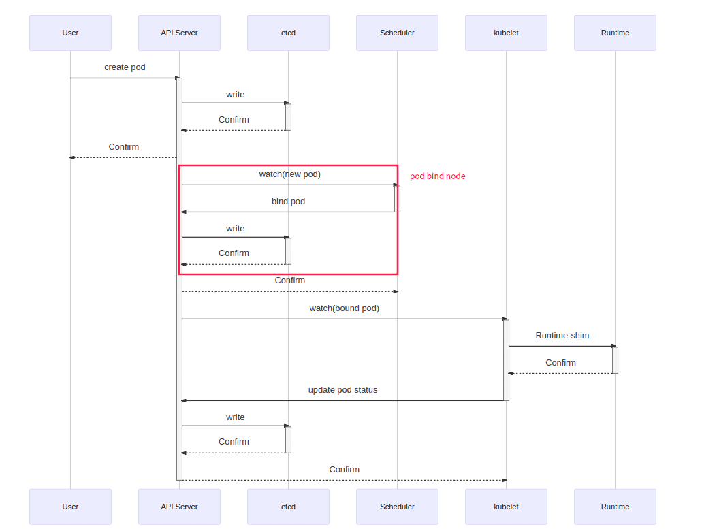
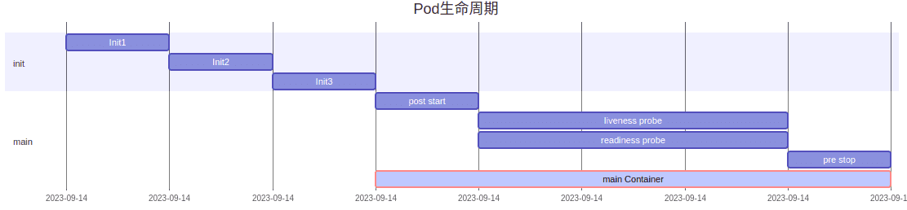

- [学习目标](#学习目标)
- [课堂笔记（命令）](#课堂笔记命令)
- [课堂笔记（文本）](#课堂笔记文本)
- [快捷键](#快捷键)
- [问题](#问题)
- [补充](#补充)
- [今日总结](#今日总结)
- [昨日复习](#昨日复习)

# 学习目标

熟悉Kubernetes管理平台

掌握kubectl管理命令

熟悉Pod创建过程及相位状态

熟悉资源对象文件


# 课堂笔记（命令）

## 选项终止符

```shell
# 找出ls 帮助命令中的--time内容
]#ls --help|grep --time
grep: unrecognized option '--time'
Usage: grep [OPTION]... PATTERN [FILE]...
Try 'grep --help' for more information.
ls: unrecognized option '--htlp'
Try 'ls --help' for more information.
# 使用选项终止符
[root@master ~]# ls --help|grep -- --time
      --full-time            like -l --time-style=full-iso
      --time=WORD            with -l, show time as WORD instead of default
      --time-style=TIME_STYLE  time/date format with -l; see TIME_STYLE below
```


# 课堂笔记（文本）

## 集群管理命令

### 如何管理集群

> kubectl是用于控制Kubernetes集群的命令行工具

#### 语法格式

```shell
kubectl [command] [type] [name] [flags]
command 子命令，如create，get，delete等
type 资源类型，可以表示为但数，复数或缩写形式
name 资源的名称，省略则显示所有资源信息
flags 指定可选标志，或附加的参数
```

### 命令说明

| **子命令**    | **说明**                            |
| ------------- | ----------------------------------- |
| help          | 用于查看命令及子命令的帮助信息      |
| cluster-info  | 显示集群的相关配置信息              |
| version       | 查看服务器及客户端的版本信息        |
| api-resources | 查看当前服务器上所有的资源对象      |
| api-versions  | 查看当前服务器上所有资源对象的版本  |
| config        | 管理当前节点上kubeconfig 的认证信息 |

#### help

```shell
# 查看帮助命令信息
[root@master ~]# kubectl help version
Print the client and server version information for the current context.

Examples:
  # Print the client and server versions for the current context
  kubectl version
... ...
[root@master ~]# kubectl get --help
```

#### cluster-info

```shell
# 查询基础信息
[root@master ~]# kubectl cluster-info 
Kubernetes control plane is running at https://192.168.1.50:6443
CoreDNS is running at https://192.168.1.50:6443/api/v1/namespaces/kube-system/services/kube-dns:dns/proxy
... ...
# 查询详细信息，以json格式进行展示
[root@master ~]# kubectl cluster-info dump | less
```

#### version

```shell
# 查看服务端与客户端版本信息
[root@master ~]# kubectl version
WARNING: This version information is deprecated and will be replaced with the output from kubectl version --short.  Use --output=yaml|json to get the full version.
Client Version: version.Info{Major:"1", Minor:"26", GitVersion:"v1.26.0", GitCommit:"b46a3f887ca979b1a5d14fd39cb1af43e7e5d12d", GitTreeState:"clean", BuildDate:"2022-12-08T19:58:30Z", GoVersion:"go1.19.4", Compiler:"gc", Platform:"linux/amd64"}
Kustomize Version: v4.5.7
Server Version: version.Info{Major:"1", Minor:"26", GitVersion:"v1.26.0", GitCommit:"b46a3f887ca979b1a5d14fd39cb1af43e7e5d12d", GitTreeState:"clean", BuildDate:"2022-12-08T19:51:45Z", GoVersion:"go1.19.4", Compiler:"gc", Platform:"linux/amd64"}
```

#### api-resources

```shell
# 查看资源对象类型（名字 缩写  版本 名称空间 资源对象的类型）
[root@master ~]# kubectl api-resources 
NAME      SHORTNAMES     APIVERSION      NAMESPACED      KIND
bindings                        v1              true            Binding
endpoints        ep             v1              true            Endpoints
events           ev             v1              true            Event
... ...
```

#### api-versions

```shell
# 查看资源对象版本
[root@master ~]# kubectl api-versions 
admissionregistration.k8s.io/v1
apiextensions.k8s.io/v1
apiregistration.k8s.io/v1
apps/v1
... ...
```

#### config

```shell
# 查看当前认证使用的用户及证书
[root@master ~]# kubectl config get-contexts 
CURRENT   NAME                          CLUSTER      AUTHINFO
*         kubernetes-admin@kubernetes   kubernetes   kubernetes-admin
# 使用 view 查看详细配置
[root@master ~]# kubectl config view 
apiVersion: v1
clusters:
- cluster:
    certificate-authority-data: DATA+OMITTED
    server: https://192.168.1.50:6443
....
```

## 主机管理授权

> 使30机器有权限对容器集群进行管理

```shell
[root@harbor ~]# vim /etc/hosts
192.168.1.30    harbor
192.168.1.50    master
192.168.1.51    node-0001
192.168.1.52    node-0002
192.168.1.53    node-0003
192.168.1.54    node-0004
192.168.1.55    node-0005
[root@harbor ~]# dnf install -y kubectl
[root@harbor ~]# mkdir -p $HOME/.kube
# 类似ssh中拷贝公私钥到需要被管理的机器上
[root@harbor ~]# rsync -av master:/etc/kubernetes/admin.conf $HOME/.kube/config
[root@harbor ~]# chown $(id -u):$(id -g) $HOME/.kube/config
[root@harbor ~]# kubectl get nodes
NAME        STATUS   ROLES           AGE   VERSION
master      Ready    control-plane   24h   v1.26.0
node-0001   Ready    <none>          22h   v1.26.0
node-0002   Ready    <none>          22h   v1.26.0
node-0003   Ready    <none>          22h   v1.26.0
node-0004   Ready    <none>          22h   v1.26.0
node-0005   Ready    <none>          22h   v1.26.0
```

### 资源对象概述

> + k8s中可以创建或配置的应用和服务称为资源对象
>
> + 集群中创建的Pod、负责均衡、存储、网络服务等都是资源对象
>
> 如何创建资源对象
>
> + 简单资源对象可以使用“kubectl”直接创建
> + 高级资源对象需要使用“资源对象文件”创建

## Pod管理

### 创建Pod

```shell
# 创建格式
kubectl run Pod名词 [选项/参数] --image=镜像名称:标签
```

```shell
# 创建 Pod
[root@master ~]# kubectl run myweb --image=myos:nginx
pod/myweb created

# 查询资源对象
[root@master ~]# kubectl get pods -o wide
NAME    READY   STATUS    RESTARTS   AGE   IP             NODE        NOMINATED NODE   READINESS GATES
myweb   1/1     Running   0          11s   10.244.147.1   node-0002   <none>           <none>
[root@master ~]# curl http://10.244.147.1
Nginx is running !
```

### Pod概述

> **什么是Pod？**
>
> + Pod就像一个豌豆荚，它由一个或多个容器组成
> + Pod是Kubernetes中最小的管理元素
> + Pod是一个服务的多个进程的聚合单位
> + 同Pod有如下特点
>   + 共享网络IP及特权
>   + 共享主机名称
>   + 共享存储设备
>
> **为什么要使用Pod？**
>
> + 服务之间有相关性
> + 启动容器的时候需要初始化或进行相关配置

### Pod创建过程



### Pod生命周期



> Pod对象自从创建开始值至终止的时间范围称为其生命周期
>
> 在这段时间中，Pod处在多种不同的状态，并执行相关操作
>
> 创建主容器为必须的操作，其他 为可选操作（初始化容器、启动后钩子、存活性探测、就绪性探测以及终止前钩子等）

### Pod管理命令(一)

| **子命令** | **说明**               | **备注**              |
| ---------- | ---------------------- | --------------------- |
| run/create | 创建资源对象           | 可输出资源文件模板    |
| get        | 查看资源对象的状态信息 | 常用参数: -o 显示格式 |
| describe   | 查询资源对象的属性信息 |                       |
| logs       | 查看容器的报错信息     | 常用参数: -c 容器名称 |

#### get

```shell
# 语法格式
kubectl get 资源类型 [资源名称] [选项/参数]
# 常用参数
-o name 只显示名字
-o wide 显示详细信息
-o yaml 以yaml语法格式显示资源对象
-o json 以json语法格式显示资源对象
```

```shell
# 查看 Pod 资源对象  默认查询default名称空间查询
[root@master ~]# kubectl get pods
NAME     READY   STATUS    RESTARTS   AGE
myweb    1/1     Running   0          10m
# 只查看资源对象的名字
[root@master ~]# kubectl get pods -o name
pod/myweb
# 查看资源对象运行节点的信息
[root@master ~]# kubectl get pods -o wide
NAME    READY   STATUS    RESTARTS   AGE   IP             NODE        NOMINATED NODE   READINESS GATES
myweb   1/1     Running   0          11s   10.244.147.1   node-0002   <none>           <none>
# 查看资源对象详细信息，Yaml 格式
[root@master ~]# kubectl get pod myweb -o yaml
apiVersion: v1
kind: Pod
metadata:
  name: myweb
... ...


# 查看命名空间
[root@master ~]# kubectl get namespaces 
NAME              STATUS   AGE
default           Active   39h
kube-node-lease   Active   39h
kube-public       Active   39h
kube-system       Active   39h

# 查看 kube-system 名称空间中的 Pod 信息
[root@master ~]# kubectl -n kube-system get pods
NAME                             READY   STATUS    RESTARTS      AGE
etcd-master                      1/1     Running   0             39h
kube-apiserver-master            1/1     Running   0             39h
kube-controller-manager-master   1/1     Running   0             39h
kube-scheduler-master            1/1     Running   0             39h
... ...
```

#### create

> 除了不能创建pod其余都使用create创建

```shell
# 创建名称空间资源对象
[root@master ~]# kubectl create namespace work
namespace/work created

# 查看名称空间
[root@master ~]# kubectl get namespaces
NAME              STATUS   AGE
default           Active   39h
kube-node-lease   Active   39h
kube-public       Active   39h
kube-system       Active   39h
work              Active   11s
```

> 系统命名空间：
>
> + default 默认的命名空间，不声明命名空间的Pod都在这里 
> + kube-node-lease 为高可用提供心跳监视的命名空间 
> + kube-public 公共数据，所有用户都可以读取它 
> + kube-system 系统服务对象所使用的命名空间
>
> k8s系统核心服务都运行在kube-system名称空间中

#### run

```shell
# 创建简单 Pod 资源对象
[root@master ~]# kubectl -n work run myhttp --image=myos:httpd
pod/myhttp created

# 查询资源对象
[root@master ~]# kubectl -n work get pods -o wide
NAME      READY   STATUS    RESTARTS   AGE   IP               NODE        NOMINATED NODE   READINESS GATES
myhttpd   1/1     Running   0          25s   10.244.243.193   node-0003   <none>           <none>
# 访问验证
[root@master ~]# curl http://10.244.243.193
Welcome to The Apache.
```

#### describe

```shell
# 查看资源对象的属性信息
[root@master ~]# kubectl describe pod myweb
Name:             myweb
Namespace:        default
Priority:         0
Service Account:  default
Node:             node-0002/192.168.1.52
Start Time:       Thu, 22 Feb 2024 10:19:09 +0800
Labels:           run=myweb
Annotations:      cni.projectcalico.org/containerID: 2ca3c176206108b584ea4375b476fd1fb3705809af2514cfe039e0746a007686
                  cni.projectcalico.org/podIP: 10.244.147.1/32
                  cni.projectcalico.org/podIPs: 10.244.147.1/32
Status:           Running
IP:               10.244.147.1
IPs:
  IP:  10.244.147.1
  。。。。

# 查看 work 名称空间下的 pod 信息
[root@master ~]# kubectl -n work describe pod myhttp
Name:             myhttpd
Namespace:        work
Priority:         0
Service Account:  default
Node:             node-0003/192.168.1.53
Start Time:       Thu, 22 Feb 2024 11:35:16 +0800
Labels:           run=myhttpd
```

#### logs

```shell
# 访问服务，并查看日志
[root@master ~]# curl http://10.244.147.1/info.php
[root@master ~]# curl http://10.244.243.193/info.php
... ...
# 查看 myweb 日志
[root@master ~]# kubectl logs myweb 
2024/02/22 03:55:36 [error] 7#0: *2 open() "/usr/local/nginx/html/info.php" failed (2: No such file or directory), client: 10.244.219.64, server: localhost, request: "GET /info.php HTTP/1.1", host: "10.244.147.1"
# 查看 myhttp 日志
[root@master ~]# kubectl -n work logs myhttpd
[root@master ~]# 
```

#### 排错测试

> get describe logs 排错工具

```shell
# 使用仓库中不存在的镜像
[root@master ~]# kubectl -n work run myhttp2 --image=myos:php 
pod/myhttp2 created
[root@master ~]# kubectl -n work describe pod myhttp2
Name:             myhttp2
Namespace:        work
Priority:         0
Service Account:  default
Node:             node-0005/192.168.1.55
Start Time:       Thu, 22 Feb 2024 12:37:08 +0800
Labels:           run=myhttp2
......
Warning  Failed     21s               kubelet            Failed to pull image "myos:php": rpc error: code = Unknown desc = failed to pull and unpack image "docker.io/library/myos:php": failed to resolve reference "docker.io/library/myos:php": failed to do request: Head "https://registry-1.docker.io/v2/library/myos/manifests/php": dial tcp 54.198.86.24:443: i/o timeout
  Warning  Failed     21s               kubelet            Error: ErrImagePull
# 日志  
[root@master ~]# kubectl logs -n work myhttp2
Error from server (BadRequest): container "myhttp2" in pod "myhttp2" is waiting to start: trying and failing to pull image 
```

> 通过排错工具得出重要信息：“failed to pull and unpack image ”；“trying and failing to pull image”

### Pod管理命令(二)

| **子命令** | **说明**                         | **备注**              |
| ---------- | -------------------------------- | --------------------- |
| exec       | 在某一个容器内执行特定的命令     | 可选参数: -c 容器名称 |
| cp         | 在容器和宿主机之间拷贝文件或目录 | 可选参数: -c 容器名称 |
| delete     | 删除资源对象                     | 可选参数: -l 标签     |

#### exec

> 通dokcer中的exec一样，但在执行命令或添加参数时需要使用选项终止符\-\-

```shell
# 在容器内执行命令
[root@master ~]# kubectl exec myweb -- ls 
50x.html
index.html
[root@master ~]# kubectl exec -it myweb -- /bin/bash
[root@myweb html]# ifconfig eth0
eth0: flags=4163<UP,BROADCAST,RUNNING,MULTICAST>  mtu 1450
        inet 10.244.1.3  netmask 255.255.255.0  broadcast 10.244.2.255
        ether 3a:32:78:59:ed:25  txqueuelen 0  (Ethernet)
... ...
```

#### cp

```shell
# 与容器进行文件或目录传输
[root@master ~]# kubectl cp myweb:/etc/yum.repos.d /root/aaa
tar: Removing leading `/' from member names
[root@master ~]# tree /root/aaa
/root/aaa
├── local.repo
├── Rocky-AppStream.repo
├── Rocky-BaseOS.repo
└── Rocky-Extras.repo

0 directories, 4 files
# 拷贝内容到容器
[root@master ~]# kubectl -n work cp /etc/passwd myhttp:/root/mima
[root@master ~]# kubectl -n exec myweb -- ls /root/
mima
```

> k8s中的cp原理是将目标机器的内容进行tar打包，再拷贝到所需主机上进行了一个解压

#### delete

```shell
# 删除资源对象，默认删除default名称空间下的内容
[root@master ~]# kubectl delete pods myweb 
pod "myweb" deleted

# 删除 work 名称空间下所有 Pod 对象
[root@master ~]# kubectl -n work delete pods --all
pod "myhttp" deleted

# 删除名称空间
[root@master ~]# kubectl delete namespaces work 
namespace "work" deleted
```

> [注]：删除名称空间时需要先删除空间下的所有pod对象

#### 案例

> 使用myos:nginx，myos:httpd创建两test1和test2pod，将test1上/usr/local/nginx/html/index.html 拷贝到test2 /var/www/html/index.html，验证后进行删除

```shell
# 跨平台拷贝；使用tar进行重定向归档，再管道test2进行解压
[root@master ~]#kubectl exec -t test1 -- tar -cf - -C /usr/local/nginx/html/ index.html | kubectl exec -it test2 -- tar -xf - -C /var/www/html
[root@master ~]#kubectl get pods -o wide
NAME    READY   STATUS    RESTARTS   AGE    IP             NODE        NOMINATED NODE   READINESS GATES
test1   1/1     Running   0          5m9s   10.244.147.2   node-0002   <none>           <none>
test2   1/1     Running   0          5m9s   10.244.21.129   node-0001   <none>           <none>
[root@master ~]#curl 10.244.21.129
Nginx is running !
[root@master ~]#curl 10.244.147.2
Nginx is running !
```

> tar的高级使用
>
> ```shell
> ]#tar -cf - -C /usr/local/nginx/html/  > a.tar
> ```
>
> tar 是一个用于创建和管理归档文件的工具。
> \-c 表示创建一个新的归档文件。
> \-f 表示指定归档文件的名称，这里的 \- 表示将标准输出（stdout）作为归档文件的内容。
> /usr/local/nginx/html/  是要添加到归档文件中的文件或目录。
>
> 表示重定向标准输出到文件 a.tar。

## 资源对象文件

### 资源文件详解

> **什么是资源对象？**
>
> + Kubernetes 对象是“目标性记录” 
> +  Kubernetes 使用这些对象去表示整个集群的状态。
>
> **什么是资源对象文件？**
>
> + 创建 Kubernetes 对象时，必须提供资源对象的一些基本信息（例如：资源的对象的名字），以及描述描述该对象的期望状态特征（规约），如果我们在这个文件中使用 YamI 的语法格式描述了上面的信息，这个文件就是资源对象文件
>
> **为什么要使用资源对象文件？**
>
> + 命令无法持久化，没有历史记录，不方便重现   
> + 服务众多，多个容器之间有关联性，管理不方便   
> + 很多高级的复杂的功能靠简单的命令方式无法实现，都需要使用资源文件描述 
>
> 资源对喜爱嗯文件可以做什么？
>
> + 可以创建、删除、变更、管理资源对象
>
> key ==>小驼峰
>
> value ==>大驼峰

### Pod资源对象文件

```shell
[root@master ~]# vim myweb.yaml
--- # yaml文件起始标志
kind: Pod # 当前创建资源的类型
apiVersion: v1 # 当前资源对应的版本
metadata: # 属性信息，元数据
  name: myweb # 属性信息，资源的名陈
spec: # 资源的特性描述
  containers: # 容器资源特征描述
  - name: webserver # 容器的名称
    image: myos:nginx # 启动容器使用的镜像 
status: {} # 资源状态
```

### 静态Pod

不推荐使用

> **什么是静态Pod？**
>
> + 静态 Pod 是由 kubelet 守护进程直接管理的 Pod，不需要 API 服务器 监督。 与由控制面管理的 Pod 不同 
> + kubelet 监视每个静态 Pod（在它崩溃之后重新启动） 
> + 静态 Pod 永远都会绑定到一个指定节点上的 Kubelet –静态 Pod 的 spec 不能引用其他 API 对象 
> + 静态 Pod 配置路径： /var/lib/kubelet/config.yaml staticPodPath: /etc/kubernetes/manifests

#### 创建静态Pod

```shell
[root@node-0003 ~]# vim /etc/kubernetes/manifests/myweb.yaml
# master查看
[root@master ~]# kubectl get pod
NAME              READY   STATUS    RESTARTS   AGE
myweb-node-0003   0/1     Pending   0          5s
```

#### 删除静态Pod

```shell
[root@node-0003 ~]#kubectl delete pod myweb-node-0003
pod "myweb-node-0003" deleted
# 删除后kubectl将会自动重建
[root@master ~]# kubectl get pod
NAME              READY   STATUS    RESTARTS   AGE
myweb-node-0003   0/1     Pending   0          5s

# 删除资源文件才能彻底删除Pod
[root@node-0003 ~]# rm -rf /etc/kubernetes/manifests/myweb.yaml 
[root@master ~]# kubectl get pod
No resources found in default namespace
```

### 资源文件管理命令

| **说明**                     | **子命令** | **备注**                     |
| ---------------------------- | ---------- | ---------------------------- |
| 创建文件中定义的资源         | create     | 支持指令式和资源对象文件配置 |
| 创建（更新）文件中定义的资源 | apply      | 只支持资源对象文件（声明式） |
| 删除文件中定义的资源         | delete     | 支持指令式和资源对象文件配置 |

> create：只能初次创建，再次执行就报已存在
>
> apply：所需内存空间较大，多次执行不会报错

#### create

```shell
# 创建资源对象
[root@master ~]# kubectl create -f myweb.yaml 
pod/myweb created

# 不能更新，重复执行会报错
[root@master ~]# kubectl create -f myweb.yaml 
Error from server (AlreadyExists): error when creating "myweb.yaml": pods "myweb" already exists
```

#### delete

```shell
# 使用资源对象文件删除
[root@master ~]# kubectl delete -f myhttp.yaml
pod "myhttp" deleted
[root@master ~]# kubectl get pods
No resources found in default namespace.
```

#### apply

```shell
# 创建资源对象
[root@master ~]# kubectl apply -f myweb.yaml 
pod/myweb created
# 更新资源对象
[root@master ~]# kubectl apply -f myweb.yaml 
pod/myweb configured
# 删除资源对象
[root@master ~]# kubectl delete -f myweb.yaml 
pod "myweb" deleted

# 拓展提高
# 与 kubectl apply -f myweb.yaml 功能相同
[root@master ~]# cat myweb.yaml |kubectl apply -f - 
# 可以多个批量创建pod
[root@master ~]#for i in web{1..9};do sed "s,myweb,${i}," myweb.yaml;done | kubectl apply -f -
```


# 快捷键


# 问题


# 补充


# 今日总结


# 昨日复习