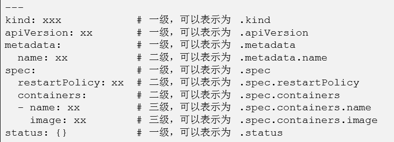

- [学习目标](#学习目标)
- [课堂笔记（命令）](#课堂笔记命令)
- [课堂笔记（文本）](#课堂笔记文本)
- [快捷键](#快捷键)
- [问题](#问题)
- [补充](#补充)
- [今日总结](#今日总结)
- [昨日复习](#昨日复习)

# 学习目标

管理资源对象文件

Pod配置自定义命令

多容器Pod	

资源指标监控

# 课堂笔记（命令）


# 课堂笔记（文本）

## 资源对象文件

### 模板与帮助信息

> 资源对象文件的优势
>
> + 命令无法实现高级复杂的功能
> + 某些资源对象使用命令无法创建
> + 方便管理、保存、追溯历史
>
> 资源对象文件太长，记不住？
>
> + 使用命令创建模板
> + 查询帮助信息
> + 查询官方手册

```perl6
# 生成模板命令
pod或资源对象 --dry-run=client -o yaml
```

#### Pod模板

```shell
[root@master ~]# kubectl run myweb --image=myos:nginx --dry-run=client -o yaml
apiVersion: v1
kind: Pod
metadata:
  creationTimestamp: null
  labels:
    run: myweb
  name: myweb
spec:
  containers:
  - image: myos:nginx
    name: myweb
    resources: {}
  dnsPolicy: ClusterFirst
  restartPolicy: Always
status: {}
```

#### 资源对象模板

```shell
[root@master ~]# kubectl create namespace work --dry-run=client -o yaml
apiVersion: v1
kind: Namespace
metadata:
  creationTimestamp: null
  name: work
spec: {}
status: {}
```

#### 查询帮助信息

> 资源文件中以“.”分割层级关系



> 如何获取帮助信息？
>
> + 以explain资源对象+层级关系

```shell
# 以Pod为例
[root@master ~]# kubectl explain Pod.spec.restartPolicy
KIND:     Pod
VERSION:  v1

FIELD:    restartPolicy <string>

DESCRIPTION:
     Restart policy for all containers within the pod. One of Always, OnFailure,
     Never. Default to Always. More info:
     https://kubernetes.io/docs/concepts/workloads/pods/pod-lifecycle/#restart-policy

     Possible enum values:
     - `"Always"`
     - `"Never"`
     - `"OnFailure"`
# 资源对象
[root@master ~]# kubectl explain Namespace.apiVersion
KIND:     Namespace
VERSION:  v1

FIELD:    apiVersion <string>
.....
```

### 管理资源对象

> 需求：
>
> + 创建名称空间work
> + 使用myos:nginx镜像分别在名称空间default和work下创建一个名为web1的Pod
> + 所有要求都必须写在同一个资源对象文件中
>
> [注]：若存在需要先执行的清单，需要写在其写在前面

```shell
[root@master app]# ls
nginx.yaml  phpfpm.yaml
# 使用资源对象文件创建应用
[root@master app]# kubectl apply -f nginx.yaml -f phpfpm.yaml
pod/nginx created
pod/php created

# 删除应用
[root@master app]# kubectl delete -f /root/app/
pod "nginx" deleted
pod "php" deleted

# 合并资源对象文件
[root@master app]# cat nginx.yaml >>app.yaml
[root@master app]# cat phpfpm.yaml >>app.yaml

# 创建资源对象
[root@master ~]# kubectl apply -f app.yaml
pod/nginx created
pod/php created

# 删除资源对象
[root@master ~]# kubectl delete -f app.yaml
pod "nginx" deleted
pod "php" deleted
```

### 自定义命令

> 创建pod时，可以为其设置启动时要执行的自定义命令，如果配置了自定义命令，那么镜像中自带的默认启动命令将不在执行
>
> 自定义命令设置再command字段下，如果要命令有参数，就填写再args字段下

```shell
# 例如执行sleep 30自定义命令
[root@master ~]# vim mycmd.yaml 
---
kind: Pod
apiVersion: v1
metadata:
  name: mycmd
spec:
  containers:
  - name: linux
    image: myos:8.5
    command: ["sleep"]
    args: ["30"]
[root@master ~]# kubectl apply -f mycmd.yaml 
pod/mycmd created    
# 使用-w参数可以在当前终端开启监控实时监控pods中变化的信息
[root@master ~]# kubectl get pods -w
NAME    READY   STATUS    RESTARTS   AGE
mycmd   1/1     Running   0          5s
mycmd   0/1     Completed   0          32s
mycmd   1/1     Running     1 (2s ago)   33s
```

#### 容器保护策略

> Pod会根据策略决定容器结束是否重启
>
> 常用策略有：
>
> + Always  重启
> + Never 不重启
> + OnFailure 失败就重启 

```shell
[root@master ~]# vim mycmd.yaml
---
kind: Pod
apiVersion: v1
metadata:
  name: mycmd
spec:
  restartPolicy: Never  # 配置保护策略
  containers:
  - name: linux
    image: myos:8.5
    command: ["sleep"]
    args: ["30"]

[root@master ~]# kubectl delete -f mycmd.yaml
pod "mycmd" deleted
[root@master ~]# kubectl apply -f mycmd.yaml
pod/mycmd created
[root@master ~]# kubectl get pods -w
NAME    READY   STATUS    RESTARTS   AGE
mycmd   1/1     Running   0          5s
mycmd   0/1     Completed   0          31s
mycmd   0/1     Completed   0          32s
mycmd   0/1     Completed   0          33s
```

#### 宽限期策略

> 宽限期是为了避免服务突然终端，造成的事物不一致的问题
>
> 默认宽限期：30s
>
> 不等待设置为 0

```shell
# 查询pod状态
[root@master ~]# kubectl get pods
NAME    READY   STATUS      RESTARTS   AGE
mycmd   0/1     Completed   0          42s
# 此时的状态不为runninx，说明没有任务执行，执行删除时，将没有宽限期
[root@master ~]# kubectl delete -f mycmd.yaml
pod "mycmd" deleted
# 重现创建
[root@master ~]# kubectl apply -f mycmd.yaml
pod/mycmd created
# 设置自定义命令sleep代表pods中还有任务在执行，此时执行删除将会进入宽限期，宽限期结束后才会真正进行删除，所以这里卡住了
[root@master ~]# kubectl delete -f mycmd.yaml
pod "mycmd" deleted # 等大约30s才被删除

[root@master ~]# vim mycmd.yaml
---
kind: Pod
apiVersion: v1
metadata:
  name: mycmd
spec:
  terminationGracePeriodSeconds: 0  # 设置宽限期
  restartPolicy: Never
  containers:
  - name: linux
    image: myos:8.5
    command: ["sleep"]
    args: ["30"]

[root@master ~]# kubectl apply -f mycmd.yaml
pod/mycmd created
[root@master ~]# kubectl delete -f mycmd.yaml
pod "mycmd" deleted
```

#### 最大生命周期

> 循环锁死：
>
> + 如果一个Pod内部程序在运行时出现循环锁死，那么就会永远不停的重复执行，如何避免这种情况就需要设置最大生命周期(activeDeadlineSeconds策略)
>
> activeDeadlineSeconds策略：
>
> + 允许Pod运行的最大时长
> + 时间到期后会向Pod发送signal，如果Pod无法结束就把它强制关闭，并且设置为Error状态

```shell
[root@master ~]# vim mycmd.yaml
---
kind: Pod
apiVersion: v1
metadata:
  name: mycmd
spec:
  terminationGracePeriodSeconds: 0
  activeDeadlineSeconds: 60  # 可以执行的最大时长
  restartPolicy: Never
  containers:
  - name: linux
    image: myos:8.5
    command: ["sleep"]
    args: ["300"]

[root@master ~]# kubectl delete -f mycmd.yaml
pod "mycmd" deleted
[root@master ~]# kubectl apply -f mycmd.yaml
pod/mycmd created
[root@master ~]# kubectl get pods -w
NAME    READY   STATUS    RESTARTS   AGE
mycmd   1/1     Running   0          3s
mycmd   1/1     Running   0          60s
mycmd   1/1     Running   0          63s
mycmd   0/1     Error     0          64s
[root@master ~]# kubectl delete pods --all
pod "mycmd" deleted
```

#### Pod嵌入脚本

> yaml多行表达式
>
> ```shell
> ---
> string1: >   # 执行结果 [123 空格 123]
>   123
>   123
> ----
> string2: | # 执行结果[321 换行 321]
>   321
>   321
> ```

```shell
[root@master ~]# vim mycmd.yaml
---
kind: Pod
apiVersion: v1
metadata:
  name: mycmd
spec:
  terminationGracePeriodSeconds: 0
  restartPolicy: Always
  containers:
  - name: linux
    image: myos:8.5
    command: ["/bin/bash"] # 调用bash命令
    args: 
    - -c # 从字符串中读取命令 
    - |  # 以下多行字符串保留原格式
      while sleep 5;do
        echo "hello world."
      done

[root@master ~]# kubectl apply -f mycmd.yaml 
pod/mycmd created
[root@master ~]# kubectl get pods
NAME    READY   STATUS    RESTARTS   AGE
mycmd   1/1     Running   0          3s
[root@master ~]# kubectl logs mycmd 
hello world.
hello world.
hello world.
[root@master ~]# kubectl delete pods --all
pod "mycmd" deleted
```

### 多容器Pod

> 在一个Pod中运行多个容器

```shell
[root@master ~]# vim mynginx.yaml
---
kind: Pod
apiVersion: v1
metadata:
  name: mynginx
spec:
  terminationGracePeriodSeconds: 0
  restartPolicy: Always
  containers:
  - name: nginx
    image: myos:nginx
  - name: php
    image: myos:php-fpm

[root@master ~]# kubectl apply -f mynginx.yaml 
pod/mynginx created
[root@master ~]# kubectl get pods
NAME      READY   STATUS    RESTARTS   AGE
mynginx   2/2     Running   0          3s
```

#### 管理多容器

> Pod中多容器受影响的命令cp、logs、exec
>
> 使用受影响的命令需要使用<\-c 容器名字>

```shell
# cp命令
[root@master ~]# kubectl logs myweb
Defaulted container "nginx" out of: nginx, php
[root@master ~]# kubectl logs myweb -c php
[23-Feb-2024 06:48:26] NOTICE: [pool www] 'user' directive is ignored when FPM is not running as root
[23-Feb-2024 06:48:26] NOTICE: [pool www] 'group' directive is ignored when FPM is not running as root

# exec命令
[root@master ~]# kubectl exec -it myweb -c nginx -- ls
50x.html  index.html
[root@master ~]# kubectl exec -it myweb -c php -- ls
opcache  peclxml  session  wsdlcache

# cp命令；kubectl cp 文件 资源对象名称:位置 -c 具体容器  -- 拷贝的位置
[root@master ~]# kubectl cp t.sh myweb:/opt/ -c nginx
[root@master ~]# kubectl exec -it myweb -c nginx -- ls /opt
t.sh
```

#### 排错

```shell
[root@master ~]# vim web2.yaml
---
kind: Pod
apiVersion: v1
metadata:
  name: web2
spec:
  containers:
  - name: httpd
    image: myos:httpd
  - name: nginx
    image: myos:nginx

[root@master ~]# kubectl apply -f web2.yaml 
pod/web2 created
[root@master ~]# kubectl get pods web2
NAME   READY   STATUS    RESTARTS     AGE
web2   1/2     Error     1 (4s ago)   8s

# 查询报错
[root@master ~]# kubectl describe pods myweb
....
Warning  BackOff    5s (x3 over 19s)  kubelet            Back-off restarting failed container httpd in pod myweb_default(55350435-e191-478e-a101-788d78a3a08e)
[root@master ~]# kubectl logs myweb -c httpd
(98)Address already in use: AH00072: make_sock: could not bind to address [::]:80
(98)Address already in use: AH00072: make_sock: could not bind to address 0.0.0.0:80
no listening sockets available, shutting down
AH00015: Unable to open logs
# 通过排错信息得出httpd启用时，端口被占用
```

> **解释：**
>
> Pod由一个或多个容器组成，同一个Pod共享网络IP及权限、主机名称、存储设备，Pod是一个服务的多个进程的聚合单位

## 资源监控组件

### 资源指标概述

> 资源指标有什么用？
>
> + 在安装部署程序之后，必须要了解应用程序在部署后的性能以及资源使用情况。你可以通过检测 Pod 容器或节点来了解整个集群的情况。 
>
> 如何监控资源指标？
>
> +  Kubernetes 的 Metrics-server 组件提供有关节点和 Pod 的资源使用情况的信息，包括 CPU 和内存的指标。如果将 Metrics-server 部署到集群中，就可以查询并使用到这些信息管理应用及服务。
>
> Metrics-server是什么？
>
> + Metrics-Server 是集群核心监控数据的聚合器。通俗地说，它存储了集群中各节点和 Pod 的监控数据，并且提供了 API 以供查询和使用。
> + Metrics-Server 通过 kubelet 获取 node 和 Pod 的 CPU、内存等监控数据。为调度器、弹性控制器、以及 Dashboard 等 UI 组件提供数据来源
>
> 安装 Metrics-server 条件
>
> + kube-apiserver 必须启用聚合服务，或使用 kube-proxy 代理转发
>
> + 节点必须启用身份验证和授权。kubelet 证书需要由集群证书颁发机构签名。
> + Metrics Server 使用443、4443端口，所有节点上 kubelet 必须能够访问该端口。

### 配置授权令牌

> 启用引导令牌，并签发

```shell
# 追加配置参数并重启
[root@master ~]# echo 'serverTLSBootstrap: true' >>/var/lib/kubelet/config.yaml
[root@master ~]# systemctl restart kubelet
# 获取证书名陈，并签发
[root@master ~]# kubectl get certificatesigningrequests 
NAME        AGE   SIGNERNAME                      REQUESTOR            REQUESTEDDURATION   CONDITION
csr-2hg42   14s   kubernetes.io/kubelet-serving   system:node:master   <none>              Pending
[root@master ~]# kubectl certificate approve csr-2hg42
certificatesigningrequest.certificates.k8s.io/csr-2hg42 approved
[root@master ~]# kubectl get certificatesigningrequests 
NAME        AGE   SIGNERNAME                      REQUESTOR            REQUESTEDDURATION   CONDITION
csr-2hg42   28s   kubernetes.io/kubelet-serving   system:node:master   <none>              Approved,Issued
```

### 安装插件 metrics

```shell
# 上传镜像到私有仓库
[root@master metrics]# docker load -i metrics-server.tar.xz
[root@master metrics]# docker images|while read i t _;do
    [[ "${t}" == "TAG" ]] && continue
    [[ "${i}" =~ ^"harbor:443/".+ ]] && continue
    docker tag ${i}:${t} harbor:443/plugins/${i##*/}:${t}
    docker push harbor:443/plugins/${i##*/}:${t}
    docker rmi ${i}:${t} harbor:443/plugins/${i##*/}:${t}
done

# 使用资源对象文件创建服务
[root@master metrics]# sed -ri 's,^(\s*image: )(.*/)?(.+),\1harbor:443/plugins/\3,' components.yaml
140:     image: harbor:443/plugins/metrics-server:v0.6.2
[root@master metrics]# kubectl apply -f components.yaml

# 验证插件 Pod 状态
[root@master metrics]# kubectl -n kube-system get pods -l k8s-app=metrics-server
NAME                             READY   STATUS    RESTARTS   AGE
metrics-server-ddb449849-c6lkc   1/1     Running   0          64s
```

### 计算节点签发证书

```shell
# 查看节点资源指标
[root@master metrics]# kubectl top nodes
NAME        CPU(cores)    CPU%         MEMORY(bytes)     MEMORY%     
master      99m           4%           1005Mi            27%         
node-0001   <unknown>     <unknown>    <unknown>        <unknown>
node-0002   <unknown>     <unknown>    <unknown>        <unknown>
node-0003   <unknown>     <unknown>    <unknown>        <unknown>
node-0004   <unknown>     <unknown>    <unknown>        <unknown>
node-0005   <unknown>     <unknown>    <unknown>        <unknown>
#--------------- 在所有计算节点配置证书 -----------------
[root@node ~]# echo 'serverTLSBootstrap: true' >>/var/lib/kubelet/config.yaml
[root@node ~]# systemctl restart kubelet
#--------------- 在 master 签发证书 -------------------
[root@master ~]# kubectl certificate approve $(kubectl get csr -o name)
certificatesigningrequest.certificates.k8s.io/csr-6vn8p approved
certificatesigningrequest.certificates.k8s.io/csr-9bh76 approved
certificatesigningrequest.certificates.k8s.io/csr-dx5dm approved
certificatesigningrequest.certificates.k8s.io/csr-jgbjb approved
certificatesigningrequest.certificates.k8s.io/csr-kflrg approved
certificatesigningrequest.certificates.k8s.io/csr-r76d6 approved
certificatesigningrequest.certificates.k8s.io/csr-x2pqw approved
[root@master ~]# kubectl get certificatesigningrequests 
NAME        AGE     SIGNERNAME                      REQUESTOR               REQUESTEDDURATION   CONDITION
csr-6vn8p   13m     kubernetes.io/kubelet-serving   system:node:node-0001   <none>              Approved,Issued
csr-9bh76   61m     kubernetes.io/kubelet-serving   system:node:master      <none>              Approved,Issued
csr-dx5dm   13m     kubernetes.io/kubelet-serving   system:node:node-0001   <none>              Approved,Issued
csr-jgbjb   37s     kubernetes.io/kubelet-serving   system:node:node-0004   <none>              Approved,Issued
csr-kflrg   6m12s   kubernetes.io/kubelet-serving   system:node:node-0002   <none>              Approved,Issued
csr-r76d6   19s     kubernetes.io/kubelet-serving   system:node:node-0005   <none>              Approved,Issued
csr-x2pqw   62s     kubernetes.io/kubelet-serving   system:node:node-0003   <none>              Approved,Issued
```

### 查看节点资源指标

```shell
# 获取资源指标有延时，等待 15s 即可查看
[root@master ~]# kubectl top nodes
NAME        CPU(cores)   CPU%   MEMORY(bytes)   MEMORY%   
master      80m          4%     1498Mi          43%       
node-0001   35m          1%     758Mi           22%       
node-0002   24m          1%     676Mi           19%       
node-0003   29m          1%     650Mi           18%       
node-0004   35m          1%     698Mi           20%       
node-0005   37m          1%     673Mi           19%
```

### 监控资源指标

> 资源指标
>
> - CPU资源指标
> - MEMORY  资源指标
>
> CPU资源单位
>
> - CPU资源的约束和请求以毫核(m)为单位，在k8s中1m是最小的调度单元，CPU的一个核心可以看作100m
> - 如果是2CPU，且CPU为4核心，那么CPU的资源总量就是8000m
>
> 内存资源类型
>
> + memory的约束和请求以字节为单位
>
> + 单位内存表示：E、P、T、G、M、k
>
> + 也可以使用2的幂数：Ei、Pi、Ti、Gi、Mi、Ki
>
>   1k=1000
>
>   1Ki=1024

#### 编写模拟占用内存脚本

```shell
[root@master ~]# vim memtest.py
#!/usr/libexec/platform-python
import sys
if len(sys.argv) == 2:
   try:
     n = int(sys.argv[1])
   except ValueError:
     n = 10000
   if n > 9999:
      print("number range 1 ~ 9999")
   else:
      memlist, memstr = [], ' ' * 1024 * 1024
      memlist.append(memstr * n)
      _ = input('use memory success\npress any key to exit : ')
else:
   print("%s number (MB)" % sys.argv[0])
 [root@master ~]# chmod 0755 memtest.py  
```

#### 创建Pod对象

```shell
[root@master ~]# vim mylinux.yaml
---
kind: Pod
apiVersion: v1
metadata:
  name: mylinux
spec:
  containers:
  - name: linux
    image: myos:8.5
    command: ["awk", "BEGIN{while(1){}}"]

[root@master ~]# kubectl apply -f mylinux.yaml
pod/mylinux created
```

#### 查看Pod资源指标

```shell
# 查看 CPU 资源消耗
[root@master ~]# kubectl top pods
NAME      CPU(cores)   MEMORY(bytes)   
mylinux   999m         6Mi 

# 测试消耗内存资源
[root@master ~]# kubectl cp memtest.py mylinux:/usr/bin/
[root@master ~]# kubectl exec -it mylinux -- memtest.py 2500
use memory success
press any key to exit :
#--------------- 在另一个终端查看------------------------
[root@master ~]# kubectl top pods
NAME      CPU(cores)   MEMORY(bytes)   
mylinux   1001m        2503Mi

# 实验完成以后清空所有容器
[root@master ~]# kubectl delete pods --all
```


# 快捷键


# 问题


# 补充

## vim浏览多个文件

### vim一次性打开多个文件

```shell
# 横向分割窗口
vim -o file1 file2
# 纵向分割窗口打开
vim -O file1 file2
```

### vim已经打开一个文件

```shell
# 横向分割窗口打开
:vs file2
# 纵向分割窗口打开
:sp file2
```

### 切换窗口

> ctrl + w 再按w

### 退出窗口

```shell
# 关闭所有窗口
:qa
# 强制关闭
:qa!
# 保存退出
:wa
```


# 今日总结


# 昨日复习