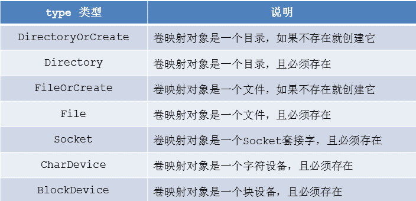

- [学习目标](#学习目标)
- [课堂笔记（命令）](#课堂笔记命令)
- [课堂笔记（文本）](#课堂笔记文本)
- [快捷键](#快捷键)
- [问题](#问题)
- [补充](#补充)
- [今日总结](#今日总结)
- [昨日复习](#昨日复习)

# 学习目标

持久卷

临时卷

# 课堂笔记（命令）

# 课堂笔记（文本）

## 持久卷

### 卷概述

> 容器化带来的问题？
>
> 容器中的文件在磁盘上时临时存放的，这给容器中运行的重要的应用程序带来一些问题
>
> + 问题1：容器崩溃或重启的时候，kubelet会以干净的状态重启容器，容器内的历史数据会丢失
> + 问题2：容器被删除时，容器内的数据也会被一起处理
> + 问题3：多个容器中有共享文件或目录的需求
>
> 卷是什么？
>
> + 卷是一个抽象化的存储设备
>
> 为什么要使用卷？
>
> + 卷可以解决容器崩溃或重启后历史数据丢失的问题
> + 卷可以解决容器或Pod被删除后数据持久保存的问题
> + 卷可以解决在多个容器内共享数据的问题
> + Pod可以同时使用任意数目的卷
>
> k8s支持的卷类型
>
> + 持久卷：持久卷是集群中的存储资源，就像他的名字一样，在里面存储的数据不会随着Pod的删除而丢失
> + 临时卷：有些应用程序需要额外的存储，但并不关心数据在重启后是否仍然可用。卷会遵从Pod的生命周期，与Pod以其创建和删除
> + 投射卷：它允许您将多个现有卷源映射到同一个目录。通过将这些不同类型的卷源组合成一个统一的卷，可以更方便地管理和使用这些资源
>
> 如何使用卷
>
> + 卷不能挂载到其他卷之上，也不能于其他卷有硬链接
> + Pod配置中的每个容器必须独立指定各个卷的挂载位置

### 持久卷概述

> + hostPath 卷的本质是使用本地设备，例如磁盘、分区、目录、Socket、CharDevice 和 BlockDevice 等等。
> + hostPath 卷的可用性取决于底层节点的可用性，如果节点变得不健康，那么 hostPath 卷也将不可被访问。 
> + hostPath 卷里面的数据不会随着 Pod 的结束而消失。 
> + 注意事项：配置相同的 Pod，可能在不同的节点上表现不同，因为不同节点上映射的文件内容不同

### hostPath卷

```shell
# 编写基础资源文件
[root@master 2.28]# vim web1.yaml
---
kind: Pod
apiVersion: v1
metadata: 
  name: web1
spec:
  volumes:  # 卷定义
  - name: logdata # 卷名名称
    hostPath: # 使用hostPath创建卷
      path: /var/weblog # 在节点上存放的路径
      type: DirectorOrCreate # 目录不存在就创建新的
  contaniers:
  - name: nginx
    image: myos:nginx
    volumeMounts: # mount 卷
    - name: logdata # 卷名字
      mountPath: /usr/local/nginx/logs # 容器内路径
# 测试验证
[root@master 2.28]#kubectl apply -f web.yaml
[root@master 2.28]#kubectl get pods -o wide
NAME   READY   STATUS    RESTARTS   AGE   IP               NODE        NOMINATED NODE   READINESS GATES
web1   1/1     Running   0          7s    10.244.243.215   node-0003   <none>           <none>
[root@master 2.28]#curl  10.244.243.215
Nginx is running !

# 删除Pod，日志数据将不会丢失，因为已经持久存储在宿主机上了
[root@master 2.28]# kubectl delete pod web1
# 进入node-0003查看
[root@master 2.28]#ssh 192.168.1.53
[root@node-0003 ~]# cd /var/weblog/
[root@node-0003 weblog]# ls
access.log  error.log  nginx.pid
[root@node-0003 weblog]# cat access.log
10.244.219.64 - - [28/Feb/2024:04:11:59 +0000] "GET / HTTP/1.1" 200 19 "-" "curl/7.61.1"
```

**type对应类型**



### NFS卷

#### 概述

> NFS 存储 
>
> + k8s 中允许将 nfs 存储以卷的方式挂载到你的 Pod 中 
> + 在删除 Pod 时，nfs 存储卷会被卸载（umount），而不是被删除。nfs 卷可以在不同节点的不同 Pod 之间共享数据。 
>
> NFS 卷的用途 
>
> + NFS 最大的功能就是在不同节点的不同 Pod 中共享读写数据。本地 NFS 的客户端可以透明地读写位于远端 NFS 服务器上的文件，就像访问本地文件一样。

#### 机器准备

| 名称 |    IP地址    |     配置     |
| :--: | :----------: | :----------: |
| nfs  | 192.168.1.10 | 1CPU，1G内存 |

#### 配置NFS服务

```shell
# 创建共享目录，并部署测试页面
[root@nfs ~]# mkdir -p /var/webroot
[root@nfs ~]# echo "nfs server" >/var/webroot/index.html

# 部署 NFS 服务
[root@nfs ~]# dnf install -y nfs-utils
[root@nfs ~]# vim /etc/exports
/var/webroot    192.168.1.0/24(rw,no_root_squash)# 取消root限制
[root@nfs ~]# systemctl enable --now nfs-server.service


# 所有 node 节点都要安装 nfs 软件包
[root@node ~]# dnf install -y nfs-utils
```

#### 编写资源文件

```shell
[root@master 2.28]# vim web.yaml 
---
kind: Pod
apiVersion: v1
metadata:
  name: web1
spec:
  volumes:
  - name: logdata
    hostPath:
      path: /var/weblog
      type: DirectoryOrCreate
  - name: webdata # 卷名称
    nfs: # NFS资源类型
      server: 192.168.1.10 # NFS服务器地址
      path: /var/webroot # NFS共享目录
  containers:
  - name: nginx
    image: myos:nginx
    volumeMounts:
    - name: logdata
      mountPath: /usr/local/nginx/logs
    - name: webdata # 映射的存储卷名称
      mountPath: /usr/local/nginx/html # 映射到容器中的路径

[root@master 2.28]# kubectl apply -f web.yaml 
pod/web1 created
[root@master 2.28]# kubectl get pods -o wide
NAME   READY   STATUS    RESTARTS   AGE   IP               NODE        NOMINATED NODE   READINESS GATES
web1   1/1     Running   0          7s    10.244.243.216   node-0003   <none>           <none>

# 验证访问
[root@master 2.28]# curl 10.244.243.216
nfs server
```

## PV/PVC

### 概述

> PV/PVC 是什么？
>
> + PV 的全称是 Persistent Volume，是持久卷 -PVC 的全称是 PersistentVolumeClaim，是持久卷声明 
>
>  PV/PVC 有什么用途？ 
>
> + 存储的管理是一个与计算实例的管理完全不同的问题。管理员希望提供一种通用的 API 来完成 Pod 对卷的部署管理与使用。
> + PV/PVC 就是为了满足这种需求而诞生的，PV/PVC 的引入使集群具备了存储的逻辑抽象能力。
>
> [访问官网获取支持的存储卷](https://kubernetes.io/zh-cn/docs/concepts/storage/persistent-volumes/)
>
> 如何使用 PV/PVC 
>
> + PV 是资源的提供者，根据集群的基础设施变化而变化，由 K8s 集群管理员配置 
> + PVC 是资源的使用者，根据业务服务的需求变化来配置，用户无需知道 PV 的技术细节，只需要声明你需要什么样的资源即可 
> + PVC 会根据用户声明的需求，自动找到 PV 完成绑定
>
> **Persistent Volume (PV)**：
>
> - PV 是集群管理员预先配置好的一种网络存储资源，它可以是集群内部或者外部的存储系统的一部分，比如 NFS、iSCSI、GlusterFS、AWS EBS、Google Cloud Persistent Disk 等。
> - PV 包含具体的存储实现细节，如存储容量、访问模式（ReadWriteOnce、ReadOnlyMany、ReadWriteMany）、存储类以及其他相关的属性。
> - PV 是集群级别的资源，其生命周期独立于任何单个 Pod，即使 Pod 销毁，PV 中的数据仍然存在，可供其他 Pod 使用。
>
> **Persistent Volume Claim (PVC)**：
>
> - PVC 是用户（通常是应用程序开发者）对持久化存储的请求，是一种声明式的需求。
> - 用户不需要关心 PV 的具体实现，只需通过 PVC 指定所需的存储容量和其他一些属性（如访问模式，资源）。
> - 当 PVC 被创建后，Kubernetes 的调度系统会自动寻找匹配的 PV 并将其绑定给 PVC，这个过程类似于分配资源。
> - 绑定之后，PVC 可以被挂载到 Pod 中，使得 Pod 中的容器能够访问到实际的存储空间。
>
> PV 是实际的存储资源，而 PVC 是对存储资源的请求或申领。通过这种分离，实现了存储资源的解耦和复用，同时也方便了集群管理员管理和用户使用存储资源。

### 持久卷

```shell
[root@master 2.28]# vim pv.yaml
---  
kind: PersistentVolume
apiVersion: v1
metadata:
  name: pv-local
spec:
  volumeMode: Filesystem # 提供资源的类型
  accessModes: # 存储卷能提供的访问模式
    - ReadWriteOnce # 卷支持的模式
  capacity: # 存储卷能提供的存储空间
    storage: 30Gi # 空间大小
  persistentVolumeReclaimPolicy: Retain  # 数据回收方式
  hostPath: # 存储配置
    path: /var/weblog
    type: DirectoryOrCreate    
---
kind: PersistentVolume
apiVersion: v1
metadata:
  name: pv-nfs
spec:
  volumeMode: Filesystem
  accessModes:
    - ReadWriteOnce
    - ReadOnlyMany
    - ReadWriteMany
  capacity:
    storage: 20Gi
  persistentVolumeReclaimPolicy: Retain
  nfs:
    server: 192.168.1.10
    path: /var/webroot

[root@master 2.28]# kubectl apply -f pv.yaml 
persistentvolume/pv-local created
persistentvolume/pv-nfs created
[root@master 2.28]# kubectl get persistentvolume
NAME       CAPACITY   ACCESS MODES   RECLAIM POLICY   STATUS      CLAIM   STORAGECLASS   REASON   AGE
pv-local   30Gi       RWO            Retain           Available                                   11s
pv-nfs     20Gi       RWO,ROX,RWX    Retain           Available                                   11s

```

### 持久卷声明

```shell
[root@master 2.28]# vim pvc.yaml
---
kind: PersistentVolumeClaim
apiVersion: v1
metadata:
  name: pvc1
spec:
  volumeMode: Filesystem
  accessModes:
    - ReadWriteOnce
  resources:
    requests:
      storage: 25Gi

---
kind: PersistentVolumeClaim
apiVersion: v1
metadata:
  name: pvc2
spec:
  volumeMode: Filesystem
  accessModes:
    - ReadWriteMany
  resources:
    requests:
      storage: 15Gi

[root@master 2.28]# kubectl apply -f pvc.yaml 
# pvc与pv已进行绑定
[root@master 2.28]# kubectl get persistentvolumeclaims 
NAME   STATUS   VOLUME     CAPACITY   ACCESS MODES   STORAGECLASS   AGE
pvc1   Bound    pv-local   30Gi       RWO                           8s
pvc2   Bound    pv-nfs     20Gi       RWO,ROX,RWX                   8s
```

### Pod挂载Pvc

```shell
[root@master 2.28]# vim web1.yaml
---
kind: Pod
apiVersion: v1
metadata:
  name: web1
spec:
  volumes:                   # 卷定义
  - name: logdata            # 卷名称
    persistentVolumeClaim:   # 通过PVC引用存储资源
      claimName: pvc1        # PVC名称
  - name: website            # 卷名称
    persistentVolumeClaim:   # 通过PVC引用存储资源
      claimName: pvc2        # PVC名称
  containers:
  - name: nginx
    image: myos:nginx
    volumeMounts:
    - name: logdata
      mountPath: /usr/local/nginx/logs
    - name: website
      mountPath: /usr/local/nginx/html
```

### 服务验证

```shell
[root@master 2.28~]# kubectl delete pods --all
pod "web1" deleted
[root@master 2.28~]# kubectl apply -f web1.yaml 
pod/web1 created
[root@master 2.28]# kubectl get pods -o wide
NAME   READY   STATUS    RESTARTS   AGE   IP               NODE        NOMINATED NODE   READINESS GATES
web1   1/1     Running   0          5s    10.244.240.157   node-0004   <none>           <none>
[root@master 2.28]# curl http://10.244.240.157 
nfs server

# 进入node4查询log
[root@node-0004 ~]# tail -f /var/weblog/access.log 
10.244.219.64 - - [28/Feb/2024:08:02:23 +0000] "GET / HTTP/1.1" 200 11 "-" "curl/7.61.1"
```

## 临时卷

### configMap

#### 概述

> configMap 是一种临时卷 
>
> + configMap 卷提供了向 Pod 注入配置数据的方法，允许你将配置文件与镜像分离，使容器化的应用具有可移植性。
> + configMap 在使用之前需要先创建它，configMap 不是用来保存大量数据的，在其中保存的数据不可超过 1 MiB。
>
> configMap 的用途：
>
> + 修改配置文件的参数，数据库的地址

#### 基础创建

```shell
# 语法
kubectl create configmap 名称 [选项/参数]

# 简单设置；设置时区
[root@master 2.28]# kubectl create configmap tz --from-literal=TZ='Asia/Shanghai'
[root@master 2.28]# kubectl get configmaps 
NAME               DATA   AGE
kube-root-ca.crt   1      7d2h
tz                 1      6s

# 通过资源清单文件创建
[root@master 2.28]# vim timezone.yaml
---
kind: ConfigMaps
apiVersion: v1
metadata:
  name: timezone
data:
  TZ: Asia/Shanghai
[root@master 2.28]# kubectl apply -f  timezone.yaml 
configmap/timezong created
[root@master 2.28]# kubectl get configmaps 
NAME               DATA   AGE
kube-root-ca.crt   1      7d2h
timezong           1      5s
tz                 1      87s
```

#### 修改系统时区

```shell
[root@master 2.28]# vim web1.yaml
---
kind: Pod
apiVersion: v1
metadata:
  name: web1
spec:
  volumes:
  - name: logdata
    persistentVolumeClaim:
      claimName: pvc1
  - name: website
    persistentVolumeClaim:
      claimName: pvc2
  containers:
  - name: nginx
    image: myos:nginx
    envFrom:              # 配置环境变量
    - configMapRef:       # 调用资源对象
        name: timezone    # 资源对象名称
    volumeMounts:
    - name: logdata
      mountPath: /usr/local/nginx/logs
    - name: website
      mountPath: /usr/local/nginx/html

[root@master 2.28]# kubectl delete pods web1
pod "web1" deleted
[root@master 2.28]# kubectl apply -f web1.yaml 
pod/web1 created
[root@master 2.28]# kubectl exec -it web1 -- date +%T
16:41:27
[root@master 2.28]# kubectl delete pod web1
pod "web1" deleted
```

#### nginx解析PHP

```shell
# 添加容器
# 在 Pod 中增加 php 容器，与 nginx 共享同一块网卡
[root@master 2.28]# vim web1.yaml
---
kind: Pod
apiVersion: v1
metadata:
  name: web1
spec:
  volumes:
  - name: logdata
    persistentVolumeClaim:
      claimName: pvc1
  - name: website
    persistentVolumeClaim:
      claimName: pvc2
  containers:
  - name: nginx
    image: myos:nginx
    envFrom:
    - configMapRef:
        name: timezone
    volumeMounts:
    - name: logdata
      mountPath: /usr/local/nginx/logs
    - name: website
      mountPath: /usr/local/nginx/html
  - name: php                            # 以下为新增加内容
    image: myos:php-fpm
    envFrom:                             # 不同容器需要单独配置时区
    - configMapRef:
        name: timezone
    volumeMounts:
    - name: website                      # 不同容器需要单独挂载NFS
      mountPath: /usr/local/nginx/html

[root@master 2.28]# kubectl apply -f web1.yaml 
pod/web1 created
[root@master 2.28]# kubectl get pods
NAME   READY   STATUS    RESTARTS   AGE
web1   2/2     Running   0          5s
[root@master 2.28]# kubectl get pods web1 -o go-template='{{range .spec.containers}}{{.name}}{{"\n"}}{{end}}'
nginx
php

# 将info.php页面拷贝到nfs中
[root@master 2.28]#vim info.php
<?php
	phpinfo();
?>	
[root@master 2.28]#rsync -av info.php 192.168.1.10:/var/webroot


# 创建ConfigMap
# 使用 nginx 配置文件创建 configMap
[root@master 2.28]# kubectl cp -c nginx web1:/usr/local/nginx/conf/nginx.conf nginx.conf
[root@master 2.28]# vim nginx.conf
        location ~ \.php$ {
            root            html;
            fastcgi_pass    127.0.0.1:9000;
            fastcgi_index   index.php;
            include         fastcgi.conf;
        }

# 使用命令创建 configMap
[root@master 2.28]# kubectl create configmap nginx-php --from-file=nginx.conf 
configmap/nginx-php created
# 或则使用资源文件创建
[root@master 2.28]# vim nginx-php.yaml
---
kind: ConfigMap
apiVersion: v1
metadata:
  name: nginx-php
data:
  nginx.conf: |
[root@master 2.28]#sed 's,^,    ,' nginx.conf >>   nginx-php.yaml
[root@master 2.28]# kubectl apply -f nginx-php.yaml 


# 挂载ConfigMap
[root@master 2.28]# vim web1.yaml
---
kind: Pod
apiVersion: v1
metadata:
  name: web1
spec:
  volumes:
  - name: logdata
    persistentVolumeClaim:
      claimName: pvc1
  - name: website
    persistentVolumeClaim:
      claimName: pvc2
  - name: nginx-php     # 卷名称
    configMap:          # 引用资源对象
      name: nginx-php   # 资源对象名称
  containers:
  - name: nginx
    image: myos:nginx
    envFrom:
    - configMapRef:
        name: timezone
    volumeMounts:
    - name: nginx-php                              # 卷名称
      subPath: nginx.conf                          # 键值（文件名称），若是文件挂载必须写上文件名(configmap定义的key)，不然将做为目录进行挂载
      mountPath: /usr/local/nginx/conf/nginx.conf  # 路径
    - name: logdata
      mountPath: /usr/local/nginx/logs
    - name: website
      mountPath: /usr/local/nginx/html
  - name: php
    image: myos:php-fpm
    envFrom:
    - configMapRef:
        name: timezone
    volumeMounts:
    - name: website
      mountPath: /usr/local/nginx/html


# 解析验证测试
[root@master 2.28]# kubectl delete pod web1 
pod "web1" deleted
[root@master 2.28]# kubectl apply -f web1.yaml 
pod/web1 created
[root@master 2.28]# kubectl get pods -o wide
NAME   READY   STATUS    RESTARTS   AGE   IP              NODE        NOMINATED NODE   READINESS GATES
web1   2/2     Running   0          15m   10.244.147.28   node-0002   <none>           <none>
# 有html页面内容代表测试成功
[root@master 2.28]# curl http://10.244.147.28/info.php
```

## secret卷

### 概述

> secret 是一种临时卷  
>
> + Secret 类似于 ConfigMap 但专门用于保存机密数据 
>
> + 在设置 Secret.data 字段时，所有键值都必须是经过 base64 编码的字符串 
>
>  secret 的用途： 
>
> + 配置一些需要加密的环境变量或文件（例如：https 证书） 
>
> + 访问需要认证登录的私有镜像仓库（例如：harbor 私有仓库）

### 语法格式

```bash
# 创建secret 语法格式
kubectl create secret 子类型 名称 [选项/参数]
# 子类型-通用型
kubectl create secret generic 名称 [选项/参数]
# 用于认证登陆私有仓库的子类型
kubectl create secret docker-registry 名称 [选项/参数]
# 用于创建TLS证书的子类型
kubectl create secret tls 名称 [选项/参数]
```

### 配置加密配置项

```shell
# configmap的配置项为铭文
[root@master 2.28]# kubectl get configmaps tz -o yaml
apiVersion: v1
data:
  TZ: Asia/Shanghai  # 配置内容
kind: ConfigMap
metadata:
  creationTimestamp: "2024-02-28T08:36:42Z"
  name: tz
  namespace: default
  resourceVersion: "336595"
  uid: f68da2dd-d62a-4e9f-9c9a-846616d8dbe7
# 通过secret进行加密
[root@master 2.28]# kubectl create secret generic tz --from-literal 'TZ=Asia/Shanghai'
[root@master 2.28]# kubectl get secrets tz -o yaml
apiVersion: v1
data:
  TZ: QXNpYS9TaGFuZ2hhaQ== # 内容已经加密；使用配置项时k8s内部会自动进行解密
kind: Secret
metadata:
  creationTimestamp: "2024-02-28T11:17:49Z"
  name: tz
  namespace: default
  resourceVersion: "354594"
  uid: 5ed62d49-eaf8-4291-9a1e-794cbc364c04
type: Opaque
```

### 配置登陆密钥

```shell
[root@master 2.28]# kubectl create secret docker-registry harbor-
auth --docker-server "harbor:443" --docker-username coke --docker-password "Aa123456"        
# --docker-server 仓库主机端口号
# --docker-username  用户名
# --docker-password 密码

# 查询添加信息
[root@master 2.28]# kubectl get secret harbor-auth -o yaml
apiVersion: v1
data:
  .dockerconfigjson: eyJhdXRocyI6eyJoYXJib3I6NDQzIjp7InVzZXJuYW1lIjoiY29rZSIsInBhc3N3b3JkIjoiQWExMjM0NTYiLCJhdXRoIjoiWTI5clpUcEJZVEV5TXpRMU5nPT0ifX19
kind: Secret
metadata:
  creationTimestamp: "2024-02-28T11:45:18Z"
  name: harbor-auth
  namespace: default
  resourceVersion: "357591"
  uid: 925a58e1-80bf-4bd4-a4a1-a775acbbc1aa
type: kubernetes.io/dockerconfigjson
```

### 认证私有仓库

```shell
# 编写资源对象文件
[root@master 2.28]# vim web2.yaml  
---
kind: Pod
apiVersion: v1
metadata: 
  name: apache
spec:
  imagePullSecrets:
  - name: harbor-auth
  containers:
  - name: httpd
    image: harbor:443/myimg/httpd:latest # 使用myimg(私有仓库)仓库的httpd镜像
    envFrom:
    - secretRef:
        name: tz
 [root@master 2.28]# kubectl apply -f web2.yaml 
 [root@master 2.28]# kubectl describe pods apache
 ....
 Events:
  Type    Reason     Age   From               Message
  ----    ------     ----  ----               -------
  Normal  Scheduled  12s   default-scheduler  Successfully assigned default/apache to node-0004
  Normal  Pulling    12s   kubelet            Pulling image "harbor:443/myimg/httpd:latest"
  Normal  Pulled     12s   kubelet            Successfully pulled image "harbor:443/myimg/httpd:latest" in 60.743863ms (60.749608ms including waiting)
  Normal  Created    12s   kubelet            Created container httpd
  Normal  Started    12s   kubelet            Started container httpd
[root@master 2.28]# kubectl get pods
NAME     READY   STATUS    RESTARTS   AGE
apache   1/1     Running   0          44s 

```

## emptyDir卷

### 概述

> emptyDir 临时卷 
>
> + emptyDir 的本质是一个简单的空目录 
> +  emptyDir 可以提供临时空间，同一个 Pod 中容器也可以用来共享数据。案例：缓存服务器、数据统计分析、排序等。 
> + emptyDir 随 Pod 创建而创建，Pod 在该节点上运行期间，一直存在。当 Pod 被从节点上删除时，临时卷中的数据也会被永久删除。 
> + 重启 Pod 中的容器不会造成 emptyDir 数据的丢失。
>
> pod内的容器发生重启不会造成emptyDir里面数据的丢失，但是当pod被重启后，emptyDir数据会丢失，也就是说emptyDir与pod的生命周期是一致的

### 临时空间

```shell
[root@master 2.28]# vim web2.yaml
---
kind: Pod
apiVersion: v1
metadata:
  name: web2
spec:
  imagePullSecrets:
  - name: harbor-auth
  volumes:               # 卷配置
  - name: cache          # 卷名称
    emptyDir: {}         # 资源类型
  containers:
  - name: apache
    image: harbor:443/myimg/httpd:latest
    volumeMounts:            # 挂载卷
    - name: cache            # 卷名称
      mountPath: /var/cache  # 路径

[root@master 2.28]# kubectl delete pod web2 
pod "web2" deleted
[root@master 2.28]# kubectl apply -f web2.yaml 
pod/web2 created
[root@master 2.28]# kubectl exec -it web2 -- bash
[root@web2 html]# mount -l |grep cache
/dev/vda1 on /var/cache type xfs (rw,relatime,attr2)
[root@web2 html]# mkdir /var/cache/123
[root@apache html]# ls -ld /var/cache/123/
drwxr-xr-x 2 root root 4096 Feb 28 20:08 /var/cache/123/


# 测试；开启两个终端一个进入宿主机将该服务kill，服务修复后文件还存在，一个-w实时查看
[root@master 2.28]# kubectl get pods  -o wide
NAME     READY   STATUS    RESTARTS      AGE     IP               NODE        NOMINATED NODE   READINESS GATES
apache   1/1     Running   2 (26s ago)   8m44s   10.244.153.155   node-0005   <none>           <none>
[root@master 2.28]#ssh 192.168.1.55
[root@node-0005 ~]# ps -ef | grep httpd
[root@node-0005 ~]#kill -9 341891

[root@master 2.28]# kubectl get pods -w
NAME     READY   STATUS    RESTARTS      AGE
apache   1/1     Running   1 (86s ago)   8m3s
apache   0/1     Error     1 (102s ago)   8m19s
apache   1/1     Running   1 (132s ago)   8m49s

[root@master 2.28]# kubectl exec -it web2 -- bash
[root@apache html]# ls -ld /var/cache/123/
drwxr-xr-x 2 root root 4096 Feb 28 20:08 /var/cache/123/
```


# 快捷键


# 问题


# 补充


# 今日总结


# 昨日复习