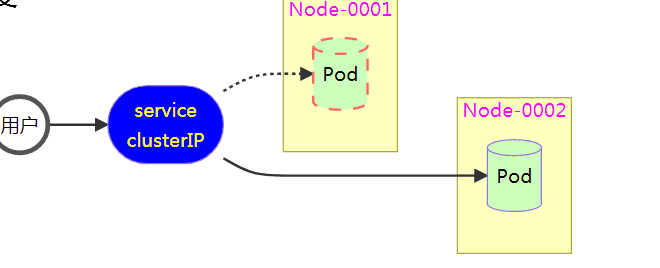
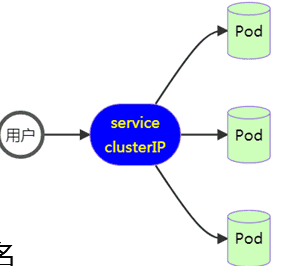
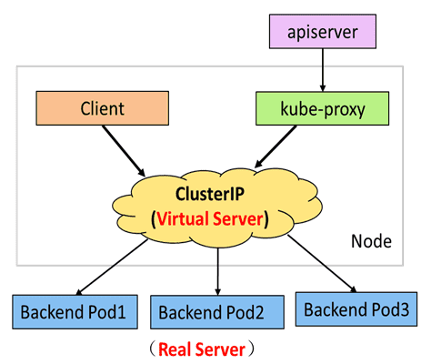
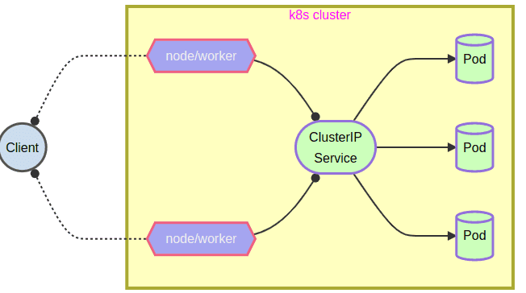
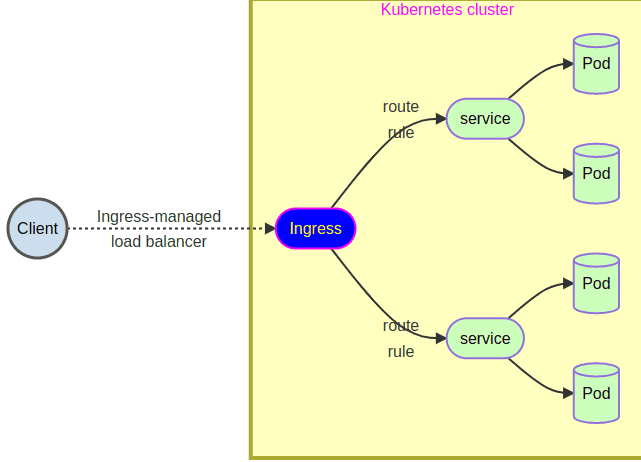

- [学习目标](#学习目标)
- [课堂笔记（命令）](#课堂笔记命令)
- [课堂笔记（文本）](#课堂笔记文本)
  - [服务管理](#服务管理)
    - [服务原理](#服务原理)
    - [服务的功能](#服务的功能)
      - [自动感知](#自动感知)
      - [负载均衡](#负载均衡)
      - [服务的自动发现](#服务的自动发现)
    - [clusterIP服务](#clusterip服务)
      - [创建服务](#创建服务)
      - [服务自动发现](#服务自动发现)
      - [创建后端应用](#创建后端应用)
      - [服务自动感知](#服务自动感知)
      - [创建多个后端应用](#创建多个后端应用)
      - [服务负载均衡](#服务负载均衡)
      - [服务的工作原理](#服务的工作原理)
      - [固定服务IP](#固定服务ip)
      - [端口别名](#端口别名)
      - [服务排错](#服务排错)
    - [服务类型](#服务类型)
    - [nodePort](#nodeport)
      - [对外发布服务](#对外发布服务)
      - [测试验证](#测试验证)
    - [Ingress](#ingress)
      - [安装控制器](#安装控制器)
      - [验证后端服务](#验证后端服务)
      - [对外发布服务](#对外发布服务-1)
  - [web管理插件](#web管理插件)
    - [概述](#概述)
    - [安装Dashboard](#安装dashboard)
    - [发布服务](#发布服务)
  - [服务账号与权限](#服务账号与权限)
    - [用户认证](#用户认证)
    - [创建服务账号](#创建服务账号)
    - [获取用户Token](#获取用户token)
    - [角色与鉴权](#角色与鉴权)
      - [普通角色](#普通角色)
      - [集群管理员](#集群管理员)
- [快捷键](#快捷键)
- [问题](#问题)
- [补充](#补充)
- [今日总结](#今日总结)
- [昨日复习](#昨日复习)


# 学习目标

k8s服务管理

Ingress安装与策略配置

Dashboard安装

RBAC权限管理

# 课堂笔记（命令）

# 课堂笔记（文本）

## 服务管理

### 服务原理

> 容器化带来的问题
>
> - 自动调度：在 Pod 创建之前，用户无法预知 Pod 所在的节点，以及 Pod 的 IP 地址
> - 一个已经存在的 Pod 在运行过程中，如果出现故障，Pod 也会在新的节点使用新的 IP 进行部署
> - 应用程序访问服务的时候，地址也不能经常变换
> - 多个相同的 Pod 如何访问他们上面的服务
>
> • Service 就是解决这些问题的方法

### 服务的功能

#### 自动感知

> 服务会创建一个 clusterIP 这个地址对应资源地址，不管 Pod 如何变化，服务总能找到对应的 Pod, 且 cluster IP 保持不变



#### 负载均衡

> 服务的负载均衡 
>
> + 如果服务后端对应多个 Pod，则会通过 IPTables/LVS 规则将访问的请求最终映射到 Pod 的容器内部，自动在多个容器间实现负载均衡



#### 服务的自动发现

> + 服务创建时会自动在内部 DNS 上注册域名
> + 域名：\<服务名称\>.\<名称空间\>.svc.cluster.local

### clusterIP服务

> 默认的ServiceType，通过集群内部IP暴露服务，选择该值时服务只能在集群内部访问

#### 创建服务

```shell
# 资源对象模板
[root@master 2.29]# kubectl create service clusterip mysvc  --tcp
=80:80 --dry-run=client -o yaml
[root@master 2.29]# vim mysvc.yaml
---
kind: Service
apiVersion: v1
metadata:
  name: mysvc
spec:
  type: ClusterIP  # 服务类型
  selector: 
    app: web # Pod标签
  ports: # 端口
  - protocol: TCP # 协议
    port: 80 # 监听的端口
    targetPort: 80 # 后端服务端口
# 创建服务；服务创建成功后，域名已经自动注册(mysvc.default.svc.cluster.loca)    
[root@master 2.29]# kubectl apply -f service.yaml 
service/mysvc created

[root@master 2.29]# kubectl get service
NAME         TYPE        CLUSTER-IP       EXTERNAL-IP   PORT(S)   AGE
kubernetes   ClusterIP   10.245.0.1       <none>        443/TCP   7d19h
mysvc        ClusterIP   10.245.205.199   <none>        80/TCP    5s
```

#### 服务自动发现

```shell
# 安装工具包
[root@master 2.29]#dnf -y install bind-utils
# 查看DNS服务地址
[root@master 2.29]# kubectl -n kube-system  get service kube-dns 
NAME       TYPE        CLUSTER-IP    EXTERNAL-IP   PORT(S)                  AGE
kube-dns   ClusterIP   10.245.0.10   <none>        53/UDP,53/TCP,9153/TCP   7d19h

# 域名解析测试
[root@master 2.29]# host mysvc.default.svc.cluster.local. 10.245.0.10
Using domain server:
Name: 10.245.0.10
Address: 10.245.0.10#53
Aliases: 

mysvc.default.svc.cluster.local has address 10.245.205.199
```

#### 创建后端应用

```shell
[root@master 2.29]# vim myweb.yaml 
---  
kind: Pod
apiVersion: v1
metadata:
  name: web1
spec:
  containers:
  - name: nginx
    image: myos:nginx
[root@master 2.29]# kubectl apply -f myweb.yaml
[root@master 2.29]# kubectl get pods -o wide
NAME   READY   STATUS    RESTARTS   AGE   IP               NODE        NOMINATED NODE   READINESS GATES
web1   1/1     Running   0          5s    10.244.153.157   node-0005   <none>           <none>
[root@master 2.29]#curl 10.244.153.157
Nginx is running !
```

#### 服务自动感知

```shell
# 未打上服务的标签将不能正常感知
[root@master 2.29]#curl 10.245.205.199
curl: (7) Failed to connect to 10.245.205.199 port 80: Connection refused

# 方式一：给pod打上服务标签；进行自动感知
[root@master 2.29]# kubectl label pod web1 app=mysvc
[root@master 2.29]# curl 10.245.205.199
Nginx is running !

# 方式二：在创建pod时指定标签
[root@master 2.29]# vim myweb.yaml 
---  
kind: Pod
apiVersion: v1
metadata:
  name: web1
  labels:
    app: mysvc  # 服务靠标签寻找后端服务；这里标签需要与注册的服务的标签一致，才能正常感知到
spec:
  containers:
  - name: nginx
    image: myos:nginx
[root@master 2.29]# kubectl apply -f myweb.yaml 
[root@master 2.29]# curl 10.245.205.199
Nginx is running !
```

#### 创建多个后端应用

```shell
[root@master 2.29]# sed 's,web1,web2,' myweb.yaml |kubectl apply -f -
pod/web2 created
[root@master 2.29]# sed 's,web1,web3,' myweb.yaml |kubectl apply -f -
pod/web3 created
```

#### 服务负载均衡

```shell
[root@master 2.29]# curl -s 10.245.205.199/info.php | grep php_host
php_host:       web1
[root@master 2.29]# curl -s 10.245.205.199/info.php | grep php_host
php_host:       web3
[root@master 2.29]# curl -s 10.245.205.199/info.php | grep php_host
php_host:       web2

[root@master 2.29]# kubectl delete pods --all
```

#### 服务的工作原理

> 服务的工作原理
>
> + kube-proxy 是在所有节点上运行的代理。可以实现简单的数据转发，可以设置更新 IPTables/LVS 规则，在服务创建时，还提供服务地址 DNS 自动注册与服务发现功能



#### 固定服务IP

> 编写资源配置文件设置服务的固定IP地址

```shell
[root@master 2.29]# kubectl delete services mysvc
service "mysvc" deleted
[root@master 2.29]# vim service.yaml 
apiVersion: v1
kind: Service
metadata:
  name: mysvc
spec:
  ports:
  - name: 80-80
    port: 80
    protocol: TCP
    targetPort: 80
  selector:
    app: mysvc
  type: ClusterIP
  clusterIP: 10.245.1.99  # 固定IP
[root@master 2.29]# kubectl apply -f service.yaml 
service/mysvc created
[root@master 2.29]# kubectl get service mysvc -o wide
NAME    TYPE        CLUSTER-IP    EXTERNAL-IP   PORT(S)   AGE   SELECTOR
mysvc   ClusterIP   10.245.1.99   <none>        80/TCP    14s   app=mysvc
```

#### 端口别名

> 在Kubernetes服务定义中，可以为同一个后端Pod暴露的服务端口指定多个别名端口。这意味着客户端可以通过不同的端口号访问同一服务。

```shell
[root@master 2.29]# vim service.yaml 

apiVersion: v1
kind: Service
metadata:
  name: mysvc
spec:
  ports:
  - name: 80-80
    port: 80
    protocol: TCP
    targetPort: myhttp # 端口别名
  selector:
    app: mysvc
  type: ClusterIP
  clusterIP: 10.245.1.99
[root@master 2.29]# kubectl delete services mysvc  
[root@master 2.29]# kubectl apply -f service.yaml
# 配置Pod
[root@master 2.29]# vim myweb.yaml 
--- 
kind: Pod
apiVersion: v1
metadata:
  name: web1
  labels:
    app: mysvc
spec:
  containers:
  - name: apache
    image: myos:httpd
    ports:  # 配置端口规范
    - name: myhttp   # 端口别名
      protocol: TCP # 协议
      containerPort: 80 # 容器服务真实端口
[root@master 2.29]# kubectl apply -f myweb.yaml
pod/web1 created
[root@master 2.29]# curl http://10.245.1.99
Welcome to The Apache.      
```

#### 服务排错

> 服务的排错从以下三个点进行排错：
>
> + clusterIP
> + 标签
> + 端口别名

### 服务类型

>发布服务
>
>+  ClusterIP 服务可以解决集群内应用互访的问题，但外部的应用无法访问集群内的资源，某些应用需要访问集群内的资源，我们就需要对外发布服务。
>
> 服务类型 
>
>+ ClusterIP：默认类型，可以实现 Pod 的自动感知与负载均衡，是最核心的服务类型，但 ClusterIP 不能对外发布服务，如果想对外发布服务可以使用 NodePort 或 Ingress

### nodePort

> 使用基于端口映射(默认值：30000-32767)的方式对外发布服务，可以发布任意服务(基于四层)



#### 对外发布服务

```shell
# 配置nodeport资源文件
[root@master 2.29]# cp service.yaml service1.yaml 
[root@master 2.29]# vim service1.yaml
---
kind: Service
apiVersion: v1
metadata:
  name: mysvc1
spec:
  type: NodePort            # 服务类型
  selector:
    app: mysvc  
  ports:
  - protocol: TCP
    port: 80
    nodePort: 32409         # 映射端口号;不指定系统将默认从30000-32767之间随机一个
    targetPort: myhttp
[root@master 2.29]# kubectl apply -f service1.yaml    
[root@master 2.29]# kubectl get service mysvc
NAME    TYPE       CLUSTER-IP    EXTERNAL-IP   PORT(S)        AGE
mysvc   NodePort   10.245.1.99   <none>        80:32409/TCP   48m  
```

#### 测试验证

```shell
[root@master 2.29]# vim myweb.yaml 
---
kind: Pod
apiVersion: v1
metadata:
  name: web1
  labels:
    app: mysvc # 同服务标签一致；同server1的标签一致
spec: 
  containers:
  - name: apache
    image: myos:httpd
    ports:
    - name: myhttp 
      protocol: TCP
      containerPort: 80
[root@master 2.29]# kubectl apply -f myweb.yaml 
# 测试访问；nodeport会在所有节点映射端口，可以访问任意节点
[root@master 2.29]# curl 192.168.1.53:32409
Welcome to The Apache.
[root@master 2.29]# curl 192.168.1.51:32409
Welcome to The Apache.
[root@master 2.29]# curl 192.168.1.55:32409
Welcome to The Apache.
```

### Ingress

> Ingress是什么？
>
> + ingress控制器(一般由nginx和haproxy构成)，用来发布http，https服务(七层)
> + Ingress公开从集群外部到集群内部服务的http和https路由，流量由ingress资源上定义的规则控制



#### 安装控制器

```shell
[root@master plugins]# cd ingress/
[root@master ingress]# ls
deploy.yaml  example.yaml  ingress.tar.xz
# 上传相关镜像到harbor仓库
[root@master ingress]# docker load -i ingress.tar.xz 
[root@master ingress]# docker images|while read i t _;do
>     [[ "${t}" == "TAG" ]] && continue
>     [[ "${i}" =~ ^"harbor:443/".+ ]] && continue
>     docker tag ${i}:${t} harbor:443/plugins/${i##*/}:${t}
>     docker push harbor:443/plugins/${i##*/}:${t}
>     docker rmi ${i}:${t} harbor:443/plugins/${i##*/}:${t}
> done
[root@master ingress]# ls
deploy.yaml  example.yaml  ingress.tar.xz
[root@master ingress]# sed -ri 's,^(\s*image: )(.*/)?(.+)@.*,\1harbor:443/plugins/\3,' deploy.yaml
[root@master ingress]# kubectl get namespaces 
NAME              STATUS   AGE
default           Active   8d
kube-node-lease   Active   8d
kube-public       Active   8d
kube-system       Active   8d
myprod            Active   45h
mytest            Active   45h
[root@master ingress]# kubectl apply -f deploy.yaml 
NAME              STATUS   AGE
default           Active   8d
ingress-nginx     Active   5s
kube-node-lease   Active   8d
kube-public       Active   8d
kube-system       Active   8d
myprod            Active   45h
mytest            Active   45h
 # 通过标签指定在那台机器上发布应用
[root@master ingress]# kubectl label nodes node-0001 ingress-ready="true"
[root@master ingress]# kubectl get -n ingress-nginx pods
NAME                                       READY   STATUS      RESTARTS   AGE
ingress-nginx-admission-create-chvcf       0/1     Completed   0          82s
ingress-nginx-admission-patch-gv8bc        0/1     Completed   0          82s
ingress-nginx-controller-bbbb5f675-cq8x6   1/1     Running     0          82s
```

#### 验证后端服务

```shell
[root@master 2.29]# kubectl get pods,services
NAME       READY   STATUS    RESTARTS   AGE
pod/web1   1/1     Running   0          3h2m

NAME                 TYPE        CLUSTER-IP    EXTERNAL-IP   PORT(S)   AGE
service/kubernetes   ClusterIP   10.245.0.1    <none>        443/TCP   8d
service/mysvc        ClusterIP   10.245.1.99   <none>        80/TCP    3h15m

[root@master 2.29]# curl 10.245.1.99
Welcome to The Apache.
```

#### 对外发布服务

```shell
# 使用create生成资源对象模板
[root@master 2.29]#  kubectl create ingress mying --class=nginx --rule=nsd.tedu.cn/*=mysvc:80 --dry-run=client -o yaml
# 进行修改
[root@master 2.29]# vim mying.yaml
---            
kind: Ingress  
apiVersion: networking.k8s.io/v1
metadata:      
  name: mying  
spec:          
  ingressClassName: nginx # 使用类名称
  rules:        # ingress规则定义
  - host: coke.cn # 域名定义
    http:      # 协议
      paths:   # 访问的路径定义
      - path: / # 访问根路径
        pathType: Prefix  # 路径类型；Prefix：宽松；Exact：严格
        backend: # 后端服务
          service:    # 服务声明
            name: mysvc # 服务名称
            port: 
              number: 80
# 生效ingress规则              
[root@master 2.29]# kubectl apply -f mying.yaml  
# 查看生效信息(等待1min)
[root@master 2.29]# kubectl get ingress mying 
NAME    CLASS   HOSTS     ADDRESS        PORTS   AGE
mying   nginx   coke.cn   192.168.1.51   80      29s
# 返回跳板机进行测试访问；由于是基于七层代理转发，需要用IP或域名来进行转发，添加一个请求头主机信息来进行访问
[root@ecs-proxy ~]# curl -H "host:coke.cn" http://192.168.1.51
Welcome to The Apache.
```

## web管理插件

### 概述

> + Dashboard是基于网页Kubernetes用户界面
> + 同时展示了k8s集群中的资源状态信息和所有报错信息
> + 可以使用Dashboard将应哟该部署到集群中，也可以对容器应用排错，还能管理集群资源

### 安装Dashboard

```shell
[root@master ~]# cd plugins/dashboard
[root@master dashboard]# docker load -i dashboard.tar.xz
[root@master dashboard]# docker images|while read i t _;do
    [[ "${t}" == "TAG" ]] && continue
    [[ "${i}" =~ ^"harbor:443/".+ ]] && continue
    docker tag ${i}:${t} harbor:443/plugins/${i##*/}:${t}
    docker push harbor:443/plugins/${i##*/}:${t}
    docker rmi ${i}:${t} harbor:443/plugins/${i##*/}:${t}
done
[root@master dashboard]# sed -ri 's,^(\s*image: )(.*/)?(.+),\1harbor:443/plugins/\3,' recommended.yaml
193:    image: harbor:443/plugins/dashboard:v2.7.0
278:    image: harbor:443/plugins/metrics-scraper:v1.0.8
[root@master dashboard]# kubectl apply -f recommended.yaml
[root@master dashboard]# kubectl -n kubernetes-dashboard get pods
NAME                                         READY   STATUS    RESTARTS
dashboard-metrics-scraper-66f6f56b59-b42ng   1/1     Running   0
kubernetes-dashboard-65ff57f4cf-lwtsk        1/1     Running   0
```

### 发布服务

```shell
# 查看服务状态；由于是clusterIP，外部服务将不能进行访问，将其改为nodeport
[root@master dashboard]# kubectl -n kubernetes-dashboard get service
NAME                        TYPE        CLUSTER-IP       PORT(S)
dashboard-metrics-scraper   ClusterIP   10.245.205.236   8000/TCP
kubernetes-dashboard        ClusterIP   10.245.215.40    443/TCP
# 获取服务资源对象文件
[root@master dashboard]# sed -n '30,45p' recommended.yaml >dashboard-svc.yaml
[root@master dashboard]# vim dashboard-svc.yaml
---
kind: Service
apiVersion: v1
metadata:
  labels:
    k8s-app: kubernetes-dashboard
  name: kubernetes-dashboard
  namespace: kubernetes-dashboard
spec:
  type: NodePort
  ports:
    - port: 443
      nodePort: 30443
      targetPort: 8443
  selector:
    k8s-app: kubernetes-dashboard

[root@master dashboard]# kubectl apply -f dashboard-svc.yaml 
service/kubernetes-dashboard configured
[root@master dashboard]# kubectl -n kubernetes-dashboard get service
NAME                        TYPE        CLUSTER-IP       PORT(S)
dashboard-metrics-scraper   ClusterIP   10.245.205.236   8000/TCP
kubernetes-dashboard        NodePort    10.245.215.40    443:30443/TCP
# 使用华为云的ELB进行服务发布，任意节点30443端口即可
# 通过浏览器访问登陆页面；需要登陆Token，下面将进行Token获取
```

## 服务账号与权限

### 用户认证

> + 所有 Kubernetes 集群都有两类用户：由 Kubernetes 管理的服务账号和普通用户。
> + 普通用户是以证书或秘钥形式签发，主要用途是认证和鉴权，集群中并不包含用来代表普通用户账号的对象，普通用户的信息无法调用和查询。
> + 服务账号是 Kubernetes API 所管理的用户。它们被绑定到特定的名字空间，与一组 Secret 凭据相关联，供 Pod 调用以获得相应的授权。

### 创建服务账号

```shell
# 资源对象文件
[root@master dashboard]# kubectl create serviceaccount -n kubernetes-dashboard kube-admin --dry-run=client -o yaml > admin-user.yaml
[root@master dashboard]# vim admin-user.yaml
---
kind: ServiceAccount
apiVersion: v1
metadata:
  name: kube-admin
  namespace: kubernetes-dashboard
[root@master dashboard]# kubectl apply -f admin-user.yaml
[root@master dashboard]# kubectl -n kubernetes-dashboard get serviceaccounts 
NAME                   SECRETS   AGE
default                0         33m
kube-admin             0         118s
kubernetes-dashboard   0         33m
```

### 获取用户Token

```shell
[root@master dashboard]# kubectl -n kubernetes-dashboard create token kube-admin 
eyJhbGciOiJSUzI1NiIsImtpZCI6ImNQWWJ2azNILTliYmZxY0RteElWS1dNNm9YcjhPVXFkblpQMEpON3lOdzQifQ......
.....
```

### 角色与鉴权

> 如果想访问和管理 kubernetes 集群，就要对身份以及权限做验证，kubernetes 支持的鉴权模块有 Node、RBAC、ABAC、Webhook API 
>
> + Node：一种特殊用途的鉴权模式，专门对 kubelet 发出的请求进行鉴权。 
> + RBAC：是一种基于组织中用户的角色来控制资源使用的方法 
> + ABAC：基于属性的访问控制，是一种通过将用户属性与权限组合在一起像用户授权的方法。 
> + Webhook：是一个 HTTP 回调。

| 资源对象               | 描述                                        | 作用域       |
| ---------------------- | ------------------------------------------- | ------------ |
| **ServiceAccount**     | 服务账号，为 Pod 中运行的进程提供了一个身份 | 单一名称空间 |
| **Role**               | 角色，包含一组代表相关权限的规则            | 单一名称空间 |
| **ClusterRole**        | 角色，包含一组代表相关权限的规则            | 全集群       |
| **RoleBinding**        | 将权限赋予用户，Role、ClusterRole 均可使用  | 单一名称空间 |
| **ClusterRoleBinding** | 将权限赋予用户，只可以使用 ClusterRole      | 全集群       |

资源对象权限

|  create  |  delete  | deletecollection |     get      |     list     |  patch   |  update  |  watch   |
| :------: | :------: | :--------------: | :----------: | :----------: | :------: | :------: | :------: |
| **创建** | **删除** |   **删除集合**   | **获取属性** | **获取列表** | **补丁** | **更新** | **监控** |

#### 普通角色

```shell
# 查询当前集群使用的鉴权方法
[root@master dashboard]# kubectl cluster-info dump | grep authorization-mode
                            "--authorization-mode=Node,RBAC",
# 查询资源对象的权限信息
[root@master dashboard]# kubectl api-resources -o wide | grep bindings

# 生成资源对象模板；创建角色
[root@master dashboard]# kubectl -n default create role myrole --resource=pods --verb=get,list --dry-run=client -o yaml
# 授予权限
[root@master ~]# kubectl -n default create rolebinding kube-admin-role --role=myrole --serviceaccount=kubernetes-dashboard:kube-admin --dry-run=client -o yaml

[root@master dashboard]# vim myrole.yaml
---
kind: Role
apiVersion: rbac.authorization.k8s.io/v1
metadata:
  name: myrole  # 角色名称
  namespace: default
rules: # 规则
- apiGroups: # 资源对象所属组信息
  - "" # 分组信息
  resources: # 设置权限的资源对象
  - pods # 授权资源对象名称
  verbs: # 权限设置
  - get # 权限
  - list  # 权限

---
kind: RoleBinding
apiVersion: rbac.authorization.k8s.io/v1
metadata:
  name: kube-admin-role
  namespace: default
roleRef:
  apiGroup: rbac.authorization.k8s.io
  kind: Role
  name: myrole
subjects:
- kind: ServiceAccount
  name: kube-admin
  namespace: kubernetes-dashboard
# 在浏览器查看信息  
# 收回权限
[root@master ~]# kubectl delete -f myrole.yaml 
role.rbac.authorization.k8s.io "myrole" deleted
rolebinding.rbac.authorization.k8s.io "kube-admin-role" deleted
```

#### 集群管理员

```shell
# 资源对象模板
[root@master ~]# kubectl create clusterrolebinding kube-admin-role --clusterrole=cluster-admin --serviceaccount=kubernetes-dashboard:kube-admin --dry-run=client -o yaml
[root@master ~]# vim admin-user.yaml 
---
kind: ServiceAccount
apiVersion: v1
metadata:
  name: kube-admin
  namespace: kubernetes-dashboard

---
kind: ClusterRoleBinding
apiVersion: rbac.authorization.k8s.io/v1
metadata:
  name: kube-admin-role
roleRef:
  apiGroup: rbac.authorization.k8s.io
  kind: ClusterRole
  name: cluster-admin
subjects:
- kind: ServiceAccount
  name: kube-admin
  namespace: kubernetes-dashboard

[root@master ~]# kubectl apply -f admin-user.yaml 
serviceaccount/kube-admin unchanged
clusterrolebinding.rbac.authorization.k8s.io/kube-admin-role created
# 在浏览器查看
```


# 快捷键


# 问题


# 补充


# 今日总结


# 昨日复习