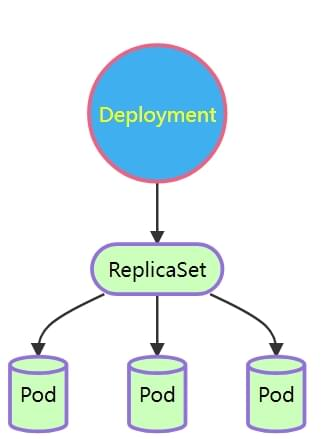
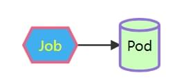
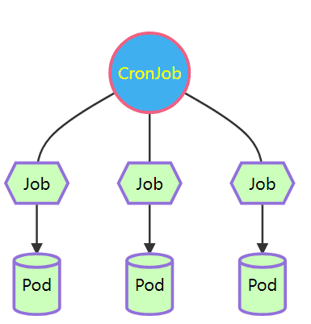
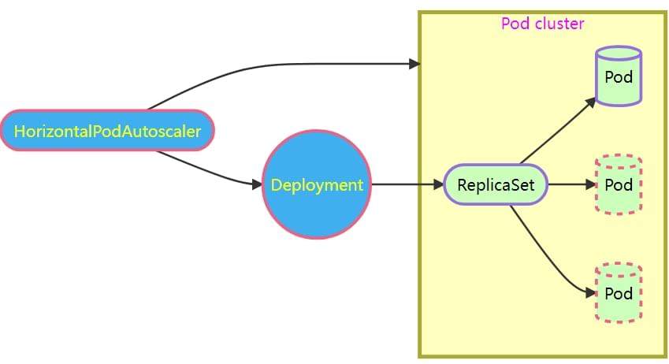

- [学习目标](#学习目标)
- [课堂笔记（命令）](#课堂笔记命令)
- [课堂笔记（文本）](#课堂笔记文本)
  - [Deployment控制器](#deployment控制器)
    - [概述](#概述)
    - [示例图](#示例图)
    - [创建控制器](#创建控制器)
    - [ClusterIP服务](#clusterip服务)
    - [Pod维护管理](#pod维护管理)
    - [集群扩缩容](#集群扩缩容)
    - [历史版本信息](#历史版本信息)
    - [滚动更新](#滚动更新)
    - [版本回滚](#版本回滚)
    - [删除控制器](#删除控制器)
  - [DaemonSet](#daemonset)
    - [概述](#概述-1)
    - [图例](#图例)
    - [资源对象实例](#资源对象实例)
    - [污点干扰](#污点干扰)
    - [删除控制器](#删除控制器-1)
  - [Job控制器](#job控制器)
    - [概述](#概述-2)
    - [Job示例图](#job示例图)
    - [资源对象实例](#资源对象实例-1)
    - [删除任务](#删除任务)
  - [CronJob](#cronjob)
    - [概述](#概述-3)
    - [CronJob示例图](#cronjob示例图)
    - [资源对象实例](#资源对象实例-2)
    - [删除任务](#删除任务-1)
  - [StatefulSet控制器](#statefulset控制器)
    - [概述](#概述-4)
    - [STF示例图](#stf示例图)
    - [创建headless服务](#创建headless服务)
    - [创建资源对象](#创建资源对象)
    - [删除控制器](#删除控制器-2)
  - [弹性云服务](#弹性云服务)
    - [概述](#概述-5)
    - [HPA示例图](#hpa示例图)
    - [创建后端服务](#创建后端服务)
    - [创建HPA控制器](#创建hpa控制器)
    - [验证测试](#验证测试)
- [快捷键](#快捷键)
- [问题](#问题)
- [补充](#补充)
- [今日总结](#今日总结)
- [昨日复习](#昨日复习)


# 学习目标

deployment

daemonSet

Job CronJob

StatefulSet

HorizontalPodAutoscaler

# 课堂笔记（命令）

# 课堂笔记（文本）

## Deployment控制器

### 概述

> 控制器是什么?
>
> + 控制器是 k8s 内置的管理工具。可以帮助用户实现 Pod的自动部署、自维护、扩容、滚动更新等功能的自动化程序。
>
> 为什么要使用控制器?
>
> + 有大量的 Pod 需要维护管理
> + 需要维护 Pod 的健康状态
> + 控制器可以像机器人一样可以替用户完成维护管理的工作
>
> Depeloyment控制器
>
> + 最常用的无状态服务控制器，由DeploymenReplicaSet、Pod 组成、支持集群扩容缩容滚动、更新、自动维护 Pod 可用性及副本类量等功能
> + ReplicaSet和Pod由Deployment 自动管理，用户无需干预

### 示例图



### 创建控制器

```shell
# 清理Pod
[root@master 3.1]# kubectl delete pods --all
# 生成deployment资源对象模版
[root@master 3.1]#  kubectl create deployment myweb --image=myos:httpd --dry-run=client -o yaml
[root@master 3.1]# vim mydeploy.yaml
---
kind: Deployment          # 资源对象类型
apiVersion: apps/v1       # 版本
metadata:                 # 元数据
  name: myweb             # 名称
spec:                     # 详细定义
  replicas: 2             # 副本数量
  selector:               # 定义标签选择器
    matchLabels:          # 支持 matchExpressions 表达式语法
      app: httpd          # 通过标签来确定那个 Pod 由它来管理
  template:               # 定义用来创建 Pod 的模板,以下为 Pod 定义
    metadata:
      labels:
        app: httpd
    spec:
      restartPolicy: Always # 重启策略
      containers:
      - name: webserver
        image: myos:httpd
        imagePullPolicy: Always # 镜像下载策略;always(只使用仓库惊镜像);never(只使用本地缓存的镜像);ifnotpresent(优先使用本地缓存，没有再去仓库进行下载)
[root@master 3.1]#  kubectl apply -f mydeploy.yaml 
deployment.apps/myweb created
[root@master 3.1]#  kubectl get deployments 
NAME    READY   UP-TO-DATE   AVAILABLE   AGE
myweb   2/2     2            2           68s
[root@master 3.1]#  kubectl get replicasets 
NAME               DESIRED   CURRENT   READY   AGE
myweb-64b544dcbc   2         2         2       73s
[root@master 3.1]#  kubectl get pods
NAME                     READY   STATUS    RESTARTS   AGE
myweb-64b544dcbc-5mhqn   1/1     Running   0          76s
myweb-64b544dcbc-nt6tz   1/1     Running   0          76s        
```

### ClusterIP服务

> 使用服务来访问deployment的pod资源

```shell
# 创建服务访问集群
[root@master 3.1]# vim mysvc.yaml
---
kind: Service
apiVersion: v1
metadata:
  name: websvc
spec:
  type: ClusterIP
  clusterIP: 10.245.1.80
  selector:
    app: httpd # 此处需与创建dep模版时写的一致
  ports:
  - protocol: TCP
    port: 80
    targetPort: 80
[root@master 3.1]# kubectl apply -f mysvc.yaml 
service/websvc created
[root@master 3.1]# kubectl get service
NAME         TYPE        CLUSTER-IP    EXTERNAL-IP   PORT(S)   AGE
kubernetes   ClusterIP   10.245.0.1    <none>        443/TCP   8d
mysvc        ClusterIP   10.245.1.99   <none>        80/TCP    22h
websvc       ClusterIP   10.245.1.80   <none>        80/TCP    5s
[root@master 3.1]# curl http://10.245.1.80
Welcome to The Apache.  
```

### Pod维护管理

> pod自维护、自治理
>
> 提高了集群的高可用性

```shell
[root@master 3.1]# kubectl get pods 
NAME                     READY   STATUS    RESTARTS   AGE
myweb-5c75f7c579-b58xl   1/1     Running   0          37m
myweb-5c75f7c579-r5l76   1/1     Running   0          37m
[root@master 3.1]# curl -s http://10.245.1.80/info.php | grep php_host
php_host:       myweb-5c75f7c579-r5l76
[root@master 3.1]# curl -s http://10.245.1.80/info.php | grep php_host
php_host:       myweb-5c75f7c579-b58xl

# Pod 被删除后，Deploy 会自动创建新的 Pod 来维护集群的完整性
[root@master 3.1]# kubectl delete pods --all
pod "myweb-5c75f7c579-b58xl" deleted
pod "myweb-5c75f7c579-r5l76" deleted
[root@master 3.1]# kubectl get pods 
NAME                     READY   STATUS    RESTARTS   AGE
myweb-5c75f7c579-4zfxt   1/1     Running   0          3s
myweb-5c75f7c579-ft5nj   1/1     Running   0          3s
[root@master 3.1]# curl -s http://10.245.1.80/info.php | grep php_host
php_host:       myweb-5c75f7c579-ft5nj
[root@master 3.1]# curl -s http://10.245.1.80/info.php | grep php_host
php_host:       myweb-5c75f7c579-4zfxt
```

> [注]：当手动对创建的某个副本进行标签删除时，deployment将识别不到，这时dep控制器会再创建一个pod，因为dep维护的是2个pod，当把删除的标签添加回来时，此时一共有3个pod，dep将会剔除刚创建的pod，还是维护2个。
>
> dep控制器通过标签来进行维护，可以为一个pod配置多个标签，可以规避dep的管理

### 集群扩缩容

> scale 扩缩容命令
>
> \-\-replicas 扩容的副本数量
>
> 动态更新Pod副本数量

```shell
# 扩容
[root@master 3.1]# kubectl scale deployment myweb --replicas 10
deployment.apps/myweb scaled
[root@master 3.1]# kubectl get pods
NAME                     READY   STATUS    RESTARTS   AGE
myweb-5c75f7c579-4zfxt   1/1     Running   0          6m58s
myweb-5c75f7c579-b9jhq   1/1     Running   0          10s
myweb-5c75f7c579-dnfhf   1/1     Running   0          10s
myweb-5c75f7c579-ft5nj   1/1     Running   0          6m58s
myweb-5c75f7c579-kcbwp   1/1     Running   0          10s
myweb-5c75f7c579-rd4qt   1/1     Running   0          10s
myweb-5c75f7c579-w6dqx   1/1     Running   0          10s
myweb-5c75f7c579-xqftd   1/1     Running   0          10s
myweb-5c75f7c579-xwtr8   1/1     Running   0          10s
myweb-5c75f7c579-zlcvf   1/1     Running   0          10s

# 缩容
[root@master 3.1]# kubectl scale deployment myweb --replicas 2
deployment.apps/myweb scaled
[root@master 3.1]# kubectl get pods
NAME                     READY   STATUS    RESTARTS   AGE
myweb-5c75f7c579-4zfxt   1/1     Running   0          7m5s
myweb-5c75f7c579-ft5nj   1/1     Running   0          7m5s
```

### 历史版本信息

> 通过添加历史版本信息方便出现故障后进行版本回退

```shell
# 查看历史版本信息
[root@master 3.1]# kubectl rollout history deployment myweb 
deployment.apps/myweb 
REVISION  CHANGE-CAUSE
1         <none>
# 手动添加版本信息
[root@master 3.1]# kubectl annotate deployments.apps myweb kubernetes.io/change-cause="httpd.v1"
deployment.apps/myweb annotated
[root@master 3.1]# kubectl rollout history deployment myweb 
deployment.apps/myweb 
REVISION  CHANGE-CAUSE
1         httpd.v1
```

### 滚动更新

```shell
# 修改镜像，滚动更新集群
[root@master 3.1]# kubectl set image deployment myweb apache="myos:nginx"
deployment.apps/myweb image updated
# 给信版本添加注释信息
[root@master 3.1]# kubectl annotate deployments.apps myweb kubernetes.
io/change-cause="nginx.v1"
[root@master 3.1]# kubectl rollout history deployment myweb 
deployment.apps/myweb 
REVISION  CHANGE-CAUSE
1         httpd.v1
2         nginx.v1
# 验证服务
[root@master 3.1]# curl http://10.245.1.80
Nginx is running !
```

### 版本回滚

```shell
[root@master 3.1]# kubectl rollout history deployment myweb 
deployment.apps/myweb 
REVISION  CHANGE-CAUSE
1         httpd.v1
2         nginx.v1
# 历史版本回滚
[root@master 3.1]# kubectl rollout undo deployment myweb --to-revision 1
deployment.apps/myweb rolled back
# 查看回滚后版本信息；REVISION回滚的版本号是取出更新的版本追加历史排序版本后面，就像上面回退到版本1，是追加到历史版本2后面为3
[root@master 3.1]# kubectl rollout history deployment myweb 
deployment.apps/myweb 
REVISION  CHANGE-CAUSE
2         nginx.v1
3         httpd.v1
# 验证服务
[root@master 3.1]# curl 10.245.1.80
Welcome to The Apache.
```

### 删除控制器

> 通过dep控制器创建的pod是没有办法进行手动删除

```shell
# 方法一：需要通过删除dep控制器完成删除
[root@master 3.1]# kubectl delete deployments.apps myweb 
deployment.apps "myweb" deleted
[root@master 3.1]# kubectl get pods
No resources found in default namespace.

# 方法二：删除yaml文件
[root@master 3.1]# kubectl delete -f mydeploy.yaml
```

## DaemonSet

### 概述

> + 无法自定义副本数量-所创建的 Pod与 node 节点绑定
> + 每个 node 上都会运行一个 Pod
> + 当有新 Node 加入集群时，会为他新增 Pod 副本，当 Node 从集群移除时，这些 Pod 也会被回收典型应用:kube-proxy

### 图例


### 资源对象实例

```shell
[root@master 3.1]# cp mydeploy.yaml myds.yaml
---
kind: DaemonSet # 资源对象类型
apiVersion: apps/v1
metadata:
  name: myds # 控制器名称
spec:
  #replicas: 2
  selector:
    matchLabels:
      app: httpd
  template:
    metadata:
      labels:
        app: httpd
    spec:
      restartPolicy: Always
      containers:
      - name: apache
        image: myos:httpd
        imagePullPolicy: Always
[root@master 3.1]# kubectl apply -f myds.yaml 
daemonset.apps/myds created
# 与node绑定，每个节点都创建容器
[root@master 3.1]# kubectl get pods
NAME         READY   STATUS    RESTARTS   AGE
myds-22j76   1/1     Running   0          5s
myds-4hzwk   1/1     Running   0          5s
myds-9848d   1/1     Running   0          5s
myds-hn4wh   1/1     Running   0          5s
myds-kck76   1/1     Running   0          5s
       
```

### 污点干扰

> 设置了污点的节点将不会进行创建，若污点消失或有容忍策略，daemonset将自动探测再创建

```shell
# 为node-0002设置永不调度策略
[root@master 3.1]# kubectl taint node node-0002 k=v:NoSchedule
# 创新构建daemonSet
[root@master 3.1]# kubectl delete -f myds.yaml
[root@master 3.1]# kubectl apply -f myds.yaml
# 验证；有污点的node将不会部署
[root@master 3.1]# kubectl get pods -o wide | awk '{print $7}'
NODE
node-0003
node-0005
node-0004
node-0001
# 删除污点后，daemonSet将会立即进行部署
[root@master 3.1]#kubectl taint node node-0002 k=v:NoSchedule-
[root@master 3.1]# kubectl get pods -o wide | awk '{print $7}'
NODE
node-0003
node-0005
node-0004
node-0001
node-0002
```

### 删除控制器

```shell
[root@master 3.1]# kubectl delete -f myds.yaml
```

## Job控制器

### 概述

>+ Job 是一个单任务控制器，负责执行一次任务，保证任务在一个或多个Pod
>  上执行成功
>
>+ job执行一次成功后就不会再执行

### Job示例图



### 资源对象实例

```shell
# 生成资源对象模板
[root@master 3.1]#kubectl create job myjob --image=myos:8.5 --dry-run=client -o yaml -- sleep 3
# 编写资源对象文件
[root@master 3.1]#vim myjob.yaml
---
kind: Job
apiVersion: batch/v1
metadata: 
  name: myjob
spec:
  template:
    spec:
      restartPolicy: OnFailure
      containers:
      - name: myjob
        image: myos:8.5
        command: ["/bin/bash"]
        args:
        - -c
        - |
          sleep 3
          exit $((RANDOM%2))  # 随机生成一个数除2；为0表示成功，不为0则不成功
[root@master 3.1]# kubectl apply -f myjob.yaml 
job.batch/myjob created
# 验证；执行成功后任务
[root@master 3.1]# kubectl get pods -w
NAME          READY   STATUS   RESTARTS   AGE
myjob-5vrqb   0/1     Error    0          5s
myjob-5vrqb   1/1     Running   1 (2s ago)   6s
myjob-5vrqb   0/1     Completed   1 (5s ago)   9s
myjob-5vrqb   0/1     Completed   1            10s
myjob-5vrqb   0/1     Completed   1            10s
myjob-5vrqb   0/1     Completed   1            11s
myjob-5vrqb   0/1     Completed   1            12s   
# 查询任务执行情况
[root@master 3.1]# kubectl get jobs
NAME    COMPLETIONS   DURATION   AGE
myjob   1/1           12s        5m41s

```

### 删除任务

```shell
[root@master 3.1]# kubectl delete -f myjob.yaml 
job.batch "myjob" deleted
```

## CronJob

### 概述

> + CronJob 像是Job的升级版，他是基于时间管理的 Job 控制器
>
> [注]：注意时区问题，镜像时区需要一致，不然会导致时区不一样任务不执行

### CronJob示例图



### 资源对象实例

```shell
# 生成资源对象模板
[root@master 3.1]#kubectl create cronjob mycj --image=myos:8.5 --schedule='* * * * *' --dry-run=client -o yaml -- sleep 3
# 编写资源清单文件
[root@master 3.1]#vim cjob.yaml
---
kind: CronJob
apiVersion: batch/v1
metadata:
  name: cjob
spec:
  schedule: "* * * * 1-5" # 设置执行周期为周一到周五每分钟执行一次
  jobTemplate:
    spec:
      template:  # 创建Pod模板
        spec:
          restartPolicy: OnFailure
          containers:
          - name: myjob
            image: myos:8.5
            command: ["/bin/bash"]
            args:
            - -c
            - |
              sleep 3
              exit $((RANDOM%2))
[root@master 3.1]# kubectl apply -f cjob.yaml 
[root@master 3.1]# kubectl get cronjobs.batch 
NAME   SCHEDULE      SUSPEND   ACTIVE   LAST SCHEDULE   AGE
cjob   * * * * 1-5   False     0        <none>          8s
# 查询任务执行情况；历史记录只记录执行成功后的最近三条记录
[root@master 3.1]# kubectl get jobs
cjob-28487941   1/1           6s         2m57s
cjob-28487942   1/1           30s        117s
cjob-28487943   1/1           6s         57s
#  可通过 -w实时查看任务执行情况；失败后就会重启
[root@master 3.1]# kubectl get pods -w
NAME                  READY   STATUS      RESTARTS   AGE
cjob-28487944-qjqfw   0/1     Completed   1          2m57s
cjob-28487945-cjt9c   0/1     Completed   0          117s
cjob-28487946-fqzlf   0/1     Completed   0          57s
cjob-28487947-j78rt   0/1     Pending     0          0s
cjob-28487947-j78rt   0/1     Pending     0          0s
cjob-28487947-j78rt   0/1     ContainerCreating   0          0s
cjob-28487947-j78rt   0/1     ContainerCreating   0          0s
cjob-28487947-j78rt   1/1     Running             0          0s
cjob-28487947-j78rt   0/1     Completed           0          3s
cjob-28487947-j78rt   0/1     Completed           0          4
```

### 删除任务

```shell
[root@master 3.1]# kubectl delete -f cjob.yaml 
cronjob.batch "cjob" deleted
```

## StatefulSet控制器

### 概述

> + StatefulSet 旨在与有状态的应用及分布式系统一起使用涉及了 Headless 服务(无IP服务)、存储卷、DNS 等相关知识点，是一个宽泛而复杂的话题
> + 解决节点启动顺序
> + 是一个有状态控制器
>
> 解决问题：
>
> + pod创建顺序问题
> + 指定访问Pod

### STF示例图


### 创建headless服务

> 没有IP的服务，在创建Pod时会自动把IP注册到headless服务中

```shell
[root@master 3.1]# vim service.yaml 
---
kind: Service
apiVersion: v1
metadata:
  name: mysvc2
spec:
  type: ClusterIP
  clusterIP: None  # 设置无I
  selector:
    app: httpd
  ports:
  - protocol: TCP
    port: 80
    targetPort: 80
  clusterIP: None  # 设置IP为None
[root@master 3.1]# kubectl get service|awk "/^mysvc2/{print }"
mysvc2       ClusterIP   None          <none>        80/TCP    82s

```

### 创建资源对象

```shell
[root@master 3.1]# cp myweb.yaml mysts.yaml  
[root@master 3.1]# vim mysts.yaml 
---
kind: StatefulSet # 资源对象类型
apiVersion: apps/v1
metadata:
  name: mysts # 控制器名称
spec:
  serviceName: mysvc2 # 指定添加到headless服务器的服务名称
  replicas: 3
  selector:
    matchLabels:
      app: httpd
  template:
    metadata:
      labels:
        app: httpd
    spec:
      restartPolicy: Always
      containers:
      - name: apache
        image: myos:httpd
[root@master 3.1]# kubectl apply -f mysts.yaml 
# 通过观察，pod并非同deployment一样并发创建，而是有顺序的进行创建
[root@master 3.1]# kubectl get pods
NAME      READY   STATUS    RESTARTS   AGE
mysts-0   1/1     Running   0          1s
mysts-1   0/1     Pending   0          0s
[root@master 3.1]# kubectl get pods
NAME      READY   STATUS              RESTARTS   AGE
mysts-0   1/1     Running             0          3s
mysts-1   1/1     Running             0          2s
mysts-2   0/1     ContainerCreating   0          1s
[root@master 3.1]# kubectl get pods
NAME      READY   STATUS    RESTARTS   AGE
mysts-0   1/1     Running   0          4s
mysts-1   1/1     Running   0          3s
mysts-2   1/1     Running   0          2s

#  验证POD中的IP是否已经加入headless中
[root@master 3.1]# host mysvc2.default.svc.cluster.local 10.245.0.10
Using domain server:
Name: 10.245.0.10
Address: 10.245.0.10#53
Aliases: 

mysvc2.default.svc.cluster.local has address 10.244.243.239
mysvc2.default.svc.cluster.local has address 10.244.153.172
mysvc2.default.svc.cluster.local has address 10.244.240.188

# 单个验证
[root@master 3.1]# host mysts-0.mysvc2.default.svc.cluster.local 10.245.0.10
Using domain server:
Name: 10.245.0.10
Address: 10.245.0.10#53
Aliases: 

mysts-0.mysvc2.default.svc.cluster.local has address 10.244.243.239
```

### 删除控制器

```shell
# 删除sts控制器和svc2服务
[root@master 3.1]# kubectl delete -f mysts.yaml -f mysvc2.yaml
```

## 弹性云服务

### 概述

>+ HorizontalPodAutoscaling 简称 HPA，可以在 Kubernetes集群中基于CPU利用率或其他应程序提供的度量指标实现水平自动伸缩的功能，自动缩放POD的数量
>+ 控制器会周期性的获取平均利用率
>+ 与目标值相比较后来调整副本数量

### HPA示例图



### 创建后端服务

```shell
# 为 Deploy 模板添加资源配额
[root@master 3.1]# vim mydeploy.yaml 
---
kind: Deployment
apiVersion: apps/v1
metadata:
  name: myweb
spec:
  replicas: 1                 # 修改副本数量
  selector:
    matchLabels:
      app: httpd
  template:
    metadata:
      labels:
        app: httpd
    spec:
      restartPolicy: Always
      containers:
      - name: webserver
        image: myos:httpd
        imagePullPolicy: Always
        resources:           # 为该资源设置配额
          requests:          # HPA 控制器会根据配额使用情况伸缩集群
            cpu: 200m        # CPU 配额
# 创建cluster服务
[root@master 3.1]# vim mysvc.yaml
---
kind: Service
apiVersion: v1
metadata:
  name: websvc
spec:
  type: ClusterIP
  clusterIP: 10.245.1.80
  selector:
    app: httpd
  ports:
  - protocol: TCP
    port: 80
    targetPort: 80
[root@master 3.1]# kubectl apply -f mysvc.yaml -f mydeploy.yaml
# 服务验证
[root@master 3.1]# kubectl get service websvc
NAME     TYPE        CLUSTER-IP    EXTERNAL-IP   PORT(S)   AGE
websvc   ClusterIP   10.245.1.80   <none>        80/TCP    7h14m
[root@master 3.1]# curl http://10.245.1.80
Welcome to The Apache.
[root@master 3.1]# kubectl top pods
NAME                    CPU(cores)   MEMORY(bytes)   
myweb-c8c66f894-sd9jm   1m           17Mi
```

### 创建HPA控制器

```shell
[root@master 3.1]# vim myhpa.yaml 
---
kind: HorizontalPodAutoscaler
apiVersion: autoscaling/v1
metadata:
  name: myweb
spec:
  minReplicas: 1 # 最少保留的副本数量
  maxReplicas: 5 # 最大创建的副本数量
  targetCPUUtilizationPercentage: 50 # 警戒值，以百分比计算
  scaleTargetRef: # 监控的资源对象
    kind: Deployment
    apiVersion: apps/v1
    name: myweb
[root@master 3.1]# kubectl apply -f myhpa.yaml 
horizontalpodautoscaler.autoscaling/myweb created

# 刚刚创建 unknown 是正常现象，最多等待 60s 就可以正常获取数据
[root@master 3.1]# kubectl get horizontalpodautoscalers.autoscaling 
NAME    REFERENCE          TARGETS         MINPODS   MAXPODS   REPLICAS
myweb   Deployment/myweb   <unknown>/50%   1         5         0

[root@master 3.1]# kubectl get horizontalpodautoscalers.autoscaling 
NAME    REFERENCE          TARGETS         MINPODS   MAXPODS   REPLICAS
myweb   Deployment/myweb   0%/50%          1         5         1
```

### 验证测试

```shell
# 终端 1 访问提高负载;多放几个在后台，这样方便实验成功
[root@master3.1]# while sleep 1;do
    curl -s "http://10.245.1.80/info.php?id=100000" -o /dev/null
done
# 终端 2 监控 HPA 变化
[root@master3.1]# kubectl get hpa -w
NAME    REFERENCE          TARGETS   MINPODS   MAXPODS   REPLICAS   AGE
myweb   Deployment/myweb   0%/50%    1         3         1          8m21s
myweb   Deployment/myweb   49%/50%   1         3         1          9m
myweb   Deployment/myweb   56%/50%   1         3         1          9m15s
myweb   Deployment/myweb   56%/50%   1         3         2          9m30s
myweb   Deployment/myweb   37%/50%   1         3         2          9m45s
myweb   Deployment/myweb   32%/50%   1         3         2          10m
myweb   Deployment/myweb   41%/50%   1         3         2          11m
myweb   Deployment/myweb   48%/50%   1         3         2          11m
myweb   Deployment/myweb   51%/50%   1         3         2          11m
myweb   Deployment/myweb   59%/50%   1         3         2          11m
myweb   Deployment/myweb   58%/50%   1         3         3          12m
myweb   Deployment/myweb   42%/50%   1         3         3          12m
myweb   Deployment/myweb   34%/50%   1         3         3          12m

# 如果 300s 内平均负载小于标准值，就会自动缩减集群规模
[root@master 3.1]# kubectl get hpa -w
NAME    REFERENCE          TARGETS   MINPODS   MAXPODS   REPLICAS   AGE
myweb   Deployment/myweb   38%/50%   1         3         3          19m
myweb   Deployment/myweb   21%/50%   1         3         3          20m
myweb   Deployment/myweb   17%/50%   1         3         3          21m
myweb   Deployment/myweb    7%/50%   1         3         3          22m
myweb   Deployment/myweb    0%/50%   1         3         3          23m
myweb   Deployment/myweb    0%/50%   1         3         2          25m
myweb   Deployment/myweb    0%/50%   1         3         1          28m
```


# 快捷键


# 问题


# 补充


# 今日总结


# 昨日复习