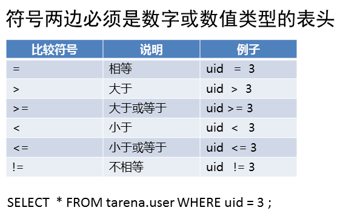

- [学习目标](#学习目标)
- [课堂笔记（命令）](#课堂笔记命令)
- [课堂笔记（文本）](#课堂笔记文本)
	- [环境准备](#环境准备)
	- [数据库概述](#数据库概述)
		- [数据库常见类型](#数据库常见类型)
		- [数据库类型](#数据库类型)
	- [部署MySQL](#部署mysql)
		- [安装软件](#安装软件)
		- [服务启动](#服务启动)
		- [版本查询](#版本查询)
		- [进程查询](#进程查询)
	- [重要配置文件](#重要配置文件)
		- [主配置文件](#主配置文件)
		- [数据库目录](#数据库目录)
		- [数据库socke](#数据库socke)
		- [数据库日志](#数据库日志)
		- [数据库进程pid](#数据库进程pid)
		- [总结](#总结)
	- [基础操作](#基础操作)
		- [必知参数](#必知参数)
		- [必备命令](#必备命令)
	- [密码管理](#密码管理)
		- [初始设置密码](#初始设置密码)
		- [修改密码-linux](#修改密码-linux)
		- [修改密码-sql](#修改密码-sql)
		- [隐藏密码修改](#隐藏密码修改)
		- [破解登陆密码](#破解登陆密码)
	- [安装图像软件](#安装图像软件)
		- [前提](#前提)
		- [安装nginx](#安装nginx)
		- [nginx配置](#nginx配置)
		- [安装php](#安装php)
		- [php-fpm配置](#php-fpm配置)
		- [安装phpmyadmin软件](#安装phpmyadmin软件)
		- [修改配置文件](#修改配置文件)
		- [页面访问](#页面访问)
	- [基础查询](#基础查询)
		- [导入测试数据](#导入测试数据)
		- [查询表结构](#查询表结构)
		- [查询表内容](#查询表内容)
	- [命令行遵循规范](#命令行遵循规范)
	- [数值比较](#数值比较)
	- [范围比较](#范围比较)
	- [模糊匹配](#模糊匹配)
	- [正则匹配](#正则匹配)
	- [别名-去重-合并](#别名-去重-合并)
- [快捷键](#快捷键)
- [问题](#问题)
	- [写出SELECT命令的格式](#写出select命令的格式)
	- [常用筛选条件](#常用筛选条件)
- [补充](#补充)
- [今日总结](#今日总结)
- [昨日复习](#昨日复习)

# 学习目标

数据库概述

部署MySQL服务

基础查询

# 课堂笔记（命令）


# 课堂笔记（文本）

## 环境准备


## 数据库概述

### 数据库常见类型


### 数据库类型


## 部署MySQL

### 安装软件

```sh
# mysql-server 提供服务软件
# mysql 提供命令软件
[root@mysql50 ~]#yum -y install mysql-server mysql
```

### 服务启动

```sh
[root@mysql50 ~]#systemctl enable mysqld --now
```

### 版本查询

```sql
[root@mysql50 ~]#mysql
mysql>select version(); 
mysql>exit;
# exit 退出
```

### 进程查询

```sh
[root@mysql50 ~]#ps -C mysqld # 查询进程
[root@mysql50 ~]#ss -ntulp | grep 3306
```

## 重要配置文件

### 主配置文件

```sh
[root@mysql50 ~]#cat /etc/my.cnf.d/mysql-server.cnf
[mysqld]
datadir=/var/lib/mysql  # 数据库目录
socket=/var/lib/mysql/mysql.sock # 数据库连接的服务，自己访问自己时使用；服务运行的必要参数
log-error=/var/log/mysql/mysqld.log # 数据库日志
pid-file=/run/mysqld/mysqld.pid  #进程pid
```

### 数据库目录

> 存放在数据库创建的数据（重要）

```sh
[root@mysql50 ~]#ls /var/lib/mysql
 auto.cnf             ibdata1              mysqlx.sock
 binlog.000001        ib_logfile0          mysqlx.sock.lock
 binlog.index         ib_logfile1          performance_schema
 ca-key.pem           ibtmp1               private_key.pem
 ca.pem              '#innodb_temp'        public_key.pem
 client-cert.pem      mysql                server-cert.pem
 client-key.pem       mysql.ibd            server-key.pem
'#ib_16384_0.dblwr'   mysql.sock           sys
'#ib_16384_1.dblwr'   mysql.sock.lock      undo_001
 ib_buffer_pool       mysql_upgrade_info   undo_002
```

### 数据库socke

> 数据库建立连接的服务，自己访问自己时使用；服务运行的必要参数
>
> 服务启动后会在该目录下创建该文件
>
> 服务停止后文件将会消失

```sh
[root@mysql50 ~]#ls /var/lib/mysql/mysql.sock
```

### 数据库日志

> 服务启动才会有

```sh
[root@mysql50 ~]#cat /var/log/mysql/mysqld.log
```

### 数据库进程pid

```sh
[root@mysql50 ~]#ls /run/mysqld/mysqld.pid
```

### 总结


## 基础操作

### 必知参数


### 必备命令


```sh
 [root@mysql50 ~]#mysql -hlocalhost -P3306 -uroot -p
 Enter password:   # 无密码敲回车
 mysql>select version(); # 查询版本
 mysql>show databases; # 查询有那些数据库；数据库初始化的库(勿删除)
 +--------------------+
| Database           |
+--------------------+
| information_schema |
| mysql              |
| performance_schema |
| sys                |
+--------------------+
5 rows in set (0.00 sec)
# 创建数据库；
mysql> create database student; 
Query OK, 1 row affected (0.09 sec)
mysql> show databases;
+--------------------+
| Database           |
+--------------------+
| information_schema |
| mysql              |
| performance_schema |
| student            |
| sys                |
+--------------------+
5 rows in set (0.00 sec)
mysql> exit
Bye
# 创建数据库后，将会在数据库目录创建该库名的目录
[root@mysql50 ~]#ls /var/lib/mysql 
```

```sh
# 查询当前位置：类似linux命令pwd
mysql>select database(); 
+------------+
| database() |
+------------+
| NULL       |
+------------+
1 row in set (0.00 sec)
```

```sh
# use：使用数据库；类似linux命令cd
mysql> use student;
Database changed
mysql> select database();
+------------+
| database() |
+------------+
| student    |
+------------+
1 row in set (0.00 sec)
```

```sh
# 查看数据库表
mysql> use sys;
Reading table information for completion of table and column names
You can turn off this feature to get a quicker startup with -A

Database changed
mysql> show tables;
+-----------------------------------------------+
| Tables_in_sys                                 |
+-----------------------------------------------+
| host_summary                                  |
```

```sh
# 退出数据库
mysql> exit；
bey
```

## 密码管理

> + 在操作系统命令行进行修改密码
> + 操作系统管理才有此权限
>
> ```sh
> # 设置密码
> ]#mysqladmin -hlocalhost -uroot -p password "新密码"
> # 修改密码
> ]#mysqladmin -hlocalhost -uroot -p旧密码 passsword "新密码"
> ```

### 初始设置密码

```sh
[root@mysql50 ~]#mysqladmin -uroot -p password "123456"
Enter password: //敲回车
mysqladmin: [Warning] Using a password on the command line interface can be insecure.
Warning: Since password will be sent to server in plain text, use ssl connection to ensure password safety.

[root@mysql50 ~]# mysql -uroot –p123456 //连接时输入密码
Welcome to the MySQL monitor.  Commands end with ; or \g.
Your MySQL connection id is 14
```

### 修改密码-linux

```sh
[root@mysql50 ~]# mysqladmin -uroot –p123456 pssword "654321"
[root@mysql50 ~]# mysql -uroot –p123456 
mysql: [Warning] Using a password on the command line interface can be insecure.
ERROR 1045 (28000): Access denied for user 'root'@'localhost' (using password: YES)

[root@mysql50 ~]# mysql -uroot –p654321
Welcome to the MySQL monitor.  Commands end with ; or \g.
Your MySQL connection id is 20
Server version: 8.0.26 Source distribution
```

### 修改密码-sql

```sh
[root@mysql50 ~]# mysql -uroot –p654321
mysql>alter user root@'localhost' identified by '新密码';
```

### 隐藏密码修改

```sh
[root@mysql50 ~]# mysqladmin -uroot -p  password
Enter password:  # 输入原密码
New password:  # 输入新密码
Confirm new password:  # 再次输入
Warning: Since password will be sent to server in plain text, use ssl connection to ensure password safety.

# 隐藏登陆密码
[root@mysql50 ~]# mysql -uroot -p
Enter password:  # 输入密码
Welcome to the MySQL monitor.  Commands end with ; or \g.
Your MySQL connection id is 22
```

### 破解登陆密码

> 破解步骤：
>
> 1. 配置服务可以无密码登陆
> 2. 删除不知道的密码
> 3. 配置服务需要密码登陆
> 4. 登陆后设置新密码
> 5. 使用新密码的登陆

```sh
1-配置服务可以无密码登陆

[root@mysql50 ~]# mysql -uroot -p
Enter password: 
ERROR 1045 (28000): Access denied for user 'root'@'localhost' (using password: YES)
[root@mysql50 ~]# vim /etc/my.cnf.d/mysql-server.cnf #修改主配置文件
[mysqld]
skip-grant-tables  # 跳过登陆授权表
datadir=/var/lib/mysql
socket=/var/lib/mysql/mysql.sock
log-error=/var/log/mysql/mysqld.log
pid-file=/run/mysqld/mysqld.pid
[root@mysql50 ~]#systemctl restart mysqld # 重启服务，生效配置
# 验证
[root@mysql50 ~]# mysql
Welcome to the MySQL monitor.  Commands end with ; or \g.
Your MySQL connection id is 22
```

``` sh
2-删除不知道的密码

[root@mysql50 ~]# mysql
mysql>select host,user,authentication_string from mysql.user; # 查询密码文件
+-----------+------------------+------------------------------------------------------------------------+
| host      | user             | authentication_string                                                  |
+-----------+------------------+------------------------------------------------------------------------+
| localhost | mysql.infoschema | $A$005$THISISACOMBINATIONOFINVALIDSALTANDPASSWORDTHATMUSTNEVERBRBEUSED |
| localhost | mysql.session    | $A$005$THISISACOMBINATIONOFINVALIDSALTANDPASSWORDTHATMUSTNEVERBRBEUSED |
| localhost | mysql.sys        | $A$005$THISISACOMBINATIONOFINVALIDSALTANDPASSWORDTHATMUSTNEVERBRBEUSED |
| localhost | root             | *6BB4837EB74329105EE4568DDA7DC67ED2CA2AD9                              |
+-----------+------------------+------------------------------------------------------------------------+
4 rows in set (0.00 sec)
# 将root用户authentication_string值赋为空
mysql>update mysql.user set authentication_string="" where user="root" and host="localhost";
mysql>flush privileges; # 刷新配置
mysql>exit;
```

```sh
3-配置服务需要密码登陆

# 将配置文件跳过密码检查删除
[root@mysql50 ~]# sed -i '2d' /etc/my.cnf.d/mysql.cnf 
# 重启服务生效配置
[root@mysql50 ~]# systemctl restart mysqld
# 验证
[root@mysql50 ~]# mysql    #由于密码为空，可以直接登陆
Welcome to the MySQL monitor.  Commands end with ; or \g.
Your MySQL connection id is 22
```

```sh
4-登陆后设置新密码
[root@mysql50 ~]# mysql
mysql>alter user root@'localhost' identified by "123456";
mysql>exit;
```

```sh
5-使用新密码登陆
[root@mysql50 ~]# mysql -uroot -p123456
```

## 安装图像软件

### 前提

> 准备软件包
>
> phpMyAdmin-5.2.1-all-languages.zip
> nginx-1.22.1.tar.gz 

### 安装nginx

```sh
# 安装依赖工具等
gcc 源码包编译工具
unzip 提供解压.zip 压缩包命令
make 源码软件编译命令
pcre-devel 支持正则表达式
zlib-devel 提供数据压缩命令
[root@mysql50 ~]#yum -y install gcc unzip make pcre-devel zlib-devel
[root@mysql50 ~]#tar -xf nginx-1.22.1.tar.gz
[root@mysql50 ~]#cd nginx-1.22.1
[root@mysql50 ~]#./configure # 不指定模块，一切默认 
[root@mysql50 ~]#make && make install
[root@mysql50 ~]#ls /usr/local/nginx
conf log html sbin
```

### nginx配置

```sh
[root@mysql50 ~]#vim +65 /usr/local/nginx/conf/nginx.conf  # 命令行:set nu
 43         location / {
 44             root   html;
 45             index  index.php index.html index.htm; # 修改默认页为index.php
 46         }
	...
 65         location ~ \.php$ {
 66             root           html;
 67             fastcgi_pass   127.0.0.1:9000;
 68             fastcgi_index  index.php;
 69             #fastcgi_param  SCRIPT_FILENAME  /scripts$fastcgi_script_name;
 70             include        fastcgi.conf; # 存放nginx变量文件
 71         }
 [root@mysql50 ~]#/usr/local/nginx/sbin/nginx  # 启动nginx
 [root@mysql50 ~]#ss -ntulp|grep :80
```

### 安装php

```sh
# 安装依赖及软件
php 解释php代码
php-devel php扩展包 
php-mysqlnd 连接mysql命令包
php-json 支持json代码
php-fpm 提供fpm服务
[root@mysql50 ~]#yum -y install php  php-devel php-mysqlnd php-json php-fpm
```

### php-fpm配置

```sh
[root@mysql50 ~]#vim +38 /etc/php-fpm.d/www.conf
38 ;listen = /run/php-fpm/www.sock
39 listen = 127.0.0.1:9000  
[root@mysql50 ~]# systemctl  start php-fpm 
[root@mysql50 ~]# netstat  -utnlp  | grep 9000  

[root@mysql50 ~]# vim /usr/local/nginx/html/test.php //编写php脚本
<?php
$name = "100" ;
echo $name ;
echo "\n" ;
?>
[root@mysql50 ~]# curl  http://localhost/test.php  
100
```

### 安装phpmyadmin软件

```sh
[root@mysql50 ~]# yum -y install unzip
[root@mysql50 ~]# unzip phpMyAdmin-5.2.1-all-languages.zip  //解压
[root@mysql50 ~]# mv phpMyAdmin-5.2.1-all-languages /usr/local/nginx/html/phpmyadmin  # 移动并改名 ，为了便于访问

# 浏览器访问192.168.88.50/phpmyadmin
```

### 修改配置文件

```sh
[root@mysql50 ~]# cd /usr/local/nginx/html/phpmyadmin/  //进软件目录
[root@mysql50 phpmyadmin]# cp config.sample.inc.php config.inc.php //创建主配置文件
[root@mysql50 phpmyadmin]# vim config.inc.php //修改主配置文件
# 管理本机的数据库服务
30 $cfg['Servers'][$i]['host'] = 'localhost';
```

### 页面访问

> http://192.168.88.50/phpmyadmin
>
> 帐密：系统数据库管理员和密码

## 基础查询

### 导入测试数据

> [下载测试数据](https://gogetacoke.lanzouj.com/iCPun1kl3f5g)

```sql
mysql -uroot -pyyh < tarena.sql 
```

### 查询表结构

```sql
mysql> desc tarena.user;
+----------+-------------+------+-----+---------+----------------+
| Field    | Type        | Null | Key | Default | Extra          |
+----------+-------------+------+-----+---------+----------------+
| id       | int         | NO   | PRI | NULL    | auto_increment |
| name     | char(20)    | YES  |     | NULL    |                |
| password | char(1)     | YES  |     | NULL    |                |
| uid      | int         | YES  |     | NULL    |                |
| gid      | int         | YES  |     | NULL    |                |
| comment  | varchar(50) | YES  |     | NULL    |                |
| homedir  | varchar(80) | YES  |     | NULL    |                |
| shell    | char(30)    | YES  |     | NULL    |                |
+----------+-------------+------+-----+---------+----------------+
8 rows in set (0.00 sec)
```

### 查询表内容

> 基本格式：
>
> 格式一：select 表头名 from 库名.表名;
>
> 格式二：select 表头名 from 库名.表名 where 筛选条件;
>
> [注]：已经在use数据库可以省略库名

```sql
# 显示所有列
select * from tarena.user;
# 只是显示name列
select name from tarena.user;
# 显示name，uid列
select name,uid from tarena.user;
# 显示id为1的第一行
select * from tarena.user where id=1;
# 显示name id为2的列
select name from tarena.user where id=2;
```

## 命令行遵循规范


## 数值比较



```sql
mysql>use tarena;

查看第3行的行号、用户名、uid、gid  四个表头的值
mysql>select  id,name,uid,gid from user  where id=3;

查看前2行的行号用户名、uid、gid 四个表头的值
mysql> select id,name,uid,gid from user where id<3;

查看前3行的行号、用户名、uid、gid  四个表头的值
mysql> select id,name,uid,gid from user where id<=3;

查看前uid号大于6000的行号、用户名、uid、gid  四个表头的值
mysql> select id,name,uid,gid from user where uid>6000;

查看前uid号大于等于1000的行号、用户名、uid、gid  四个表头的值
mysql> select id,name,uid,gid from user where uid>=1000;

查看uid号和gid号相同的行 仅显示行号、用户名、uid、gid  四个表头的值
mysql> select id,name,uid,gid from user where uid=gid;

查看uid号和gid号不一样的行 仅显示行号、用户名、uid、gid  四个表头的值
mysql> select id,name,uid,gid from user where uid!=gid;	
```

## 范围比较

> in （值列表） //在…里
>
> not in （值列表） //不在…里
>
> between 数字1 and 数字2 //在…之间

```sql
uid号表头的值 是 (1 , 3 , 5 , 7) 中的任意一个即可
mysql> select id,uid,name from user where uid in (1,3,5,7);

shell 表头的的值 不是 "/bin/bash"或"/sbin/nologin" 即可
mysql> select uid,name,shell from user where shell not in ('/bin/bash','/sbin/nologin');

id表头的值 在 10  到  20 之间即可 包括 10 和  20  本身
mysql> select id,uid,name from user where id between 10 and 20;
```

## 模糊匹配

> 格式：where 字段名 like "表达式";
>
> 通配符
>
> _ 表示 1个字符
>
> % 表示零个或多个字符

```sql
找名字必须是3个字符的 （没有空格挨着敲）
mysql> select name from user where name like "___";

找名字必须是4个字符的（没有空格挨着敲)
mysql> select name from user where name like "____";

找名字以字母a开头的（没有空格挨着敲）
mysql> select name from user where name like "a%";

查找名字至少是4个字符的表达式
mysql> select name from user where name like "__%__";
```

## 正则匹配

> 格式：select 字段名列表 from 库名.表名 where字段名 regexp '正则表达式'；
>
> 回顾shell课程学过的元字符(正则符号)
>
> ^ 匹配行首
>
> $ 匹配行尾
>
> [] 匹配范围内任意一个
>
> \* 前边的表达式出现零次或多次
>
> \| 或者
>
> . 任意一个字符

```sql
//添加有数字的名字
insert into  tarena.user(name)values("yaya9");
insert into  tarena.user(name)values("6yaya");
insert into  tarena.user(name)values("ya7ya");
insert into  tarena.user(name)values("yay8a");

查看名字里有数字的
mysql> select name from user where name regexp "[0-9]";

查看名字以数字开头
mysql> select name from user where name regexp "^[0-9]";

查看名字以数字结尾
mysql> select name from user where name regexp "[0-9]$";

查看名字以r开头
mysql> select name from user where name regexp "^r";

查看名字以t结尾
mysql> select name from user where name regexp "t$";

查看名字以r开头或t结尾
mysql> select name from user where name regexp "^r|t$";

名字r开头t结尾
mysql> select name from user where name regexp "^r.*t$";
```

## 别名-去重-合并

> 定义别名使用   as  或  空格 
>
> 拼接 concat()
>
> 去重 distinct
>
> ['注']：去重只能针对单列

```sql
# 别名
mysql>select name as 账号 from user;
mysql>select name as 账号,uid 属组ID from user where id<=5;
+--------+----------+
| 账号   | 属组ID   |
+--------+----------+
| root   |        0 |
| bin    |        1 |
| daemon |        2 |
| adm    |        3 |
| lp     |        4 |
+--------+----------+
5 rows in set (0.00 sec)
```

```sh
# 拼接 concat()
mysql> select concat(name, "-" , uid) from user where id=1;
+-------------------------+
| concat(name, "-" , uid) |
+-------------------------+
| root-0                  |
+-------------------------+
1 row in set (0.00 sec)

mysql> select concat(name, "-" , uid, '---', gid) from user where id=1;
+-------------------------------------+
| concat(name, "-" , uid, '---', gid) |
+-------------------------------------+
| root-0---0                          |
+-------------------------------------+
1 row in set (0.00 sec)
```

```sql
# 去重 distinct
mysql> select  distinct shell from user;
+----------------+
| shell          |
+----------------+
| /bin/bash      |
| /sbin/nologin  |
| /bin/sync      |
| /sbin/shutdown |
| /sbin/halt     |
| /bin/false     |
| NULL           |
+----------------+
7 rows in set 
```

## 逻辑比较

> 多个判断条件
>
> 逻辑与 and （&&） 多个判断条件必须同时成立
>
> 逻辑或 or （\|\|） 多个判断条件其中某个条件成立即可
>
> 逻辑非 not （!） 取反

```sql
查看解释器不是/bin/bash的
mysql>select uid,naem from user where shell != "/bin/bash";

使用not取反
mysql>select uid,name from user where not shell = "/bin/bash"; 

id值不在 10 到 20 之间 
mysql>select uid,name from user where not id between 10 and 20;

查找name=‘root’，uid=‘0’的行
mysql>select uid,name from user where name="root" and uid="0";

查找name=‘root’或者name=‘bin’或者uid=‘0’的行
mysql>select uid,name from user where name="root" or name="bin" or uid="0";
```

### 优先级()

> 逻辑匹配什么时候需要加（）
>
> 逻辑与and 优先级高于逻辑或 or
>
> 如果在筛选条件里既有and 又有 or 默认先判断and 再判断or

```sql
不加() 的查询
mysql>select uid,name from user where name="root" or name="bin" and uid="1";
+------+------+
| name | uid  |
+------+------+
| root |    0 |
| bin  |    1 |
+------+------+

加()比较
mysql>select uid,name from user where (name="root" or name="bin") and uid="1";
+------+------+
| name | uid  |
+------+------+
| bin  |    1 |
+------+------+
```

## 字符比较

> 符号两边必须是字符 或字符类型的表头
>
> = 相等比较
>
> != 不相等比较

```sql
查看表里是否有名字叫apache的用户
mysql> select id,name from user where name="apache";

输出解释器不是/bin/bash的用户名 及使用的解释器
mysql>select name from user where shell != "/bin/bash";
```

### 空与非空

> 空 is null 表头下没有数据
>
> 非空 is not null 表头下有数据
>
> mysql服务 使用关键字 null 或 NULL 表示表头没有数据

```sql
添加新行 仅给行中的id 表头和name表头赋值
mysql> insert into tarena.user(id,name) values(32,"");    //零个字符
mysql> insert into tarena.user(id,name) values(33,"null");//普通字母
mysql> insert into tarena.user(id,name) values(34,NULL);  //表示空
mysql> insert into tarena.user(id,name) values(35,null);  //表示空

查询数据表name是NULL的
mysql> select id,name from user where name is null;
+----+------+
| id | name |
+----+------+
| 34 | NULL |
| 35 | NULL |
+----+------+
2 rows in set (0.00 sec)

查询数据表中不是null的数据
mysql> select id,name from user where name is not null and id >31;
+----+------+
| id | name |
+----+------+
| 32 |      |
| 33 | null |
+----+------+
2 rows in set (0.00 sec)

查找数据表中“字符“是null的
mysql> select id,name from user where name="null";
+----+------+
| id | name |
+----+------+
| 33 | null |
+----+------+
1 row in set (0.00 sec)

查找数据表中字符是零个字符的
mysql> select id,name from user where name="";
+----+------+
| id | name |
+----+------+
| 32 |      |
+----+------+
1 row in set (0.00 sec)
```

# 快捷键


# 问题

## 写出SELECT命令的格式

```sql
select 表头名 from 库名.表名；
select 表头名 from 库名.表名 where 筛选条件；
```

## 常用筛选条件

> 数值比较：=  != >= <= > <
>
> 范围比较：in、not in、between ...and...
>
> 模糊匹配：like _、%
>
> 正则匹配：regexp * \| [] ^ $ 
>
> 逻辑比较：and、or、not
>
> 空：is null
>
> 非空：is not null


# 补充


# 今日总结


# 昨日复习