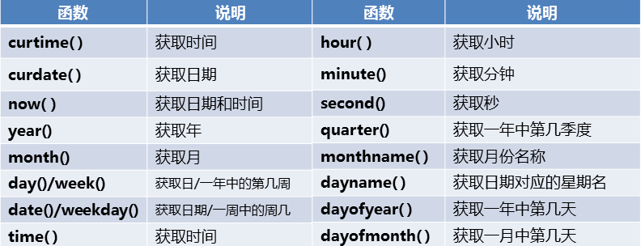
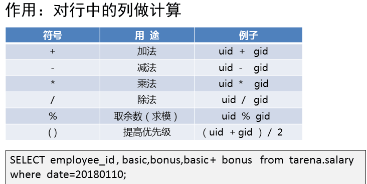

- [学习目标](#学习目标)
- [课堂笔记（命令）](#课堂笔记命令)
- [课堂笔记（文本）](#课堂笔记文本)
  - [常用函数](#常用函数)
    - [字符函数](#字符函数)
    - [数学函数](#数学函数)
    - [日期函数](#日期函数)
    - [聚集函数](#聚集函数)
    - [计算函数](#计算函数)
    - [判断函数](#判断函数)
    - [case函数](#case函数)
  - [查询结果处理](#查询结果处理)
    - [分组](#分组)
    - [排序](#排序)
    - [过滤](#过滤)
    - [分页](#分页)
  - [管理表记录](#管理表记录)
    - [插入表记录](#插入表记录)
    - [修改表记录](#修改表记录)
    - [删除表记录](#删除表记录)
- [快捷键](#快捷键)
- [问题](#问题)
- [补充](#补充)
- [今日总结](#今日总结)
- [昨日复习](#昨日复习)


# 学习目标

常用函数

处理查询结果

管理表记录

# 课堂笔记（命令）


# 课堂笔记（文本）

## 常用函数

### 字符函数


```sql
LENGTH(str)  返字符串长度，以字节为单位；一个汉字3字节
mysql> select name,length(name) from employees where employee_id=1;
+--------+--------------+
| name   | length(name) |
+--------+--------------+
| 梁伟   |            6 |
+--------+--------------+
1 row in set (0.00 sec)

CHAR_LENGTH(str) 返回字符串长度，以字符为单位
mysql> select name,char_length(name) from employees where employee_id=1;
+--------+-------------------+
| name   | char_length(name) |
+--------+-------------------+
| 梁伟   |                 2 |
+--------+-------------------+
1 row in set (0.00 sec)
```

```sql
UPPER(str)和UCASE(str)  将字符串中的字母全部转换成大写； limit 1 限制结果集只返回第一行数据

mysql> select name from user limit 1;
+------+
| name |
+------+
| root |
+------+
1 row in set (0.00 sec)
mysql> select upper(name) from user limit 1;
+-------------+
| upper(name) |
+-------------+
| ROOT        |
+-------------+
1 row in set (0.00 sec)
```

### 数学函数


```sql
返回user表中uid为偶数的用户名和uid
mysql>select uid,name from user where uid is not null and mod(uid,2) = 0;

返回-12的绝对值
mysql>select abs(-12);
+-----------+
| abs(-12) |
+-----------+
|        12 |
+-----------+
1 row in set (0.00 sec)


返回大于1.1的最小整数
mysql> select ceil(1.1);
+-----------+
| ceil(1.1) |
+-----------+
|         2 |
+-----------+
1 row in set (0.00 sec)

返回9.52的最小整数
mysql> select floor(9.52);
+-------------+
| floor(9.52) |
+-------------+
|           9 |
+-------------+
1 row in set (0.00 sec)
```

### 日期函数



```sql
获取系统时间
mysql>select curtime();
获取系统日期
mysql>select curdate();
获取日期和时间
mysql>select now();
获取日期时间的年
mysql>select year(now());

获取employees表入职月份与出生月份相同的数据
mysql>select name,birth_date,hire_date from employees where year(birth_date)=year(hire_date);

获取员工id为8的入职年份
mysql>select name,year(hire_date) as 入职年份 from employess where employee_id=8;
```

>  **[注]：日期函数只能在日期数据中获取年月日时分秒。**

### 聚集函数


```sql
输出3号员工2018每个月的基本工资
mysql> select basic from salary where year(date)=2018 and employee_id=3;

求出3号员工2018一年的基础工资
mysql>select sum(basic) from salary where year(date)=2018 and employee_id=3;

求出3号员工2018年平均月基础工资
mysql> select avg(basic) from salary where year(date)=2018 and employee_id=3;

找出3号员工2018年中最高基础工资
mysql> select max(basic) from salary where year(date)=2018 and employee_id=3;

找出user表中没有登陆权限的用户个数
mysql>select count(name) from user where shell="/sbin/nologin";
```

### 计算函数



```sql
求出3号员工2018年的总工资
mysql>select sum(basic+bonus) from salary where year(date)=2018 and employee_id=3;

求出3号员工2018年的平均总工资
mysql>select sum(basic+bonus)/12 from salary where year(date)=2018 and employee_id=3

求出8号员工的年龄
mysql> select 2024-year(birth_date) from employees where employee_id=8;
```

### 判断函数

> if(条件,v1,v2) 如果条件是TRUE则返回v1，否则返回v2
>
> ifnull(v1,v2) 如果v1不为NULL，则返回v1，否则返回v2

```sql
根据uid号 输出用户类型，当uid>1000输出创建用户,或者输出系统创建
mysql>select name,uid,if(uid>1000,"创建用户","系统创建") as 用户类型 from user;

判断家目录是否为空，为空则返回NO Home
mysql>slect name,uid,ifnull(dirhome,"NoHome") as 家目录信息 from user;
```

### case函数

> CASE 表头名              
> WHEN 值1 THEN 输出结果 
> WHEN 值2 THEN 输出结果  
> WHEN 值3 THEN 输出结果 
> ELSE 输出结果  
> END
> 或
> CASE              
> WHEN  判断条件1 THEN 输出结果 
> WHEN  判断条件2 THEN 输出结果  
> WHEN  判断条件3 THEN 输出结果 
> ELSE  输出结果  
> END

```sql
判断departments表中的dep_name来划分是否是技术部
select * ,
case dept_name
when "运维部" then "技术部" 
when "测试部" then "技术部"
when "开发部" then "技术部"
else "非IT"
end as dept_type from departments;

或
mysql> select dept_id,dept_name,
    -> case
    -> when dept_name in ("运维部","开发部","测试部") then "技术部"
    -> else "非技术部"
    -> end as 部门类型  from  tarena.departments;
```

## 查询结果处理

> SELECT 表头名 FROM 库名.表名 [WHERE条件] 分组 \| 排序 \| 过滤 \| 分页;

### 分组

> select  表头名 from 库.表 where 筛选条件 group by 表头名;

```sql
输出符合条件的shell和name
mysql>select name,shell from user where shell in ('/bin/bash','/sbin/nologin');
然后根据shell进行排序，输出/bin/bash的人数
mysql>select shell,count(name) from user where shell in ('/bin/bash','/sbin/nologin') group by shell;

统计每个部门的总人数 (按照部门表头分组统计name表头值的个数)
mysql>select dept_id,count(name) from employees group by dept_id;	
```

### 排序

> select  表头名 from 库.表 where 筛选条件 order by 表头名 desc/asc;
>
> desc 降序
>
> asc 升序
>
> [注]：不写排序方式则是默认asc升序

```sql
查找uid不为空且uid在10到50之间，将uid进行降序排序
mysql>select name,uid from user where uid is not null and uid between 10 and 50 order by uid desc;

查询2015-01-10员工编号小于10的工资总和，且使工资总和按照升序排序
select date,basic,bonus,basic+bonus as 工资总合 from salary where date='20150110' and employee_id < 10 order by 工资总合 asc;
```

### 过滤

> select 表头名  from 库.表  where 筛选条件  having     筛选条件;
>
> where 针对查询表中的数据做筛选条件
>
> having 针对已经查询出来的数据做筛选条件

```sql
查找部门总人数少于10人的部门名称及人数
mysql>select dept_id,count(name) as 部门总人数 from employees group by dept_id  having 部门总人数 < 10;

查询employees表值中姓名为王的所有信息
```

### 分页

> 分析：
>
> 作用：限制查询结果显示行数（默认显示全部查询结果）
>
> 使用SELECT查询时，如果结果集数据量很大，比如1万行数据，放在一个页面显示的话数据量太大，可以分100次显示 每次只显示100行。
>
> SELECT语句  LIMIT  数字;            //显示查询结果前多少条记录
> SELECT语句  LIMIT  数字1,数字2;    //显示指定范围内的查询记录------》数字1  表示起始行 （0表示第1行） 数字2表示总行数（用于做分页）

```sql
查看user表中有解释器的用户信息
mysql>select * from user where shell is not null;
只显示结果的第1行
mysql>select * from user where shell is not null limit 1;
只显示查询结果的前3行
mysql>select * from user where shell is not null limit 3;
只显示查询结果的前1到3行
mysql>select * from user where shell is not null limit 0,3;
从查询结果的第4行开始显示，共显示3行
mysql>select * from user where shell is not null limit 3,3;

查询user中uid最大的用户信息
mysql>select * from user order by desc limit 1;
```

## 管理表记录

> 对已经存储的数据做管理

### 插入表记录

> 给指定表头添加数据：
>
> insert into 库.表(表头名)  value(表头数据);
>
> 给每个表头添加数据：
>
> insert into 库.表  value(表头数据);

```sql
插入一行，给指定表头添加值，必须写指定的表头
mysql>insert into user(name,uid) values("may",1088);
插入多行，给指定表头添加值，必须写指定的表头
mysql>insert into user(name,uid) values("may",1088),("bob",1089),("jack",1090);

插入一行，给所有表头赋值，不用指定表头，但需要根据插入表中每个表头的TYPE进行添加
insert into user values(41,"B","X",1009,1009,"contents","/home/41",null);
插入多行，给所有表头赋值，
insert into user values(41,"B","X",1009,1009,"contents","/home/41",null),(42,"C","X",1010,1010,"contents","/home/42",null),(43,"A","X",1011,1011,"contents","/home/43",null);
```

### 修改表记录

> 针对满足条件的进行修改：
>
> update 库.表 set 表头名="" where 筛选条件;
>
> 修改所有：
>
> update 库.表 set 表头=""；

```sql
修改名字为root的行
mysql>update user set password="A" where name="root";

修改所有行的password
mysql>update user set password="B";
```

### 删除表记录

> delete from 库.表 where 条件;
>
> [注]：条件一定要写，不然将删除全部

```sql
删除前先进行查看
mysql>select * from user where id>=40;
删除匹配条件的行
mysql>delete from user where id >= 40;
```


# 快捷键


# 问题


# 补充


# 今日总结


# 昨日复习

1. 相关概念

   数据库类型、数据库服务软件、mysql服务软件的版本、特点、应用场景

2. 部署MySQL数据库服务器

   安装软件、启动服务、登陆服务

3. 相关参数

   主配置文件、数据库目录、错误日志、服务的进程名、所有者、传输协议

4. 必备命令

   查看已有库、表

   查看库、切换库

   查看软件的版本 查看当前登陆的用户

5. 管理员root用户密码管理

   密码的设置、修改、破解

6. 在数据库服务器上安装图形软件

   连接数据库服务的方式

   安装phpmyadmin图形软件

7. 基础查询

   SQL命令语法

   查询命令select的语法格式

8. 筛选条件

   数值比较

   范围匹配

   模糊匹配

   正则匹配

   别名、去重、合并