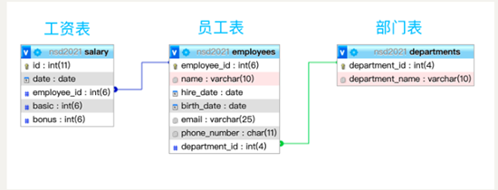

- [学习目标](#学习目标)
- [课堂笔记（命令）](#课堂笔记命令)
- [课堂笔记（文本）](#课堂笔记文本)
  - [连接查询](#连接查询)
    - [内连接查询](#内连接查询)
      - [等值连接](#等值连接)
      - [非等值连接](#非等值连接)
    - [外连接查询](#外连接查询)
      - [左连接](#左连接)
      - [右连接](#右连接)
    - [全外连接](#全外连接)
- [快捷键](#快捷键)
- [问题](#问题)
- [补充](#补充)
- [今日总结](#今日总结)
- [昨日复习](#昨日复习)


# 学习目标

内连接查询

外连接查询

嵌套查询

# 课堂笔记（命令）


# 课堂笔记（文本）



## 连接查询

> 把多张表临时组成一张表，再在临时的表里查找符合条件的数据

### 内连接查询

> select 表头名 from 库.表  inner join 库.表        -》不推荐（迪卡尔积）
>
> 常规写法：
>
> select 表头名 from 库.表  inner join 库.表  on 连接条件

```sql
查询员工所有信息及所在部门名称--结果数量为employees*departments  （迪卡尔积）
select * from employees inner join departments;
```

#### 等值连接

> 使用相等判断做连接条件，表中必须有存储相同的数据的表头

```sql
"格式"
select 表头名列表 from 表1 as 别名 inner join 表2 as 别名 on 连接条件 [where 筛选条件] |[group by 分组]|[having 分组后进行筛选]|[order by 排序列表]
```

**查询员工所有信息及所在部门名称**

```sql
select * from employees 
inner join departments
on employees.dept_id=departments.dept_id;
```

**查询8号员工所在部门**

```sql
select name,dept_name from employees 
inner join departments 
on employees.dept_id=departments.dept_id 
where employee_id=8;
```

**查询11号员工的2018年每月的总工资信息，并且输出发薪日以及姓名**

```sql
select employees.employee_id,date,name,basci+bonus as "总工资" from employees inner join salary 
on employees.employee_id=salary.employee_id 
where employees.employee_id=11 and year(date)="2018";
```

> 解题思路：
>
> employees.employee_id 两张表中都有，所以获取任何一张表的员工id都可以
>
> inner join 连接employees和salary表
>
> on employees.employee_id=salary.employee_id  避免出现迪卡尔积，相同员工编号
>
> where employees.employee_id=11 and year(date)="2018";  条件11号员工和2018你年

**计算每个员工2018年的年薪**

```sql
select name,sum(basic+bonus) as 年薪工资 from employees 
inner join salary 
on employees.employee_id = salary.employee_id 
where year(date)="2018" group by name;
```

> 解题思路：根据查询的结果进行一个group by分组，分成每个员工计算一年的工资总和

**把计算出来的年薪按照升序进行排序**

```sql
select name,sum(basic+bonus) as 年薪工资 from employees 
inner join salary 
on employees.employee_id = salary.employee_id 
where year(date)="2018" 
group by name 
order by 年薪工资;
```

**过滤年薪大于300000的人按照降序排序**

```sql
select name,sum(basic+bonus) as 年薪工资 from employees 
inner join salary 
on employees.employee_id = salary.employee_id 
where year(date)="2018" 
group by name 
having 年薪工资>300000 
order by 年薪工资 desc ;
```

#### 非等值连接

> 不使用相等判断做连接条件，适合表里没有存储相同数据的表头时使用

**创建测试数据**

```sql
create table wage_grade(
id int,
grade char(1),
low int,
high int
);
insert into wage_grade values(1,'A',5000,8000),(2,'B',5001,10000),(3,'C',10001,15000),(4,'D',15001,20000),(5,'E',20001,100000);
```

**查询2018年12月份员工基础工资，按照等级表进行工资等级划分**

```sql
select employee_id,date,basic,grade from salary 
inner join wage_grade 
on basic 
between low and high 
where year(date)=2018 and month(date)=12;
```

> 解题思路：
>
> 通过连接查询后，根据员工basic基础工资做与grade表的连接条件，满足在grade表的low与high时进行连接查询，然后再跟where条件查询2018年与12月份

**查询2018年12月员工各基本工资级别的人数**

```sql
select grade as 等级,count(employee_id) as 总人数 from salary 
inner join wage_grade 
on basic between low and high 
where year(date)=2018 and month(date)=12 
group by grade;
```

**查询2018年12月员工基本工资级别，员工需要显示姓名**

```sql
select name,basic,grade as 等级 from salary 
inner join employees
on employees.employee_id=salary.employee_id  
inner join wage_grade
on basic between low and high
where year(date)=2018 and month(date)=12;
```

### 外连接查询

**创建测试数据**

```sql
insert into departments(dept_name) values("小卖部"),("海关部"),("公关部");
```

#### 左连接

> + 左表表头记录全显示
> + 右表表头只显示与条件匹配的记录，右表比左表少的记录使用NULL匹配

**输出没有员工的部门名**

```sql
select dept_name from departments 
left join employees
on departments.dept_id=departments.dept_id
where name is null;

向小卖部添加一个人;小卖部的部门id为9
insert into employees(name,dept_name)
values('bob',9);

再次查询
select dept_name from departments 
left join employees
on departments.dept_id=departments.dept_id
where name is null;
```

#### 右连接

> + 右表表头记录全显示
> + 左表表头只显示与条件匹配的记录，左表比右表少的记录使用null匹配

**测试数据**

```sql
insert into employees(name) values("john"),("alice"),("zhangsan");
```

**输出没有部门名的员工名**

```sql
select name from departments
right join employees
on departments.dept_id=employees.dept_id
where dept_name is null;

修改john员工的部门id为11
update employees set dept_id=11 where name="john";

再次查询
select name from departments
right join employees
on departments.dept_id=employees.dept_id
where dept_name is null;
```

### 全外连接

> + 联合查询，用来合并查询结果
> + 可以合并同一张的表的查询记录(不同表的查询记录也可合并)
> + 查询时，多个select语句查询**表头个数**必须一样
> + union关键字默认去重，可以使用union all 包含重复项

```sql
"语法格式"
(select语句) union (select语句); 去重
(select语句) union all (select语句);不去重
```

**查询工资表中最高与最低**

```sql
(select date,max(basic) from salary 
 where date=20180110 ) 
 union 
 (select date,min(basic) from salary
  where date=20180110);
```

**查询工资表中最高与最低连同姓名**

```sql
(select date,name,basic from employees 
inner join salary 
on employees.employee_id=salary.employee_id 
order by basic desc 
limit 1) 
union 
(select date,name,basic from employees 
inner join salary 
on employees.employee_id=salary.employee_id 
order by basic asc 
limit 1);
```


# 快捷键


# 问题


# 补充


# 今日总结


# 昨日复习