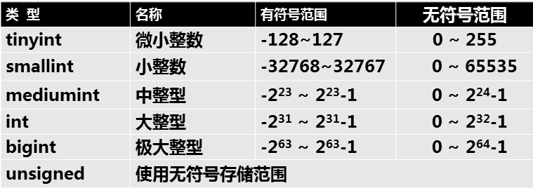

- [学习目标](#学习目标)
- [课堂笔记（命令）](#课堂笔记命令)
- [课堂笔记（文本）](#课堂笔记文本)
	- [表管理](#表管理)
		- [建库](#建库)
		- [建表](#建表)
			- [基础创建](#基础创建)
			- [添加表头](#添加表头)
			- [删除表头](#删除表头)
			- [修改表名](#修改表名)
			- [修改表头名](#修改表头名)
			- [修改表数据类型](#修改表数据类型)
			- [复制表](#复制表)
	- [数据类型](#数据类型)
		- [字符类型](#字符类型)
			- [数据准备](#数据准备)
			- [char](#char)
			- [varchar](#varchar)
			- [两则区别](#两则区别)
		- [数值类型](#数值类型)
			- [数据准备](#数据准备-1)
			- [整形](#整形)
			- [浮点型](#浮点型)
		- [枚举类型](#枚举类型)
			- [数据准备](#数据准备-2)
			- [单选](#单选)
			- [多选](#多选)
		- [日期时间类型](#日期时间类型)
			- [数据准备](#数据准备-3)
			- [插入数据](#插入数据)
			- [查询](#查询)
			- [year补充](#year补充)
	- [数据批量处理](#数据批量处理)
		- [检索目录](#检索目录)
			- [查看检索目录](#查看检索目录)
			- [修改检索目录](#修改检索目录)
		- [数据导入](#数据导入)
			- [语法格式](#语法格式)
			- [数据准备](#数据准备-4)
			- [测试](#测试)
		- [数据导出](#数据导出)
			- [语法格式](#语法格式-1)
			- [测试](#测试-1)
	- [表头基本约束](#表头基本约束)
		- [查看表约束](#查看表约束)
		- [Null](#null)
		- [KEY](#key)
		- [Default](#default)
		- [扩展](#扩展)
- [快捷键](#快捷键)
- [问题](#问题)
- [补充](#补充)
	- [命令行执行sql](#命令行执行sql)
	- [mysql中执行命令](#mysql中执行命令)
- [今日总结](#今日总结)
- [昨日复习](#昨日复习)


# 学习目标

表管理

数据类型

数据批量处理

表头基本约束

# 课堂笔记（命令）


# 课堂笔记（文本）

## 表管理

### 建库

> 库名的命名规则：
>
> + 数字、字母、下划线，不能纯数字
> + 区分字母大小写
> + 具有唯一性
> + 不可使用MySQL命令或特殊字符

```sql
"创建格式"
create database [if not exists] <数据库名> [[default] character set <字符集合>] [[default] collate <校对规则名>];
```

```sql
"创建库"
create database 库名;
"删除库"
drop dtabases 库名;
"创建已有库屏蔽报错"
create database if not exists 已有库库名;
"删除已已经删除库屏蔽报错"
drop databases if exists 已删除库库名;
"修改库"
alter database 数据库名{[default] character set <字符集名> [default] collate <校对规则名>};
```

### 建表

```sql
"创建格式"
create table 库.表名(表头, 类型);
"删除格式"
drop table 库.表名;
"修改表结构"
alter table 库.旧库名 执行动作;
					"添加表头"
					add 表头名 数据类型;
					"删除表头"
					drop 
					"修改表名"
					rename
					"修改数据类型"
					modify
					"修改表头名"
					change 
```

#### 基础创建

```sql
"创建数据库，studb"
create database studb; 
use studb

"在studb库中创建stu表"
create table stu(
name char(10),
class char(9),
gender char(4),    
age int
)
```

#### 添加表头

```sql
"单个表头添加-默认添加在当前表的最后面"
alter table stu add sid char(11);
"多个表头添加"
alter table stu add emile char(11),add number char(11);
"指定添加表头位置-第一列"
alter table stu add id int first;
"指定添加表头位置-在name后面"
alter table stu add a char(5) after name;
```

> 添加后使用desc 查看表结构

#### 删除表头

```sql
"单个表头删除"
alter table stu drop a;
"多个表头删除"
alter table stu drop id,drop sid;
```

#### 修改表名

```sql
alter table stu rename stus;
"验证"
show tables;
```

#### 修改表头名

```sql
"将number更改为num-修改后需要跟上类型(新的类型或原表头数据类型)"
alter table stus change number num int;
```

#### 修改表数据类型

> + 如果表头下没有存储数据类型可以随便修改
> + 反之有数据，修改的新类型不能与已经存储的数据冲突，冲突将不能进行修改

```sql
alter table stus modify name char(15); 
```

#### 复制表

> 可根据查询要求备份数据

```sql
"格式"
create table 库.备份后的表 select查询命令;
```

```sql
"仅备份表头"
create table stu_calss like stus;
"备份和数据与表头"
create table studb.salary select * from tarena.salary;
"备份tarena库2018年七月份工资大于15000到studb库下"
create table studb.salary_7 select * from tarena.salary where year(date)=2018 and month(date)=7 and basic>15000;
```

## 数据类型

### 字符类型

> 已知长度用户char  例如：电话号码
>
> 未知长度用户varchar 例如：邮箱

#### 数据准备

```sql
name char(3),
site varchar(6)    
);
```

#### char

> + 定长字符类型 最多为255个字符
> + 超出设定的长度将会报错

```sql
insert into t1 values("张三","四川省成都市");

"超出长度将会报错"
insert into t1 values("张三丰是真的风","四川峨眉山");
# Data too long for column 'name' at row 1
```

#### varchar

> + 变长字符类型，最多为65532
> + 超出设定的长度将会报错

```sql
insert into t1 values("张三","四川省成都市");

"超出长度将会报错"
insert into t1 values("张三丰","四川峨眉山山上");
# Data too long for column 'site' at row 1
```

#### 两则区别

> + char存储定长字符，当存储数据长度小于指定(创建表时指定的长度)的长度时，将会自动使用空格补齐
> + varchar可变长度，没有自动补齐

### 数值类型

#### 数据准备

```sql
create table t2(
人物 varchar(10),
等级 tinyint unsigned,
点卷 float    
);
```

#### 整形

> + 只能存储整数
> + 存储小数，将会四舍五入



```sql
insert into t2 values("战士",-1,999.9); 由于在等级字段设置了unsigned无符号存储
# Out of range value for column '等级' at row 1   

insert into t2 values("战士",1,999.9);
```

#### 浮点型

> + 即能存储整数又能存储小数


> 单精度长度：255\*255\*255\*255
>
> 双精度长度：255\*255\*255\*255\*255\*255\*255\*255
>
> [注]：存放数字的长度

```sql
insert into t2 values("战士",1,999.9);
insert into t2 values("法师",15,98);
```

### 枚举类型

#### 数据准备

```sql
create table t3(
姓名 char(10),
性别 enum("男","女"),
爱好 set("吃","喝","玩","乐")
);
```

#### 单选

> 枚举中存储的是一个集合，可通过数值来获取枚举集合中的值

```sql
"关键词：enum 字段值仅能在范围内选择一个值"
insert into t3 values("小张","男女","吃");
Data truncated for column '性别' at row 1

insert into t3 values("小张","男","吃");
insert into t3 values("小张","1","吃"); # 通过数值来获取枚举值
```

#### 多选

```sql
"关键词：set 字段值仅能在范围内选择一个或多个值"
insert into t3 values("小张","男","吃,hah");
Data truncated for column '爱好' at row 1

insert into t3 values("小张","男","吃,喝");
```

### 日期时间类型


#### 数据准备

```sql
create table byb(
姓名 char(4),    
班级 char(7),
出生年份 year,
生日 date,
上课时间 time,
双选会时间    timestamp,
结业聚餐 timestamp
);
```

#### 插入数据

```sql
insert into byb values("bob","NSD2310",2001,20010317,090000,20240228083000,20240315200000);
```

#### 查询

```sql
mysql> mysql> select * from byb\G;
*************************** 1. row ***************************
         姓名: bob
         班级: NSD2310
   出生年份: 2001
         生日: 2001-03-17
   上课时间: 09:00:00
双选会时间: 2024-02-28 08:30:00
   结业聚餐: 2024-03-15 20:00:00
1 row in set (0.00 sec)
```

#### year补充

> 可以使用可以使用两位数值进行赋值
>
> 给定的两为数小于69则使用20补充，大于69则使用19进行补充

```sql
"测试小于69"
insert into byb(姓名,出生年份) values("a",01);
*************************** 2. row ***************************
         姓名: a
         班级: NULL
   出生年份: 2001
         生日: NULL
   上课时间: NULL
双选会时间: NULL
   结业聚餐: NULL


"测试大于69"
insert into byb(姓名,出生年份) values("a",01),("c",70);
*************************** 3. row ***************************
         姓名: c
         班级: NULL
   出生年份: 1970
         生日: NULL
   上课时间: NULL
双选会时间: NULL
   结业聚餐: NULL
```

## 数据批量处理

### 检索目录

> + 存储数据的文件必须存放在检索目录里

```sql
"查看mysql系统变量"
show variables;

"查看与法file相关的系统变量";
show variables like "%file%";
```

#### 查看检索目录

```sql
"查看mysql检索目录默认存放的位置"
show variables like "secure_file_priv";
+------------------+-----------------------+
| Variable_name    | Value                 |
+------------------+-----------------------+
| secure_file_priv | /var/lib/mysql-files/ |
+------------------+-----------------------+

"安装mysql时自动创建，所属者与所属组都为mysql"
]# ls -ld /var/lib/mysql-files/
drwxr-x--- 2 mysql mysql 6 Sep 22  2021 /var/lib/mysql-files/
```

#### 修改检索目录

```sh
"在主配置文件中进行修改"
]#vim /etc/my.cnf.d/mysql-server.cnf
[mysqld]
secure_file_priv=/myload  #  在mysqld下添加此行

]#systemctl restart mysqld # 重启生效配置
"查看生效配置"
mysql>show variables like "secure_file_priv";
```

### 数据导入

#### 语法格式

```sql
"操作步骤"
建表----拷贝文件----导入数据
"语法格式"
load data infile "文件所在位置" into table 库名.表名 fields terminated by "分割符" lines terminated by "\n"
"字段由分割符进行分割，每行是由\n进行分割"
```

#### 数据准备

```sql
"
1.创建数据库  db3
2.创建表(根据恩接的内容创建表头和数据类型)
3.把文件拷贝到检索目录
4.指定导入数据的命令
5.查看表里的行
"
"创建数据库"
create database db3;
"创建数据表"
create table db3.user(
name varchar(20),
password char(1),    
uid int, gid int,  comment varchar(200),
homedir varchar(30), shell varchar(30)    
);
```

#### 测试

```sh
"导入/etc/passwd文件"
mysql>system cp /etc/passwd /myload
mysql>load data infile "/myload/passwd" into table db3.user fields terminated by ":" lines terminated by "\n";

"查询"
mysql> select * from db3.user limit 1;                                            +------+----------+------+------+---------+---------+-----------+
| name | password | uid  | gid  | comment | homedir | shell     |
+------+----------+------+------+---------+---------+-----------+
| root | x        |    0 |    0 | root    | /root   | /bin/bash |
+------+----------+------+------+---------+---------+-----------+
1 row in set (0.00 sec)
```

### 数据导出

> 表表里的行 存放到系统文件里
>
> **[注]：导出的文件不能同名**

#### 语法格式

```sql
"语法格式1"
select查询命令 into outfile "/导出文件存放地/导出的文件名";

"语法格式2--可以指定行以及列的分割符"
select查询命令 into outfile "/导出文件存放地/导出的文件名" fields terminated by "分割符" lines terminated by "\n";
```

#### 测试

导出2018年工资表中员工id为6的所有信息保存到/myload下

```sql
"先查询2018年工资表中员工id为6的所有信息"
mysql>select * from tarena.salary where year(date)=2018 and employee_id=6


"导出到/myload/salary_1.txt"
mysql>select * from tarena.salary where year(date)=2018 and employee_id=6 into outfile "/myload/salary_1.txt";
"验证查询"
mysql> system head -1 /myload/salary_1.txt
4794    2018-01-10      6       16206   4000


"导出到/myload/salary_1.txt，并使用:做为每列的分割副"
mysql> select * from tarena.salary where year(date)=2018 and employee_id=6 into outfile "/myload/salary_3.txt" fields terminated by ":";
"验证查询"
mysql> system head -1 /myload/salary_2.txt
4794:2018-01-10:6:16206:4000


"导出到/myload/salary_1.txt，并使用:做为每列的分割副,每行用"!!"分割"
mysql> select * from tarena.salary where year(date)=2018 and employee_id=6 into outfile "/myload/salary_3.txt" fields terminated by ":" lines terminated by "!!";

"验证"
mysql> system head -1 /myload/salary_3.txt
4794:2018-01-10:6:16206:4000!!!4927:2018-02-10:6:16206:8000!!!5060:2018-03-10:6:16206:1000!!!5193:2018-04-10:6:16206:11000!!!5326:2018-05-10:6:16206:2000!!!5459:2018-06-10:6:16206:10000!!!5592:2018-07-10:6:16206:3000!!!5725:2018-08-10:6:16206:11000!!!5858:2018-09-10:6:16206:1000!!!5991:2018-10-10:6:16206:7000!!!6124:2018-11-10:6:16206:3000!!!6257:2018-12-10:6:17016:1000!!
```

## 表头基本约束

> 1. NOT NULL ：非空，用于保证该字段的值不能为空。
> 2. DEFAULT：默认值，用于保证该字段有默认值。
> 3. UNIQUE：唯一索引，用于保证该字段的值具有唯一性，可以为空。
> 4. PRIMARY KEY：主键，用于保证该字段的值具有唯一性并且非空。
> 5. FOREIGN KEY：外键，用于限制两个表的关系，用于保证该字段的值必须来自于主表的关联列的值，在从表添加外键约束，用于引用主表中某些的值

### 查看表约束

```sql
desc db3.user;
mysql> desc db3.user;
+----------+--------------+------+-----+---------+-------+
| Field    | Type         | Null | Key | Default | Extra |
+----------+--------------+------+-----+---------+-------+
| name     | varchar(20)  | YES  |     | NULL    |       |
| password | char(1)      | YES  |     | NULL    |       |
| uid      | int          | YES  |     | NULL    |       |
| gid      | int          | YES  |     | NULL    |       |
| comment  | varchar(200) | YES  |     | NULL    |       |
| homedir  | varchar(30)  | YES  |     | NULL    |       |
| shell    | varchar(30)  | YES  |     | NULL    |       |
+----------+--------------+------+-----+---------+-------+
7 rows in set (0.00 sec)

Null  是否为空
Key 主外键
Default 默认值
Extra 其他约束
```

### Null

> 默认创建表时，null指定为可以为null
>
> NO 为不能为空
>
> YES 可以为空

```sql
"建表"
create table db3.t1(
id int not null    
name char(3) null  # 可写可不写
);

"查看"
mysql> desc db3.t1;
+-------+---------+------+-----+---------+-------+
| Field | Type    | Null | Key | Default | Extra |
+-------+---------+------+-----+---------+-------+
| id    | int     | NO   |     | NULL    |       |
| name  | char(3) | YES  |     | NULL    |       |
+-------+---------+------+-----+---------+-------+
2 rows in set (0.00 sec)

"测试数据"
mysql> insert into db3.t1 value(null,"小王");
ERROR 1048 (23000): Column 'id' cannot be null

mysql> insert into db3.t1 value(1,"小王");
Query OK, 1 row affected (0.09 sec)
```

### KEY

> + 设置唯一性，值是否唯一
>
> + UNIQUE 指定唯一key，表头字段只能是唯一
> + 一张表中可以添加多个

```sql
"建表"
mysql> create table db3.t2( id int not null unique, name char(3) null);
Query OK, 0 rows affected (0.43 sec)

"验证查看"
mysql> desc db3.t2;
+-------+---------+------+-----+---------+-------+
| Field | Type    | Null | Key | Default | Extra |
+-------+---------+------+-----+---------+-------+
| id    | int     | NO   | PRI | NULL    |       |
| name  | char(3) | YES  |     | NULL    |       |
+-------+---------+------+-----+---------+-------+
2 rows in set (0.00 sec)


"测试数据"
mysql> insert into db3.t2 values(1,"校长");
Query OK, 1 row affected (0.07 sec)

mysql> insert into db3.t2 values(1,"班主任");
ERROR 1062 (23000): Duplicate entry '1' for key 't2.id'
```

### Default

```sql
"建表"
mysql> create table db3.t3(
    -> id int,
    -> name char(3) default "学生"
    -> );
Query OK, 0 rows affected (0.55 sec)
"验证"
mysql> desc db3.t3;
+-------+---------+------+-----+---------+-------+
| Field | Type    | Null | Key | Default | Extra |
+-------+---------+------+-----+---------+-------+
| id    | int     | YES  |     | NULL    |       |
| name  | char(3) | YES  |     | 学生    |       |
+-------+---------+------+-----+---------+-------+
2 rows in set (0.00 sec)

"测试数据"
mysql> insert into db3.t3(id) values(1); 
Query OK, 1 row affected (0.07 sec)

mysql> select * from db3.t3;
+------+--------+
| id   | name   |
+------+--------+
|    1 | 学生   |
+------+--------+
1 row in set (0.00 sec)

```

### 扩展

```sql
"给表中某表头修改属性"
alter table db3.t2 modify name char(3) notnull

"给表中某一列添加唯一索引，且索引名为a"
create unique index a on db3.t2(name);
"查看索引名：未指定索引名默认为字段名，输出的Key_name为索引名"
show index from db3.t2 \G; 
"删除索引"
drop index a on db3.t2
```

# 快捷键


# 问题


# 补充

## 命令行执行sql

```sh
]#mysql -uroot -p123456 "show databases"
```

## mysql中执行命令

```sql
mysql>system ls /etc
```

## 查询索引信息

```sql
show index from 库.表;
```

# 今日总结


# 昨日复习