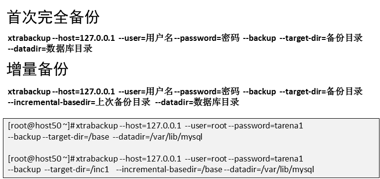
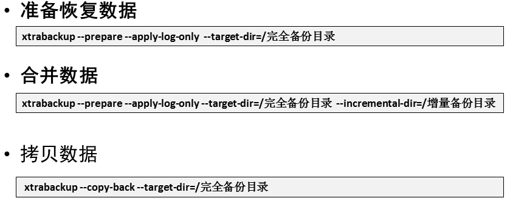
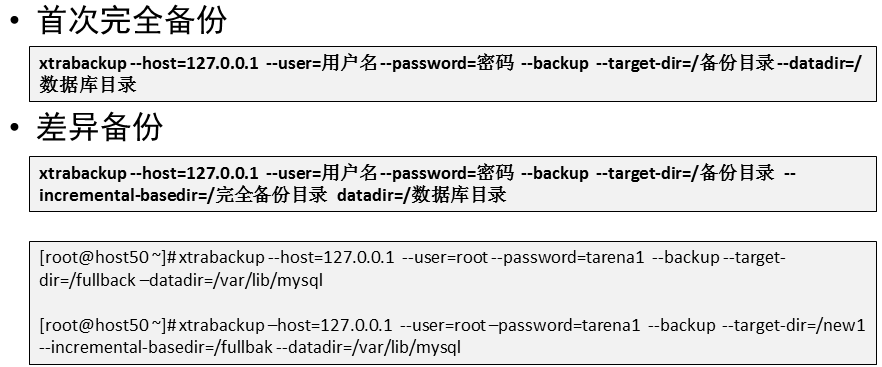
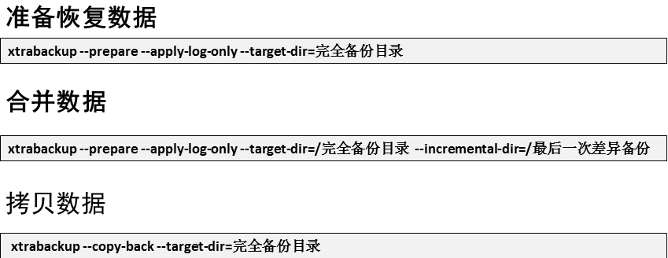

- [学习目标](#学习目标)
- [课堂笔记（命令）](#课堂笔记命令)
  - [数据备份与恢复(完全)](#数据备份与恢复完全)
    - [基本概论](#基本概论)
    - [物理备份](#物理备份)
      - [冷备份](#冷备份)
      - [恢复](#恢复)
    - [逻辑备份](#逻辑备份)
      - [热备份](#热备份)
      - [恢复](#恢复-1)
    - [备份缺点总结](#备份缺点总结)
      - [测试锁表](#测试锁表)
  - [备份软件](#备份软件)
    - [软件安装](#软件安装)
  - [增量备份](#增量备份)
    - [完全增量备份](#完全增量备份)
      - [首次完全备份-1](#首次完全备份-1)
      - [增量备份-2](#增量备份-2)
      - [增量备份-3](#增量备份-3)
      - [增量备份-4](#增量备份-4)
      - [增量备份-5](#增量备份-5)
      - [增量备份-6](#增量备份-6)
      - [增量备份-7](#增量备份-7)
    - [增量恢复](#增量恢复)
      - [数据拷贝](#数据拷贝)
      - [准备恢复数据](#准备恢复数据)
      - [合并数据](#合并数据)
      - [验证](#验证)
  - [差异备份](#差异备份)
    - [完全差异备份](#完全差异备份)
      - [首次完全备份-1](#首次完全备份-1-1)
      - [差异备份-2](#差异备份-2)
      - [差异备份-3](#差异备份-3)
      - [差异备份-4](#差异备份-4)
      - [差异备份-5](#差异备份-5)
      - [差异备份-6](#差异备份-6)
      - [差异备份-7](#差异备份-7)
    - [差异恢复](#差异恢复)
      - [数据拷贝](#数据拷贝-1)
      - [准备恢复数据](#准备恢复数据-1)
      - [合并数据](#合并数据-1)
      - [验证](#验证-1)
  - [增量与差异区别](#增量与差异区别)
  - [binlog日志](#binlog日志)
    - [查询是否启用](#查询是否启用)
    - [修改日志](#修改日志)
    - [测试](#测试)
    - [手动创建新的日志](#手动创建新的日志)
    - [日志相关命令](#日志相关命令)
    - [日志恢复](#日志恢复)
- [课堂笔记（文本）](#课堂笔记文本)
- [快捷键](#快捷键)
- [问题](#问题)
- [补充](#补充)
- [今日总结](#今日总结)
- [昨日复习](#昨日复习)


# 学习目标

数据备份与恢复

binlog日志

# 课堂笔记（命令）

## 数据备份与恢复(完全)

### 基本概论

> 备份数据的范式：
>
> + 数据库服务的状态分：
>   + 热备份：mysql服务处于开启状态
>   + 冷备份 ：mysql服务处于停止状态
> + 根据使用的工具分：
>   + 物理备份：在mysql服务器上将/var/lib/mysql 目录拷贝到一个文件夹或进行打包（尽量关闭服务再进行：cp -rp、tar）
>   + 逻辑备份：在命令行使用mysqldump

### 物理备份

#### 冷备份

```sh
# 使用cp拷贝备份
]#systemctl stop mysqld
]#cp -rp /var/lib/mysql /opt/mysql.bak   # -p保留用户权限复制

# 使用tar进行打包备份
]#cd /var/lib/mysql
]#tar -zcf /opt/mysql.tar.gz ./*
```

#### 恢复

```sh
# 删除数据所有数据
]#rm -rf /var/lib/mysql/*

# 数据恢复
]#cp -rp /opt/mysql.bak /var/lib/mysql/
]#systemctl start mysqld
```

### 逻辑备份

> + 备份的是sql命令
> + 完全备份

#### 热备份

```sh
"完全备份---所有数据库"
]#mkdir /bakdir # 用与存储备份文件
]#mysqldump -uroot -pyyh -A > /bakdir/allbak.sql

"完全备份---某一个库,某多个库"
]#mysqldump -uroot -pyyh -B tarena > /bakdir/tarena.sql
]#mysqldump -uroot -pyyh -B tarena db3 > /bakdir/tarena.sql

"完全备份---某一个库中的某一张表,多张表"
]#mysqldump -uroot -pyyh  tarena salary > /bakdir/tarena_salary.sql
]#mysqldump -uroot -pyyh  tarena salary employees > /bakdir/tarena_salary.sql
```

#### 恢复

> 数据库恢复方法：
>
> 1. sehll命令行恢复
> 2. mysql命令行恢复

```shell
# 删除原有和数据
delete from tarena.salary;

# 命令行恢复
mysql -uroot -pyy < /bakdir/tarena_salary.sql
# mysql命令行恢复(如果恢复表，需要提前进入表所在的库)
mysql>source /bakdir/tarena_salary.sql
```

### 备份缺点总结

> Mysqldump 备份和恢复数据时会锁表，锁表期间无法对表做写访问，mysqldump适合备份数据量比较小的数据在数据库服务器访问量少时候备份。

#### 测试锁表

```sql
"格式"
lock tables 库.标 write;
```

```sql
"
测试50机器锁住tarena.user表
51机器进行访问
解锁时看51机器的反应
"
[root@mysql50 ~]#mysql -uroot -pyyh
mysql>lock tables tarena.user write;

[root@mysql51 ~]#mysql -uwebuser -p123456
mysql>select * from tarena.user; 
# 此时命令行将停止


[root@mysql50 ~]#mysql -uroot -pyyh
mysql>unlock tables; # 当在50机器上执行这个命令后，51机器紧接着就能查询出来
```

## 备份软件

### 软件安装

```sh
# 准备软件包---50机器与51机器需要同时安装
tar -xf percona-xtrabackup-8.0.26-18-Linux-x86_64.glibc2.12-minimal.tar.gz
mv percona-xtrabackup-.. /usr/local/percona
vim /etc/bashrc  # 写入环境变量(最后一行写入)
export PATH=/usr/local/percona/bin:$PATH
source /etc/bashrc
# 安装依赖
yum -y install perl-DBD-MySQL
"软件的好处：备份过程中不锁库表，适合生产环境。支持完全备份与恢复、增量备份与恢复、差异备份与恢复"
```

## 增量备份

> + **备份上次备份后产生的新数据**
> + 对数据做差异备份前，必须现有一次备份，也就是首备份，通常是备份所有和数据（周一完全备份，周二-周日增量备份）

### 完全增量备份

> 以下模仿一周的数据备份过程
>
> 周一：完全备份
>
> 周二-周日：增量备份



#### 首次完全备份-1

```sh
# 使用percona软件对数据库做完全备份
[root@mysql50 ~]# xtrabackup --host=127.0.0.1 --user=root --password=Nyyh --backup --target-dir=/fullbak --datadirdir=/var/lib/mysql
[root@mysql50 ~]# ls -ld /allbak/
drwxr-x--- 11 root root 4096 Jan 17 09:56 /allbak/

[root@mysql50 ~]# cat /allbak/xtrabackup_checkpoints # 查询备份的类型，备份范围
backup_type = full-backuped # 完全备份
from_lsn = 0
to_lsn = 22102196
last_lsn = 22102206
flushed_lsn = 2210219

"插入新数据"
mysql>insert into tarena.salary(date,employee_id,basic,bonus)values("20230710",18,25000,8000);
```

#### 增量备份-2

```sh
[root@mysql50 ~]# xtrabackup --host=127.0.0.1 --user=root --password=yyh --backup --target-dir=/new2 --incremental-basedir=/allbak --datadir=/var/lib/mysql

[root@mysql50 ~]# cat /new2/xtrabackup_checkpoints 
backup_type = incremental  # 增量备
from_lsn = 22102196
to_lsn = 22102723
last_lsn = 22102723
flushed_lsn = 22102723

"插入新数据"
mysql>insert into tarena.salary(date,employee_id,basic,bonus)values("20230710",18,25000,8000);
```

> 由于采用完全+增量备份，所以周一进行完全备份后，后面六天全部采用增量备份，增量备份即每次备份上次备份后产生的新数据，所以周二是增量备份备份周一到周二产生的新数据；
>
> `--incremental-basedir=/allbak` 表示参考周一备份目录
>
> `--target-dir=/new2` 指定存放备份上次备份后产生的新数据目录
>
> --------------
>
> - `from_lsn = 22102196：`这是增量备份的起始LSN。它表示增量备份的起始点，即上一个备份结束时的LSN。
> - `to_lsn = 22102723：`这是增量备份的结束LSN。它表示增量备份的终点，即当前备份结束时的LSN。
> - `last_lsn = 22102723：`这是备份期间最后一个写入的LSN。它表示备份期间最后一个写入到InnoDB数据文件的LSN。
> - `flushed_lsn = 22102723：`这是已刷新到磁盘的LSN。它表示已经被刷新到磁盘的LSN，确保数据持久性。

#### 增量备份-3

```sh
[root@mysql50 ~]# xtrabackup --host=127.0.0.1 --user=root --password=yyh --backup --target-dir=/new3 --incremental-basedir=/new2 --datadir=/var/lib/mysql
[root@mysql50 ~]# cat /new3/xtrabackup_checkpoints 
backup_type = incremental
from_lsn = 22102723
to_lsn = 22108413
last_lsn = 22108423
flushed_lsn = 22108413

"插入新数据"
mysql>insert into tarena.salary(date,employee_id,basic,bonus)values("20230710",18,25000,8000);
```

#### 增量备份-4

```sh
[root@mysql50 ~]# xtrabackup --host=127.0.0.1 --user=root --password=yyh --backup --target-dir=/new4 --incremental-basedir=/new3 --datadir=/var/lib/mysql
[root@mysql50 ~]# cat /new4/xtrabackup_checkpoints 
backup_type = incremental
from_lsn = 22108413
to_lsn = 22112319
last_lsn = 22112329
flushed_lsn = 22112319

"插入新数据"
mysql>insert into tarena.salary(date,employee_id,basic,bonus)values("20230710",18,25000,8000);
```

#### 增量备份-5

```sh
[root@mysql50 ~]# xtrabackup --host=127.0.0.1 --user=root --password=yyh --backup --target-dir=/new5 --incremental-basedir=/new4 --datadir=/var/lib/mysql
[root@mysql50 ~]# cat /new5/xtrabackup_checkpoints 
backup_type = incremental
from_lsn = 22112319
to_lsn = 22115892
last_lsn = 22115892
flushed_lsn = 22115892

"插入新数据"
mysql>insert into tarena.salary(date,employee_id,basic,bonus)values("20230710",18,25000,8000);
```

#### 增量备份-6

```sh
[root@mysql50 ~]# xtrabackup --host=127.0.0.1 --user=root --password=yyh --backup --target-dir=/new6 --incremental-basedir=/new5 --datadir=/var/lib/mysql
[root@mysql50 ~]# ^5^6
cat /new6/xtrabackup_checkpoints 
backup_type = incremental
from_lsn = 22115892
to_lsn = 22119572
last_lsn = 22119572
flushed_lsn = 22119572

"插入新数据"
mysql>insert into tarena.salary(date,employee_id,basic,bonus)values("20230710",18,25000,8000);
```

#### 增量备份-7

```sh
[root@mysql50 ~]# xtrabackup --host=127.0.0.1 --user=root --password=yyh --backup --target-dir=/new7 --incremental-basedir=/new6 --datadir=/var/lib/mysql
[root@mysql50 ~]# ^6^7
cat /new7/xtrabackup_checkpoints 
backup_type = incremental
from_lsn = 22119572
to_lsn = 22123462
last_lsn = 22123462
flushed_lsn = 22123462

"插入新数据"
mysql>insert into tarena.salary(date,employee_id,basic,bonus)values("20230710",18,25000,8000);
```

### 增量恢复



#### 数据拷贝

> 将完全增量备份的数据拷贝到51机器

```sh
scp -r /allback 192.168.88.51:~
scp -r /new* 192.168.88.51:~
```

#### 准备恢复数据

```sh
[root@mysql51 ~]# xtrabackup --prepare --apply-log-only --target-dir=/root/allbak
[root@mysql51 ~]#cat allbak/xtrabackup_checkpoints 
backup_type = log-applied  # 表示可以追加
from_lsn = 0
to_lsn = 22102196
last_lsn = 22102206
flushed_lsn = 22102196
```

#### 合并数据

> [注]：合并数据不能跨天合并，

```sh
[root@mysql51 ~]#vim merge.sh  # 编写脚本合并周二-周日的所有的数据
#!/bin/bash
for i in new{2..7}
do
 xtrabackup --prepare --apply-log-only --target-dir=/root/allbak --incremental-dir=/root/$i
done

[root@mysql51 ~]#cat allbak/xtrabackup_checkpoints 
backup_type = log-applied
from_lsn = 0
to_lsn = 22123462
last_lsn = 22123462
flushed_lsn = 22123462

#  此时所有的allbak里面存放的是这一周的所有备份数据+原始数据
# 停止mysql服务、删除所有mysql数据，进行恢复
[root@mysql51 ~]# systemctl stop mysqld
[root@mysql51 ~]# rm -rf /var/lib/mysql/*
# 自动将数据全部拷贝到 /var/lib/mysql中
[root@mysql51 ~]# xtrabackup --copy-back --target-dir=/fullbak
# 由于是root权限拷贝，所以需要进行归属修改
[root@mysql51 ~]# chown -R mysql:mysql /var/lib/mysql
```

#### 验证

```sh
# 重启服务
[root@mysql51 ~]# systemctl start mysqld
[root@mysql51 ~]# mysql -uroot -pyyh
mysql>
```

## 差异备份

> + 备份完全备份后，新产生的数据
> + 对数据做差异备份前，必须现有一次备份，也就是首备份，通常是备份所有和数据（周一完全备份，周二-周日差异备份）

### 完全差异备份

> 以下模仿一周的数据备份过程
>
> 周一：完全备份
>
> 周二-周日：差异备份



#### 首次完全备份-1

```sh
[root@mysql50 ~]# xtrabackup --host=127.0.0.1 --user=root --password=yyh --backup --target-dir=/fullbak   --datadirdir=/var/lib/mysql

[root@mysql50 ~]# cat /fullbak/xtrabackup_checkpoints 
backup_type = full-backuped
from_lsn = 0
to_lsn = 22123658
last_lsn = 22123658
flushed_lsn = 22123658

"插入新数据"
mysql>insert into tarena.salary(date,employee_id,basic,bonus)values("20230710",18,25000,8000);
```

#### 差异备份-2

```sh
[root@mysql50 ~]# xtrabackup --host=127.0.0.1 --user=root --password=yyh --backup --target-dir=/dir2 --incremental-basedir=/fullbak  --datadir=/var/lib/mysql

[root@mysql50 ~]# cat /dir2/xtrabackup_checkpoints 
backup_type = incremental
from_lsn = 22123482
to_lsn = 22123502
last_lsn = 22123512
flushed_lsn = 22123502

"插入新数据"
mysql>insert into tarena.salary(date,employee_id,basic,bonus)values("20230710",18,25000,8000);
```

> - `--incremental-basedir=/fullbak`: 指定增量备份的基准目录。

#### 差异备份-3

```sh
[root@mysql50 ~]# xtrabackup --host=127.0.0.1 --user=root --password=yyh --backup --target-dir=/dir3 --incremental-basedir=/fullbak  --datadir=/var/lib/mysql

[root@mysql50 ~]# cat /dir3/xtrabackup_checkpoints 
backup_type = incremental
from_lsn = 22123482
to_lsn = 22123558
last_lsn = 22123568
flushed_lsn = 22123558

"插入新数据"
mysql>insert into tarena.salary(date,employee_id,basic,bonus)values("20230710",18,25000,8000);
```

#### 差异备份-4

```sh
[root@mysql50 ~]# xtrabackup --host=127.0.0.1 --user=root --password=yyh --backup --target-dir=/dir4 --incremental-basedir=/fullbak  --datadir=/var/lib/mysql

[root@mysql50 ~]# cat /dir4/xtrabackup_checkpoints 
backup_type = incremental
from_lsn = 22123482
to_lsn = 22123578
last_lsn = 22123588
flushed_lsn = 22123578

"插入新数据"
mysql>insert into tarena.salary(date,employee_id,basic,bonus)values("20230710",18,25000,8000);
```

#### 差异备份-5

```sh
[root@mysql50 ~]# xtrabackup --host=127.0.0.1 --user=root --password=yyh --backup --target-dir=/dir5 --incremental-basedir=/fullbak  --datadir=/var/lib/mysql

[root@mysql50 ~]# ^4^5
cat /dir5/xtrabackup_checkpoints 
backup_type = incremental
from_lsn = 22123482
to_lsn = 22123598
last_lsn = 22123608
flushed_lsn = 22123598

"插入新数据"
mysql>insert into tarena.salary(date,employee_id,basic,bonus)values("20230710",18,25000,8000);
```

#### 差异备份-6

```sh
[root@mysql50 ~]# xtrabackup --host=127.0.0.1 --user=root --password=yyh --backup --target-dir=/dir6 --incremental-basedir=/fullbak  --datadir=/var/lib/mysql

[root@mysql50 ~]# cat /dir6/xtrabackup_checkpoints 
backup_type = incremental
from_lsn = 22123482
to_lsn = 22123618
last_lsn = 22123618
flushed_lsn = 22123618

"插入新数据"
mysql>insert into tarena.salary(date,employee_id,basic,bonus)values("20230710",18,25000,8000);
```

#### 差异备份-7

```sh
[root@mysql50 ~]# xtrabackup --host=127.0.0.1 --user=root --password=yyh --backup --target-dir=/dir7 --incremental-basedir=/fullbak  --datadir=/var/lib/mysql

[root@mysql50 ~]# cat /dir7/xtrabackup_checkpoints 
backup_type = incremental
from_lsn = 22123482
to_lsn = 22123638
last_lsn = 22123638
flushed_lsn = 22123638

"插入新数据"
mysql>insert into tarena.salary(date,employee_id,basic,bonus)values("20230710",18,25000,8000);
```

### 差异恢复



#### 数据拷贝

> 将完全差异备份的数据拷贝到51机器

```sql
scp /fullbak 192.168.88.51:~
scp /fullbak 192.168.88.51:/dir7
```

#### 准备恢复数据

```sh
[root@mysql51 ~]# xtrabackup --prepare --apply-log-only --target-dir=/root/fullbak
```

#### 合并数据

```sh
[root@mysql51 ~]# xtrabackup --prepare --apply-log-only --target-dir=/root/fullbak --incremental-dir=/root/dir7
# 停止服务
[root@mysql51 ~]#systemctl stop mysqld
# 删除所有数据
[root@mysql51 ~]#rm -rf /var/lib/mysql/*
# 数据合并拷贝
[root@mysql51 ~]#xtrabackup --copy-back --target-dir=/root/fullbak
# 给定属组关系
[root@mysql51 ~]#chown -R mysql:mysql /var/lib/mysql
```

#### 验证

```sql
[root@mysql51 ~]#mysql -uroot -pyyh
mysql>select count(*) from tarena.salary;
```

## 增量与差异区别

> 增量备份和差异备份是两种不同的备份策略，它们之间的区别在于备份的内容和备份过程中的处理方式。
>
> 增量备份：
>
> - 增量备份会备份自**上次完整备份或增量备份以来发生更改的数据**。
> - 每次增量备份只会备份自上次备份以来发生的更改，因此备份的数据量相对较小。
> - 恢复数据时，需要应用所有的增量备份，以及最近的完整备份，来还原数据到最新状态。
>
> 差异备份：
>
> - 差异备份会备份自上次完整备份以来发生的所有更改。
> - 每次差异备份会备份自**上次完整备份之后发生的所有更改**，因此备份的数据量会逐渐增加。
> - 恢复数据时，只需要应用最近的完整备份和最近的差异备份，就可以还原数据到最新状态。
>
> 总的来说，增量备份和差异备份的主要区别在于备份的内容和备份过程中的处理方式。增量备份只备份自上次备份以来的更改，而差异备份备份自上次完整备份以来的所有更改。

## binlog日志

> binlog日志文件保存的是，在数据库服务执行的数据库命令（除查询之外的所有命令：select、show、desc等）
>
> “开启一台新机器 52”

### 查询是否启用

```sh
[root@mysql52 ~]# mysql  连接服务
mysql>show master status; # 查看日志文件
+---------------+----------+--------------+------------------+-------------------+
| File          | Position | Binlog_Do_DB | Binlog_Ignore_DB | Executed_Gtid_Set |
+---------------+----------+--------------+------------------+-------------------+
| binlog.000001 |      156 |              |                  |                   |
+---------------+----------+--------------+------------------+-------------------+
 binlog.000001  # 日志文件名
 156 # 偏移量 默认是156,将随机改变
 
 [root@mysql52 ~]#ls /var/lib/mysql
  binlog.index # 日志索引
  binlog.000001 # 日志文件
  # 当 binlog.000001 存储量 > 1GB时 就会增加新的文件 binlog.000002 以此内推，最大999999
```

> + **1GB存储的是日志，也就是在数据库中执行除查询以外的日志**
> + **服务重启也会重新生成新的binlog**
> + **数据库命令中执行flush logs也会生成新的binlog**
> + mysqldump -uroot -p -B 库名 --flush-logs > /存放目录

### 修改日志

> 修改日志的存放地点以及日志名
>
> 默认日志名时binlog

```sh
[root@mysql52 ~]#vim /etc/my.cnf.d/mysql-server.cnf
[mysqld]
log-bin=/mylog/yyh  //定义日志目录和日志文件名(手动添加)

[root@mysql52 ~]#systemctl stop mysqld
[root@mysql52 ~]#mkdir /mylog
[root@mysql52 ~]#chown mysql /mylog # 注意一定要修改组关系，不然不能写入数据
[root@mysql52 ~]#systemctl start mysqld
[root@mysql52 ~]# ls /mylog/
yyh.000001  yyh.index
```

### 测试

> 查看操作后的 Position

```sh
[root@mysql52 ~]# mysql 
mysql> show master status;
+------------+----------+--------------+------------------+-------------------+
| File       | Position | Binlog_Do_DB | Binlog_Ignore_DB | Executed_Gtid_Set |
+------------+----------+--------------+------------------+-------------------+
| yyh.000001 |      156 |              |                  |                   |
+------------+----------+--------------+------------------+-------------------+
mysql> create database yyh;
mysql> show master status;  # 执行了创建操作，此时偏移量已经改变
+------------+----------+--------------+------------------+-------------------+
| File       | Position | Binlog_Do_DB | Binlog_Ignore_DB | Executed_Gtid_Set |
+------------+----------+--------------+------------------+-------------------+
| yyh.000001 |      338 |              |                  |                   |
+------------+----------+--------------+------------------+-------------------+
mysql> use yyh;
mysql> show master status;
+------------+----------+--------------+------------------+-------------------+
| File       | Position | Binlog_Do_DB | Binlog_Ignore_DB | Executed_Gtid_Set |
+------------+----------+--------------+------------------+-------------------+
| yyh.000001 |      338 |              |                  |                   |
+------------+----------+--------------+------------------+-------------------+
mysql> create table home(id int);
mysql> show master status;
+------------+----------+--------------+------------------+-------------------+
| File       | Position | Binlog_Do_DB | Binlog_Ignore_DB | Executed_Gtid_Set |
+------------+----------+--------------+------------------+-------------------+
| yyh.000001 |      526 |              |                  |                   |
+------------+----------+--------------+------------------+-------------------+
```

### 手动创建新的日志

> 默认日志文件容量大于1G时会自动创建新的日志文件，在日志文件没写满时，执行的所有写命令都会保存到当前使用的日志文件里。

```sh
# 刷新前查看
mysql> show master status;
+----------------+----------+--------------+------------------+-------------------+
| File           | Position | Binlog_Do_DB | Binlog_Ignore_DB | Executed_Gtid_Set |
+----------------+----------+--------------+------------------+-------------------+
| mysql52.000001 |      156 |              |                  |                   |
+----------------+----------+--------------+------------------+-------------------+
mysql> flush logs; # 刷新日志
mysql> show master status; # 刷新一次创建一个新日志
+----------------+----------+--------------+------------------+-------------------+
| File           | Position | Binlog_Do_DB | Binlog_Ignore_DB | Executed_Gtid_Set |
+----------------+----------+--------------+------------------+-------------------+
| mysql52.000003 |      156 |              |                  |                   |
+----------------+----------+--------------+------------------+-------------------+
# 只要服务重启就会创建新日志
[root@mysql52 ~]# systemctl  restart mysqld 
[root@mysql52 ~]# mysql  # 连接服务
Mysql> show master status; # 查看日志
+----------------+----------+--------------+------------------+-------------------+
| File           | Position | Binlog_Do_DB | Binlog_Ignore_DB | Executed_Gtid_Set |
+----------------+----------+--------------+------------------+-------------------+
| mysql52.000004 |      156 |              |                  |                   |
+----------------+----------+--------------+------------------+-------------------+
[root@mysql52 ~]#
# 完全备份后创建新的日志文件，创建的日志个数和备份库的个数一致
[root@mysql52 ~]# mysqldump  --flush-logs  mysql user > user.sql
[root@mysql52 ~]# mysql -e 'show master status'
+----------------+----------+--------------+------------------+-------------------+
| File           | Position | Binlog_Do_DB | Binlog_Ignore_DB | Executed_Gtid_Set |
+----------------+----------+--------------+------------------+-------------------+
| mysql52.000005 |      156 |              |                  |                   |
+----------------+----------+--------------+------------------+-------------------+
[root@mysql52 ~]# mysqldump  --flush-logs  -B mysql db1 > db_2.sql
[root@mysql52 ~]# mysql -e 'show master status'
+----------------+----------+--------------+------------------+-------------------+
| File           | Position | Binlog_Do_DB | Binlog_Ignore_DB | Executed_Gtid_Set |
+----------------+----------+--------------+------------------+-------------------+
| mysql52.000007 |      156 |              |                  |                   |
+----------------+----------+--------------+------------------+-------------------+
```

### 日志相关命令

```sh
[root@mysql52 ~]#mysql
mysql>show binary logs; # 查看当前系已有的日志文件
mysql> show binary logs;
+------------+-----------+-----------+
| Log_name   | File_size | Encrypted |
+------------+-----------+-----------+
| yyh.000001 |       567 | No        |
| yyh.000002 |       197 | No        |
| yyh.000003 |       197 | No        |
| yyh.000004 |       197 | No        |
| yyh.000005 |       156 | No        |
+------------+-----------+-----------+
mysql> show master status; # 查看正在使用的
+------------+----------+--------------+------------------+-------------------+
| File       | Position | Binlog_Do_DB | Binlog_Ignore_DB | Executed_Gtid_Set |
+------------+----------+--------------+------------------+-------------------+
| yyh.000005 |      156 |              |                  |                   |
+------------+----------+--------------+------------------+-------------------+
mysql> purge master logs  to  "yyh.000004"; # 删除日志文件名之前的所有日志文件
mysql>reset master # 删除所有日志（不执行）
mysql> show binary logs;
+------------+-----------+-----------+
| Log_name   | File_size | Encrypted |
+------------+-----------+-----------+
| yyh.000004 |       197 | No        |
| yyh.000005 |       156 | No        |
+------------+-----------+-----------+
mysql> show binlog events in "yyh.000005";  # 查询日志内容
Log_name：   日志文件名。
Pos：         命令在日志文件中的起始位置。
Event_type： 事件类型，例如 Query、Table_map、Write_rows 等。
Server_id：  服务器 ID。
End_log_pos：命令在文件中的结束位置，以字节为单位。
Info：执行命令信息
+------------+-----+----------------+-----------+-------------+-----------------------------------+
| Log_name   | Pos | Event_type     | Server_id | End_log_pos | Info                              |
+------------+-----+----------------+-----------+-------------+-----------------------------------+
| yyh.000005 |   4 | Format_desc    |         1 |         125 | Server ver: 8.0.26, Binlog ver: 4 |
| yyh.000005 | 125 | Previous_gtids |         1 |         156 |                                   |
+------------+-----+----------------+-----------+-------------+-----------------------------------+

```

### 日志恢复

**数据准备**

```sql
[root@mysql52 ~]#mysql
mysql> reset master;
mysql> show master status;
+------------+----------+--------------+------------------+-------------------+
| File       | Position | Binlog_Do_DB | Binlog_Ignore_DB | Executed_Gtid_Set |
+------------+----------+--------------+------------------+-------------------+
| yyh.000001 |      156 |              |                  |                   |
+------------+----------+--------------+------------------+-------------------+
1 row in set (0.00 sec)
mysql> create database gamedb;
mysql> create table gamedb.user(name char(10), calss char(3));
mysql> insert into gamedb.user values("byb","nsd");
mysql> insert into gamedb.user values("byb","nsd");
mysql> insert into gamedb.user values("byb","nsd");
mysql> insert into gamedb.user values("byb","nsd");
mysql> select * from gamedb.user;
+------+-------+
| name | calss |
+------+-------+
| byb  | nsd   |
| byb  | nsd   |
| byb  | nsd   |
| byb  | nsd   |
+------+-------+
4 rows in set (0.00 sec)
"将日志文件拷贝到50机器进行恢复"
[root@mysql52 ~]#scp /mylog/yyh.000001 192.168.88.50:~
```

**开始恢复**

```sh
[root@mysql50 ~]#mysqlbinlog yyh.000001 | mysql -uroot -pyyh
[root@mysql50 ~]#mysql -uroot -pyyh -e "select * from gamedb.user"
+------+-------+
| name | calss |
+------+-------+
| byb  | nsd   |
| byb  | nsd   |
| byb  | nsd   |
| byb  | nsd   |
+------+-------+
```

```sh
"mysqlbinlog 系统命令可用于导出binlog日志,如果不重定向将输出到屏幕"
[root@mysql50 ~]#mysqlbinlog yyh.000001 > /opt/log.txt
```

# 课堂笔记（文本）


# 快捷键


# 问题


# 补充


# 今日总结


# 昨日复习