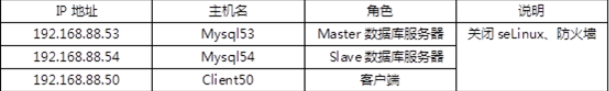

- [学习目标](#学习目标)
- [课堂笔记（命令）](#课堂笔记命令)
- [课堂笔记（文本）](#课堂笔记文本)
  - [主从同步](#主从同步)
    - [服务器准备](#服务器准备)
    - [配置主服务器](#配置主服务器)
      - [启用binlog日志](#启用binlog日志)
      - [用户授权](#用户授权)
      - [查看日志信息](#查看日志信息)
    - [配置从服务器](#配置从服务器)
      - [指定服务id](#指定服务id)
      - [指定主服务器](#指定主服务器)
      - [启动slave进程](#启动slave进程)
      - [查看状态信息](#查看状态信息)
    - [验证主从同步](#验证主从同步)
- [快捷键](#快捷键)
- [问题](#问题)
- [补充](#补充)
- [今日总结](#今日总结)
- [昨日复习](#昨日复习)


# 学习目标

MySQL主从同步

数据读写分离

# 课堂笔记（命令）


# 课堂笔记（文本）

## 主从同步

### 服务器准备



> 安装mysql、mysql-server服务

### 配置主服务器

#### 启用binlog日志

```sh
# 查询系统是否启用
[root@mysql53 ~]#mysql -e "show master status" # 有数据显示，且偏移量为156(默认是开启)
# 修改数据库主配置文件
[root@mysql53 ~]#vim /etc/my.cnf.d/mysql-server.cnf
[mysqld]
server-id=53 # 标识主从结构中的编号（唯一性）
log-bin=mysql53 # 指定日志名，不写路径默认存放在mysql目录
[root@mysql53 ~]#systemctl restart mysqld
```

#### 用户授权

> 用于授权给从服务器有权限下载主服务器的binlog日志
>
> replication slave  允许拷贝binlog日志权限

```sql
[root@mysql53 ~]#mysql
mysql>create user repluser@'%' identified by "123456";
mysql>grant replication slave on *.* to repluser@'%';
mysql>flush privileges;
```

#### 查看日志信息

> 主要看binlog文件名，偏移量值

```sh
mysql> show master status;
+----------------+----------+--------------+------------------+-------------------+
| File           | Position | Binlog_Do_DB | Binlog_Ignore_DB | Executed_Gtid_Set |
+----------------+----------+--------------+------------------+-------------------+
| mysql53.000001 |     1475 |              |                  |                   |
+----------------+----------+--------------+------------------+-------------------+
```

> show slave status\G  # 为空则表示不是从服务器,可用于检查当前数据库服务器是否为主
>

### 配置从服务器

#### 指定服务id

```sh
[root@mysql54 ~]#vim /etc/my.cnf.d/mysql-server.cnf
[mysqld]
server_id=54 # -或_都可以
[root@mysql54 ~]#systemctl restart mysqld
```

#### 指定主服务器

```perl
"验证主创建的用户是否可以登陆"
[root@mysql54 ~]#mysql -h192.168.88.53 -urepluser -p123456
mysql>exit
[root@mysql54 ~]#mysql
mysql> change master to  master_host="192.168.88.53" , master_user="repluser" , master_password="123456" ,master_log_file="mysql53.000001" , master_log_pos=1475;  # 指定主服务器的信息
```

> `master_log_file="mysql53.000001"`：指定主服务器当前的binlog日志文件名
>
> `master_log_pos=1475`：指定binlog的偏移量Position
>
> ------------
>
> `change master to`首次为指定，再次为修改

#### 启动slave进程

```perl
mysql>start slave; # 启动slave进程
```

#### 查看状态信息

```perl
mysql>show slave status\G
*************************** 1. row ***************************
               Slave_IO_State: Waiting for source to send event
                  Master_Host: 192.168.88.53
                  Master_User: repluser
                  Master_Port: 3306
                Connect_Retry: 60
              Master_Log_File: mysql53.000001
          Read_Master_Log_Pos: 667
               Relay_Log_File: mysql54-relay-bin.000002
                Relay_Log_Pos: 322
        Relay_Master_Log_File: mysql53.000001
             Slave_IO_Running: Yes   //IO线程
            Slave_SQL_Running: Yes   //SQL线程
            ....
```

> `Slave_IO_Running: Yes `  //IO线程  都为yes表示配置成功
> `Slave_SQL_Running: Yes`   //SQL线程

### 验证主从同步

```sh
[root@mysql53 ~]#mysql -e "create database dbas"
[root@mysql54 ~]#mysql -e "create table dbas.a(id int)"
[root@mysql54 ~]#mysql -e "insert into dbas.a values(1)"


[root@mysql53 ~]#mysql -e "show databases"
+--------------------+
| Database           |
+--------------------+
| dbas               |  
| information_schema |
| mysql              |
| performance_schema |
| sys                |
+--------------------+
[root@mysql53 ~]#mysql -e "select * from dbas.a"
+------+
| id   |
+------+
|    1 |
+------+
```


# 快捷键


# 问题


# 补充


# 今日总结


# 昨日复习