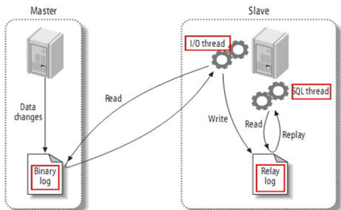
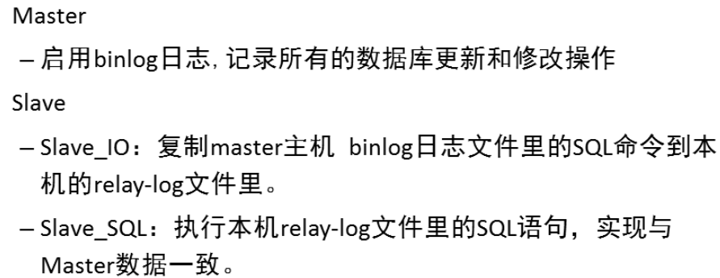
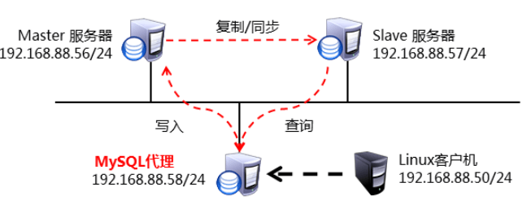
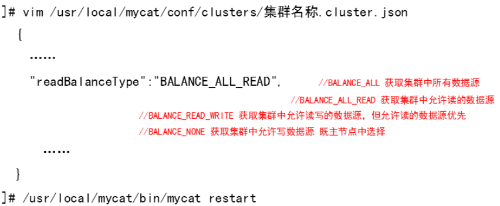

- [学习目标](#学习目标)
- [课堂笔记（命令）](#课堂笔记命令)
- [课堂笔记（文本）](#课堂笔记文本)
  - [主从同步](#主从同步)
    - [服务器准备](#服务器准备)
    - [配置主服务器](#配置主服务器)
      - [启用binlog日志](#启用binlog日志)
      - [用户授权](#用户授权)
      - [查看日志信息](#查看日志信息)
    - [配置从服务器](#配置从服务器)
      - [指定服务id](#指定服务id)
      - [指定主服务器](#指定主服务器)
      - [启动slave进程](#启动slave进程)
      - [查看状态信息](#查看状态信息)
    - [验证主从同步](#验证主从同步)
    - [主从同步原理](#主从同步原理)
    - [排错](#排错)
  - [一主多从同步](#一主多从同步)
    - [服务准备](#服务准备)
    - [修改主配置文件](#修改主配置文件)
    - [数据一致](#数据一致)
    - [指定主服务器](#指定主服务器-1)
    - [验证主从同步](#验证主从同步-1)
  - [数据读写分离](#数据读写分离)
    - [相关概念](#相关概念)
    - [实现的方式](#实现的方式)
    - [准备软件包](#准备软件包)
    - [配置主从](#配置主从)
    - [安装mycat](#安装mycat)
    - [配置mycat](#配置mycat)
    - [启动mycat服务](#启动mycat服务)
    - [连接mycat](#连接mycat)
    - [添加数据源](#添加数据源)
    - [添加用户](#添加用户)
    - [创建集群](#创建集群)
    - [指定数据库服务角色](#指定数据库服务角色)
    - [修改策略](#修改策略)
    - [测试配置](#测试配置)
      - [创建数据库](#创建数据库)
      - [指定存储集群](#指定存储集群)
      - [客户端测试](#客户端测试)
- [快捷键](#快捷键)
- [问题](#问题)
- [补充](#补充)
- [今日总结](#今日总结)
- [昨日复习](#昨日复习)


# 学习目标

MySQL主从同步

数据读写分离

# 课堂笔记（命令）


# 课堂笔记（文本）

## 主从同步

### 服务器准备


> 安装mysql、mysql-server服务

### 配置主服务器

#### 启用binlog日志

```sh
# 查询系统是否启用
[root@mysql53 ~]#mysql -e "show master status" # 有数据显示，且偏移量为156(默认是开启)
# 修改数据库主配置文件
[root@mysql53 ~]#vim /etc/my.cnf.d/mysql-server.cnf
[mysqld]
server-id=53 # 标识主从结构中的编号（唯一性）
log-bin=mysql53 # 指定日志名，不写路径默认存放在mysql目录
[root@mysql53 ~]#systemctl restart mysqld
```

#### 用户授权

> 用于授权给从服务器有权限下载主服务器的binlog日志
>
> replication slave  允许拷贝binlog日志权限

```sql
[root@mysql53 ~]#mysql
mysql>create user repluser@'%' identified by "123456";
mysql>grant replication slave on *.* to repluser@'%';
mysql>flush privileges;
```

#### 查看日志信息

> 主要看binlog文件名，偏移量值

```sh
mysql> show master status;
+----------------+----------+--------------+------------------+-------------------+
| File           | Position | Binlog_Do_DB | Binlog_Ignore_DB | Executed_Gtid_Set |
+----------------+----------+--------------+------------------+-------------------+
| mysql53.000001 |     1475 |              |                  |                   |
+----------------+----------+--------------+------------------+-------------------+
```

> show slave status\G  # 为空则表示不是从服务器,可用于检查当前数据库服务器是否为主
>

### 配置从服务器

#### 指定服务id

```sh
[root@mysql54 ~]#vim /etc/my.cnf.d/mysql-server.cnf
[mysqld]
server_id=54 # -或_都可以
[root@mysql54 ~]#systemctl restart mysqld
```

#### 指定主服务器

```perl
"验证主创建的用户是否可以登陆"
[root@mysql54 ~]#mysql -h192.168.88.53 -urepluser -p123456
mysql>exit
[root@mysql54 ~]#mysql
mysql> change master to  master_host="192.168.88.53" , master_user="repluser" , master_password="123456" ,master_log_file="mysql53.000001" , master_log_pos=1475;  # 指定主服务器的信息
```

> `master_log_file="mysql53.000001"`：指定主服务器当前的binlog日志文件名
>
> `master_log_pos=1475`：指定binlog的偏移量Position
>
> ------------
>
> `change master to`首次为指定，再次为修改

#### 启动slave进程

```perl
mysql>start slave; # 启动slave进程
```

#### 查看状态信息

```perl
mysql>show slave status\G
*************************** 1. row ***************************
               Slave_IO_State: Waiting for source to send event
                  Master_Host: 192.168.88.53
                  Master_User: repluser
                  Master_Port: 3306
                Connect_Retry: 60
              Master_Log_File: mysql53.000001
          Read_Master_Log_Pos: 667
               Relay_Log_File: mysql54-relay-bin.000002
                Relay_Log_Pos: 322
        Relay_Master_Log_File: mysql53.000001
             Slave_IO_Running: Yes   //IO线程
            Slave_SQL_Running: Yes   //SQL线程
            ....
```

> `Slave_IO_Running: Yes `  //IO线程  都为yes表示配置成功
> `Slave_SQL_Running: Yes`   //SQL线程

### 验证主从同步

```sh
[root@mysql53 ~]#mysql -e "create database dbas"
[root@mysql54 ~]#mysql -e "create table dbas.a(id int)"
[root@mysql54 ~]#mysql -e "insert into dbas.a values(1)"


[root@mysql53 ~]#mysql -e "show databases"
+--------------------+
| Database           |
+--------------------+
| dbas               |  
| information_schema |
| mysql              |
| performance_schema |
| sys                |
+--------------------+
[root@mysql53 ~]#mysql -e "select * from dbas.a"
+------+
| id   |
+------+
|    1 |
+------+
```

### 主从同步原理





> 从服务器通过IO线程同步主服务器的binlog日志，写入到从服务器的终极日志中(Relay log)再通过SQL线程读取终极日志

### 排错

> Slave_IO_Running: NO 
>
> Last_IO_Error:    记录报错的日志（在查看从状态信息下面）
>
> **原因：**通常是change master to 配置项不正确;其余原因查看报错解决
>
> **解决办法：**重新指定一遍主服务器；或重新配置虚拟机
>
> ```sql
> stop slave;
> change master to xx ;
> ```
>
> -----
>
> Slave_SQL_Running: NO
>
> Last_SQL_Error:  记录报错的日志（在查看从状态信息下面）
>
> **原因：**通常是执行终极日志(Relay log)SQL命令冲突报错导致（服务器突然关机，导致主从结构坏掉：恢复后从服务器再次执行上次的终极日志，原先执行的建库建表操作会再次执行，由于不允许出现重名的库名，此时SQLthread就会标记会NO）
>
> **解决办法：**
>
> + 删除关机前同步过来的一些建库或建表
> + 建表时加上 is not exists 用于屏蔽报错
> + 配置多从结构

## 一主多从同步

### 服务准备

> 添加一台服务器：55 安装mysql服务

### 修改主配置文件

```sh
[root@mysql55 ~]# vim /etc/my.cnf.d/mysql-server.cnf
[mysqld]
server-id=55
....
[root@mysql55 ~]# systemctl restart mysqld
```

### 数据一致

> 确保与主服务器数据一致，保证此时的数据库与主数据库的数据表一致，以防搭建成功后出现库表不一致导致数据无法写入而报错

```sh
[root@mysql53 ~]# mysql -e 'show master status' # 查询主服务器的日志文件与偏移量
+----------------+----------+--------------+------------------+-------------------+
| File           | Position | Binlog_Do_DB | Binlog_Ignore_DB | Executed_Gtid_Set |
+----------------+----------+--------------+------------------+-------------------+
| mysql53.000003 |      156 |              |                  |                   |
+----------------+----------+--------------+------------------+-----------------
# 拷贝主服务器的做完全备份
[root@mysql53 ~]# mysqldump -B dbas > /dbas.sql
[root@mysql53 ~]# scp /dbas.sql 192.168.88.55:~
# 导入备份数据
[root@mysql55 ~]#mysql < dbas.sql
```

### 指定主服务器

```perl
[root@mysql55 ~]#mysql
mysql>change master to  master_host="192.168.88.53" , master_user="repluser" , master_password="123456" ,master_log_file="mysql53.000003" , master_log_pos=156; 
mysql>start slave;
....
Slave_IO_Running: Yes  # 表示成功
Slave_SQL_Running: Yes
.....
mysql>show databases;
+--------------------+
| Database           |
+--------------------+
| dbas               |
| information_schema |
| mysql              |
| performance_schema |
| sys                |
+--------------------+
```

### 验证主从同步

```sh
[root@mysql53 ~]#mysql -e "insert into dbas.a values(123)"

"从服务器54机器查看同步情况"
[root@mysql54 ~]#mysql -e "select * from dbas.a"
    -> ;
+------+
| id   |
+------+
|    1 |
|  123 |
+------+

"从服务器55机器查看同步情况"
[root@mysql54 ~]#mysql -e "select * from dbas.a"
+------+
| id   |
+------+
|    1 |
|  123 |
+------+
```

## 数据读写分离



### 相关概念

> 将数据的读操作和写操作分别分配到不同的服务器上，通过这种方式可以提高数据库的并发处理能力和性能、降低系统失败的风险。保证负责读访问主机与负责写访问主机的数据一致

### 实现的方式

> + 人肉分离，手动指定读或写服务器
> + 搭建读写分离服务器，通过服务自动区分读写

### 准备软件包

> 下载mycat2软件包
>
> mycat2-install-template-1.21.zip
> mycat2-1.21-release-jar-with-dependencies.jar

### 配置主从

> 56：主
>
> 57：从

```sh
[root@mysql56 ~]# vim /etc/my.cnf.d/mysql-server.cnf
[mysqld]
server-id=56
log-bin=mysql56
[root@mysql56 ~]# systemctl restart mysqld
[root@mysql56 ~]# mysql
mysql>create user repluser@"%" identified by "123456";
mysql>grant replication slave on *.* to repluser@"%";
mysql>show master status;
+----------------+----------+--------------+------------------+-------------------+
| File           | Position | Binlog_Do_DB | Binlog_Ignore_DB | Executed_Gtid_Set |
+----------------+----------+--------------+------------------+-------------------+
| mysql56.000001 |      156 |              |                  |                   |
+----------------+----------+--------------+------------------+------------------
```

```sh
[root@mysql57 ~]# vim /etc/my.cnf.d/mysql-server.cnf
[mysqld]
server-id=57
[root@mysql57 ~]#mysql
mysql>change master to master_host="192.168.88.56",master_user="repluser",master_password="123456",master_log_file="mysql56.000001",master_log_pos=156; 
mysql>start slave;
.....
Slave_IO_Running: Yes
Slave_SQL_Running: Yes
....
```

### mycat工作过程


### 安装mycat

```sh
# 安装所需依赖
[root@mycat58 ~]#yum -y install java-1.8.0-openjdk.x86_64
[root@mycat58 ~]#yum -y install unzip
[root@mycat58 ~]#unzip mycat2-install-template-1.21.zip
[root@mycat58 ~]#mv /mycat /usr/local/
[root@mycat58 ~]# cp mycat2-1.21-release-jar-with-dependencies.jar  /usr/local/mycat/lib/
# 配置权限
[root@mycat58 ~]# chmod -R 777 /usr/local/mycat/ 
```

### 配置mycat

```sh
# 配置mycat用户账密
[root@mycat58 ~]#vim /usr/local/mycat/conf/users/root.user.json
{
        "dialect":"mysql",
        "ip":null,
        "password":"654321",  # 设置密码
        "transactionType":"proxy",
        "username":"mycat" # 设置账号
}

# 配置连接的数据库
[root@mycat58 ~]# vim +15 /usr/local/mycat/conf/datasources/prototypeDs.datasource.json  
.....
{
....
"password":"123456",
....
"user":"yyh",
....
}

# 安装mysql服务,创建配置用户
[root@mycat58 ~]#yum -y install mysql-server mysql
[root@mycat58 ~]#systemctl enable mysqld --now
[root@mycat58 ~]#mysql
mysql>create user yyh@"localhost" identified by "123456";
mysql>grant all on *.* to yyh@"localhost";
[root@mycat58 ~]#mysql -uyyh -p123456
mysql>
```

### 启动mycat服务

```sh
# 查询mycat帮助
[root@mycat58 ~]#/usr/local/mycat/bin/mycat --help
Usage: /usr/local/mycat/bin/mycat { console | start | stop | restart | status | dump }
# 启动
[root@mycat58 ~]#/usr/local/mycat/bin/mycat start
[root@mycat58 ~]#ss -ntulp|grep 8066  # 默认监听8066端口
```

### 连接mycat

```sh
# 输入mycat账户和密码
[root@mycat58 ~]#mysql -h127.0.0.1 -P8066 -umycat -p654321
mysql>show databases;
+--------------------+
| `Database`         |
+--------------------+
| information_schema |
| mysql              |
| performance_schema |
+--------------------+
```

### 添加数据源

```sh
[root@mycat58 ~]#mysql -h127.0.0.1 -P8066 -umycat -p654321
mysql>/*+ mycat:createdatasource{
"name":"whost56", "url":"jdbc:mysql://192.168.88.56:3306","user":"yyha","password":"123456"}*/;
mysql>/*+ mycat:createdatasource{
"name":"rhost57", "url":"jdbc:mysql://192.168.88.57:3306","user":"yyha","password":"123456"}*/;
"查看添加数据源情况"
mysql> /*+mycat:showDataSources{}*/ \G
[root@mycat58 conf]# ls /usr/local/mycat/conf/datasources/
prototypeDs.datasource.json  rhost57.datasource.json  whost56.datasource.json
```

### 添加用户

```sh
[root@mysql56 ~]# mysql
mysql>create user yyha@"%" identified by "123456";
mysql>grant all on *.* to yyha@"%";

# 再slave服务器查看是否同步成功
[root@mysql57 ~]# mysql -e 'select user , host from mysql.user where user="yyha"'
+------+------+
| user | host |
+------+------+
| yyha | %    |
+------+------+
```

### 创建集群

```sh
[root@mycat58 ~]# mysql -h127.0.0.1 -P8066 -umycat -p654321
mysql>/*!mycat:createcluster{
"name":"rwcluster", # 集群名
"masters":["whost56"], # 写添加数据源时的name
"replicas":["rhost57"]
}*/ ;
# 查看集群信息
mysql>/*+ mycat:showClusters{}*/ \G

#  查看创建的集群文件信息
[root@mycat58 conf]# ls /usr/local/mycat/conf/clusters/
prototype.cluster.json  rwcluster.cluster.json
```

### 指定数据库服务角色

> master角色负责写
>
> slave角色负责读

```sh
[root@mycat58 ~]#sed -i "s/READ_WRITE/READ/" /usr/local/mycat/conf/datasources/rost57.datasource.json
[root@mycat58 ~]#sed -i "s/READ_WRITE/WRITE" /usr/local/mycat/conf/datasources/whost56.datasource.json
```

### 修改策略

> 集群处理查询访问的方式



```sh
[root@mycat58 ~]# vim /usr/local/mycat/conf/clusters/rwcluster.cluster.json 
[root@mycat58 ~]#sed -i "s/BALANCE_ALL/BALANCE_ALL_READ/" /usr/local/mycat/conf/clusters/rwcluster.cluster.json 
```

### 测试配置

#### 创建数据库

```sh
[root@mycat58 ~]# mysql -h127.0.0.1 -P8066 -umycat -p654321 
mysql> create database testdb;
```

#### 指定存储集群

```sh
[root@mycat58 ~]# vim /usr/local/mycat/conf/schemas/tarena.schema.json 
{
.......
        "schemaName":"tarena",
        "targetName":"rwcluster", # 指定使用的集群
.........
}
# 重启服务
[root@mycat58 ~]#/usr/local/mycat/bin/mycat restart
[root@mycat58 ~]#ss -ntulp|grep 8066
```

#### 客户端测试

```sql
"50机器做为客户端，插入一条记录，查询主从服务器"
[root@mycat58 ~]#mysql -h192.168.88.58 -P8066 -umycat -p654321
mysql>show databases;
mysql>create table tarena.user(id int,name char(10));
mysql>insert into tarena.user values(1,"yyh");

"主服务器：写服务器"
[root@mysql56 ~]# mysql -e "select * from tarena.user"
+------+------+
| id   | name |
+------+------+
|    1 | yyh  |
+------+------+

"从服务器：读服务器"
[root@mysql57 ~]# mysql -e "select * from tarena.user"
+------+------+
| id   | name |
+------+------+
|    1 | yyh  |
+------+------+
```

**测试读写分离**

```sh
"
1.在从服务器上插入一条数据
2.查询主服务器是否同步(主是写，从是读)
3.通过客户端去查询是否能看到在从服务器上插入的数据
"

"在从(读)服务器上添加一条数据"
[root@mysql57 ~]# mysql -e 'insert into tarena.user values (2,"cxj")'
[root@mysql57 ~]# mysql -e "select * from tarena.user"
+------+------+
| id   | name |
+------+------+
|    1 | yyh  |
|    2 | cxj  |
+------+------+

"在主(写)服务器上进行查询"
[root@mysql56 ~]# mysql -e "select * from tarena.user"
+------+------+
| id   | name |
+------+------+
|    1 | yyh  |
+------+------+


"客户端机器上查询"
[root@mysql50 ~]# mysql -umycat -h192.168.88.58 -P8066 -p654321 -e "select * from tarena.user"
mysql: [Warning] Using a password on the command line interface can be insecure.
+------+------+
| id   | name |
+------+------+
|    1 | yyh  |
|    2 | cxj  |
+------+------+
```

> 通过以上测试验证了，主负责写，从负责读，当用户访问数据库查询时将请求给到从服务器

# 快捷键


# 问题


# 补充


# 今日总结


# 昨日复习