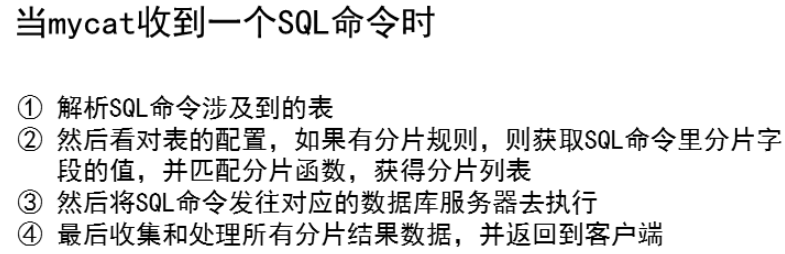

- [学习目标](#学习目标)
- [课堂笔记（命令）](#课堂笔记命令)
- [课堂笔记（文本）](#课堂笔记文本)
  - [mysql分布式存储](#mysql分布式存储)
    - [环境准备](#环境准备)
    - [配置主从](#配置主从)
    - [配置mycat](#配置mycat)
- [快捷键](#快捷键)
- [问题](#问题)
- [补充](#补充)
- [今日总结](#今日总结)
- [昨日复习](#昨日复习)


# 学习目标

数据分片概述

搭建mysql分布式存储

# 课堂笔记（命令）

# 课堂笔记（文本）

## mysql分布式存储

### 环境准备



### 配置主从

> 59-60 搭建主从
>
> 61-62 搭建主从
>
> 以59主-60从为例

```sh
"
1.安装mysql服务
2.启用binlog日志,添加唯一标识
3.重启服务，生效配置,show master status 获取binlog信息
4.创建从服务器访问binlog日志的用户repluser
5.从服务器配置唯一标识
6.启动mysql服务
7.在从服务器上配置连接主服务器的配置
"
# 主服务器操作
[root@master59 ~]#vim /etc/my.cnf.d/mysql-server.cnf
[mysqld]
server-id=59
lob-bin=mysql59
[root@master59 ~]#systemctl enable mysqld --now
[root@master59 ~]#mysql
mysql>create user repluser@"%" identified by "123456";
mysql>grant replication on *.* to repluser@"%";
mysql>show master status;
+----------------+----------+--------------+------------------+-------------------+
| File           | Position | Binlog_Do_DB | Binlog_Ignore_DB | Executed_Gtid_Set |
+----------------+----------+--------------+------------------+-------------------+
| mysql59.000001 |      667 |              |                  |                   |
+----------------+----------+--------------+------------------+-------------------+

# 配置从服务器
[root@master60 ~]#vim /etc/my.cnf.d/mysql-server.cnf
[mysqld]
server-id=60
[root@master59 ~]#systemctl enable mysqld --now
[root@master59 ~]#mysql
mysql> change master to  master_host="192.168.88.59" , master_user="repluser" , master_password="123456" ,master_log_file="mysql59.000001" , master_log_pos=667;
mysql>start slave;
mysql>show slave status\G
    Slave_IO_Running: Yes   
    Slave_SQL_Running: Yes   
```

### 配置mycat

```sh
//安装jdk
[root@mycat63 ~]# yum -y install java-1.8.0-openjdk.x86_64
//安装mycat
[root@mycat63 ~]# which unzip || yum -y  install unzip
[root@mycat63 ~]# unzip mycat2-install-template-1.21.zip
[root@mycat63 ~]# mv mycat /usr/local/
//安装依赖
[root@mycat63 ~]# cp mycat2-1.21-release-jar-with-dependencies.jar  /usr/local/mycat/lib/
//修改权限
[root@mycat63 ~]# chmod -R 777 /usr/local/mycat/
```

**定义客户端连接时使用的用户**

```sh
[root@mycat63 ~]# vim  /usr/local/mycat/conf/users/root.user.json
{
        "dialect":"mysql",
        "ip":null,
        "password":"654321",
        "transactionType":"proxy",
        "username":"mycat"
}
```

**定义连接的数据库服务**

```sh
[root@mycat63 ~]# vim  /usr/local/mycat/conf/datasources/prototypeDs.data
{
....
"password":"123456"
.....
"user":"yyh"
}
```

**运行数据库**

```sh
[root@mycat63 ~]# yum -y  install  mysql-server  mysql
[root@mycat63 ~]# systemctl start mysqld
# 创建yyh用户
[root@mycat63 ~]# mysql
mysql> create user yyh@"%" identified by "123456"; 
mysql> grant all on *.* to yyh@"%" ; 
```

**启动mycat服务**

```sh
[root@mycat63 ~]# /usr/local/mycat/bin/mycat start
[root@mycat63 ~]# netstat  -utnlp  | grep 8066
tcp6       0      0 :::8066  :::*       LISTEN      57015/java 
```


# 快捷键


# 问题


# 补充


# 今日总结


# 昨日复习