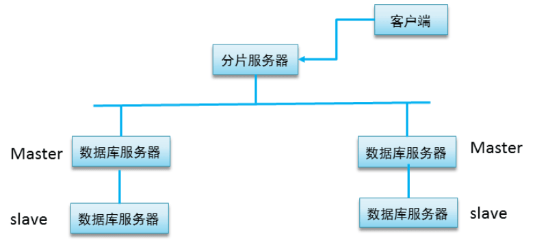
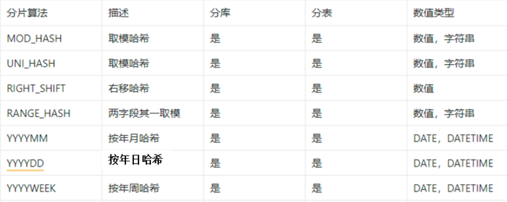
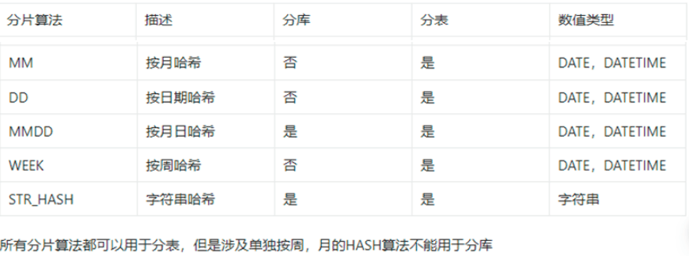
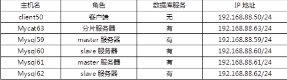
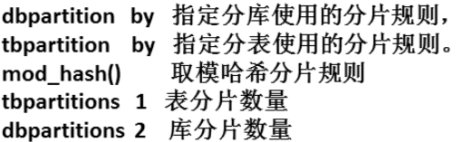

- [学习目标](#学习目标)
- [课堂笔记（命令）](#课堂笔记命令)
- [课堂笔记（文本）](#课堂笔记文本)
  - [数据分片](#数据分片)
    - [概述](#概述)
    - [分片拓扑结构](#分片拓扑结构)
    - [分片规则](#分片规则)
  - [mysql分布式存储](#mysql分布式存储)
    - [环境准备](#环境准备)
    - [配置主从](#配置主从)
    - [配置mycat](#配置mycat)
    - [添加数据源](#添加数据源)
    - [配置数据库服务器用户](#配置数据库服务器用户)
    - [创建集群](#创建集群)
  - [测试配置](#测试配置)
    - [前期准备](#前期准备)
    - [全局表](#全局表)
      - [创建](#创建)
      - [插入数据](#插入数据)
    - [分片表](#分片表)
      - [创建](#创建-1)
      - [验证](#验证)
      - [插入数据](#插入数据-1)
    - [ER表](#er表)
      - [创建](#创建-2)
      - [验证](#验证-1)
      - [插入数据](#插入数据-2)
- [快捷键](#快捷键)
- [问题](#问题)
- [补充](#补充)
- [今日总结](#今日总结)
- [昨日复习](#昨日复习)


# 学习目标

数据分片概述

搭建mysql分布式存储

# 课堂笔记（命令）

# 课堂笔记（文本）

## 数据分片

### 概述

> 数据分片是指将一个数据库中的数据水平拆分为多个部分，存储在多个独立的物理节点上。这种方式可以提高数据库的性能和可伸缩性，以满足高并发、大数据量的应用需求。
>
> 在MySQL中，数据分片通常使用分片键（sharding key）来实现。分片键是用于确定数据分布在哪个节点上的关键字或属性，它通常基于业务需求选取。例如，对于电商网站来说，可以使用商品ID作为分片键。当数据写入数据库时，MySQL会根据分片键的值，将数据分配到不同的节点上进行存储。
>
> 数据分片的实现通常需要考虑以下问题：
>
> 1. 数据如何划分：需要根据业务需求选取适当的分片键，并且确保数据在不同节点之间均衡分布。
> 2. 数据如何访问：访问数据时需要根据分片键的值确定数据所在的节点，因此需要进行路由和负载均衡等操作。
> 3. 数据一致性如何保证：由于数据被拆分到不同节点上，因此需要考虑数据一致性的问题，例如如何处理跨分片事务。
>
> 总之，数据分片是一种可扩展性较好的数据库设计方案，可以帮助应用满足高并发、大数据量的需求。但是，分片也会带来一些额外的复杂性，例如数据一致性、拆分和合并等操作需要谨慎处理。

### 分片拓扑结构



### 分片规则





## mysql分布式存储

### 环境准备



### 配置主从

> 59-60 搭建主从
>
> 61-62 搭建主从
>
> 以59主-60从为例

```sh
"
1.安装mysql服务
2.启用binlog日志,添加唯一标识
3.重启服务，生效配置,show master status 获取binlog信息
4.创建从服务器访问binlog日志的用户repluser
5.从服务器配置唯一标识
6.启动mysql服务
7.在从服务器上配置连接主服务器的配置
"
# 主服务器操作
[root@master59 ~]#vim /etc/my.cnf.d/mysql-server.cnf
[mysqld]
server-id=59
lob-bin=mysql59
[root@master59 ~]#systemctl enable mysqld --now
[root@master59 ~]#mysql
mysql>create user repluser@"%" identified by "123456";
mysql>grant replication on *.* to repluser@"%";
mysql>show master status;
+----------------+----------+--------------+------------------+-------------------+
| File           | Position | Binlog_Do_DB | Binlog_Ignore_DB | Executed_Gtid_Set |
+----------------+----------+--------------+------------------+-------------------+
| mysql59.000001 |      667 |              |                  |                   |
+----------------+----------+--------------+------------------+-------------------+

# 配置从服务器
[root@master60 ~]#vim /etc/my.cnf.d/mysql-server.cnf
[mysqld]
server-id=60
[root@master59 ~]#systemctl enable mysqld --now
[root@master59 ~]#mysql
mysql> change master to  master_host="192.168.88.59" , master_user="repluser" , master_password="123456" ,master_log_file="mysql59.000001" , master_log_pos=667;
mysql>start slave;
mysql>show slave status\G
    Slave_IO_Running: Yes   
    Slave_SQL_Running: Yes   
```

### 配置mycat

```sh
# 安装jdk
[root@mycat63 ~]# yum -y install java-1.8.0-openjdk.x86_64
# 安装mycat
[root@mycat63 ~]# which unzip || yum -y  install unzip
[root@mycat63 ~]# unzip mycat2-install-template-1.21.zip
[root@mycat63 ~]# mv mycat /usr/local/
# 安装mycat所需依赖
[root@mycat63 ~]# cp mycat2-1.21-release-jar-with-dependencies.jar  /usr/local/mycat/lib/
# 修改权限
[root@mycat63 ~]# chmod -R 777 /usr/local/mycat/
```

**定义客户端连接时使用的用户**

```sh
[root@mycat63 ~]# vim  /usr/local/mycat/conf/users/root.user.json
{
        "dialect":"mysql",
        "ip":null,
        "password":"654321",
        "transactionType":"proxy",
        "username":"mycat"
}
```

**定义连接的数据库服务**

```sh
[root@mycat63 ~]# vim  /usr/local/mycat/conf/datasources/prototypeDs.data
{
....
"password":"123456"
.....
"user":"yyh"
}
```

**运行数据库**

```sh
[root@mycat63 ~]# yum -y  install  mysql-server  mysql
[root@mycat63 ~]# systemctl start mysqld
# 创建yyh用户，用于mycat连接数据库服务
[root@mycat63 ~]# mysql
mysql> create user yyh@"%" identified by "123456"; 
mysql> grant all on *.* to yyh@"%" ; 
```

**启动mycat服务**

```sh
[root@mycat63 ~]# /usr/local/mycat/bin/mycat start
[root@mycat63 ~]# netstat  -utnlp  | grep 8066
tcp6       0      0 :::8066  :::*       LISTEN      57015/java 
```

### 添加数据源

> 连接本机的mycat服务，添加数据源
>
> + name：给该数据源添加一个别名，必须唯一
> + url：jdbc连接该数据库的‘连接’

```sh
[root@mycat63 ~]#mysql -h127.0.0.1 -P8066 -umycat -p654321
# 添加59写机器，
mysql> /*+ mycat:createdatasource{
    -> "name":"dw0",  "url":"jdbc:mysql://192.168.88.59:3306","user":"yyh","password":"123456"}*/;
# 添加60读机器
mysql> /*+ mycat:createdatasource{
    -> "name":"dr0", "url":"jdbc:mysql://192.168.88.60:3306","user":"yyh","password":"123456"}*/;
    
mysql> /*+ mycat:createdatasource{
    -> "name":"dw1", "url":"jdbc:mysql://192.168.88.61:3306","user":"yyh","password":"123456"}*/;

mysql> /*+ mycat:createdatasource{
    -> "name":"dr1", "url":"jdbc:mysql://192.168.88.62:3306","user":"yyh","password":"123456"}*/;
mysql>exit

# 查看存放目录
[root@mycat63 ~]#ls /usr/local/mycat/conf/datasources
dr0.datasource.json  dw0.datasource.json  prototypeDs.datasource.json
dr1.datasource.json  dw1.datasource.json
```

### 配置数据库服务器用户

> 在主服务器上创建用户，从服务器将自动同步

```sh
"以下在59举例,61主机配置一样"
[root@master59 ~]#mysql
mysql>create user yyh@"%" identified by '123456';
mysql>grant all on *.* to yyh@'%';

"60主机查询同步情况"
[root@master60 ~]#mysql -e "show grants for yyh@'%'\G"

*************************** 1. row ***************************
Grants for yyh@%: GRANT SELECT, INSERT, UPDATE, DELETE, CREATE, DROP, RELOAD, SHUTDOWN, PROCESS, FILE, REFERENCES, INDEX, ALTER, SHOW DATABASES, SUPER, CREATE TEMPORARY TABLES, LOCK TABLES, EXECUTE, REPLICATION SLAVE, REPLICATION CLIENT, CREATE VIEW, SHOW VIEW, CREATE ROUTINE, ALTER ROUTINE, CREATE USER, EVENT, TRIGGER, CREATE TABLESPACE, CREATE ROLE, DROP ROLE ON *.* TO `yyh`@`%`
```

### 创建集群

> + 集群编号第一个必须为0
> + masters指定主服务器的别名
> + replicas指定从服务器的别名

```sh
[root@mycat63 ~]# mysql -h127.0.0.1 -P8066 -umycat -p654321
mysql> /*!mycat:createcluster{"name":"c0","masters":["dw0"],"replicas":["dr0"]}*/;
mysql> /*!mycat:createcluster{"name":"c1","masters":["dw1"],"replicas":["dr1"]}*/;

[root@mycat63 ~]#ls /usr/local/mycat/conf/clusters
c0.cluster.json  c1.cluster.json  prototype.cluster.json
```

> c0 ： 59 + 60
>
> c1：   61 + 62

```sh
"重启mycat加载集群配置"
[root@mycat63 ~]#/usr/local/mycat/bin/mycat restart
[root@mycat63 ~]# ss -ntulp|grep 8066
tcp   LISTEN 0      128                     *:8066             *:*    users:(("java",pid=1980,fd=71))  
```

## 测试配置

> + 创建表时定义表使用的分片规则
>
> + **存储数据是会根据表使用的分片规则的计算结果进行存储数据**

### 前期准备

> + 63本机创建网站存储数据使用的库

```sh
[root@mycat63 ~]# mysql -h127.0.0.1 -P8066 -umycat -p654321
mysql>create database tarena;
# 查询生成的schemas文件（有此文件才能进行数据分布式存储）
[root@mycat63 ~]# cat /usr/local/mycat/conf/schemas/tarena.schema.json
{
        "customTables":{},
        "globalTables":{},
        "normalProcedures":{},
        "normalTables":{},
        "schemaName":"tarena",
        "shardingTables":{},
        "views":{}
}

```

### 全局表

> + broadcast 广播算法
> + 所有库都有表的全部数据

#### 创建

```sql
"客户端50进行表创建"
[root@client50 ~]# mysql -h192.168.88.63 -umycat -p654321 -P8066
mysql> show databases;
+--------------------+
| `Database`         |
+--------------------+
| information_schema |
| mysql              |
| performance_schema |
| tarena             |
+--------------------+
"创建表dept使用broadcast算法"
mysql> create table tarena.dept(dept_id int  , dept_name char(10),primary key(dept_id)) default charset utf8  broadcast;
```

```sh
# 创建成功后,tarena.schema.json 将发生改变
[root@mycat63 ~]# cat -b /usr/local/mycat/conf/schemas/tarena.schema.json 
     4                  "dept":{
     5                          "broadcast":[
     6                                  {
     7                                          "targetName":"c0" # 代表存储的目标组(集群)
     8                                  },
     9                                  {
    10                                          "targetName":"c1"
    11                                  }
    12                          ]
```

#### 插入数据

> 客户端拆插入数据，两个主从中进行数据表查询

```sh
[root@client50 ~]#mysql -e 'insert into tarena.dept values(1,"开发部"),(2,"测试部")
'
[root@client59 ~]#mysql -e "select * from tarena.dept"
+---------+-----------+
| dept_id | dept_name |
+---------+-----------+
|       1 | 开发部    |
|       2 | 测试部    |
+---------+-----------+

[root@client61 ~]#mysql -e "select * from tarena.dept"
+---------+-----------+
| dept_id | dept_name |
+---------+-----------+
|       1 | 开发部    |
|       2 | 测试部    |
+---------+-----------+
```

### 分片表

> mod_hash()取模算法，扩号中的数据作为被除数，集群个数作为除数
>
> tbpartiotions 指定表的个数（每个库中一张表）
>
> dbpartitions 指定库的个数（有几个集群就分几个库）



#### 创建

```perl
[root@client50 ~]# mysql -h192.168.88.63 -P8066 -umycat –p654321
mysql>create table tarena.employees(
employee_id  int  primary key,
name char(10),dept_id int , 
mail varchar(30)
) default charset utf8
dbpartition BY mod_hash(employee_id) tbpartition BY mod_hash(employee_id) 
tbpartitions 1 dbpartitions 2;
```

#### 验证

 ```perl
[root@mysql59 ~]# mysql -e 'show databases' | grep tarena
tarena
tarena_0
[root@master59 ~]# mysql -e 'use tarena_0;show tables'
+--------------------+
| Tables_in_tarena_0 |
+--------------------+
| employees_0        |
+--------------------+

[root@mysql60 ~]# mysql -e 'show databases' | grep tarena
tarena
tarena_1
[root@master60 ~]# mysql -e 'use tarena_1;show tables'
+--------------------+
| Tables_in_tarena_1|
+--------------------+
| employees_1        |
+--------------------+
 ```

#### 插入数据

```perl
mysql> insert into tarena.employees values (9,"a","1","a@163.com");
mysql> insert into tarena.employees values (8,"B","3","B@QQ.com");
mysql> insert into tarena.employees values (7,"C","2","c@QQ.com");
mysql> insert into tarena.employees values (6,"C","2","c@QQ.com");
mysql> select  * from tarena.employees;
+-------------+------+---------+-----------+
| employee_id | name | dept_id | mail      |
+-------------+------+---------+-----------+
|           6 | C    |       2 | c@QQ.com  |
|           8 | B    |       3 | B@QQ.com  |
|           7 | C    |       2 | c@QQ.com  |
|           9 | a    |       1 | a@163.com |
+-------------+------+---------+-----------+
```

**数据验证**

```sh
[root@master59 ~]# mysql -e "select * from tarena_0.employees_0"
+-------------+------+---------+----------+
| employee_id | name | dept_id | mail     |
+-------------+------+---------+----------+
|           6 | C    |       2 | c@QQ.com |
|           8 | B    |       3 | B@QQ.com |
+-------------+------+---------+----------+

[root@master61 ~]# mysql -e "select * from tarena_1.employees_1"
+-------------+------+---------+-----------+
| employee_id | name | dept_id | mail      |
+-------------+------+---------+-----------+
|           7 | C    |       2 | c@QQ.com  |
|           9 | a    |       1 | a@163.com |
+-------------+------+---------+-----------+
```

### ER表

> + 把有关联关系的表里的数据存储在相同集群里
> + ER表，称为关联表，表示数据逻辑上有关联性的两个或多个表，例如工资表和员工表。对于关联表，通常希望他们能够有相同的分片规则，这样在进行关联查询时，能够快速定位到同一个数据分片中。MyCat2中对于关联表，不需要有过多的声明，他可以根据分片规则自行判断。

#### 创建

```sh
[root@client50 ~]# mysql -h192.168.88.63 -P8066 -umycat –p654321
mysql> create table tarena.salary(
employee_id int primary key, 
p_date date , basic int , bonus int 
) DEFAULT CHARSET=utf8 
dbpartition BY mod_hash(employee_id) 
tbpartition BY mod_hash(employee_id) tbpartitions 1;
Query OK, 1 row affected (1.93 sec)

# 查询关联表的关系
mysql> /*+ mycat:showErGroup{}*/ ;
+---------+------------+-----------+
| groupId | schemaName | tableName |
+---------+------------+-----------+
| 0       | tarena     | employees |
| 0       | tarena     | salary    |
+---------+------------+-----------+
```

#### 验证

```sh
[root@master59 ~]# mysql -e "use tarena_0;show tables"
+--------------------+
| Tables_in_tarena_0 |
+--------------------+
| employees_0        |
| salary_0           |
+--------------------+

[root@master61 ~]# mysql -e "use tarena_1;show tables"
+--------------------+
| Tables_in_tarena_1 |
+--------------------+
| employees_1        |
| salary_1           |
+--------------------+
```

#### 插入数据

```sh
mysql> insert into tarena.salary values(6,20230110,20000,2000);
mysql> insert into tarena.salary values(7,20230210,25000,2500);
mysql> insert into tarena.salary values(8,20230310,30000,3000);
mysql> insert into tarena.salary values(9,20230410,35000,3500);
mysql> select * from tarena.salary;
+-------------+------------+-------+-------+
| employee_id | p_date     | basic | bonus |
+-------------+------------+-------+-------+
|           7 | 2023-02-10 | 25000 |  2500 |
|           9 | 2023-04-10 | 35000 |  3500 |
|           6 | 2023-01-10 | 20000 |  2000 |
|           8 | 2023-03-10 | 30000 |  3000 |
+-------------+------------+-------+-------+


[root@master59 ~]# mysql -e "select * from tarena_0.salary_0"
+-------------+------------+-------+-------+
| employee_id | p_date     | basic | bonus |
+-------------+------------+-------+-------+
|           6 | 2023-01-10 | 20000 |  2000 |
|           8 | 2023-03-10 | 30000 |  3000 |
+-------------+------------+-------+-------+
[root@master61 ~]# mysql -e "select * from tarena_1.salary_1"
+-------------+------------+-------+-------+
| employee_id | p_date     | basic | bonus |
+-------------+------------+-------+-------+
|           7 | 2023-02-10 | 25000 |  2500 |
|           9 | 2023-04-10 | 35000 |  3500 |
+-------------+------------+-------+-------+
```


# 快捷键


# 问题


# 补充


# 今日总结


# 昨日复习