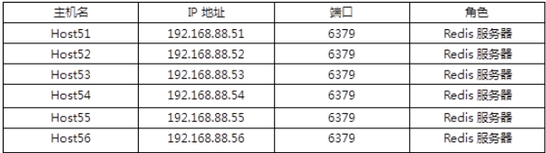

- [学习目标](#学习目标)
- [课堂笔记（命令）](#课堂笔记命令)
- [课堂笔记（文本）](#课堂笔记文本)
  - [Redis服务部署](#redis服务部署)
    - [Redis介绍](#redis介绍)
    - [安装redis](#安装redis)
    - [基本操作](#基本操作)
    - [修改配置](#修改配置)
  - [Redis常用命令](#redis常用命令)
    - [mset、mget](#msetmget)
    - [keys、type](#keystype)
    - [exists](#exists)
    - [ttl、expire](#ttlexpire)
    - [move、select](#moveselect)
    - [del、flushdb、flushall](#delflushdbflushall)
  - [部署LNP+Redis](#部署lnpredis)
    - [部署LNP环境](#部署lnp环境)
      - [软件安装](#软件安装)
      - [配置动静分离](#配置动静分离)
      - [配置php-fpm](#配置php-fpm)
      - [测试配置](#测试配置)
      - [配置redis](#配置redis)
    - [配置PHP支持redis](#配置php支持redis)
      - [安装软件](#安装软件)
      - [调用模块](#调用模块)
      - [加载模块](#加载模块)
    - [测试](#测试)
  - [创建redis集群](#创建redis集群)
    - [环境准备](#环境准备)
    - [配置redis](#配置redis-1)
- [快捷键](#快捷键)
- [问题](#问题)
- [补充](#补充)
- [今日总结](#今日总结)
- [昨日复习](#昨日复习)


# 学习目标

部署Redis服务

部署LNP+Redis

创建Redis集群

# 课堂笔记（命令）

# 课堂笔记（文本）

## Redis服务部署

### Redis介绍

> + Remote Dictionary Server （远程字典服务器）
> + 非关系型数据库（nosql）
> + 一款高性能的分布式内存数据库
> + 支持多种数据类型：字符、列表、散列、集合
> + 支持master-slave模式数据备份

### 安装redis

```sh
# yum安装即可
[root@redis64 ~]# yum -y install redis
# 服务启动
[root@redis64 ~]#systemctl enable redis --now
# 查看端口
[root@redis64 ~]#ss -ntulp|grep 6379
tcp   LISTEN 0      128        127.0.0.1:6379      0.0.0.0:*    users:(("redis-server",pid=18684,fd=6))
# 查看进程
[root@redis64 ~]# ps -C redis-server
    PID TTY          TIME CMD
  18684 ?        00:00:00 redis-server
```

### 基本操作

```sh
# 连接服务
[root@redis64 ~]#redis-cli
127.0.0.1:6379>keys * # 获取所有变量
(empty list or set)
127.0.0.1:6379>set name yyh # 存储变量Key--Value
OK
127.0.0.1:6379>get name # 根据key获取值
"yyh"
127.0.0.1:6379>exit # 端开连接

# 查看redis数据保存目录
[root@redis64 ~]#ls /var/lib/redis
dump.rdb
```

### 修改配置

```sh
[root@redis64 ~]#systemctl stop redsi
[root@redis64 ~]#vim /etc/redis.conf
69 bind 192.168.88.64 # 设置IP，让本机之外的机器可以通过192.168.88.64访问本机的redis
92 port 6364 # 设置端口
207 requirepass 123456  # 设置访问密码 

# 连接时不指定密码
[root@redis64 ~]# redis-cli  -h 192.168.88.64 -p 6364
192.168.88.64:6364> keys * 不输入密码无法正常访问
(error) NOAUTH Authentication required.
192.168.88.64:6364> auth 123456
OK
192.168.88.64:6364> keys *
(empty list or set)

# 连接时指定密码
[root@redis64 ~]# redis-cli  -h 192.168.88.64 -p 6364 -a 123456
192.168.88.64:6364> keys *
(empty list or set)
```

## Redis常用命令

### mset、mget

> 设置多个变量、获取多个变量值

```perl
[root@redis64 ~]# redis-cli  -h 192.168.88.64 -p 6364 -a 123456
192.168.88.64:6364> mset name yyh age 18 sex boy
192.168.88.64:6364> mget name age sex
1) "yyh"
2) "18"
3) "boy"
```

### keys、type

> keys *： 获取所有变量
>
> key ?：获取变量只有一个字符的（key ??）
>
> key xxx ：判断变量是否存在
>
> type name：获取变量类型

```perl
192.168.88.64:6364> keys *
1) "age"
2) "name"
3) "sex"
192.168.88.64:6364> set x 123
OK
192.168.88.64:6364> keys ?
1) "x"
192.168.88.64:6364> keys ???
1) "age"
2) "sex"

192.168.88.64:6364> type age
string
```

### exists

> 判断变量是否存在：0 不存在  1存在

```perl
192.168.88.64:6364> exists bbb
(integer) 0
192.168.88.64:6364> exists age
(integer) 1
```

### ttl、expire

> ttl：检查变量可以在内存里存多久
>
> expire：设置变量的过期时间，不设置变量永不过期  默认以秒为单位

```perl
# -1 代表永久存储  -2代表过期
192.168.88.64:6364> ttl age
(integer) -1

# 设置x变量30s后过期  1代表设置过期时间成功
192.168.88.64:6364> expire x 30
(integer) 1
192.168.88.64:6364> ttl x
(integer) 29 # 29 代表剩余过期时间
# 过期返回 -2
192.168.88.64:6364> ttl x
(integer) -2
```

### move、select

> move：移动变量到指定库
>
> select：切换到指定库

```sh
# 切换到1库；默认在0库
192.168.88.64:6364> select 1
192.168.88.64:6364[1]> select 1
# 移动age便来age变量到1库
192.168.88.64:6364> move age 1
192.168.88.64:6364[1]> keys *
1) "age"
```

### del、flushdb、flushall

> del：删除指定变量
>
> flushdb：删除当前库所有变量
>
> flushall：删除内存中所有变量（慎用）

```sh
192.168.88.64:6364> del sex
192.168.88.64:6364> keys *
1) "name"


192.168.88.64:6364> set a 123
OK
192.168.88.64:6364> keys *
1) "a"
2) "name"
192.168.88.64:6364>flushdb
192.168.88.64:6364> keys *
(empty list or set)


192.168.88.64:6364> select 1
192.168.88.64:6364[1]> keys *
1) "age"
192.168.88.64:6364> flushall
OK
```

## 部署LNP+Redis

### 部署LNP环境

#### 软件安装

```sh
# 安装nginx
[root@redis64 ~]# tar -zxf nginx-1.22.1.tar.gz 
# 安装php和所需依赖
[root@redis64 ~]# yum -y install gcc make pcre-devel zlib-devel php php-fpm php-devel
# 编译安装
[root@redis64 ~]#cd nginx-1.22.1/
[root@redis64 nginx-1.22.1]# ./configure && make && make install
[root@redis64 nginx-1.22.1]# ls /usr/local/nginx/
conf  html  logs  sbin
```

#### 配置动静分离

```sh
 [root@redis64 nginx-1.22.1]#vim +65 /usr/local/nginx/conf/nginx.conf
 65         location ~ \.php$ {
 66             root           html;
 67             fastcgi_pass   127.0.0.1:9000;
 68             fastcgi_index  index.php;
 69            # fastcgi_param  SCRIPT_FILENAME  /scripts$fastcgi_scri    pt_name;
 70             include        fastcgi.conf;
 71         }
 
 # 检查nginx配置文件语法
[root@redis64 nginx-1.22.1]#/usr/local/nginx/sbin/nginx -t 
[root@redis64 nginx-1.22.1]#/usr/local/nginx/sbin/nginx 
[root@redis64 nginx-1.22.1]#ss -ntulp|grep 80
tcp   LISTEN 0      128          0.0.0.0:80        0.0.0.0:*    users:(("nginx",pid=24537,fd=6),("nginx",pid=24536,fd=6))
```

#### 配置php-fpm

```sh
[root@redis64 nginx-1.22.1]#vim +38 /etc/php-fpm.d/www.conf
38 ;listen = /run/php-fpm/www.sock # 注释
39 listen = 127.0.0.1:9000  # 添加，使用非socke方式运行
[root@redis64 nginx-1.22.1]#systemctl start php-fpm
[root@redis64 nginx-1.22.1]#ss -ntulp|grep 9000
tcp   LISTEN 0      128        127.0.0.1:9000      0.0.0.0:*   
```

#### 测试配置

```sh
[root@redis64 nginx-1.22.1]#vim /usr/local/ngixn/html/a.php
<?php
echo "hello word \n"
?>
[root@redis64 nginx-1.22.1]#curl http://localhost/a.php
hello word
```

#### 配置redis

> 允许本机回环地址和IP访问

```sh
[root@redis64 nginx-1.22.1]#vim +69 /etc/redis.conf
bind 127.0.0.1 192.168.88.64 # 本机也可以访问，其他服务也可以访问
[root@redis64 nginx-1.22.1]#systemctl restart redis
[root@redis64 nginx-1.22.1]#ss -ntulp|grep redis-server
tcp   LISTEN 0      128    192.168.88.64:6364      0.0.0.0:*    users:(("redis-server",pid=25041,fd=7))                                                                                                                                  
tcp   LISTEN 0      128        127.0.0.1:6364      0.0.0.0:*    users:(("redis-server",pid=25041,fd=6))   

# 两个地址都能访问
[root@redis64 ~]# redis-cli -h 127.0.0.1 -p 6364 -a 123456
[root@redis64 ~]# redis-cli -h 192.168.88.64 -p 6364 -a 123456
```

### 配置PHP支持redis

```sh
[root@redis64 ~]#php -m | grep -i redis # php模块中没有支持redis的模块，需要手动安装
```

#### 安装软件

```sh
[root@redis64 ~]# tar -xf redis-cluster-4.3.0.tgz
[root@redis64 ~]# cd redis-4.3.0/ 进源码目录
[root@redis64 ~]#phpize # 获取版本信息，并生成./configure文件
# --with-php-config 指定php的配置文件路径，以便php集成
[root@redis64 redis-4.3.0]# ./configure --with-php-config=/usr/bin/php-config  
[root@redis64 redis-4.3.0]# make && make install 编译并安装
Installing shared extensions:     /usr/lib64/php/modules/ # 显示模块安装的位置
[root@redis64 redis-4.3.0]# ls /usr/lib64/php/modules/redis.so  查看模块
/usr/lib64/php/modules/redis.so
```

#### 调用模块

```sh
[root@redis64 redis-4.3.0]# vim /etc/php.ini  # 编辑php进程主配置文件
737 extension_dir = "/usr/lib64/php/modules/"   # 指定模块所在目录
739 extension = "redis.so"  指定模块名
```

#### 加载模块

```sh
[root@redis64 redis-4.3.0]# systemctl  restart php-fpm
[root@redis64 ~]# php -m | grep redis
redis
```

### 测试

```sh
# 编写一个php脚本测试
root@redis64 ~]# vim /usr/local/nginx/html/redis.php
<?php
$redis = new redis();
$redis->connect("127.0.0.1", "6364");
$redis->auth("123456");
$redis->set("name","yyh");
echo "save ok\n";
?>

# 访问网页
[root@redis64 redis-4.3.0]# curl 192.168.88.64/redis.php
save ok
# 查询是否存储
[root@redis64 redis-4.3.0]# redis-cli -h 127.0.0.1 -p 6364 -a 123456
Warning: Using a password with '-a' or '-u' option on the command line interface may not be safe.
127.0.0.1:6364> keys *
1) "naem"
127.0.0.1:6364> get class
"yyh"
```

## 创建redis集群

### 环境准备



### 配置redis

> 6台机器按照如下进行配置

```sh
[root@redis51 ~]# yum -y install redis
[root@redis51 ~]#vim /etc/redis.conf
92 port  6379   # 端口号
69 bind   192.168.88.51  # IP地址
838 cluster-enabled  yes    # 启用集群功能  
846 cluster-config-file  nodes-6379.conf   # 存储集群信息文件
852 cluster-node-timeout  5000 # 集群中主机通信超时时间
[root@redis51 ~]#systemctl start redis
tcp  0  0 192.168.88.51:6379  0.0.0.0:*   LISTEN      21201/redis-serve  
tcp  0  0 192.168.88.51:16379   0.0.0.0:*   LISTEN   21201/redis-serve
```


# 快捷键


# 问题


# 补充


# 今日总结


# 昨日复习