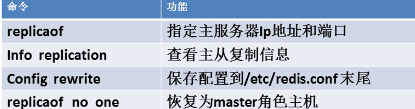
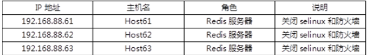
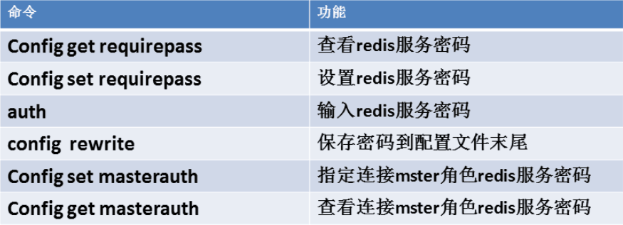
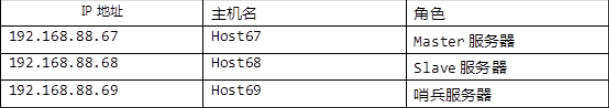

- [学习目标](#学习目标)
- [课堂笔记（命令）](#课堂笔记命令)
- [课堂笔记（文本）](#课堂笔记文本)
	- [主从复制](#主从复制)
		- [服务准备](#服务准备)
		- [查询主从复制信息](#查询主从复制信息)
		- [配置一主一从](#配置一主一从)
			- [配置](#配置)
			- [验证](#验证)
		- [配置一主多从](#配置一主多从)
			- [配置](#配置-1)
			- [验证](#验证-1)
		- [配置主从从](#配置主从从)
			- [配置](#配置-2)
			- [验证](#验证-2)
	- [带有验证主从复制](#带有验证主从复制)
		- [设置密码-重启](#设置密码-重启)
		- [设置密码-不重启](#设置密码-不重启)
	- [哨兵服务](#哨兵服务)
		- [服务准备](#服务准备-1)
		- [配置主从](#配置主从)
		- [配置哨兵](#配置哨兵)
		- [启动哨兵服务](#启动哨兵服务)
		- [测试配置](#测试配置)
	- [数据持久化](#数据持久化)
		- [服务准备](#服务准备-2)
		- [RDB](#rdb)
			- [存盘频率](#存盘频率)
			- [测试](#测试)
			- [RDB文件恢复](#rdb文件恢复)
			- [RDB缺点](#rdb缺点)
		- [AOF](#aof)
			- [存盘频率](#存盘频率-1)
			- [启用](#启用)
			- [AOF文件恢复](#aof文件恢复)
	- [Redis基本操作](#redis基本操作)
		- [字符类型](#字符类型)
			- [set](#set)
			- [数字操作](#数字操作)
			- [append](#append)
			- [strlen](#strlen)
			- [getrange](#getrange)
		- [列表类型](#列表类型)
			- [lpush](#lpush)
			- [lrange](#lrange)
			- [llen](#llen)
			- [单个元素取出](#单个元素取出)
			- [lset](#lset)
			- [lpop、rpop](#lpoprpop)
			- [rpush](#rpush)
			- [linsert](#linsert)
		- [散列类型](#散列类型)
			- [hset、hget](#hsethget)
			- [hgetall](#hgetall)
			- [hdel](#hdel)
			- [hkeys、hvals、hlen](#hkeyshvalshlen)
		- [集合类型](#集合类型)
			- [无序集合](#无序集合)
				- [sadd](#sadd)
				- [srem](#srem)
				- [smembers](#smembers)
				- [scard](#scard)
				- [集合运算](#集合运算)
				- [srandmember](#srandmember)
				- [spop](#spop)
			- [有序集合](#有序集合)
				- [基础命令](#基础命令)
				- [zscore](#zscore)
				- [zrangebyscore](#zrangebyscore)
				- [zincrby](#zincrby)
				- [zcount](#zcount)
				- [erem](#erem)
- [快捷键](#快捷键)
- [问题](#问题)
- [补充](#补充)
- [今日总结](#今日总结)
- [昨日复习](#昨日复习)


# 学习目标

主从复制

哨兵服务

持久化

数据类型

# 课堂笔记（命令）

# 课堂笔记（文本）

## 主从复制



### 服务准备



```perl
"三台主机同步设置"
[root@host61 ~]# yum -y install redis 
[root@host61 ~]# vim /etc/redis.conf
69 bind 192.168.88.61  设置服务使用的Ip地址
92 port 6379 设置服务使用的端口号 使用默认端口即可
[root@host61 ~]#systemctl start redis
```

### 查询主从复制信息

> 检查当前主机是否为主从，默认机器都是master

```perl
[root@R61 ~]# redis-cli -h 192.168.88.61
192.168.88.61:6379> info replication
# Replication
role:master # 默认就是主服务器
connected_slaves:0 # 没有从服务器
......
```

### 配置一主一从

> 61为主  默认为主无需配置
>
> 62为从
>
> 从机器不允许写，只允许读

#### 配置

```perl
[root@R62 ~]# redis-cli -h 192.168.88.62
192.168.88.62:6379> replicaof 192.168.88.61 6379 # 指定本机作为61机器的从服务器
OK
192.168.88.62:6379> config rewrite # 将配置永久写入文件
OK
192.168.88.62:6379> info replication
# Replication
role:slave # 角色变为从
master_host:192.168.88.61
master_port:6379

# 查询主的信息
[root@R61~]# redis-cli -h 192.168.88.61
192.168.88.61:6379> info replication
# Replication
role:master
connected_slaves:1
slave0:ip=192.168.88.62,port=6379,state=online,offset=28,lag=0
```

#### 验证

```perl
"主写入数据"
192.168.88.61:6379> mset name yyh age 18 sex boy
OK
192.168.88.61:6379> keys *
1) "age"
2) "sex"
3) "name"

"查询从是否同步"
192.168.88.62:6379> keys *
1) "sex"
2) "age"
3) "name"

"验证从是否可以写入"
192.168.88.62:6379> set rank 1
(error) READONLY You can't write against a read only replica.
```

### 配置一主多从

> **[注]：**slave角色的主机，本机有数据时将会被替换成主机同步的数据，原有数据将会被覆盖

#### 配置

> 将63作为第二从服务器，且配置同62配置从服务器一样

```perl
[root@R63 ~]# redis-cli -h 192.168.88.63
192.168.88.63:6379> info replication
# Replication
role:master # 默认为主
connected_slaves:0
.....
192.168.88.63:6379> replicaof 192.168.88.61 6379 # 指定从服务器
OK
192.168.88.63:6379> config rewrite # 永久生效配置
OK
192.168.88.63:6379> info replication
# Replication
role:slave # 变为从
master_host:192.168.88.61
master_port:6379

"在主61上查看主从复制信息"
192.168.88.61:6379> info replication
# Replication
role:master
connected_slaves:2
slave0:ip=192.168.88.62,port=6379,state=online,offset=931,lag=1
slave1:ip=192.168.88.63,port=6379,state=online,offset=931,lag=1 # 指定成功
```

#### 验证

```perl
192.168.88.61:6379> keys *
1) "age"
2) "sex"
3) "name"

"由于从会自动同步主的数据"
192.168.88.63:6379> keys *
1) "age"
2) "sex"
3) "name"

"验证能否写入"
192.168.88.63:6379> set rank 1
(error) READONLY You can't write against a read only replica.
```

### 配置主从从

>+ 在一个主从结构中，将从服务器再配置一个服务器，此时原从服务器可作为新服务器的主，此时结构就成为了主从从结构

#### 配置

```perl
"未删除前主服务器的复制信息"
192.168.88.61:6379> info replication
# Replication
role:master
connected_slaves:2
slave0:ip=192.168.88.62,port=6379,state=online,offset=931,lag=1
slave1:ip=192.168.88.63,port=6379,state=online,offset=931,lag=1

"未配置前62主机的复制信息"
192.168.88.62:6379> info replication
# Replication
role:slave
.....
slave_read_only:1
connected_slaves:0
....

"将63作为61的主删除掉"
192.168.88.63:6379> replicaof no one # 恢复为主角色
OK
192.168.88.63:6379> config rewrite
OK
192.168.88.63:6379> keys * # 恢复成功后，原先同步的数据不会被删除
1) "age"
2) "sex"
3) "name"

"删除后的主复制信息" 
192.168.88.61:6379> info replication
# Replication
role:master
connected_slaves:1
slave0:ip=192.168.88.62,port=6379,state=online,offset=7553,lag=0

"配置62做为63的主"
192.168.88.63:6379> replicaof 192.168.88.62 6379
OK
192.168.88.63:6379> config rewrite
OK

"配置后查询62机器的复制信息"
192.168.88.62:6379> info replication
# Replication
role:slave
....
slave_read_only:1
connected_slaves:1
slave0:ip=192.168.88.63,port=6379,state=online,offset=2037,lag=0
```

#### 验证

```perl
"删除61主的所有缓存信息"
192.168.88.61:6379> flushall  # 谨慎 执行
OK
192.168.88.61:6379> keys *
(empty list or set)

"查询62 63机器的缓存信息"
192.168.88.62:6379> keys *
(empty list or set)

192.168.88.63:6379> keys *
(empty list or set)
```

## 带有验证主从复制

> master角色主机设置一个密码，访问redis时需要输入密码

### 设置密码-重启

> + 通过修改配置文件设置，需要重启redis服务

```perl
"61机器设置密码"
[root@R61 ~]# vim  +507 /etc/redis.conf 
 507  requirepass 123456
 
"验证密码"
[root@R61 ~]# systemctl restart redis #重启服务生效配置
[root@R61 ~]# redis-cli -h 192.168.88.61
192.168.88.61:6379> keys * # 设置了密码时，无密码访问能登陆，但无法查询数据
(error) NOAUTH Authentication required.
192.168.88.61:6379> auth 123456 # 验证密码后可以
OK
192.168.88.61:6379> keys *
(empty list or set)
192.168.88.61:6379> info replication
# Replication
role:master
connected_slaves:0 # 此时从服务器变为了0个

"未配值密码查询从服务的复制信息"
192.168.88.62:6379> info replication
# Replication
role:slave
master_host:192.168.88.61
master_port:6379
master_link_status:down # 没设置密码，与master主机是断开状态

"修改62主机配置文件设置master主机的密码"
[root@R61 ~]# vim  +293 /etc/redis.conf
 293 masterauth 123456
[root@R61 ~]#systemctl restart redis # 重启生效配置
[root@R61 ~]# redis-cli -h 192.168.88.62
192.168.88.62:6379> info replication
# Replication
role:slave
master_host:192.168.88.61
master_port:6379
master_link_status:up # 变为up状态
```

### 设置密码-不重启

> + 在不重启redis服务的情况下完成带有验证的主从复制



> (根据主从从配置中，以下用63作为64主来做测试）

```perl
[root@R62 ~]# redis-cli -h 192.168.88.62
192.168.88.62:6379> config get requirepass # 获取本机的密码
1) "requirepass"
2) ""
192.168.88.62:6379> config set requirepass 654321 # 设置密码
OK
192.168.88.62:6379> keys * # 此时是立即生效
(error) NOAUTH Authentication required.
192.168.88.62:6379> auth 654321 # 输入密码后才能进行操作
OK
192.168.88.62:6379> config rewrite # 写入配置文件，永久生效
OK
192.168.88.62:6379> config get requirepass
1) "requirepass"
2) "654321"

"查询复制信息"
192.168.88.62:6379> info replication
# Replication
role:slave
......
connected_slaves:0 # 当前下没有从服务器了

"查询63的复制信息"
[root@R63 ~]# redis-cli -h 192.168.88.63
192.168.88.63:6379> config get masterauth # 通过获取主账号信息，查询到未配置主的密码
1) "masterauth"
2) ""
192.168.88.63:6379> info replication # 过5s后查询，此时主状态未down
# Replication
role:slave
master_host:192.168.88.62
master_port:6379
master_link_status:down #  没设置密码 与master主机是断开状态

"在63上设置主62的密码"
192.168.88.63:6379> config set masterauth 654321
OK
192.168.88.63:6379> config rewrite
OK
192.168.88.63:6379> info replication
# Replication
role:slave
master_host:192.168.88.62
master_port:6379
master_link_status:up  # 已经变为up状态

"查询62主机复制信息"
192.168.88.62:6379> info replication
# Replication
role:slave
.....
connected_slaves:1
slave0:ip=192.168.88.63,port=6379,state=online,offset=4256,lag=1
```

## 哨兵服务

> + 负责监视从结构中的master角色服务器上redis服务的状态，当监视不到master角色主机的redis服务时，把对应的slave服务器升级未master服务器，宕及的master服务器修复后，配置为但前master服务器的slave服务器
> + 如果主从结构中的redis服务设置连接密码的话必须全每台数据库都要设置密码且密码要一样，要么全都不设置密码。
> + 如果Redis服务有密码宕机的服务器启动服务后，要人为指定主服务器的连接密码。
>
> 哨兵服务+主从(一主多从、主从从)结构：可以实现redis服务的高可用和数据备份功能

### 服务准备



> 安装redis服务

### 配置主从

> 配置67作为68的主服务器

```perl
[root@R68 ~]# redis-cli -h 192.168.88.68
192.168.88.68:6379> replicaof 192.168.88.67 6379
OK
192.168.88.68:6379> config rewrite
OK
192.168.88.68:6379> info replication
# Replication
role:slave
master_host:192.168.88.67
master_port:6379
master_link_status:up

[root@R67 ~]# redis-cli -h 192.168.88.67
192.168.88.67:6379> info replication
# Replication
role:master
connected_slaves:1
slave0:ip=192.168.88.68,port=6379,state=online,offset=70,lag=0
```

### 配置哨兵

```perl
[root@R69 ~]# vim /etc/redis-sentinel.conf
15 bind 192.168.88.69  # 指定哨兵服务工作的地址
21 port 26379  # 指定哨兵服务运行时监听端口
26 daemonize yes  # 以守护进程方式运行服务，让哨兵服务一直监视主从状态，如果为no，哨兵服务会在一段时间处休眠状态，无法及时让从服务器顶替主服务器
# 添加监视信息 
"
mymaster被监视主机名称
192.168.88.67 6379  当前主从结构中主服务器的IP、端口
1 哨兵服务器的台数(票数)
"
84 sentinel monitor mymaster 192.168.88.67 6379 1 
86 # sentinel auth-pass <master-name> <password> # 指定被监视主服务器的密码
```

> 在设置主从redis密码时，要么不设置密码，要么主从的密码都配置一样

### 启动哨兵服务

```perl
[root@R69 ~]#systemctl start redis-sentinel
[root@R69 ~]# ss -ntulp|grep 2637
tcp   LISTEN 0      128    192.168.88.69:26379      0.0.0.0:*    users:(("redis-sentinel",pid=1213,fd=6))
"查看监视信息"
[root@host69 ~]# tail -f /var/log/redis/sentinel.log   
```

### 测试配置

> + 停止master主机的redis 服务，原slave角色会升级为主，哨兵服务会自动监视新的master服务，宕机的master 主机恢复后自动配置为当前主的从服务器。

```perl
"stop主机的redis服务"
[root@host67 ~]# systemctl  stop redis

"查询哨兵服务器日志"
[root@R69 ~]# tail -f /var/log/redis/sentinel.log 
1213:X 22 Jan 2024 15:27:37.210 # +promoted-slave slave 192.168.88.68:6379 192.168.88.68 6379 @ mymaster 192.168.88.67 6379
.....
1213:X 22 Jan 2024 15:27:37.270 * +slave slave 192.168.88.67:6379 192.168.88.67 6379 @ mymaster 192.168.88.68 6379
1213:X 22 Jan 2024 15:28:07.293 # +sdown slave 192.168.88.67:6379 192.168.88.67 6379 @ mymaster 192.168.88.68 6379

"查询slave角色信息"
[root@host68 ~]# redis-cli  -h 192.168.88.68 -p 6379
192.168.88.68:6379> info replication
# Replication
role:master
connected_slaves:0

"宕机主机恢复后自配置为当前主的从服务器"
192.168.88.67:6379> info replication
# Replication
role:slave
master_host:192.168.88.68
master_port:6379
master_link_status:up
```

## 数据持久化

### 服务准备

> 准备一台新机器：127.0.0.1
>
> 安装启动redis

### RDB

> + 数据持久默认方式
> + 按照指定时间间隔，将内存中的数据集快照写入硬盘

```sh
"定义rdb文件名,可自定义rbd文件名"
]#vim +253 /etc/redis.conf
253 dbfilename dump.rdb
"查询rdb存储位置"
]# ls /var/lib/redis
```

#### 存盘频率

> 查看 redis服务存储数据到硬盘的存盘频率
>
> 变量个数：增、删、改次数之和

```sh
[root@redis70 ~]# vim /etc/redis.conf      
	 save  秒 变量个数
 218 save 900 1
 219 save 300 10
 220 save 60 10000  
 "
 save
 bgsave
 "
```

> 60  一分钟内存储变量个数大于10000个，将存储到rdb文件中
>
> 300 五分钟内存储变量个数大于10个
>
> 900 十五分钟内存储变量的个数大于1个
>
> 如果1分钟内存储变量为9000个，且当前1分钟内容不会写入rdb文件中，当时间过渡到5分钟时此时9000>10满足存储，直接存储到rbd文件中

**补充**

> 不想存储的数据需要等满足存储频率时才存储到磁盘，敲击如下命令可马上就存储在磁盘中

> + `SAVE`命令：这是一个阻塞式的命令，它会将当前数据库的数据以同步（Synchronous）的方式保存到磁盘上的持久化文件。当执行`SAVE`命令时，Redis会阻塞所有其他客户端的请求，直到持久化完成为止。这意味着在持久化期间，Redis无法处理其他命令请求，可能会导致性能问题。
>
>   ```perl
>   127.0.0.1>set name 1
>   ok
>   127.0.0.1>save
>   ```
>
> + `BGSAVE`命令：这是一个非阻塞式的命令，它会在后台以异步（Asynchronous）的方式进行持久化操作。执行`BGSAVE`命令后，Redis会创建一个子进程来进行持久化操作，而主进程可以继续处理其他请求。通过这种方式，`BGSAVE`命令不会阻塞其他客户端的请求，不会造成性能问题。
>
>   ```perl
>   127.0.0.1>set name 1
>   ok
>   127.0.0.1>bgsave
>   ```

#### 测试

> 修改频率测试

```perl
[root@redis70 ~]#systemctl stop redis      
[root@redis70 ~]# rm -rf /var/lib/redis/*    
[root@redis70 ~]# vim  +219 /etc/redis.conf      
save 900 1
#save 300 10
save 120 10     # 2分钟内且有>=10个变量改变 就把内存里的数据复制到dump.rdb文件里
save 60 10000
[root@redis70 ~]# systemctl start redis
"服务启动后，要在2分钟内存储大于10个变量"
[root@redis70 ~]# redis-cli
127.0.0.1:6379> mset a 1  b 2  c 3  d 4 
OK
127.0.0.1:6379> mset   x 1 y 2  z 3 k 6  i 7  z 9   f 22  zz 99  cc  66
127.0.0.1:6379> exit
"两分钟后再进行查看"
[root@redis70 ~]# ls /var/lib/redis/
dump.rdb
```

#### RDB文件恢复

```perl
"
1. 拷贝dump.rdb文件就是对数据进行备份
2. 进入redis中是执行flushall清空所有变量
3. 停止服务，将备份文件覆盖/var/lib/redis/dump.rdb文件,即为恢复
4. 启动服务，查询数据
"
[root@redis70 ~]# cp /var/lib/redis/dump.rdb  /opt/
[root@redis70 ~]# ls /opt/*.rdb
/opt/dump.rdb
[root@redis70 ~]# redis-cli
127.0.0.1:6379> FLUSHALL 
OK
127.0.0.1:6379> keys *
(empty list or set)
127.0.0.1:6379> 

# 开始恢复
[root@redis70 ~]# systemctl stop redis
[root@redis70 ~]# rm -rf /var/lib/redis/dump.rdb 
[root@redis70 ~]# \cp /opt/dump.rdb  /var/lib/redis/ # 拷贝的文件注意查看属组关系是否时redis.redis 不然redis服务启动会失败
[root@redis70 ~]# systemctl start redis
[root@redis70 ~]# redis-cli
127.0.0.1:6379> keys *
 1) "i"
 2) "d"
 3) "x"
```

#### RDB缺点


### AOF

> + aof同mysql的binlog日志类似，存储执行的命令
> + 弥补RDB的缺点

#### 存盘频率

```perl
[root@localhost ~]# grep -i -n "append" /etc/redis.conf
728:# appendfsync always # 实时同步，性能要求高
729:appendfsync everysec # 每1s进行一次同步，默认使用
730:# appendfsync no # 不进行同步，性能要求最高
```

> - `appendfsync always`：每个写操作都会立即被同步到磁盘上的持久化文件，保证最高的数据安全性和可靠性，但会降低性能。
> - `appendfsync everysec`：每秒钟进行一次同步，可以提高性能和吞吐量，但在发生故障时可能会有一秒钟的数据丢失。
> - `appendfsync no`：不进行同步，完全依赖于操作系统缓存来处理写操作，性能最高，但在发生故障时会丢失大量数据。

#### 启用

> + 可通过修改主配置文件，重启服务生效
> + 推荐使用此方法：再redis服务中使用config set 命令进行设置，不需要重启服务立即生效

```perl
[root@redis70 ~]# redis-cli
127.0.0.1:6379> config set  appendonly yes    # 启用aof文件
OK
127.0.0.1:6379> config get  appendonly  # 查看是否启用
1) "appendonly"
2) "yes"
127.0.0.1:6379>
127.0.0.1:6379> config rewrite  # 永久生效配置
OK
127.0.0.1:6379> exit # 断开连接

[root@redis70 ~]# ls /var/lib/redis/   # 多出一个.aof文件  
appendonly.aof dump.rdb
[root@redis70 ~]#wc –l  /var/lib/redis/appendonly.aof  # 查看文件行数，默认将相同的操作记录为1行
[root@redis70 ~]# redis-cli 
127.0.0.1:6379> set x 1  
127.0.0.1:6379> set y 2  
127.0.0.1:6379> set z 3  
127.0.0.1:6379>keys * 
1) "x"
2) "z"
3) "y"
127.0.0.1:6379> exit # 断开连接
[root@redis70 ~]#wc –l  /var/lib/redis/ appendonly.aof  查看文件行数
22 /var/lib/redis/appendonly.aof
```

#### AOF文件恢复

> 同RDB恢复一致拷贝备份文件覆盖即可

```perl
"拷贝备份"
[root@redis70 ~]# cp /var/lib/redis/appendonly.aof  /opt/

"删除数据"
[root@redis70 ~]# redis-cli
127.0.0.1:6379> flushall 
127.0.0.1:6379> exit

"恢复数据"
[root@redis70 ~]#systemctl stop redis # 停止服务
# 删除数据库目录中所有文件
[root@redis70 ~]# rm -rf  /var/lib/redis/*
# 拷贝备份文件到数据库目录中
 [root@redis70 ~]# cp /opt/appendonly.aof  /var/lib/redis/
 [root@redis70 ~]# systemctl start redis # 启动服务
 [root@redis70 ~]# redis-cli
127.0.0.1:6379> keys * #  查询恢复的数据
1) "v4"
2) "v3"
.....
```

## Redis基本操作

### 字符类型

#### set

```perl
"set 命令完整格式
set key value [expiration EX seconds|PX milliseconds] NX|XX
EX：过期时间按秒计算
PX：过期时间按毫秒计算
NX：不覆盖赋值(针对已经存在的变量再次赋值)
XX：覆盖赋值(针对已经存在的变量再次赋值)
"

127.0.0.1:6379> set name yyh ex 30 # 变量过期时间为30秒
OK
127.0.0.1:6379> ttl name # ttl查询变量存活时长
(integer) 27
127.0.0.1:6379> type name # 获取变量类型
string

"覆盖赋值与不覆盖赋值"
127.0.0.1:6379> set name yyh
OK
127.0.0.1:6379> set name cxj nx #不覆盖赋值
(nil)
127.0.0.1:6379> get name
"yyh"
127.0.0.1:6379> set name coke xx # 覆盖赋值
OK
127.0.0.1:6379> get name
"coke"

"set 命令的完整格式"
127.0.0.1:6379> set age 18 ex 50 nx
OK
127.0.0.1:6379> get age
"18"
127.0.0.1:6379> ttl age
(integer) 43
```

#### 数字操作

> + 字符串类型可以存储任何形式的字符串，当存储的字符串是整数形式时，Redis 提供了一个实用的命令 INCR，其作用是让当前键值递增，并返回递增后的值。
> +  当要操作的键不存在时会默认键值为0，所以第一次递增后的结果是1。
>
> incr：自增1
>
> incrby：自增指定数
>
> decr：自减1
>
> decr：自减指定数

```perl
127.0.0.1:6379> set  num 1  //创建变量
"自增"
127.0.0.1:6379> INCR num    //+1
(integer) 2
127.0.0.1:6379> GET num     
"2"

"增加指定数"
127.0.0.1:6379> INCRBY num 2   //+2
(integer) 4
"自减"
127.0.0.1:6379> DECR num     //-1
(integer) 3
"自减指定数"
127.0.0.1:6379> DECRBY num 3   // -3
(integer) 0
```

#### append

> 给指定变量所对应的值末尾追加值

```perl
127.0.0.1:6379> SET hi Hello   //创建变量hi
OK
127.0.0.1:6379> APPEND hi " World"   # 因为字符串包含空格，需要使用引号
(integer) 11        # 返回值为hi的总长度
127.0.0.1:6379> GET hi
"Hello World"
```

#### strlen

> 获取values的长度
>
> [注]：中文字符返回字节数，1个中文默认2字节，注意看字符集

```perl
127.0.0.1:6379> STRLEN hi
(integer) 11
- 中文字符返回字节数
127.0.0.1:6379> SET name 张三
OK
127.0.0.1:6379> STRLEN name
(integer) 6   # UTF-8编码的中文，由于“张”和“三”两个字的UTF-8编码的长度都是3，所以此例中会返回6。
```

#### getrange

> 获取指定values部分数据
>
> 变量值的长度按照索引进行取舍，第一个为0以此内推

```perl
127.0.0.1:6379> set zfc  ABCEF   //创建变量
OK
127.0.0.1:6379> GET zfc  //输出变量值
"ABCEF"
127.0.0.1:6379> GETRANGE zfc 0 1  //输出第1个到第2个字符
"AB"
127.0.0.1:6379> GETRANGE zfc 2 4  //输出第3个到第5个字符
"CEF"
127.0.0.1:6379> GETRANGE zfc -2 -1 //输出倒数第2个到第1个字符
"EF"
```

### 列表类型

#### lpush

> 向列表左边增加元素，返回值表示增加元素后列表的长度

```perl
# 创建变量
192.168.88.70:6379> lpush  letter A B C 
(integer) 3
192.168.88.70:6379> type letter  # 查看类型
list
# 头部追加元素
192.168.88.70:6379> lpush letter d e
(integer) 5
```

#### lrange

> 根据索引取出列表元素

```perl
"格式"
lrang 变量名 startIndex  endIndex
192.168.88.70:6379> lrange letter 0 -1
1) "e"
2) "d"
3) "C"
4) "B"
5) "A"
```

#### llen

> 统计列表中元数的个数

```perl
192.168.88.70:6379> llen letter
(integer) 5
```

#### 单个元素取出

```perl
192.168.88.70:6379> lrange letter 0 -1
1) "e"
2) "d"
3) "C"
4) "B"
5) "A"
192.168.88.70:6379> lindex letter 0
"e"
192.168.88.70:6379> lindex letter 2
"C"
192.168.88.70:6379> lindex letter -1 # 最后1个
"A"
192.168.88.70:6379> lindex letter -2 # 倒数第2个
"B"
```

#### lset

> 修改单个元素

```perl
192.168.88.70:6379> lrange letter 0 -1  # 修改前查看
1) "e"
2) "d"
3) "C"
4) "B"
5) "A"
192.168.88.70:6379> lset letter 0 E  # 修改第1元素
OK
192.168.88.70:6379> lset letter -1 a # 修改最后1个元素
OK
192.168.88.70:6379> lrange letter 0 -1 # 修改后查看
1) "E"
2) "d"
3) "C"
4) "B"
5) "a"
```

#### lpop、rpop

> 弹出元素(删除元素)
>
> lpop：弹出头部
>
> rpop：弹出尾部

```perl
192.168.88.70:6379> lrange letter 0 -1  # 修改前查看
1) "E"
2) "d"
3) "C"
4) "B"
5) "a"
192.168.88.70:6379> lpop letter   # 弹出头部元素
"E"
192.168.88.70:6379> rpop letter  # 弹出尾部元素
"a"
192.168.88.70:6379> lrange letter 0 -1  # 修改后查看
1) "d"
2) "C"
3) "B"
```

#### rpush

> 尾部追加元素

```perl
192.168.88.70:6379> rpush letter e f # 尾部追加元素
(integer) 5
192.168.88.70:6379> lrange letter 0 -1 # 追加后查看
1) "d"
2) "C"
3) "B"
4) "e"
5) "f"
```

#### linsert

> 插入元素
>
> after A ：插入在A后
>
> before A：插入在A前

```perl
192.168.88.70:6379> lrange letter 0 -1 # 插入前查看
1) "d"
2) "C"
3) "B"
4) "e"
5) "f"
192.168.88.70:6379> linsert letter before C C2   # 值C前插入C2
(integer) 6
192.168.88.70:6379> lrange letter 0 -1 # 插入后查看
1) "d"
2) "C2"
3) "C"
4) "B"
5) "e"
6) "f"
192.168.88.70:6379> linsert letter after C C3  # 值C后插入C3
(integer) 7 
192.168.88.70:6379> lrange letter 0 -1 # 插入后查看
1) "d"
2) "C2"
3) "C"
4) "C3"
5) "B"
6) "e"
7) "f"
```

### 散列类型

#### hset、hget

> hset创建变量时给变量的值取个别名，通过hget别名获取对应的值

```perl
192.168.88.70:6379> HSET user1 name bob  # 创建变量
(integer) 1
192.168.88.70:6379> type user1 # 查看类型
hash
192.168.88.70:6379> HSET user1 gender man # 赋新值
(integer) 1
192.168.88.70:6379> HGET user1 name  # 查看name列的值
"bob"
```

hmset、hmget

> 设置多个字段

```perl
192.168.88.70:6379> HMSET user1 email bob@tedu.cn phone 13412345678
OK
192.168.88.70:6379> HMGET user1 email phone
1) "bob@tedu.cn"
2) "11111111"
```

#### hgetall

> 获取所有列和对应的值，列名在上，值在下

```perl
192.168.88.70:6379> HGETALL user1
1) "name"
2) "bob"
3) "gender"
4) "male"
5) "email"
6) "bob@tedu.cn"
7) "phone"
8) "11111111"
```

#### hdel

> 删除列

```perl
192.168.88.70:6379> HDEL user1 age
(integer) 1
```

#### hkeys、hvals、hlen

> hkeys：只获取列名
>
> hvals：只获取值
>
> hlen：获取列的数量

```perl
192.168.88.70:6379> HKEYS user1
1) "name"
2) "gender"
3) "email"
4) "phone"
5) "address"

192.168.88.70:6379> HVALS user1
1) "bob"
2) "male"
3) "bob@tedu.cn"
4) "11111111"
5) "beijing"

192.168.88.70:6379> HLEN user1
(integer) 5

```

### 集合类型

#### 无序集合

> 无序集合中的每个元素都是不同的，且没有顺序

##### sadd

> 创建、追加值

```perl
192.168.88.70:6379> sadd mylike film muisc game  # 创建
(integer) 3
192.168.88.70:6379> type mylike # 查看数据类型
set
192.168.88.70:6379> sadd mylike sleep game it  # 追加，自动删除重复的值
(integer) 2
```

##### srem

> 根据集合中的成员

```perl
192.168.88.70:6379> srem mylike sleep game 删除成员
(integer) 2
```

##### smembers

> + 查看集合中的成员
> + 判断元素是否存在，存在返回1，不存在返回0

```perl
192.168.88.70:6379> SMEMBERS mylike 查看成员
1) "film"
2) "it"
3) "muisc"

192.168.88.70:6379> SISMEMBER mylike game  输出0表示不存在
(integer) 0
192.168.88.70:6379> SISMEMBER mylike music 输出1表示存在
(integer) 1
```

##### scard

> 输出集合中元素个数

```perl
192.168.88.70:6379> SCARD mylike
(integer) 3
```

##### 集合运算

> 多个集合进行运算
>
> sunion ： 合集，重复的只显示一次
>
> sinter：交集
>
> sdiff：差集

```perl
192.168.88.70:6379> SMEMBERS mylike
1) "film"
2) "it"
3) "muisc"
192.168.88.70:6379> sadd helike film music game  sleep # 添加一个集和helike
(integer) 4
192.168.88.70:6379>

# 合集 重复的只显示一次
192.168.88.70:6379> SUNION mylike helike
1) "game"
2) "it"
3) "muisc"
4) "film"
5) "sleep"
6) "music"
192.168.88.70:6379>

# 交集
192.168.88.70:6379> SINTER mylike helike
1) "film"

# 差集: 用第1列的变量和第2列的变量比
192.168.88.70:6379> SDIFF mylike helike
1) "it"
2) "muisc"
192.168.88.70:6379> SDIFF helike mylike
1) "game"
2) "sleep"
3) "music"
```

##### srandmember

> 随机取出集和元素个数
>
> srandmember 集和名 取出的元素个数
>
> 取出的元素个数：
>
> + 正整数：随机取出两个不同的元素
> + 负整数：随机取出两个有可能相同元素

```perl
# 在集合helike中随机取出两个不同元素。
192.168.88.70:6379> SRANDMEMBER helike 2
1) "sleep"
2) "music"
192.168.88.70:6379> SRANDMEMBER helike 2
1) "game"
2) "music"

# 在集合helike中随机取出两个有可能相同元素。
192.168.88.70:6379> SRANDMEMBER helike -2
1) "film"
2) "music"
192.168.88.70:6379> SRANDMEMBER helike -2
1) "music"
2) "music"
```

##### spop

> 随机是弹出(删除)一个元素

```perl
192.168.88.70:6379> spop helike # 第1次弹出
"music"
192.168.88.70:6379> spop helike # 第2次弹出
"game"
192.168.88.70:6379> SMEMBERS helike # 查看
1) "film"
2) "sleep"
```

#### 有序集合

##### 基础命令

> ZADD命令的返回值是新加入到集合中的元素个数

```perl
192.168.88.70:6379> ZADD scores 88 tom 90 jerry 75 bob 92 alice #  创建变量
(integer) 4
192.168.88.70:6379> type scores # 查看类型
zset
192.168.88.70:6379> ZCARD scores # 统计成员个数
(integer) 4
192.168.88.70:6379> ZRANGE scores 0 -1  # 输出成员名称
1) "bob"
2) "tom"
3) "jerry"
4) "alice"
192.168.88.70:6379> ZRANGE scores 0 -1 withscores  # 输出成员名称及对应的值
1) "bob"
2) "75"
3) "tom"
4) "88"
5) "jerry"
6) "90"
7) "alice"
8) "92"
```

##### zscore

> 返回某个成员的值

```perl
192.168.88.70:6379> ZSCORE scores tom
"88"
```

##### zrangebyscore

> 指定分数范围的元素
>
> 参数：withscores 不添加则只输出key，加上输出key-values

```perl
192.168.88.70:6379> ZRANGEBYSCORE scores 80 90 WITHSCORES
1) "jerry"
2) "85"
3) "tom"
4) "88"
```

##### zincrby

> 增加某元素到指定数字

```perl
192.168.88.70:6379> ZINCRBY scores 3 bob
"78"
192.168.88.70:6379> ZSCORE scores bob
"78"
```

##### zcount

> 获取指定范围内的元素个数

```perl
192.168.88.70:6379> ZCOUNT scores 80 90
(integer) 2
```

##### erem

> 删除指定元素

```perl
192.168.88.70:6379> ZREM scores bob
(integer) 1
```

zrank、zrevrank

> zrank：升序
>
> zrevrank：降序

```perl
192.168.88.70:6379> ZRANK scores tom   # 获取tom的排名
(integer) 1   # 升序排列，从0开始计数
192.168.88.70:6379> ZREVRANK scores alice   # 获取alice的排名
(integer) 0   # 降序排列，从0开始计数
```


# 快捷键


# 问题


# 补充


# 今日总结


# 昨日复习