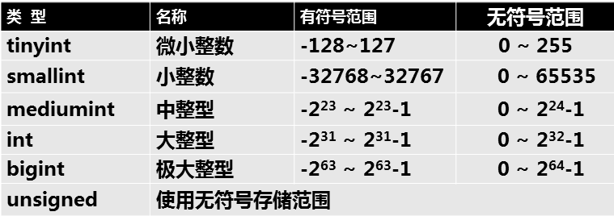

- [学习目标](#学习目标)
- [课堂笔记（命令）](#课堂笔记命令)
- [课堂笔记（文本）](#课堂笔记文本)
	- [表管理](#表管理)
		- [建库](#建库)
		- [建表](#建表)
			- [基础创建](#基础创建)
			- [添加表头](#添加表头)
			- [删除表头](#删除表头)
			- [修改表名](#修改表名)
			- [修改表头名](#修改表头名)
			- [修改表数据类型](#修改表数据类型)
			- [复制表](#复制表)
	- [数据类型](#数据类型)
		- [字符类型](#字符类型)
			- [数据准备](#数据准备)
			- [char](#char)
			- [varchar](#varchar)
			- [两则区别](#两则区别)
		- [数值类型](#数值类型)
			- [数据准备](#数据准备-1)
			- [整形](#整形)
			- [浮点型](#浮点型)
		- [枚举类型](#枚举类型)
			- [数据准备](#数据准备-2)
			- [单选](#单选)
			- [多选](#多选)
		- [日期时间类型](#日期时间类型)
- [快捷键](#快捷键)
- [问题](#问题)
- [补充](#补充)
- [今日总结](#今日总结)
- [昨日复习](#昨日复习)


# 学习目标

表管理

数据类型

数据批量处理

表头基本约束

# 课堂笔记（命令）


# 课堂笔记（文本）

## 表管理

### 建库

> 库名的命名规则：
>
> + 数字、字母、下划线，不能纯数字
> + 区分字母大小写
> + 具有唯一性
> + 不可使用MySQL命令或特殊字符

```sql
"创建格式"
create database [if not exists] <数据库名> [[default] character set <字符集合>] [[default] collate <校对规则名>];
```

```sql
"创建库"
create database 库名;
"删除库"
drop dtabases 库名;
"创建已有库屏蔽报错"
create database if not exists 已有库库名;
"删除已已经删除库屏蔽报错"
drop databases if exists 已删除库库名;
"修改库"
alter database 数据库名{[default] character set <字符集名> [default] collate <校对规则名>};
```

### 建表

```sql
"创建格式"
create table 库.表名(表头, 类型);
"删除格式"
drop table 库.表名;
"修改表结构"
alter table 库.旧库名 执行动作;
					添加表头
					add 表头名 数据类型;
					删除表头
					drop 
					修改表名
					rename
					修改数据类型
					modify
					修改表头名
					change 
```

#### 基础创建

```sql
"创建数据库，studb"
create database studb; 
use studb

"在studb库中创建stu表"
create table stu(
name char(10),
class char(9),
gender char(4),    
age int
)
```

#### 添加表头

```sql
"单个表头添加-默认添加在当前表的最后面"
alter table stu add sid char(11);
"多个表头添加"
alter table stu add emile char(11),add number char(11);
"指定添加表头位置-第一列"
alter table stu add id int first;
"指定添加表头位置-在name后面"
alter table stu add a char(5) after name;
```

> 添加后使用desc 查看表结构

#### 删除表头

```sql
"单个表头删除"
alter table stu drop a;
"多个表头删除"
alter table stu drop id,drop sid;
```

#### 修改表名

```sql
alter table stu rename stus;
"验证"
show tables;
```

#### 修改表头名

```sql
"将number更改为num-修改后需要跟上类型(新的类型或原表头数据类型)"
alter table stus change number num int;
```

#### 修改表数据类型

> + 如果表头下没有存储数据类型可以随便修改
> + 反之有数据，修改的新类型不能与已经存储的数据冲突，冲突将不能进行修改

```sql
alter table stus modify name char(15); 
```

#### 复制表

> 可根据查询要求备份数据

```sql
"格式"
create table 库.备份后的表 select查询命令;
```

```sql
"仅备份表头"
create table stu_calss like stus;
"备份和数据与表头"
create table studb.salary select * from tarena.salary;
"备份tarena库2018年七月份工资大于15000到studb库下"
create table studb.salary_7 select * from tarena.salary where year(date)=2018 and month(date)=7 and basic>15000;
```

## 数据类型

### 字符类型

> 已知长度用户char  例如：电话号码
>
> 未知长度用户varchar 例如：邮箱

#### 数据准备

```sql
name char(3),
site varchar(6)    
);
```

#### char

> + 定长字符类型 最多为255个字符
> + 超出设定的长度将会报错

```sql
insert into t1 values("张三","四川省成都市");

"超出长度将会报错"
insert into t1 values("张三丰是真的风","四川峨眉山");
# Data too long for column 'name' at row 1
```

#### varchar

> + 变长字符类型，最多为65532
> + 超出设定的长度将会报错

```sql
insert into t1 values("张三","四川省成都市");

"超出长度将会报错"
insert into t1 values("张三丰","四川峨眉山山上");
# Data too long for column 'site' at row 1
```

#### 两则区别

> + char存储定长字符，当存储数据长度小于指定(创建表时指定的长度)的长度时，将会自动使用空格补齐
> + varchar可变长度，没有自动补齐

### 数值类型

#### 数据准备

```sql
create table t2(
人物 varchar(10),
等级 tinyint unsigned,
点卷 float    
);
```

#### 整形

> + 只能存储整数
> + 存储小数，将会四舍五入



```sql
insert into t2 values("战士",-1,999.9); 由于在等级字段设置了unsigned无符号存储
# Out of range value for column '等级' at row 1   

insert into t2 values("战士",1,999.9);
```

#### 浮点型

> + 即能存储整数又能存储小数


> 单精度长度：255\*255\*255\*255
>
> 双精度长度：255\*255\*255\*255\*255\*255\*255\*255
>
> [注]：存放数字的长度

```sql
insert into t2 values("战士",1,999.9);
insert into t2 values("法师",15,98);
```

### 枚举类型

#### 数据准备

```sql
create table t3(
姓名 char(10),
性别 enum("男","女"),
爱好 set("吃","喝","玩","乐")
);
```

#### 单选

> 枚举中存储的是一个集合，可通过数值来获取枚举集合中的值

```sql
"关键词：enum 字段值仅能在范围内选择一个值"
insert into t3 values("小张","男女","吃");
Data truncated for column '性别' at row 1

insert into t3 values("小张","男","吃");
insert into t3 values("小张","1","吃"); # 通过数值来获取枚举值
```

#### 多选

```sql
"关键词：set 字段值仅能在范围内选择一个或多个值"
insert into t3 values("小张","男","吃,hah");
Data truncated for column '爱好' at row 1

insert into t3 values("小张","男","吃,喝");
```

### 日期时间类型

# 快捷键


# 问题


# 补充


# 今日总结


# 昨日复习