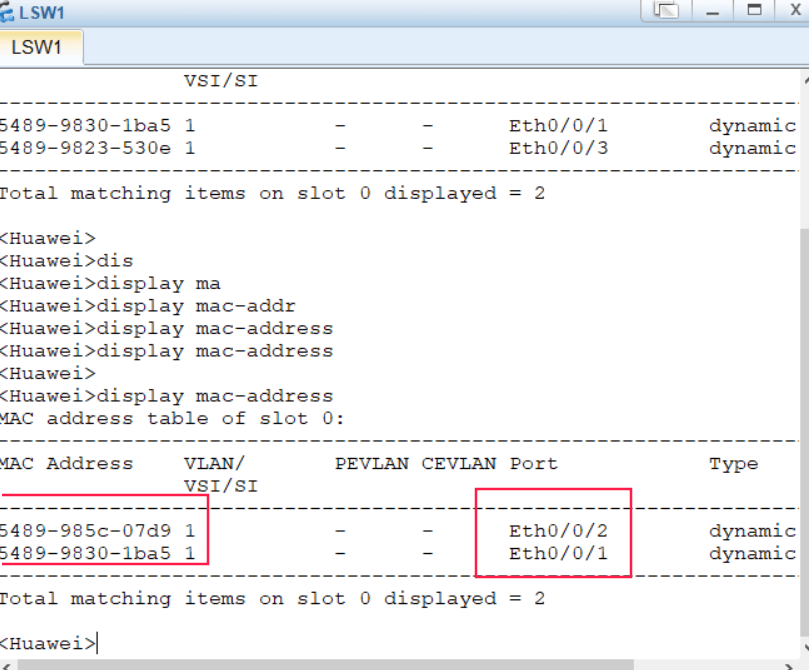

- [学习目标](#学习目标)
- [课堂笔记（命令）](#课堂笔记命令)
- [课堂笔记（文本）](#课堂笔记文本)
  - [计算机网络的功能](#计算机网络的功能)
  - [计算机网络发展阶段](#计算机网络发展阶段)
  - [网络拓扑结构](#网络拓扑结构)
    - [星型拓扑图](#星型拓扑图)
    - [网状拓扑图](#网状拓扑图)
  - [设备与层的对应关系](#设备与层的对应关系)
  - [eNSP与交换机命令行](#ensp与交换机命令行)
    - [改变命令行试图](#改变命令行试图)
    - [查看设备型号](#查看设备型号)
    - [设置主机名](#设置主机名)
    - [关闭日志提示](#关闭日志提示)
    - [查看系统配置文件](#查看系统配置文件)
    - [创建用户](#创建用户)
    - [永久设置](#永久设置)
  - [交换机工作原理](#交换机工作原理)
  - [交换机原理案例](#交换机原理案例)
    - [单个交换机](#单个交换机)
    - [多个交换机](#多个交换机)
- [快捷键](#快捷键)
- [问题](#问题)
- [补充](#补充)
- [今日总结](#今日总结)
- [昨日复习](#昨日复习)


# 学习目标

了解网络功能

学习网络参考模型

交换机基本命令操作

交换机基本工作原理

# 课堂笔记（命令）

# 课堂笔记（文本）

## 计算机网络的功能

1. 资源共享
2. 信息传递
3. 增加可靠性
4. 提高系统处理能力

## 计算机网络发展阶段

+ 60年代

  分组交换

  > 将数据分成一组一组，再进行一组一组传输，每传一组都进行标记，断网后，联网后还能继续再传

+ 70-80年代

  TCP/IP

  > 出现局限，不兼容不同品牌
  >
  > 出现ISO统一技术，解决兼容性问题

+ 90年代后

  Web技术

## 路由交换设备

路由器：远距离传输数据，跨网络传输

交换机：让设备互联，组件局域网

## 网络拓扑结构

**连接网络的方式**

### 星型拓扑图


**优点：**

+ 易于实现
+ 易于网络扩展
+ 易于故障排查

**缺点：**

+ 可靠性低

### 网状拓扑图


**优点：**

+ 一个节点与其他多个节点相连
+ 高可靠

**缺点：**

+ 组网成本高

## 设备与层的对应关系

TCP/IP模型：

应用层========计算机

传输层========防火墙====tcp、udp

网路层========路由器====ip

数据链路层========交换机=======vlan、trunk

物理层 =======网卡

## eNSP与交换机命令行

### 改变命令行视图

```
<Huawei>  # 用户视图
<Huawei>system-view # 切换系统视图
[Huawei]  # 系统视图
[Huawei]interface Ethernet 0/0/1 #切换接口视图
[Huawei interface Ethernet 0/0/1]  # 接口视图
[Huawei interface Ethernet 0/0/1]quit # 返回上一级视图
[Huawei]return # return或crel+z直接返回到用户视图
<Huawei>

快捷命令
<Huawei>sys?  # 查询系统以sys开头有哪些命令
system-view
```

### 查看设备型号

```
<Huawei>display version # 查询设备型号版本 （display开头，在任何视图都管用）
```

### 设置主机名

```
<Huawei>system-view # 进入系统视图
[Huawei]sysname sw1 #必须在系统视图进行改名
[sw1]
```

### 关闭日志提示

```
[sw1]undo info-center enable 
```

### 查看系统配置文件

```
[sw1]display current-configuration # 查看配置按空格翻页，按回换行，或用鼠标滚轮查看
```

### 创建用户

```
<sw1>system-view #进入系统视图
[sw1]aaa # 进入帐号管理视图
[sw1-aaa]local-user test01 password cipher 123 # 创建用户test01,(cipher)使密码加密
[sw1-aaa]display current-configuation # 查看详细配置信息
[sw1-aaa] quit  #退出到系统视图
[sw1]user-interface console 0 #进入用户控制台接口
[sw1-ui-console0]authentication-mode aaa # 激活配置
输入ctrl + ] 退出 ，再次进入，输入帐密
```

### 永久设置

以上设置为临时设置

```
[sw1-ui-console0]return # 回到用户视图
<sw1>save  # 保存配置，敲击两次回车即可
```

## 交换机工作原理

> 学习：MAC地址表是交换机通过学习接收的数据帧的源MAC地址来形成的
>
> 广播：如果目标地址在MAC地址表中没有，交换机就向除接收到该数据帧的接口外的其他所有接口广播该数据帧
>
> 转发：交换机根据MAC地址表单播转发数据帧
>
> 更新：交换机MAC地址表的老化时间是300秒，交换机如果发现一个帧的入接口和MAC地址表中源MAC地址的所在接口不同，交换机将MAC 地址重新学习到新的接口

## 交换机原理案例

### 单个交换机




**图片解释**：1.1机器需要向2号机器传递信息，向交换机发送请求，交换机mac表中无信息，开始学习将1.1机器的mac地址记下来以及网卡号，交换机收到目标地址后，检视自己的mac表中有没有，没有就开始进行广播，1.2机器收到广播发现自己是目标地址后，并向交换机做出反应，交换机接收到响应后，开始学习将1.2机器的mac地址及网卡号记录下来，查询到1.2机器的源地址与1.1目标地址相同开始向1.1机器进行转发数据，300秒后1.1或1.2机器之间没有通信，交换机中的mac地址将进行更新

### 多个交换机


**图片解释：**1.1机器向1.3机器发送信息，交换机先开始学习记录mac地址及网卡号，开始进行发送广播，交换机2接收到广播后，开始进行学习将目标mac地址及网卡号记录下来，也开始进行广播目标机器1.3接收到广播后开始进行响应，交换机对1.3机器的响应进行学习并记录mac地址及网卡号，对照广播中的目标地址与1.3机器的源地址进行比对，比对后开始向交换机1作出响应，交换机接收到响应后开始学习，并记录mac地址及网卡号，将接收到的信息与mac表中的信息进行对比，然后将信息响应给1.1机器

# 快捷键

ctrl + ] 

> 退出

ctrl +c

> 退出配置文件页面

ctrl +z

> 退回到用户视图

# 问题

1. 描述计算机网络的功能

   传递信息，资源共享，增加可靠性，提高系统处理能力

2. 计算机发展过程中，70-80年代诞生了标志性技术

   TCP/IP

3. 常见的网络拓扑结构有哪些

   星状、网状

4. OSI的七层与TCP/IP五层参考模型分别是

   OSI七层：物理层、数据链路层、网络层、传输层、会话层、表示层、应用层

   TCP/IP五层：物理层、数据链路层、、网络层、传输层、应用层

5. 华为路由交换设备常见命令行视图有那些

   用户视图-<>

   系统视图-[]

   接口视图

6. 交换机工作原理是那几个步骤

   学习-》广播-》转发-》更新

# 补充


# 今日总结


# 昨日复习