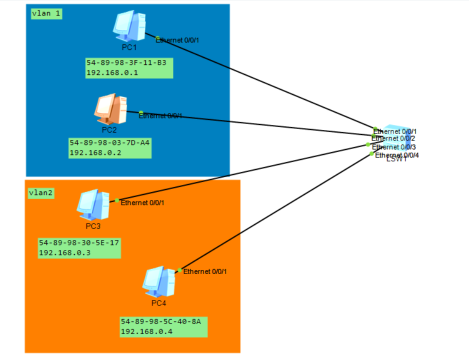
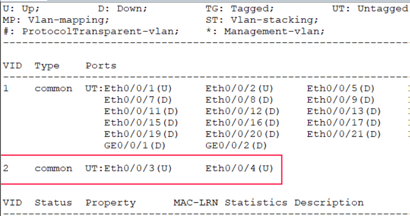
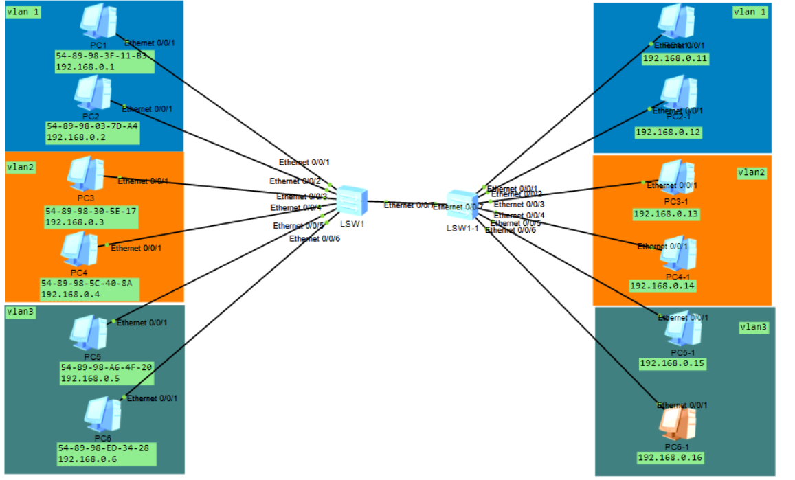
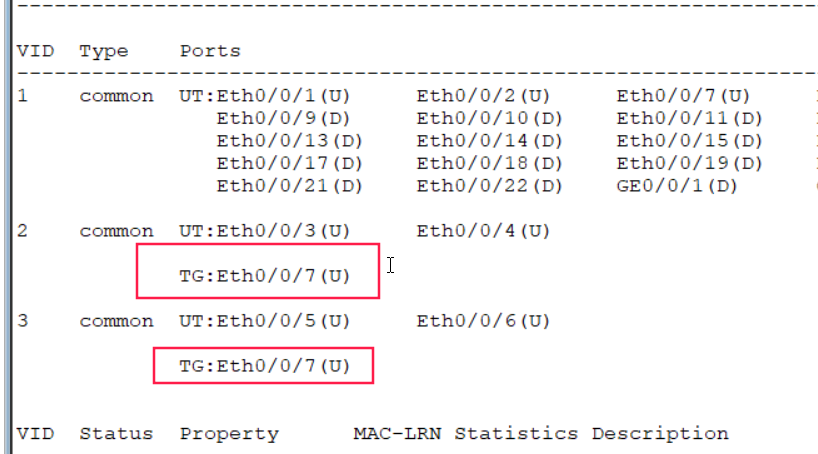
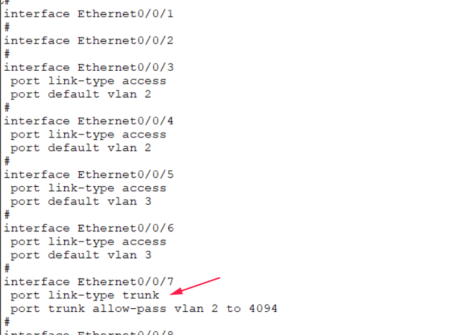
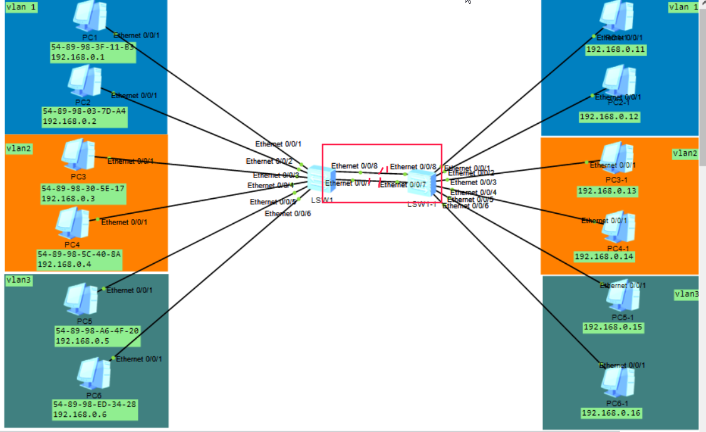
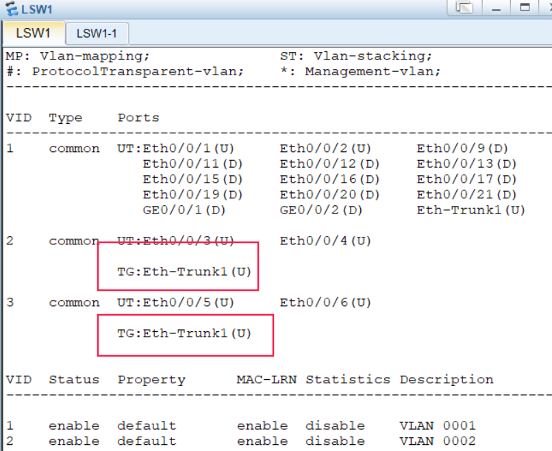
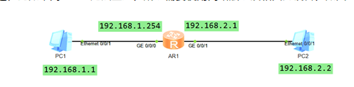
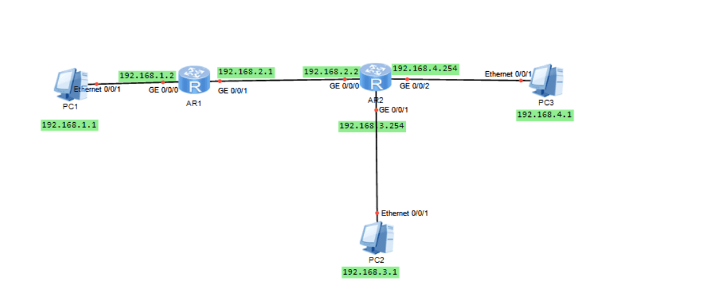

- [学习目标](#学习目标)
- [课堂笔记（命令）](#课堂笔记命令)
- [课堂笔记（文本）](#课堂笔记文本)
  - [广播域](#广播域)
  - [VLAN概述](#vlan概述)
  - [VLAN配置](#vlan配置)
    - [接入链路VLAN图](#接入链路vlan图)
    - [创建VLAN](#创建vlan)
    - [查询VLAN](#查询vlan)
    - [删除VLAN](#删除vlan)
    - [划分VLAN](#划分vlan)
    - [批量创建vlan](#批量创建vlan)
    - [VLAN组创建](#vlan组创建)
    - [测试验证VLAN](#测试验证vlan)
    - [中继链路VLAN图](#中继链路vlan图)
    - [配置中继链路](#配置中继链路)
    - [链路聚合](#链路聚合)
    - [vlan链路聚合图](#vlan链路聚合图)
    - [配置链路聚合](#配置链路聚合)
    - [接口错误解决办法](#接口错误解决办法)
  - [网络层](#网络层)
    - [功能](#功能)
    - [网络层协议](#网络层协议)
    - [路由器原理](#路由器原理)
    - [如何获取路由表](#如何获取路由表)
    - [直连路由配置](#直连路由配置)
    - [静态路由配置](#静态路由配置)
- [快捷键](#快捷键)
- [问题](#问题)
- [补充](#补充)
- [今日总结](#今日总结)
- [昨日复习](#昨日复习)


# 学习目标

VLAN技术及应用

Trunk

链路集合

网络层

# 课堂笔记（命令）


# 课堂笔记（文本）

## 广播域

+ 广播域指接收同样广播消息的范围，在该范围中的任何一个设备发送广播，所有其他设备都可以收到

+ 默认情况下交换机的所有接口属于同一个广播域

## VLAN概述

**什么是VLAN？**

+ Virtual LAN （虚拟局域网）

**为什么用VLAN**

交换机所有接口默认属于同一个广播域，随着接入设备的增多，网络中的广播增多，降低网络的效率，使用vlan可以分割广播域避免该问题

**VLAN的作用**

+ 广播控制
+ 增加安全
+ 提高宽带利用
+ 降低数据传递延迟

## VLAN配置

access：接入链路，可以承载1个vlan的数据

trunk：中继链路，可以承载多个vlan的数据

### 接入链路VLAN图



目的：将1和2号设备网络互通，3和4网络互通，不同valn区域网络不可达

### 创建VLAN

```
<Huawei>system-view #进入系统视图
[Huawei]undo info-center enable  # 关闭日志
[Huawei]vlan 2 # 创建vlan2
[Huawei]vlan 3 # 创建vlan3
```

[注]：所有设备默认属于valn1

### 查询VLAN

```
[Huawei]display valn # 查询设备valn信息
```

### 删除VLAN

```
[Huawei]undo valn 3 # 删除vlan3
```

### 加入VLAN

将模拟vlan图中的1 2划分到vlan1,3 4 划分到valn2

```
[Hawei]interface Ethernet 0/0/3 # 进入3号接口
[Hawei-Ethernet0/0/3]port link-type access # 设置接口类型为接入链路
[Hawei-Ethernet0/0/3]port default vlan 2 # 将3接口设置为valn2
[Hawei-Ethernet0/0/3]quit 
[Hawei]interface Ethernet 0/0/4 
[Hawei-Ethernet0/0/4]port link-type access 
[Hawei-Ethernet0/0/4]port default vlan 2
[Hawei-Ethernet0/0/4]quit
[Huawei]display valn # 查看分配情况
```
### 批量创建VLAN

```
[Huawei]vlan batch 2 3 # 批量创建2号3号vlan
[Huawei]vlan batch 4 to 10  # 批量创建4-10 vlan
```

补充：删除前面加上undo  undo vlan batch 4 to 10 

### VLAN组创建

```
[Huawei]port-group 1# 创建进入接口组1
[Huawei-port-group-1]group-member Ethernet 0/0/3 Ethernet 0/0/4 # 将3 4接口加入到组中
[Huawei-port-group-1]port link-type access #设置组的接口为接入链路
[Huawei-port-group-1]port default vlan2 # 将接口组中的所有接口加入到vlan2中
[Huawei-port-group-1]display vlan # 查询添加情况
```
### 测试验证VLAN

同vlan域中设备接口相互ping

不同vlan域中设备相互ping



### 中继链路VLAN图

**背景：**

交换机中接口不够，扩充交换机，不同交换机相同vlan通信需要设置中继链路，而图中**ethernet 0/0/7接口**将被设置中继链路

若不设置中继链路，两台交换机vlan1中能相互通信，则vlan2与vlan3将目标主机不可达

**作用：**

除了扩展网络覆盖范围外，中继链路还可以提高网络性能和稳定性



### 配置中继链路

两台交换机都需配置

sw1配置

```
[Huawei]interfache Ethernet 0/0/7 
[Huawei-Ethernet0/0/7]port link-type trunk # 配置为中继链路
[Huawei-Ethernet0/0/7]port trunk allow-pass vlan all #放置所有vlan的数据
```

sw2配置

```
[Huawei]interfache Ethernet 0/0/7 
[Huawei-Ethernet0/0/7]port link-type trunk 
[Huawei-Ethernet0/0/7]port trunk allow-pass vlan all 
[Huawei-Ethernet0/0/7]quit
[Huawei]display vlan # 查看vlan信息
```



```
[Huawei]display current-configuration # 查看配置情况
```



### 链路聚合

**作用：**

多条中继链路“捆绑”在一起

多条线路负载均衡，带宽提高

降低容错，当一条线路失效时，不会造成全中断

### vlan链路聚合图



图片解释：根据中继链路图我们在两台交换机中增加了一条线路，这样就叫链路聚合

### 配置链路聚合

前提：根据中继链路图来做

```
[Huawei]clear configuration interface Ethernet 0/0/7  # 恢复接口为默认配置
[Huawei]interfache ehternet 0/0/7 # 进入7号接口
[Huawei-Ethernet0/0/7]undo shutdown # 重启线路，不然将一直爆红
```

**交换机1与交换机2都做同样操作**

```
# 添加一条线路ethernet 0/0/8
[Huawei]interface eth-trunk 1 # 创建并进入链路聚合组
[Huawei-Eth-trunk1]trunkport ethernet 0/0/7 0/0/8 # 将 7 8接口捆绑在链路聚合组中
[Huawei-Eth-trunk1]port link-type trunk
[Huawei-Eth-trunk1]port trunk allow-pass vlan all		
```

配置完成后使用 display vlan查看，并使用ping进行测试



### 接口错误解决办法

1. 接口加错组

   进入组视图输入命令进行取消

   undo group-member Ethernet 0/0/7

2. 恢复接口为默认配置

   clear configuration interface Ethernet 0/0/7 

3. 接口爆红恢复

   interface Enthernet 0/0/7 # 进入接口

   undo shutdown  # 开启接口

## 网络层

### 功能

定义了IP地址

连接不同的媒介类型（不同范围的网络、不同的硬件、不同的系统）

选择数据通路路径

### 网络层协议

**ICMP**

icmp（控制报文协议）

通过IP数据报传送，用来发送错误和控制信息

**ARP**

arp（地址解析协议）

在网络中发送数据时，需要目标ip和目标mac地址，但由于发送时只知道目标ip地址，不指定mac地址，所以用arp可以根据ip地址信息解析除目标mac地址，以豹子通信的顺利进行

### 路由器原理

将数据包从一个网络发送到另一个网络，用于将不同网段的网络连通进行通信

路由器可以根据路由表进行选择

+ 每个路由器都维护着一张路由表，这是路由器转发数据包的关键
+ 每条路由表记录指明了：到达某个网段应从那个接口发送

路由器接口从0号开始

### 如何获取路由表

+ 直接路由

  直连路由，将接口配置好IP并且开启后，将自动产生

+ 静态路由

  根据网络拓扑或流量变化，由路由器通过路由协议自动设置

  ISP服务商、广域网、等大型网络

### 直连路由配置



**配置PC1 2的IP与网关**

双击PC进行ip配置（记得点击应用）

pc1 IP与网关： 192.168.1.1	192.168.1.254

pc2 IP与网关： 192.168.2.2	192.168.2.1

**配置路由器IP**

```
[Huawei]interface GiabitEthernet 0/0/0 # 进入0号接口
[Huawei-GiabitEthernet0/0/0]ip address 192.168.1.254 #配置ip
[Huawei-GiabitEthernet0/0/0]quit 
[Huawei]interface GiabitEthernet 0/0/1
[Huawei-GiabitEthernet0/0/1]ip address 192.168.2.1 #配置路由ip
<Huawei>display ip interface brief # 查看路由设备所有IP配置

[Huawei-GiabitEthernet0/0/1]undo ip address # ip配置错误可使用此命令进行删除 
```

**查询路由表**

```
<Huawei>display ip routing-table | include /24 # 使用过滤查询掩码24的路由信息
```

### 静态路由配置



**什么时候用静态路由**

非直连路由的时候需要配置静态路由

**基于直连路由配置**

添加一个路由器，以及两台PC并且配置IP及网关

**添加路由信息**

语法格式：ip route-static 目标网段 掩码 下一跳地址

*在第一台路由器配置*：

```
[Huawei]ip route-static 192.168.3.0 24 192.168.2.2  # 添加
[Huawei]ip route-static 192.168.4.0 24 192.168.2.2 
<Huawei>display ip routing-table | include /24 # 查询路由表
```

*第二台路由器配置*：

```
[Huawei]ip route-static 192.168.1.0 24 192.168.2.1
<Huawei>display ip routing-table | include /24 # 查询路由表
```

**配置错误操作**

```
[Huawei]undo ip route-static 192.168.1.0 24 192.168.2.1 # 删除
```

**拍错思路：**

1. 检查pc的IP与网关
2. 从最短距离开始ping测试，由金及远
3. 检查路由器的路由表

# 快捷键


# 问题


# 补充


# 今日总结

# 昨日复习