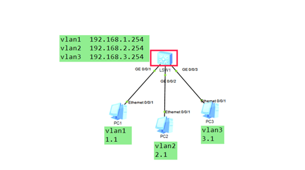
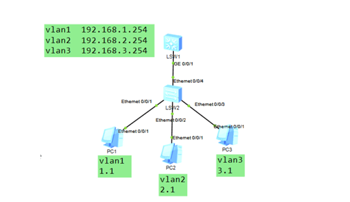
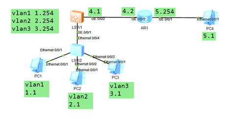
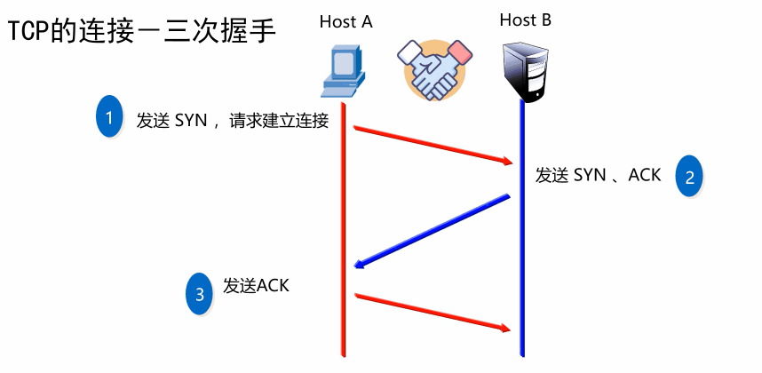
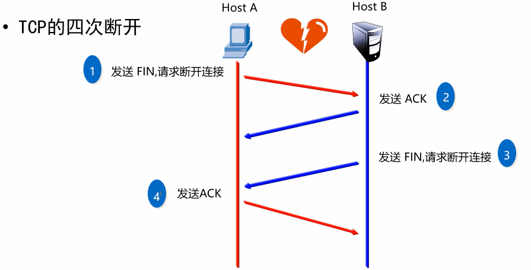

- [学习目标](#学习目标)
- [课堂笔记（命令）](#课堂笔记命令)
- [课堂笔记（文本）](#课堂笔记文本)
  - [三层交换机](#三层交换机)
    - [三层交换机组成](#三层交换机组成)
    - [三层交换机-基础](#三层交换机-基础)
    - [三层交换机配置](#三层交换机配置)
    - [创建虚拟接口](#创建虚拟接口)
    - [三层交换机-添加一个交换机](#三层交换机-添加一个交换机)
    - [配置详情](#配置详情)
  - [动态路由](#动态路由)
    - [路由协议](#路由协议)
    - [动态路由-基础](#动态路由-基础)
    - [配置详情](#配置详情-1)
  - [默认路由](#默认路由)
  - [传输层](#传输层)
    - [传输层协议](#传输层协议)
      - [TCP](#tcp)
      - [UDP](#udp)
  - [ACL策略](#acl策略)
    - [ACL的主要类型](#acl的主要类型)
    - [ACL规则](#acl规则)
    - [基本ACL的配置-1](#基本acl的配置-1)
      - [路由器配置](#路由器配置)
      - [路由器ACL配置](#路由器acl配置)
    - [基本ACL的配置-2](#基本acl的配置-2)
      - [路由器ACL配置](#路由器acl配置-1)
- [快捷键](#快捷键)
- [问题](#问题)
  - [vlan 为什么要隔开？](#vlan-为什么要隔开)
  - [传输层有哪些协议，各有什么特点？](#传输层有哪些协议各有什么特点)
  - [smtp、dns、telnet、tftp、ntp分别是什么协议，使用了什么端口](#smtpdnstelnettftpntp分别是什么协议使用了什么端口)
  - [ACL常见类型有哪些，各有什么区别](#acl常见类型有哪些各有什么区别)
- [补充](#补充)
- [今日总结](#今日总结)
- [昨日复习](#昨日复习)


# 学习目标

使用三层交换机

使用OSPF连接网络

传输层协议

ACL原理与应用

# 课堂笔记（命令）


# 课堂笔记（文本）

## 三层交换机

### 三层交换机组成

二层交换机与三层路由器的组合

对于二层交换机而言，不仅能够进行数据转发和过滤，还能进行路由功能

当局域网规模逐渐扩大，需要更多的子网和更复杂的网络拓扑结构时，就需要使用三层交换机来进行网络管理

配置三层交换机可以提高网络的可靠性、性能和安全性，同时可以更好地支持网络的发展和管理

### 三层交换机-基础



**图片背景：**

主机连接交换机，交换机连接路由器，随着主机的增多，路由器及交换机都将增加，且路由器接口有限制，所以使用三层交换机大大降低了上述压力

### 三层交换机配置

配置准备：三台pc与一台三层交换机

```
<Huawei>system-view # 进入系统视图
[Huawei]undo info-center enable # 关闭日志
[Huawei]vlan batch 2 3 # 创建vlan 2 3
# 系统默认将所有接口归属与vlan1
[Huawei]interface GigabitEthernet0/0/2 # 进入2口
[Huawei-GigabitEthernet0/0/2]port link-type access # 配置接口类型为access
[Huawei-GigabitEthernet0/0/2]port defautl vlan 2 # 把2口加入到vlan2中
[Huawei-GigabitEthernet0/0/2]in g/0/0/3 # 进入3口
[Huawei-GigabitEthernet0/0/3]port link-type access
[Huawei-GigabitEthernet0/0/3]port default vlan 3
# 路由器可以在物理接口中配置IP，作为pc的网关，而三层交换机需到虚拟接口进行配置IP
```

### 创建虚拟接口

[注]：创建虚拟接口时，需提前创建好vlan

```
[Huawei]interface Vlanif 1 #创建并进入虚拟接口1（数字为自己创建）
[Huawei-Vlanif1]ip address 192.168.1.254 # 配置ip，该IP可以作为vlan1的网关
[Huawei]interface Vlanif 2
[Huawei-Vlanif2]ip address 192.168.2.254
[Huawei]interface Vlanif 3
[Huawei-Vlanif3]ip address 192.168.3.254
[Huawei-Vlanif3]quit
[Huawei]display ip interface brief # 检查IP
```

**测试**：在不同pc ping不同网段主机

### 三层交换机-添加一个交换机



**图片背景：**

同三层交换机基础一样，当设备沾满三层交换机所有接口后，还需扩展三层交换机，这里使用一个交换机连接主机，再使交换机一个接口来连接三层交换机，可以更好的提高网络性能与可靠

### 配置详情

```
// s3700交换机配置如下
[Huawei]vlan batch 2 3 # 创建vlan2 3
[Huawei]interfach ethernet0/0/2 # 进入e0/0/2接口
[Huawei-ethernet0/0/2]port link-type access # 配置接口类型
[Huawei-ethernet0/0/2]port default vlan 2 # 将接口加入到vlan 2里
[Huawei-ethernet0/02]in eth /0/0/3 
[Huawei-ethernet0/0/3]port link-type access
[Huawei-ethernet0/0/3]port default vlan 3
[Huawei-ethernet0/0/3]in eth/0/0/4 
[Huawei-ethernet0/0/4]port link-type trunk # 配置接口类型为trunk，因为将要接收多vlan
[Huawei-ethernet0/0/4]port trunk allow-pass vlan all # 放行所有vlan
```

```
//s5700 三层交换机配置
[Huawei]in g0/0/1
[Huawei-GigabitEthernet0/0/1]port link-type trunk # 将g0/0/1设置为中继链路
[Huawei-GigabitEthernet0/0/1]port trunk allow-pass vlan all
```

## 动态路由

简述：基于某种协议实现的一种功能

特点：

+ 减少了管理任务
+ 配置接口IP地址后，路由表中自动生成直连路由信息
+ 不需要手工写路由，路由器之间嫩够自己相互学习
+ 自动更新路由表

使用方法：宣告，对外告知自身所在直连的网段

### 路由协议

OSPF区域（area）

+ 为了适应大型的网络，OSPF可以在网络内部划分多个区域

区域0

+ ospf使用的第一个区域id号

### 动态路由-基础



**图片解释：**5.1机器作为外网，1.1-3.1所有机器需访问

**配置前提**：按照上方三层交换机-添加一个交换机配置进行后续配置

### 配置详情

路由器配置IP

```
[Huawei]interface GigabitEthernet 0/0/0
[Huawei-GigabitEthernet0/0/0]ip address 192.168.4.2 24
[Huawei-GigabitEthernet0/0/0]in g/0/0/1
[Huawei-GigabitEthernet0/0/1]ip address 192.168.5.254 24
```

三层交换机配置

```
配置思路
1,创建一个vlan
2,创建虚拟vlanif4接口，并配置ip
3,将需配置的ip接口加入vlan中
[Huawei]vlan 4
[Huawei-vlan4]interface vlanif 4 # 创建进入虚拟接口4
[Huawei-vlanif4]ip address 192.168.4.1 24 # 为vlan4配置ip
[Huawei-vlanif4]quit 
[Huawei]in g0/0/2 # 进入g2号口
[Huawei-GigabitEthernet0/0/2]port link-type access # 配置接口类型
[Huawei-GigabitEthernet0/0/2]port default vlan 4 # 把2口加入到vlan4
```

三层交换机动态路由配置

```
// 由动态路由详情，配置动态路由就只用配置直连路由地址即可
// 添加动态路由时，子网掩码需要添加成反掩码
// 反掩码计算：将子网掩码转换为二进制，然后去反，0变1,1变0
[Huawei]ospf # 使用ospf协议
[Huawei-ospf-1]area 0 # 进入区域0
[Huawei-ospf-1-0.0.0.0]network 192.168.1.0 0.0.0.255 # 依次宣告
[Huawei-ospf-1-0.0.0.0]network 192.168.2.0 0.0.0.255
[Huawei-ospf-1-0.0.0.0]network 192.168.3.0 0.0.0.255
[Huawei-ospf-1-0.0.0.0]network 192.168.4.0 0.0.0.255
```

路由器中配置动态路由

```
[Huawei]ospf
[Huawei-ospf-1]area 0
[Huawei-ospf-1-0.0.0.0]network 192.168.4.0 0.0.0.255
[Huawei-ospf-1-0.0.0.0]network 192.168.5.0 0.0.0.255
[Huawei-ospf-1-0.0.0.0]display this #可以查看当前视图的配置
----------------------
添加错误时
[Huawei-ospf-1-0.0.0.0]undo network 192.168.1.0 0.0.0.255
```

测试：不同网段相互ping

## 默认路由

默认路由为特殊静态路由，可以匹配任意网段，专门用来访问海量外部网络使用

```
// 路由器配置
[Huawei-ospf-1-area-0.0.0.0]undo network 192.168.5.0 0.0.0.255  # 取消路由器宣告5网段
// 三层交换机配置
[Huawei]ip route-static 0.0.0.0 192.168.4.2 # 配置静态路由  0.0.0.0 表示任意网段
[Huawei]display ip routing-table|include /0 # 查看默认路由
```

## 传输层

网络层提供点到点的连接

传输层提供端到端的连接

### 传输层协议

#### TCP

传输控制协议

+ 可靠的，面向连接的协议
+ 传输效率低

**三次握手**



> 1. 客户端向服务器发送 SYN 报文，表示客户端请求建立连接，并指定自己的初始序列号 seq=x。
> 2. 服务器收到 SYN 报文后，回复客户端一个 SYN-ACK 报文，表示服务器已经收到了客户端的请求，并确认客户端的序列号是 x，同时指定自己的初始序列号 seq=y。
> 3. 客户端收到 SYN-ACK 报文后，会再次回复服务器一个 ACK 报文，表示客户端已经收到了服务器的确认，并且确认序列号为 y+1。
>
> 这样，TCP连接就建立成功了。在建立连接时，客户端和服务器分别发送了两个报文段
>
> TCP三次握手的目的是确保双方都能够发送和接收数据，避免数据的丢失或重复。其中，第一次握手是客户端**发起连接请求**，第二次握手是**服务器确认连接请求**并分配资源，第三次握手是**客户端确认连接并通知服务器**可以开始发送数据。

**四次挥手**



> 1. 主动关闭方发送FIN（Finish）报文：主动关闭方向被动关闭方发送一个FIN报文，表示主动关闭方希望关闭连接。
> 2. 被动关闭方发送ACK（Acknowledgement）报文：被动关闭方收到主动关闭方的FIN报文后，发送一个ACK报文确认收到，并进入CLOSE_WAIT状态。
> 3. 被动关闭方发送FIN报文：被动关闭方也希望关闭连接，所以它发送一个FIN报文给主动关闭方。
> 4. 主动关闭方发送ACK报文：主动关闭方收到被动关闭方的FIN报文后，发送一个ACK报文进行确认，此时连接处于TIME_WAIT状态。
>
> 在完成这四个步骤后，连接就能够完全断开，双方都进入CLOSED状态。
>
> 这种四次断开方式能够确保数据的可靠传输和双方对关闭连接的确认。每个步骤都有其特定的目的，以确保双方都能正确地关闭连接并清理相关资源。

#### UDP

用户数据报协议

+ 不可靠的，无连接的服务
+ 传输效率高

## ACL策略

用于限制网络访问的策略，ACL通过过滤数据来控制网络访问权限，在路由器上配置ACL可以增强网络安全性，防范攻击

ACL可以基于源IP地址、目的IP地址、协议类型和端口等参数设置规则。规则规则匹配情况，路由器可以通过允许或拒绝数据包的传输来控制网络访问权限，

### ACL的主要类型

基本ACL：2000-2999  源IP地址

高级ACL：3000-3999 源IP地址、目标IP地址、端口、协议

### ACL规则

每个ACL可以包含多个规则，路由器根据规则对数据流量进行过滤，匹配即停止

### 基本ACL的配置-1


**案例实现**：禁止2.1与1.1进行通信，但不影响其他主机通信

#### 路由器配置

```
[Huawei]in g0/0/0 # 进入g0口
[Huawei-GigabitEthernet0/0/0]ip address 192.168.1.254 24
[Huawei-GigabitEthernet0/0/0]ip g0/0/1
[Huawei-GigabitEthernet0/0/1]ip address 192.168.2.254 24
```

#### 路由器ACL配置

```
[Huawei]acl 2000 # 创建acl 列表好2000 创建基本acl规则
[Huawei-acl-basic-2000]rule deny source 192.168.2.1 0.0.0.0 # 创建规则只拒绝源地址192.168.2.1的数据通过
rule deny/permit source 源IP 反掩码（0匹配  1不匹配）  

[Huawei-acl-basic-2000]display this #查看当前视图配置
[Huawei-acl-basic-2000]quit
[Huawei]in g0/0/1
[Huawei-GigabitEthernet0/0/1]traffic-filter inbound acl 2000 # 定义数据是入方向，并应用之前创建的acl 2000
```

代码解读：

反掩码添加，注意是deny(拒绝)还是permit(允许)，0为匹配1为不匹配，只是针对某一个IP切记别写255，不然将限制了整个网段

激活acl规则是，明确数据是从那个地方进入(inbound)或是从那个地方出(outbound)，根据图片看到是要禁止2.1访问服务器，所以在路由器右边进行拦截，则是数据的入口

### 基本ACL的配置-2


**案例实现**：只允许2.1访问服务器，其余全部拒绝

#### 路由器ACL配置

```
# 取消上述添加的acl规则，进行重新添加
[Huawei-GigabitEthernet0/0/1]display this # 查看规则信息
[Huawei-GigabitEthernet0/0/1]undo traffic-fillter inbound
[Huawei-GigabitEthernet0/0/1]quit
[Huawei]acl 2001 # 创建新的acl规则
[Huawei-acl-basic-2001]rule permit source 192.168.2.1 0 #配置只允许2.1通过的规则，0.0.0.0可简写一个0
# 清楚acl规则，匹配即停止
[Huawei-acl-basic-2001]rule deny source any # 拒绝所有设备通过
[Huawei-acl-basic-2001]in g0/0/1 
[Huawei-GigabitEthernet0/0/1]traffic-fillter inbound acl 2001
```

代码解读：

创建acl，编写规则列表，清楚acl规则的匹配即停止

上述代码中规则1只是允许2.1客户端进行通过，那可能2网段或其余网段都还有可能进行访问，规则2则是拒绝所有客户端进行访问，注意是any不是all

# 快捷键


# 问题

## vlan 为什么要隔开？

> 减少广播的干扰

## 传输层有哪些协议，各有什么特点？

TCP

> 传输控制协议
>
> 可靠的，面向连接的协议
>
> 传输效率低

UDP

> 用户数据报协议
>
> 不可靠，无连接的服务
>
> 传输效率高

## smtp、dns、telnet、tftp、ntp分别是什么协议，使用了什么端口

> SMTP  邮件传输协议  25
>
> DNS    域名系统	53
>
> TELNET	远程登陆 23
>
> TFTP	简单文件传输协议	69
>
> NTP	网络时间协议	123

## ACL常见类型有哪些，各有什么区别

> 基本
>
> 基于源IP地址进行过滤数据包
>
> 列表号：2000-2999
>
> 高级
>
> 基于目标IP、源IP、端口、指定协议来过滤数据包
>
> 列表号：3000-3999

# 补充


# 今日总结


# 昨日复习