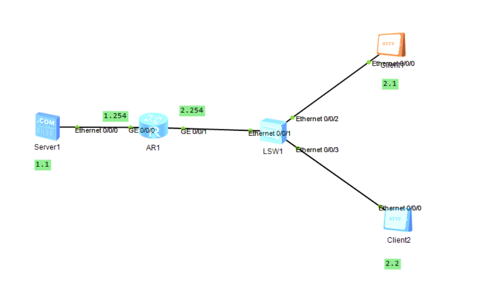
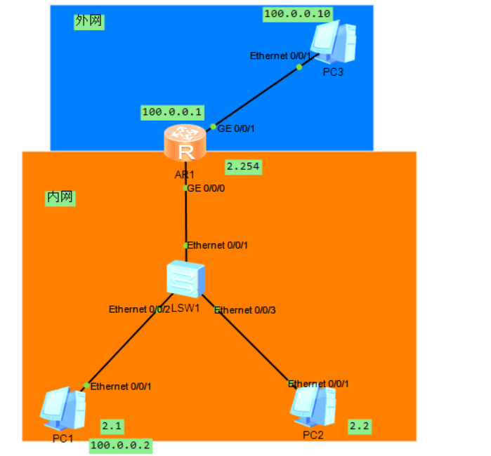
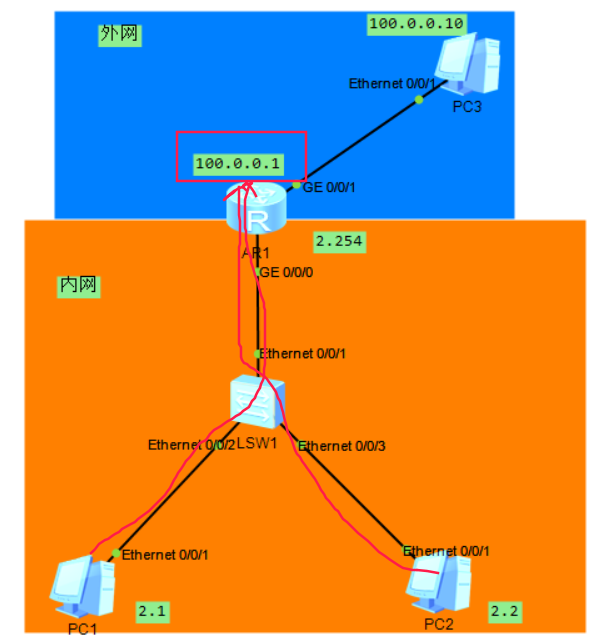
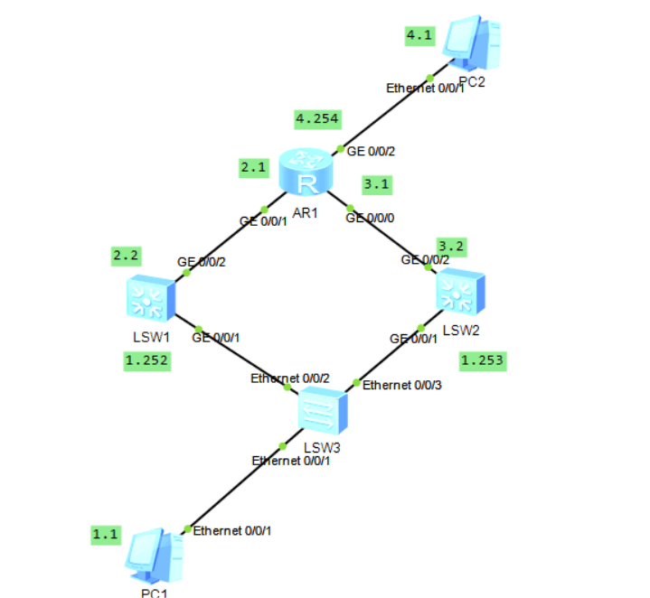

- [学习目标](#学习目标)
- [课堂笔记（命令）](#课堂笔记命令)
- [课堂笔记（文本）](#课堂笔记文本)
  - [高级ACL](#高级acl)
  - [配置ACL](#配置acl)
  - [NAT](#nat)
    - [私有IP划分](#私有ip划分)
    - [静态转换](#静态转换)
    - [静态转换配置](#静态转换配置)
    - [EasyIP](#easyip)
    - [EasyIP配置](#easyip配置)
  - [VRRP解析配置](#vrrp解析配置)
    - [VRRP拓扑图](#vrrp拓扑图)
    - [VRRP配置](#vrrp配置)
    - [配置优先级](#配置优先级)
- [快捷键](#快捷键)
- [问题](#问题)
  - [VRRP的作用是什么](#vrrp的作用是什么)
  - [VRRP中路由器身份有那些](#vrrp中路由器身份有那些)
  - [NAT的作用是什么](#nat的作用是什么)
  - [私有IP地址分类有哪些](#私有ip地址分类有哪些)
  - [NAT常用实现方式有哪些](#nat常用实现方式有哪些)
- [补充](#补充)
- [今日总结](#今日总结)
- [昨日复习](#昨日复习)


# 学习目标

高级ACL

NAT工作原理

VRRP解析与配置

# 课堂笔记（命令）


# 课堂笔记（文本）

## 高级ACL

列表号：3000～3999

基于源地址、目标地址、协议(tcp/udp)、端口

## 配置ACL



```
# 编写网站的acl
[Huawei]acl 3000
[Huawei-acl-adv-3000]rule deny tcp source 192.168.2.2 0 destination 192.168.1.1 0 destination-port eq 80 # 创建规则拒绝192.168.2.2 访问1.1的网站服务;
[Huawei-GigabitEthernet0/0/0]in g0/0/1 # 进入g口
[Huawei-GigabitEthernet0/0/0]traffic-fillter inbound acl 3000 # 放置acl

# 加入一个ftp的acl
[Huawei]acl 3000
[Huawei-acl-adv-3000]rule deny tcp source 192.168.2.1 0 destination 192.168.1.1 0 destination-port eq 21
# 同属与一个规则，但业务不同，所以不用重新创建规则列表，也不需要再次激活
```

代码解释：

编写高级acl规则时，需先写传输层协议（tcp/udp）、源地址 反掩码、目标IP 反掩码、目标端口 eq 端口号

[注]：在相同接口应用acl时，同一方向(inbound/outbound)只能一次应用一个列表

## NAT

网络地址转换

作用：通过内部网络的私有IP地址转换成全球唯一的公网IP，使内部网络可以连接到网络

特性：

1. 节省公有合法IP地址
2. 处理地址重叠
3. 提高安全

### 私有IP划分

A类：10.0.0.0～10.255.255.255

B类：172.16.0.0～172.31.255.255

C类：192.168.0.0～192.168.255.255

作用：被应用在局域网内，可重复使用

### 静态转换

**一对一**



### 静态转换配置

**按图配置IP**

```
[Huawei]interface GigabitEthernet 0/0/1   //进1口
[Huawei-GigabitEthernet0/0/1]ip address 100.0.0.1 8   //配置ip
[Huawei-GigabitEthernet0/0/0]in g0/0/0  //进0口
[Huawei-GigabitEthernet0/0/0]ip address 192.168.2.254  24   //配置ip
[Huawei-GigabitEthernet0/0/0]quit
pc1的ip是 192.168.2.1  网关是192.168.2.254
pc2的ip是 192.168.2.2  网关是192.168.2.254
pc3的ip是 100.0.0.10  网关不需要配
```

**路由器配置静态nat**

```
[Huawei-GigabitEthernet0/0/1]nat static global 100.0.0.2 inside 192.168.2.1
# 使用静态nat技术将内部的2.1与外部的公网地址100.0.0.2进行相互转换
```

### EasyIP

**多对一**

让所有的内部主机仅仅利用唯一的一个公网地址100.0.0.1访问外网



### EasyIP配置

**删除已有的静态nat**

```
[Huawei-GigabitEthernet0/0/1]undo nat static global 100.0.0.2 inside 192.168.2.1
```

**配置easyIP**

```
[Huawei]acl 2000   //通过acl定义允许访问外网的设备
[Huawei-acl-basic-2000]rule permit source any  //这里放行所有设备，如果将any换成192.168.2.0 0.0.0.255则是仅仅允许2.0网段的设备访问外网
[Huawei-acl-basic-2000]in g0/0/1  //进入0接口(外网接口)
[Huawei-GigabitEthernet0/0/1]nat outbound 2000  //应用nat (easy ip方式)
```

## VRRP解析配置

虚拟路由冗余协议

### VRRP拓扑图



### VRRP配置

**三层交换机配置**

```
[Huawei]sysname sw1        //修改主机名为sw1    
[sw1]undo info-center enable        //关闭日志
[sw1]in vlan 1  //进入vlan1
[sw1-Vlanif1]ip add 192.168.1.252 24  //配置ip
[sw1]vlan 2    //创建vlan2
[sw1-vlan2]in vlan 2   //进入vlan虚拟接口
[sw1-Vlanif2]ip add 192.168.2.2 24  //配ip
[sw1-Vlanif2]in g0/0/2  //进入要配ip的接口
[sw1-GigabitEthernet0/0/2]port link-type access
[sw1-GigabitEthernet0/0/2]port default vlan 2
另外一台s5700        
<Huawei>sys
[Huawei]sysname sw2
[sw2]undo info-center enable 
[sw2]in vlan 1
[sw2-Vlanif1]ip add 192.168.1.253 24
[sw2]vlan 3    //创建vlan3
[sw2-vlan3]in vlan 3   //进入vlan虚拟接口
[sw2-Vlanif3]ip add 192.168.3.2 24  //配ip
[sw2-Vlanif3]in g0/0/2  //进入要配ip的接口
[sw2-GigabitEthernet0/0/2]port link-type access
[sw2-GigabitEthernet0/0/2]port default vlan 3
```

**路由器配置**

```
<Huawei>system-view
[Huawei]interface GigabitEthernet 0/0/1
[Huawei-GigabitEthernet0/0/1]ip address 192.168.2.1 24
[Huawei-GigabitEthernet0/0/1]in g0/0/0
[Huawei-GigabitEthernet0/0/0]ip address 192.168.3.1 24
[Huawei-GigabitEthernet0/0/0]in g0/0/2
[Huawei-GigabitEthernet0/0/2]ip address 192.168.4.254 24
```

**配置ospf**

配置能直连的地址

```
[Huawei]ospf    //在路由器配置ospf
[Huawei-ospf-1]area 0
[Huawei-ospf-1-area-0.0.0.0]network 192.168.2.0 0.0.0.255
[Huawei-ospf-1-area-0.0.0.0]network 192.168.3.0 0.0.0.255
[Huawei-ospf-1-area-0.0.0.0]network 192.168.4.0 0.0.0.255
[sw1]ospf  //在sw1配置ospf
[sw1-ospf-1]area 0
[sw1-ospf-1-area-0.0.0.0]network 192.168.1.0 0.0.0.255
[sw1-ospf-1-area-0.0.0.0]network 192.168.2.0 0.0.0.255
[sw2]ospf   //在sw2配置ospf
[sw2-ospf-1]area 0
[sw2-ospf-1-area-0.0.0.0]network 192.168.1.0 0.0.0.255
[sw2-ospf-1-area-0.0.0.0]network 192.168.3.0 0.0.0.255
```

**配置VRRP**

```
[sw1]in vlan 1  //vrrp需要在接口中配置，进入vlan接口
[sw1-Vlanif1]vrrp vrid 1 virtual-ip 192.168.1.254  //开启vrrp功能，组号是1，虚拟设备的ip是1.254
[sw2]in vlan 1   //另外这台设备配置一样的内容
[sw2-Vlanif1]vrrp vrid 1 virtual-ip 192.168.1.254
[sw2-Vlanif1]display this  //查看当前视图配置
<sw1>display vrrp brief   //分别在两台三层交换机查看vrrp状态，看到一台是Master一台是backup即可
# vrrp组员角色
主
备份
虚拟
```

### 配置优先级

```
[sw2-Vlanif1]vrrp vrid 1 priority 105 # 修改vrrp优先级，默认值是100，越高约优先成为主
```

# 快捷键


# 问题

## VRRP的作用是什么

网关的冗余备份，可以保障网关设备出现保障的情况下不会对网络造成重大影响

## VRRP中路由器身份有那些

主路由器

备份路由器

虚拟路由器

## NAT的作用是什么

通过将内部网络的私有IP地址翻译成全球惟一的公网IP地址，使内部网络可以连接到互联网等外部网络上

## 私有IP地址分类有哪些

A类：10.0.0.0-10.255.255.255

B类：172.16.0.0-172.31.255.255

C类：192.168.0.0.-192.168.255.255

## NAT常用实现方式有哪些

静态转换

Easy IP

# 补充


# 今日总结


# 昨日复习