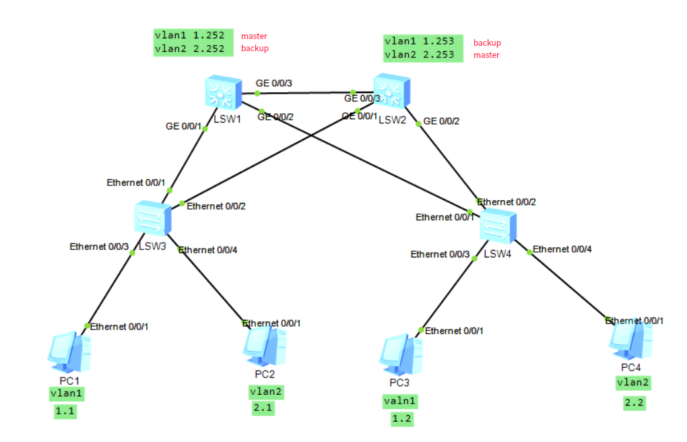

- ​              [学习目标](#学习目标)
- [课堂笔记（命令）](#课堂笔记命令)
- [课堂笔记（文本）](#课堂笔记文本)
- [快捷键](#快捷键)
- [问题](#问题)
- [补充](#补充)
- [今日总结](#今日总结)
- [昨日复习](#昨日复习)


# 学习目标

数制

ipv4地址扩展应用

了解ipv6地址

Linux虚拟网络

# 课堂笔记（命令）


# 课堂笔记（文本）

## 负载均衡

### 拓扑图



### 配置pc网关

pc1的ip是192.168.1.1 网关是192.168.1.254

pc2的ip是192.168.2.1 网关是192.168.2.254

pc3的ip是192.168.1.2 网关是192.168.1.254

pc4的ip是192.168.2.2 网关是192.168.2.254

所有交换机依次改名为sw1~sw4并且都要创建vlan2

然后将所有交换机之间的接口都配置成tunk中继链路（设置tunk是应为有多个vlan）

### 三层交换机配置

```
第1台s5700配置：
[Huawei]sysname  sw1
[sw1]vlan 2
[sw1-vlan2]quit
[sw1]port-group 1    //创建接口组，组号是1
[sw1-port-group 1]group-member gigabitethernet 0/0/1 to gigabitethernet 0/0/3  
//添加组成员，从g0/0/1到g0/0/3一共3个接口
[sw1-port-group 1]port link-type trunk   //将这些接口配置为中继链路
[sw1-port-group 1]port trunk allow-pass vlan all    //放行所有vlan 的数据
第2台s5700配置：
[Huawei]sysname  sw2
[sw2]vlan 2
[sw2-vlan2]quit
[sw2]port-group 1    //创建接口组，组号是1
[sw2-port-group 1]group-member gigabitethernet 0/0/1 to gigabitethernet 0/0/3  
//添加组成员，从g0/0/1到g0/0/3一共3个接口
[sw2-port-group 1]port link-type trunk   //将这些接口配置为中继链路
[sw2-port-group 1]port trunk allow-pass vlan all    //放行所有vlan 的数据
第1台s3700配置：
[Huawei]sysname  sw3
[sw3]vlan 2
[sw3-vlan2]quit
[sw3]port-group 1    //创建接口组，组号是1
[sw3-port-group 1]group-member ethernet 0/0/1 to ethernet 0/0/2  
//添加组成员，从e0/0/1到e0/0/2一共2个接口
[sw3-port-group 1]port link-type trunk   //将这些接口配置为中继链路
[sw3-port-group 1]port trunk allow-pass vlan all    //放行所有vlan 的数据
[sw3-port-group 1]quit
[sw3]interface ethernet 0/0/4
[sw3-Ethernet0/0/4]port link-type access
[sw3-Ethernet0/0/4]port default vlan 2     //将4口加入vlan2
第2台s3700配置：
[Huawei]sysname  sw4
[sw4]vlan 2
[sw4-vlan2]quit
[sw4]port-group 1    //创建接口组，组号是1
[sw4-port-group 1]group-member ethernet 0/0/1 to ethernet 0/0/2  
//添加组成员，从e0/0/1到e0/0/2一共2个接口
[sw4-port-group 1]port link-type trunk   //将这些接口配置为中继链路
[sw4-port-group 1]port trunk allow-pass vlan all    //放行所有vlan 的数据
[sw4-port-group 1]quit
[sw4]interface ethernet 0/0/4
[sw4-Ethernet0/0/4]port link-type access
[sw4-Ethernet0/0/4]port default vlan 2     //将4口加入vlan2
```

代码解释：设置接口组为了方便对接口设置作用到每一个接口上

### 三层交换机配置IP

```
[sw1]in vlan 1     //第一台三层交换机
[sw1-Vlanif1]ip address  192.168.1.252 24  //配置ip
[sw1-Vlanif1]in vlan 2
[sw1-Vlanif2]ip address 192.168.2.252 24     
[sw2]in vlan 1    //第二台三层交换机
[sw2-Vlanif1]ip address 192.168.1.253 24   //配置ip
[sw2-Vlanif1]in vlan 2
[sw2-Vlanif2]ip address 192.168.2.253 24
```

### 配置VRRP

实现vrrp负载均衡要做到

sw1 vlan1 主 vlan2 备

sw2 vlan1 备 vlan2 主

```
[sw1]in vlan 1     //第一台三层交换机
[sw1-Vlanif1]vrrp vrid 1 virtual-ip 192.168.1.254   //在sw1配置vrrp 
[sw1-Vlanif1]vrrp vrid 1 priority 105   //设置优先级称为vlan1的主
[sw1]in vlan 2 
[sw1-Vlanif2]vrrp vrid 2 virtual-ip 192.168.2.254   //开启vrrp功能
[sw2]in vlan 1    //第二台三层交换机
[sw2-Vlanif1]vrrp vrid 1 virtual-ip 192.168.1.254  //开启vlan1的vrrp
[sw2-Vlanif1]in vlan 2
[sw2-Vlanif2]vrrp vrid 2 virtual-ip 192.168.2.254
[sw2-Vlanif2]vrrp vrid 2 priority 105    //为vlan2的vrrp设置优先级
配置完毕后使用display vrrp brief 检查，每个5700的vrrp是一主一备即可
```

## 数制转换

### 网速

> 1byte =  8bit
>
> 1KB = 1024byte
>
> 100M网速实际带宽为12.5m/s
>
> 100M/8bit =  12.5

### 进制转换

二进制转十进制

10011 == 16+2+1 == 19

> 128 	64	 32	 16	 8 	4	 2 	1
>
>   			 1	   0	 0	 1	1

十进制转二进制

195 == 11000011

195 = 128+64+2+1

> 128 	64	 32	 16	 8 	4	 2 	1
>
>   1		 1		0		0	 0    0	 1	1			

匹配写1不匹配写0

### 子网划分

**公式：**

2的n次方=要划分的网段数量

n是借用子网掩码主机位的个数

**划分的原因：**

> 满足不同网络对IP地址的需求

**划分方法：**

> 根据需要划分的网段数来确定n的个数，则子网掩码就借n位，最多借6位，不然总共的IP不够分

**案例:**

将192.168.1.0 划分4个网段？

> 根据IP地址得知为一个C类网段，其子网掩码由三个主机位和一个网络位组成，写成二进制为：
>
> 11111111.11111111.11111111.00000000
>
> 十进制：255.255.255.0
>
> 划分4个网段得知2的2次方等于4，将要在主机位借用两个数
>
> 即：255.255.255.11000000（前面的二进制写成了十进制，主机位还是二进制）
>
> 11000000可以划分成四种不同格式，因为是二进制，不是0就是1
>
> 00000000  十进制  0
>
> 10000000 	128
>
> 01000000  	64
>
> 11000000	 192      
>
> 由此得知4个网段内容为
>
> 192.168.1.0～64    完整范围
>
> 192.168.1.1～63	可用范围
>
> 
>
> 192.168.1.65～127
>
> 192.168.1.66～126
>
> 
>
> 192.168.1.128～191
>
> 192.168.1.129～190
>
> 
>
> 192.168.1.192～255
>
> 192.168.1.193～254
>
> 在IP地址中，第一个IP与最后一个IP都不作为实际IP使用，第一个IP为**网络ID**即网段，最后一个为**广播地址**
>
> 子网掩码为26,主机位总共借2位，即24+2

# 快捷键


# 问题


# 补充


# 今日总结

## 计算机中常用数值有哪些

> 2 8 10 16

## 一个4GB大小的文件，利用200Mb带宽网络传递，大约需要多久完成

> 4GB=1024*4 = 4096Mb
>
> 200Mb/8 = 25
>
> 4096 / 25 = 163

## 子网划分的原因是

> 满足不同网络对IP地址的需求
>
> 节省IP

## IPV4与IPv6的地址长度分别是多少位

> 32
>
> 128

## IPv6地址在配置时通常使用几进制

> 16

# 昨日复习