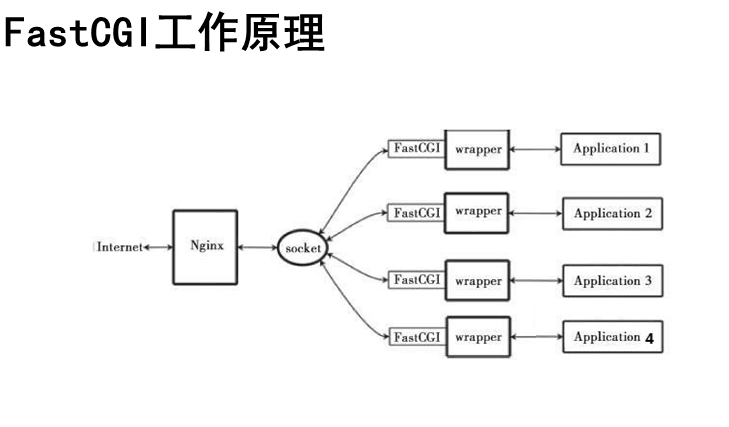
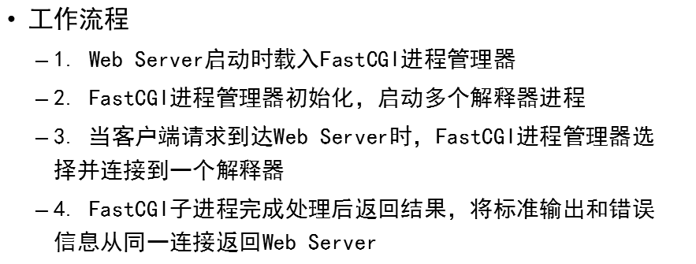

- [学习目标](#学习目标)
- [课堂笔记（命令）](#课堂笔记命令)
- [课堂笔记（文本）](#课堂笔记文本)
  - [文件生成摘要](#文件生成摘要)
  - [LNMP](#lnmp)
    - [安装Nginx](#安装nginx)
    - [安装数据库](#安装数据库)
    - [安装php及拓展](#安装php及拓展)
    - [服务启动](#服务启动)
    - [修改PHP-FPM配置](#修改php-fpm配置)
    - [修改Nginx配置](#修改nginx配置)
    - [测试页面](#测试页面)
    - [修改默认页面](#修改默认页面)
    - [日志记录](#日志记录)
    - [PHP-FPM后台进程修改](#php-fpm后台进程修改)
    - [快速公共网关接口](#快速公共网关接口)
    - [主机通信](#主机通信)
    - [Socket连接PHP-FPM](#socket连接php-fpm)
  - [地址重写](#地址重写)
    - [地址跳转](#地址跳转)
    - [正则限制页面乱跳](#正则限制页面乱跳)
    - [网站地址栏变化](#网站地址栏变化)
    - [不同网站间跳转](#不同网站间跳转)
    - [不同网站跳转至相同子页面](#不同网站跳转至相同子页面)
    - [不同浏览器访问相同内容](#不同浏览器访问相同内容)
  - [地址重写选项](#地址重写选项)
    - [last](#last)
    - [break](#break)
- [快捷键](#快捷键)
- [问题](#问题)
- [补充](#补充)
- [今日总结](#今日总结)
- [昨日复习](#昨日复习)


# 学习目标

部署LNMP

Nginx+FastCGI

Nginx高级技术

# 课堂笔记（命令）


# 课堂笔记（文本）

## 文件生成摘要

```
md5sum /etc/passwd
88b81467cc21a6a988f3385b2f52d42e  /etc/passwd

# 扩展生成摘要：sha256sum、sha512sum
```

作用：防止数据被篡改，保证数据一致性，

ps：数据发生一个空格或回车hash值都将发生变化

## LNMP

### 安装Nginx

```
# 编译
./configure --with-http_ssl_module  
# 安装二进制
make
# 安装主程序
make install
```

### 安装数据库

```
yum -y install mariadb mariadb-server mariadb-devel
```

### 安装php及拓展

```
yum -y install php php-mysqlnd（连接数据库依赖）
```

PS：

php-fpm：解析翻译动态页面

### 服务启动

```
# 数据库
systemctl restart mariadb
# php
systemctl restart php-fpm
```

### 修改PHP-FPM配置

```
vim /etc/php-fpm.d/www.conf # php-fpm主配置文件
listen 127.0.0.1:9000  # 添加一个网络通信端口

systemctl restart php-fpm # 重启服务
ss -ntulp | grep php-fpm # 查询端口信息
```

### 修改Nginx配置

支持php

```
vim /usr/local/nginx/conf/nginx.conf
# 第65行-71行解除注释，注释69行
# 将最后一行改为如下
include fastcgi.conf;
```

```
# 代码解释
 location  ~  \.php$  {        #~是使用正则表达式，匹配以.php结尾
        root           html;
        fastcgi_pass   127.0.0.1:9000;    #将请求转发给本机9000端口
        fastcgi_index  index.php;
       #fastcgi_param   SCRIPT_FILENAME  $document_root$fastcgi_script_name;
        include        fastcgi.conf;       #加载fastcgi配置文件
        }
```

### 测试页面

```
# php
<html>
<body>
This is HTML message
</br>
<?php 
$c = 12;
$d = 2;
if($c > $d){echo "c is bigger";}
else{ echo "d is bigger";}
?>
</body>
</html>
# mysql
<?php
$mysqli = new mysqli('localhost','root','','mysql');
if (mysqli_connect_errno()){
        die('Unable to connect!'). mysqli_connect_error();
}
$sql = "select * from user";
$result = $mysqli->query($sql);
while($row = $result->fetch_array()){
        printf("Host:%s",$row[0]);
        printf("</br>");
        printf("Name:%s",$row[1]);
        printf("</br>");
}
?>

curl 192.168.99.5/test.php
curl 192.168.99.5/mysql.php
```

### 修改默认页面

```
    server {
        listen       80;
        server_name  localhost;

        #charset koi8-r;

        #access_log  logs/host.access.log  main;

        location / {
            root   html;
            index  index.php index.html index.htm;
        }
```

### 日志记录

```
# nginx日志
conf/
access.log  error.log  nginx.pid
nginx.pid，进程PID，程序启动后文件才存在

# pgp-fpm日志
/var/log/php-fpm/
```

### PHP-FPM后台进程修改

```
vim /etc/php-fpm.d/www.conf
pm.max_children = 50  最大进程数
pm.start_servers = 10 最小进程数

# 修改后重启
```

### 快速公共网关接口

**FastCGI**





### 主机通信

> 网络  IP
>
> 进程间通信(Socket)

### Socket连接PHP-FPM

```
# 修改配置文件
vim /etc/php-fpm.d/www.conf
listen= /run/php-fpm/www.sock
listen.acl_users = apache,nginx,nobody  # 使nobody用户能够访问 sock接口
systemctl restart php-fpm
getfacl /run/php-fpm/www.sock # 查看a权限是否添加nobody

vim /usr/local/nginx/conf/nginx.conf
fastcgi_pass unix:/run/php-fpm/www.sock;

sbin/nginx -s reload
```

PS：针对安装nginx时没有指定用户nginx时操作，未指定用户默认使用nobody用户                                                                                                                                                                                                                                                                                                                                                                                                                                                                                                                                                                                                                                                                                                                                                                                                                                                                                                                                                                                                                                                                                                                                                                                                                                                                                                                                                                                                                                                                                                                                                                                                                                                                                                                                                                                                                

## 地址重写

> 需在配置参数中配置，rewrite
>
> rewrite  旧地址 新地址 [选项]

### 地址跳转

```
]#vim conf/nginx.conf
server {
        listen       80;
        server_name  localhost;
        rewrite  /a.html  /b.html;   # 当用户输入的网页包含a.html就跳转到b.html         
    location / {
        root   html;
        index  index.html index.htm;
    }
}

]#echo "This is B Html" > html/b.html
]#ls html/
50x.html  b.html  index.html  index.php  test.php
]#sbin/nginx -s reload
]#curl 192.168.99.5/a.html
This is B Html
```

### 正则限制页面乱跳

```
# 未修改时，页面访问
]#curl 192.168.99.5/cd/a.html
This is B Html
]#curl 192.168.99.5/a.htmlss
This is B Html

# 限制后
]#vim conf/nginx.conf
rewrite ^/a\.html$ /b.html;  # 只能是/a.html时，才能跳转到b.html
]#sbin/nginx -s reload
]#curl 192.168.99.5/b/a.html
404
]#curl 192.168.99.5/a.html
This is B Html
```

### 网站地址栏变化

```
# 访问页面时，不但跳转到指定页面且地址栏也发生变化
]#vim conf/nginx.conf
rewrite ^/a\.html$ /b.html redirect;
]#sbin/nginx -s reload
# 访问页面查询地址栏地址
```

### 不同网站间跳转

```
# 地址重定向
]#vim conf/nginx.conf
server {
        listen       80;
        server_name  localhost;
    rewrite /  http://www.tmooc.cn/; # 访问192.168.99.5,将重定向到tmooc.com首页
    location / {
        root   html;
        index  index.html index.htm;
    }
}
]#sbin/nginx -s reload
# 访问192.168.99.5 跳转至 tmooc.cn
```

### 不同网站跳转至相同子页面

```
]#vim conf/nginx.conf
server {
        listen       80;
        server_name  localhost;
    rewrite  /(.*)  http://www.tmooc.cn/$1; # $1复制第一个参数，(.*)任意
    location / {
        root   html;
        index  index.html index.htm;
    }
}
]#sbin/nginx -s reload
# 访问192.168.99.5/as.html 跳转至 tmooc.cn/as.html
```

### 不同浏览器访问相同内容

```
]#mkdir html/firefox
]#touch firefox > html/firefox/abc.html
]#touch other > html/abc.html
]#vim conf/nginx.conf
server {
        listen       80;
        server_name  localhost;
    location / {
        root   html;
        index  index.html index.htm;
    }
if ($http_user_agent ~* firefox) {        #如果用户使用了火狐浏览器
rewrite /(.*)  /firefox/$1;        #就进行地址重写，让用户看到火狐专用页面
}$http_user_agent是nginx的内置变量，存储了用户的信息，比如用的什么浏览器,~是匹配正则  *是忽略大小写
}
]#sbin/nignx -s reload
]#curl 192.168.99.5/abc.html
使用不同浏览器进行访问时，将的到不同结果
```

## 地址重写选项

redirect 临时重定向，状态吗302

permanent 永久重定向，状态码301

```
]#vim conf/nginx.conf
server {
        listen       80;
        server_name  localhost;
        rewrite  /a.html  /b.html permanent;   # 当用户输入的网页包含a.html就跳转到b.html         
    location / {
        root   html;
        index  index.html index.htm;
    }
}
]#sbin/nginx -s reload
]#curl 192.168.99.5/a.html
<html>
<head><title>301 Moved Permanently</title></head>
<body>
<center><h1>301 Moved Permanently</h1></center>
<hr><center>nginx/1.22.1</center>
</body>
</html>
```

### last

```
# last 不再读其他语句，但还会继续匹配其他location语句
]#vim conf/nginx.conf
server {
        listen       80;
        server_name  localhost;
        rewrite  /a.html  /b.html last;   # 当用户输入的网页包含a.html就跳转b.html         rewrite /b.html /c.html;
    location / {
        root   html;
        index  index.html index.htm;
    }
}
]#echo nginx-c > html/c.index

# 未添加last选项
]#curl 192.168.99.5/a.html
nginx-c

# 添加last选项后
]#curl 192.168.99.5/a.html
this is B html
]#curl 192.168.99.5/b.html
nginx-c

# 针对多个location时
    server {
        listen       80;
        server_name  localhost;
#       if ($http_user_agent ~* firefox) {
#               rewrite /(.*) /firefox/$1;
#       }
        #charset koi8-r;

        #access_log  logs/host.access.log  main;

        location / {
        rewrite /a.html /b.html last;
            root   html;
            index  index.html index.htm;
        }
        location /b.html{
        rewrite /b.html /c.html;
        }
        }
]#curl 192.168.99.5/a.html #访问a时，又跳转到c.html页面
nginx-c
```

PS：location 指定处理的请求规则

### break

```
# break 不再读其他语句，结束请求
# 针对多个location时
    server {
        listen       80;
        server_name  localhost;
#       if ($http_user_agent ~* firefox) {
#               rewrite /(.*) /firefox/$1;
#       }
        #charset koi8-r;

        #access_log  logs/host.access.log  main;

        location / {
        rewrite /a.html /b.html break;
            root   html;
            index  index.html index.htm;
        }
        location /b.html{
        rewrite /b.html /c.html;
        }
        }
]#cul 192.168.99.5/a.html
this is B html
]#curl 192.168.99.5/b.html
nginx-c
```

# 快捷键


# 问题


# 补充


# 今日总结


# 昨日复习