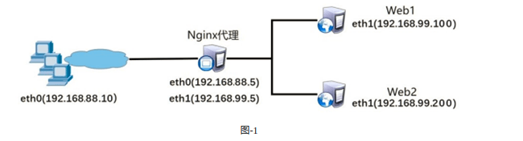

- [学习目标](#学习目标)
- [课堂笔记（命令）](#课堂笔记命令)
- [课堂笔记（文本）](#课堂笔记文本)
- [快捷键](#快捷键)
- [问题](#问题)
- [补充](#补充)
- [今日总结](#今日总结)
- [昨日复习](#昨日复习)

# 学习目标

Nginx方向代理

Nginx调度器

Nginx优化

# 课堂笔记（命令）


# 课堂笔记（文本）

## Nginx方向代理

> 搭建虚拟机：
>
> proxy 99.5
>
> web1 99.100
>
> web2 99.200

### 原理图



### 配置web服务

```
]# echo httpd-web1 > /var/www/html/index.html  # 100机器
]# systemctl restart httpd

]#echo httpd-web2 > /var/www/html/index.html # 200机器
systemctl restart httpd
```

### 修改配置文件

1. 创建集群 upstream
2. 调用集群 proxy_pas http://集群名

```
]#vim conf/nginx.conf
.. ..
http {
.. ..
#使用upstream定义后端服务器集群，集群名称任意(如webserver)
#使用server定义集群中的具体服务器和端口
upstream webserver {
                server 192.168.99.100:80;
                server 192.168.99.200:80;
        }
.. ..
server {
        listen        80;
        server_name  localhost;
            location / {
#通过proxy_pass将用户的请求转发给webserver集群
            proxy_pass http://webserver;
        }
}
.. ..
}
]#sbin/nginx # 启动服务
```

### 测试访问

```
curl 192.168.99.5
httpd-web1
curl 192.168.99.5
httpd-web2
```

## Nginx集群优化

### 轮询

> nginx系统默认模式
>
> 一个机器轮一次

### 权重

```
]#vim conf/nginx.conf
# 配置文件中添加 weight参数，值必须为正整数
upstream webserver{
        server 192.168.99.100:80 weight=2; # 将100机器设置2权重
        server 192.168.99.200:80;
}
```

### 健康检查

> 检查机器是否正常的过程

```
]#vim conf/nginx.conf
upstream webserver{
        server 192.168.99.100:80 weight;
        server 192.168.99.200:80 max_fails=2 fail_timeout=30; # 最大失败重连次数，失败超时时间，当机器挂掉后每隔30s进行检测是否存活，总共询问两次。
}
```

测试：测试访问，关掉一台服务器，再进行测试访问，开启后，再测试访问，查看30s内是否还能访问关掉机器的服务

### IP_HASH策略

```
]#vim conf/nginx.conf
upstream webserver{
        ip_hash;
        server 192.168.99.100:80;
        server 192.168.99.200:80 max_fails=2 fail_timeout=30;
   }
]#sbin/nginx -s reload
```

作用：ip_hash就是会对每个请求访问的ip进行hash运算，再根据结果进行分配，这样每个访客固定访问一个后端服务器。

### down标记

```
upstream webserver{
        server 192.168.99.100:80 down;
        server 192.168.99.200:80;
}
```

作用："down" 标记通常用于指示某个后端服务器处于停机状态或不可用。这可以用于负载均衡场景下，当某个后端服务器发生故障或需要进行维护时，将其标记为 "down"，以便 Nginx 不再将请求转发给该服务器。

## Nginx四层代理

### 编译&安装

> `--with-stream ` 支持四层代理的模块

```
# 进入nginx解压路径
]#./configure --with-stream
# 安装
]#make && mkae install
# 检查安装模块信息
]#sbin/nginx -V
```

### 案例：四层代理配置集群SSH

### 编写配置文件

```
]#vim conf/nginx.conf
stream {   # 创建服务集群
            upstream backend {
               server 192.168.99.100:22;            #后端SSH服务器的IP和端口
               server 192.168.99.200:22;
}
            server {
                listen 12345;                    #Nginx监听的端口
                 proxy_pass backend;  # 调用集群
             }
}
http {
.. ..
}
]#sbin/nginx # 启动服务
]#ss -ntulp|grep :12345 # 查询端口监听情况
```

###  测试配置

```
]#ssh 192
```

## 定义状态码页面

### 修改配置文件

```
]#vim conf/nginx.conf
charset utf-8; # 设置编码集，防止中文乱码
error_page  404              /404.html;  # 开启错误页面处理
```

### 测试访问

```
]#sbin/nginx -s reload
]#echo error page > html/404.html # 定义错误页面
]#curl 192.168.99.5/45465456
error page
```

## 安装模块

### 直接(卸载)

> 直接删除nginx目录，重新进行编译，指定安装的模块，再进行安装
>
> ---------不推荐

### 间接(升级)

> 进入nginx解压文件夹中，进行重新编译(已经安装的模块，需要再次写上)，make，不用再执行make install
>
> 文件夹objs目录下已经生成新的nginx，将objs/nginx  覆盖/usr/local/nginx/sbin，这样就完成了升级

```
]#sbin/nginx -V  # 查询nginx信息  
nginx version: nginx/1.22.1
built by gcc 8.5.0 20210514 (Red Hat 8.5.0-10) (GCC) 
configure arguments: --with-stream  # 已安装的模块

]#sbin/nginx -s stop
]#cd /nginx1-22.0
]#./configure --with-stream --with-http_stub_status_module  
]#\cp objs/nginx /usr/local/nginx/sbin
]#cd /usr/local/nginx
]#sbin/nginx -s reload 
```

## 查看网站状态信息

### 安装状态模块

```
# 使用升级方式进行安装
]#./configure --with-stream --with-http_stub_status_module  
]#\cp objs/nginx /usr/local/nginx/sbin
]#cd /usr/local/nginx
# 修改信息
]#sbin/nginx -s reload # 重新加载
```

### 修改配置信息

```
vim conf/nginx.conf
http{
...
	
        location /status{
        stub_status on;
}
...
}
```

### 测试访问

```
sbin/nginx -s reload
# 页面访问
192.168.99.5/status
```


### 状态信息解析

> Active connections：当前活动的连接数量。
>
> Accepts：已经接受客户端的连接总数量。
>
> Handled：已经处理客户端的连接总数量。
>
> Requests：客户端发送的请求数量。
>
> Reading：当前服务器正在读取客户端请求头的数量。
>
> Writing：当前服务器正在写响应信息的数量。
>
> Waiting：当前多少客户端在等待服务器的响应。

### 设置访问权限

```
location /status {
                stub_status on;
                 allow 192.168.99.5; # 允许访问的IP
                 deny all; # 拒绝所有
        }
# 测试，非5机器进行http访问
```

## 压力测试

### 装包

```
yum -y install httpd-toos
```

### 基本使用

```
ab -n1000 -c1000 http://192.168.99.5/  # -n 请求次数  -c 并法数
...
...
100%                    #成功
ab -n2000 -c2000 http://192.168.99.5/ # 测试不成功：1，nginx默认的最大连接数是1024；2，系统默认打开文件数为1024

Benchmarking 192.168.99.5 (be patient)
socket: Too many open files (24)                #失败
```

代码解释：使用ab命令时，并法的数量取决于系统打开的最大文件数量，因为每一个并发，系统都会打开一个文件去处理

### Nginx调整

```
vim conf/nginx.conf
worker_processes 2;  # 开启的进程数，与CPU数量核心一致：一个进程处理50000，总共是100000
events {
    worker_connections  50000; 每个worker最大并法连接数
}
```

### Liunx系统调整

```
ulimit -n # 查询系统最多打开文件的数量，默认1024
ulimit -n 10000 # 临时修改打开数量：设置用户可以同时打开的最大文件描述符数。


vim /etc/security/limits.conf #永久修改，需重启
*               soft    nofile            100000
*               hard    nofile            100000
#用户或组    硬限制或软限制    需要限制的项目   限制的值
```

### 测试

```
# 使用客户端测试  web1机器
ab -n2000 -c2000 http://192.168.99.5/
...
...
100%                    #成功
```


# 快捷键


# 问题


# 补充


# 今日总结


# 昨日复习