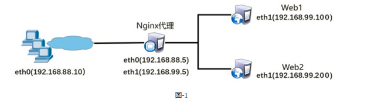

- [学习目标](#学习目标)
- [课堂笔记（命令）](#课堂笔记命令)
- [课堂笔记（文本）](#课堂笔记文本)
  - [Nginx支持长地址](#nginx支持长地址)
    - [前提](#前提)
    - [原因](#原因)
    - [修改配置](#修改配置)
    - [测试访问](#测试访问)
  - [本地缓存](#本地缓存)
    - [编写配置文件](#编写配置文件)
    - [测试](#测试)
  - [Session共享](#session共享)
    - [准备环境](#准备环境)
    - [修改基础配置](#修改基础配置)
    - [配置集群](#配置集群)
    - [Session与Cookies概念](#session与cookies概念)
    - [WhyUseRedis？](#whyuseredis)
  - [Redis](#redis)
    - [装包](#装包)
    - [启用](#启用)
    - [修改配置](#修改配置-1)
    - [增删改查](#增删改查)
  - [PHP实现Session共享](#php实现session共享)
    - [装包](#装包-1)
    - [配置](#配置)
    - [测试](#测试-1)
  - [Nginx实现跨域](#nginx实现跨域)
    - [创建虚拟主机](#创建虚拟主机)
    - [同源策略](#同源策略)
    - [未设置-测试](#未设置-测试)
    - [修改配置](#修改配置-2)
    - [测试](#测试-2)
- [快捷键](#快捷键)
- [问题](#问题)
- [补充](#补充)
- [今日总结](#今日总结)
- [昨日复习](#昨日复习)


# 学习目标

Session与Cookie

部署Redis

Session共享

Nignx实现跨域

# 课堂笔记（命令）


# 课堂笔记（文本）

## Nginx支持长地址

### 前提

```
# 由于请求地址过长导致报414错误
]#curl 192.168.99.5/index.html?a=1b=2..............................a=1
<html>
<head><title>414 Request-URI Too Large</title></head>
<body>
<center><h1>414 Request-URI Too Large</h1></center>
<hr><center>nginx/1.22.1</center>
</body>
</html>
```

### 原因

> 由于Nginx默认存储客户端的请求头大小为1K

### 修改配置

```
vim conf/nginx.conf
client_header_buffer_size 200k; # 将默认大小改为200K
large_client_header_buffers 4 200k; # 如果默认还不够，那将再增加4个200K
```

### 测试访问

```
# 编写脚本测试
#!/bin/bash
URL=http://192.168.99.5/index.html?
for i in {1..5000}
do
	URL=${URL}v$i=$i
done
curl $URL
]#bash test.sh
<!DOCTYPE html>
<html>
<head>
<title>Welcome to nginx!</title>
<style>
```

## 本地缓存

### 编写配置文件

```
vim conf/nginx.conf
server {
        listen       80;
        server_name  localhost;
        location / {
            root   html;
            index  index.html index.htm;
        }
location ~* \.(jpg|jpeg|gif|png|css|js|ico|xml)$ { # 匹配多个格式| ～*表示匹配后面内容忽略大小写
expires        30d;            #定义客户端缓存时间为30天
}
}
```

### 测试

> 使用火狐浏览器搜索：abou:cache   查看浏览器缓存

```
# 访问网页图片 
http://192.168.99.5/123.png
```


## Session共享



### 准备环境

> web1 web2 proxy
>
> 每台机器装包：nginx、php、php-fpm、php-devel、gcc、make、mariadb、mariadb-server、mariadb-devel、pcre-devel、openssl-devel、tar、vim、net-tools

### 修改基础配置

> 使用进程通信

**PHP**

```
vim /etc/php-fpm.d/www.conf  
listen.acl_users = apache,nginx,nobody  # 添加一个用户

systemctl start php-fpm # 启动服务
```

**Nginx**

```
vim /usr/local/nginx/conf/nginx.conf
location ~ \.php$ {
            root           html;
            fastcgi_pass   unix:/run/php-fpm/www.sock;
            fastcgi_index  index.php;
           # fastcgi_param  SCRIPT_FILENAME  /scripts$fastcgi_script_name;
            include        fastcgi.conf;
}

cd /usr/local/nginx/
sbin/nginx # 启动服务
```

**测试页面**

```
vim html/test.php # 测试环境
<html>
<body>
This is HTML message
</br>
<?php
$c = 12;
$d = 2;
if($c > $d){echo "c is bigger";}
else{ echo "d is bigger";}
?>
</body>
</html>

curl 192.168.99.100/test.php

# 编写登陆和主页php页面
```

### 配置集群

```
vim /usr/local/nginx/conf/nginx.conf # 5机器
upstream web{
	server 192.168.99.100:80;
	server 192.168.99.200:80;
}
server{
	....
	location / {
		...
		proxy_pass http://web;
	}
}

sbin/nginx -s reload # 重新加载配置文件
```

### Session与Cookies概念

> Session：存储在服务器端，保存用户名、登陆状态等信息。
>
> Cookies：由服务器下发给客户端，保存在客户端的一个文件里。
>
> 
>
> Cookies 存储在客户端，用于跟踪用户并存储一些信息；
>
> Session 存储在服务器端，用于存储和追踪用户会话信息。

### WhyUseRedis？

```
index.php  登陆页面
home.php   登陆成功后的页面-s		

# 浏览器访问index.php页面进行登陆，登陆成功后跳转到home.php页面

# 服务器查看生成的session
ls /var/lib/php/session/
sess_3j9f7j42mv42alr2kjjjj32lg9
# 浏览器查看cookie，F12刷新页面进行查看

# 直接输入http://192.168.99.100/home.php时不会使用户再次登陆，因为此时服务器已将seeion保存并将cookie发送给了客户端

#删除服务器上的seesion
rm -f /var/lib/php/session 

# 再次输入http://192.168.99.100/home.php,此时浏览器将跳转到index.php页面，因为服务器上的session已经被删除，服务不认识当前主机，需要再次登陆，使服务器记录，才能访问home.php；同理在浏览器上删除cokkie(删除历史记录cookie)再次访问home.php时也将提示需要重新登陆
```

```
部署集群后通过proxy机器访问页面，将需要用户多次输入密码，因为nginx默认通过轮询的方式将请求分发到上游服务器，当用户访问web1的登陆页面时输入登陆信息，此时web1将保存用户的信息，此时将要返回home.php页面信息返回给客户端，由于轮询机制web2将home.php页面返回给客户端此时web2并没有存储用户的信息，将跳转到登陆页面使用户登陆
```

> 为了避免使用户同时登陆几次，需要做一个session共享，保证上游机器之间信息"畅通"
>
> 由于session是一个文件，可通过ftp、nfs、rsync、web等方式进行传输到其他上游服务器，但从磁盘传输文件太慢，所以使用内存将等的质的提升以下将**使用Redis进行session共享**

## Redis

### 装包

```
yum -y install redis
```

### 启用

```
systemctl start redis
ss -ntulp|grep redis # 查询redis端口
tcp   LISTEN 0      128        127.0.0.1:6379      0.0.0.0:*    users:(("redis-server",pid=2218,fd=6)) 
```

### 修改配置

```
# 通过查询端口发现，redis只能本机访问，需修改任何地址都能进行访问
vim /etc/redis.conf
# bind 127.0.0.1  #将第69行注释：关闭只能本机访问
..........
protected-mode no # 将88行yes改为no：关闭redis安全认证，开启后才能进行写入

ss -ntulp|grep redis 
tcp   LISTEN 0      128          0.0.0.0:6379      0.0.0.0:*    users:(("redis-server",pid=2310,fd=7))                 
tcp   LISTEN 0      128             [::]:6379         [::]:*    users:(("redis-server",pid=2310,fd=6))
```

### 增删改查

```
redis-cli  # 进入redis
127.0.0.1:6379> set abc 456 # 增
OK
127.0.0.1:6379> get abc  # 查
"456"
127.0.0.1:6379> set abc 789 # 改
OK
127.0.0.1:6379> get abc
"789"
127.0.0.1:6379> del abc # 删
(integer) 1
127.0.0.1:6379> get abc
(nil)
127.0.0.1:6379> keys * #查询数据库所有key
(empty list or set)
127.0.0.1:6379> flushall # 删除所有数据
OK
```

## PHP实现Session共享

### 装包

```
yum -y install phpredis-5.1.0-1.x86_64.rpm
```

### 配置

```
vim /etc/php-fpm.d/www.conf
php_value[session.save_handler] = redis  # 指定保存到redis:指定session保存的程序
php_value[session.save_path]    = "tcp://192.168.99.5:6379" # 指定保存使用tcp的redis：指定保存的路径
```

### 测试

> 前提删除机器上的session

```
# 通过网页访问http://192.168.99.5/index.php #进行登陆后将直接进入home页面

# 查询redis信息
redis-cli
127.0.0.1:6379>keys *
1) "PHPREDIS_SESSION:3isdrj2dt48v5t6afmmkpsuhud"
```

## Nginx实现跨域

### 创建虚拟主机

```
vim conf/nginx.conf
server {
	listen 8080;
	charset utf-8; # 设置编码集
location / {
	root html;
	index index.html;
}
```

### 同源策略

> 会拦截非本网站端口、域名、协议的数据，防止了恶意数据的传递
>
> 如果两个页面具有相同的协议、主机名和端口，则它们被认为是同源的，否则就是跨域的

### 未设置-测试

```
vim  html/80.html # 编写测试页面
<!DOCTYPE html>
<html>
<head>
    <meta charset="UTF-8">
    <title>API-test</title>
    <script>
        var xhr = new XMLHttpRequest();
        xhr.open('GET', 'http://192.168.99.5:8080/api.html',true);
        xhr.send();
        function change(){
            if(xhr.readyState==4 && xhr.status==200){
                alert(xhr.responseText);
            }
        }
    </script>
</head>
<body>
<input  id="button" type="button" value="测试" onclick="change();">
</body>

echo 123 html/api.html # 编写测试页面
```

```
# 浏览器访问http://192.168.99.5:80/80.html，点击测试按钮，将没有任何反映，点击F12刷新可以查看报了一个跨域错误信息

# 浏览器访问http://192.168.99.5:8080/80.html，点击测试按钮，弹出窗口123信息

解释：根据网页的同源策略会拦截非本网站端口、域名、协议的数据，使用80端口访问时，由于80.html点击按钮后有个返回数据来之8080/api.html，导致80端口访问时被拦截，而.5:8080访问时则直接返回api.html数据，因为返回的数据来自于8080/api.html；
```

### 修改配置

```
vim conf/nginx.conf

server {
	listen 8080;
	charset utf-8; # 设置编码集
location / {
	root html;
	add_header 'Access-Control-Allow-Origin' 'http://192.168.99.5'；
	index index.html;
}
sbin/nginx -s reload
```

### 测试

```
# 再次访问页面测试
http://192.168.99.5/80.html
http://192.168.99.5:8080/80.html
```


# 快捷键


# 问题


# 补充


# 今日总结


# 昨日复习