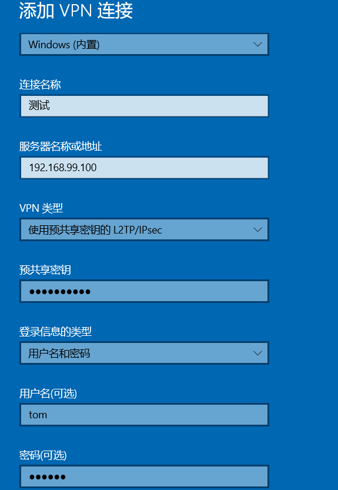

- [学习目标](#学习目标)
- [课堂笔记（命令）](#课堂笔记命令)
- [课堂笔记（文本）](#课堂笔记文本)
  - [配置nginx+tomcat集群](#配置nginxtomcat集群)
    - [tomcat配置](#tomcat配置)
    - [nginx配置](#nginx配置)
    - [访问测试](#访问测试)
  - [制作RPM包](#制作rpm包)
    - [装包](#装包)
    - [生成配置目录](#生成配置目录)
    - [拷贝源码包](#拷贝源码包)
    - [编写spec文件](#编写spec文件)
    - [制作rpm包](#制作rpm包-1)
    - [安装](#安装)
    - [查看目录](#查看目录)
  - [VPN-Linux](#vpn-linux)
    - [介绍](#介绍)
    - [前提](#前提)
    - [开启Linux内核](#开启linux内核)
    - [创建隧道](#创建隧道)
    - [删除隧道](#删除隧道)
    - [查看添加信息](#查看添加信息)
    - [配置隧道IP](#配置隧道ip)
    - [删除隧道IP](#删除隧道ip)
    - [启用](#启用)
    - [隧道对方配置](#隧道对方配置)
    - [测试VPN](#测试vpn)
  - [VPN-Wind](#vpn-wind)
    - [前提](#前提-1)
    - [Linux-装包](#linux-装包)
    - [libreswan文件配置](#libreswan文件配置)
    - [xl2tpd文件配置](#xl2tpd文件配置)
    - [options文件配置](#options文件配置)
    - [chap-secrets文件配置](#chap-secrets文件配置)
    - [验证是否成功](#验证是否成功)
    - [windos连接](#windos连接)
  - [systemd Unit](#systemd-unit)
    - [程序配置文件](#程序配置文件)
    - [编写测试脚本](#编写测试脚本)
    - [制作可执行服务](#制作可执行服务)
    - [测试](#测试)
    - [将nginx制作执行程序](#将nginx制作执行程序)
    - [测试](#测试-1)
- [快捷键](#快捷键)
- [问题](#问题)
- [补充](#补充)
  - [长地址更改文件名](#长地址更改文件名)
- [今日总结](#今日总结)
- [昨日复习](#昨日复习)

# 学习目标

RPM 打包

VPN服务

systemd服务管理

# 课堂笔记（命令）


# 课堂笔记（文本）

## 配置nginx+tomcat集群

### tomcat配置

```
# 两台tomcat配置网站
web1 100
cd /usr/local/tomcat
echo test-A > webapps/ROOT/index.html
bin/startup.sh
ss -ntulp|grep java

web2 200
echo test-B > webapps/ROOT/index.html
同上
```

### nginx配置

```
cd /usr/local/nginx
vim conf/nginx.conf
upstream toms{
	server 192.168.99.100:8080 weight=2; # 设置权重
	server 192.168.99.200:8080;
}
server{
...
location /{
.....
proxy_pass http://toms;
}
}
sbin/nginx # 启动
```

### 访问测试

```
curl 192.168.99.5
```

## 制作RPM包

### 装包

```
yum -y install rpm-build
```

### 生成配置目录

```
rpmbuild -ba nginx.spec  # ngixn 这里测试制作的nginx rpm包
ls rpmbuild
BUILD  BUILDROOT  RPMS  SOURCES  SPECS  SRPMS
```

### 拷贝源码包

```
cp ~/lnmp_soft/nginx-1.22.1.tar.gz ~/rpmbuild/SOURCES/ # 拷贝到源目录
```

### 编写spec文件

```
vim rpmbuild/SPEC/nginx.spec

Name:nginx  # 制作的rpm包名
Version:1.22.1  # nginx版本
Release:1 # 制作的第几个版本的rpm包
Summary: nginx is a web server # 简单描述信息

Group:  # 包组：一群包,没有就注释
License: GPL#授权协议 GPL：自由软件
URL:www.abc.com # 指定了 RPM 包的项目主页 URL。
Source0:nginx-1.22.1.tar.gz # 源材料叫什么名字

BuildRequires: # 制作rpm时的依赖关系，没有就注释
Requires:pcre-devel openssl-devel#rpm包做好后，那台机器装这个rpm包时需要的那些依赖软件包，类似装包时自动解决依赖关系

%description # 详细描述
test ~~

%post
useradd nginx                               #非必需操作：安装后脚本(创建账户)

%prep  
%setup -q  # 类似操作：解开nginx.tar.gz包，进入nginx文件夹


%build
./configure # 类似操作：./configure,根据需求修改，还能添加模块 ，添加用户信息
make %{?_smp_mflags}


%install # 安装过程
%make_install


%files
%doc # 指定需要打包的文档文件
/usr/local/nginx/* 


%changelog

```

### 制作rpm包

```
rpmbuild -ba rpmbuild/SPECS/nginx.spac

ls rpmbuild/RPMS/x86_64 
nginx-1.22.1-1.x86_64.rpm            nginx-debugsource-1.22.1-1.x86_64.rpm
nginx-debuginfo-1.22.1-1.x86_64.rpm
```

### 安装

```
yum -y install rpmbuild/RPMS/x86_64/nginx-1.22.1-1.x86_64.rpm 
```

### 查看目录

```
ls /usr/local/nginx
conf  html  logs  sbin
```

## VPN-Linux

### 介绍

> VPN：虚拟专用网络
>
> 在公用网络上建立专用私有网络，进行加密通讯
>
> 目前主流的VPN技术（GRE、PPTP、L2TP+IPSec、SSL）

### 前提

> 两台不同IP地址通过私有IP进行通信
>
> 创建隧道配置的IP为两台主机的公网IP(电脑联网就有)
>
> 配置vpn两台电脑都需要配置

### 开启Linux内核

```
modprobe ip_gre
lsmod | grep gre #查询开启情况
```

### 创建隧道

```
ip tunnel add tun0 mode gre remote 192.168.99.200 local 192.168.99.100
#ip tunnel add创建隧道（隧道名称为tun0），ip tunnel help可以查看帮助
#mode设置隧道使用gre模式
#remote后面是与其他主机建立隧道的对方IP地址,local后面跟本机的IP地址
```

### 删除隧道

```
ip tunnel del tun0
```

### 查看添加信息

```
ip add show tun0
```

### 配置隧道IP

```
ip addr add 10.10.10.100/8 peer 10.10.10.200/8 dev tun0
#为隧道tun0设置本地IP地址10.10.10.100/8
#隧道对面的主机IP为10.10.10.200/8
```

### 删除隧道IP

```
ip addr del 10.10.10.100/8 peer 10.10.10.200/8 dev tun0
```

### 启用

```
ip link set tun0
```

### 隧道对方配置

> 配置方式一样，只是IP地址调换

```
web2
ip tunnel add tun0 mode gre remote 192.168.99.100 local 192.168.99.200 #添加隧道
ip addr add 10.10.10.200/8 peer 10.10.10.100/8 dev tun0 # 设置IP
ip link set tun0 # 激活
```

### 测试VPN

```
ping 10.10.10.100
```

## VPN-Wind

### 前提

```
使用  L2TP+IPSec 协议进行wind-VPN
```

### Linux-装包

```
yum -y install libreswan
yum -y install xl2tpd-1.3.8-2.el7.x86_64.rpm
```

### libreswan文件配置

```
touch myipsec.conf
vim myipsec.conf
conn IDC-PSK-NAT
    rightsubnet=vhost:%priv
    also=IDC-PSK-noNAT

conn IDC-PSK-noNAT
    authby=secret
        ike=3des-sha1;modp1024
        phase2alg=aes256-sha1;modp2048
    pfs=no
    auto=add
    keyingtries=3
    rekey=no
    ikelifetime=8h
    keylife=3h
    type=transport
    left=192.168.99.100  # 本机使用vpn时，需要使用的IP，即公网地址
    leftprotoport=17/1701
    right=%any
    rightprotoport=17/%any
```

```
cp myipsec.conf /etc/ipsec.d/
vim /etc/ipsec.secrets
include /etc/ipsec.d/*.secrets
192.168.99.100 %any: PSK "randpass" # 任何人连接我这台机器VPN时，必须输入密码才能连接,any即所有机器，PSK即共享密钥，设置的密码
```

### xl2tpd文件配置

```
vim /etc/xl2tpd/xl2tpd.conf
ip range = 10.10.10.10-10.10.10.18 # 分配私有地址范围
local ip = 192.168.99.100 # 本机IP地址即公网IP地址
```

### options文件配置

```
vim /etc/ppp/options.xl2tpd  # 不做修改，将下面内容注释
#crtsscts
#lock
require-mschap-v2  # 开启注释，注意前面有个空格去掉：支持wind连接vpn
```

### chap-secrets文件配置

```
vim /etc/ppp/chap-secrets
tom * 123456 *  # 用户名  vpn名字 密码 客户使用那个地址访问
```

### 验证是否成功

```
systemctl start ipsec # 开启加密服务
ss -ntulp|grep :500

/usr/sbin/xl2tpd # 开启vpn服务
ss -ntulp|grep xl2tpd
```

### windos连接

> 单击"开始"，单击"运行"，键入"regedit"，然后单击"确定"
> 找到下面的注册表子项，然后单击它：
> HKEY_LOCAL_MACHINE\ System\CurrentControlSet\Services\Rasman\Parameters
> 在"编辑"菜单上，单击"新建"->"DWORD值"
> 在"名称"框中，键入"ProhibitIpSec"
> 在"数值数据"框中，键入"1"，然后单击"确定"
> 退出注册表编辑器，然后重新启动计算机



## systemd Unit

### 程序配置文件

```
cat /usr/lib/systemd/system/：
```

### 编写测试脚本

```
vim test.sh
while :
do
echo "ok"
echo "123"
sleep 2
done
```

### 制作可执行服务

```
cp /usr/lib/systemd/system/{crond.service,test.service} # 在文件夹中复制文件并改名

vim /usr/lib/systemd/system/test.service
[Unit]
Description=test  # 服务名
After=time-sync.target # 指定服务在 time-sync.target 之后启动，由于脚本中有个sleep

[Service]
ExecStart=bash /root/test.sh # 指定服务启动时执行的命令，这里将执行 "/root/test.sh" 脚本。
ExecReload=/bin/kill -HUP $MAINPID # 指定当服务需要重新加载时执行的命令，这里使用 kill 命令发送 HUP 信号给主进程。
KillMode=process # 指定服务停止时的杀死模式，这里设置为 "process"，即通过发送信号来终止进程。

[Install]
WantedBy=multi-user.target #支持开机自启动
```

### 测试

```
systemctl start test 
systemctl status test # 查看状态

systemctl  daemon-reload # 启动报错时敲
```

### 将nginx制作执行程序

```
cp /usr/lib/systemd/system/{httpd.service,nginx.service}
vim /usr/lib/systemd/system/nginx.service
[Unit]
Description=The Apache HTTP Server
After=network.target remote-fs.target nss-lookup.target 

[Service]
Type=forking  #多进程


ExecStart=/usr/local/nginx/sbin/nginx  #启动
ExecReload=/usr/local/nginx/sbin/nginx -s reload # 重新加载
ExecStop=/bin/kill -s QUIT $MAINPID # -s重新指定kill信号为QUIT，通过获取当前程序的PID来进行退出；优雅杀死进程

[Install]
WantedBy=multi-user.target
```

> 以前杀死nginx使用，-s stop或killall nginx，这样就能直接将nginx干掉，这里使用killall默认给定的信号是强制，而这里使用/bin/kill -s QUIT $MAINPID 则是优雅的将nginx干掉，这里使用kill -s将重新给kill指定了信号。
>
> 举例：小王访问一个网站时，由于页面需要加载，加载到一半是，服务提供方使用了killall nginx将程序干掉，此时小王看到的页面瞬间报错；而使用kill -s 进程PID  方式进行杀死nginx时，检测到服务有被在使用，将缓慢的杀死，直到小王访问的页面内容加载完毕后才杀死

### 测试

```
systemctl start nginx
systemctl status nginx
systemctl stop nginx
```


# 快捷键


# 问题


# 补充

## 长地址更改文件名

```

```


# 今日总结


# 昨日复习

