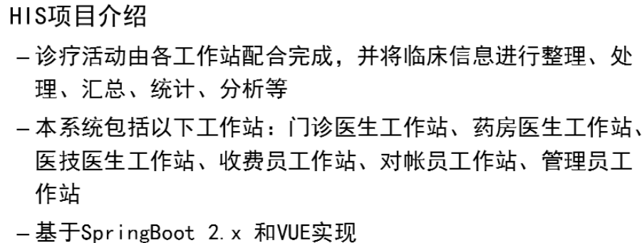
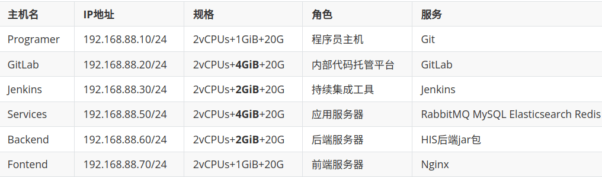
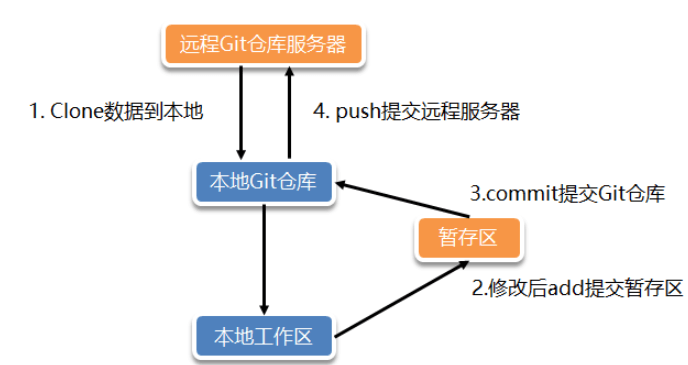

- [学习目标](#学习目标)
- [课堂笔记（文本）](#课堂笔记文本)
  - [HIS项目介绍](#his项目介绍)
  - [项目环境准备](#项目环境准备)
  - [版本控制](#版本控制)
    - [基本概念](#基本概念)
    - [版本控制好处](#版本控制好处)
    - [版本库](#版本库)
    - [版本控制系统](#版本控制系统)
    - [版本控制软件](#版本控制软件)
  - [Git安装](#git安装)
  - [Git版本库操作](#git版本库操作)
    - [工作流程](#工作流程)
    - [Git基础配置](#git基础配置)
    - [Git创建版本库](#git创建版本库)
      - [Git初始仓库](#git初始仓库)
      - [Git初始已有仓库](#git初始已有仓库)
    - [Git仓库状态](#git仓库状态)
      - [未跟踪](#未跟踪)
      - [暂存区](#暂存区)
      - [已提交](#已提交)
      - [已修改](#已修改)
    - [Git版本查询](#git版本查询)
      - [多版本测试](#多版本测试)
  - [Git指针操作](#git指针操作)
    - [Git版本回退](#git版本回退)
    - [获取指针轨迹](#获取指针轨迹)
    - [恢复](#恢复)
  - [Git分支操作](#git分支操作)
    - [Git分支管理](#git分支管理)
      - [分支详情](#分支详情)
      - [分支创建](#分支创建)
      - [分支切换](#分支切换)
      - [分支删除](#分支删除)
    - [Git合并分支](#git合并分支)
      - [分支合并冲突](#分支合并冲突)
  - [Git标签管理](#git标签管理)
- [问题](#问题)
- [补充](#补充)
- [今日总结](#今日总结)


# 学习目标

HIS项目介绍

项目环境准备

版本控制

Git基础

Git进阶

# 课堂笔记（文本）

## HIS项目介绍



## 项目环境准备



## 版本控制

### 基本概念

> + 版本控制时管理修改的艺术
> + 指对软件开发过程中各种程序代码、配置文件及说明文档等文件的变更管理
> + 对软件管理配置的核心思想之一

### 版本控制好处

> + 优雅的备份
>
>   本地和服务器均保存备份文件，当本地出现问题时可以通过服务器修复
>
> + 多人并行开发
>
>   每个人通过创建属于自己的分支，不影响其他人操作
>
> + 了解变化内容
>
>   提交版本信息时需要加上简单的备注信息，标记本次修改的内容

### 版本库

> + 版本库时版本控制的核心
> + 任意数量客户端
> + 客户端通过写数据库分享代码
> + 典型的C/S服务系统

### 版本控制系统

> + 集中式版本控制系统
>
>   开发者之间共用一个仓库
>
>   所有操作需要联网
>
> + 分布式版本控制系统
>
>   每个开发者都是一个仓库的完整克隆，每个人都是服务器
>
>   支持断网操作

### 版本控制软件

> + 集中式版本控制软件
>
>   CVS
>
>   SVN
>
> + 分布式版本控制软件
>
>   Git
>
>   BitKeeper

## Git安装

```sh
[root@Programer ~]# yum -y install git
# 支持中文(选操作)
[root@Programer ~]# yum -y install langpacks-zh_CN.noarch 
[root@Programer ~]# vim /etc/locale.conf
LANG="zh_CN.UTF-8"
[root@Programer ~]#reboot
```

## Git版本库操作

### 工作流程



### Git基础配置

```perl
" 
Git基础配置
	--local：仓库级
	--global：全局级
	--system： 系统级
"
# 设置用户名
[root@Programer ~]#git config --global user.name coke
# 设置用户邮箱
[root@Programer ~]#git config --global user.email gogetacoke@163.com
# 设置版本库默认分支
[root@Programer ~]#git config --global init.defaultBranch master
# 查看已有配置
[root@Programer ~]#git config --list
[user]
        name = coke
        email = gogetacoke@163.com
[init]
        defaultBranch = master
# 查看Git配置持久化文件
[root@Programer ~]# cat ~/.gitconfig
```

### Git创建版本库

#### Git初始仓库

```perl
[root@Programer ~]#git init myproject # 初始空版本库
已初始化空的 Git 仓库于 /root/myproject/.git/
[root@Programer ~]# ls 
myproject
[root@Programer ~]# cd myproject/
[root@Programer myproject]# ls -la
total 0
drwxr-xr-x  3 root root  18 1月  23 14:43 .
dr-xr-x---. 3 root root 163 1月  23 14:43 ..
drwxr-xr-x  7 root root 119 1月  23 14:43 .git
```

#### Git初始已有仓库

```perl
# 将已有目录制作成Git版本库
[root@Programer ~]# mkdir mytest 
[root@Programer ~]#cd mytest
[root@Programer mytest]# git init   #将已有目录制作成Git版本库
已初始化空的 Git 仓库于 /root/mytest/.git/
[root@Programer mytest]# ls -a
.  ..  .git
```

### Git仓库状态

> 本地仓库

```perl
[root@Programer mytest]# cd ../myproject/
[root@Programer myproject]# git status
位于分支 master

尚无提交

无文件要提交（创建/拷贝文件并使用 "git add" 建立跟踪）
```

#### 未跟踪

```perl
[root@Programer myproject]# echo "Use Git Tools" >> readme.md
[root@Programer myproject]# git status
位于分支 master

尚无提交

未跟踪的文件:
  （使用 "git add <文件>..." 以包含要提交的内容）
        readme.md

提交为空，但是存在尚未跟踪的文件（使用 "git add" 建立跟踪）
[root@Programer myproject]# ls .git/
branches  config  description  HEAD  hooks  info  objects  refs
```

#### 暂存区

```perl
[root@Programer myproject]# git add readme.md 
[root@Programer myproject]# git status
位于分支 master

尚无提交

要提交的变更：
  （使用 "git rm --cached <文件>..." 以取消暂存）
        新文件：   readme.md

[root@Programer myproject]# ls .git/
branches  description  hooks  info     refs
config    HEAD         index  objects
```

#### 已提交

```perl
[root@Programer myproject]# git commit -m "add readme"
[master（根提交） c142793] add readme
 1 file changed, 1 insertion(+)
 create mode 100644 readme.md
[root@Programer myproject]# git status
位于分支 master
无文件要提交，干净的工作区 
```

> c142793：hash code

#### 已修改

```perl
[root@Programer myproject]# echo "123" >> test.txt
[root@Programer myproject]# git add test.txt
[root@Programer myproject]# git commit -m "add test.txt"

[root@Programer myproject]#echo "456" > test.txt
[root@Programer myproject]#git add.
[root@Programer myproject]#git status
位于分支 master
要提交的变更：
  （使用 "git restore --staged <文件>..." 以取消暂存）
        修改：     test.txt
[root@Programer myproject]#git commit -m "modify test.txt"
[root@Programer myproject]#git log --oneline
7bdb2dc (HEAD -> master) modify test.txt
296be95 add test.txt
c142793 add readme
```

### Git版本查询

```perl
[root@Programer myproject]# git log  # 详细日志
commit c142793b7968f47b05b0a6077584e824284ffe9c (HEAD -> master)
Author: coke <gogetacoke@163.com>
Date:   Tue Jan 23 15:28:06 2024 +0800

    add readme

[root@Programer myproject]# git log --pretty=oneline # 简略日志
c142793b7968f47b05b0a6077584e824284ffe9c (HEAD -> master) add readme


[root@Programer myproject]# git log  --oneline # 极减日志
c142793 (HEAD -> master) add readme
```

#### 多版本测试

```perl
[root@Programer myproject]# echo "123" >> test.txt
[root@Programer myproject]# git add test.txt
[root@Programer myproject]# git commit -m "add test.txt"
[master 296be95] add test.txt
 1 file changed, 1 insertion(+)
 create mode 100644 test.txt
[root@Programer myproject]# git log --oneline
296be95 (HEAD -> master) add test.txt
c142793 add readme

# 修改test.txt提交生成新的版本
[root@Programer myproject]# echo "456" > test.txt 
[root@Programer myproject]# git add .
[root@Programer myproject]# git status
位于分支 master
要提交的变更：
  （使用 "git restore --staged <文件>..." 以取消暂存）
        修改：     test.txt
[root@Programer myproject]# git commit -m "modify test.txt"
[master 7bdb2dc] modify test.txt
 1 file changed, 1 insertion(+), 1 deletion(-)
[root@Programer myproject]# git log --oneline
7bdb2dc (HEAD -> master) modify test.txt
296be95 add test.txt
c142793 add readme

# 再次修改为最终版本
[root@Programer myproject]# echo "789" > test.txt 
[root@Programer myproject]# git add ./
[root@Programer myproject]# git commit -m "done tets.txt"
[master 2741e1d] done tets.txt
 1 file changed, 1 insertion(+), 1 deletion(-)
[root@Programer myproject]# git log --oneline
2741e1d (HEAD -> master) done tets.txt
7bdb2dc modify test.txt
296be95 add test.txt
c142793 add readme
```

## Git指针操作

> reset子命令用于版本还原(常用参数)
>
> + --soft：缓存区和工作目录不受影响。reset后分支和HEAD指针移动到指定的commit,代码文件内容和reset之前一样，修改部分已加入到暂存区。通常用于重新提交。
> + --mixed：（默认）工作目录不受影响。reset后分支和HEAD指针移动到指定位置，代码文件内容和reset之前一样，修改部分未加入到暂存区。（需要重新执行git add）
> + --hard：工作目录，缓存区均受影响。reset后分支和HEAD指针移动到指定commit,代码文件内容回退到指定commit，工作空间为clean状态。通常用于获取指定版本的代码文件

### Git版本回退

> [注]：回退到版本后不能直接进行修改，需要新建分支再操作

```perl
[root@Programer myproject]# git reset --hard 7bdb2dc     #还原到指定版本
HEAD 现在位于 7bdb2dc modify test.txt
[root@Programer myproject]# git log --oneline               #确认HEAD指针移动
7bdb2dc (HEAD -> master) modify test.txt
296be95 add test.txt
c142793 add readme
[root@Programer myproject]# cat test.txt                    #查看文件内容
456
```

### 获取指针轨迹

```perl
[root@Programer myproject]# git reflog
7bdb2dc (HEAD -> master) HEAD@{0}: reset: moving to 7bdb2dc
2741e1d HEAD@{1}: commit: done tets.txt
7bdb2dc (HEAD -> master) HEAD@{2}: commit: modify test.txt
296be95 HEAD@{3}: commit: add test.txt
c142793 HEAD@{4}: commit (initial): add readme
```

### 恢复

```perl
[root@Programer myproject]# git reset --hard 2741e1d
HEAD 现在位于 2741e1d done tets.txt
[root@Programer myproject]# cat test.txt 
789
```

## Git分支操作

### Git分支管理

#### 分支详情

```perl
# 查看分支信息
[root@Programer myproject]# git branch -v
* master  2741e1d done tets.txt
```

#### 分支创建

```perl
# 创建分支
[root@Programer myproject]# git branch hotfix
[root@Programer myproject]# git branch feature
[root@Programer myproject]# git branch -v
  feature 2741e1d done tets.txt
  hotfix  2741e1d done tets.txt
* master  2741e1d done tets.txt
```

#### 分支切换

```perl
# 切换分支
[root@Programer myproject]# git checkout hotfix 
切换到分支 'hotfix'
[root@Programer myproject]# git branch -v
  feature 2741e1d done tets.txt
* hotfix  2741e1d done tets.txt
  master  2741e1d done tets.txt
```

#### 分支删除

```perl
[root@Programer myproject]# git branch develop
[root@Programer myproject]# git branch -v
  develop 2741e1d done tets.txt
* feature 2741e1d done tets.txt
  hotfix  2741e1d done tets.txt
  master  2741e1d done tets.txt
[root@Programer myproject]# git branch -d develop 
已删除分支 develop（曾为 2741e1d）。
[root@Programer myproject]# git branch -v
* feature 2741e1d done tets.txt
  hotfix  2741e1d done tets.txt
  master  2741e1d done tets.txt
```

### Git合并分支

```perl
[root@Programer myproject]# git checkout hotfix     #切换到hotfix分支
切换到分支 'hotfix'
[root@Programer myproject]# git branch -v  # 观察版本号
  feature 2741e1d done tets.txt
* hotfix  2741e1d done tets.txt
  master  2741e1d done tets.txt
[root@Programer myproject]# echo haha > haha.txt    #创建haha文件
[root@Programer myproject]# git add ./     #添加haha到暂存区
[root@Programer myproject]# git commit -m "add haha.txt"    #生成新版本
[hotfix 108cf46] add haha.txt
 1 file changed, 1 insertion(+)
 create mode 100644 haha.txt
[root@Programer myproject]# ls
haha.txt  readme.md  test.txt
[root@Programer myproject]# cat haha.txt 
haha
[root@Programer myproject]# git branch -v
  feature 2741e1d done tets.txt
* hotfix  9cf37bb add haha.txt
  master  2741e1d done tets.txt


[root@Programer myproject]# git checkout master       #切换到master分支
切换到分支 'master'
[root@Programer myproject]# ls  # 是看不到hotfix分支的数据，git实现了数据之间的隔离
readme.md  test.txt
[root@Programer myproject]# echo xixi > xixi.txt
[root@Programer myproject]# git add xixi.txt
[root@Programer myproject]# git commit -m "add xixi.txt"
[master 10b23f1] add xixi.txt
 1 file changed, 1 insertion(+)
 create mode 100644 xixi.txt
[root@Programer myproject]# ls
readme.md  test.txt  xixi.txt
# 合并分支
[root@Programer myproject]# git checkout master 
切换到分支 'master'
[root@Programer myproject]# git merge hotfix                #合并hotfix分支到master分支
Merge made by the 'recursive' strategy.
 haha.txt | 1 +
 1 file changed, 1 insertion(+)
 create mode 100644 haha.txt
[root@Programer myproject]# ls                              #确认文件
haha.txt  readme.md  test.txt  xixi.txt
[root@Programer myproject]# cat haha.txt 
haha
[root@Programer myproject]# cat xixi.txt 
xixi
```

#### 分支合并冲突

```perl
#有冲突分支合并（修改不同分支中相同文件的相同行）
[root@Programer myproject]# git branch -v                   #查看分支
  feature 0f44bf0 done test.txt
  hotfix  108cf46 add haha.txt
* master  b4bea28 Merge branch 'hotfix' 合并hotfix分支
[root@Programer myproject]# git checkout hotfix             #切换到hotfix分支
切换到分支 'hotfix'
[root@Programer myproject]# echo "hahaha" > a.txt           #创建a.txt文件
[root@Programer myproject]# git add .                       #添加到暂存区
[root@Programer myproject]# git commit -m "hotfix"          #生成新版本
[hotfix af8a04b] hotfix
 1 file changed, 1 insertion(+)
 create mode 100644 a.txt
[root@Programer myproject]# git checkout master             #切换到master分支
切换到分支 'master'
[root@Programer myproject]# echo "xixixi" > a.txt           #创建a.txt    
[root@Programer myproject]# git add .                       #添加到暂存区
[root@Programer myproject]# git commit -m "master"          #生成新版本
[master f556200] master
 1 file changed, 1 insertion(+)
 create mode 100644 a.txt

# 两个分支中存在相同文件名时出现冲突
[root@Programer myproject]# git merge hotfix                #合并hotfix分支到master分支
冲突（add/add）：合并冲突于 a.txt
自动合并 a.txt
自动合并失败，修正冲突然后提交修正的结果。                         #文件冲突，合并失败，手工解决
[root@Programer myproject]# cat a.txt 
<<<<<<< HEAD
xixixi
=======
hahaha
>>>>>>> hotfix

[root@Programer myproject]# vim a.txt                       #手工解决冲突
[root@Programer myproject]# cat a.txt 
xixixi
hahaha
[root@Programer myproject]# git add ./                      #添加到暂存区
[root@Programer myproject]#git commit -m "resolv conflict"  # 生成新版本解决冲突
[master bd91f75] resolv conflict
```

## Git标签管理

```perl
#使用tag子命令管理标签
[root@Programer ~]# cd myproject/
[root@Programer myproject]# git tag                         #查看已有标签
[root@Programer myproject]# git tag v1                      #创建v1标签
[root@Programer myproject]# git tag                         #查看已有标签
v1
[root@Programer myproject]# git tag v2                      #创建v2标签
[root@Programer myproject]# git tag                         #查看已有标签
v1
v2
[root@Programer myproject]# git tag -d v2                   #删除v2标签
已删除标签 'v2'（曾为 2a6f272）
[root@Programer myproject]# 
```


# 问题


# 补充


# 今日总结


