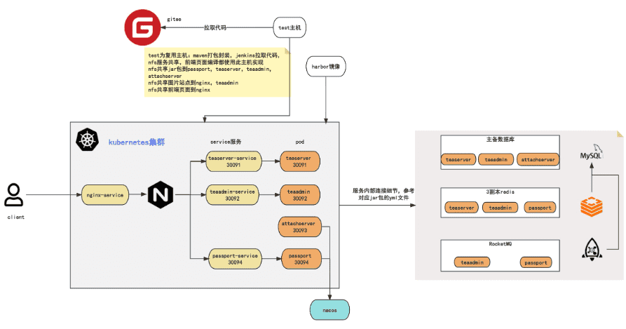

- [学习目标](#学习目标)
- [课堂笔记（命令）](#课堂笔记命令)
- [课堂笔记（文本）](#课堂笔记文本)
- [快捷键](#快捷键)
- [问题](#问题)
- [补充](#补充)
- [今日总结](#今日总结)
- [昨日复习](#昨日复习)

# 学习目标

Jumpserver搭建

Jumpserver配置与使用

# 课堂笔记（文本）

## JumpServer搭建

### 概述

> + JumpServer是一款开源的堡垒机，可使系统的管理员和开发人员安全的连接到企业内部服务器上执行操作，并且支持大部分操作系统，是一款非常安全的远程连接工具
>
> 优势 
>
> + 开源：零门槛，线上快速获取和安装 
> + 无插件：仅需浏览器，极致 Web Terminal 使用体验 
> + 多云支持：一套系统，同时管理不同云上资产 
> + 分布式：轻松支持大规模并发访问 
> + 云端存储：审计录像存放在云端，永不丢失 
> + 多租户：一套系统，多个子公司和部门同时使用
>
> 资产：
>
> 以下所有云主机统称为资产

### 项目架构



### 主机清单

|        主机名称         |    IP地址     |  最低配置   |  角色  |
| :---------------------: | :-----------: | :---------: | :----: |
| jumpserver（ecs-proxy） | 192.168.1.252 | 2CPU/8G内存 | 堡垒机 |
|         harbor          | 192.168.1.30  | 2CPU/4G内存 |  资产  |
|          test           | 192.168.1.101 | 2CPU/4G内存 |  资产  |
|          nacos          | 192.168.1.13  | 2CPU/4G内存 |  资产  |
|        rocketmq         | 192.168.1.14  | 2CPU/4G内存 |  资产  |

### 安装部署

> 跳板机安装jumpserver

```shell
# 更改且升级原ecs-proxy主机名以及配置；在华为云上更新主机配置为2c8g
[root@ecs-proxy ~]# hostnamectl set-hostnme jumpserver # 退出重新登陆
# 添加本地yum源
[root@jumpserver ~]# vim /etc/yum.repos.d/local.repo
[local]
name=local
baseurl=http://192.168.1.252/localrepo/
enabled=1
gpgcheck=0
[root@jumpserver ~]#dnf makecache
# 安装docker-ce
[root@jumpserver ~]#dnf -y install docker-ce
# 启动并设置开机自启
[root@jumpserver ~]#systemctl enable docker --now

# 安装jumpserver
[root@jumpserver ~]# cd s4/
[root@jumpserver s4]# tar -xf project.tar.xz
[root@jumpserver s4]# cd project/
[root@jumpserver project]# tar -xf jumpserver-offline-installer-v2.28.6-amd64-179.tar.gz
[root@jumpserver project]# mv jumpserver-offline-installer-v2.28.6-amd64-179 /usr/local/jumpserver
[root@jumpserver project]# cd /usr/local/jumpserver/
[root@jumpserver jumpserver]# ./jmsctl.sh install   #一路回车，只需要更改端口
1. 检查配置文件
配置文件位置: /opt/jumpserver/config
/opt/jumpserver/config/config.txt  [ √ ]
/opt/jumpserver/config/nginx/cert/server.crt   [ √ ]
/opt/jumpserver/config/nginx/cert/server.key   [ √ ]
完成

>>> 安装配置 Docker
1. 安装 Docker
完成

2. 配置 Docker
是否需要支持 IPv6? (y/n)  (默认为 n):                                       #直接回车
完成

3. 启动 Docker
完成

>>> 加载 Docker 镜像
...
完成

>>> 安装配置 JumpServer
1. 配置加密密钥
SECRETE_KEY:     YjYxYWMyZmUtMzI4NS00YmZhLTg1NWUtN2MwZjY1MWZhMTMw
BOOTSTRAP_TOKEN: YjYxYWMyZmUtMzI4NS00YmZh
完成

2. 配置持久化目录
是否需要自定义持久化存储, 默认将使用目录 /data/jumpserver (y/n)  (默认为 n):   #直接回车
完成

3. 配置 MySQL
是否使用外部 MySQL? (y/n)  (默认为 n):                                      #直接回车
完成

4. 配置 Redis
是否使用外部 Redis? (y/n)  (默认为 n):                                      #直接回车
完成

5. 配置对外端口
是否需要配置 JumpServer 对外访问端口? (y/n)  (默认为 n): y     #输入y，修改web访问端口
JumpServer web port (default 80): 81                      #端口为81
JumpServer ssh port (default 2222):                       #直接回车
完成

6. 初始化数据库
[+] Running 4/4
 ⠿ Network jms_net      Created                             0.1s
 ⠿ Container jms_redis  Healthy                            11.0s
 ⠿ Container jms_mysql  Healthy                            11.0s
 ⠿ Container jms_core   Started                            11.2s
2023-07-04 01:52:27 Collect static files
2023-07-04 01:52:27 Collect static files done
2023-07-04 01:52:27 Check database structure change ...
2023-07-04 01:52:27 Migrate model change to database ...
...
  Applying users.0040_alter_user_source... OK
After migration, update builtin role permissions
完成

>>> 安装完成了
1. 可以使用如下命令启动, 然后访问
cd /usr/local/jumpserver
./jmsctl.sh start

2. 其它一些管理命令
./jmsctl.sh stop
./jmsctl.sh restart
./jmsctl.sh backup
./jmsctl.sh upgrade
更多还有一些命令, 你可以 ./jmsctl.sh --help 来了解

3. Web 访问
http://192.168.1.252:81
默认用户: admin  默认密码: admin

4. SSH/SFTP 访问
ssh -p2222 admin@192.168.1.252
sftp -P2222 admin@192.168.1.252

5. 更多信息
我们的官网: https://www.jumpserver.org/
我们的文档: https://docs.jumpserver.org/
```

### 启动

```shell
[root@jumpserver jumpserver]# ./jmsctl.sh start
[+] Running 8/8
 ⠿ Container jms_redis   Healthy                                0.6s
 ⠿ Container jms_mysql   Healthy                                0.6s
 ⠿ Container jms_core    Healthy                               26.9s
 ⠿ Container jms_web     Started                               27.7s
 ⠿ Container jms_celery  Started                               27.8s
 ⠿ Container jms_koko    Started                               27.8s
 ⠿ Container jms_lion    Started                               28.2s
 ⠿ Container jms_magnus  Started                               30.0s
# 查看运行状态
[root@jumpserver jumpserver]# ./jmsctl.sh status

```

## JumpServer使用

### 访问

> http://公网IP:81
> 初始账号密码：admin admin

### 配置用户

> 在jumpserver里面两种用户：
>
> 1、用户管理里面的用户：这个用户指堡垒机账号， 就是你能用这个账号登录web页面， 登录跳板机服务器的用户
>
> 2、资产管理里面的系统用户：
>     它又分为` 特权用户`和 `普通用户`
>
> +    特权用户： 是资产已存在的, 并且拥有 高级权限 的系统用户，如root用户， JumpServer 使    用该用户来 `推送系统用户`、`获取资产硬件信息` 等;
> + 普通用户：可以在资产上预先存在，也可以由 特权用户 来自动创建
> + 系统用户：是JumpServer 登录资产时使用的账号 

### 创建用户

> 此用户只是用作登陆堡垒机和管理对应资产的用户

```perl
操作步骤如下：

1. 输入管理员账密登陆jumpserver

2. 点击用户管理-用户列表-创建

3. 账户栏

   输入名称(运维人员)，用户名(operation)，邮箱(gogetacoke@163.com),

4. 认证栏

   点击设置密码(Aa123456)，取消勾选下次登陆修改密码

5. 安全栏

   系统角色(用户)

6. 保存
```

> [注]：此用户创建好之后，需要使用这个用户进行资产的管理

### 资产添加

#### 特权用户

> 系统用户中的特权用户是资产（被控服务器）上的 root，或拥有 NOPASSWD: ALL sudo 权限的用户， JumpServer 使用该用户来 `推送系统用户`、`获取资产硬件信息` 等

```perl
# 特权用户创建步骤
1. 点击资产管理-点击系统用户-点击特权用户-创建

2. 基本栏

   名称(harbor-test特权用户)，用户名(root)，

3. 认证

   密码(harbor主机的登陆密码)，

4. 提交
```

> [注]：此用户为登陆资产(云主机)的真实root密码

#### 普通用户

> 系统用户中的普通用户是 JumpServer 跳转登录资产时使用的用户，可以理解为登录资产的系统用户，创建普通用户op，使用密码登录，自动推送选择所有权限ALL;类似在主机上使用useradd创建了一个用户

```perl
# 普通用户创建步骤
1. 点击普通用户-点击创建-选择SSH

2. 基本栏

   名称(普通用户op)，用户名(op)

3. 认证

   密码(123456)

4. 自动推送

   开启自动推送，Sudo(ALL)

5. 提交
```

> [注]：此用户用于登陆资产(云主机)用户，类似在主机上执行了useradd op

#### 资产添加

> 此资产就是jumpserver管理的机器

```perl
# 资产添加步骤
1. 点击资产管理-资产列表-创建

2. 基本

   主机名(harbor；类似hostname)，IP(192.168.1.30；harbor主机所在机器的IP)，系统平台(Linux)

3. 认证

   特权用户(harbor-test特权用户)

4. 节点

   节点(/Default)

5. 点击保存并继续添加(将test主机按照上方进行添加)

6. 提交
```

### 资产授权

> 资产授权，需要授权给那个用户进行管理
>

```perl
# 资产授权添加步骤
1. 点击全管理-资产授权-创建

2. 基本

   名称(运维资产)

3. 用户

   用户(运维人员(operation))

4. 资产

   资产(勾选刚添加的两个资产harbor、test)，系统用户(普通用户op)

5.  提交
```

## 命令行连接

> jumpserver使用命令行通过operation用户连接，可以看到资产，此时也可以在jumpserver主机通过命令行连接

```shell
[root@jumpserver ~]# ssh -p2222 operation@192.168.1.252
operation@192.168.1.252's password:   # 此密码为登陆jumpserver页面的登陆密码，根据用户输入对应的密码
                运维人员,  JumpServer 开源堡垒机

        1) 输入 部分IP，主机名，备注 进行搜索登录(如果唯一).
        2) 输入 / + IP，主机名，备注 进行搜索，如：/192.168.
        3) 输入 p 进行显示您有权限的主机.
        4) 输入 g 进行显示您有权限的节点.
        5) 输入 d 进行显示您有权限的数据库.
        6) 输入 k 进行显示您有权限的Kubernetes.
        7) 输入 r 进行刷新最新的机器和节点信息.
        8) 输入 s 进行中英日语言切换.
        9) 输入 h 进行显示帮助.
        10) 输入 q 进行退出.
Opt> p
  ID    | 主机名                                       | IP                | 平台        | 组织        | 备注       
--------+----------------------------------------------+-------------------+-------------+-------------+------------
  1     | harbor                                       | 192.168.1.30      | Linux       | Default     |            
  4     | test                                         | 192.168.1.101     | Linux       | Default     |            
页码：1，每页行数：29，总页数：1，总数量：4
提示：输入资产ID直接登录，二级搜索使用 // + 字段，如：//192 上一页：b 下一页：n
搜索：
[Host]> 1  # 输入对应的id，可以直接进入到资产里面
开始连接到 普通用户op@192.168.1.30  0.1

        Welcome to Huawei Cloud Service

Last login: Mon Mar  4 14:38:29 2024 from 192.168.1.252
[op@harbor ~]$ sudo -s # 且为root用户
[root@harbor op]# exit
exit
[op@harbor ~]$ exit
logout
[Host]> exit 
Connection to 192.168.1.252 closed.
[root@jumpserver ~]# 
```

> [注]：若帮助信息被清除后，输入`h`重新获取
>
> 按照上方添加方式，将rocketmq与nacos主机添加到operation的资产里面

# 快捷键


# 问题


# 补充


# 今日总结


# 昨日复习