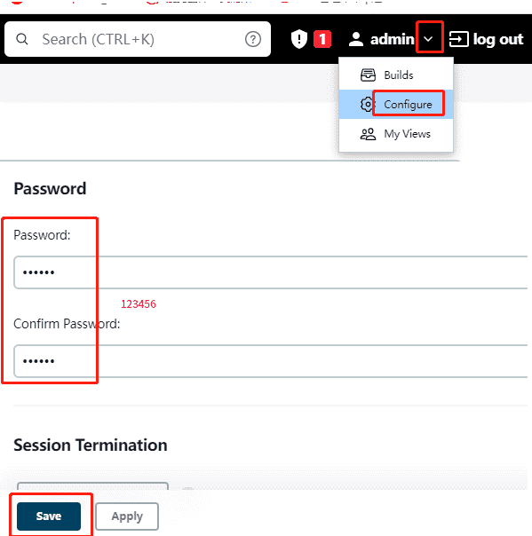

- [学习目标](#学习目标)
- [课堂笔记（文本）](#课堂笔记文本)
  - [Maven部署](#maven部署)
    - [安装Maven](#安装maven)
    - [代码打包](#代码打包)
      - [商品服务组件打包测试](#商品服务组件打包测试)
      - [商品管理组件打包测试](#商品管理组件打包测试)
      - [附件中心服务组件打包测试](#附件中心服务组件打包测试)
      - [验证中心组件打包测试](#验证中心组件打包测试)
  - [Jenkins部署](#jenkins部署)
    - [安装Jenkins](#安装jenkins)
    - [Jenkins初始化](#jenkins初始化)
    - [安装相关插件](#安装相关插件)
    - [对接gitee](#对接gitee)
    - [构建项目](#构建项目)
  - [Node部署](#node部署)
    - [安装](#安装)
    - [构建网站页面](#构建网站页面)
    - [配置nfs](#配置nfs)
- [快捷键](#快捷键)
- [问题](#问题)
- [补充](#补充)
- [今日总结](#今日总结)
- [昨日复习](#昨日复习)

# 学习目标

完成Maven安装部署

使用jenkins对接gitee

自动打包jar包

# 课堂笔记（文本）

## Maven部署

### 安装Maven

> maven安装在test主机

```shell
# 将包拷到test主机
[root@jumpserver ~]# rsync -av /root/package/node-v16.13.0-linux-x64.tar.gz /root/package/apache-maven-3.6.3-bin.tar.gz  /root/package/jenkins* /root/package/repository.tar.gz 192.168.1.101:/root/
# 安装maven
[root@test op]# cd /root/
[root@test ~]# tar -xf apache-maven-3.6.3-bin.tar.gz
[root@test ~]# mv apache-maven-3.6.3 /usr/local/maven
[root@test ~]# yum -y install java-11-openjdk-devel    #安装JDK11环境
#  配置maven环境变量;末尾追加
[root@test ~]#vim /etc/bashrc
export MAVEN_HOME="/usr/local/maven"
export PATH=#{MAVEN_HOME}/bin/:$PATH
# 验证环境信息
[root@test ~]#mvn -v
Apache Maven 3.6.3 (cecedd343002696d0abb50b32b541b8a6ba2883f)
Maven home: /usr/local/maven

# 解压仓库文件 
[root@test ~]# tar -xf /root/repository.tar.gz -C /usr/local/maven/
# 配置本地仓库
[root@test ~]#vim +55 /usr/local/maven/conf/settings.xml
 <localRepository>/usr/local/maven/repository/</localRepository>
```

### 代码打包

> 为test主机绑定一个公网IP以便拉取代码
>
> redis集群地址：192.168.1.162
>
> ELB：60.204.170.134

```shell
# 拉取代码
[root@test ~]#dnf -y install git
[root@test ~]#git clone https://gitee.com/cc-0001/tea.git
[root@test code]# ls
backend  page
```

#### 商品服务组件打包测试

```shell
#编写配置文件
[root@test ~]# cd /root/tea/code/backend/tarena-tp-tea/
[root@test tarena-tp-tea]# vim tea-server/tea-server-main/src/main/resources/application-vm.yaml  
spring:
  # 数据源配置
  datasource:
    url: jdbc:mysql://192.168.1.12:3306/tarena_tp_tea?useSSL=false&useUnicode=true&characterEncoding=utf-8&serverTimezone=Asia/Shanghai&allowMultiQueries=true&allowPublicKeyRetrieval=true
    username: teauser
    password: Taren123
......

  redis:
    host: 192.168.1.147    #此地址写自己redis的负载均衡地址
    port: 6379
    password: "Taren123"
    database: 8
    jedis:
      pool:
        max-active: 8
        min-idle: 5
        max-idle: 8
        max-wait: PT15M
        time-between-eviction-runs: PT15M
rocketmq:
  name-server: 192.168.1.14:9876
  producer:
    group: ${spring.application.name}
....

#url相关
image_path: /home/images/vm/tea_attach/
url: http://122.9.48.80:30080/tea_attach/   #写华为云负载均衡ELB的IP

.........
      
      
#打包测试；-D'maven.test.skip'=true：构建项目时跳过运行测试。通过设置为true，可以忽略测试环节，直接进行打包
[root@tea tarena-tp-tea]# mvn clean package -Dmaven.test.skip=true
...
[INFO] BUILD SUCCESS
[INFO] -----------------------------------------------------------------------

#查看结果并启动jar测试
#-Dfile.encoding=utf-8 是设置Java虚拟机的文件编码为UTF-8，
#-Xmx128M -Xms128M -Xmn64m -XX:MaxMetaspaceSize=128M -XX:MetaspaceSize=128M：配置Java虚拟机的内存分配和垃圾回收相关设置的

[root@test tarena-tp-tea]# ls tea-server/tea-server-main/target/tea-server-admin-1.0.0-SNAPSHOT.jar
[root@test tarena-tp-tea]# java -Dfile.encoding=utf-8 -jar tea-server/tea-server-main/target/tea-server-admin-1.0.0-SNAPSHOT.jar -Xmx128M -Xms128M -Xmn64m -XX:MaxMetaspaceSize=128M -XX:MetaspaceSize=128M --server.port=30091 --spring.profiles.active=vm


#创建存放图片的目录，解压图片tar包到此目录
[root@test tarena-tp-tea]# mkdir -p /home/images/vm/tea_attach/
[root@test tarena-tp-tea]# tar -xf /root/tea/teaimg.tar.gz -C /home/images/vm/tea_attach/
```

#### 商品管理组件打包测试

```shell
#编写配置文件
[root@test tarena-tp-tea]# vim tea-admin/tea-admin-main/src/main/resources/application-vm.yaml 
spring:
  # 数据源配置
  datasource:
    url: jdbc:mysql://192.168.1.12:3306/tarena_tp_tea?useSSL=false&useUnicode=true&characterEncoding=utf-8&serverTimezone=Asia/Shanghai&allowMultiQueries=true&allowPublicKeyRetrieval=true
    username: teauser
    password: Taren123
....

  redis:
    host: 192.168.1.147    #写自已redis负载均衡的地址
    port: 6379
    password: "Taren123"
    database: 8
    jedis:
      pool:
        max-active: 8
        min-idle: 5
        max-idle: 8
        max-wait: PT15M
        time-between-eviction-runs: PT15M

#图片路径配置
image_path: /home/images/vm/tea_attach/
url: http://122.9.48.80:30080/tea_attach/   #写华为云负载均衡ELB的IP


rocketmq:
  name-server: 192.168.1.14:9876
  producer:
    group: ${spring.application.name}
....
    
#打包测试
[root@test tarena-tp-tea]# mvn clean        #清理测试文件
[root@test tarena-tp-tea]# mvn clean package -D'maven.test.skip'=true
...
[INFO] BUILD SUCCESS
[INFO] -----------------------------------------------------------------------

# 查看结果并启动jar测试
[root@test tarena-tp-tea]# ls tea-admin/tea-admin-main/target/tea-admin-main-1.0.0-SNAPSHOT.jar
[root@test tarena-tp-tea]# java -Dfile.encoding=utf-8 -jar tea-admin/tea-admin-main/target/tea-admin-main-1.0.0-SNAPSHOT.jar -Xmx128M -Xms128M -Xmn64m -XX:MaxMetaspaceSize=128M -XX:MetaspaceSize=128M --server.port=30092 --spring.profiles.active=vm

#清理测试文件
[root@test tarena-tp-tea]# mvn clean
```

#### 附件中心服务组件打包测试

```shell
#编写配置文件
[root@test tarena-tp-tea]# cd /root/tea/code/backend/tarena-tp-attach/ 
[root@test tarena-tp-attach]# vim attach-server/attach-server-main/src/main/resources/application-vm.yaml 
....
  datasource:
    url: jdbc:mysql://192.168.1.12:3306/tarena_tp_tea?useSSL=false&useUnicode=true&characterEncoding=utf-8&serverTimezone=Asia/Shanghai&allowMultiQueries=true&allowPublicKeyRetrieval=true
    username: teauser
    password: Taren123
    driver-class-name: com.mysql.cj.jdbc.Driver
....

#url相关
image_path: /home/images/vm/tea_attach/
url: http://122.9.48.80:30080/tea_attach/     #写自己华为云负载均衡ELB的IP

dubbo:
  address: nacos://192.168.1.13:8848
  namespace: linux                         #nacos命名空间（project）id

#打包测试
[root@test tarena-tp-attach]# mvn clean package -D'maven.test.skip'=true
...
[INFO] BUILD SUCCESS
[INFO] -----------------------------------------------------------------------

# 查看结果并启动jar测试
[root@test tarena-tp-attach]# ls attach-server/attach-server-main/target/attach-server-main-1.0.0-SNAPSHOT.jar
[root@test tarena-tp-attach]# java -Dfile.encoding=utf-8 -jar attach-server/attach-server-main/target/attach-server-main-1.0.0-SNAPSHOT.jar -Xmx128M -Xms128M -Xmn64m -XX:MaxMetaspaceSize=128M -XX:MetaspaceSize=128M --server.port=30093 --spring.profiles.active=vm

#清理测试文件
[root@test tarena-tp-attach]# mvn clean
```

#### 验证中心组件打包测试

```shell
#编写配置文件
[root@test tarena-tp-attach]# cd /root/tea/code/backend/tarena-passport/
[root@test tarena-passport]# vim passport-provider/src/main/resources/application-vm.yml
......
spring:
  datasource:
    url: jdbc:mysql://192.168.1.12:3306/cs_mall_passport?useSSL=false&useUnicode=true&allowPublicKeyRetrieval=true&characterEncoding=utf-8&serverTimezone=Asia/Shanghai&allowMultiQueries=true
    username: cs_mall_user
    password: Taren123
  redis:
    host: 192.168.1.147    #写自已redis负载均衡的地址
    port: 6379
    password: "Taren123"
    ....
  cloud:
    nacos:
      discovery:
        server-addr: 192.168.1.13:8848
        namespace: linux                #nacos命名空间（project）id
        enabled: true
#打包测试
[root@test tarena-passport]# mvn clean package -D'maven.test.skip'=true
...
[INFO] BUILD SUCCESS
[INFO] ----------------------------------------------------------------------

查看结果并启动jar测试
[root@test tarena-passport]# ls passport-provider/target/passport-provider-1.0-SNAPSHOT.jar
[root@test tarena-passport]# java -Dfile.encoding=utf-8 -jar passport-provider/target/passport-provider-1.0-SNAPSHOT.jar -Xmx128M -Xms128M -Xmn64m -XX:MaxMetaspaceSize=128M -XX:MetaspaceSize=128M --server.port=30094 --spring.profiles.active=vm

#清理测试文件
[root@test tarena-passport]# mvn clean
```

## Jenkins部署

### 安装Jenkins

[访问清华源下载](https://mirrors.tuna.tsinghua.edu.cn/jenkins/)

```shell
[root@test ~]# yum -y install jenkins-2.361.4-1.1.noarch.rpm
[root@test ~]# systemctl enable --now jenkins
[root@test ~]# ss -antlp | grep 8080
LISTEN 0      50                 *:8080            *:*   
```

### Jenkins初始化

> 浏览器访问：http://url:8080

```shell
# 获取初始密码
[root@test ~]# cat /var/lib/jenkins/secrets/initialAdminPassword 
690cfbfd89794388805862e05000aba0
```

> 1. 选择插件安装
>
> 2. 选择右上角无，暂时不安装插件
>
> 3. 点击安装
>
> 4. 使用admin账户继续
>
> 5. 保存并完成\-开始使用Jenkins
>
> 6. 更改密码
>
>    

### 安装相关插件

```shell
#离线部署Jenkins插件
[root@test ~]# ls /var/lib/jenkins/plugins/ #空目录，没有任何插件
#解压jenkins插件，保留文件归属
[root@test ~]# tar -xPpf jenkins_plugins.tar.gz -C /var/lib/jenkins/plugins/ 
[root@test ~]# systemctl restart jenkins.service #重启Jenkins加载插件
[root@test ~]# ss -tln | grep 8080
LISTEN 0 50 *:8080 *:*

# 浏览器刷新jenkins页面，登录jenkin 账号密码：admin 123456
```

### 对接gitee

> https://mirrors.tuna.tsinghua.edu.cn/jenkins/updates/update-center.json

```shell
# 点击系统管理-插件管理-Advanced settings-输入上方站点CDNURL-点击提交
# 点击Available plugins-输入gitee-勾选gitee-点击右上方instal下拉框install after restart -翻到安装界面最下方勾选安装完成后重启Jenkins
# 回到首页-点击系统管理-系统配置-配置gitee(证书令牌通过登陆gitee中获取)-测试成功-保存
```

### 构建项目

> [查看详细构建](https://gogetacoke.lanzoub.com/iphfz1qi88ob)
>
> 或查看当前目录下day03补充

## Node部署

### 安装

```shell
# Java前端代码打包编译 可以使用Node.js来运行前端构建工具，并使用npm来管理前端依赖。通过配置前端构建工具，可以将前端代码打包成静态资源文件，并生成合并、压缩、优化后的文件，方便部署到服务器
#Node安装
[root@test tea]# cd /root/
[root@test ~]# tar -xf node-v16.13.0-linux-x64.tar.gz 
[root@test ~]# mv node-v16.13.0-linux-x64 /usr/local/node
[root@test ~]# ls /usr/local/node
bin  CHANGELOG.md  include  lib  LICENSE  README.md  share

#配置环境变量
[root@test ~]# vim /etc/bashrc 
...
export MAVEN_HOME="/usr/local/maven"
export NODE_HOME="/usr/local/node"      #新添加
export PATH=${MAVEN_HOME}/bin/:${NODE_HOME}/bin/:$PATH   #更改
[root@test ~]# source /etc/bashrc

#测试npm命令
[root@test ~]# npm -v
8.1.0
```

### 构建网站页面

> 商品管理页面

```shell
#测试编译
[root@test ~]# cd /var/lib/jenkins/workspace/tea/code/page/admin-page/
#安装此项目的各依赖项，此时，项目才是完整的、可运行的状态
[root@test admin-page]# npm install
#对项目进行打包和编译，根据test的环境进行打包编译
[root@test admin-page]# npm run build:test  
...
  Images and other types of assets omitted.

 DONE  Build complete. The dist directory is ready to be deployed.
 INFO  Check out deployment instructions at https://cli.vuejs.org/guide/deployment.html

#创建存放前端页面的目录/project/page
[root@test admin-page]# mkdir -p /project/page

#由于打包编译的页面（无论是商品管理页面还是商品展示页面）都在dist目录下面存放，所以在/project/page再次创建子目录，存放页面，便于区分

#拷贝商品管理页面资源到/project/page/admin-page/
[root@test admin-page]# mkdir /project/page/admin-page
[root@test admin-page]# cp -r dist/ /project/page/admin-page
```

> 商品展示页面

```shell
#测试编译
[root@test admin-page]# cd ../front-page/
[root@test front-page]# npm install     
...
added 1902 packages in 1m
[root@test front-page]# npm run build:linuxTech
...
  Images and other types of assets omitted.

 DONE  Build complete. The dist directory is ready to be deployed.
 INFO  Check out deployment instructions at https://cli.vuejs.org/guide/deployment.html

#拷贝商品展示页面资源到/project/page/front-page/
[root@test front-page]# mkdir /project/page/front-page
[root@test front-page]# cp -r dist/ /project/page/front-page
```

### 配置nfs

> 使用nfs 把目录/project/jar/；/project/page；/home/images/vm/共享出去

```shell
[root@test ~]# yum -y install nfs-utils
[root@test ~]# vim /etc/exports
/project/jar       *(rw)
/project/page      *(rw)
/home/images/vm    *(rw)
[root@test ~]# systemctl enable --now nfs-server
#后期需要再次目录中存储新的图片，需要写入的权限
[root@test ~]# chmod -R 777 /home/images/vm/    
```


# 快捷键


# 问题


# 补充


# 今日总结


# 昨日复习