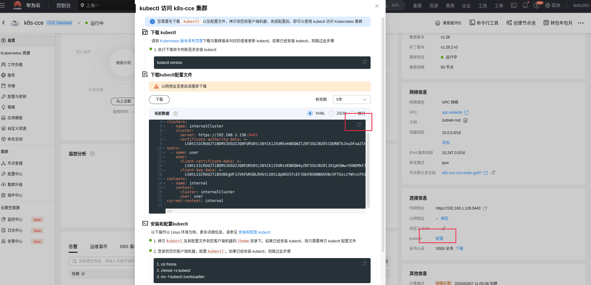

- [学习目标](#学习目标)
- [课堂笔记（文本）](#课堂笔记文本)
  - [创建集群](#创建集群)
    - [配置集群](#配置集群)
    - [配置集群镜像仓库](#配置集群镜像仓库)
  - [项目部署](#项目部署)
    - [后端部署](#后端部署)
      - [配置时间资源对象](#配置时间资源对象)
      - [创建共pv和pvc资源对象](#创建共pv和pvc资源对象)
      - [验证码服务启动](#验证码服务启动)
      - [teaserver服务启动](#teaserver服务启动)
      - [创建共享图片的pv和pvc](#创建共享图片的pv和pvc)
      - [管理端对接图片pv](#管理端对接图片pv)
      - [附件中心对接pvc](#附件中心对接pvc)
      - [创建并启动Pod](#创建并启动pod)
      - [创建/启动对应服务](#创建启动对应服务)
      - [前端部署](#前端部署)
- [快捷键](#快捷键)
- [问题](#问题)
- [补充](#补充)
- [今日总结](#今日总结)
- [昨日复习](#昨日复习)


# 学习目标

CCE集群搭建以及使用

项目发布

# 课堂笔记（文本）

## 创建集群

> 华为云购买CCE Standard集群
>
> 集群创建完成后进入集群管理界面点击创建节点
>
> [注]：华为云1.25版本以上后只支持containerd不支持docker

### 配置集群

> https://dl.k8s.io/v1.28.0-alpha.3/kubernetes-client-linux-amd64.tar.gz
>
> v1.28.0 为版本

```shell
# 下载kubectl与集群版本对应的kubectl；jumpserver管理node
[root@jumpserver ~]# tar -xf /root/package/kubernetes-client-linux-amd64.tar.gz 
[root@jumpserver ~]# mv /root/kubernetes/client/bin/kubectl /usr/local/bin/
# 配置华为云CCE容器配置信息
[root@jumpserver ~]# mkdir $HOME/.kube
[root@jumpserver ~]# vim $HOME/.kube/config  
内容为下方图片中内容

# 配置kubectl的tab键
[root@jumpserver ~]# kubectl completion bash >/etc/bash_completion.d/kubectl
[root@jumpserver ~]# exit                  #退出重新登录
[root@jumpserver ~]# kubectl get nodes      #可以看到结果
NAME          STATUS   ROLES    AGE   VERSION
192.168.1.2   Ready    <none>   13m   v1.28.2-r0-28.0.13.1
192.168.1.3   Ready    <none>   13m   v1.28.2-r0-28.0.13.1
192.168.1.4   Ready    <none>   13m   v1.28.2-r0-28.0.13.1
```

**kubectk配置文件**



### 配置集群镜像仓库

> 通过jumpserver主机连接三台k8s计算节点，更改hosts文件，做主机名和IP地址解析，更改config.tml文件，使其后期可以下载镜像，**三台机器**都需要配置**（以其中一台为例）**

```shell
# 编写hosts;填写harbor仓库地址域名解析
[root@node-20tih ~]#echo -e "192.168.1.30\tharbor" >> /etc/hosts
# 备份原始文件
[root@node-20tih ~]#mv /etc/containerd/config.toml /opt/
# 生成文件
[root@node-20tih ~]#containerd config default > /etc/containerd/config.toml
# 编写文件；set nu 开启行号
[root@node-20tih ~]#vim /etc/containerd/config.toml
62 	sandbox_image = "harbor:443/k8s/pause:3.9"
126 SystemdCgroup = true
155 空白处添加如下内容
[plugins."io.containerd.grpc.v1.cri".registry.mirrors."docker.io"]
          endpoint = ["https://harbor:443"] # 仓库信息
 [plugins."io.containerd.grpc.v1.cri".registry.mirrors."harbor:443"]
          endpoint = ["https://harbor:443"] # 仓库信息
 [plugins."io.containerd.grpc.v1.cri".registry.configs."harbor:443".tls]
          insecure_skip_verify = true # 跳过认证
  [plugins."io.containerd.grpc.v1.cri".registry.configs."harbor.example.com".auth]
          username = "admin"  # harbor仓库账密
          password = "admin123"
# 重启containerd生效
[root@node-20tih ~]#systemctl restart containerd
```

## 项目部署

### 后端部署

#### 配置时间资源对象

```shell
# jumpserver主机管理node
[root@jumpserver ~]# mkdir tea-yaml;cd tea-yaml
# 设置时区，确保pod中容器时间和宿主机保持一致
[root@jumpserver tea-yaml]# vim tz.yaml 
apiVersion: v1
kind: ConfigMap
metadata:
  name: timezone
data:
  timezone: "Asia/Shanghai"
[root@jumpserver tea-yaml]# kubectl apply -f tz.yaml 
[root@jumpserver tea-yaml]# kubectl get configmaps 
NAME               DATA   AGE
kube-root-ca.crt   1      31m
timezone           1      9s
```

#### 创建共pv和pvc资源对象

> 共享jar包

```shell
[root@jumpserver tea-yaml]# vim pv-pvc-jar.yaml 
---
apiVersion: v1
kind: PersistentVolume
metadata:
  name:  pv-jar
spec:
  volumeMode: Filesystem
  capacity:
    storage: 5Gi
  accessModes:
  - ReadWriteMany
  persistentVolumeReclaimPolicy: Retain
  nfs:
    server: 192.168.1.101
    path: /project/jar

---
apiVersion: v1
kind: PersistentVolumeClaim
metadata:
  name: pvc-jar
spec:
  volumeMode: Filesystem
  accessModes:
    - ReadWriteMany
  resources:
    requests:
      storage: 2Gi
```

#### 验证码服务启动

> 使用共享jar包，启动相关服务

```shell
[root@jumpserver tea-yaml]# vim passport-jar.yaml 
---
apiVersion: apps/v1
kind: Deployment
metadata:
  name: passport-jar
spec:
  selector:
    matchLabels:
      app: passport-jar
  replicas: 1
  template:
    metadata:
      labels:
        app: passport-jar
    spec:
      volumes:
      - name: passport-jar
        persistentVolumeClaim:
          claimName: pvc-jar
      containers:
      - name: passport-jar
        image: harbor:443/tea/jar:base
        env:
          - name: TZ
            valueFrom:
              configMapKeyRef:
                name: timezone
                key: timezone
        command: ["/bin/bash"]
        args:
        - -c
        - |
          java -Dfile.encoding=utf-8 -jar /project/jar/passport-provider-1.0-SNAPSHOT.jar -Xmx128M -Xms128M -Xmn64m -XX:MaxMetaspaceSize=128M-XX:MetaspaceSize=128M --server.port=30094 --spring.profiles.active=vm
        ports:
        - protocol: TCP
          containerPort: 30094
        volumeMounts:
        - name: passport-jar
          mountPath: /project/jar
      restartPolicy: Always
```

#### teaserver服务启动

> 商品展示页使用共享pvc中的jar包

```shell
[root@jumpserver tea-yaml]# vim teaserver-jar.yaml 
---
apiVersion: apps/v1
kind: Deployment
metadata:
  name: teaserver-jar
spec:
  selector:
    matchLabels:
      app: teaserver-jar
  replicas: 1
  template:
    metadata:
      labels:
        app: teaserver-jar
    spec:
      volumes:
      - name: teaserver-jar
        persistentVolumeClaim:
          claimName: pvc-jar
      containers:
      - name: teaserver-jar
        image: harbor:443/tea/jar:base
        env:
          - name: TZ
            valueFrom:
              configMapKeyRef:
                name: timezone
                key: timezone
        command: ["/bin/bash"]
        args:
        - -c
        - |
          java -Dfile.encoding=utf-8 -jar /project/jar/tea-server-admin-1.0.0-SNAPSHOT.jar -Xmx128M -Xms128M -Xmn64m -XX:MaxMetaspaceSize=128M -XX:MetaspaceSize=128M --server.port=30091 --spring.profiles.active=vm
        ports:
        - protocol: TCP
          containerPort: 30091
        volumeMounts:
        - name: teaserver-jar
          mountPath: /project/jar
      restartPolicy: Always
```

#### 创建共享图片的pv和pvc

```shell
[root@jumpserver tea-yaml]# vim pv-pvc-image.yaml 
---
apiVersion: v1
kind: PersistentVolume
metadata:
  name:  pv-image
spec:
  volumeMode: Filesystem
  capacity:
    storage: 5Gi
  accessModes:
  - ReadWriteMany
  persistentVolumeReclaimPolicy: Retain
  nfs:
    server: 192.168.1.101
    path: /home/images/vm/

---
apiVersion: v1
kind: PersistentVolumeClaim
metadata:
  name: image
spec:
  volumeMode: Filesystem
  accessModes:
    - ReadWriteMany
  resources:
    requests:
      storage: 2Gi
```

#### 管理端对接图片pv

```shell
[root@jumpserver tea-yaml]# vim teaadmin-jar.yaml 
---
apiVersion: apps/v1
kind: Deployment
metadata:
  name: teaadmin-jar
spec:
  selector:
    matchLabels:
      app: teaadmin-jar
  replicas: 1
  template:
    metadata:
      labels:
        app: teaadmin-jar
    spec:
      volumes:
      - name: teaadmin-jar
        persistentVolumeClaim:
          claimName: pvc-jar
      - name: image
        persistentVolumeClaim:
          claimName: image
      containers:
      - name: teaadmin-jar
        image: harbor:443/tea/jar:base
        env:
          - name: TZ
            valueFrom:
              configMapKeyRef:
                name: timezone
                key: timezone
        command: ["/bin/bash"]
        args:
        - -c
        - |
          java -Dfile.encoding=utf-8 -jar /project/jar/tea-admin-main-1.0.0-SNAPSHOT.jar -Xmx128M -Xms128M -Xmn64m -XX:MaxMetaspaceSize=128M -XX:MetaspaceSize=128M --server.port=30092 --spring.profiles.active=vm
        ports:
        - protocol: TCP
          containerPort: 30092
        volumeMounts:
        - name: teaadmin-jar
          mountPath: /project/jar
        - name: image
          mountPath: /home/images/vm/
      restartPolicy: Always
```

#### 附件中心对接pvc

```shell
[root@jumpserver tea-yaml]# vim attach-jar.yaml 
---
apiVersion: apps/v1
kind: Deployment
metadata:
  name: attache-jar
spec:
  selector:
    matchLabels:
      app: attache-jar
  replicas: 1
  template:
    metadata:
      labels:
        app: attache-jar
    spec:
      volumes:
      - name: attach-jar
        persistentVolumeClaim:
          claimName: pvc-jar
      containers:
      - name: attache-jar
        image: harbor:443/tea/jar:base
        env:
          - name: TZ
            valueFrom:
              configMapKeyRef:
                name: timezone
                key: timezone
        command: ["/bin/bash"]
        args:
        - -c
        - |
          java -Dfile.encoding=utf-8 -jar /project/jar/attach-server-main-1.0.0-SNAPSHOT.jar -Xmx128M -Xms128M -Xmn64m -XX:MaxMetaspaceSize=128M -XX:MetaspaceSize=128M --server.port=30093 --spring.profiles.active=vm
        ports:
        - protocol: TCP
          containerPort: 30093
        volumeMounts:
        - name: attach-jar
          mountPath: /project/jar
      restartPolicy: Always
```

#### 创建并启动Pod

```shell
[root@jumpserver tea-yaml]# kubectl apply -f pv-pvc-jar.yaml 
[root@jumpserver tea-yaml]# kubectl apply -f passport-jar.yaml 
[root@jumpserver tea-yaml]# kubectl apply -f teaserver-jar.yaml
[root@jumpserver tea-yaml]# kubectl apply -f pv-pvc-image.yaml
[root@jumpserver tea-yaml]# kubectl apply -f teaadmin-jar.yaml
[root@jumpserver tea-yaml]# kubectl apply -f attach-jar.yaml
[root@jumpserver tea-yaml]# kubectl get pods
NAME                             READY   STATUS    RESTARTS   AGE
attache-jar-7d5c6cdb89-z542w     1/1     Running   0          4m49s
passport-jar-5575d497f6-mm478    1/1     Running   0          5m19s
teaadmin-jar-56bb9f587f-xpshj    1/1     Running   0          4s
teaserver-jar-6cddbccdf6-288th   1/1     Running   0          5m10s
```

#### 创建/启动对应服务

```shell
#创建对应的service服务，对应后端的jar
[root@jumpserver tea-yaml]# vim teaserver-service.yaml 
---
apiVersion: v1
kind: Service
metadata:
  name: teaserver-service
spec:
  ports:
  - protocol: TCP
    port: 30091
    targetPort: 30091
  selector:
    app: teaserver-jar
  type: ClusterIP

[root@tea jar]# vim teaadmin-service.yaml 
---
apiVersion: v1
kind: Service
metadata:
  name: teaadmin-service
spec:
  ports:
  - protocol: TCP
    port: 30092
    targetPort: 30092
  selector:
    app: teaadmin-jar
  type: ClusterIP
  
[root@jumpserver tea-yaml]# vim passport-service.yaml 
---
apiVersion: v1
kind: Service
metadata:
  name: passport-service
spec:
  ports:
  - protocol: TCP
    port: 30094
    targetPort: 30094
  selector:
    app: passport-jar
  type: ClusterIP

# 启动服务
[root@jumpserver tea-yaml]# kubectl apply -f passport-service.yaml
[root@jumpserver tea-yaml]# kubectl apply -f teaserver-service.yaml 
[root@jumpserver tea-yaml]# kubectl apply -f teaadmin-service.yaml 
[root@jumpserver tea-yaml]# kubectl get service
NAME                TYPE        CLUSTER-IP       EXTERNAL-IP   PORT(S)     AGE
kubernetes          ClusterIP   10.247.0.1       <none>        443/TCP     4h4m
passport-service    ClusterIP   10.247.225.140   <none>        30094/TCP   6s
teaadmin-service    ClusterIP   10.247.54.142    <none>        30092/TCP   22s
teaserver-service   ClusterIP   10.247.206.137   <none>        30091/TCP   16s
```

#### 前端部署

```shell
#使用pv/pvc声明学茶网商品管理页面和商品展示页面
[root@jumpserver tea-yaml]# vim pv-pvc-adminpage.yaml 
---
apiVersion: v1
kind: PersistentVolume
metadata:
  name: admin-page
spec:
  volumeMode: Filesystem
  capacity:
    storage: 5Gi
  accessModes:
  - ReadWriteMany
  persistentVolumeReclaimPolicy: Retain
  nfs:
    server: 192.168.1.101
    path: /project/page/admin-page/dist/

---
apiVersion: v1
kind: PersistentVolumeClaim
metadata:
  name: admin-page
spec:
  volumeMode: Filesystem
  accessModes:
    - ReadWriteMany
  resources:
    requests:
      storage: 2Gi

# 创建前端页面所需的pv和pvc
[root@jumpserver tea-yaml]# vim pv-pvc-frontpage.yaml  
---
apiVersion: v1
kind: PersistentVolume
metadata:
  name: front-page
spec:
  volumeMode: Filesystem
  capacity:
    storage: 5Gi
  accessModes:
  - ReadWriteMany
  persistentVolumeReclaimPolicy: Retain
  nfs:
    server: 192.168.1.101
    path: /project/page/front-page/dist/

---
apiVersion: v1
kind: PersistentVolumeClaim
metadata:
  name: front-page
spec:
  volumeMode: Filesystem
  accessModes:
    - ReadWriteMany
  resources:
    requests:
      storage: 2G
[root@jumpserver tea-yaml]# kubectl apply -f pv-pvc-adminpage.yaml 
[root@jumpserver tea-yaml]# kubectl apply -f pv-pvc-frontpage.yaml 

#获取nginx的配置文件，进行nginx前后端页面交互部署，以及图片站点部署
[root@jumpserver tea-yaml]# scp 192.168.1.101:/root/tea/nginx.conf ./
[root@jumpserver tea-yaml]# cat nginx.conf    #查看即可，不需要更改（配置文件已经更改好）
...
#限制文件传输
      client_body_buffer_size 30m;
      client_max_body_size 30m;
      server {
          listen       80;      
...
#在文件末尾查看（如果需要自己写，就在文件最后一个花括号里面添加）
server {                            #网站图片站点
         listen 30080;
          server_name __;
                    
            location / {
                root /home/images/vm/;
                index index.html index.htm;
     }
}

server {                        #网站商品展示页面
    listen 30091;
    server_name __;
    
    location / {
        root "/project/page/front-page/dist/";
        index index.html;
    }
    location /api/ {
        proxy_pass http://teaserver-service:30091/;
    }
    
    location /passport-api/ {
        proxy_pass http://passport-service:30094/;
    }
}

server {                   #网站商品管理页面
    listen 30092;
    server_name __;
    
    location / {
        root "/project/page/admin-page/dist/";
        index index.html;
     }
    location /api/ {
        proxy_pass http://teaadmin-service:30092/;
     }
    
    location /to_passport/ {
        proxy_pass http://passport-service:30094/;
    }
  }
}       #最后一个括号已经存在，不要复制

#创建nginx的configmap
[root@jumpserver tea-yaml]# kubectl create configmap nginx --from-file=nginx.conf 

#编写nginx的资源对象文件，定义引用nginx的configmap
[root@jumpserver tea-yaml]# vim nginx.yaml 
---
apiVersion: apps/v1
kind: Deployment
metadata:
  name: nginx
spec:
  selector:
    matchLabels:
      app: nginx
  replicas: 1
  template:
    metadata:
      labels:
        app: nginx
    spec:
      volumes:
      - name: nginx
        configMap:
          name: nginx
      - name: admin-page
        persistentVolumeClaim:
          claimName: admin-page
      - name: front-page
        persistentVolumeClaim:
          claimName: front-page
      - name: image
        persistentVolumeClaim:
          claimName: image
      containers:
      - name: nginx
        image: harbor:443/tea/tea:nginx
        env:
          - name: TZ
            valueFrom:
              configMapKeyRef:
                name: timezone
                key: timezone
        ports:
        - name: image-30080
          protocol: TCP
          containerPort: 30080
        - name: teaserver-30091
          protocol: TCP
          containerPort: 30091
        - name: teaadmin-30092
          protocol: TCP
          containerPort: 30092
        volumeMounts:
        - name: nginx
          mountPath: /usr/local/nginx/conf/nginx.conf
          subPath: nginx.conf
        - name: admin-page
          mountPath: /project/page/admin-page/dist/
        - name: front-page
          mountPath: /project/page/front-page/dist/
        - name: image
          mountPath: /home/images/vm/          
      restartPolicy: Always
      
#创建nginx的service文件，使用NodePort发布服务
[root@jumpserver tea-yaml]# vim nginx-service.yaml 
---
apiVersion: v1
kind: Service
metadata:
  name: nginx-service
spec:
  ports:
  - name: image-30080
    protocol: TCP
    port: 30080
    targetPort: 30080
    nodePort: 30080
  - name: teaserver-30091
    protocol: TCP
    port: 30091
    targetPort: 30091
    nodePort: 30091
  - name: teaadmin-30092
    protocol: TCP
    port: 30092
    targetPort: 30092
    nodePort: 30092
  selector:
    app: nginx
  type: NodePort
[root@jumpserver tea-yaml]# kubectl apply -f nginx.yaml 
[root@jumpserver tea-yaml]# kubectl apply -f nginx-service.yaml 
```


# 快捷键


# 问题


# 补充


# 今日总结


# 昨日复习