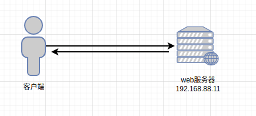
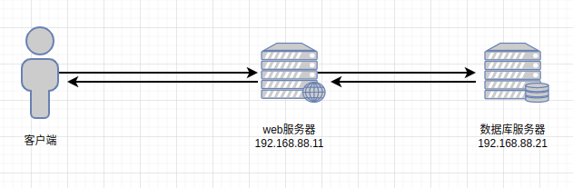
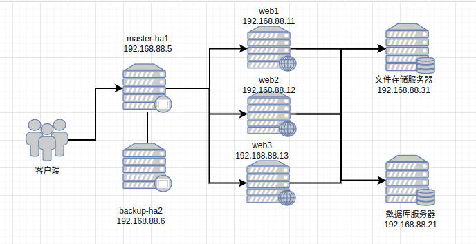
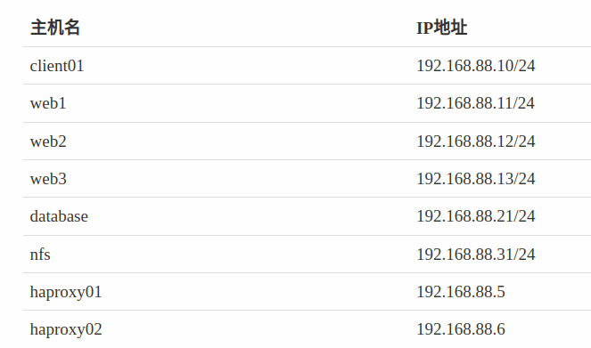
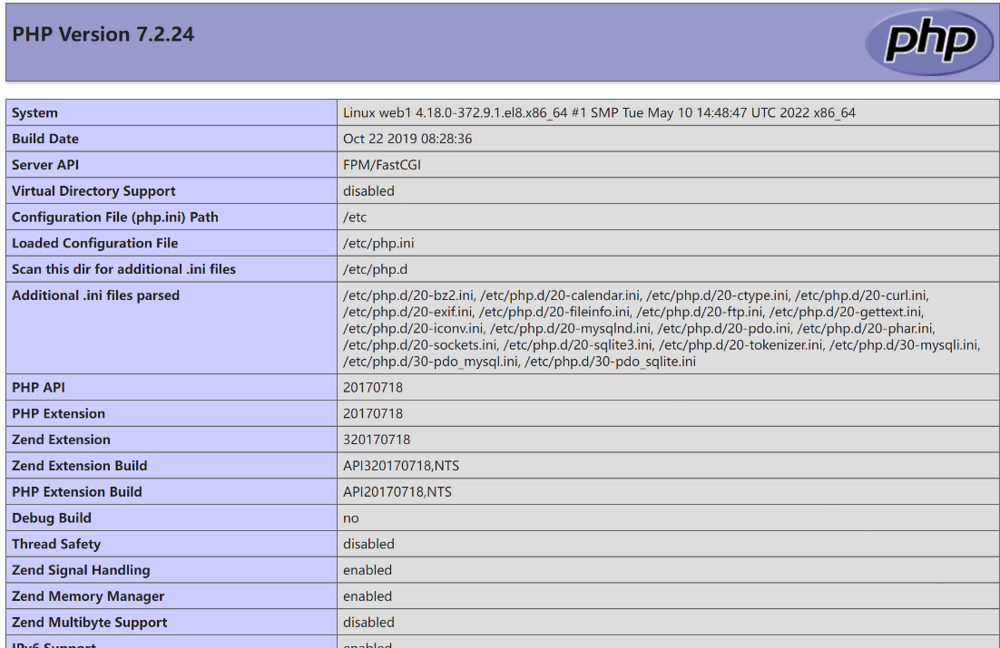
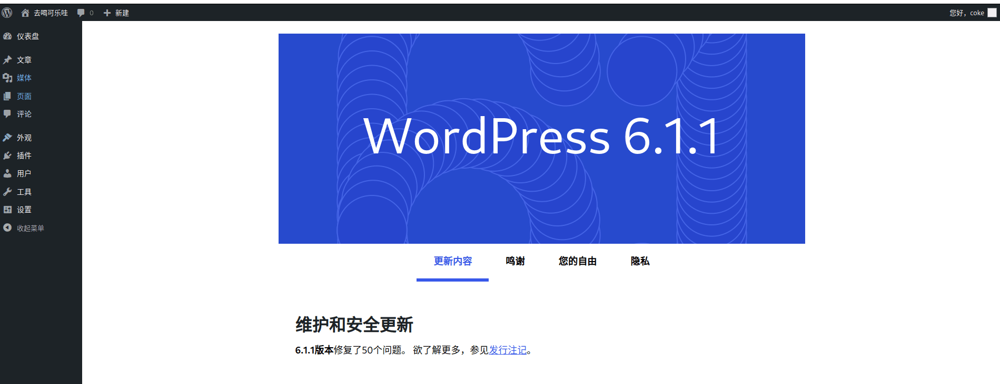

- [项目名](#项目名)
- [项目介绍](#项目介绍)
- [项目架构图](#项目架构图)
  - [单击架构图](#单击架构图)
  - [单机-数据库分离架构图](#单机-数据库分离架构图)
  - [集群架构图](#集群架构图)
- [技术选型](#技术选型)
- [环境准备](#环境准备)
  - [配置环境](#配置环境)
    - [配置ansible环境](#配置ansible环境)
    - [配置yum](#配置yum)
- [单击搭建](#单击搭建)
  - [安装软件](#安装软件)
  - [编写测试页面](#编写测试页面)
    - [测试访问](#测试访问)
  - [数据库配置](#数据库配置)
    - [测试访问](#测试访问-1)
  - [部署wordpress](#部署wordpress)
    - [解压缩包](#解压缩包)
    - [修改权限](#修改权限)
    - [页面初始化](#页面初始化)
- [单机-数据库分离搭建](#单机-数据库分离搭建)
  - [安装软件](#安装软件-1)
  - [导出数据库](#导出数据库)
  - [测试数据库](#测试数据库)
  - [修改配置文件](#修改配置文件)
  - [测试网页](#测试网页)
- [NFS搭建](#nfs搭建)
- [集群搭建](#集群搭建)
- [知识总结](#知识总结)

# 项目名

> 基于LNMP结构实现高可用wordpress项目搭建

# 项目介绍

> ​	WordPress是一个功能强大的内容管理系统（CMS），用于构建网站。它具有灵活性和可扩展性，其中最重要的是它是开源软件。这意味着有一个庞大的社区不断为其开发做出贡献，并创建工具为用户提供额外功能。WordPress的强大之处在于它的潜在学习曲线。虽然WordPress的可能性令人惊叹，但也可能令人不知所措。有很多东西需要学习和探索！好消息是，一个网站不需要非常复杂才能有效。通常情况下，简单就是更好。更好的消息是，WordPress非常适合创建简单的网站，将学习曲线降低到更容易掌握的水平。从这里开始，您可以一步步地继续学习和发展您的网站。
>
> [访问官网下载](https://cn.wordpress.org/download/)

# 项目架构图

## 单击架构图



## 单机-数据库分离架构图



## 集群架构图



# 技术选型

> web服务器：nginx
>
> 数据库：mysql-server
>
> 文件存储：nfs
>
> php依赖：php-fpm、php-mysqlnd、php-json
>
> ansible剧本：ansible

# 环境准备



> 1. 创建虚拟机、配置防火墙、SELINUX、主机名、IP地址、yum
>
> 2. 下载wordpress安装包
>
>    [点击进行下载](https://cn.wordpress.org/download/)
>
> 3. 准备一台主机用于ansible自动化管理其余服务器

## 配置环境

### 配置ansible环境

```sh
# 配置ansible
[root@pubserver ~]#yum -y install ansible
# 创建工作目录
[root@pubserver ~]#mkdir -p project01/files
[root@pubserver ~]# cd project01/
# 创建主配置文件、主机清单文件、yum配置文件
[root@pubserver project01]# vim ansible.cfg 
[defaults]
inventory = inventory
host_key_checking = false
[root@pubserver project01]#vim inventory
[webservers]
web1 ansible_host=192.168.88.11
web2 ansible_host=192.168.88.12
web3 ansible_host=192.168.88.13

[databases]
database1 ansible_host=192.168.88.21

[nfss]
nfs1 ansible_host=192.168.88.31

[haproxys]
haproxy01 ansible_host=192.168.88.5
haproxy02 ansible_host=192.168.88.6

[all:vars]
ansible_ssh_user=root
ansible_ssh_pass=a
# 测试主机
[root@pubserver project01]#ansible all -m ping
```

### 配置yum

```sh
[root@pubserver project01]# vim files/local88.repo 
[BaseOS]
name = BaseOS
baseurl = ftp://192.168.88.240/dvd/BaseOS
enabled = 1
gpgcheck = 0

[AppStream]
name = AppStream
baseurl = ftp://192.168.88.240/dvd/AppStream
enabled = 1
gpgcheck = 0

[rpms]
name = rpms
baseurl = ftp://192.168.88.240/rpms
enabled = 1
gpgcheck = 0

# 上传yum到各台主机
[root@pubserver project01]# vim 01-upload-repo.yml 
---
- name: config repos.d
  hosts: all
  tasks:
    - name: delete repos.d
      file:
        path: /etc/yum.repos.d
        state: absent

    - name: create repos.d
      file:
        path: /etc/yum.repos.d
        state: directory
        mode: '0755'

    - name: upload local88
      copy:
        src: files/local88.repo
        dest: /etc/yum.repos.d/

[root@pubserver project01]# ansible-playbook 01-upload-repo.yml 
```

# 单击搭建

## 安装软件

```sh
# 使用ansible剧本批量安装及启动
[root@pubserver project01]# vim 02-config-web1.yml 
---
- name: config web1
  hosts: web1
  tasks:
    - name: install pkgs   # 安装软件包
      yum:
        name:
          - nginx
          - mysql-server
          - php-mysqlnd
          - php-fpm
          - php-json
        state: present

    - name: start service   # 循环启动多个服务
      service:
        name: "{{item}}"
        state: started
        enabled: yes
      loop:
        - nginx
        - php-fpm
        - mysqld
[root@pubserver project01]# ansible-playbook 02-config-web1.yml
```

## 编写测试页面

```sh
[root@web1 ~]# vim /usr/share/nginx/html/index.php # 获取php版本信息
<?php
    phpinfo();
?>
```

### 测试访问

> 浏览器：http://192.168.88.11



## 数据库配置

```sh
# 编写一个脚本创建数据库wordpress，用户yyh，密码123456，拥有wordpress数据库全部权限
[root@pubserver project01]# vim files/config_mysql.sh
#!/bin/bash

mysql -e "create database wordpress character set utf8mb4"
mysql -e "create user yyh@localhost identified by '123456'"
mysql -e "grant all privileges on wordpress.* to yyh@localhost"

[root@pubserver project01]#chmod +x files/config_mysql.sh
[root@pubserver project01]# vim 03-config-mysql.yml 
---
- name: config mysql
  hosts: web1
  tasks:
    - name: create database
      script: files/config_mysql.sh

[root@pubserver project01]# ansible-playbook 03-config-mysql.yml
```

```sh
# mysql -e
[root@database1 ~]#mysql -e "select version()"
+-----------+
| version() |
+-----------+
| 8.0.26    |
+-----------+
```

> "mysql -e" 是 MySQL 命令行工具的一部分，用于执行 SQL 查询或命令。其中，"-e" 选项表示后面跟随的是要执行的 SQL 语句或命令。通过这种方式，可以在命令行中直接执行 MySQL 查询，而无需打开交互式 MySQL Shell。
>
> 例如，在命令行中输入 "mysql -e 'SELECT * FROM users'"，将会执行一个查询语句，从名为 "users" 的表中选择所有记录。结果将直接在命令行中返回。
>
> 请注意，执行 "mysql -e" 命令需要正确安装和配置 MySQL，并具有足够的权限来执行查询或命令。

### 测试访问

```sh
[root@web1 ~]#mysql -uyyh -p123456 wordpress # 能正常进入则表示配置正确
```

## 部署wordpress

### 解压缩包

```sh
[root@web1 ~]# tar xf wordpress-6.1.1-zh_CN.tar.gz  
[root@web1 ~]# cp -r wordpress/* /usr/share/nginx/html/
```

### 修改权限

```sh
# php程序是由php-fpm处理的，php-fpm要以apache身份运行（不是必须；也可以选择为PHP-FPM指定其他用户和组。对于安全性而言，强烈建议不要用root用户来运行PHP-FPM）
[root@web1 ~]#ps -aux|grep php-fpm # 可以查询到全是以apache用户在运行
[root@web1 ~]#ll /usr/share/nginx/html/ # 可以看到全是root root
# 为了让php-fpm程序能对html目录进行读写操作，需要为他授予权限
[root@web1 ~]#chown -R apache:apache /usr/share/nginx/html/
[root@web1 ~]#ll /usr/share/nginx/html/ # 全是apache apache
```

> 代码解释：
>
> ​	nginx使用php的页面需要使用一个中间件FastCGI，用于nginx与后端服务php通信，所以需要安装一个php-fpm，运行成功后会创建一个apache用户，通过ps -aux|grep php-fpm查询到该进程的用户是apache，所以使用php-fpm必须要apache用户，但也不是必须可以在/etc/php-fpm.d/ww.conf文件第55行添加acl用户；
>
> ​	通过ll /usr/share/nginx/html 查看初始nginx的文件属主与属组都是root，但是不建议使用root进行数据读写
>
> ​	使用chown -R apache :apache /usr/share/nginx/html 给该目录递归设置所属主及所属组为apache

### 页面初始化

> 浏览器访问：http://192.168.88.11
>
> 根据提示进行初始化，数据库名、数据库账密、站点名、账密
>
> 登陆



# 单机-数据库分离搭建

> 基于单机搭建进行

## 安装软件

```sh
[root@pubserver project01]# vim files/config_mysql2.sh
#!/bin/bash
  
mysql -e "create database wordpress character set utf8mb4"
mysql -e "create user yyh@'%' identified by '123456'"
mysql -e "grant all privileges on wordpress.* to yyh@'%'"

[root@pubserver project01]# chmod +x files/config_mysql2.sh
[root@pubserver project01]# vim 04-config-database.yml
---
- name: config database
  hosts: databases
  tasks:
    - name: install mysql    # 安装数据库服务
      yum:
        name: mysql-server
        state: present

    - name: start service    # 启动数据库服务
      service:
        name: mysqld
        state: started
        enabled: yes

    - name: create database user
      script: files/config_mysql2.sh

[root@pubserver project01]# ansible-playbook 04-config-database.yml
```

## 导出数据库

```sh
# 备份数据库wordpress中的数据到wordpress.sql文件
[root@web1 ~]# mysqldump wordpress > wordpress.sql
# 将备份文件拷贝到新数据库服务器
[root@web1 ~]# scp wordpress.sql 192.168.88.21:/root/
```

> `mysqldump`是一个MySQL数据库命令行工具，用于备份和导出数据库的结构和数据。它可以生成包含SQL语句的文本文件，这些语句可以用于恢复（导入）数据库或将数据库迁移到其他环境

## 测试数据库

```sh
[root@database1 ~]#ls 
wordpress.sql
[root@database1 ~]#mysql -uyyh -p123456 wordpress
mysql>show databases;
+--------------------+
| Database           |
+--------------------+
| information_schema |
| wordpress          |
+--------------------+
2 rows in set (0.00 sec)
mysql>quit

# 将wordpress.sql中的数据导入到wordpress数据库中
[root@database1 ~]#mysql wordpress < wordpress.sql
[root@database1 ~]# mysql -e "show tables" wordpress # 有数据就没问题
+-----------------------+
| Tables_in_wordpress   |
+-----------------------+
| wp_commentmeta        |
| wp_comments           |
| wp_links              |
| wp_options            |
| wp_postmeta           |
| wp_posts              |
| wp_term_relationships |
| wp_term_taxonomy      |
| wp_termmeta           |
| wp_terms              |
| wp_usermeta           |
| wp_users              |
+-----------------------+
```

## 修改配置文件

```sh
[root@web1 ~]# vim +32 /usr/share/nginx/html/wp-config.php 
...略...
 31 /** Database hostname */
 32 define( 'DB_HOST', '192.168.88.21' ); # 指定数据库地址为数据库服务器IP
...略...

[root@web1 ~]# systemctl stop mysqld
[root@web1 ~]# yum remove -y mysql-server # 卸载本机数据库，将使用数据库服务器的数据库
```

## 测试网页

> http://192.168.88.11
>
> 还能正常访问表示成功

# NFS搭建


# 集群搭建


# 知识总结

