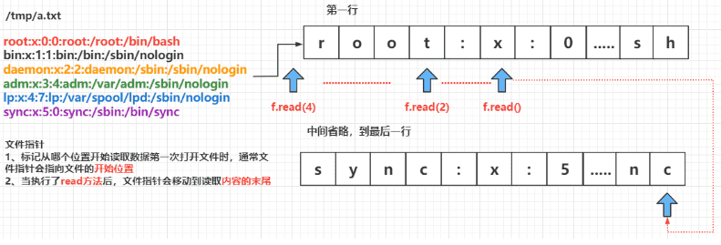

- [学习目标](#学习目标)
- [课堂笔记（命令）](#课堂笔记命令)
- [课堂笔记（文本）](#课堂笔记文本)
- [快捷键](#快捷键)
- [问题](#问题)
- [补充](#补充)
- [今日总结](#今日总结)
- [昨日复习](#昨日复习)

# 学习目标

文件对象

函数基础

# 课堂笔记（命令）

# 课堂笔记（文本）

## 文件读写操作

### 基本语法

```python
# 访问文件的步骤永远都是，先打开文件，再进行操作
file_object = open(file_name, mode='模式')
```

### 参数介绍

> **file_name：**表示我们要打开文件的路径
>
> **mode：**以怎样的方式打开文
>
> **file_object：**文件操作对象，我们后续对文件的所有读写操作都需要通过这个对象，而不是直接操作文件中的数据。

| **文件模式** | **操 作**                                    |
| ------------ | -------------------------------------------- |
| r            | 以读方式打开（文件不存在则报错）             |
| w            | 以写方式打开（文件存在则清空，不存在则创建） |
| a            | 以追加模式打开                               |
| b            | 以二进制模式打开                             |

### 文件读操作

> 要使用文本文件中的信息，首先需要将信息读取到内存中。为此，我们可以一次性读取文件的全部内容，也可以以每次一行的方式逐步读取。

#### read方法 读取文件

> - `open` 函数的第一个参数是要打开的文件名（文件名区分大小写）
>   - 如果文件 **存在**，返回 **文件操作对象**
>   - 如果文件 **不存在**，会 **抛出异常**
> - `read` 方法可以一次性 **读入** 并 **返回** 文件的 **所有内容**
> - `close` 方法负责 **关闭文件**
>   - 如果 **忘记关闭文件**，**会造成系统资源消耗，而且会影响到后续对文件的访问**
> - **注意**：`read` 方法执行后，会把 **文件指针** 移动到 **文件的末尾**

```python
# 打开文件
files = open("/etc/hosts", "r")
print(files.read(2)) # 12
print(files.read(5)) # 7.0.0
print(files.read()) # 读取全文剩余的内容
print(files.read(2)) # 内容被读取完，再读取就没了
# 关闭资源
files.close()
```

#### 文件指针

> - **文件指针** 标记 **从哪个位置开始读取数据**
> - **第一次打开** 文件时，通常 **文件指针会指向文件的开始位置**
> - 当执行了 `read` 方法后，**文件指针** 会移动到 **读取内容的末尾**
>   - 默认情况下会移动到 **文件末尾**
> - 重新打开文件时，**文件指针** 重新指向文件的最 **开始位置**



#### redline方法 按行读取

> - `read` 方法默认会把文件的 **所有内容** **一次性读取到内存**
> - 如果文件太大，对内存的占用会非常严重
> - `readline` 方法可以一次读取一行内容
> - 方法执行后，会把 **文件指针** 移动到下一行，准备再次读取

```python
# 按行读取
file = open("/etc/hosts", "r")
print(file.readline(), end=' ') # 读取第一行；默认read读取会自带一个\r\这样一个换行符，当使用print时，由增加了一个换行符，这里将print的换行符去掉，end
print(file.readline(), end=' ') # 读取第二行
file.close()
```

#### 练习1: 循环读文件

```python
"""
1. 使用循环读取/etc/hosts中的每一行
2. 循环条件为True，每读取一行判断是否读取到数据，当读取的长度为0时，就结束读取
3. 打印读取文件，关闭文件
"""
file = open("/etc/hosts", "r")
# 由于知道文章有多少行，这里循环条件为True
while True:
    # txt 存储读取的内容
    txt = file.readline()
    # 判断内容是否为0，为0表示没有读取到内容，就终止循环
    if len(file.readline()) == 0:
        break
    # 将最后读取到的所有内容输出    
    print(txt, end=' ')
# 关闭文件    
file.close()
```

#### readlines方法

> `readlines()`方法读取所有（剩余的）行然后把它们作为一个 **字符串列表** 返回
>
> + 数据量过大不建议使用此方法，因为它是将文件的所有内容读取到一个列表中，而列表是存储再内存中，数据量过大就会导致内存占高，系统将变的很卡

```python
"""
读取所有行
"""
file = open("/etc/hosts", "r")
for i in file.readlines():
    print(i, end=' ')
file.close()
```

### 文件写操作

#### write方法 写文件

> - write() 内建方法功能与 `read()` 和 `readline()` 相反
> - 它把含有 **文本数据** 或 **二进制数据** 的内容写入到文件中去

```python
file = open("test.txt", "w") # 打开一个文件进行内容写入，文件存在则就写入，不存在就创建并写入
file.write("hello world") # 一次只能写入一条，若要写入多条，需要写多个write；w为覆盖写入，a追加写入
file.write("hello world") 
file.close()
```

#### 练习2：复制拷贝

```python
"""
练习：做一个linux中复制拷贝
将/usr/bin/ls 拷贝到 /tmp/myls
"""
# 源文件
source_file = open("/usr/bin/ls", mode="rb")
# 复制到的目标文件
target_file = open("/tmp/myls", mode="wb")
while True:
    data = source_file.readline(4*1024)
    if len(source_file.readline()) == 0:
        print("读取完毕！")
        break
    target_file.write(data)
source_file.close()
target_file.close()

```

### with子句

> - **with语句** 是用来简化代码的
> - 在将打开文件的操作放在 with 语句中，代码块结束后，**文件将自动关闭**
> - 读写文件的逻辑没有变化，变得只是 **写法**

```python
# 基本语法
with open (打开文件的路径, mode=" ") as 别名:
    # 文件的操作
```

```python
with open("/etc/hosts", mode="r") as f:
    data = f.read()
    print(data)
```

## 函数

> - 所谓**函数**，就是把 **具有独立功能的代码块** 组织为一个小模块，在需要的时候 **调用**
>
> - 函数的使用包含两个步骤：
>
>   1. 定义函数 —— **封装** 独立的功能
>   2. 调用函数 —— 享受 **封装** 的成果
>
> - 函数分类
>
>   内置函数
>
>   自建函数
>
> - 函数的作用就是封装代码，代替重复的代码

### 函数创建

```python
# 创建函数使用def语句进行创建
def 函数名(参数列表): # 参数可有可无，结合实际来进行添加
    # 函数封装的代码
```

> 标题行由 `def` 关键字，函数的名字，以及参数的集合（如果有的话）组成
>
> `def` 子句的剩余部分包括了一个可选的**文档字串**，和**必需的函数体**
>
> **函数名称** 的命名应该 **符合** **标识符的命名规则**
>
> - 可以由 **字母**、**下划线** 和 **数字** 组成
> - **不能以数字开头**
> - **不能与关键字重名**

```python
"""
模拟取餐厅点餐的流程
"""
# 第一个人
# print("点菜")
# print("选择辣度")
# print("支付")
# 第二个人
# print("点菜")
# print("选择辣度")
# print("支付")

# 购买了一个点菜app
def order_dishes():
    print("点菜")
    print("选择辣度")
    print("支付")
```

### 调用函数

> 使用一对圆括号 () 调用函数，如果没有圆括号，只是对函数的引用
>
> 任何输入的参数都必须放置在括号中

```python
# 第一个人，扫码
order_dishes()

# 第二个人扫码
order_dishes()
```

> - 定义好函数之后，只表示这个函数封装了一段代码而已
> - 如果不主动调用函数，函数是不会主动执行的

#### 练习3：计算100和

```python
"""
练习：定义函数get_sum，计算1-100之间所有整数的总和
"""
def get_sum():
    num = 0
    for i in range(101):
        num += i
    print(num)
get_sum()
```

## 函数的参数

### 形参和实参

> - **形参**：**定义** 函数时，小括号中的参数，是用来接收参数用的，在函数内部 **作为变量使用**
> - **实参**：**调用** 函数时，小括号中的参数，是用来把数据传递到 **函数内部** 用的

#### 传递参数

> - 在函数名的后面的小括号内部填写 **参数**
> - 多个参数之间使用 `,` 分隔
> - 调用函数时，实参的个数需要与形参个数一致，实参将依次传递给形参

```python
# 根据客户选择的菜进行做
def order_dishes(dish):  # 这里的dish称为：形参
    print("点菜")
    print("选择辣度")
    print("您现在购买了一份：" + dish)
    print("支付")
# 调用函数
order_dishes("蛋炒饭") # 调用函数，将“蛋炒饭”赋值给了dish；“蛋炒饭”称为：实参

"""
点菜
选择辣度
您现在购买了一份：蛋炒饭
支付
"""
```

> - **函数**，把 **具有独立功能的代码块** 组织为一个小模块，在需要的时候 **调用**
> - **函数的参数**，增加函数的 **通用性**，针对 **相同的数据处理逻辑**，能够 **适应更多的数据**
>   1. 在函数 **内部**，把参数当做 **变量** 使用，进行需要的数据处理
>   2. 函数调用时，按照函数定义的**参数顺序**，把 **希望在函数内部处理的数据**，**通过参数** 传递

#### 位置参数

> + 位置参数是指在调用函数时，按照它们在函数定义中的顺序传递给函数的参数。
> + 当你定义一个函数并指定多个参数时，没有默认值的那些参数即为位置参数。
> + 当调用这个函数时，必须按照这些参数在函数定义中出现的顺序，依次提供对应的实参（实际值）。

```python
# 此函数的作用是用问候语问候Bob
def greet(name, greeting): # name与greeting为位置参数
    print(f"{greeting}, {name}") # 函数体内使用不在乎先后顺序，只需明白该参数在调用时传的实参作用
greet("Bob", "How are you?") # 正确调用，bob对应name，hay对应greeting
# 输出：How are you?, Bob

"""
假如，不按照定义函数时的形参传递实参，就会出现结果不对
"""
greet("How are you? ", "Bob")
# Bob, How are you?  # 虽然输出内容影响不打，但是不满足题的要求；
"""
特殊例子：根据菜名，计算点单的价钱
"""
def price_dishe(name, price):
    order_price = 100 * int(price)
    print(f"您点了一份：{name}，共计{str(order_price)}")
price_dishe("蛋炒饭", 12) 

price_dishe(12, "蛋炒饭") # 不按照实际形参属性传递内容，将报错
# ValueError: invalid literal for int() with base 10: '蛋炒饭'
```

#### 默认参数

> 默认参数就是声明了 **默认值** 的参数，因为给参数赋予了默认值，所以在函数调用时，不向该参数传入值也是允许的
>
> 默认参数
>
> 1. 如果没有手动给形参赋值，那么就用**默认值**
> 2. 传递的**实际参数**优先级比默认参数要**高**
> 3. **定义函数时,有默认值的参数一定放在没有默认值参数的后面**

```python
"""
默认参数的使用
点餐，默认为蛋炒饭
"""
def order_food(name="蛋炒饭"): # 定义默认参数
    print(f"您点了一份：{name}，祝你您用餐愉快！")
order_food() # 您点了一份：蛋炒饭，祝你您用餐愉快！
order_food("回锅肉") # 您点了一份：回锅肉，祝你您用餐愉块！

# 定义一个加法的函数
def cale(num1, num2=100):
    print(num1 + num2)
cale(50) # 150
cale(50, 150) # 200
```

#### 练习4：计算参数间的和

```python
"""
练习：
定义一个函数，传递任意两个数字，返回两者之间所有整数的总和
"""
def sums(num1, num2):
    all_values = 0
    for i in range(num1, num2):
        all_values += i
    print(all_values)
sums(1, 101)
```

## 函数的返回值

> - 在程序开发中，有时候，会希望 **一个函数执行结束后，告诉调用者一个结果**，以便调用者针对具体的结果做后续的处理
> - **返回值** 是函数 **完成工作**后，**最后** 给调用者的 **一个结果**
> - 在函数中使用 `return` 关键字可以返回结果
> - 调用函数一方，可以 **使用变量** 来 **接收** 函数的返回结果
>
> [注]：`return` 表示返回，表示方法执行结束，后续的代码都不会被执行

```python
def cales(n1, n2):
    return n1 + n2 # 返回两个参数的和
result = cales(100, 200) # 返回的值需要用参数接收
print(result) 
print(result - 100) # 对返回的参数还能做处理
```

> 如果方法内部没有 `return` 语句，那么会默认返回 None，即 **return None**

### 练习5：斐波那契函数

```python
"""
练习：
将斐波那契数列代码改为函数
数列长度由用户指定
要求把结果用 return 返
"""
def fblx(n1):
    init = [0, 1]
    for i in range(n1 - 2):
        init.append(init[-1] + init[-2])
    return init
data = fblx(10)
print(data)
```

### 练习6：复制文件函数

```python
"""
练习：
将程序改为函数的形式
源文件和目标文件要求通过参数进行传递
实参要求来自于命令行
"""
def copy(source_file, target_file):
    fs = open(source_file, mode="r")
    ts = open(target_file, mode="w")
    while True:
        data = fs.readline()
        if len(data) == 0:
            print("读取完毕！")
            break
        ts.write(data)
    fs.close()
    ts.close()
copy("file", "/tmp/file.txt")
```


# 快捷键


# 问题


# 补充


# 今日总结


# 昨日复习