- [学习目标](#学习目标)
- [课堂笔记（命令）](#课堂笔记命令)
- [课堂笔记（文本）](#课堂笔记文本)
  - [监控概述](#监控概述)
  - [监控命令](#监控命令)
  - [zabbix使用](#zabbix使用)
    - [环境准备](#环境准备)
    - [数据库配置](#数据库配置)
    - [zabbix配置](#zabbix配置)
    - [nginx配置](#nginx配置)
    - [启动服务](#启动服务)
    - [页面访问配置](#页面访问配置)
  - [配置监控web1服务器](#配置监控web1服务器)
    - [安装Agent](#安装agent)
    - [修改配置](#修改配置)
    - [启动服务](#启动服务-1)
    - [zabbix配置主机](#zabbix配置主机)
    - [添加主机常见报错](#添加主机常见报错)
    - [常用监控指标](#常用监控指标)
  - [自定义监控项](#自定义监控项)
    - [被控端创建key](#被控端创建key)
    - [创建自定义配置文件](#创建自定义配置文件)
    - [验证自定义监控项](#验证自定义监控项)
    - [创建模板](#创建模板)
    - [创建监控项](#创建监控项)
    - [应用模板到主机](#应用模板到主机)
    - [查看结果](#查看结果)
- [快捷键](#快捷键)
- [问题](#问题)
- [补充](#补充)
  - [引用配置文件](#引用配置文件)
- [今日总结](#今日总结)
- [昨日复习](#昨日复习)


# 学习目标

Zabbix基础

Zabbix监控服务

# 课堂笔记（命令）


# 课堂笔记（文本）

## 监控概述

> - 对服务的管理，不能仅限于可用性。
> - 还需要服务可以安全、稳定、高效地运行。
> - 监控的目的：早发现、早治疗。
> - 被监控的资源类型：
>   - 公开数据：对外开放的，不需要认证即可获取的数据
>   - 私有数据：对外不开放，需要认证、权限才能获得的数据

## 监控命令

```shell
# uptime可以查看系统已经运行了多久。最后的3个数字分别是CPU最近1分钟、5分钟、15分钟的平均负载。平均负载的值，不应该大于总核心数。
[root@myhost ~]# uptime 
 09:28:25 up 53 days, 27 min,  0 users,  load average: 0.09, 0.08, 0.03

[root@myhost ~]# free -h      # 主要用于查看内存
[root@myhost ~]# swapon -s    # 查看swap空间
[root@myhost ~]# df -h        # 查看硬盘使用情况
[root@myhost ~]# ping -c2 www.baidu.com   # 发2个包，测试网络
```

## zabbix使用

### 环境准备

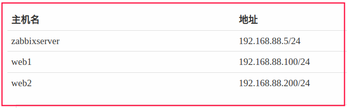

> [zabbix官网](https://www.zabbix.com/download?zabbix=6.0&os_distribution=rocky_linux&os_version=8&components=server_frontend_agent&db=mysql&ws=nginx)
>
> 1. 方式一：访问zabbix官网选择指定机器参照命令安装
>
> 2. 方式二：下载相关rpm包
>
>    thrift-0.13.0-2.el8.x86_64.rpm
>    zabbix-agent-6.0.11-release1.el8.x86_64.rpm
>    zabbix-get-6.0.12-release1.el8.x86_64.rpm
>    zabbix-nginx-conf-6.0.11-release1.el8.noarch.rpm
>    zabbix-selinux-policy-6.0.11-release1.el8.x86_64.rpm
>    zabbix-server-mysql-6.0.11-release1.el8.x86_64.rpm
>    zabbix-sql-scripts-6.0.11-release1.el8.noarch.rpm
>    zabbix-web-6.0.11-release1.el8.noarch.rpm
>    zabbix-web-deps-6.0.11-release1.el8.noarch.rpm
>    zabbix-web-mysql-6.0.11-release1.el8.noarch.rpm

```shell
# 已经下载rpm包，上传到var/ftp/rpms中，使用网络yum，使用ansible作用到每个节点
[root@pubserver ~]#mkdir zabbix # 创建工作目录
[root@pubserver zabbix]#touch ansible.cfg inventory # 编写主配置及清单
# 1.更改主机名.yml
[root@pubserver zabbix]# ansible all -a "hostnamectl set-hostname {{inventory_hostname}}" # 使用清单主机变量更新所有主机名
ansible.cfg
[defaults]
inventory = inventory
host_key_checking = false
nocows = 1
roles_path = roles
# 2.安装软件剧本
[root@pubserver zabbix]#vim 02_install_pkg.yml
--      
- name: install zabbix
  hosts: zabbixs
  tasks: 
    - name: install zabbix
      yum:
        name:
          - zabbix-server-mysql
          - zabbix-web-mysql
          - zabbix-nginx-conf
          - zabbix-sql-scripts
          - zabbix-selinux-policy
          - zabbix-agent
          - mysql-server
          - langpacks-zh_CN
        state: present
# 3.编写角色进行服务启动
[root@pubserver zabbix]#mkdir -p roles/start_svc
[root@pubserver zabbix]#mkdir roles/start_svc/{tasks,defaults}
[root@pubserver zabbix]#vim 03_start_service.yml # 启动mysqld
```

### 数据库配置

```shell
[root@zabbix ~]# mysql # 进入数据库
mysql> create database zabbix character set utf8mb4 collate utf8mb4_bin; # 创建数据库
mysql> set global log_bin_trust_function_creators = 1; # 在binlog日志开启的情况下，打开函数生成器
mysql> create user zabbix@localhost identified by 'zabbix'; # 创建用户
mysql> grant all privileges on zabbix.* to zabbix@localhost; # 给用户授权数据库及表
mysql>quit
[root@zabbix ~]#mysql -uzabbix -pzabbix -hlocalhost zabbix
mysql>
# 导入sql
[root@zabbix ~]#cp /usr/share/zabbix-sql-scripts/mysql/server.sql.gz . 
[root@zabbix ~]#gzip -d server.sql.gz # 解压缩
[root@zabbix ~]#mysql -uzabbix -pzabbix < server.sql #导入到zabbix数据库
```

### zabbix配置

```shell
# 修改服务配置文件
[root@zabbix ~]#vim /etc/zabbix/zabbix_server.conf  # 数据采集存储数据库
129 DBPassword=zabbix
# 修改客户端配置
[root@zabbix ~]#vim /etc/zabbix/zabbix_agentd.conf # 数据存储
117 Server=127.0.0.1  # 授权那个服务端来查询
182 Hostname=zabbix  # 修改为本机主机名
```

### nginx配置

```shell
# 配置nginx展示zabbix
[root@zabbixserver ~]# vim /etc/nginx/conf.d/zabbix.conf  
# 打开第2、3行的注释，结果如下所示：
server {
        listen          8080;
        server_name     example.com;
...以下省略...
```

### 启动服务

```shell
[root@pubserver zabbix]#vim 04_start_service.yml
---
- name: config zabbix
  hosts: zabbix
  tasks:
    - name: start service    # 循环启动多个服务
      service:
        name: "{{item}}"
        state: started
        enabled: yes
      loop:
        - zabbix-server
        - zabbix-agent
        - nginx
        - php-fpm
```

### 页面访问配置

> 浏览器访问：192.168.88.5:8080
>
> 进行相关配置
>
> zabbix登陆账密：Admin zabbix

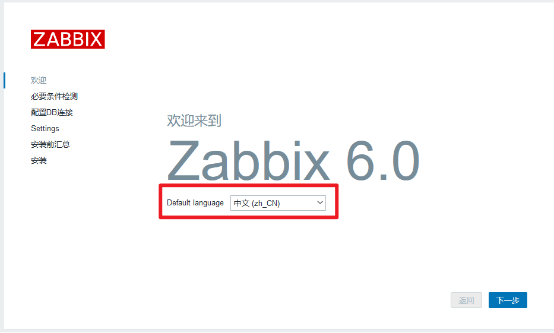

## 配置监控web1服务器

> - 主机：安装了agent，被监控的主机
> - 主机组：根据需求，将多台主机加入到一个主机组中，方便管理。系统默认已经创建了一些主机组。
> - 模板：是监控项的集合。将模板应用到主机，主机就可以直接拥有模板中的所有监控项。系统中默认已经创建了一些模板。

### 安装Agent

> 监控web1服务器：被控端

```shell
[root@pubserver zabbix]#vim 05_install_agent.yml
---      
- name:  
  hosts: webservers
  tasks: 
    - name: yum install
      yum:
        name: zabbix-agent
        state: present
```

### 修改配置

```sh
vim /etc/zabbix/zabbix_agentd.conf
117 Server=127.0.0.1,192.168.88.5 # 添加允许访问客户端
182 Hostname=web1
```

### 启动服务

```shell
[root@pubserver zabbix]#vim 06_start_web1_agent.yml
---
- name: start
  hosts: web1
  tasks: 
    - name: service
    	service:
    		name: zabbix-agent
    		state: started
    		enabled: yes
```

### zabbix配置主机

> 图形化添加配置

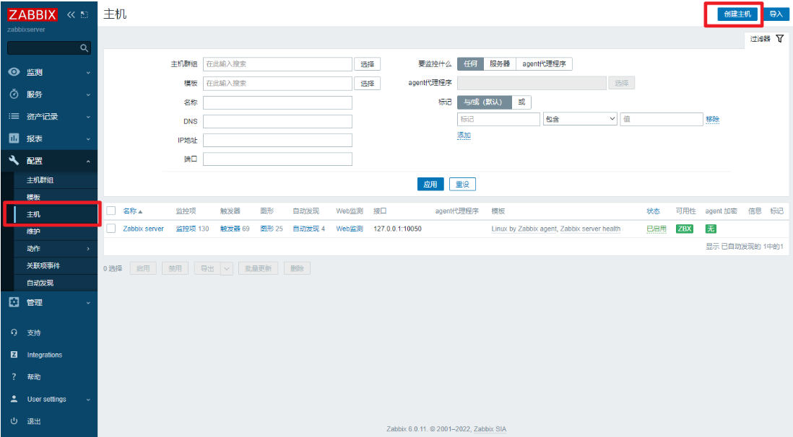

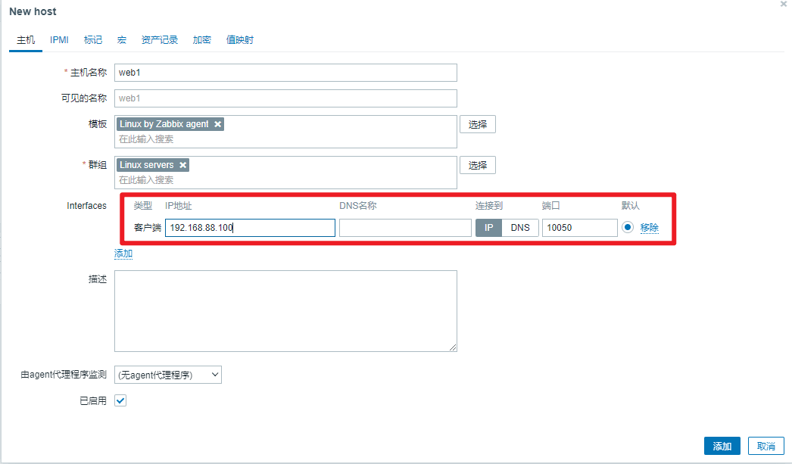

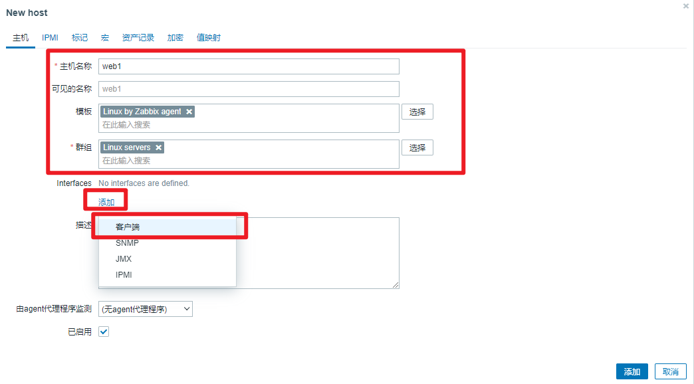

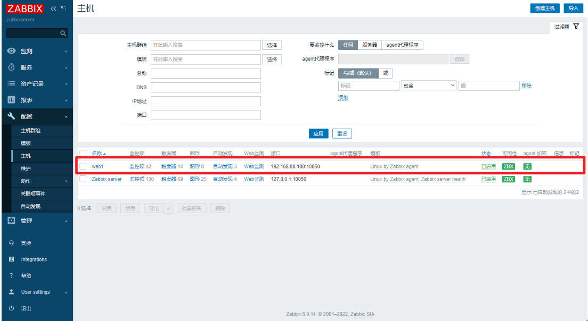

### 添加主机常见报错

```sh
# 鼠标放置zbx上，红色代表失败，绿色代表成功
# 1.cannot connect to [[192.168.88.100]:10050]: [111] Connection refused
[root@web1 ~]# ss -ntulp|grep :10050  # 服务未启动
[root@web1 ~]# systemctl start zabbix-agent
# 2. Assuming that agent dropped connection because of access permissions.
[root@web1 ~]# vim +117 /etc/zabbix/zabbix_agent.conf # 未添加允许访问客户端或写错
117 Server=127.0.0.1,192.168.88.5
[root@web1 ~]# systemctl restart zabbix-agent
```

### 常用监控指标

> - Space utilization：以百分比显示的磁盘利用率
> - Used space：已用磁盘空间
> - Available memory：可用内存
> - CPU idle time：CPU空闲时间。不宜过低。
> - Load average (1m avg)、Load average (5m avg)、Load average (15m avg)：CPU1分钟、5分钟、15分钟的平均负载。这个值不应长期大于核心数。
> - Interface eth0: Bits received：网卡接收到的数据量
> - Interface eth0: Bits sent：网卡发送的数据量
> - Number of processes：系统运行的进程数
> - Number of logged in users：已登陆的用户数

## 自定义监控项

> 1. 在被控端创建key。被控端被监控的内容叫作key，可以理解为它就是一个变量名，具体的名字自己决定。
> 2. 在web页面中创建监控项。监控项对应key值。

### 被控端创建key

```sh
# 创建语法
UserParameter=自定义key值,命令
# 命令的执行结果，是key的value
```

### 创建自定义配置文件

```sh
[root@web1 ~]# vim /etc/zabbix/zabbix_agentd.d/usercnt.conf
UserParameter=usercnt,sed -n '$=' /etc/passwd
[root@web1 ~]# systemctl restart zabbix-agent.service 
```

### 验证自定义监控项

```sh
# 1. 安装zabbix-get
[root@zabbix ~]# yum install -y zabbix-get
[root@web1 ~]# yum install -y zabbix-get

# 2. 获取监控项的值
[root@web1 ~]# zabbix_get -s 127.0.0.1 -k usercnt
46
[root@zabbixserver ~]# zabbix_get -s 192.168.88.100 -k usercnt
46

```

### 创建模板

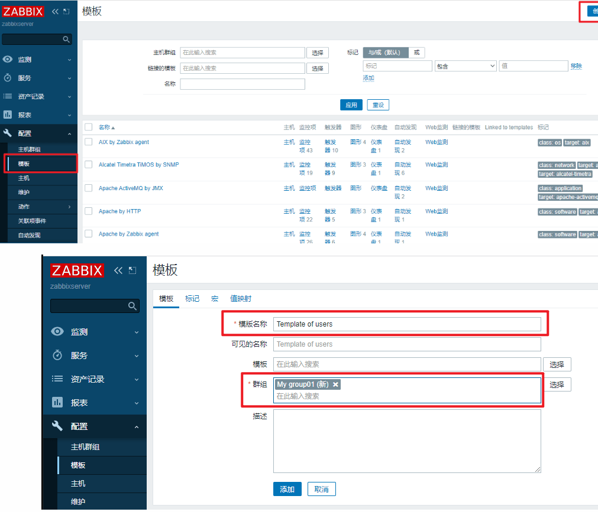


### 创建监控项

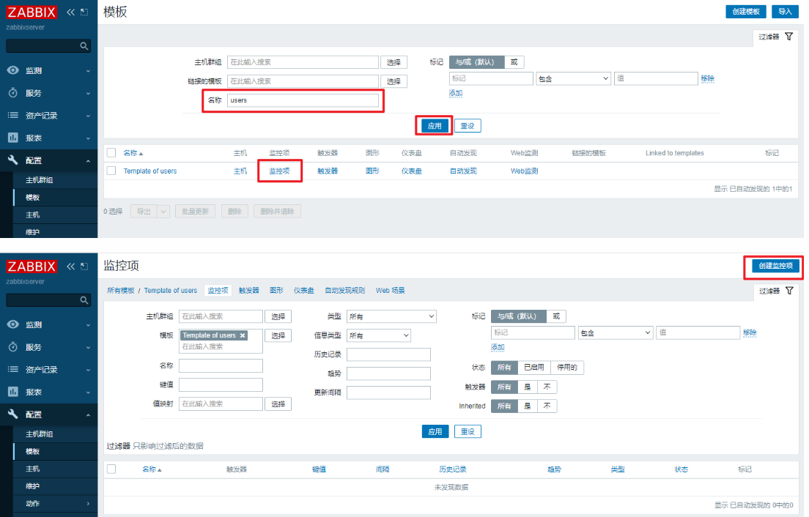

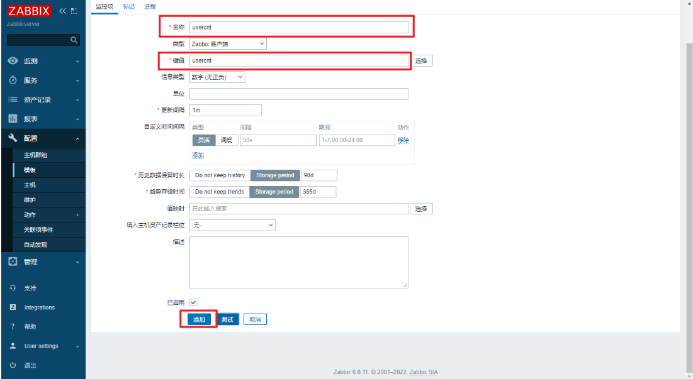

### 应用模板到主机

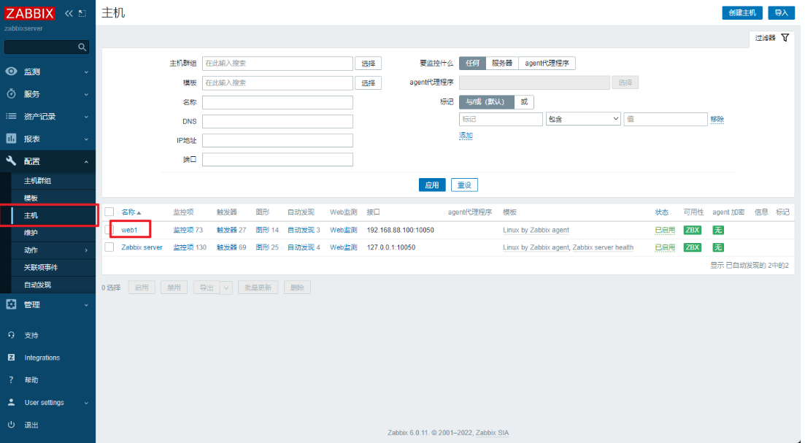

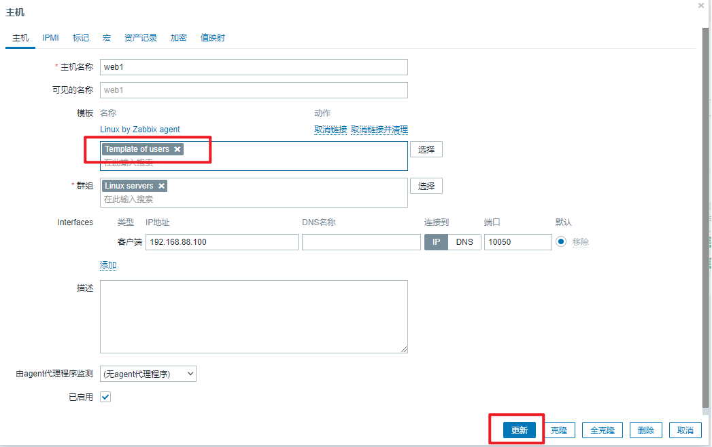

### 查看结果

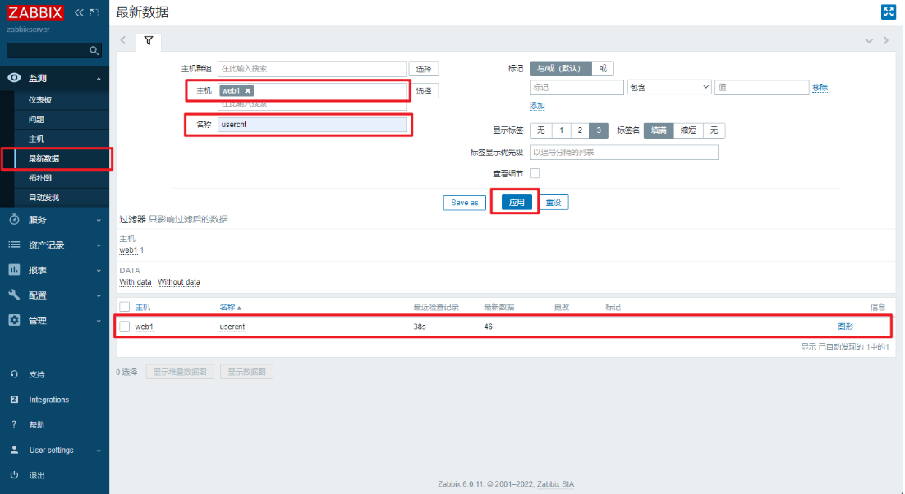

# 快捷键


# 问题


# 补充

## 引用配置文件

```sh
include	xxx/xxx/xx.d/*.conf
# 作用：一些重复配置，避免文章冗余，可以把配置写作外面，通过include调用
```


# 今日总结


# 昨日复习