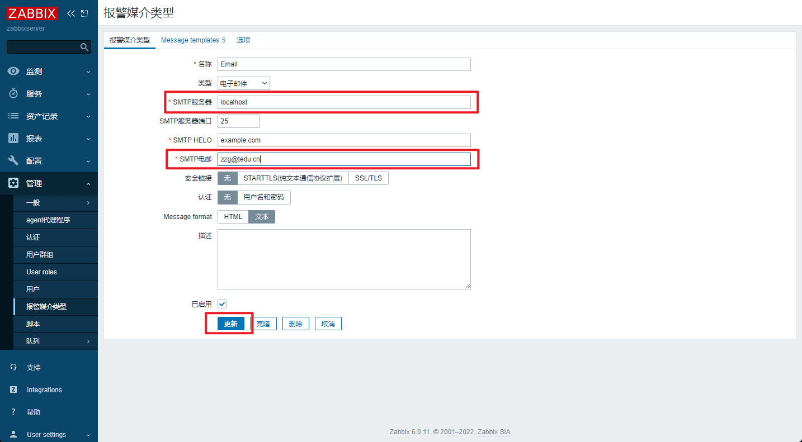
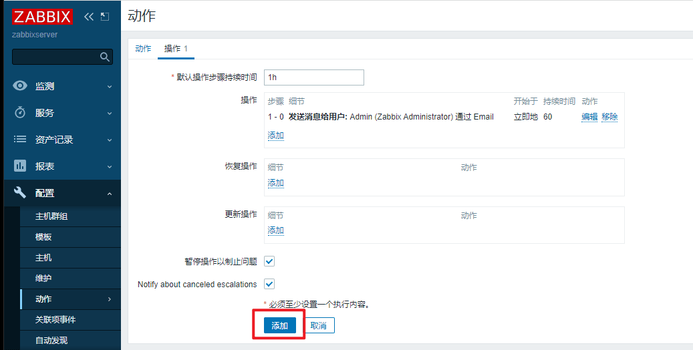
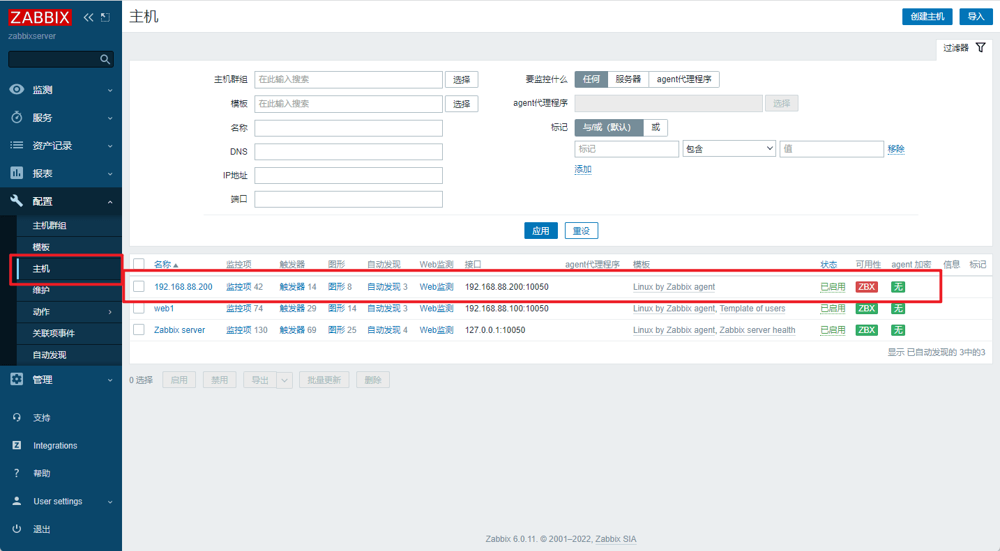
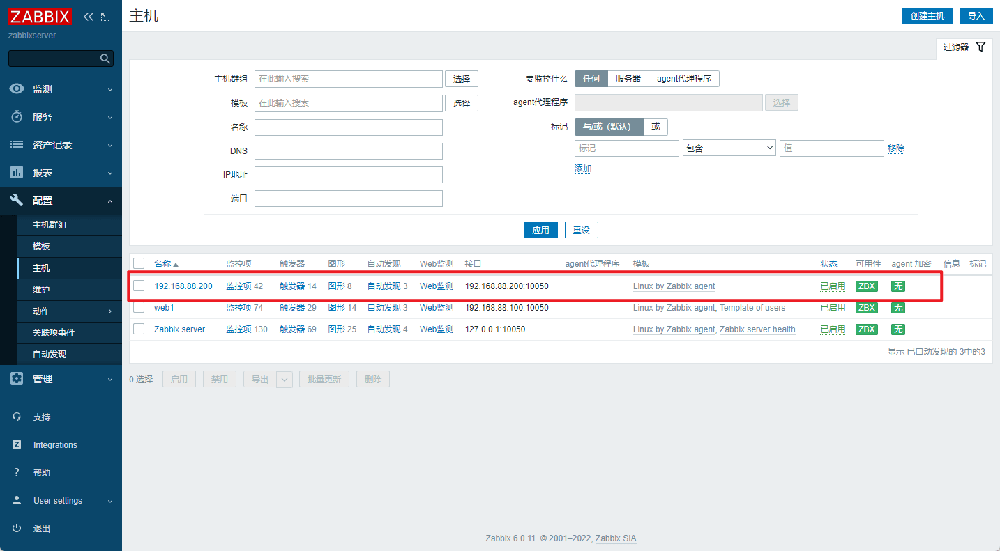
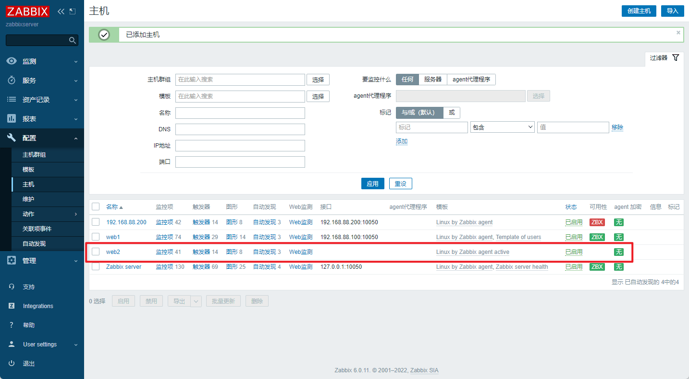

- [学习目标](#学习目标)
- [课堂笔记（命令）](#课堂笔记命令)
- [课堂笔记（文本）](#课堂笔记文本)
  - [配置告警](#配置告警)
    - [测试发送告警](#测试发送告警)
    - [创建触发器](#创建触发器)
    - [创建邮件类型的报警媒介](#创建邮件类型的报警媒介)
    - [用户关联邮箱](#用户关联邮箱)
    - [创建动作](#创建动作)
    - [验证告警配置](#验证告警配置)
    - [查看zabbix页面](#查看zabbix页面)
    - [查看邮件](#查看邮件)
  - [钉钉机器人告警](#钉钉机器人告警)
    - [获取机器人API](#获取机器人api)
    - [python脚本](#python脚本)
  - [配置自动发现](#配置自动发现)
    - [创建自动发现规则](#创建自动发现规则)
    - [创建发现动作](#创建发现动作)
    - [添加结果如下](#添加结果如下)
    - [验证](#验证)
    - [配置agent](#配置agent)
  - [配置主动监控](#配置主动监控)
    - [修改配置文件](#修改配置文件)
    - [创建主动监控主机](#创建主动监控主机)
  - [使用拓扑图配置监控](#使用拓扑图配置监控)
    - [链接两台设备](#链接两台设备)
    - [添加web服务器](#添加web服务器)
    - [添加链接](#添加链接)
  - [监控nginx](#监控nginx)
    - [配置nginx](#配置nginx)
    - [获取数据](#获取数据)
    - [zabbix创建key](#zabbix创建key)
    - [页面配置nginx项](#页面配置nginx项)
      - [创建监控项](#创建监控项)
- [快捷键](#快捷键)
- [问题](#问题)
- [补充](#补充)
- [今日总结](#今日总结)
- [昨日复习](#昨日复习)


# 学习目标

Zabbix报警机制

Zabbix进阶操作

监控案例

# 课堂笔记（命令）


# 课堂笔记（文本）

## 配置告警

> - 默认情况下，监控项不会自动发送告警消息
> - 需要配置触发器与告警，并且通过通知方式发送信息给联系人
> - 触发器：设置条件，当条件达到时，将会执行某个动作
> - 动作：触发器条件达到之后要采取的行为，比如发邮件或执行命令

### 测试发送告警

> - 当web1的用户数超过50时，认为这是一个问题(Problem)
> - 当出现问题时，将会执行动作。
> - 执行的动作是给管理员发邮件。
> - 给管理员发邮件，还要配置邮件服务器的地址，以及管理员的email地址

### 创建触发器


上图中点击"添加":


> 监控项：被监控的内容
>
> 功能：根据被监控内容，选择相关规则
>
> 最后一个：最新值
>
> 间隔：每隔多久获取一次值
>
> 结果：获取的值进行判定规则

**点击插入：**


### 创建邮件类型的报警媒介


> 选择邮件发送的媒介类型



> SMTP服务器：指定smtp服务器地址
>
> SMTP服务器端口：
>
> SMTP HELLO：SMTP HELO是指在SMTP协议中，当客户端与服务器连接并开始进行邮件传输时，客户端会向服务器发送一个HELO或EHLO命令，以表示自己的身份和所支持的协议等信息。其中，HELO命令后面需要跟着客户端的域名或IP地址，以便服务器知道这个请求来自哪里。
>
> SMTP电邮：发件人
>
> 安全链接：邮件是否加密
>
> 认证：访问邮件需要输入的账密


> 用于添加报警模板

### 用户关联邮箱


> root@localhost.localdomain
>
> 设置本机为收件人：cat /etc/hosts


### 创建动作


**回到“创建动作”页面后，点击操作**


> 步骤：操作中的执行顺序
>
> 步骤持续时间：这表示当执行此操作时，消息的可见性持续时间为60秒。换句话说，接收者将在其设备上看到消息并提醒他们的时间将持续60秒。如果不设置步骤持续时间，系统会使用默认值。
>
> send to users：以什么发送



### 验证告警配置

```sh
# 配置postfix邮件服务和mailx邮件客户端
[root@pubserver zabbix]# vim 07-config-mail.yml
---
- name: config mail
  hosts: zabbix
  tasks:
    - name: install mail     # 安装postfix和mailx
      yum:
        name: postfix,mailx
        state: present
        
    - name: start postfix    # 启动邮件服务postfix
      service:
        name: postfix
        state: started
        enabled: yes
[root@pubserver zabbix]# ansible-playbook 07-config-mail.yml
```

**web1创建用户，超过50**

```sh
[root@web1 ~]# for user in user{1..5}
> do
> useradd $user
> done
```

### 查看zabbix页面


### 查看邮件

```sh
[root@zabbixserver ~]# mail   # 查看邮件
Heirloom Mail version 12.5 7/5/10.  Type ? for help.
"/var/spool/mail/root": 15 messages 10 new 14 unread
 U  1 zabbix@example.com    Fri Dec 29 10:27  22/1000  
    2 zabbix@example.com    Fri Dec 29 10:28  22/1001  
 U  3 zabbix@example.com    Fri Dec 29 10:29  22/1000  
 U  4 zabbix@example.com    Fri Dec 29 10:30  22/1000  
 U  5 zabbix@example.com    Fri Dec 29 10:31  22/1000  
>N  6 zabbix@example.com    Fri Dec 29 10:32  21/990   
& 1
Message  1:
From zabbix@example.com  Fri Dec 29 10:27:01 2023
Return-Path: <zabbix@example.com>
X-Original-To: root@localhost.localdomain
Delivered-To: root@localhost.localdomain
From: <zabbix@example.com>
To: <root@localhost.localdomain>
Date: Fri, 29 Dec 2023 10:27:01 +0800
Subject: 服务器故障: 用户数量超过30
Content-Type: text/plain; charset="UTF-8"
Status: RO

时间：2023.12.29 on 10:25:57
问题名: 用户数量超过30
主机: Zabbix server
严重程度: Warning
Operational data: 37
Original problem ID: 70
```

## 钉钉机器人告警

### 获取机器人API

> [钉钉开放平台](https://open.dingtalk.com/document/ability/map)
>
> 1. 注册钉钉创建一个企业（通讯录-创建企业）
> 2. 访问钉钉开放平台-选则创建的组织
> 3. 访问应用开发
> 4. 创建一个机器人应用
> 5. 添加机器人
> 6. 点击机器人配置
> 7. 发布
> 8. 进入钉钉聊天群聊，点击右上角设置，添加机器人
> 9. 复制webhook

### python脚本

```python
# 安装钉钉机器人脚本需要用到的模块
[root@zabbixserver ~]# yum install -y python3-requests

# 编写钉钉机器人脚本
[root@zabbixserver ~]# vim /usr/lib/zabbix/alertscripts/dingalert.py 
#!/usr/bin/env python3

import json
import requests
import sys

def send_msg(url, remiders, msg):
    headers = {'Content-Type': 'application/json; charset=utf-8'}
    data = {
        "msgtype": "text",
        "at": {
            "atMobiles": remiders,
            "isAtAll": False,
        },
        "text": {
            "content": msg,
        }
    }
    r = requests.post(url, data=json.dumps(data), headers=headers)
    return r.text

if __name__ == '__main__':
    msg = sys.argv[1]
    remiders = []
    url = '钉钉机器人Webhook地址'  # 注意此处需输入机器人的webhook地址
    print(send_msg(url, remiders, msg))
    
[root@zabbixserver ~]# chmod +x /usr/lib/zabbix/alertscripts/dingalert.py

[root@zabbixserver ~]# /usr/lib/zabbix/alertscripts/dingalert.py 'warn: 测试消息'    # 注意消息中要包含关键字warn
{"errcode":0,"errmsg":"ok"}
```

## 配置自动发现

> - 当被监控的设备非常多的时候，手工添加将会变得非常不方便
> - 可以使用自动发现功能，实现添加主机、添加到主机组、 链接模板
> - 自动发现流程：
>   - 创建自动发现规则
>   - 创建动作，当主机被发现之后，执行什么操作
>   - 通过动作，添加主机，将模板应用到发现的主机

### 创建自动发现规则


### 创建发现动作


### 添加结果如下


### 验证



### 配置agent

```sh
# web2 配置agent
[root@web2 ~]# vim /etc/zabbix/zabbix_agentd.conf 
117 Server=127.0.0.1,192.168.88.5
182 Hostname=web2
[root@web2 ~]# systemctl enable zabbix-agent.service --now
```



## 配置主动监控

### 修改配置文件

```sh
[root@web2 ~]# vim /etc/zabbix/zabbix_agentd.conf
117 # Server=127.0.0.1,192.168.88.5  # 拒绝被动监控
142 StartAgents=0 # 拒绝开发tcp端口
171 ServerActive=192.168.88.5 # 指定监控服务端地址
242 RefreshActiveChecks=120 # 每隔120s主动提交数据

# 重启服务
[root@web2 ~]# systemctl restart zabbix-agent.service 
[root@web2 ~]# ss -tlnp | grep :10050  # 端口号消失
```

> Server：指定了服务器后，则是被动监控，被指定服务器监控；注释后变为主动监控，主动向ServerActive服务器发送信息，(sa)服务器收到请求后开始向此服务器开始采集数据
>
>  ServerActive：指定监控服务端地址
>
> RefreshActiveChecks：单位秒，每隔多久提交一次数据

### 创建主动监控主机





## 使用拓扑图配置监控

> 使用拓扑图，反映拓扑结构


### 链接两台设备


### 添加web服务器


### 添加链接


## 监控nginx

> stub_status模块
>
> - 用于实时监控nginx的网络连接，这个模块是nginx官方提供的一个模块。

### 配置nginx

```sh
[root@pubserver zabbix]# vim 08-config-nginx.yml
---
- name: config nginx
  hosts: webservers
  tasks:
    - name: install nginx   # 安装nginx
      yum:
        name: nginx
        state: present

    - name: start nginx     # 启动nginx
      service:
        name: nginx
        state: started
        enabled: yes
[root@pubserver zabbix]# ansible-playbook 08-config-nginx.yml 

# 修改配置文件，启用stub_status功能
[root@web1 ~]# vim /etc/nginx/nginx.conf
...略...
 47         location / {
 48         }
 49 
 50         location /status {   # 在此处添加3行
 51             stub_status on;
 52         }   
 53         
 54         error_page 404 /404.html;
 55             location = /40x.html {
 56         }
 ...略...
[root@web1 ~]# systemctl restart nginx
 
# 访问监控页面
[root@zabbixserver ~]# curl http://192.168.88.100/status
Active connections: 1 
server accepts handled requests
 2 2 2 
Reading: 0 Writing: 1 Waiting: 0 
# Active connections：当前客户端与nginx之间的连接数。它等于下面Reading / Writing / Waiting之和
# accepts：自nginx启动之后，客户端访问的总量
# handled：自nginx启动之后，处理过的客户端连接总数，通常等于accepts的值。
# requests：自nginx启动之后，处理过的客户端请求总数。
# Reading：正在读取客户端的连接总数。
# Writing：正在向客户端发送响应的连接总数。
# Waiting：空闲连接。

# 使用工具向服务器发起多个请求
[root@zabbixserver ~]# yum install -y httpd-tools
# 一共发1000个请求，每次并发数200
[root@zabbixserver ~]# ab -n1000 -c200 http://192.168.88.100/
[root@zabbixserver ~]# curl http://192.168.88.100/status
Active connections: 1 
server accepts handled requests
 1097 1097 1003 
Reading: 0 Writing: 1 Waiting: 0 
```

### 获取数据

```sh
# 根据stub_status获取的信息使用awk获取对应信息
[root@web1 ~]# vim /usr/local/bin/nginx_status.sh
#!/bin/bash

case $1 in
active)
    curl -s http://192.168.88.100/status | awk '/Active/{print $NF}';;
waiting)
    curl -s http://192.168.88.100/status | awk '/Waiting/{print $NF}';;
accepts)
    curl -s http://192.168.88.100/status | awk 'NR==3{print $1}';;
esac

[root@web1 ~]# chmod +x /usr/local/bin/nginx_status.sh
[root@web1 ~]# nginx_status.sh active
1
[root@web1 ~]# nginx_status.sh accepts
1099
[root@web1 ~]# nginx_status.sh waiting
0
```

### zabbix创建key

```sh
# key的语法格式
UserParameter=key[*],<command> $1
# key[*]中的*是参数，将会传给后面的位置变量$1

# 创建声明key的文件
[root@web1 ~]# vim /etc/zabbix/zabbix_agentd.d/nginx_status.conf
UserParameter=nginx_status[*],/usr/local/bin/nginx_status.sh $1

# 测试
[root@web1 ~]# systemctl restart zabbix-agent.service 
[root@web1 ~]# zabbix_get -s 127.0.0.1 -k nginx_status[active]
1
[root@web1 ~]# zabbix_get -s 127.0.0.1 -k nginx_status[waiting]
0
[root@web1 ~]# zabbix_get -s 127.0.0.1 -k nginx_status[accepts]
1103
```

### 页面配置nginx项

#### 创建监控项


# 快捷键


# 问题


# 补充


# 今日总结


# 昨日复习