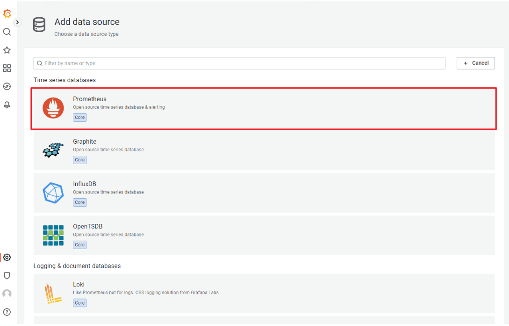
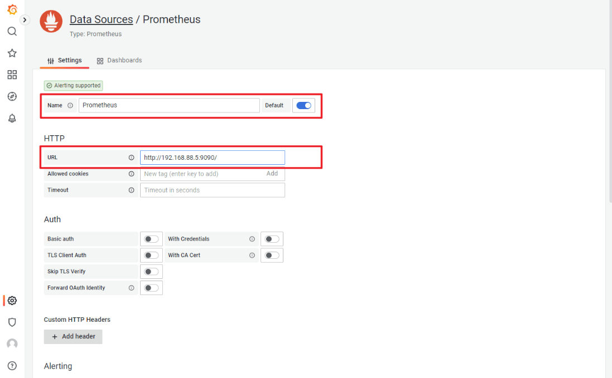
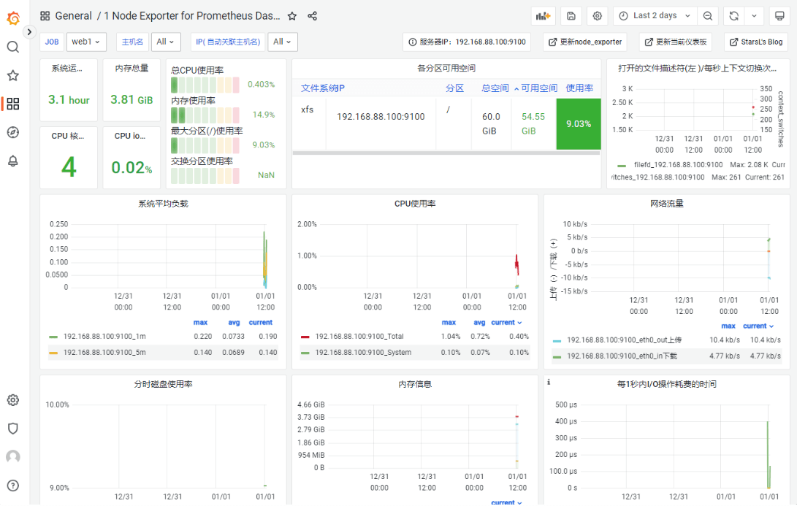
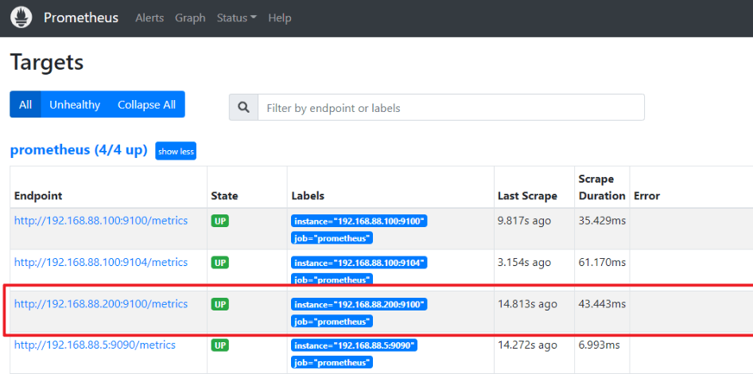
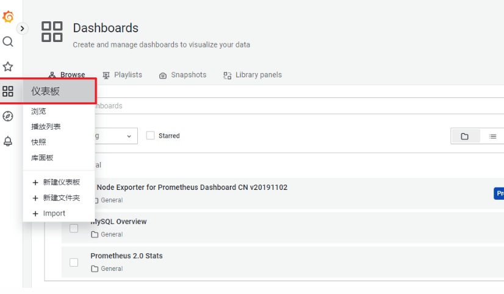
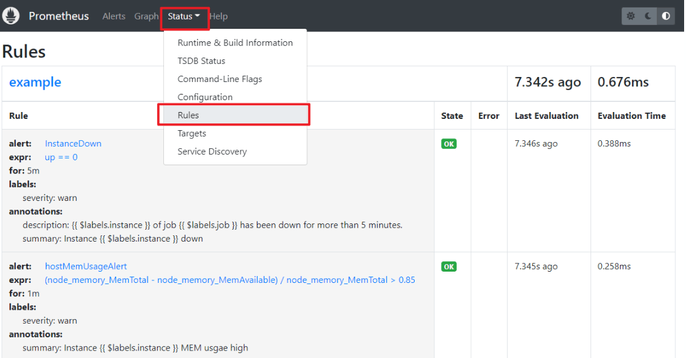

- ​	学习目标](#学习目标)
- [课堂笔记（命令）](#课堂笔记命令)
- [课堂笔记（文本）](#课堂笔记文本)
  - [安装prometheus](#安装prometheus)
    - [概述](#概述)
    - [环境准备](#环境准备)
    - [添加为service](#添加为service)
    - [服务启动](#服务启动)
  - [添加被监控端-nodeExporter](#添加被监控端-nodeexporter)
    - [exporter组件下载](#exporter组件下载)
    - [部署通用监控exporter](#部署通用监控exporter)
    - [修改配置文件](#修改配置文件)
    - [prometheus添加被控端](#prometheus添加被控端)
  - [安装Grafana](#安装grafana)
    - [概述](#概述-1)
    - [安装部署](#安装部署)
    - [页面配置修改](#页面配置修改)
      - [修改为中文](#修改为中文)
      - [对接prometheus](#对接prometheus)
      - [添加仪表盘](#添加仪表盘)
      - [查看仪表盘](#查看仪表盘)
      - [导入主机监控模板](#导入主机监控模板)
  - [配置监控数据库](#配置监控数据库)
    - [配置mysql](#配置mysql)
    - [配置mysql exporter](#配置mysql-exporter)
    - [配置pro监控mysql](#配置pro监控mysql)
    - [pro页面查看状态](#pro页面查看状态)
  - [自动发现机制](#自动发现机制)
    - [概述](#概述-2)
    - [基于文件自动发现](#基于文件自动发现)
    - [修改配置文件](#修改配置文件-1)
    - [创建自动发现规则文件](#创建自动发现规则文件)
    - [配置web2接受Pro监控](#配置web2接受pro监控)
    - [Grafana查看结果](#grafana查看结果)
  - [Alertmanager](#alertmanager)
    - [概述](#概述-3)
    - [部署](#部署)
    - [配置文件](#配置文件)
    - [Pro与Alert对接](#pro与alert对接)
    - [配置Alert通过邮件发送告警](#配置alert通过邮件发送告警)
    - [pro查看规则文件](#pro查看规则文件)
    - [测试告警](#测试告警)
- [快捷键](#快捷键)
- [问题](#问题)
  - [描述一下Prometheus的监控架构](#描述一下prometheus的监控架构)
  - [Prometheus有哪些常用的exporter？](#prometheus有哪些常用的exporter)
  - [Prometheus为什么会用到Grafana？](#prometheus为什么会用到grafana)
  - [Prometheus有哪些自动发现的方式？](#prometheus有哪些自动发现的方式)
  - [通过Alertmanager配置告警和通知的主要步骤有哪些？](#通过alertmanager配置告警和通知的主要步骤有哪些)
- [补充](#补充)
  - [Prometheus-Exporter下载](#prometheus-exporter下载)
  - [Grafana-模板下载](#grafana-模板下载)
- [今日总结](#今日总结)
- [昨日复习](#昨日复习)


# 学习目标

Prometheus监控服务器

Prometheus被监控端

Grafana监控可视化

自动发现和告警

# 课堂笔记（命令）


# 课堂笔记（文本）

## 安装prometheus

### 概述

> - Prometheus是一个开源系统监控和警报工具包，最初由 SoundCloud构建。
> - 也是一款监控软件，也是一个时序数据库。Prometheus 将其指标收集并存储为时间序列数据，即指标信息与记录时的时间戳以及称为标签的可选键值对一起存储。
> - 主要用在容器监控方面，也可以用于常规的主机监控。
> - 使用google公司开发的go语言编写。
> - Prometheus是一个框架，可以与其他组件完美结合


### 环境准备

**服务器**

> Prometheus：192.168.88.5
>
> web1：192.168.88.100

**时间配置**

```sh
# 1. 查看时区
[root@prometheus ~]# timedatectl 
               Local time: Sun 2023-01-01 11:15:11 CST
           Universal time: Sun 2023-01-01 03:15:11 UTC
                 RTC time: Sun 2023-01-01 03:15:11
                Time zone: Asia/Shanghai (CST, +0800)
System clock synchronized: no
              NTP service: inactive
          RTC in local TZ: no

# 2. 如果时区不正确，则改为正确的时区
[root@prometheus ~]# timedatectl set-timezone Asia/Shanghai

# 3. 查看时间
[root@prometheus ~]# date

# 4. 如果时间不正确，则改为正确的时间
[root@prometheus ~]# date -s "年月日 时:分:秒"
```

**解压缩Prometheus**

```sh
[root@prometheus prometheus_soft]# tar xf prometheus-2.37.5.linux-amd64.tar.gz 
# 接压缩及部署完成
[root@prometheus prometheus_soft]# mv prometheus-2.37.5.linux-amd64 /usr/local/prometheus # 通常将软件安装再/usr/local下
```

### 添加为service

```sh
# 由于prometheus为GO语言编写，所以该压缩包解压就可以用，为了方便sys启动，所以编写一个service
# 编写配置文件使其可以用systemctl进行启动
[root@prometheus prometheus_soft]#vim /usr/lib/systemd/system/prometheus.service
[Unit]
Description=Prometheus Monitoring System
After=network.target

[Service]
ExecStart=/usr/local/prometheus/prometheus \
  --config.file=/usr/local/prometheus/prometheus.yml \
  --storage.tsdb.path=/usr/local/prometheus/data/

[Install]
WantedBy=multi-user.target
[root@prometheus ~]#systemctl daemon-reload # 重载配置文件；
```

### 服务启动

```sh
[root@prometheus ~]#systemctl enable prometheus --now 
[root@web1 ~]#ss -ntulp | grep :9090
# 浏览器访问192.168.88.5:9090
```

## 添加被监控端-nodeExporter

### exporter组件下载

> [Prometheus组件官网](https://prometheus.io/docs/instrumenting/exporters/)

### 部署通用监控exporter

> - node-exporter用于监控硬件和系统的常用指标
> - exporter运行于被监控端，以服务的形式存在。每个exporter所使用的端口号都不一样。
> - 用于收集和暴露关于计算机硬件和操作系统的指标数据。它可以在被监控的主机上运行，并提供了一系列的监控指标，包括CPU使用率、内存使用率、磁盘使用率、网络流量、系统负载等。

```sh
# 解压缩文件
[root@web1 ~]# tar xf node_exporter-1.5.0.linux-amd64.tar.gz 
[root@web1 ~]# mv node_exporter-1.5.0.linux-amd64 /usr/local/node_exporter
# 编写service服务文件
[root@web1 ~]# vim /usr/lib/systemd/system/node_exporter.service
[Unit]
Description=node_exporter
After=network.target

[Service]
Type=simple
ExecStart=/usr/local/node_exporter/node_exporter

[Install]
WantedBy=multi-user.target
# 启动exporter
[root@web1 ~]#systemctl daemon-reload
[root@web1 ~]#systemctl enalbe node_exporter --now
[root@web1 ~]#ss -ntulp | grep :9100
```

### 修改配置文件

```sh
[root@prometheus prometheus]#vim /usr/local/promethues/promethues.yml # 再最后添加内容
 28     static_configs:
 29       - targets: ["localhost:9090"]
 30   - job_name: "web-hw"
 31     static_configs:
 32       - targets: ["192.168.88.100:9100"]
 
 # 重启服务
 [root@prometheus prometheus]#systemctl restart promethues
```

### prometheus添加被控端

```sh
# 安装node_exporter
[root@prometheus ~]#tar xf node_exporter-1.5.0.linux-amd64.tar.gz
[root@prometheus ~]#mv node_exporter-1.5.0.linux-amd64 /usr/local/node_exporter
# 编写服务文件;拷贝100的expoter到prometheus
[root@web1 ~]#scp /usr/lib/systemd/system/node_exporter.service 192.168.88.5:/usr/lib/systemd/system/

[root@prometheus ~]#systemctl daemon-reload # 加载配置文件
[root@prometheus ~]#systemctl enable node_exporter --now
[root@prometheus ~]#ss -ntulp|grep :9100
[root@prometheus ~]#vim /usr/local/prometheus/prometheus.yml
 33   - job_name: "promethues-hw"
 34     static_configs:
 35       - targets: ["192.168.88.5:9100"]
 [root@prometheus ~]#systemctl restart prometheus
 # 页面访问 http://192.168.88.5:9090
```

## 安装Grafana

### 概述

> - Grafana是一款开源的、跨平台的、基于web的可视化工具
> - 展示方式：客户端图表、面板插件
> - 数据源可以来自于各种源，如prometheus

### 安装部署

```sh
# 需要提前下载grafana-enterprise-9.3.2-1.x86_64.rpm包
[root@prometheus ~]# yum install -y grafana-enterprise-9.3.2-1.x86_64.rpm
[root@prometheus ~]# systemctl enable grafana-server.service --now
# 浏览器访问：http://192.168.88.5:3000
# 初始账密：admin admin
```

### 页面配置修改

#### 修改为中文


#### 对接prometheus







#### 添加仪表盘


#### 查看仪表盘


#### 导入主机监控模板

> grafana模板下载：https://grafana.com/grafana/dashboards/
>
> 使用方式：
>
> + 在线：复制模板ID，导入输入ID，点击Load
> + 下载json文件，导入json文件




## 配置监控数据库

### 配置mysql

```sh
[root@web1 ~]# yum install -y mysql-server
[root@web1 ~]# systemctl enable mysqld --now
[root@web1 ~]# mysql  # 创建用户dbuser1，给定所有权限
mysql> create user dbuser1@localhost identified by '123456';
mysql> grant all privileges on *.* to dbuser1@localhost;
mysql> quit
```

### 配置mysql exporter

```sh
# 1. 安装
[root@web1 ~]# tar xf mysqld_exporter-0.14.0.linux-amd64.tar.gz 
[root@web1 ~]# mv mysqld_exporter-0.14.0.linux-amd64 /usr/local/mysqld_exporter

# 2. 编写用于连接mysql服务的配置文件
[root@web1 ~]# vim /usr/local/mysqld_exporter/.my.cnf
[client]
host=127.0.0.1
port=3306
user=dbuser1
password=123456

# 3. 创建service文件
[root@web1 ~]# vim /usr/lib/systemd/system/mysqld_exporter.service

[root@web1 ~]# systemctl daemon-reload
[root@web1 ~]# systemctl enable mysqld_exporter.service --now
```

### 配置pro监控mysql

```sh
# 1. 在配置文件中追加内容
[root@prometheus ~]# vim /usr/local/prometheus/prometheus.yml 
...略...
  - job_name: "web1-mysql"
    static_configs:
      - targets: ["192.168.88.100:9104"]
      
# 2. 重启服务
[root@prometheus ~]# systemctl restart prometheus.service 
```

### pro页面查看状态


**再Grafanan中展示数据**


## 自动发现机制

### 概述

> - 自动发现是指Prometheus自动对节点进行监控，不需要手动一个一个去添加，和Zabbix的自动发现、自动注册一个道理
> - Prometheus有多种自动发现发现，比如`file_sd_configs`基于文件自动发现、基于K8S自动发现、基于openstack自动发现、基于consul自动发现等。

### 基于文件自动发现

> - `file_sd_configs`实现文件级别的自动发现
> - 使用文件自动发现功能后，Prometheus会定期检查配置文件是否有更新
> - 如果有更新的话就将新加入的节点接入监控，服务端无需重启服务

### 修改配置文件

```sh
# 备份配置文件
[root@prometheus ~]# cp /usr/local/prometheus/{prometheus.yml,prometheus.yml.bak} 
[root@prometheus ~]# vim /usr/local/prometheus/prometheus.yml # 删除21所有内容，添加如下内容
scrape_configs:
  - job_name: "prometheus"
    file_sd_configs:
      - refresh_interval: 120s
        files:
          - /usr/local/prometheus/sd_config/*.yml
[root@prometheus ~]#systemctl restart prometheus          
```

**pro中将没有任何监控项目**


### 创建自动发现规则文件

```sh
[root@prometheus ~]# mkdir /usr/local/prometheus/sd_config
[root@prometheus ~]# vim /usr/local/prometheus/sd_config/discovery.yml
- targets:
    - 192.168.88.5:9090
    - 192.168.88.100:9100
    - 192.168.88.100:9104
```

**等几分钟刷新页面**


### 配置web2接受Pro监控

```sh
# 将web1的node exporter拷贝到web2
[root@web1 ~]# scp -r /usr/local/node_exporter 192.168.88.200:/usr/local/
[root@web1 ~]# scp /usr/lib/systemd/system/node_exporter.service 192.168.88.200:/usr/lib/systemd/system/

# 启动服务
[root@web2 ~]# systemctl daemon-reload 
[root@web2 ~]# systemctl enable node_exporter.service --now
```

**修改自动发现文件**

```sh
[root@prometheus ~]# vim /usr/local/prometheus/sd_config/discovery.yml 
- targets:
    - 192.168.88.5:9090
    - 192.168.88.100:9100
    - 192.168.88.100:9104
    - 192.168.88.200:9100
```

**刷新页面**



### Grafana查看结果




## Alertmanager

### 概述

> - Prometheus服务器中的告警规则向Alertmanager发送告警。然后，Alertmanager管理这些告警，包括静默、抑制、分组以及通过电子邮件、即时消息系统和聊天平台等方法发出通知。

### 部署

```sh
# 1. 解压
[root@prometheus prometheus_soft]# tar xf alertmanager-0.25.0.linux-amd64.tar.gz 
[root@prometheus prometheus_soft]# mv alertmanager-0.25.0.linux-amd64 /usr/local/alertmanager

# 2. 编写服务文件并启动
[root@prometheus prometheus_soft]# vim /usr/lib/systemd/system/alertmanager.service
[Unit]
Description=alertmanager System

[Service]
ExecStart=/usr/local/alertmanager/alertmanager \
--config.file=/usr/local/alertmanager/alertmanager.yml

[Install]
WantedBy=multi-user.target

[root@prometheus ~]# systemctl daemon-reload 
[root@prometheus ~]# systemctl enable alertmanager.service --now

# 访问http://192.168.88.5:9093可以访问web配置页面
```

### 配置文件

> - Alertmanager的配置主要包含两个部分：路由(route)以及接收器(receivers)。所有的告警信息都会从配置中的顶级路由(route)进入路由树，根据路由规则将告警信息发送给相应的接收器。
> - 在Alertmanager中可以定义一组接收器，比如可以按照角色(比如系统运维，数据库管理员)来划分多个接收器。接收器可以关联邮件，Slack以及其它方式接收告警信息。
> - 目前配置文件中只设置了一个顶级路由route并且定义的接收器为default-receiver。因此，所有的告警都会发送给default-receiver。
> - 因此在Alertmanager配置中一般会包含以下几个主要部分：
>   - 全局配置（global）：用于定义一些全局的公共参数，如全局的SMTP配置
>   - 模板（templates）：用于定义告警通知时的模板，如HTML模板，邮件模板等
>   - 告警路由（route）：根据标签匹配，确定当前告警应该如何处理
>   - 接收器（receivers）：接收器是一个抽象的概念，它可以是一个邮箱也可以是微信，Slack或者Webhook 等，接收器一般配合告警路由使用
>   - 抑制规则（inhibit_rules）：合理设置抑制规则可以减少垃圾告警的产生

### Pro与Alert对接

```sh
[root@prometheus ~]# vim /usr/local/prometheus/prometheus.yml 
...略...
  8 alerting:
  9   alertmanagers:
 10     - static_configs:
 11         - targets:
 12           - localhost:9093  # 添加
 ...略...
 [root@prometheus ~]# systemctl restart prometheus.service 
 # 访问：http://192.168.88.5:9090/config，查看配置是否生效
```

### 配置Alert通过邮件发送告警

```sh
# 1. 备份配置文件
[root@prometheus ~]# cp /usr/local/alertmanager/alertmanager.yml ~

# 2. 修改配置文件
[root@prometheus ~]# vim /usr/local/alertmanager/alertmanager.yml 
global:
  smtp_from: 'zzg@tedu.cn'      # 发件人地址
  smtp_smarthost: 'localhost:25'   # 邮件服务器地址
  smtp_require_tls: false       # 是否使用TLS安全连接
route:
  group_by: ['alertname']
  group_wait: 30s
  group_interval: 5m
  repeat_interval: 1h
  receiver: 'default-receiver'  # 接收器
receivers:
  - name: 'default-receiver'    # 配置接收器为邮件
    email_configs:
      - to: 'root@localhost.localdomain'
inhibit_rules:
  - source_match:
      severity: 'critical'
    target_match:
      severity: 'warning'
    equal: ['alertname', 'dev', 'instance']
    
# 3. 定义告警规则
[root@prometheus ~]# mkdir /usr/local/prometheus/rules 
[root@prometheus ~]# vim /usr/local/prometheus/rules/hoststats-alert.rules # 编写规则
groups:
- name: example
  rules:

  - alert: InstanceDown
    expr: up == 0
    for: 5m 
    labels:
      severity: warn
    annotations:
      summary: "Instance {{ $labels.instance }} down"
      description: "{{ $labels.instance }} of job {{ $labels.job }} has been down for more than 5 minutes."

  - alert: hostMemUsageAlert
    expr: (node_memory_MemTotal - node_memory_MemAvailable)/node_memory_MemTotal > 0.85
    for: 1m 
    labels:
      severity: warn
    annotations:
      summary: "Instance {{ $labels.instance }} MEM usgae high"

# 4. 在Prometheus中声明规则文件位置
[root@prometheus ~]# vim /usr/local/prometheus/prometheus.yml 
...略...
 15 rule_files:
 16   - /usr/local/prometheus/rules/*.rules
...略...

# 5. 重启服务
[root@prometheus ~]# systemctl restart alertmanager.service 
[root@prometheus ~]# systemctl restart prometheus.service 

# 6. 安装并启动邮件服务
[root@prometheus ~]# yum install -y postfix mailx
[root@prometheus ~]# systemctl enable postfix --now
```

### pro查看规则文件



### 测试告警

```sh
# 1. 将web1关机
[root@web1 ~]# shutdown -h now

# 2. 查看邮件
[root@prometheus ~]# mail
Heirloom Mail version 12.5 7/5/10.  Type ? for help.
"/var/spool/mail/root": 1 message
>   1 admin@gogetacoke.com  Tue Jan  2 17:30 264/12927 "[FI"
& q
Held 1 message in /var/spool/mail/root
# 将告警邮件内容从【<!DOCTYPE ...】这一行到【</html>】复制，粘贴到一个文件中，如文件名为alert.html，用firefox打开，可以得到以下页面：（https://tool.wdphp.com/htmlbasic.html）也可以使用在线页面查看html
```


# 快捷键

# 问题

## 描述一下Prometheus的监控架构


> **prometheus的架构包含那些组件：**
>
> 1. prometheus server 这是Prometheus的核心组件，负责收集、存储和处理时间序列数据。它定期从被监控的目标上拉取指标数据，并将其存储在本地的时间序列数据库中。
> 2. Exporters 用于从各种应用程序和系统中获取指标数据的插件或代理。它们可以将指标数据暴露为Prometheus可识别的格式，例如HTTP或Pushgatewayexporters 
> 3. pushgateway Pushgateway允许非直接可抓取的作业（如批处理任务）将其指标数据推送到Prometheus。这对于那些无法通过HTTP端点直接暴露指标的任务很有用。
> 4. alertmanager Alertmanager负责处理Prometheus生成的警报。它可以根据配置的规则发送通知（如电子邮件、PagerDuty等），并提供对警报的静音、分组和去重功能。
> 5. granfana  虽然Grafana并不是Prometheus的一部分，但它经常与Prometheus一起使用，用于创建仪表盘和图形化展示监控数据。
>
> 这些组件共同构成了Prometheus的架构，并提供了一个功能强大且灵活的监控和警报解决方案。

## Prometheus有哪些常用的exporter？

> [点击链接进行跳转](https://prometheus.io/docs/instrumenting/exporters/)官网下载
>
> 1. Node Exporter：用于收集节点级别的主机指标数据，如CPU利用率、内存使用情况、磁盘空间、网络流量等。
> 2. Blackbox Exporter：用于通过HTTP、HTTPS、DNS、TCP和ICMP等协议检查应用程序的可用性和服务质量。
> 3. MySQL Exporter：用于收集MySQL数据库的性能指标，如查询速度、连接数、事务处理等。
> 4. PostgreSQL Exporter：用于收集PostgreSQL数据库的性能指标，如连接数、缓冲区使用情况、查询速度等。
> 5. Apache Exporter：用于收集Apache服务器的性能指标，如请求数、响应时间、连接数等。
> 6. Nginx Exporter：用于收集Nginx服务器的性能指标，如请求数、响应时间、连接数等。
> 7. Redis Exporter：用于收集Redis键值存储的性能指标，如内存使用情况、命中率、持久化等。
> 8. SNMP Exporter：用于收集通过SNMP（Simple Network Management Protocol）协议管理的网络设备的监控数据，如路由器、交换机等。
> 9. JMX Exporter：用于收集Java应用程序的性能指标，如JVM堆内存使用情况、线程数量、GC时间等。
> 10. Prometheus Pushgateway：Pushgateway是一种特殊的Exporter，它允许临时性的指标数据推送到Prometheus中，适用于一些短暂的任务或者无法使用Exporter的情况。

## Prometheus为什么会用到Grafana？

> ​	Prometheus本身是一个指标收集和存储的工具，虽然它提供了一个强大的查询语言PromQL，但是它的可视化和报表功能相对较弱。因此，为了更好地展示和分析Prometheus收集的指标数据，通常会使用Grafana进行可视化和报表。
>
> ​	Grafana是一个强大的数据可视化和监控分析平台，支持从多种数据源中查询和展示指标数据，其中就包括Prometheus。Grafana提供了一个直观的Web界面，使用户能够轻松地创建和共享仪表板，并对数据进行分析和警报。Grafana支持多种面板类型，如图形面板、仪表板、表格面板等，可以用于展示各种指标数据。
>
> ​	因此，使用Grafana可以更好地展示和分析Prometheus收集的指标数据，提高监控和分析的效率和可视化程度。Grafana可以与Prometheus集成，从而实现对各种系统和服务的监控和分析。

## Prometheus有哪些自动发现的方式？

> 1. Prometheus支持多种自动发现的方式，以下是一些常用的方式：
> 2. File-based服务发现：Prometheus可以通过读取文件的方式自动发现服务实例，并收集它们的指标数据。
> 3. Kubernetes服务发现：Prometheus可以通过Kubernetes API自动发现Kubernetes集群中的服务和Pod，从而收集它们的指标数据。
> 4. Consul服务发现：Prometheus可以通过Consul API自动发现Consul中的服务实例，并收集它们的指标数据。
> 5. DNS服务发现：Prometheus可以通过DNS解析自动发现服务实例，并收集它们的指标数据

## 通过Alertmanager配置告警和通知的主要步骤有哪些？

> 1. 通过Alertmanager配置告警和通知的主要步骤如下：
> 2. 配置Prometheus告警规则：在Prometheus的配置文件中，定义告警规则
> 3. 配置Alertmanager接收器：在Alertmanager的配置文件中，定义接收器
> 4. 配置Alertmanager路由器：在Alertmanager的配置文件中，定义路由器
> 5. 启动Prometheus和Alertmanager：启动Prometheus和Alertmanager，让它们读取配置文件并运行
> 6. 测试告警和通知：通过满足告警条件，触发告警并发送通知，验证告警和通知是否正常工作

# 补充

## Prometheus-Exporter下载

下载监控目标

[点击链接进行跳转](https://prometheus.io/docs/instrumenting/exporters/)

## Grafana-模板下载

根据监控目标选择可视化仪表盘

[点击链接进行跳转](https://grafana.com/grafana/dashboards/)

# 今日总结


# 昨日复习