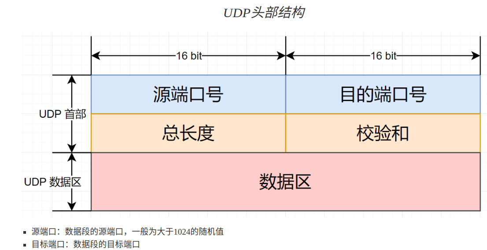

- [学习目标](#学习目标)
- [课堂笔记（命令）](#课堂笔记命令)
  - [curl -I](#curl--i)
  - [chage -l](#chage--l)
- [课堂笔记（文本）](#课堂笔记文本)
  - [Kali系统](#kali系统)
    - [基础配置](#基础配置)
    - [nmap扫描](#nmap扫描)
    - [脚本扫描](#脚本扫描)
    - [扫描口令](#扫描口令)
    - [john破解密码](#john破解密码)
  - [抓包](#抓包)
    - [封装与接封装过程](#封装与接封装过程)
    - [以太网数据帧结构](#以太网数据帧结构)
    - [网络层数据包结构](#网络层数据包结构)
    - [TCP头部结构](#tcp头部结构)
    - [UDP头部结构](#udp头部结构)
    - [抓包demo](#抓包demo)
  - [Nginx安全加固](#nginx安全加固)
    - [隐藏nginx版本信息](#隐藏nginx版本信息)
    - [缓冲区设置](#缓冲区设置)
    - [防止缓冲区溢出](#防止缓冲区溢出)
  - [Linux加固](#linux加固)
    - [设置用户密码过期时间](#设置用户密码过期时间)
    - [用户安全设置](#用户安全设置)
    - [文件保护](#文件保护)
- [快捷键](#快捷键)
- [问题](#问题)
  - [kali系统是什么？有什么用](#kali系统是什么有什么用)
- [补充](#补充)
  - [nginx配置文件检查](#nginx配置文件检查)
  - [当前登陆的用户](#当前登陆的用户)
- [今日总结](#今日总结)
- [昨日复习](#昨日复习)


# 学习目标

Kali系统

扫描抓包

Nginx安全加固

Linux基本防护

# 课堂笔记（命令）

## curl -I

```sh
[root@server1 ~]# curl -I 192.168.88.100 # 查看版本
HTTP/1.1 200 OK
Server: nginx/1.14.1
Date: Wed, 03 Jan 2024 08:01:03 GMT
Content-Type: text/html
Content-Length: 5
Last-Modified: Tue, 02 Jan 2024 12:22:01 GMT
Connection: keep-alive
ETag: "6593ffe9-5"
Accept-Ranges: bytes
```

## chage -l

```sh
# 查看用户详细信息
# 查看tom的账号信息
[root@web1 ~]# chage -l tom
最近一次密码修改时间                  ：10月 1, 2024
密码过期时间                  ：从不
密码失效时间                  ：从不
帐户过期时间                      ：从不
两次改变密码之间相距的最小天数     ：0
两次改变密码之间相距的最大天数     ：99999
在密码过期之前警告的天数    ：7
```

# 课堂笔记（文本）

## Kali系统

### 基础配置

```sh
# 默认kali没有开启ssh，且服务名不是sshd而是ssh
$ ip a s    # 查看网络IP地址，本例中查看到的是192.168.88.192
$ sudo systemctl enable ssh --now # 开机并设置开机自启动
[root@myhost ~]# ssh kali@192.168.88.40 # ssh连接
kali@192.168.88.192's password: kali
┌──(kali㉿kali)-[~]
└─$ 
```

### nmap扫描

> - 一般来说扫描是攻击的前奏。
> - 扫描可以识别目标对象是什么系统，开放了哪些服务。
> - 获知具体的服务软件及其版本号，可以使得攻击的成功率大大提升。
> - 扫描可以检测潜在的风险，也可以寻找攻击目标、收集信息、找到漏洞
> - windows下，扫描可以使用xscan / superscan
> - Linux，扫描可以采用nmap

```sh
┌──(kali㉿kali)-[~]
└─$ nmap
# -sT: TCP扫描。
# -U: 扫描目标的UDP端口。
# -sP：ping扫描
# -A：对目标系统全面分析

# 扫描整个网段，哪机器可以ping通
┌──(kali㉿kali)-[~]
└─$ nmap -sP 192.168.88.0/24

# 扫描单个IP，哪机器可以ping通
┌──(kali㉿kali)-[~]
└─$ nmap -sP 192.168.88.5

# 扫描192.168.88.100开放了哪些TCP端口
┌──(kali㉿kali)-[~]
└─$ sudo nmap -sT 192.168.88.100

# 扫描192.168.88.100开放了哪些UDP端口。非常耗时！
┌──(kali㉿kali)-[~]
└─$ sudo nmap -sU 192.168.88.100

# 全面扫描192.168.88.100系统信息，输出软件的详细信息
┌──(kali㉿kali)-[~]
└─$ sudo nmap -A 192.168.88.100
```

### 脚本扫描

```sh
# 通过脚本扫描目标主机的ftp服务
# 在目标主机上安装vsftpd服务
[root@web1 ~]# yum install -y vsftpd
[root@web1 ~]# vim +12 /etc/vsftpd/vsftpd.conf 
 12 anonymous_enable=YES
[root@web1 ~]# systemctl enable vsftpd --now

# 在kali主机上查看有哪些脚本
┌──(kali㉿kali)-[~]
└─$ ls /usr/share/nmap/scripts/

# 扫描ftp服务是否支持匿名访问。ftp控制连接端口号是21
┌──(kali㉿kali)-[~]
└─$ sudo nmap --script=ftp-anon.nse 192.168.88.100 -p 21
21/tcp open  ftp
| ftp-anon: Anonymous FTP login allowed   # 允许匿名访问

# 扫描ftp相关信息，如版本号、带宽限制等
┌──(kali㉿kali)-[~]
└─$ sudo nmap --script=ftp-syst.nse 192.168.88.100 -p 21

# 扫描ftp后门漏洞
┌──(kali㉿kali)-[~]
└─$ sudo nmap --script=ftp-vsftpd-backdoor 192.168.88.100 -p 21

```

### 扫描口令

```sh
# 通过ssh协议，使用nmap自带的密码本扫描远程主机的用户名和密码
# 在目标主机上创建名为admin的用户，密码为123456
[root@web1 ~]# useradd admin
[root@web1 ~]# echo 123456 | passwd --stdin admin

# 在kali上扫描弱密码
┌──(kali㉿kali)-[~]
└─$ sudo nmap --script=ssh-brute.nse 192.168.88.100 -p 22

# 通过扫描指定的用户及密码；案例：admin用户密码为20010317
# 1. 创建用户名文件
┌──(kali㉿kali)-[~]
└─$ sudo echo admin > /tmp/users.txt
                                                        
┌──(kali㉿kali)-[~]
└─$ cat /tmp/users.txt 
admin

# 2. 生成1990-01-01到2020-12-31之间的所月日期
┌──(kali㉿kali)-[~]
└─$ vim mydate.py
from datetime import datetime, timedelta

d1 = datetime(1989, 12, 31)
d2 = datetime(2021, 1, 1)
dt = timedelta(days=1)

with open('/tmp/mima.txt', 'w') as f:
    while d1 < d2:
        d1 += dt
        f.write("%s\n" % d1.strftime('%Y%m%d'))
┌──(kali㉿kali)-[~]
└─$ python3 mydate.py

# 3. 使用自己的密码本破解密码
┌──(kali㉿kali)-[~]
└─$ sudo nmap --script=ssh-brute.nse --script-args userdb=/tmp/users.txt,passdb=/tmp/mima.txt 192.168.88.100 -p 22

# 4. 目标主机将会记录所有的登陆事件
[root@web1 ~]# vim /var/log/secure
# 查看最近的登陆失败事件
[root@web1 ~]# lastb
# 查看最近的登陆成功事件
[root@web1 ~]# last
```

### john破解密码

> - 哈希是算法，英文hash的音译，包括md5、sha等
>   - 哈希算法是一种单向加密的算法，也就是将原始数据生成一串“乱码”
>   - 只能通过原始数据，生成这串“乱码”，但是不能通过“乱码”回推出原始数据
>   - 相同的原始数据，生成的乱码是相同的。
> - kali系统提供了一个名为john的工具，可用于密码破解

```sh
[root@web1 ~]# echo 123456 | passwd --stdin root
[root@web1 ~]# useradd tom
[root@web1 ~]# echo abc123 | passwd --stdin tom
[root@web1 ~]# useradd jerry
[root@web1 ~]# echo 123123 | passwd --stdin jerry
[root@web1 ~]# scp /etc/shadow kali@192.168.88.40:/home/kali/

# 字典暴力破解，密码本是/usr/share/john/password.lst
┌──(kali㉿kali)-[~]
└─$ sudo john shadow  

# 直接显示破解的密码，不显示其他额外信息
┌──(kali㉿kali)-[~]
└─$ sudo john --show shadow                
root:123456:18912:0:99999:7:::
tom:abc123:18912:0:99999:7:::
jerry:123123:18912:0:99999:7:::


# 字典暴力破解，指定密码本文件
┌──(kali㉿kali)-[~]
└─$ sudo john --wordlist=/tmp/mima.txt shadow
```

## 抓包

### 封装与接封装过程


### 以太网数据帧结构


### 网络层数据包结构


### TCP头部结构


### UDP头部结构



### 抓包demo

```sh
┌──(kali㉿kali)-[~]
└─$ sudo tcpdump
# -i：指定抓取哪块网卡进入的数据包
# -A：转换为ASCII码，使得可读
# -w：抓包写入文件
# -r：从文件中读取抓包信息
# 抓包时可以过滤要抓哪些包
# 使用host过滤主机，使用net过滤网段，使用port过滤端口... ...

# 1. 抓包：抓取eth0上进出的、与192.168.88.100有关的、涉及TCP21端口的数据包。以下命令执行后，打开新终端。
┌──(kali㉿kali)-[~]
└─$ sudo tcpdump -i eth0 -A host 192.168.88.100 and tcp port 21

# 2. 在新终端登陆ftp
┌──(kali㉿kali)-[~]
└─$ ftp 192.168.88.100
Connected to 192.168.88.100.
220 (vsFTPd 3.0.2)
Name (192.168.88.11:kali): tom   # 用户名；前提在100上useradd tom|passwd --stdin tom <<< 20010317
331 Please specify the password.
Password:20010317   # 此处是tom的密码
230 Login successful.
Remote system type is UNIX.
Using binary mode to transfer files.
ftp> exit    # 退出
221 Goodbye.


# 3.在tcpdump终端可以看到明文的用户名和密码

# 保存抓包文件
# 1. 将抓到的包存入文件ftp.cap
┌──(kali㉿kali)-[~]
└─$ sudo tcpdump -i eth0 -A -w ftp.cap host 192.168.88.100 and tcp port 21
# 2. 在另一个终端访问ftp
# 在新终端登陆ftp
┌──(kali㉿kali)-[~]
└─$ ftp 192.168.88.100
Connected to 192.168.88.100.
220 (vsFTPd 3.0.2)
Name (192.168.88.11:kali): tom   # 用户名
331 Please specify the password.
Password:abc123   # 此处是tom的密码
230 Login successful.
Remote system type is UNIX.
Using binary mode to transfer files.
ftp> exit    # 退出
221 Goodbye.

# 3. 在抓包终端ctrl+c停止
# 4. 读取抓到的包，并过滤
┌──(kali㉿kali)-[~]
└─$ tcpdump -A -r ftp.cap | egrep 'USER|PASS' 
reading from file ftp.cap, link-type EN10MB (Ethernet), snapshot length 262144
01:45:52.808080 IP bogon.localhost.47702 > 192.168.88.100.ftp: Flags [P.], seq 1:13, ack 21, win 16384, options [nop,nop,TS val 3629038506 ecr 1397928556], length 12: FTP: USER admin
.N..SR.lUSER admin
01:45:55.064086 IP bogon.localhost.47702 > 192.168.88.100.ftp: Flags [P.], seq 13:28, ack 55, win 16384, options [nop,nop,TS val 3629040762 ecr 1397931876], length 15: FTP: PASS 20010317
.N.zSR.dPASS 20010317
```

```sh
# linux图形工具
[root@myhost ~]# yum install wireshark ftp
```

## Nginx安全加固

### 隐藏nginx版本信息

```sh
[root@web1 ~]# curl -I 192.168.88.100
HTTP/1.1 200 OK
Server: nginx/1.14.1
Date: Wed, 03 Jan 2024 08:25:31 GMT
Content-Type: text/html
Content-Length: 5
Last-Modified: Tue, 02 Jan 2024 12:22:01 GMT
Connection: keep-alive
ETag: "6593ffe9-5"
Accept-Ranges: bytes
# 关闭版本信息
[root@web1 ~]# vim /etc/nginx/nginx.conf
... ...
 17 http {
 18     server_tokens off;
... ...

[root@web1 ~]# systemctl restart nginx 
[root@web1 ~]# curl -I 192.168.88.100
HTTP/1.1 200 OK
Server: nginx
Date: Wed, 03 Jan 2024 08:26:53 GMT
Content-Type: text/html
Content-Length: 5
Last-Modified: Tue, 02 Jan 2024 12:22:01 GMT
Connection: keep-alive
ETag: "6593ffe9-5"
Accept-Ranges: bytes

```

### 缓冲区设置

> 可以防止Dos攻击等等

```sh
# 压力测试，每批次发送100个请求给web服务器，一共发200个
[root@myhost ~]# yum install -y httpd-tools
[root@myhost ~]# ab -c 100 -n 200 http://192.168.88.100/ 
... ...
Benchmarking 192.168.88.100 (be patient)
Completed 100 requests
Completed 200 requests
Finished 200 requests    # 发送200个请求完成
... ... 
Complete requests:      200   # 完成了200个请求
Failed requests:        0     # 0个失败
... ...
```

<span id='tag1' style='color:red'>ssss</span>

```sh
[root@web1 ~]# vim /etc/nginx/nginx.conf
 17 http {
 18     limit_req_zone $binary_remote_addr zone=one:10m rate=1r/s;   # 添加
... ...
 40     server {
 41         listen       80 default_server;
 42         listen       [::]:80 default_server;
 43         server_name  _;
 44         root         /usr/share/nginx/html;
 45         limit_req zone=one burst=5;  # 添加
[root@web1 ~]# systemctl restart nginx.service 

# 再次测试
[root@myhost ~]# ab -c 100 -n 200 http://192.168.88.100/ 
... ...
Benchmarking 192.168.88.100 (be patient)
Completed 100 requests
Completed 200 requests
Finished 200 requests
... ...
Complete requests:      200
Failed requests:        194   # 失败了194个
... ...
```

> **代码解释：**
>
> Nginx 配置文件使用 limit_req_zone 和 limit_req 指令实现了请求频率控制，对于同一 IP 地址，每秒最多只能处理一个请求，并且当请求超出设定的阈值时，将返回一个 503 错误码以防止服务器过载。

### 防止缓冲区溢出

> **缓冲区的优点**
>
> 1. 减轻上游服务器压力：Nginx 的缓冲区可以在接收到客户端请求后，暂时存储请求数据。这使得 Nginx 能够在处理请求之前对数据进行处理、过滤或验证，从而减轻了上游服务器（如应用服务器）的负载。这对于处理大量请求的场景尤其有用。
> 2. 提高响应速度：通过使用缓冲区，Nginx 可以一次性接收和发送更多的数据，减少网络往返的次数。这样可以显著提高响应速度，尤其是对于大文件传输或高并发请求的情况。
> 3. 平滑上传和下载速度：Nginx 的缓冲区可用于平滑上传和下载速度。当客户端上传或下载文件时，Nginx 可以将数据暂存到缓冲区中，然后按照较小的块逐步传输给客户端，避免了瞬间传输大量数据可能带来的问题，例如内存消耗过大或网络阻塞。
> 4. 缓存静态资源：Nginx 还可以利用缓冲区来缓存静态资源，如图片、CSS 和 JavaScript 文件等。这样，当客户端请求这些静态资源时，Nginx 可以直接从缓存中返回，而无需再次访问磁盘或上游服务器，从而提高响应速度和降低负载。
>
> **缓冲区溢出：**
>
> 1. 程序崩溃：当缓冲区溢出时，可能会破坏程序的内存结构，导致程序崩溃或无法正常执行。
> 2. 数据损坏：缓冲区溢出可能会导致数据损坏，例如当缓冲区用于存储文件时，缓冲区溢出可能会导致文件内容被改变，从而导致数据丢失或不完整。
> 3. 安全漏洞：缓冲区溢出是一种常见的安全漏洞，黑客可以利用这种漏洞来执行恶意代码、提权或者攻击其他系统。
> 4. 系统崩溃：当缓冲区溢出时，可能会破坏操作系统的内存结构，导致系统崩溃或者失去响应。
>
> **防止：**
>
> 为了避免缓冲区溢出，程序员需要对缓冲区进行合理的大小和边界检查，并采取相应的防御措施，例如使用边界检查函数、限制输入长度、过滤非法字符等。此外，编程语言和编译器也提供了一些防御措施，例如字符串拼接函数的安全版本、堆栈保护机制等。

```sh
# 配置nginx缓冲区大小，防止缓冲区溢出
[root@web1 ~]# vim /etc/nginx/nginx.conf
... ...
 17 http {
 18     client_body_buffer_size     1k;
 19     client_header_buffer_size   1k;
 20     client_max_body_size        1k;
 21     large_client_header_buffers 2 1k;
... ...
[root@web1 ~]# systemctl restart nginx.service
```

## Linux加固

### 设置用户密码过期时间

```sh
# 查询用户账户信息
[root@web1 ~]# chage -l student
最近一次密码修改时间                                    ：从不
密码过期时间                                    ：从不
密码失效时间                                    ：从不
帐户过期时间                                            ：从不
两次改变密码之间相距的最小天数          ：0
两次改变密码之间相距的最大天数          ：99999
在密码过期之前警告的天数        ：7
# 修改用户账户
[root@web1 ~]# chage -E 2025-1-1 student # 设置用户student在2025-1-1过期
[root@web1 ~]#chage -l student
最近一次密码修改时间                  ：10月 12, 2021
密码过期时间                  ：从不
密码失效时间                  ：从不
帐户过期时间                      ：1月 01, 2024
两次改变密码之间相距的最小天数     ：0
两次改变密码之间相距的最大天数     ：99999
在密码过期之前警告的天数    ：7

# 设置新建用户的密码策略
[root@web1 ~]# vim /etc/login.defs 
 39 PASS_MAX_DAYS   99999    # 密码永不过期，设置最长有效期
 40 PASS_MIN_DAYS   0        # 密码最短使用时间，0表示随时可改密码
 41 PASS_MIN_LEN    5        # 密码最短长度
 42 PASS_WARN_AGE   7        # 密码过期前7天发警告
 47 UID_MIN                  1000   # 新建用户最小的UID
 48 UID_MAX                 60000   # 新建用户最大的UID
 78 USERGROUPS_ENAB yes # 删除该用户，如果该用户组有成员则不删除组
```

### 用户安全设置

```sh
# 锁定tom账号
[root@web1 ~]# passwd -l tom
锁定用户 tom 的密码 。
passwd: 操作成功

[root@web1 ~]# passwd -S tom   # 查看状态
tom LK 2024-1-3 0 99999 7 -1 (密码已被锁定。)

# 解锁tom账号
[root@web1 ~]# passwd -u tom
解锁用户 tom 的密码。
passwd: 操作成功
[root@web1 ~]# passwd -S tom
tom PS 2024-1-3  0 99999 7 -1 (密码已设置，使用 SHA512 算法。)

# 原理：执行命令后会在/etc/shadow 文件中该用户密文前加上两个!!
[root@web1 ~]# grep tom /etc/shadow
tom:$6$bINzP093BHm4i9ii$7Lg8cvoPp6dV0ss1.FH/kzQFQTS9Vl.GYFaU8bw7MqEPtS2K4L5n8pKUW9v.IexlYb1x/g8hKHA1M5uQjPlUn.:19725:0:99999:7:::

[root@web1 ~]# passwd -l tom # 锁定
Locking password for user tom.
passwd: Success

[root@web1 ~]# grep tom /etc/shadow
tom:!!$6$bINzP093BHm4i9ii$7Lg8cvoPp6dV0ss1.FH/kzQFQTS9Vl.GYFaU8bw7MqEPtS2K4L5n8pKUW9v.IexlYb1x/g8hKHA1M5uQjPlUn.:19725:0:99999:7:::

#也可以手动再passwd密文，文件中添加符号
# 原理：用户登陆后回去校验该文件对应的密码，随便添加一个符号后密码校验不会通过
```

### 文件保护

```sh
# 查看文件的特殊属性
[root@web1 ~]# lsattr /etc/passwd
---------------- /etc/passwd    # 没有特殊属性

# 修改属性
chattr +i 文件    # 不允许对文件做任何操作，只能看
chattr -i 文件    # 去除i属性
chattr +a 文件    # 文件只允许追加
chattr -a 文件    # 去除a属性

[root@web1 ~]# chattr +i /etc/passwd
[root@web1 ~]# lsattr /etc/passwd
----i----------- /etc/passwd
[root@web1 ~]# useradd zhangsan
useradd：无法打开 /etc/passwd
[root@web1 ~]# rm -f /etc/passwd
rm: 无法删除"/etc/passwd": 不允许的操作
[root@web1 ~]# chattr -i /etc/passwd
[root@web1 ~]# rm -f /etc/passwd   # 可以删除
[root@web1 ~]# ls /etc/passwd
ls: 无法访问/etc/passwd: 没有那个文件或目录

# 恢复passwd文件 
[root@web1 ~]# cp /etc/passwd- /etc/passwd
# 不是所有的文件有，可以使用ls -l | grep "^d..*--.*" 查看当前目录下那些文件是删除后，文件莫为带有个-继续存储再磁盘上

# 追加
[root@web1 ~]# chattr +a /etc/hosts
[root@web1 ~]# echo 'hello world' >> /etc/hosts # 只允许使用该方式进行追加
[root@web1 ~]# rm -f /etc/hosts
rm: 无法删除"/etc/hosts": 不允许的操作
[root@web1 ~]# chattr -a /etc/hosts # 取消
```


# 快捷键

# 问题

## kali系统是什么？有什么用

> ​	Kali Linux是一个基于Debian的Linux发行版，由Offensive Security公司开发和维护。它是一个黑客工具，内置了大量的安全工具，用于网络渗透测试、漏洞分析、密码破解等安全领域的实践操作。Kali Linux因其强大的安全功能而受到许多安全从业人员的青睐。它可以用于测试网络安全，测试自己的网络或者开发的应用程序的安全性能，也可以用于学习安全知识。Kali Linux是一个攻击型工具，而不是一个防御型工具。
>
> ​	因此，使用Kali Linux需要特别小心，不要做违法的事情，否则会面临法律的制裁。Kali系统用得好，牢饭吃得饱。


# 补充

## nginx配置文件检查

```sh 
nginx -t
```

## 当前登陆的用户

```sh
whoami
```


# 今日总结


# 昨日复习