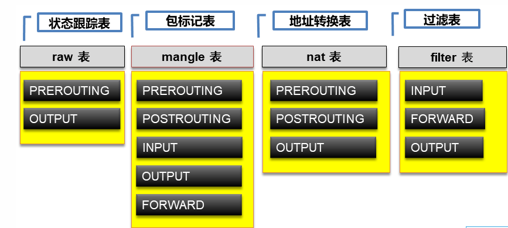
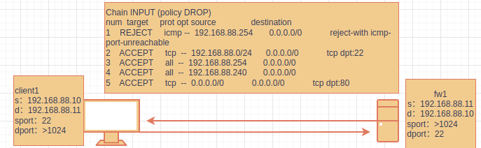
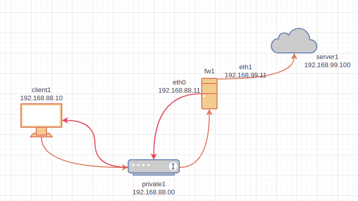

- [学习目标](#学习目标)
- [课堂笔记（命令）](#课堂笔记命令)
- [课堂笔记（文本）](#课堂笔记文本)
  - [环境准备](#环境准备)
  - [iptables基本介绍](#iptables基本介绍)
    - [iptables四表](#iptables四表)
    - [防火墙fileter表](#防火墙fileter表)
      - [filter三条链](#filter三条链)
  - [iptables操作](#iptables操作)
    - [常用选项](#常用选项)
    - [测试选项](#测试选项)
    - [情况所有规则](#情况所有规则)
    - [语法](#语法)
  - [配置规则-INPUT](#配置规则-input)
    - [配置默认规则](#配置默认规则)
    - [查看规则](#查看规则)
    - [测试](#测试)
    - [删除规则](#删除规则)
    - [添加规则-tcp](#添加规则-tcp)
    - [测试](#测试-1)
    - [测试放行服务-80](#测试放行服务-80)
    - [规则编号](#规则编号)
    - [拒绝访问规则](#拒绝访问规则)
    - [放行建立连接](#放行建立连接)
  - [保存规则](#保存规则)
  - [配置规则-FORWARD](#配置规则-forward)
    - [配置测试](#配置测试)
    - [放行多个端口](#放行多个端口)
    - [放行一段IP](#放行一段ip)
    - [测试](#测试-2)
  - [配置NAT表](#配置nat表)
    - [nat概述](#nat概述)
    - [NAT表中的链](#nat表中的链)
    - [如何选择routing](#如何选择routing)
    - [配置POSTROUTING](#配置postrouting)
    - [高级使用](#高级使用)
- [快捷键](#快捷键)
- [问题](#问题)
  - [iptables有几张表](#iptables有几张表)
- [补充](#补充)
  - [yum创建缓存](#yum创建缓存)
- [今日总结](#今日总结)
- [昨日复习](#昨日复习)


# 学习目标

iptables防火墙

filter表控制

扩展匹配

nat表典型应用

# 课堂笔记（命令）


# 课堂笔记（文本）

## 环境准备

> - client1：eth0 -> 192.168.88.10/24 网关：192.168.88.11
> - fw1：eth0 -> 192.168.88.11/24，eth1 -> 192.168.99.11/24
> - server1：eth1 -> 192.168.99.100/24 网关：192.168.99.11
> - yum配置成功

## iptables基本介绍

### iptables四表



### 防火墙fileter表

> - 配置iptables时，不指定表，默认使用filter表
> - 配置时不指定规则链，则配置所有链
> - 可以向规则链中加入很多规则，数据包进入该链时，从上向下匹配，一旦匹配就停止，开始应用规则。如果全都不匹配，则应用默认规则
> - 命令选项、链名、目标操作使用大写字母，其他小写

#### filter三条链

> - INPUT：数据包的目标地址是自己，则进入INPUT链
> - OUTPUT:数据包的源地址是自己，则进入OUTPUT链
> - FORWARD：数据包穿过自己，则进入FORWARD链

## iptables操作

### 常用选项

```sh
-A 追加规则-->iptables -D INPUT 1(编号)
-R 修改规则-->iptables -R INPUT 1 -s 192.168.12.0 -j DROP 取代现行规则，顺序不变(1是位置)
-I 插入规则-->iptables -I INPUT 1 --dport 80 -j ACCEPT 插入一条规则，原本位置上的规则将会往后移动一个顺位
-L 查看规则-->iptables -L INPUT 列出规则链中的所有规则

通用参数：
-p 协议  例：iptables -A INPUT -p tcp
-s 源地址 例：iptables -A INPUT -s 192.168.1.1
-d 目的地址 例：iptables -A INPUT -d 192.168.12.1
--sport 源端口 例:iptables -A INPUT -p tcp --sport 22
--dport 目的端口 例:iptables -A INPUT -p tcp --dport 22
-i 指定入口网卡 例:iptables -A INPUT -i eth0
-o 指定出口网卡 例:iptables -A FORWARD -o eth0

-j 指定要进行的处理动作
常用的ACTION：
DROP：丢弃
REJECT：明示拒绝
ACCEPT：接受
```

### 测试选项

```sh
# 安装防火墙
[root@fw1 ~]# yum install -y iptables-service.x86_64 
[root@fw1 ~]# iptables -t filter -L # 查看filter表信息；默认操作的时filter表，可以不写-t filter

[root@fw1 ~]# iptables -L INPUT # 查看指点链的规则信息；服务未启动没有什么信息；
Chain INPUT (policy ACCEPT)
target     prot opt source               destination  

# 服务启动
[root@fw1 ~]# systemctl enable iptables --now
[root@fw1 ~]# iptables -L # 服务启动后的默认规则
Chain INPUT (policy ACCEPT)
target     prot opt source               destination         
ACCEPT     all  --  anywhere             anywhere             state RELATED,ESTABLISHED
ACCEPT     icmp --  anywhere             anywhere            
ACCEPT     all  --  anywhere             anywhere            
ACCEPT     tcp  --  anywhere             anywhere             state NEW tcp dpt:ssh
REJECT     all  --  anywhere             anywhere             reject-with icmp-host-prohibited

Chain FORWARD (policy ACCEPT)
target     prot opt source               destination         
REJECT     all  --  anywhere             anywhere             reject-with icmp-host-prohibited

Chain OUTPUT (policy ACCEPT)
target     prot opt source               destination  
```

### 情况所有规则

```sh
[root@fw1 ~]# iptables -F # 清空所有规则
[root@fw1 ~]# iptables -L
Chain INPUT (policy ACCEPT)
target     prot opt source               destination         

Chain FORWARD (policy ACCEPT)
target     prot opt source               destination         

Chain OUTPUT (policy ACCEPT)
target     prot opt source               destination
```

### 语法

```sh
iptables [-t 表名] 选项 [链名] [条件] [-j 满足条件的操作]
```

## 配置规则-INPUT

### 配置默认规则

> - 可以设置默认拒绝，然后明确允许
> - 也可以设置默认允许，然后明确拒绝

```sh
# 前提，先加上一条规则，避免当前ssh连接不上
# 向INPUT链追加规则，192.168.88.254发来的包全部接受
# -A是追加，-s是匹配源地址，-j为jump，采取的行为，ACCEPT是接受
[root@fw1 ~]# iptables -A INPUT -s 192.168.88.254 -j ACCEPT

# 将INPUT链的默认规则改为DROP丢弃。-P设置默认规则;设置默认规则为丢弃
[root@fw1 ~]# iptables -P INPUT DROP
```

### 查看规则

```sh
# 查看INPUT链的规则
[root@fw1 ~]# iptables -L INPUT # 有的慢，因为要做域名解析，结果出来的很慢
Chain INPUT (policy DROP)
target     prot opt source               destination         
ACCEPT     all  --  192.168.88.254        anywhere
[root@fw1 ~]# iptables -nL INPUT # 加上参数n，别-L要快;n是指用数字来表示端口号、主机等
```

### 测试

```sh
# 在192.168.88.10上访问fw1，将会被拒绝
[root@client1 ~]# ping -c2 192.168.88.11
[root@client1 ~]# ssh 192.168.88.11

# 注意，数据通信多数是双向的。现在fw1也不能与192.168.88.254以外的其他机器通信，因为数据回不来。
[root@fw1 ~]# ping -c2 192.168.88.10   # 失败
```

### 删除规则

```sh
[root@fw1 ~]# iptables -A INPUT -s 192.168.88.254 -j ACCEPT 
[root@fw1 ~]# iptables -nL INPUT
Chain INPUT (policy DROP)
target     prot opt source               destination         
ACCEPT     all  --  192.168.88.254        anywhere
ACCEPT     all  --  192.168.88.254        anywhere
[root@fw1 ~]# iptables -D INPUT 1 # 删除INPUT链第一个位置的规则
[root@fw1 ~]# iptables -nL INPUT
Chain INPUT (policy DROP)
target     prot opt source               destination         
ACCEPT     all  --  192.168.88.254        anywhere
```

### 添加规则-tcp

```sh
# 允许192.168.88.0网络的主机ssh连接fw1
# -I是插入到INPUT链的第1个位置。-p指定协议，--dport指定目标端口号。-j是执行的操作
# 该规则只是允许源IP为88网段的访问目标22端口才放行，否则走其他规则，都不满足则走默认规则
[root@fw1 ~]# iptables -I INPUT -s 192.168.88.0/24 -p tcp --dport 22 -j ACCEPT

[root@fw1 ~]# iptables -nL INPUT
Chain INPUT (policy DROP)
target     prot opt source               destination         
ACCEPT     tcp  --  192.168.88.0/24      0.0.0.0/0            tcp dpt:22
ACCEPT     all  --  192.168.88.254       0.0.0.0/0 
```

### 测试

```sh
# ssh和ping 主机fw1
[root@client1 ~]# ssh 192.168.88.11
The authenticity of host '192.168.88.11 (192.168.88.11)' can't be established.
ECDSA key fingerprint is SHA256:t7J3okFd0o+9zTmFCIetvDl6mxGCmc43VoD6C65zico.
Are you sure you want to continue connecting (yes/no/[fingerprint])?

[root@client1 ~]# ping 192.168.88.11
PING 192.168.88.11 (192.168.88.11) 56(84) bytes of data.
^C
--- 192.168.88.11 ping statistics ---
7 packets transmitted, 0 received, 100% packet loss, time 6158ms

# 192.168.88.10已经可以ssh到fw1，但是ping不通，因为只允许了ssh
```

### 测试放行服务-80

```sh
# 安装nginx
[root@fw1 ~]#yum -y install nginx
[root@fw1 ~]#echo 'firewalld tst' > /usr/share/nginx/html/index.html
[root@fw1 ~]#systemctl enable nginx --now

# 未配规则访问
[root@fw1 ~]#curl 192.168.88.11  # 访问不通
[root@server1 ~]#curl 192.168.99.11 # 访问不通
[root@fw1 ~]# iptables -nL INPUT
Chain INPUT (policy DROP)
target     prot opt source               destination         
ACCEPT     tcp  --  192.168.88.0/24      0.0.0.0/0            tcp dpt:22
ACCEPT     all  --  192.168.88.254       0.0.0.0/0 
# 根据规则得知，只是放行了所有88网段的22端口，而服务在192.168.88.11上默认端口为80，不符合规则而作为服务提供者88.11也是不能访问的，默认走的规则时拒绝；

# 添加一条符合规则:放行所有访问80端口的IP；dport目标端口
[root@fw1 ~]#iptables -I INPUT -p tcp --dport 80 -j ACCEPT
[root@fw1 ~]# iptables -nL INPUT  # 查看
[root@fw1 ~]#curl 192.168.88.11 
firewalld tst
[root@server1 ~]#curl 192.168.99.11
firewalld tst
```

> iptables在放行时，根据请求IP对照filter表的三条链，依次比对，符合才放行

### 规则编号

```sh
# --line-number 显示序号
[root@fw1 ~]# iptables -nL INPUT --line-number
Chain INPUT (policy DROP)
num  target     prot opt source               destination         
1    REJECT     icmp --  192.168.88.254       0.0.0.0/0            reject-with icmp-port-unreachable
2    ACCEPT     tcp  --  192.168.88.0/24      0.0.0.0/0            tcp dpt:22
3    ACCEPT     all  --  192.168.88.254       0.0.0.0/0           
4    ACCEPT     all  --  192.168.88.240       0.0.0.0/0     
```

### 拒绝访问规则

```sh
# 拒绝254 ping本机
# ping没有端口而是在网络层的icmp协议中；REJECT拒绝访问
[root@fw1 ~]# iptables -A INPUT -s 192.168.88.254 -p icmp -j REJECT 
[root@fw1 ~]# iptables -nL INPUT --line-number
Chain INPUT (policy DROP)
num  target     prot opt source               destination         
1    ACCEPT     tcp  --  192.168.88.0/24      0.0.0.0/0            tcp dpt:22
2    ACCEPT     all  --  192.168.88.254       0.0.0.0/0           
3    ACCEPT     all  --  192.168.88.240       0.0.0.0/0
4    ACCEPT     tcp  --  0.0.0.0/0            0.0.0.0/0            tcp dpt:80
5	 REJECT     icmp --  192.168.88.254       0.0.0.0/0            reject-with 	icmp-port-unreachable

# 测试ping，还是能ping通
[root@server1 ~]# ping 192.168.88.11
PING 192.168.88.11 (192.168.88.11) 56(84) 字节的数据。
64 字节，来自 192.168.88.11: icmp_seq=1 ttl=255 时间=0.184 毫秒
64 字节，来自 192.168.88.11: icmp_seq=2 ttl=255 时间=0.218 毫秒
^C
--- 192.168.88.11 ping 统计 ---
已发送 2 个包， 已接收 2 个包, 0% packet loss, time 1018ms
rtt min/avg/max/mdev = 0.184/0.201/0.218/0.017 ms
# 原因：因为规则从上到下匹配，匹配到第2个规则时，允许源IP88.254访问我的所有；满足后就不再往下去匹配第5条规则了

# 将规则放置前面;删除规则使用插入(-I)方式进行添加，插入默认放置顶上；
[root@fw1 ~]# iptables -D INPUT 5 
[root@fw1 ~]# iptables -I INPUT -s 192.168.88.254 -p icmp -j REJECT
[root@fw1 ~]# iptables -nL INPUT --line-number
Chain INPUT (policy DROP)
num  target     prot opt source               destination 
1	 REJECT     icmp --  192.168.88.254       0.0.0.0/0            reject-with 	icmp-port-unreachable
2    ACCEPT     tcp  --  192.168.88.0/24      0.0.0.0/0            tcp dpt:22
3    ACCEPT     all  --  192.168.88.254       0.0.0.0/0           
4    ACCEPT     all  --  192.168.88.240       0.0.0.0/0
5    ACCEPT     tcp  --  0.0.0.0/0            0.0.0.0/0            tcp dpt:80

# 测试254 ping 防火墙11
[root@server1 ~]# ping 192.168.88.11
PING 192.168.88.11 (192.168.88.11) 56(84) 字节的数据。
来自 192.168.88.11 icmp_seq=1 目标端口不可达
来自 192.168.88.11 icmp_seq=2 目标端口不可达
^C
--- 192.168.88.11 ping 统计 ---
已发送 2 个包， 已接收 0 个包, +2 错误, 100% packet loss, time 1043ms

# 测试10 ping 防火墙11
[root@client1 ~]# ping 192.168.88.11
PING 192.168.88.11 (192.168.88.11) 56(84) bytes of data.
^C
--- 192.168.88.11 ping statistics ---
2 packets transmitted, 0 received, 100% packet loss, time 1042ms

# DROP是直接丢弃，REJECT是明确拒绝。
```

> 为什么254ping不同后有明确的提示，而10ping后直接无提示？
>
> **原因：**
>
> ​		254在规则列表中明确的指明当254在对**目标机器(防火墙)**进行ping时走第一条规则，规则行为是（REJECT）拒绝；
>
> ​		10在进行对目标机器ping时，由于没有匹配到任何规则，就走默认规则，而默认规则的行为是（DROP）丢弃；
>
> 
>
> 拒绝：收到请求后作出回应，你不能访问我
>
> 丢弃：收到请求后，直接丢弃了，不给出任何回应

### 放行建立连接



> <span style='color:red'>案例</span>：防火墙访问客户端的ssh
>
> ​	防火墙访问客户端的ssh时源IP为11目标IP为10，目标端口是22，源端口将会由系统生成一个大于1024的端口；
>
> ​	客户端进行数据回应时，源IP为10目标IP为11，源端口为22，目标端口为防火墙访问时的源端口(>1024)；
>
> ​	根据规则表，只是允许88网段访问目标机器22端口，所有网段访问目标机器80端口，当在fw1上ssh远程连接目标client1时，由于规则放行了目标22端口，所以可以进行ssh连接，根据tcp三次握手，数据要进行返回，此时client1作为源，他要将数据返回回去，此时，目标端口不再是22而是fw1的sport，但由于该目标端口不在规则里面，所以走默认规则会被拒绝
>
> ​	解决方法：
>
> 				1. 填写目标/源端口（但进行ssh时源端口每次都会不一样）
> 				2. 使用ESTABLISHED模块（放行已经建立的连接）

> - 此时，从其他机器访问fw1已放行相关协议，但是从fw1访问其他机器却无法成功。原因是数据可以发出去，但是返回的数据包也会进入INPUT，但是INPUT链中没有相关放行规则。
> - 从自身发出去，返回来的数据包属于某个连接，该连接的状态是ESTABLISHED，放行该状态的数据包即可。ESTABLISHED表示已经建立的连接，即数据包是响应一个已经建立的连接而来的。

```sh
# 规则列表
[root@fw1 ~]#iptables -nL INPUT
Chain INPUT (policy DROP)
target     prot opt source               destination         
REJECT     icmp --  192.168.88.254       0.0.0.0/0            reject-with icmp-port-unreachable
ACCEPT     tcp  --  192.168.88.0/24      0.0.0.0/0            tcp dpt:22
ACCEPT     all  --  192.168.88.254       0.0.0.0/0           
ACCEPT     all  --  192.168.88.240       0.0.0.0/0           
ACCEPT     tcp  --  0.0.0.0/0            0.0.0.0/0            tcp dpt:80

[root@fw1 ~]# ssh 192.168.88.10
^C
[root@fw1 ~]# ping 192.168.88.10
PING 192.168.88.10 (192.168.88.10) 56(84) bytes of data.
^C
--- 192.168.88.10 ping statistics ---
2 packets transmitted, 0 received, 100% packet loss, time 1041ms
```

````sh
# 配置ESTABLISHED模块
[root@fw1 ~]# iptables -I INPUT -m state --state ESTABLISHED -j ACCEPT

[root@fw1 ~]# ping 192.168.88.10
PING 192.168.88.10 (192.168.88.10) 56(84) bytes of data.
64 bytes from 192.168.88.10: icmp_seq=1 ttl=255 time=0.425 ms
64 bytes from 192.168.88.10: icmp_seq=2 ttl=255 time=0.500 ms
^C
--- 192.168.88.10 ping statistics ---
2 packets transmitted, 2 received, 0% packet loss, time 1025ms
rtt min/avg/max/mdev = 0.425/0.462/0.500/0.043 ms

[root@fw1 ~]# ssh 192.168.88.10
The authenticity of host '192.168.88.10 (192.168.88.10)' can't be established.
ECDSA key fingerprint is SHA256:t7J3okFd0o+9zTmFCIetvDl6mxGCmc43VoD6C65zico.
Are you sure you want to continue connecting (yes/no/[fingerprint])? ^C
````

## 保存规则

```sh
# 命令行敲击的规则都是存储在内存中，机器关机或服务重启规则都将消失
[root@fw1 ~]# cat /etc/sysconfig/iptables # 存放规则文件；默认里面有规则
[root@fw1 ~]# iptables-save # 查看当前规则
# Generated by iptables-save v1.8.4 on Thu Jan  4 15:12:06 2024
*filter
:INPUT DROP [356:25284]
:FORWARD ACCEPT [0:0]
:OUTPUT ACCEPT [4931:457531]
-A INPUT -m state --state ESTABLISHED -j ACCEPT
-A INPUT -s 192.168.88.254/32 -p icmp -j REJECT --reject-with icmp-port-unreachable
-A INPUT -s 192.168.88.0/24 -p tcp -m tcp --dport 22 -j ACCEPT
-A INPUT -s 192.168.88.254/32 -j ACCEPT
-A INPUT -s 192.168.88.240/32 -j ACCEPT
-A INPUT -p tcp -m tcp --dport 80 -j ACCEPT
COMMIT
# Completed on Thu Jan  4 15:12:06 2024
[root@fw1 ~]# iptables-save > /etc/sysconfig/iptables # 载入新的规则
```

## 配置规则-FORWARD

### 配置测试

> 1. 默认拒绝所有数据包通过
> 2. 从server1所在网段发往client1所在网段的包全部允许
> 3. 从client1所在网段到server1所在网段，允许icmp，允许22、80、443端口通过

```sh
# 默认拒绝所有数据包通过。
[root@fw1 ~]#iptables -P FORWARD DROP


# 从server1所在网段发往client1所在网段的包全部允许
[root@fw1 ~]#iptables -A FORWARD -s 192.168.99.0/24 -d 192.168.88.0/24 -j ACCEPT
[root@fw1 ~]#iptables -A FORWARD -m state --state ESTABLISHED -j ACCEPT


# 从client1所在网段到server1所在网段，允许icmp，允许22、80、443端口通过
[root@fw1 ~]#iptables -A FORWARD -s 192.168.88.0/24 -d 192.168.99.0/24 -p icmp -j ACCEPT
[root@fw1 ~]#iptables -A FORWARD -s 192.168.88.0/24 -d 192.168.99.0/24 -p tcp --dport 80 -j ACCEPT
[root@fw1 ~]#iptables -A FORWARD -s 192.168.88.0/24 -d 192.168.99.0/24 -p tcp --dport 22 -j ACCEPT
[root@fw1 ~]#iptables -A FORWARD -s 192.168.88.0/24 -d 192.168.99.0/24 -p tcp --dport 443 -j ACCEPT


# server到client
[root@server1 ~]# curl 192.168.88.10
<html>
...........
</html>
[root@server1 ~]# ping 192.168.88.10
PING 192.168.88.10 (192.168.88.10) 56(84) bytes of data.
64 bytes from 192.168.88.10: icmp_seq=1 ttl=254 time=0.595 ms
^C
--- 192.168.88.10 ping statistics ---
1 packets transmitted, 1 received, 0% packet loss, time 0ms
rtt min/avg/max/mdev = 0.595/0.595/0.595/0.000 ms
```

### 放行多个端口

```sh
# 删除刚添加的端口
[root@fw1 ~]#iptables -D FORWARD 6 # 443端口
[root@fw1 ~]#iptables -D FORWARD 5 # 22 端口
[root@fw1 ~]#iptables -D FORWARD 4 # 80端口
[root@fw1 ~]#iptables -nL FORWARD
Chain FORWARD (policy DROP)
target     prot opt source               destination         
ACCEPT     all  --  192.168.99.0/24      192.168.88.0/24     
ACCEPT     all  --  192.168.88.0/24      192.168.99.0/24      state ESTABLISHED
ACCEPT     icmp --  192.168.88.0/24      192.168.99.0/24 
```

```sh
 # # -m是引入扩展模块，multiport多端口
[root@fw1 ~]# iptables -A FORWARD -s 192.168.88.0/24 -d 192.168.99.0/24 -p tcp -m multiport --dport 22,80,443,100:120 -j ACCEPT
# 100:120  放行一个端口段100～120
```

### 放行一段IP

```sh
# -m是引入扩展模块，src-range是源地址范围，dst-range目标地址范围
[root@fw1 ~]# iptables -I FORWARD -m iprange --src-range 192.168.88.10-192.168.88.20 --dst-range 192.168.99.50-192.168.99.150 -j REJECT
```

### 测试

```sh
[root@client1 ~]# curl 192.168.99.100
curl: (7) Failed to connect to 192.168.99.100 port 80: Connection refused
# 恢复做以下实验
[root@fw1 ~]#iptables -D FORWARD 1
```

## 配置NAT表

### nat概述

> - NAT：网络地址翻译、网络地址转换
> - NAT技术产生，主要是解决IPV4地址不够用。
> - NAT一般用于将私有地址转成全球唯一的公有地址。
> - 私有地址：
>   - A类：10.x.x.x
>   - B类：172.16.x.x-172.31.x.x
>   - C类：192.168.x.x
> - 私有地址，如果需要访问互联网中的公有地址，进行上网，可以通过NAT技术，将私有地址转成公有地址，再访问外界。
>
> - 互联网环境下，运营商不允许私有地址出现在互联网上，发现有这样的数据，就直接丢弃。所以，私有地址发往互联网时，需要用NAT转换成公有地址，也叫合法地址。

### NAT表中的链

```sh
[root@fw1 ~]# iptables -t nat -nL
Chain PREROUTING (policy ACCEPT)
target     prot opt source               destination         

Chain INPUT (policy ACCEPT)
target     prot opt source               destination         

Chain POSTROUTING (policy ACCEPT)
target     prot opt source               destination         

Chain OUTPUT (policy ACCEPT)
target     prot opt source  

PREROUTING ：路由前
POSTROUTING：路由后
```

### 如何选择routing



> 客户端访问88.11：客户端直接访问同网段服务是在路由前所以选择PREROUTING
>
> 客户端访问99.100：客户端访问不同同网段服务是在路由前所以选择POSTROUTING
>
> <span style='color:red'><b>详细解释</b></span>
>
> 1. 路由前（Pre-routing）：在数据包进入网络堆栈之前进行NAT操作。这通常用于目标地址转换（DNAT），将目标地址更改为内部服务器的地址。这种方式适用于需要将外部流量转发到内部服务器的情况。
> 2. 路由后（Post-routing）：在数据包离开网络堆栈之前进行NAT操作。这通常用于源地址转换（SNAT），将源地址更改为防火墙的地址。这种方式适用于隐藏内部网络，并将所有内部流量统一显示为防火墙的公共IP地址。
>
> - 如果您希望外部客户端能够直接访问内部服务器，并且需要对目标地址进行转换，那么选择路由前方式（使用DNAT）。
> - 如果您希望隐藏内部网络，并将所有内部流量统一显示为防火墙的公共IP地址，那么选择路由后方式（使用SNAT）。

### 配置POSTROUTING

> 在fw1上配置NAT，当client1访问server1时，将client1的地址转换成server1的192.168.99.x再发给server1。因为数据包的源地址改变了，所以叫SNAT，S即Source。

```sh
# 未配置时
[root@server1 ~]# > /var/log/nginx/access.log  # 清空访问日志
[root@client1 ~]# curl 192.168.99.100
server1 web test
[root@server1 ~]# tail -f /var/log/nginx/access.log
192.168.88.10 - - [04/Jan/2024:16:59:03 +0800] "GET / HTTP/1.1" 200 17 "-" "curl/7.61.1" "-"
======================================
```

```sh
[root@fw1 ~]# iptables -t nat -A POSTROUTING -s 192.168.88.0/24 -j SNAT --to-source 192.168.99.11
# 在nat表的postrouting链中添加规则，源ip88网段地址转换到任意地址，行为为SNAT转换源地址，转换的源地址使用11源地址去访问88网段要访问的任意地址。
```

```sh
# 配置后测试
[root@client1 ~]# curl 192.168.99.100
server1 web test
[root@server1 ~]# tail -f /var/log/nginx/access.log
192.168.88.10 - - [04/Jan/2024:16:59:03 +0800] "GET / HTTP/1.1" 200 17 "-" "curl/7.61.1" "-"
======================================
192.168.99.11 - - [04/Jan/2024:17:00:08 +0800] "GET / HTTP/1.1" 200 17 "-" "curl/7.61.1" "-"
=====================================   
```

### 高级使用

```sh
[root@fw1 ~]# iptables -t nat -A POSTROUTING -s 192.168.88.0/24 -j SNAT --to-source 192.168.99.11
# 使用上方配置只是适用于外网卡IP地址固定，当外网IP地址改变时次规则就不适用了
[root@fw1 ~]# iptables -t nat -D 1

# 使用MASQUERADE(伪装)就不关心外网IP是否改变
[root@fw1 ~]# iptables -t nat -A POSTROUTING -s 192.168.88.0/24 -
j MASQUERADE
```

# 快捷键


# 问题

## iptables有几张表


# 补充

## yum创建缓存

```sh
yum makecache # 便于安包时tab提示信息
```

# 今日总结


# 昨日复习